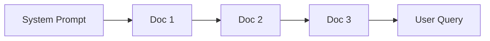

本記事は [arXiv:2312.03052 CacheBlend: Fast Large Language Model Serving for RAG with Cached Knowledge Fusion](https://arxiv.org/abs/2312.03052) の解説記事です。

なお、本論文の正式なarXiv IDは [2405.16444](https://arxiv.org/abs/2405.16444) に更新されており、ACM EuroSys 2025にてBest Paperを受賞した。以下の解説はEuroSys 2025採択版（v3, April 2025）に基づく。

## 論文概要（Abstract）

CacheBlendは、RAG（Retrieval-Augmented Generation）システムにおけるLLM推論のprefillボトルネックを解消する手法である。RAG入力には複数の検索文書が含まれるが、従来のprefix cachingでは先頭部分と一致するKVキャッシュのみ再利用可能であり、非プレフィックス位置に挿入された文書のKVキャッシュは再利用できなかった。CacheBlendは事前計算済みのKVキャッシュを位置に関係なく再利用し、cross-attentionの影響が大きいトークンのみを選択的に再計算（selective recomputation）することで、生成品質を維持しつつTTFTを大幅に短縮する。著者らは、3種のオープンソースLLMと4種のベンチマークデータセットで評価を行い、TTFTを2.2-3.3倍短縮し推論スループットを2.8-5倍向上させたと報告している。

この記事は [Zenn記事: プロンプトキャッシュの本番運用設計 — ヒット率7%→84%改善の実装パターン](https://zenn.dev/0h_n0/articles/80b83bf28e8353) の深掘りです。

## 情報源

- **arXiv ID**: 2405.16444（初期投稿: 2312.03052）
- **URL**: [https://arxiv.org/abs/2405.16444](https://arxiv.org/abs/2405.16444)
- **著者**: Jiayi Yao, Hanchen Li, Yuhan Liu, Siddhant Ray, Yihua Cheng, Qizheng Zhang, Kuntai Du, Shan Lu, Junchen Jiang（University of Chicago, Microsoft Research）
- **発表年**: 2024年（arXiv投稿）、2025年（ACM EuroSys 2025 Best Paper）
- **分野**: cs.DC, cs.AI, cs.CL
- **実装**: [LMCache](https://github.com/LMCache/LMCache)（vLLM統合）

## 背景と動機（Background & Motivation）

### RAGにおけるprefillボトルネック

RAGシステムでは、ユーザークエリに対して関連文書をベクトルデータベースから検索し、LLMのコンテキストとして入力する。典型的な構成は以下の通りである。



この入力に対するprefill処理では、すべてのトークンのKV（Key-Value）キャッシュを計算する必要がある。prefillの計算量は入力トークン数 $n$ に対して $O(n^2 \cdot d)$（$d$: 隠れ次元数）であり、検索文書の数が増えるほどTTFT（Time-to-First-Token）が増大する。

### 既存のprefix cachingの限界

SGLang、vLLM、RAGCacheなどが実装するprefix cachingは、入力の先頭から連続して一致するトークン列のKVキャッシュのみを再利用する。RAGシナリオでは検索結果の組み合わせがクエリごとに異なるため、先頭の文書以外のKVキャッシュは再利用できない。

この制約の根本原因は、Transformerの自己注意機構にある。あるトークン $t_j$ のKey/Value値は、それ以前のすべてのトークン $t_1, \ldots, t_{j-1}$ との注意計算に依存する。したがって、個別に事前計算したKVキャッシュをそのまま連結すると、cross-document attentionが欠落し、生成品質が劣化する。

著者らの実測によると、RAGワークロードにおけるprefix cachingのヒット率は10-30%程度にとどまると報告されている。CacheBlendはこの課題を、非プレフィックスKVキャッシュの選択的再計算によって解決する。

### なぜ単純なKVキャッシュ連結では失敗するか

論文では、Messi/Ronaldoの比較質問を用いた具体例で問題を示している（Figure 4）。2つの文書を個別に事前計算したKVキャッシュを単純に連結すると、文書間のcross-attentionパターンが失われ、LLMが誤った回答を生成する。位置エンコーディング（RoPE）を正しく適用しても、cross-attentionの欠落は解消されない。

## 主要な貢献（Key Contributions）

- **非プレフィックスKVキャッシュの選択的再計算**: 事前計算済みKVキャッシュを入力の任意の位置で再利用し、cross-attentionの影響が大きいトークン（全体の5-18%）のみを再計算する手法を提案した。これにより、RAGにおけるKVキャッシュヒット率を実質100%に引き上げた
- **パイプライン化による遅延隠蔽**: KVキャッシュのストレージからのロードと選択的再計算を層ごとにパイプライン実行し、I/O遅延を計算時間で隠蔽するスケジューリング機構を設計した。これにより、SSDなど低速なストレージにKVキャッシュを配置しても推論遅延が増加しない
- **EuroSys 2025 Best Paper**: ACM EuroSys 2025にて全投稿中のBest Paperとして採択された

## 技術的詳細（Technical Details）

### KVキャッシュの定義と偏差メトリクス

CacheBlendでは、以下の3種類のKVキャッシュを区別する。

- $\mathbf{KV}^{\text{full}}$: 全入力を通して完全にprefillした場合のKVキャッシュ（理想値）
- $\mathbf{KV}^{\text{pre}}$: 各文書を個別に事前計算したKVキャッシュ
- $\mathbf{KV}^{\text{new}}$: CacheBlendによる選択的再計算後のKVキャッシュ

各KVキャッシュは層 $i$ とトークン $j$ で添字付けされ、$\mathbf{KV}_i[j]$ と表記する。

**KV偏差（KV Deviation）** はトークンレベルで定義される:

$$
\Delta_{\text{KV}}(\mathbf{KV}_i, \mathbf{KV}_i^{\text{full}})[j] = \| \mathbf{KV}_i[j] - \mathbf{KV}_i^{\text{full}}[j] \|_2
$$

ここで、

- $\mathbf{KV}_i[j]$: 層 $i$、トークン $j$ における現在のKV値
- $\mathbf{KV}_i^{\text{full}}[j]$: 同位置における完全prefill時のKV値
- $\| \cdot \|_2$: L2ノルム

**注意偏差（Attention Deviation）** は層レベルで定義される:

$$
\Delta_{\text{attn}}(\mathbf{A}_i, \mathbf{A}_i^{\text{full}}) = \| \mathbf{A}_i - \mathbf{A}_i^{\text{full}} \|_2
$$

ここで、$\mathbf{A}_i$ は層 $i$ におけるAttention行列を表す。

CacheBlendの最適化目標は、各層の注意偏差を最小化することである:

$$
\min \sum_{i=1}^{L} \Delta_{\text{attn}}(\mathbf{A}_i^{\text{new}}, \mathbf{A}_i^{\text{full}})
$$

ここで $L$ はTransformerの総層数である。

### 選択的再計算（Selective Recomputation）

CacheBlendの中核技術は、層ごとに処理を行い、各層でKV偏差が大きいトークンのみを再計算するselective recomputationである。

各層での処理は以下の4ステップで構成される:

**Step 1 - 入力マスキング**: 選択されたトークンのみに入力を制限する

**Step 2 - Q/K/V変換**: 選択トークンのQuery、Key、Value値を計算する。Key/Valueは選択トークンのみで計算し、Queryは全トークンに対して計算する

**Step 3 - K/V展開**: 選択されなかったトークンの事前計算済みK/V値と、再計算されたK/V値を連結する

$$
\mathbf{K}_i^{\text{new}} = \text{Concat}(\mathbf{K}_i^{\text{pre}}[\bar{S}_i], \mathbf{K}_i^{\text{recomp}}[S_i])
$$

$$
\mathbf{V}_i^{\text{new}} = \text{Concat}(\mathbf{V}_i^{\text{pre}}[\bar{S}_i], \mathbf{V}_i^{\text{recomp}}[S_i])
$$

ここで、

- $S_i$: 層 $i$ で再計算対象として選択されたトークン集合
- $\bar{S}_i$: $S_i$ の補集合（再利用されるトークン）
- $\mathbf{K}_i^{\text{recomp}}[S_i]$: 選択トークンの再計算されたKey値
- $\mathbf{K}_i^{\text{pre}}[\bar{S}_i]$: 非選択トークンの事前計算済みKey値

**Step 4 - Attention計算**: 標準的なAttention計算を実行し、次の層の入力を生成する

この処理の計算コストは再計算トークン比率に比例する。すなわち、$r$%のトークンを再計算する場合、計算コストはフルprefillの約$r$%となる。

### HKVD（High KV Deviation）トークン選定

再計算対象トークンの選定は、CacheBlendの精度を左右する重要な要素である。論文では以下の2つの知見に基づく選定手法を提案している。

**知見1**: KV偏差が最大のトークンを再計算すると、注意偏差の減少量が最大化される。

**知見2**: KV偏差が大きいトークン（HKVD: High KV Deviation tokens）は連続する層間で高い相関を持つ。著者らはSpearman順位相関を用いてこの性質を検証している。

これらの知見に基づき、CacheBlendは **段階的フィルタリング（Gradual Filtering）** 方式を採用する:

1. **第1層**: $r_1$%のトークンを、トークンごとの注意偏差に基づいて選択する。$r_1$ は目標比率 $r$ よりやや大きく設定する
2. **第 $i$ 層** ($i \geq 2$): 前層で選択されたHKVDトークンのKV値を再計算し、新たなKV偏差に基づいて $r_i$%のトークンを選択する。$r_i$ は層が進むごとに $r$ に漸近する

この段階的フィルタリングにより、**複数の層にわたって一貫してKV偏差が大きいトークン** が選定される。

実装レベルでは、L2距離によるKV偏差計算は以下のように行われる:

```python
import torch
from typing import Tuple

def select_hkvd_tokens(
    k_cached: torch.Tensor,
    k_recomputed: torch.Tensor,
    recompute_ratio: float,
) -> Tuple[torch.Tensor, torch.Tensor]:
    """HKVD（High KV Deviation）トークンを選定する

    Args:
        k_cached: 事前計算済みKey値 (seq_len, d_k)
        k_recomputed: 再計算されたKey値 (seq_len, d_k)
        recompute_ratio: 再計算するトークンの比率 (0.0-1.0)

    Returns:
        top_indices: 選択されたトークンのインデックス
        diff_scores: 各トークンのKV偏差スコア
    """
    # L2距離によるKV偏差計算
    diff_k = torch.sum((k_recomputed - k_cached) ** 2, dim=-1)

    total_len = k_cached.shape[0]
    topk_num = max(int(total_len * recompute_ratio), 1)

    # 偏差が最大のトークンを選択
    top_values, top_indices = torch.topk(diff_k, topk_num)
    top_indices = top_indices.sort().values  # 位置順にソート

    return top_indices, diff_k
```

### パイプライン実行とロードコントローラ

CacheBlendは、KVキャッシュのストレージからのロードと選択的再計算を層ごとにパイプライン化する。層 $i$ のKVキャッシュをGPUにロードしている間に、前の層の選択的再計算を並列実行する。Python generatorベースの実装により、層 $i$ の計算中に層 $i+1$ のプリフェッチを非同期で行う。

**ロードコントローラ**は、再計算遅延とロード遅延のバランスに基づいて最適な再計算比率を決定する。

再計算遅延:

$$
T_{\text{recompute}}(r, \text{LLM}, L) = r \times T_{\text{prefill}}(\text{LLM}, L)
$$

ロード遅延:

$$
T_{\text{load}}(\text{LLM}, L, D) = \frac{\text{PerTokenKVSize}(\text{LLM}) \times L}{\text{Throughput}(D)}
$$

ここで、

- $r$: 再計算比率（0.0-1.0）
- $T_{\text{prefill}}$: フルprefill所要時間
- $L$: 入力トークン数
- $D$: ストレージデバイス
- $\text{PerTokenKVSize}$: 1トークンあたりのKVキャッシュサイズ
- $\text{Throughput}(D)$: ストレージデバイスのスループット

最適な再計算比率は以下のように決定される:

$$
r^{*} = \max\left(r_{\min}, \frac{T_{\text{load}}}{T_{\text{prefill}}}\right)
$$

ここで $r_{\min}$ は品質維持に必要な最小再計算比率であり、著者らの実験では $r_{\min} \approx 0.15$（15%）で十分と報告されている。

再計算遅延がロード遅延以上の場合、ロード時間は再計算時間に完全に隠蔽される。例えば、Llama-7Bの4Kトークンコンテキストでは、15%再計算で約3ms/層、NVME SSDからのロードで約16ms/層であり、ロード遅延が再計算時間に収まる構成では追加遅延がゼロとなる。

### RoPE（Rotary Position Embedding）との整合性

CacheBlendでは、事前計算時と異なる位置にKVキャッシュを挿入するため、位置エンコーディングの扱いが重要となる。RoPEにおける回転行列は以下の通りである:

$$
\mathbf{R}(m) = \begin{bmatrix} \cos(m\theta) & -\sin(m\theta) \\ \sin(m\theta) & \cos(m\theta) \end{bmatrix}
$$

ここで $m$ は絶対位置、$\theta_i = 10000^{-2i/d}$（$i \in [0, d/2-1]$）である。

RoPEの重要な性質として、Attentionスコアは絶対位置 $m$ ではなく相対距離 $l = m_q - m_k$ のみに依存する:

$$
\mathbf{q}_{m+l}^{\top} \mathbf{k}_{m} = \sum_{i} (q_{[2i]} k_{[2i]} + q_{[2i+1]} k_{[2i+1]}) \cos(l\theta_i)
$$

この性質により、事前計算時にRoPEの位置を正しく設定すれば、KVキャッシュの再利用時に位置エンコーディングを再適用する必要はない。CacheBlendでは事前計算時に各文書の開始位置を指定し、クエリ時の配置に対応した位置エンコーディングを適用している。

## 実装のポイント（Implementation）

### vLLM統合

CacheBlendは約3,000行のPython/PyTorchコードでvLLM上に実装されている。コアインターフェースは3つである:

1. **`fetch_kv(text, layer_id)`**: ストレージからKVキャッシュを読み込む
2. **`prefill_layer(input_dict, KVCache)`**: 部分的なprefill処理を実行する
3. **`synchronize()`**: GPUロードの同期を行う

### ストレージ管理

KVキャッシュの管理にはハッシュベースのテキスト検索を使用し、LRU（Least Recently Used）方式で容量管理を行う。バックグラウンドでCPUからSSDへの書き出しを`torch.save()`で実行する。

### チャンク境界の処理

プロンプト入力では、チャンク間に設定可能なセパレータ文字列（デフォルト: `" # # "`）を挿入する。LMCacheはこのセパレータを検出してチャンク境界を特定し、選択的再計算のロジックを適用する。

```
[SystemPrompt] [Separator] [Chunk1] [Separator] [Chunk2] [Separator] [Query]
```

### 設定パラメータ

| パラメータ | 用途 | デフォルト値 |
|:---|:---|:---|
| `enable_blending` | CacheBlend有効化フラグ | `False` |
| `blend_check_layers` | 偏差検出を行う層ID | `[1]` |
| `blend_recompute_ratios` | トークン再計算比率 | `[0.15]` |
| `blend_min_tokens` | ブレンディング発動の最小トークン数 | `256` |
| `blend_special_str` | チャンク境界セパレータ | `" # # "` |

### ハイパーパラメータ設定の指針

著者らの実験結果に基づく推奨設定:

- **再計算比率 15%**: ほとんどのモデル・データセットの組み合わせで品質劣化が無視できる水準となると報告されている
- **検出層は第1層**: 第1層のAttention偏差がHKVDトークンの初期選定に最適であると報告されている
- **最小トークン数 256**: これ以下の短い入力ではフルprefillのコストが小さいため、ブレンディングのオーバーヘッドが相対的に大きくなる

## Production Deployment Guide

CacheBlendはLMCacheライブラリを通じてvLLMに統合されており、本番環境への導入が可能な段階にある。以下では、RAGシステムでのKVキャッシュ融合をAWS上でデプロイする構成を示す。

### AWS実装パターン（コスト最適化重視）

**トラフィック量別の推奨構成**:

| 構成 | トラフィック | インフラ | 月額概算 |
|:---|:---|:---|:---|
| Small | ~100 req/日 | Lambda + Bedrock + ElastiCache | $150-300 |
| Medium | ~1,000 req/日 | ECS Fargate + vLLM + EFS | $800-2,000 |
| Large | 10,000+ req/日 | EKS + Spot GPU + LMCache + NVMe | $5,000-15,000 |

**Small構成（~100 req/日）**: Lambda関数からBedrock（Claude/Titan）を呼び出す構成。KVキャッシュの永続化にはElastiCache（Redis）を使用する。Bedrockのプロンプトキャッシュ機能を併用することでコストを30-90%削減可能。月額$150-300程度。

**Medium構成（~1,000 req/日）**: ECS Fargate上でvLLM + LMCacheコンテナを稼働させる構成。KVキャッシュの共有ストレージにはEFS（Elastic File System）を使用する。Auto Scalingにより負荷に応じてタスク数を調整する。月額$800-2,000程度。

**Large構成（10,000+ req/日）**: EKS上でGPUインスタンス（g5.xlarge/g5.2xlarge）のSpot Instancesを活用し、Karpenterで自動スケーリングを行う構成。LMCacheのSSDバックエンドとしてインスタンスストアNVMeを使用する。月額$5,000-15,000程度。

注意: 上記コスト試算は2026年4月時点のAWS東京リージョン（ap-northeast-1）料金に基づく概算値であり、実際のコストはトラフィックパターン、インスタンスタイプの可用性、Spot価格変動により変動する。最新料金はAWS Pricing Calculatorで確認されたい。

**コスト削減テクニック**:

- **Spot Instances**: GPU Spot（g5.xlarge）で最大90%削減。ただし中断リスクがあるため、Karpenterのfallback設定でOn-Demand混在を推奨
- **Reserved Instances**: 1年コミットで最大72%削減。ベースライン負荷分をRI購入し、バースト分をSpotで対応
- **Prompt Caching**: Bedrockのプロンプトキャッシュで30-90%のトークンコスト削減
- **KVキャッシュのストレージ階層化**: GPU VRAM → CPU RAM → NVMe SSD → EBSの順にコスト/レイテンシのトレードオフを最適化

### Terraformインフラコード

**Small構成（Serverless: Lambda + Bedrock + ElastiCache）**:

```hcl
# CacheBlend RAG - Small構成 | 2026-04 ap-northeast-1
terraform {
  required_version = ">= 1.9"
  required_providers {
    aws = { source = "hashicorp/aws", version = "~> 5.70" }
  }
}
provider "aws" { region = "ap-northeast-1" }

# VPC（NAT Gateway不使用でコスト削減、VPCエンドポイント経由）
resource "aws_vpc" "main" {
  cidr_block           = "10.0.0.0/16"
  enable_dns_hostnames = true
}
resource "aws_subnet" "private" {
  count             = 2
  vpc_id            = aws_vpc.main.id
  cidr_block        = cidrsubnet("10.0.0.0/16", 8, count.index)
  availability_zone = data.aws_availability_zones.az.names[count.index]
}
data "aws_availability_zones" "az" { state = "available" }

resource "aws_vpc_endpoint" "bedrock" {
  vpc_id            = aws_vpc.main.id
  service_name      = "com.amazonaws.ap-northeast-1.bedrock-runtime"
  vpc_endpoint_type = "Interface"
  subnet_ids        = aws_subnet.private[*].id
  private_dns_enabled = true
}

# ElastiCache（KVキャッシュ永続化: Redis 7.1, r7g.large 13GB RAM）
resource "aws_elasticache_replication_group" "kv_cache" {
  replication_group_id       = "cacheblend-kv"
  description                = "KV cache store for CacheBlend RAG"
  engine                     = "redis"
  engine_version             = "7.1"
  node_type                  = "cache.r7g.large"
  num_cache_clusters         = 1
  at_rest_encryption_enabled = true
  transit_encryption_enabled = true
}

# Lambda（最小権限IAM: Bedrock InvokeModelのみ許可）
resource "aws_iam_role" "lambda" {
  name = "cacheblend-lambda"
  assume_role_policy = jsonencode({
    Version = "2012-10-17"
    Statement = [{ Action = "sts:AssumeRole", Effect = "Allow",
      Principal = { Service = "lambda.amazonaws.com" } }]
  })
}
resource "aws_iam_role_policy" "bedrock" {
  role = aws_iam_role.lambda.id
  policy = jsonencode({
    Version = "2012-10-17"
    Statement = [{ Effect = "Allow",
      Action   = ["bedrock:InvokeModel", "bedrock:InvokeModelWithResponseStream"],
      Resource = "arn:aws:bedrock:ap-northeast-1::foundation-model/*" }]
  })
}
resource "aws_lambda_function" "rag" {
  function_name = "cacheblend-rag"
  runtime       = "python3.12"
  handler       = "handler.lambda_handler"
  role          = aws_iam_role.lambda.arn
  timeout       = 300
  memory_size   = 1024
  filename      = "lambda.zip"
  environment {
    variables = {
      REDIS_ENDPOINT = aws_elasticache_replication_group.kv_cache.primary_endpoint_address
      CACHE_TTL      = "3600"
    }
  }
  vpc_config {
    subnet_ids         = aws_subnet.private[*].id
    security_group_ids = [aws_security_group.lambda.id]
  }
}
resource "aws_security_group" "lambda" {
  vpc_id = aws_vpc.main.id
  egress { from_port = 0; to_port = 0; protocol = "-1"; cidr_blocks = ["0.0.0.0/0"] }
}
```

**Large構成（Container: EKS + Spot GPU + LMCache）**:

```hcl
# CacheBlend RAG - Large構成 | 2026-04 ap-northeast-1
module "eks" {
  source          = "terraform-aws-modules/eks/aws"
  version         = "~> 20.0"
  cluster_name    = "cacheblend-rag"
  cluster_version = "1.31"
  vpc_id          = aws_vpc.main.id
  subnet_ids      = aws_subnet.private[*].id
  cluster_endpoint_public_access = false
}

# Karpenter NodePool（Spot優先、On-Demandフォールバック）
resource "kubectl_manifest" "gpu_nodepool" {
  yaml_body = yamlencode({
    apiVersion = "karpenter.sh/v1"
    kind       = "NodePool"
    metadata   = { name = "gpu-spot" }
    spec = {
      template.spec = {
        requirements = [
          { key = "node.kubernetes.io/instance-type", operator = "In",
            values = ["g5.xlarge", "g5.2xlarge", "g5.4xlarge"] },
          { key = "karpenter.sh/capacity-type", operator = "In",
            values = ["spot", "on-demand"] },
        ]
        nodeClassRef = { group = "karpenter.k8s.aws", kind = "EC2NodeClass", name = "gpu" }
      }
      limits     = { cpu = "128", "nvidia.com/gpu" = "16" }
      disruption = { consolidationPolicy = "WhenEmptyOrUnderutilized" }
    }
  })
}

# LMCache設定（Secrets Manager）
resource "aws_secretsmanager_secret" "lmcache" {
  name = "cacheblend-rag/lmcache-config"
}
resource "aws_secretsmanager_secret_version" "lmcache" {
  secret_id     = aws_secretsmanager_secret.lmcache.id
  secret_string = jsonencode({
    enable_blending        = true
    blend_recompute_ratios = [0.15]
    blend_min_tokens       = 256
  })
}

# AWS Budgets（月額上限80%でアラート）
resource "aws_budgets_budget" "monthly" {
  name         = "cacheblend-rag-monthly"
  budget_type  = "COST"
  limit_amount = "15000"
  limit_unit   = "USD"
  time_unit    = "MONTHLY"
  notification {
    comparison_operator        = "GREATER_THAN"
    notification_type          = "ACTUAL"
    threshold                  = 80
    threshold_type             = "PERCENTAGE"
    subscriber_email_addresses = ["ops-team@example.com"]
  }
}
```

### 運用・監視設定

**CloudWatch Logs Insights クエリ**:

```
# コスト異常検知（1時間あたりトークン使用量）
fields @timestamp, @message
| filter @message like /token_usage/
| stats sum(input_tokens) as total_input, sum(output_tokens) as total_output,
        count(*) as request_count by bin(1h)

# レイテンシ分析（TTFT P95/P99 + 再計算比率）
fields @timestamp, ttft_ms, recompute_ratio
| stats avg(ttft_ms) as avg_ttft, pctile(ttft_ms, 95) as p95_ttft,
        pctile(ttft_ms, 99) as p99_ttft by bin(5m)
```

**CloudWatchアラーム + X-Ray設定（Python boto3）**:

```python
import boto3
from aws_xray_sdk.core import xray_recorder, patch_all
from datetime import datetime, timedelta

patch_all()  # boto3自動計装

def setup_cacheblend_alarms(function_name: str, sns_topic_arn: str) -> None:
    """TTFT P95アラームとキャッシュヒット率アラームを設定する"""
    cw = boto3.client("cloudwatch", region_name="ap-northeast-1")
    for name, metric, threshold, op in [
        ("ttft-p95-high", "TTFT_P95", 5000, "GreaterThanThreshold"),
        ("cache-hit-low", "CacheHitRate", 50, "LessThanThreshold"),
    ]:
        cw.put_metric_alarm(
            AlarmName=f"{function_name}-{name}",
            MetricName=metric, Namespace="CacheBlend/RAG",
            Statistic="Average", Period=300, EvaluationPeriods=3,
            Threshold=threshold, ComparisonOperator=op,
            AlarmActions=[sns_topic_arn],
        )

@xray_recorder.capture("cacheblend_rag_query")
def handle_rag_query(query: str, documents: list[str]) -> str:
    """RAGクエリ処理（X-Rayアノテーション付き）"""
    seg = xray_recorder.current_subsegment()
    seg.put_annotation("doc_count", len(documents))
    kv_caches = load_cached_kvs(documents)
    seg.put_annotation("cache_hit", len(kv_caches))
    response = run_inference_with_cacheblend(query, kv_caches)
    seg.put_metadata("ttft_ms", response.ttft_ms)
    return response.text

def daily_cost_report(sns_topic_arn: str, threshold_usd: float = 500.0) -> None:
    """日次コストレポート: 閾値超過でSNS通知"""
    ce = boto3.client("ce", region_name="us-east-1")
    today = datetime.utcnow().strftime("%Y-%m-%d")
    yesterday = (datetime.utcnow() - timedelta(days=1)).strftime("%Y-%m-%d")
    result = ce.get_cost_and_usage(
        TimePeriod={"Start": yesterday, "End": today},
        Granularity="DAILY", Metrics=["UnblendedCost"],
        Filter={"Tags": {"Key": "Service", "Values": ["cacheblend-rag"]}},
        GroupBy=[{"Type": "DIMENSION", "Key": "SERVICE"}],
    )
    total = sum(
        float(g["Metrics"]["UnblendedCost"]["Amount"])
        for r in result["ResultsByTime"] for g in r["Groups"]
    )
    if total > threshold_usd:
        boto3.client("sns", region_name="ap-northeast-1").publish(
            TopicArn=sns_topic_arn,
            Subject=f"[ALERT] CacheBlend RAG daily cost: ${total:.2f}",
            Message=f"Daily cost ${total:.2f} exceeded threshold ${threshold_usd}.",
        )
```

### コスト最適化チェックリスト

**アーキテクチャ選択**:

- [ ] トラフィック量に応じた構成を選択（Small: Serverless / Medium: Hybrid / Large: Container）
- [ ] KVキャッシュのストレージ階層を決定（GPU VRAM > CPU RAM > NVMe SSD > EBS）
- [ ] マルチAZ構成の必要性を判断（SLA要件に基づく）

**リソース最適化**:

- [ ] GPU Spot Instances優先（g5.xlarge: 最大90%削減）
- [ ] ベースライン負荷分にReserved Instances購入（最大72%削減）
- [ ] Savings Plans検討（1年/3年コミット）
- [ ] Lambda: メモリサイズ最適化（1024MB推奨、AWS Lambda Power Tuningで検証）
- [ ] ECS/EKS: アイドル時のスケールダウン（Karpenter consolidation設定）

**LLMコスト削減**:

- [ ] Bedrock Prompt Caching有効化（30-90%削減）
- [ ] CacheBlendの再計算比率を15%に設定（品質維持の最小比率）
- [ ] Bedrock Batch API使用（非リアルタイム処理で50%削減）
- [ ] モデル選択ロジック（簡易クエリにHaiku、複雑クエリにSonnet）
- [ ] トークン数制限（max_tokens設定で無駄な生成を防止）

**監視・アラート**:

- [ ] AWS Budgets設定（月額上限の80%でアラート）
- [ ] CloudWatch TTFT P95アラーム
- [ ] CloudWatch キャッシュヒット率アラーム
- [ ] Cost Anomaly Detection有効化
- [ ] 日次コストレポート自動送信

**リソース管理**:

- [ ] 未使用のKVキャッシュ自動削除（TTLベースのLRU）
- [ ] タグ戦略（`Service: cacheblend-rag` 統一タグ）
- [ ] EBSスナップショットのライフサイクルポリシー
- [ ] 開発環境の夜間自動停止（EventBridge + Lambda）
- [ ] S3ストレージクラス最適化（Intelligent-Tiering）

## 実験結果（Results）

### 評価環境

著者らは以下の環境で評価を行っている:

- **モデル**: Mistral-7B、Yi-34B（8-bit量子化）、Llama-70B（8-bit量子化）
- **GPU**: 2x NVIDIA A40（48GB VRAM each）、128GB CPU RAM、1TB NVMe SSD（4.8 GB/s）
- **チャンク設定**: 512トークンチャンク、ランダム検索順序

### ベンチマークデータセット

| データセット | タスク種別 | サンプル数 | 評価指標 |
|:---|:---|:---|:---|
| 2WikiMQA | Multi-hop QA | 200 | F1-score |
| Musique | Multi-hop推論 | 150 | F1-score |
| SAMSum | 対話要約 | 200 | ROUGE-L |
| MultiNews | マルチ文書要約 | 60 | ROUGE-L |

### TTFT改善

著者らは、CacheBlendがフルKV再計算と比較してTTFTを2.2-3.3倍短縮したと報告している。また推論スループットは2.8-5倍向上したとされる。

### 生成品質

著者らの報告によると、品質劣化は以下の範囲に収まっている:

- **F1-score**（Musique、2WikiMQA）: フルprefillとの差は0.02以内
- **ROUGE-L**（MultiNews、SAMSum）: フルprefillとの差は0.01以内

一方、KVキャッシュを再計算なしで単純連結した場合（Full KV Reuse）と比較すると:

- **F1-score**: CacheBlendが0.1-0.2ポイント優位
- **ROUGE-L**: CacheBlendが0.03-0.25ポイント優位

これらの結果は、選択的再計算がcross-document attentionの復元に有効であることを示唆している。

### 再計算比率の影響

著者らの実験では、再計算比率5-18%の範囲で品質劣化が無視できる水準に収まると報告されている。15%の再計算比率が品質と速度のバランスが最も良い設定点であるとされている。

## 実運用への応用（Practical Applications）

### RAGシステムでのKVキャッシュ活用

CacheBlendの実運用上の最大の利点は、RAGにおけるKVキャッシュヒット率を実質100%に引き上げられる点である。従来のprefix cachingではクエリごとに検索文書の組み合わせが変わるためヒット率が低かったが、CacheBlendでは各文書のKVキャッシュを個別に事前計算・保存し、任意の組み合わせで再利用できる。

Zenn記事「プロンプトキャッシュの本番運用設計」で述べられているキャッシュヒット率改善の設計パターンと照らし合わせると、CacheBlendはprefix matchingに依存しないため、ドキュメントの順序やプロンプト構成の制約から解放される。

**適用が特に効果的なシナリオ**:

- **社内FAQ/ナレッジベース**: 同一文書群が繰り返し参照されるため、事前計算のROIが高い
- **マルチステップRAG**: 複数回の検索を行うパイプラインで、各ステップのKVキャッシュを再利用できる
- **長文コンテキストRAG**: 10文書以上を入力する場合、prefillコストの削減効果が顕著

**導入時の考慮事項**:

- 文書が頻繁に更新される場合、KVキャッシュの無効化管理が必要となる
- 事前計算のコストとストレージコスト（1トークンあたり数百バイト x 層数）を事前に見積もる必要がある
- 極端に長い文書（数万トークン）では、cross-attentionの欠落による精度影響が拡大する可能性がある

## 関連研究（Related Work）

- **Prompt Cache（MLSys 2024）**: 推論リクエスト間で再利用可能なAttention stateを識別・キャッシュする手法。CacheBlendとの違いは、Prompt Cacheがテキストセグメント単位でのprefix matchingに依存するのに対し、CacheBlendは非プレフィックス位置でも再利用可能な点にある
- **SGLang RadixAttention**: ラディックスツリーを用いた効率的なprefix matchingによるKVキャッシュ管理。CacheBlendはRadixAttentionのprefix matchingでカバーできない非プレフィックスチャンクを補完する位置づけとなる
- **vLLM PagedAttention**: KVキャッシュのメモリ管理を仮想メモリのページング機構に類似した方式で効率化する手法。CacheBlendはvLLM上に実装されており、PagedAttentionと相補的に動作する
- **H2O / ScissorHands / CacheGen**: KVキャッシュのサイズ圧縮に焦点を当てた手法群。CacheBlendの再利用戦略とは直交する技術であり、併用が可能である
- **ProphetKV（2025）**: CacheBlendの後続研究で、ユーザークエリを利用してより精度の高い再計算トークン選定を行う手法。CacheBlendがクエリ非依存で事前計算できる利点と、ProphetKVのクエリ依存型精度改善はトレードオフの関係にある

## まとめと今後の展望

CacheBlendは、RAGシステムにおけるKVキャッシュの再利用を非プレフィックス位置にまで拡張し、選択的再計算によって品質を維持しつつTTFTを2.2-3.3倍短縮する手法である。EuroSys 2025 Best Paperの受賞は、この手法がシステム研究コミュニティから高い評価を受けたことを示している。

今後の研究方向として、著者らのグループはLMCacheプロジェクトを通じて以下の展開を進めている:

- **vLLM Production Stackへの統合**: Kubernetes環境でのスケーラブルな運用を可能にするvLLM Production Stackへの組み込みが進行中である
- **クエリ依存型の再計算トークン選定**: ProphetKVなどの後続研究で、クエリ情報を活用したより精度の高いトークン選定が提案されている
- **分散KVキャッシュストア**: 複数ノード間でKVキャッシュを共有する分散ストレージの最適化

## 参考文献

- **arXiv**: [https://arxiv.org/abs/2405.16444](https://arxiv.org/abs/2405.16444)
- **ACM Digital Library**: [https://dl.acm.org/doi/10.1145/3689031.3696098](https://dl.acm.org/doi/10.1145/3689031.3696098)
- **LMCache（実装）**: [https://github.com/LMCache/LMCache](https://github.com/LMCache/LMCache)
- **LMCache Blog（EuroSys 2025 Best Paper）**: [https://blog.lmcache.ai/en/2025/03/31/cacheblend-best-paper-acm-eurosys25-enabling-100-kv-cache-hit-rate-in-rag/](https://blog.lmcache.ai/en/2025/03/31/cacheblend-best-paper-acm-eurosys25-enabling-100-kv-cache-hit-rate-in-rag/)
- **vLLM Production Stack**: [https://github.com/vllm-project/production-stack](https://github.com/vllm-project/production-stack)
- **Related Zenn article**: [https://zenn.dev/0h_n0/articles/80b83bf28e8353](https://zenn.dev/0h_n0/articles/80b83bf28e8353)
