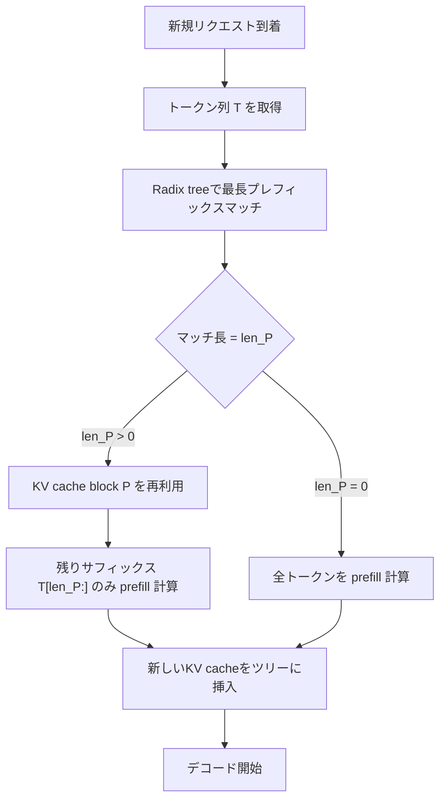
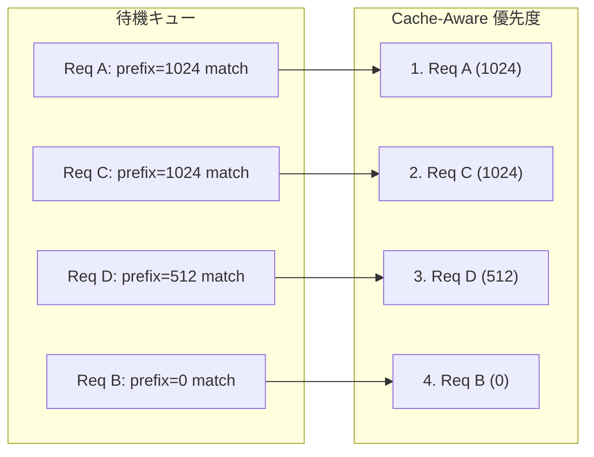

本記事は [arXiv:2312.07104 Efficiently Programming Large Language Models using SGLang](https://arxiv.org/abs/2312.07104) の解説記事です。

## 論文概要（Abstract）

SGLangは、大規模言語モデル（LLM）アプリケーションを効率的に実行するためのシステムである。フロントエンド言語とランタイムの2層で構成され、ランタイム側の中核技術として **RadixAttention** を導入している。RadixAttentionはKV cacheをradix tree（基数木）で管理し、異なるリクエスト間でプレフィックスのKV cacheを自動的に共有する仕組みである。著者らは、エージェント制御・論理推論・few-shot学習・JSON構造化出力・RAGパイプラインなど多様なタスクにおいて、最大6.4倍のスループット向上を報告している。本論文はNeurIPS 2024に採択された。

この記事は [Zenn記事: プロンプトキャッシュの本番運用設計 --- ヒット率7%→84%改善の実装パターン](https://zenn.dev/0h_n0/articles/80b83bf28e8353) の深掘りです。

## 情報源

- **arXiv ID**: 2312.07104
- **URL**: [https://arxiv.org/abs/2312.07104](https://arxiv.org/abs/2312.07104)
- **著者**: Lianmin Zheng, Liangsheng Yin, Zhiqiang Xie, et al.（UC Berkeley, Stanford等）
- **発表年**: 2023（初版）、2024（v2改訂、NeurIPS 2024採択）
- **分野**: cs.AI, cs.PL（人工知能、プログラミング言語）
- **ライセンス**: Apache 2.0（[GitHub: sgl-project/sglang](https://github.com/sgl-project/sglang)）

## 背景と動機（Background & Motivation）

### PagedAttentionの限界

vLLMが導入したPagedAttentionは、KV cacheを固定サイズのページに分割して非連続メモリ管理を実現し、GPU メモリの断片化を60-80%から4%未満に削減した画期的な手法である。しかし、PagedAttentionはあくまで **単一リクエスト内** のKV cacheメモリ管理を効率化するものであり、リクエスト完了後にそのKV cacheは破棄される。

### リクエスト間KV共有の必要性

実運用のLLMサービングでは、以下のようにリクエスト間でプロンプトが大部分を共有するケースが頻繁に発生する。

- **システムプロンプト**: 全リクエストで同一の2,000-10,000トークンが共通
- **few-shot例**: MMLUなど評価時に同一の5-shot例を全問で共有
- **マルチターン対話**: 前ターンまでの会話履歴がプレフィックスとして共有
- **RAGパイプライン**: 同一ドキュメントに対する複数クエリ

これらのケースでPagedAttentionを使うと、同一プレフィックスのKV cacheを毎回再計算することになり、大量のGPU計算資源が無駄になる。著者らは、この「リクエスト間でのKV cache再利用」をコード変更なしで自動化する仕組みとしてRadixAttentionを提案した。

## 主要な貢献（Key Contributions）

著者らが報告している主要な貢献は以下の3点である。

1. **RadixAttention**: radix treeベースのKV cache自動管理・共有機構。リクエスト間で共通プレフィックスのKV cacheを自動検出・再利用し、prefill計算を大幅に削減する。
2. **SGLangフロントエンド言語**: LLMプログラミングのための埋め込みドメイン固有言語（eDSL）。生成プリミティブ（`gen`）、フォーク（`fork`）、選択（`select`）などの制御構造を提供し、複雑なLLMワークフローを簡潔に記述できるようにする。
3. **圧縮有限状態機械（Compressed FSM）**: JSON Schemaなどの構造化出力制約を効率的にデコードするための最適化手法。

本記事ではRadixAttentionを中心に解説する。

## 技術的詳細（Technical Details）

### Radix Tree（基数木）の基礎

radix tree（Patricia trie とも呼ばれる）は、通常のtrie（前缀木）の空間効率を改善したデータ構造である。trieでは各ノードが1文字（1トークン）に対応するのに対し、radix treeではエッジに **可変長のトークン列** をラベル付けできる。これにより、共通プレフィックスが多い場合にノード数を大幅に削減できる。

RadixAttentionでは、このradix treeの各ノードがトークン列とそれに対応するKV cacheテンソルへのポインタを保持する。

```
radix tree の概念図:

root
├── [system prompt tokens: 2048個] → KV cache block A
│   ├── [user query 1 tokens: 128個] → KV cache block B
│   │   └── [assistant response 1: 256個] → KV cache block C
│   └── [user query 2 tokens: 96個] → KV cache block D
└── [few-shot examples: 1024個] → KV cache block E
    ├── [test input 1: 64個] → KV cache block F
    └── [test input 2: 48個] → KV cache block G
```

上の例では、system promptのKV cache（block A）はuser query 1とuser query 2の両方で共有され、few-shot examplesのKV cache（block E）はtest input 1とtest input 2で共有される。

### メモリレイアウト

KV cacheテンソルはGPU上で **ページ化された非連続メモリ** に格納される。論文によると、1ページのサイズは1トークン分のKV cacheに相当する。具体的には、あるモデルの1トークンあたりのKV cacheメモリ使用量は以下の式で計算できる。

$$
M_{\text{token}} = 2 \times n_{\text{layers}} \times n_{\text{heads}} \times d_{\text{head}} \times \text{sizeof}(\text{dtype})
$$

ここで：
- $2$: Key と Value の2種類
- $n_{\text{layers}}$: Transformerレイヤー数
- $n_{\text{heads}}$: KV headの数（GQAの場合はKVグループ数）
- $d_{\text{head}}$: 各headの次元数
- $\text{sizeof}(\text{dtype})$: データ型のバイト数（FP16なら2バイト、FP8なら1バイト）

例えば、Llama-2-7B（32層、32 KV heads、head次元128、FP16）の場合：

$$
M_{\text{token}} = 2 \times 32 \times 32 \times 128 \times 2 = 524{,}288 \text{ bytes} \approx 0.5 \text{ MB/token}
$$

2,048トークンのシステムプロンプトをキャッシュすれば、各リクエストで約1 GBのKV cache再計算を回避できる計算となる。

### プレフィックスマッチングアルゴリズム

新しいリクエストが到着した際のRadixAttentionの動作は以下の手順で行われる。



radix treeでの最長プレフィックスマッチの計算量は $O(\|T\|)$（入力トークン列の長さに線形）である。ただし、実際のツリー探索はトークンIDの比較で行われるため、定数係数は小さい。

この処理において重要な点は、**フロントエンドは常にフルプロンプトをランタイムに送信し、ランタイムが自動的にプレフィックスマッチングを行う**ことである。アプリケーション側でのキャッシュ管理は不要であり、これが「自動プレフィックスキャッシュ」と呼ばれる所以である。

### LRUベースのEviction Policy

GPU メモリが飽和した場合、radix treeのノードを削除してメモリを解放する必要がある。RadixAttentionはLRU（Least Recently Used）ベースのeviction policyを採用しており、具体的には **Leaf-LRU** と呼ばれる戦略を用いる。

**Leaf-LRUの動作原理**:

1. eviction対象は **leaf node（葉ノード）のみ** に限定する
2. 葉ノードの中で最も最近使われていないものを削除する
3. 葉ノードが削除されると、その親ノードが新たな葉ノードになる場合がある
4. 必要に応じてステップ2-3を再帰的に繰り返す

```python
# Leaf-LRUの擬似コード
def evict_kv_cache(radix_tree, required_pages: int) -> int:
    """
    必要なページ数分のメモリを解放する。
    戻り値: 実際に解放したページ数。
    """
    freed = 0
    while freed < required_pages:
        # 葉ノードの中でLRUなものを取得
        leaf = radix_tree.get_lru_leaf()
        if leaf is None:
            break  # evict可能なノードがない
        if leaf.ref_count > 0:
            continue  # 実行中リクエストが参照中のノードはスキップ

        freed += leaf.num_pages
        parent = leaf.parent
        radix_tree.remove(leaf)
        release_gpu_pages(leaf.kv_pages)

        # 親が新たな葉になった場合、LRUキューに追加
        if parent is not None and parent.is_leaf():
            radix_tree.lru_queue.append(parent)
    return freed
```

この設計により、共通プレフィックス（親ノード）は多くのリクエストから参照されるため最後まで保持され、使用頻度の低い末端のキャッシュから優先的に削除される。

論文では、LRU以外にもLFU（Least Frequently Used）、FIFO、Priority-basedなどのevictionポリシーをサポートしていることが述べられている。SGLangの起動時に`--radix-eviction-policy`フラグで切り替え可能である。

### Cache-Aware Scheduling

RadixAttentionのもう一つの重要な要素が、キャッシュヒット率を最大化するスケジューリング戦略である。

通常のFCFS（First-Come, First-Served）スケジューリングでは、到着順にリクエストを処理するため、同じプレフィックスを持つリクエストが時間的に分散して到着した場合、その間に別のリクエストのKV cacheでキャッシュが埋まり、evictionが発生する可能性がある。

SGLangのcache-aware schedulerは、待機キュー内のリクエストを処理する際に、**現在のradix treeとの最長プレフィックスマッチ長が大きいリクエストを優先的にスケジューリング**する。これにより、同じプレフィックスを共有するリクエストをバッチ内でまとめて処理し、キャッシュヒット率を向上させる。



この手法は、特にバッチ内でのプレフィックス検出にも適用される。同一バッチ内に共通プレフィックスを持つリクエストが含まれる場合、先にプレフィックス部分を処理してキャッシュに格納し、後続リクエストがそのキャッシュを即座に再利用できるようにする。

## 実装のポイント

### SGLangのAPI設計

SGLangは、LLMプログラミングのためのPythonベースのeDSL（embedded Domain Specific Language）を提供する。`@sgl.function` デコレータで定義した関数内で `sgl.gen()`、`sgl.system()`、`sgl.user()` 等のプリミティブを使ってプロンプトを構築する。RadixAttentionの特筆すべき点は、これらのコードに **キャッシュ管理のためのコードを一切追加する必要がない** ことである。ランタイムが自動的にプレフィックスの一致を検出し、KV cacheを再利用する。

### vLLMからの移行パターン

SGLangはOpenAI互換APIを提供しているため、既存のvLLMベースのサービングからの移行は `python -m sglang.launch_server --model-path <model> --port 8000` での起動とエンドポイントURL変更のみで完了する。RadixAttentionによるプレフィックスキャッシュは自動的に有効化される。

### 主要な設定パラメータ

SGLangの起動時に指定可能な、RadixAttention関連の主要パラメータは以下の通りである。

| パラメータ | デフォルト | 説明 |
|:---|:---|:---|
| `--mem-fraction-static` | 0.9 | KV cacheに割り当てるGPUメモリの割合 |
| `--radix-eviction-policy` | lru | evictionポリシー（lru/lfu/fifo/priority） |
| `--chunked-prefill-size` | 8192 | 1回のprefillで処理する最大トークン数 |
| `--page-size` | 1 | ページサイズ（トークン数）。アライメント調整に使用 |
| `--disable-radix-cache` | false | RadixAttentionを無効化 |

## Production Deployment Guide

### 1. ハードウェア要件とキャパシティプランニング

RadixAttentionを本番環境で最大限に活用するためには、KV cacheのメモリ容量が十分であることが前提条件となる。キャッシュ容量が不足するとevictionが頻発し、ヒット率が低下するためである。

**KV cacheメモリ要件の見積もり**:

同時にキャッシュ可能なトークン数 $N_{\text{cached}}$ は以下で概算できる。

$$
N_{\text{cached}} = \frac{M_{\text{GPU}} \times r_{\text{kv}}}{M_{\text{token}}}
$$

ここで：
- $M_{\text{GPU}}$: GPU総メモリ（例: A100 80GB）
- $r_{\text{kv}}$: KV cacheに割り当てる割合（`--mem-fraction-static`、デフォルト0.9からモデルウェイト分を除く）
- $M_{\text{token}}$: 前述の1トークンあたりKV cacheメモリ量

例えば、A100 80GBでLlama-2-7B（モデルウェイト約14GB FP16）を運用する場合：

$$
N_{\text{cached}} = \frac{(80 - 14) \times 0.9}{0.5 \times 10^{-3}} \approx 118{,}800 \text{ tokens}
$$

2,048トークンのシステムプロンプト + 平均512トークンのユーザーインタラクションを想定すると、約46セッション分のKV cacheを同時保持できる計算となる。

### 2. evictionポリシーの選択指針

本番ワークロードに応じたevictionポリシーの選択は、キャッシュヒット率に直結する。

| ワークロード | 推奨ポリシー | 理由 |
|:---|:---|:---|
| チャットボット（固定システムプロンプト） | LRU | システムプロンプトは常にアクセスされるためLRUで自然に保持 |
| RAG（多ドキュメント） | LRU or LFU | 頻繁に参照されるドキュメントのキャッシュを優先保持 |
| バッチ評価（MMLU等） | LRU | few-shot例が全リクエストで共有されるため最適 |
| マルチテナント | Priority | テナントごとの優先度制御が必要 |

### 3. マルチテナント環境でのKV cache isolation

マルチテナント環境では、テナントAのKV cacheがテナントBのリクエストで参照可能になる **KV cache leakage** のリスクに注意が必要である。SGLangでは `extra_key` パラメータによるネームスペース分離が提供されている。

```python
# マルチテナント環境でのKV cache分離設定例
import sglang as sgl

@sgl.function
def tenant_isolated_inference(s, tenant_id: str, prompt: str):
    """
    テナントIDでKV cacheネームスペースを分離。
    異なるテナント間でKV cacheが共有されないことを保証する。
    """
    # extra_keyにテナントIDを含めることで
    # 同一プレフィックスでもテナント間でキャッシュが分離される
    s += sgl.system(
        prompt,
        cache_params={"extra_key": f"tenant:{tenant_id}"}
    )
    s += sgl.gen("response", max_tokens=1024)
```

### 4. モニタリングとキャッシュヒット率の計測

本番運用ではキャッシュヒット率の継続的な計測が不可欠である。SGLangの `/get_server_info` エンドポイントから `hit_rate`、`num_cached_tokens`、`num_evictions` 等のメトリクスが取得可能である。

$$
\text{hit\_rate} = \frac{N_{\text{cached\_tokens}}}{N_{\text{total\_tokens}}}
$$

ワークロード別の期待キャッシュヒット率の目安（SGLang公式ドキュメントより）:

| ワークロード | 期待ヒット率 |
|:---|:---|
| RAGアプリケーション | 80-95% |
| Few-shotプロンプト | 70-90% |
| マルチターン対話 | 60-80% |
| 多様なクエリ（プレフィックス共有なし） | 20-40% |

### 5. パフォーマンスチューニングのベストプラクティス

本番環境で高いキャッシュヒット率を維持するための実践的な指針を以下にまとめる。

**プロンプト設計**:
- システムプロンプトをプロンプト先頭に配置し、固定長にする
- few-shot例の順序を固定する（順序が変わるとキャッシュミスになる）
- 動的要素（タイムスタンプ等）はプロンプト末尾に配置する

**インフラ設計**:
- `--mem-fraction-static` を可能な限り高く設定する（推奨: 0.85-0.92）
- `--chunked-prefill-size` をGPUメモリに応じて調整する
- 同一プレフィックスを持つリクエストを同一サーバーにルーティングする（システムプロンプトのハッシュ値による一貫性ハッシュベースのロードバランシング）

### 6. 制約と注意点

RadixAttentionの本番運用にあたって認識すべき制約を以下に整理する。

- **厳密なトークン一致が必要**: 1トークンでも異なるとキャッシュミスになる。プロンプトテンプレートのわずかな変更（空白の追加等）でもヒット率が低下する。
- **radix treeのメモリオーバーヘッド**: ツリー構造自体がGPUメモリの10-20%程度を消費する場合がある。
- **短い動的プロンプト**: プレフィックス共有がない場合、RadixAttentionの恩恵は小さい。
- **GILボトルネック**: SGLangのPythonベースのルーターは、高並行性（150以上の同時リクエスト）でGILによるスケーリング制限が報告されている。

## 実験結果

著者らは、Llama-7BモデルをA10G/A100 GPU上で評価し、以下の結果を報告している。

### ベンチマーク結果

| タスク | SGLang vs vLLM | SGLang vs Guidance | 備考 |
|:---|:---|:---|:---|
| few-shot (MMLU) | 最大5倍 | 最大6.4倍 | 5-shot例のKV cache共有 |
| マルチターン対話 | 約2.5倍 | - | 会話履歴のプレフィックス共有 |
| ツール呼び出し（ReAct） | 約1.6倍 | - | エージェントテンプレートの共有 |
| JSON構造化出力 | - | 最大3倍 | Compressed FSMとの併用効果 |
| RAGパイプライン | 最大5倍 | - | ドキュメントプレフィックスの共有 |

論文のTable 1（NeurIPS版）によると、SGLangは9つのベンチマーク全てでベースラインを上回り、最大6.4倍のスループット向上が報告されている。

### アブレーションスタディ

著者らは、RadixAttentionのオーバーヘッドについてもアブレーションスタディを実施している。キャッシュヒットが発生しない場合（全リクエストが異なるプレフィックスを持つ場合）でも、**顕著なオーバーヘッドは観測されなかった**と報告されている。これは、radix treeの管理がCPU上で行われ、GPUの推論パイプラインとオーバーラップすることによる。

### レイテンシへの効果

RadixAttentionはスループットだけでなく、First Token Latency（TTFT）の削減にも寄与する。プレフィックスがキャッシュヒットした場合、そのトークン分のprefill計算が不要になるため、TTFTが直接的に短縮される。外部ベンチマーク（2025年時点）では、SGLangのTTFTは平均79ms（vLLMの103msに対して23%短縮）という数値が報告されている。

## 実運用への応用 --- Zenn記事との関連

[Zenn記事「プロンプトキャッシュの本番運用設計」](https://zenn.dev/0h_n0/articles/80b83bf28e8353)で扱われているプロンプトキャッシュの設計パターンと、RadixAttentionの技術的な対応関係を以下に整理する。

Zenn記事が主に扱うのは **APIプロバイダ側のプロンプトキャッシュ**（Anthropic、OpenAI等が提供するAPIレベルのキャッシュ機構）であるのに対し、RadixAttentionは **セルフホスティングのサービングレイヤー** におけるKV cache管理手法である。しかし、キャッシュヒット率を高めるための原則は共通している。

| 設計原則 | APIレイヤー（Zenn記事） | サービングレイヤー（RadixAttention） |
|:---|:---|:---|
| プレフィックス固定化 | システムプロンプトを先頭に固定 | 自動的にプレフィックスマッチ |
| 動的要素の後置 | 変動部分をプロンプト末尾に配置 | 同様に末尾配置で最長マッチ長を最大化 |
| few-shot順序固定 | 例の順序を固定してキャッシュ活用 | 順序一致でradix tree上のマッチが発生 |

ヒット率を7%から84%に改善したZenn記事の設計パターンは、SGLangベースのセルフホスティング環境にもそのまま適用できる。

## 関連研究（Related Work）

RadixAttentionの位置づけを理解するために、KV cacheの効率化に関する関連研究を比較する。

- **PagedAttention (vLLM, SOSP 2023)**: リクエスト内のメモリ断片化削減が主目的。リクエスト間のKV cache共有は提供しない。SGLangはPagedAttentionの上にradix treeによる共有機構を追加している。
- **ChunkAttention (ACL 2024)**: KV cacheをチャンク単位で分割しprefix treeで管理。self-attentionカーネルレベルの最適化で3.2-4.8倍のカーネル高速化を報告。RadixAttentionはシステムレベルのKV cache管理に焦点を当てている。
- **CacheBlend (EuroSys 2025)**: プレフィックス一致に限らず任意位置のKV cacheを再利用。一部トークン（5-18%）のみ選択再計算し、TTFTを2.2-3.3倍短縮。RadixAttentionはプレフィックス一致のみを扱う。
- **TensorRT-LLM (NVIDIA)**: C++/CUDAベースの実装でGIL制約がなく、priority-based eviction APIを提供。Early KV Cache Reuseで最大5倍のTTFT短縮を報告。

| 手法 | キャッシュ粒度 | 共有範囲 | 主な利点 |
|:---|:---|:---|:---|
| PagedAttention (vLLM) | ページ単位 | リクエスト内 | メモリ断片化削減 |
| RadixAttention (SGLang) | トークン単位 | リクエスト間 | 自動プレフィックス共有 |
| ChunkAttention | チャンク単位 | リクエスト間 | Attentionカーネル最適化 |
| CacheBlend | トークン単位 | 任意位置 | 非プレフィックスKV再利用 |
| TensorRT-LLM | ページ単位 | リクエスト間 | Priority-based eviction |

## まとめと今後の展望

RadixAttentionは、radix treeというシンプルなデータ構造を活用することで、リクエスト間のKV cache共有をアプリケーションコードの変更なしに自動化した手法である。vLLMのPagedAttentionがリクエスト内のメモリ効率を改善したのに対し、RadixAttentionはリクエスト間のKV cache再利用という次のステップを実現した。

SGLangは2024年以降のLLMサービングの主要な選択肢の一つとなっており、NeurIPS 2024への採択や、NVIDIA DynamoなどのフレームワークとのSGLang統合も進んでいる。

今後の課題としては、CacheBlendのような非プレフィックス位置のKV cache再利用との統合、PythonベースルーターのGIL制約解消、マルチGPU環境でのradix tree分散管理、推論モデルのthinking tokensがcacheに到達不能エントリとして残る問題への対処が挙げられる。

## 参考文献

1. Zheng, L., et al. "SGLang: Efficient Execution of Structured Language Model Programs." *NeurIPS 2024.* [arXiv:2312.07104](https://arxiv.org/abs/2312.07104)
2. Kwon, W., et al. "Efficient Memory Management for Large Language Model Serving with PagedAttention." *SOSP 2023.*
3. Ye, L., et al. "ChunkAttention: Efficient Self-Attention with Prefix-Aware KV Cache and Two-Phase Partition." *ACL 2024.* [arXiv:2402.15220](https://arxiv.org/abs/2402.15220)
4. Yao, Y., et al. "CacheBlend: Fast Large Language Model Serving for RAG with Cached Knowledge Fusion." *EuroSys 2025.* [arXiv:2405.16444](https://arxiv.org/abs/2405.16444)
5. NVIDIA. "KV cache reuse --- TensorRT-LLM." [Documentation](https://nvidia.github.io/TensorRT-LLM/advanced/kv-cache-reuse.html)
6. LMSYS Org. "Fast and Expressive LLM Inference with RadixAttention and SGLang." [Blog](https://www.lmsys.org/blog/2024-01-17-sglang/)

---

*本記事はAIによって生成されました。内容の正確性については原論文および公式ドキュメントを参照してください。*
