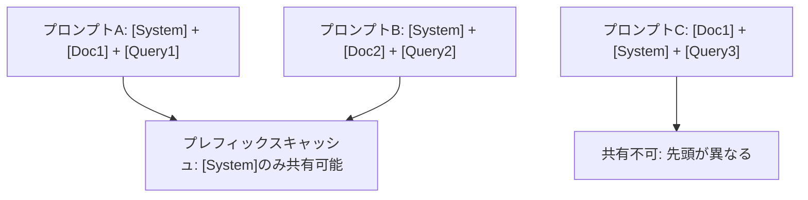
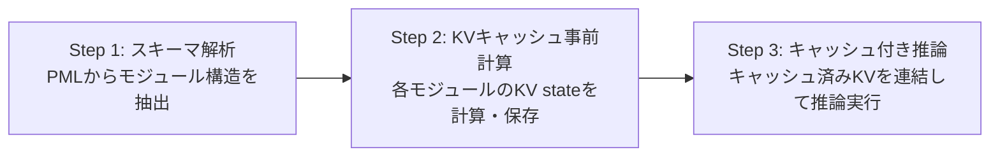

本記事は [arXiv:2404.14294 Prompt Cache: Modular Attention Reuse for Low-Latency Inference](https://arxiv.org/abs/2404.14294) の解説記事です。

## 論文概要（Abstract）

LLM推論において、多くの入力プロンプトはシステムメッセージやプロンプトテンプレート、コンテキスト文書など重複するテキストセグメントを含んでいる。Prompt Cacheは、これらの頻出セグメントを「プロンプトモジュール」として定義し、各モジュールのAttention State（KVキャッシュ）を事前計算・保存することで、推論時のTime-To-First-Token（TTFT）を削減する手法である。著者らは、GPU推論で最大8倍、CPU推論で最大60倍のTTFT改善を達成したと報告している（論文Abstractより）。モデルパラメータの変更は不要であり、出力品質への影響は無視できるレベルであるとされている。

この記事は [Zenn記事: プロンプトキャッシュの本番運用設計 — ヒット率7%→84%改善の実装パターン](https://zenn.dev/0h_n0/articles/80b83bf28e8353) の深掘りです。

## 情報源

- **arXiv ID**: 2311.04934（MLSys 2024採択版）
- **URL**: [https://arxiv.org/abs/2311.04934](https://arxiv.org/abs/2311.04934)
- **著者**: In Gim, Guojun Chen, Seung-seob Lee, Nikhil Sarda, Anurag Khandelwal, Lin Zhong
- **発表年**: 2024（MLSys 2024）
- **分野**: cs.CL, cs.AI
- **コード**: [GitHub (MachineLearningSystem/24MLSYS-prompt-cache)](https://github.com/MachineLearningSystem/24MLSYS-prompt-cache)

## 背景と動機（Background & Motivation）

### KVキャッシュの基礎

Transformerベースの自己回帰LLMは、トークン生成の各ステップで過去のトークンに対するAttention計算を行う。この計算を効率化するため、過去のトークンに対するKey行列とValue行列（KVキャッシュ）を保存し再利用する仕組みがKVキャッシュである。

入力系列 $\mathbf{x} = (x_1, x_2, \ldots, x_n)$ に対して、Transformerの各レイヤー $l$ のAttention計算は以下で表される。

$$
\text{Attention}(\mathbf{Q}, \mathbf{K}, \mathbf{V}) = \text{softmax}\left(\frac{\mathbf{Q}\mathbf{K}^\top}{\sqrt{d_k}}\right)\mathbf{V}
$$

ここで、
- $\mathbf{Q} = \mathbf{x}\mathbf{W}_Q$: Query行列（形状: $n \times d_k$）
- $\mathbf{K} = \mathbf{x}\mathbf{W}_K$: Key行列（形状: $n \times d_k$）
- $\mathbf{V} = \mathbf{x}\mathbf{W}_V$: Value行列（形状: $n \times d_v$）
- $d_k$: Keyの次元数（スケーリング係数）
- $\mathbf{W}_Q, \mathbf{W}_K, \mathbf{W}_V$: 学習済み射影行列

KVキャッシュは、位置 $i$ までのトークンに対して計算済みのKey・Value行列を保持する。

$$
\mathbf{K}_{1:i} = [\mathbf{k}_1; \mathbf{k}_2; \ldots; \mathbf{k}_i], \quad \mathbf{V}_{1:i} = [\mathbf{v}_1; \mathbf{v}_2; \ldots; \mathbf{v}_i]
$$

新しいトークン $x_{i+1}$ の生成時には、$\mathbf{k}_{i+1}$ と $\mathbf{v}_{i+1}$ のみを計算し、キャッシュに追記する。これにより、prefill（プロンプト全体の初回処理）のコストがTTFTのボトルネックとなる。

### プレフィックスキャッシュの課題

既存のプレフィックスキャッシュ（prefix caching）は、共通の接頭辞を持つプロンプト間でのみKVキャッシュを共有できる。つまり、先頭から一致するトークン列のKVキャッシュのみが再利用対象となる。



この制約により、プロンプト内のモジュール（システムメッセージ、文書コンテキスト等）が異なる順序で出現する場合や、途中に動的コンテンツが挟まる場合にはキャッシュが無効化される。著者らはこの問題を「prefix-only limitation」と呼び、Prompt Cacheの動機としている。

### Prompt Cacheのアプローチ

Prompt Cacheは、プロンプトを独立した再利用可能なモジュールに分割し、各モジュールのKVキャッシュを個別に事前計算・保存する。モジュール単位でのキャッシュ管理により、プロンプト構成の順序や組み合わせに依存せず柔軟にKVキャッシュを再利用できる。

## 主要な貢献（Key Contributions）

- **貢献1: Prompt Markup Language（PML）** — 再利用可能なプロンプトモジュールを定義するためのXMLベースのスキーマ言語を導入。モジュールの位置関係・階層構造を宣言的に記述可能にした
- **貢献2: 位置エンコーディングの独立化** — モジュール境界における位置IDの割り当て方式を設計し、異なるプロンプト構成でもKVキャッシュの再利用を可能にした。不連続な位置IDをサポートする仕組みも含む
- **貢献3: TTFT最大8倍削減（GPU）、60倍削減（CPU）** — LLaMA-2（7B, 13B）、MPT-7B、Falcon-7Bでの実験により、出力品質を維持しつつ大幅なレイテンシ削減を達成したと報告されている（論文Abstract・Section 5より）

## 技術的詳細（Technical Details）

### Prompt Markup Language（PML）

PMLはプロンプトの構造を宣言的に定義するXMLベースの記述言語である。以下の要素で構成される。

| 要素 | 説明 | 用途 |
|------|------|------|
| `<module>` | 名前付き再利用可能セグメント | システムメッセージ、文書コンテキスト等 |
| `<param>` | パラメータ化プレースホルダ | ユーザ入力、動的値 |
| `<union>` | 排他的モジュールグループ | 条件分岐（例: 言語切替） |
| `<system>`, `<user>`, `<assistant>` | LLMテンプレートタグ | チャットフォーマット対応 |

PMLスキーマの例を以下に示す。

```xml
<schema name="customer_support">
  <module name="system_prompt">
    You are a helpful customer support agent.
    Always be polite and professional.
  </module>
  <module name="product_catalog">
    <module name="product_a">Product A: Enterprise plan, $99/month...</module>
    <module name="product_b">Product B: Starter plan, $29/month...</module>
  </module>
  <union name="language">
    <module name="english">Please respond in English.</module>
    <module name="japanese">日本語で回答してください。</module>
  </union>
  <param name="user_query" len="512"/>
</schema>
```

スキーマ内の各モジュールは独立してKVキャッシュを事前計算できる。`<union>` 内のモジュールは同一の開始位置IDを共有するため、いずれか1つのみが選択される場面で位置空間を節約する。

### モジュラーアテンション再利用の仕組み

Prompt Cacheの推論プロセスは以下の3ステップで構成される。



**Step 1: スキーマ解析**

PMLスキーマからモジュール構造を解析し、各モジュールのトークン列と位置IDを決定する。モジュール $m_j$ のトークン列 $\mathbf{t}_j = (t_j^1, t_j^2, \ldots, t_j^{L_j})$ に対して、位置ID列 $\mathbf{p}_j = (p_j^1, p_j^2, \ldots, p_j^{L_j})$ が割り当てられる。

**Step 2: KVキャッシュ事前計算**

各モジュール $m_j$ に対して、全レイヤーのKV stateを計算しストレージに保存する。

$$
(\mathbf{K}_j, \mathbf{V}_j) = f_{\text{KV}}(\mathbf{t}_j, \mathbf{p}_j; \theta)
$$

ここで、
- $\mathbf{K}_j \in \mathbb{R}^{L_j \times d_k}$: モジュール $j$ のKey行列
- $\mathbf{V}_j \in \mathbb{R}^{L_j \times d_v}$: モジュール $j$ のValue行列
- $f_{\text{KV}}$: Transformerの全レイヤーにわたるKV計算関数
- $\theta$: モデルパラメータ（変更なし）

**Step 3: キャッシュ付き推論**

ユーザプロンプトが到着すると、使用するモジュール集合 $\mathcal{M} = \{m_{j_1}, m_{j_2}, \ldots, m_{j_r}\}$ を特定し、対応するKVキャッシュを連結する。

$$
\mathbf{K}_{\text{cached}} = [\mathbf{K}_{j_1}; \mathbf{K}_{j_2}; \ldots; \mathbf{K}_{j_r}], \quad \mathbf{V}_{\text{cached}} = [\mathbf{V}_{j_1}; \mathbf{V}_{j_2}; \ldots; \mathbf{V}_{j_r}]
$$

新規テキスト部分（`<param>` で指定されたユーザ入力等）のKVのみを計算し、キャッシュ済みKVに追記する。

$$
\mathbf{K}_{\text{full}} = [\mathbf{K}_{\text{cached}}; \mathbf{K}_{\text{new}}], \quad \mathbf{V}_{\text{full}} = [\mathbf{V}_{\text{cached}}; \mathbf{V}_{\text{new}}]
$$

これにより、prefillで計算が必要なのは新規テキスト部分のみとなり、TTFTが大幅に削減される。

### 位置エンコーディングの独立化

KVキャッシュの再利用を可能にするための核心技術が、モジュール間での位置IDの取り扱いである。

#### 位置ID割り当て規則

スキーマ内での絶対位置に基づいてモジュールごとの位置IDが決定される。モジュール $m_1$ が $L_1$ トークン、モジュール $m_2$ が $L_2$ トークンを含む場合、以下のように割り当てられる。

$$
\begin{align}
\mathbf{p}_1 &= (0, 1, \ldots, L_1 - 1) \\
\mathbf{p}_2 &= (L_1, L_1 + 1, \ldots, L_1 + L_2 - 1)
\end{align}
$$

重要な点として、**位置IDはスキーマ定義時に確定する**。すなわち、実際のプロンプトでモジュールが使用されるか否かにかかわらず、スキーマ上の位置がIDを決定する。

#### 不連続位置IDのサポート

`<union>` 要素内のモジュール群は同一の開始位置IDを共有する。選択されなかったモジュールの位置ID範囲は「ギャップ」となるが、著者らはこの不連続性がモデルの出力品質に与える影響は無視できるレベルであると報告している（論文Section 4.2より）。

$$
\text{Union内モジュール: } p_{\text{start}}(m_A) = p_{\text{start}}(m_B) = L_{\text{prefix}}
$$

#### パラメータの位置ID処理

`<param>` 要素にはスキーマ定義時に最大長 `len` が指定される。事前計算時には `<unk>` トークンが充填され、実際のユーザ入力が到着した時点でその位置IDを用いてKVが再計算される。

$$
\mathbf{p}_{\text{param}} = (p_{\text{start}}, p_{\text{start}} + 1, \ldots, p_{\text{start}} + \text{len} - 1)
$$

#### RoPEとの互換性

Rotary Position Embedding（RoPE）を採用するモデルでは、位置情報がKeyとQueryの両方に回転行列として直接エンコードされる。

$$
\text{RoPE}(\mathbf{q}_i, i) = \mathbf{R}_i \mathbf{q}_i, \quad \text{RoPE}(\mathbf{k}_j, j) = \mathbf{R}_j \mathbf{k}_j
$$

ここで $\mathbf{R}_i$ は位置 $i$ に対応する回転行列である。Prompt Cacheのモジュラーキャッシュはスキーマで定義された絶対位置IDに基づいてRoPEの回転行列を計算するため、RoPEベースのモデルでも適用可能である。ただし著者らは、不連続位置IDとRoPEの組み合わせにおいて追加の調整が必要になりうると認めている（論文Section 6より）。

### メモリオーバーヘッド

各モデルのKVキャッシュにおける1トークンあたりのストレージ要件（16ビット精度）は以下の通りである（論文Table 2より）。

| モデル | MB/トークン |
|--------|-----------|
| Falcon 1B | 0.18 |
| LLaMA 7B | 0.50 |
| LLaMA 13B | 0.78 |
| MPT 30B | 1.31 |
| Falcon 40B | 1.87 |
| LLaMA 70B | 2.50 |
| Falcon 180B | 4.53 |

たとえば、LLaMA 7Bで1,000トークンの文書をキャッシュするには約500MBのストレージが必要となる。キャッシュモジュール数が増えるとGPUメモリを圧迫するため、適切なキャッシュ管理戦略が求められる。

## 実装のポイント

### PMLスキーマの設計指針

Prompt Cacheの効果を最大化するには、PMLスキーマの設計が重要である。著者らの報告に基づき、以下の実装上の要点をまとめる。

**モジュール粒度の選択**: モジュールが細かすぎるとキャッシュ管理のオーバーヘッドが増大し、粗すぎると再利用率が低下する。著者らはシステムメッセージ、文書コンテキスト、タスク指示文の3レベルを推奨している。

**パラメータ長の設定**: `<param>` の `len` 属性は、想定される入力の最大トークン数を指定する。過大に設定すると位置IDの空間が無駄になり、過小に設定すると入力が切り捨てられる。

```python
from dataclasses import dataclass
from typing import Optional


@dataclass
class PromptModule:
    """Prompt Cacheのモジュール定義

    Args:
        name: モジュールの一意識別子
        content: モジュールのテキスト内容
        position_start: スキーマ上の開始位置ID
        kv_cache: 事前計算済みKVキャッシュ（Optional）
    """
    name: str
    content: str
    position_start: int
    kv_cache: Optional[tuple] = None

    @property
    def token_length(self) -> int:
        """トークン数を返す（簡易推定）"""
        # 実際にはトークナイザを使用する
        return len(self.content.split())

    @property
    def position_end(self) -> int:
        """終了位置IDを返す"""
        return self.position_start + self.token_length


def compose_kv_cache(
    modules: list[PromptModule],
    new_kv: tuple,
) -> tuple:
    """キャッシュ済みモジュールと新規KVを連結する

    Args:
        modules: 使用するモジュールのリスト（KVキャッシュ計算済み）
        new_kv: 新規テキスト部分のKVキャッシュ (K_new, V_new)

    Returns:
        連結されたKVキャッシュ (K_full, V_full)
    """
    import torch

    cached_keys = [m.kv_cache[0] for m in modules if m.kv_cache is not None]
    cached_values = [m.kv_cache[1] for m in modules if m.kv_cache is not None]

    k_new, v_new = new_kv
    cached_keys.append(k_new)
    cached_values.append(v_new)

    k_full = torch.cat(cached_keys, dim=-2)  # (batch, heads, seq, d_k)
    v_full = torch.cat(cached_values, dim=-2)

    return k_full, v_full
```

### キャッシュ管理戦略

GPUメモリは有限であるため、キャッシュの配置・退避戦略が必要である。著者らは以下のアプローチを論文中で議論している。

1. **GPUメモリ常駐**: 頻繁にアクセスされるモジュール（システムメッセージ等）はGPU HBMに常駐させる
2. **CPU-GPUスワップ**: 使用頻度の低いモジュールはCPU DRAMに退避し、必要時にGPUへ転送する
3. **LRU（Least Recently Used）方式**: GPUメモリが逼迫した場合、最も最近使用されていないモジュールから退避する

```python
from collections import OrderedDict
from typing import Any


class ModuleKVCache:
    """モジュール単位のKVキャッシュ管理

    LRU方式でGPUメモリ上のキャッシュを管理する。

    Args:
        max_gpu_modules: GPUメモリに保持するモジュールの最大数
    """

    def __init__(self, max_gpu_modules: int = 32):
        self.max_gpu_modules = max_gpu_modules
        self._gpu_cache: OrderedDict[str, Any] = OrderedDict()
        self._cpu_cache: dict[str, Any] = {}

    def get(self, module_name: str) -> Any | None:
        """モジュールのKVキャッシュを取得する

        GPUキャッシュに存在する場合はそのまま返す。
        CPUキャッシュに存在する場合はGPUへ転送する。

        Args:
            module_name: モジュール名

        Returns:
            KVキャッシュ、または存在しない場合はNone
        """
        if module_name in self._gpu_cache:
            self._gpu_cache.move_to_end(module_name)
            return self._gpu_cache[module_name]

        if module_name in self._cpu_cache:
            kv = self._cpu_cache.pop(module_name)
            # GPU転送（実際にはtensor.to(device)を使用）
            self._put_gpu(module_name, kv)
            return kv

        return None

    def _put_gpu(self, module_name: str, kv: Any) -> None:
        """GPUキャッシュにKVを追加し、必要に応じてLRU退避する"""
        while len(self._gpu_cache) >= self.max_gpu_modules:
            evicted_name, evicted_kv = self._gpu_cache.popitem(last=False)
            # CPU退避（実際にはtensor.to('cpu')を使用）
            self._cpu_cache[evicted_name] = evicted_kv

        self._gpu_cache[module_name] = kv
```

### Attention Maskの設計

モジュール間の独立性を保証するため、Prompt Cacheではモジュール境界に基づくAttention Maskが適用される。モジュール $m_i$ のトークンは、$m_i$ 自身と、スキーマ上で $m_i$ より前に位置するモジュールのトークンにのみAttentionを向ける。これにより、モジュールのKVキャッシュが後続モジュールの内容に依存しなくなり、独立した再利用が可能となる。

ただし著者らは、このマスキングが一部のケースでモデル出力に影響を与えうる点も認めている。その対策として「scaffolding」と呼ばれる手法（モジュール間にダミートークンを挿入してAttention計算を調整する方法）をメモリコスト増と引き換えに利用できると述べている（論文Section 4.3より）。

## Production Deployment Guide

本セクションでは、Prompt Cacheの概念をプロダクション環境で活用するためのAWS構成パターンを示す。LLM推論におけるKVキャッシュのモジュラー再利用は、Amazon BedrockのPrompt Caching機能やセルフホスト推論サーバ（vLLM、SGLang等）を通じて実現できる。

### AWS実装パターン（コスト最適化重視）

**トラフィック量別の推奨構成**

| 構成 | トラフィック | アーキテクチャ | 月額概算 |
|------|------------|--------------|---------|
| Small | ~100 req/日 | Lambda + Bedrock | $50-150 |
| Medium | ~1,000 req/日 | ECS Fargate + Bedrock | $300-800 |
| Large | 10,000+ req/日 | EKS + vLLM (Spot) | $2,000-5,000 |

注: 上記はAWS ap-northeast-1（東京）リージョンの2026年4月時点の概算値。実際のコストはトラフィックパターン、バースト使用量、リージョンにより変動する。最新料金は [AWS Pricing Calculator](https://calculator.aws/) で確認を推奨する。

**Small構成（~100 req/日）**: Lambda + Bedrock

- Lambda: 128MB-512MB、タイムアウト30秒。Bedrock APIコールのオーケストレーション
- Bedrock: Claude/Llama等のマネージドモデル。Prompt Caching機能を有効化してコスト30-90%削減
- DynamoDB: モジュール定義（PMLスキーマ）の永続化、On-Demandモード
- 月額内訳: Lambda($5) + Bedrock($30-120) + DynamoDB($5-15) = $40-140

**Medium構成（~1,000 req/日）**: ECS Fargate + Bedrock

- ECS Fargate: 2vCPU/4GB RAM、キャッシュ管理レイヤーを常駐
- ElastiCache (Redis): モジュールKVキャッシュのメタデータ管理、cache.t3.micro
- Bedrock: Prompt Caching有効化 + Batch APIで50%削減
- 月額内訳: Fargate($70) + Redis($15) + Bedrock($150-600) + その他($30) = $265-715

**Large構成（10,000+ req/日）**: EKS + vLLM on Spot

- EKS: g5.xlarge (NVIDIA A10G) Spot Instances、Karpenter自動スケーリング
- vLLM/SGLang: セルフホスト推論サーバ、RadixAttentionでモジュラーキャッシュ再利用
- S3: 事前計算済みKVキャッシュの永続ストレージ
- 月額内訳: EKS Control($74) + Spot GPU($600-2,000) + S3($20) + その他($100) = $794-2,194

**コスト削減テクニック**:
- Spot Instances活用: GPU on-demand比で最大90%削減（g5.xlarge: $1.006/h → ~$0.30/h Spot）
- Reserved Instances: 1年コミットで最大72%削減
- Bedrock Prompt Caching: キャッシュヒット時のトークン単価が通常の10-30%
- Bedrock Batch API: 非同期処理で50%削減

### Terraformインフラコード

**Small構成（Serverless）**

```hcl
# --- Small構成: Lambda + Bedrock + DynamoDB ---
# コスト最適化: NAT Gateway不使用、On-Demand DynamoDB

terraform {
  required_version = ">= 1.9"
  required_providers {
    aws = {
      source  = "hashicorp/aws"
      version = "~> 5.80"
    }
  }
}

provider "aws" {
  region = "ap-northeast-1"
}

# IAMロール（最小権限）
resource "aws_iam_role" "lambda_prompt_cache" {
  name = "prompt-cache-lambda-role"
  assume_role_policy = jsonencode({
    Version = "2012-10-17"
    Statement = [{
      Action = "sts:AssumeRole"
      Effect = "Allow"
      Principal = { Service = "lambda.amazonaws.com" }
    }]
  })
}

resource "aws_iam_role_policy" "lambda_bedrock" {
  name = "bedrock-invoke"
  role = aws_iam_role.lambda_prompt_cache.id
  policy = jsonencode({
    Version = "2012-10-17"
    Statement = [
      {
        Effect   = "Allow"
        Action   = ["bedrock:InvokeModel", "bedrock:InvokeModelWithResponseStream"]
        Resource = "arn:aws:bedrock:ap-northeast-1::foundation-model/*"
      },
      {
        Effect   = "Allow"
        Action   = ["dynamodb:GetItem", "dynamodb:PutItem", "dynamodb:Query"]
        Resource = aws_dynamodb_table.prompt_modules.arn
      },
      {
        Effect   = "Allow"
        Action   = ["logs:CreateLogGroup", "logs:CreateLogStream", "logs:PutLogEvents"]
        Resource = "arn:aws:logs:ap-northeast-1:*:*"
      }
    ]
  })
}

# DynamoDB: モジュール定義ストア（On-Demandでコスト最適化）
resource "aws_dynamodb_table" "prompt_modules" {
  name         = "prompt-cache-modules"
  billing_mode = "PAY_PER_REQUEST"
  hash_key     = "schema_name"
  range_key    = "module_name"

  attribute {
    name = "schema_name"
    type = "S"
  }
  attribute {
    name = "module_name"
    type = "S"
  }

  # KMS暗号化
  server_side_encryption {
    enabled = true
  }

  point_in_time_recovery {
    enabled = true
  }
}

# Lambda関数
resource "aws_lambda_function" "prompt_cache_handler" {
  function_name = "prompt-cache-handler"
  role          = aws_iam_role.lambda_prompt_cache.arn
  runtime       = "python3.12"
  handler       = "handler.lambda_handler"
  timeout       = 30
  memory_size   = 512
  filename      = "lambda.zip"

  environment {
    variables = {
      DYNAMODB_TABLE   = aws_dynamodb_table.prompt_modules.name
      BEDROCK_MODEL_ID = "anthropic.claude-3-5-sonnet-20241022-v2:0"
      # Prompt Caching有効化フラグ
      ENABLE_PROMPT_CACHE = "true"
    }
  }

  tracing_config {
    mode = "Active"  # X-Ray有効化
  }
}

# CloudWatchアラーム: コスト監視
resource "aws_cloudwatch_metric_alarm" "bedrock_token_spike" {
  alarm_name          = "bedrock-token-usage-spike"
  comparison_operator = "GreaterThanThreshold"
  evaluation_periods  = 1
  metric_name         = "InputTokenCount"
  namespace           = "AWS/Bedrock"
  period              = 3600
  statistic           = "Sum"
  threshold           = 100000
  alarm_actions       = []  # SNS ARNを指定
}
```

**Large構成（Container）**

```hcl
# --- Large構成: EKS + Karpenter + vLLM (Spot優先) ---

module "eks" {
  source          = "terraform-aws-modules/eks/aws"
  version         = "~> 20.31"
  cluster_name    = "prompt-cache-inference"
  cluster_version = "1.31"

  vpc_id     = module.vpc.vpc_id
  subnet_ids = module.vpc.private_subnets

  # コントロールプレーンのみ（ノードはKarpenterが管理）
  cluster_endpoint_public_access = false

  # Secrets暗号化
  cluster_encryption_config = {
    provider_key_arn = aws_kms_key.eks.arn
    resources        = ["secrets"]
  }
}

# Karpenter Provisioner: Spot優先でGPUノードを自動スケーリング
resource "kubectl_manifest" "karpenter_nodepool" {
  yaml_body = yamlencode({
    apiVersion = "karpenter.sh/v1"
    kind       = "NodePool"
    metadata   = { name = "gpu-spot" }
    spec = {
      template = {
        spec = {
          requirements = [
            { key = "karpenter.sh/capacity-type", operator = "In", values = ["spot", "on-demand"] }
            , { key = "node.kubernetes.io/instance-type", operator = "In", values = ["g5.xlarge", "g5.2xlarge"] }
          ]
          nodeClassRef = { name = "default" }
        }
      }
      limits   = { cpu = "64", "nvidia.com/gpu" = "8" }
      # アイドル時のスケールダウン（コスト削減）
      disruption = {
        consolidationPolicy = "WhenEmptyOrUnderutilized"
        consolidateAfter    = "30s"
      }
    }
  })
}

# AWS Budgets: 月額予算アラート
resource "aws_budgets_budget" "prompt_cache" {
  name         = "prompt-cache-monthly"
  budget_type  = "COST"
  limit_amount = "3000"
  limit_unit   = "USD"
  time_unit    = "MONTHLY"

  notification {
    comparison_operator       = "GREATER_THAN"
    threshold                 = 80
    threshold_type            = "PERCENTAGE"
    notification_type         = "ACTUAL"
    subscriber_email_addresses = ["ops-team@example.com"]
  }
}
```

### 運用・監視設定

**CloudWatch Logs Insights クエリ**

```
# コスト異常検知: 1時間あたりのトークン使用量
fields @timestamp, @message
| filter @message like /token_count/
| stats sum(input_tokens) as total_input, sum(output_tokens) as total_output by bin(1h) as hour
| filter total_input > 50000
| sort hour desc

# レイテンシ分析: P95, P99
fields @timestamp, duration_ms
| filter event = "inference_complete"
| stats percentile(duration_ms, 95) as p95, percentile(duration_ms, 99) as p99,
        avg(duration_ms) as avg_ms by bin(5m)
| sort @timestamp desc
```

**CloudWatchアラーム設定**

```python
import boto3


def create_prompt_cache_alarms(sns_topic_arn: str) -> None:
    """Prompt Cache運用向けCloudWatchアラームを作成する

    Args:
        sns_topic_arn: 通知先SNSトピックのARN
    """
    cw = boto3.client("cloudwatch", region_name="ap-northeast-1")

    # Bedrockトークン使用量スパイク検知
    cw.put_metric_alarm(
        AlarmName="prompt-cache-token-spike",
        MetricName="InputTokenCount",
        Namespace="AWS/Bedrock",
        Statistic="Sum",
        Period=3600,
        EvaluationPeriods=1,
        Threshold=100000,
        ComparisonOperator="GreaterThanThreshold",
        AlarmActions=[sns_topic_arn],
    )

    # Lambda実行時間異常検知
    cw.put_metric_alarm(
        AlarmName="prompt-cache-lambda-duration",
        MetricName="Duration",
        Namespace="AWS/Lambda",
        Dimensions=[{"Name": "FunctionName", "Value": "prompt-cache-handler"}],
        Statistic="p99",
        Period=300,
        EvaluationPeriods=2,
        Threshold=25000,  # 25秒（タイムアウト30秒の83%）
        ComparisonOperator="GreaterThanThreshold",
        AlarmActions=[sns_topic_arn],
    )
```

**X-Rayトレーシング設定**

```python
from aws_xray_sdk.core import xray_recorder, patch_all


def setup_xray_tracing() -> None:
    """X-Rayトレーシングを初期化する（boto3自動計装）"""
    xray_recorder.configure(service="prompt-cache-service")
    patch_all()  # boto3, requests等を自動計装


def trace_inference(
    schema_name: str,
    modules_used: list[str],
    cache_hit: bool,
    ttft_ms: float,
) -> None:
    """推論リクエストのトレーシング情報を記録する

    Args:
        schema_name: PMLスキーマ名
        modules_used: 使用したモジュール名のリスト
        cache_hit: キャッシュヒットしたかどうか
        ttft_ms: Time-To-First-Token（ミリ秒）
    """
    segment = xray_recorder.current_segment()
    segment.put_annotation("schema_name", schema_name)
    segment.put_annotation("cache_hit", cache_hit)
    segment.put_metadata("modules_used", modules_used)
    segment.put_metadata("ttft_ms", ttft_ms)
    segment.put_metadata("module_count", len(modules_used))
```

**Cost Explorer自動レポート**

```python
import datetime

import boto3


def get_daily_cost_report() -> dict:
    """日次コストレポートを取得し、閾値超過時にSNS通知する

    Returns:
        サービス別コストの辞書
    """
    ce = boto3.client("ce", region_name="us-east-1")
    sns = boto3.client("sns", region_name="ap-northeast-1")

    today = datetime.date.today()
    yesterday = today - datetime.timedelta(days=1)

    response = ce.get_cost_and_usage(
        TimePeriod={
            "Start": yesterday.isoformat(),
            "End": today.isoformat(),
        },
        Granularity="DAILY",
        Metrics=["BlendedCost"],
        GroupBy=[{"Type": "DIMENSION", "Key": "SERVICE"}],
    )

    costs: dict[str, float] = {}
    total = 0.0
    for group in response["ResultsByTime"][0]["Groups"]:
        service = group["Keys"][0]
        amount = float(group["Metrics"]["BlendedCost"]["Amount"])
        if amount > 0.01:
            costs[service] = amount
            total += amount

    # $100/日超過でSNS通知
    if total > 100.0:
        sns.publish(
            TopicArn="arn:aws:sns:ap-northeast-1:123456789012:cost-alert",
            Subject=f"Cost Alert: ${total:.2f}/day exceeded $100 threshold",
            Message=f"Daily cost breakdown:\n"
            + "\n".join(f"  {svc}: ${amt:.2f}" for svc, amt in sorted(costs.items(), key=lambda x: -x[1])),
        )

    return costs
```

### コスト最適化チェックリスト

**アーキテクチャ選択**
- [ ] トラフィック量に応じた構成を選択（Small: Serverless / Medium: Hybrid / Large: Container）
- [ ] GPU推論が必要か、Bedrock APIで十分かを判断

**リソース最適化**
- [ ] EC2/EKS: Spot Instances優先（GPU on-demand比で最大90%削減）
- [ ] Reserved Instances: 1年コミットで最大72%削減
- [ ] Savings Plans: Compute Savings Plansで最大66%削減
- [ ] Lambda: Power Tuningでメモリサイズ最適化
- [ ] ECS/EKS: Karpenterでアイドル時スケールダウン（consolidateAfter: 30s）
- [ ] NAT Gateway: 不要な場合は削除（$32/月削減）

**LLMコスト削減**
- [ ] Bedrock Prompt Caching有効化（キャッシュヒット時30-90%削減）
- [ ] Bedrock Batch API使用（非同期処理で50%削減）
- [ ] モデル選択ロジック（簡易クエリはHaiku、複雑クエリはSonnet）
- [ ] トークン数制限（max_tokens設定、不要なコンテキスト削除）
- [ ] PMLスキーマ最適化（高頻度モジュールの粒度調整）

**監視・アラート**
- [ ] AWS Budgets: 月額予算アラート（80%/100%閾値）
- [ ] CloudWatch: トークン使用量スパイク検知アラーム
- [ ] Cost Anomaly Detection: 異常支出の自動検知
- [ ] 日次コストレポート: Cost Explorer API + SNS通知

**リソース管理**
- [ ] 未使用リソース削除: 不要なKVキャッシュ、停止中のインスタンス
- [ ] タグ戦略: Environment/Service/Ownerタグで追跡
- [ ] ライフサイクルポリシー: S3キャッシュの自動削除（30日）
- [ ] 開発環境夜間停止: EKSノードの夜間・週末スケールダウン
- [ ] CloudTrail/Config有効化: 監査ログによる変更追跡

## 実験結果（Results）

### TTFT改善

著者らは複数のモデルとハードウェア構成でPrompt Cacheを評価している（論文Section 5、Figure 3・4より）。

**GPU環境（NVIDIA RTX 4090）**

| モデル | コンテキスト長 | 通常KV Cache TTFT | Prompt Cache TTFT | 改善倍率 |
|--------|-------------|-------------------|-------------------|---------|
| LLaMA-2-7B | 3K tokens | ~900 ms | ~90 ms | ~10x |
| LLaMA-2-7B | GPUキャッシュ | ベースライン | 5-10x改善 | 5-10x |
| LLaMA-2-7B | CPUキャッシュ | ベースライン | 1.5-3x改善 | 1.5-3x |

**CPU環境**

| ハードウェア | 改善倍率 | 備考 |
|------------|---------|------|
| Intel i9-13900K (DDR5) | 最大70x | DDR5の高帯域幅が寄与 |
| AMD Ryzen 9 7950X (DDR4) | 最大20x | DDR4帯域幅がボトルネック |

上記の値は論文のFigure 3・4から読み取った概算値であり、正確な数値は原論文を参照されたい。GPUキャッシュとCPUキャッシュで改善幅に差が生じるのは、キャッシュ読み込み時のメモリ帯域幅の違いに起因する。

### 出力品質への影響

著者らはLongBenchスイート（4K-10Kコンテキスト長、21データセット・6カテゴリ）を用いて出力品質を評価している（論文Table 1より）。

| データセット | 評価指標 | ベースライン | Prompt Cache | 差分 |
|------------|---------|------------|-------------|------|
| NarrativeQA | F1 | 7.14-20.37 | 同等 | 無視可能 |
| 2WikiMultiHopQA | F1 | 13.95-17.69 | 同等 | 無視可能 |
| GovReport | ROUGE-L | 22.39-28.18 | 同等 | 無視可能 |
| TriviaQA | F1 | 9.17-23.19 | 同等 | 無視可能 |

著者らは「Prompt Cacheの出力精度はベースラインと同等である」と報告している。モデルパラメータを変更せず、KVキャッシュの計算順序のみを変えるため、理論的にも品質劣化は最小限に抑えられる。ただし、不連続位置IDの影響が完全にゼロとは限らない点は注意が必要である。

### Token Generation速度

著者らは、Time-To-Subsequent-Token（TTST: 2番目以降のトークン生成時間）への影響は無いと報告している。RTX 4090上のLLaMA-2-7Bで、KV CacheとPrompt Cacheの双方ともTTSTは平均32ms/tokenで一致している（論文Section 5.1より）。これはPrompt Cacheがprefill段階のみを最適化し、autoregressive decoding段階には影響しないためである。

## 実運用への応用（Practical Applications）

### API事業者のプロンプトキャッシュ

Prompt Cacheの概念は、現在主要なLLMプロバイダのAPIに採用されている。Anthropic Claude、OpenAI GPT、Google Geminiはいずれもプロンプトキャッシュ機能を提供しており、共通のプレフィックスに対するKVキャッシュの再利用による課金削減とレイテンシ改善を実現している。

Zenn記事「プロンプトキャッシュの本番運用設計」では、これらのAPI実装において実測ヒット率7%から84%への改善パターンが解説されている。Prompt Cache論文のモジュラーアプローチは、API事業者側の内部実装として応用されていると考えられる。

### セルフホスト推論サーバへの応用

vLLMやSGLangといったセルフホスト推論フレームワークは、Prompt Cache論文のアイデアを発展させた実装を提供している。

- **vLLM**: automatic prefix cachingにより共通プレフィックスのKVキャッシュを自動再利用
- **SGLang**: RadixAttentionにより共有プレフィックスをRadix Treeで管理し、最大6.4倍のスループット向上を実現

いずれもprefixベースのアプローチであり、Prompt Cacheが提案するモジュール単位での任意位置キャッシュとは異なるが、KVキャッシュ再利用による推論高速化という基本方針は共通している。

### 適用が有効なユースケース

Prompt Cacheは以下のユースケースで高い効果が期待できる。

1. **カスタマーサポートBot**: 固定のシステムプロンプト + FAQ文書 + ユーザクエリの構成で、システムプロンプトとFAQ文書のKVキャッシュを再利用
2. **RAGパイプライン**: 検索で取得した文書のKVキャッシュを事前計算し、異なるクエリで再利用
3. **バッチ推論**: 同一テンプレートで多数のリクエストを処理する場面で、テンプレート部分のKVキャッシュを共有

一方、著者ら自身が「high cache hit rateが前提」と明記している通り、動的コンテキストが多いユースケース（各リクエストが大幅に異なるプロンプトを使用する場合）では恩恵が限定的である。

## 関連研究（Related Work）

- **PagedAttention / vLLM** (Kwon et al., SOSP 2023): OSの仮想メモリ・ページング技法を応用し、KVキャッシュをブロック単位で管理。メモリ断片化を解消し、スループットを2-4倍改善した。Prompt Cacheがモジュール単位のキャッシュ再利用に注力するのに対し、PagedAttentionはメモリ管理効率の最適化に焦点を当てている。両者は補完的に適用可能である
- **RadixAttention / SGLang** (Zheng et al., 2024): Radix Treeデータ構造を用いて共有プレフィックスを自動検出し、KVキャッシュを再利用する。最大6.4倍のスループット向上が報告されている。Prompt Cacheとの違いは、RadixAttentionがプレフィックスマッチングに基づく自動検出であるのに対し、Prompt CacheはPMLスキーマによる明示的なモジュール定義を採用している点である
- **CacheBlend** (Yao et al., EuroSys 2025): RAGシナリオにおいて、検索文書の事前計算済みKVキャッシュを選択的に再計算・融合する手法。3.9倍のスループット向上が報告されている。Prompt Cacheがモジュール全体のKVを再利用するのに対し、CacheBlendは一部トークンのKVを再計算することで精度と速度のトレードオフを調整する
- **KVLink** (arXiv:2502.16002, 2025): 異なるコンテキストで事前計算されたKVキャッシュを効率的に結合する手法。Prompt Cacheの「モジュール連結」の考え方を発展させ、位置エンコーディングの不連続性問題に対する改善を図っている

## まとめと今後の展望

Prompt Cacheは、プロンプトをモジュール単位に分割しKVキャッシュを事前計算・再利用するというシンプルかつ効果的なアプローチにより、GPU推論で最大8倍、CPU推論で最大60倍のTTFT改善を実現した。PMLスキーマによるモジュール定義と位置エンコーディングの独立化が核心技術であり、モデルパラメータの変更なしに適用可能である点が実用上の利点である。

一方、モジュール境界の手動設計コスト、キャッシュ増大に伴うGPUメモリ圧迫、動的コンテキストが多い場合の効果限定という制約も存在する。著者らは今後の方向性として、GPUキャッシュ置換戦略の最適化、KVキャッシュの圧縮技術、Grouped Query Attentionとの統合を挙げている（論文Section 6より）。

現在のLLM推論エコシステムでは、vLLMのautomatic prefix caching、SGLangのRadixAttention、各プロバイダのPrompt Caching APIなど、本論文のアイデアを基盤とした実装が広く普及しており、KVキャッシュ再利用は推論最適化の基本技術として定着している。

## 参考文献

- **arXiv**: [https://arxiv.org/abs/2311.04934](https://arxiv.org/abs/2311.04934)
- **Code**: [GitHub - MachineLearningSystem/24MLSYS-prompt-cache](https://github.com/MachineLearningSystem/24MLSYS-prompt-cache)
- **Related Zenn article**: [プロンプトキャッシュの本番運用設計 — ヒット率7%→84%改善の実装パターン](https://zenn.dev/0h_n0/articles/80b83bf28e8353)
- **vLLM / PagedAttention**: [https://arxiv.org/abs/2309.06180](https://arxiv.org/abs/2309.06180)
- **SGLang / RadixAttention**: [https://arxiv.org/abs/2312.07104](https://arxiv.org/abs/2312.07104)
- **CacheBlend**: [https://arxiv.org/abs/2405.16444](https://arxiv.org/abs/2405.16444)
- **KVLink**: [https://arxiv.org/abs/2502.16002](https://arxiv.org/abs/2502.16002)
