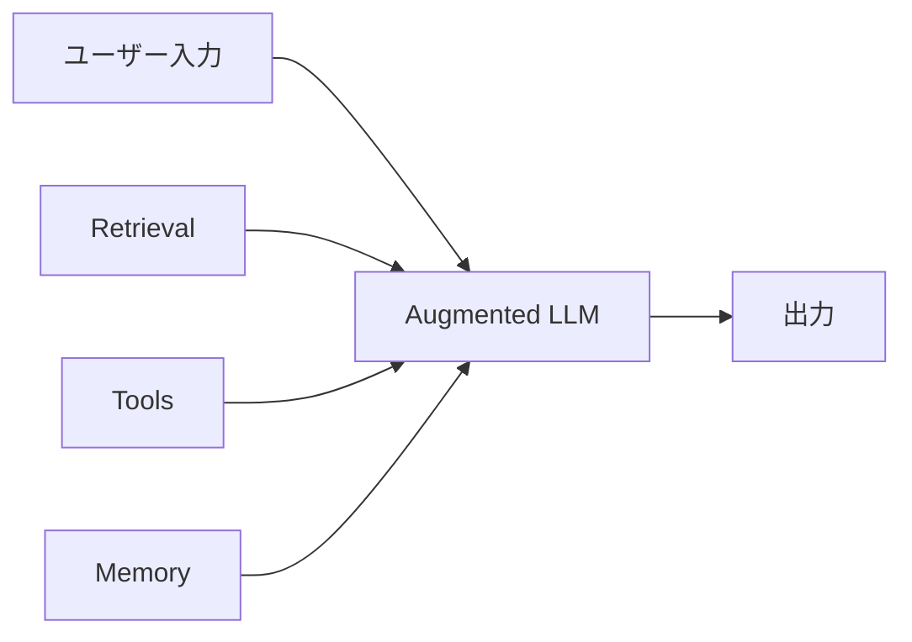
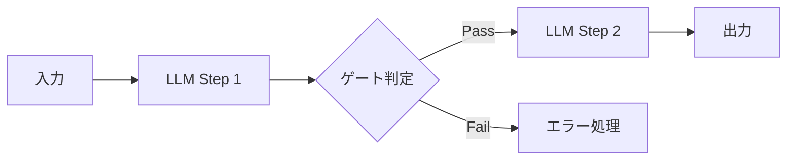
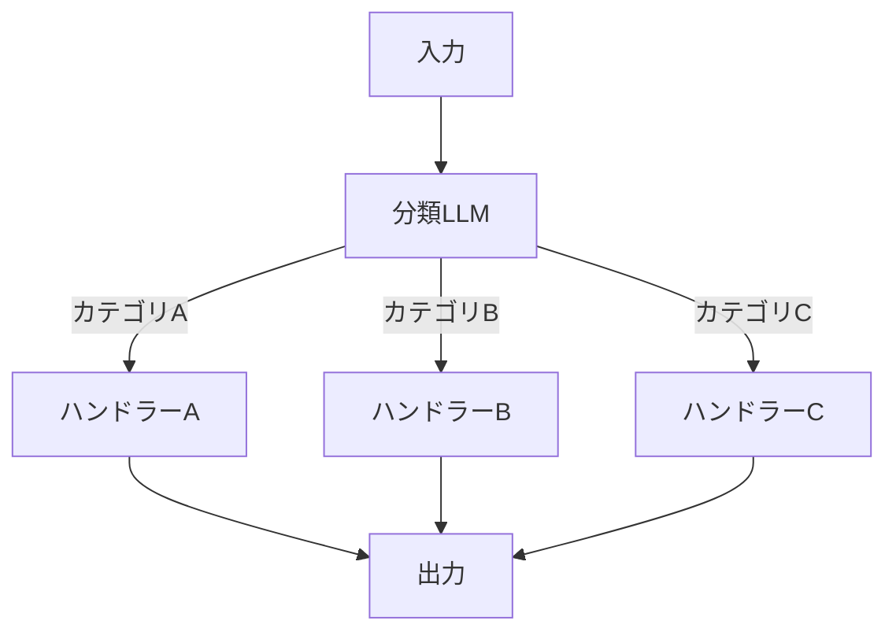
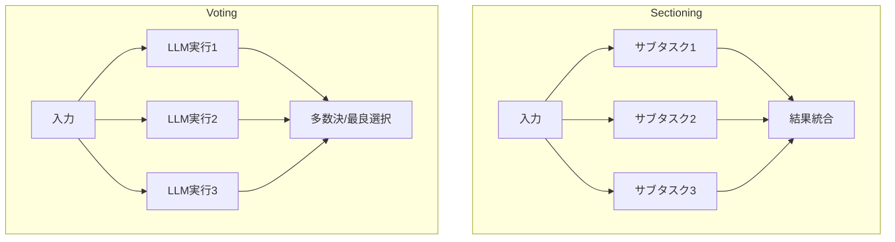
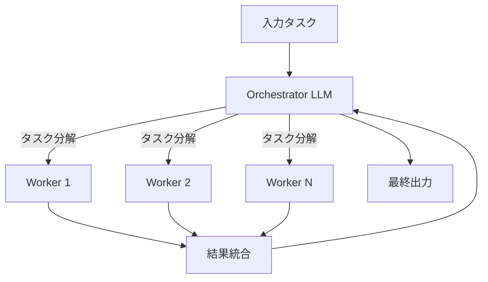
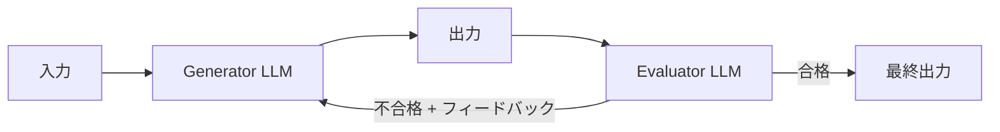
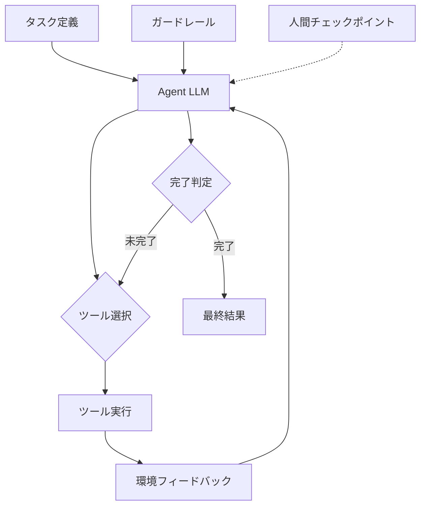

本記事は [Anthropic: Building Effective AI Agents](https://www.anthropic.com/research/building-effective-agents) の解説記事です。

## ブログ概要（Summary）

Anthropicが2024年12月に公開した「Building Effective AI Agents」は、LLMを活用したエージェントシステムの設計パターンを体系的に整理したガイドラインである。ブログでは「ワークフロー」と「エージェント」を明確に区別し、Augmented LLMを基盤とする5つのワークフローパターン（Prompt Chaining、Routing、Parallelization、Orchestrator-Workers、Evaluator-Optimizer）と1つの自律エージェントパターンを提示している。特筆すべきは「シンプルさ優先」の原則であり、Anthropicは実証可能なパフォーマンス改善なしに複雑さを追加することをアンチパターンとして明確に警告している。

この記事は [Zenn記事: Bedrock Agentsカスタムオーケストレーターで配送ルート最適化の並列ツール実行を設計する](https://zenn.dev/0h_n0/articles/7264a42f5fe87e) の深掘りです。

## 情報源

- **種別**: 企業テックブログ（Anthropic Research/Engineering Blog）
- **URL**: [https://www.anthropic.com/research/building-effective-agents](https://www.anthropic.com/research/building-effective-agents)
- **組織**: Anthropic
- **著者**: Erik S., Barry Zhang
- **発表日**: 2024年12月19日

## 技術的背景（Technical Background）

### 「エージェント」の定義問題

2024年以降、LLM業界において「エージェント」という用語の定義が曖昧なまま広く使われている。単純なプロンプトチェーンからフルオートノマスなシステムまで、あらゆるものが「エージェント」と呼ばれる状況が生じていた。Anthropicはこのブログで、まずこの曖昧さを解消するために明確な定義を提示している。

### ワークフロー vs. エージェント

Anthropicのブログでは、この2つを以下のように定義している。

- **ワークフロー（Workflows）**: 「LLMとツールが事前に定義されたコードパスによって制御されるシステム」
- **エージェント（Agents）**: 「LLMが自律的にプロセスとツール使用を動的に制御し、タスクの達成方法を自ら決定するシステム」

この区別の核心は**制御の所在**にある。ワークフローではプログラマーが制御フローを決定し、LLMは各ステップの実行者にすぎない。一方、エージェントではLLM自身が次のアクションを決定する。Anthropicは両方を包含する上位概念として「agentic systems」という用語を用い、多くの実用的なユースケースはワークフローで十分であると述べている。

## 7つの設計パターン詳細解説（Design Patterns）

### 1. Augmented LLM（基盤パターン）

全てのパターンの基盤となる構成要素である。素のLLMに対して、検索（Retrieval）、ツール呼び出し（Tools）、メモリ（Memory）の3つの拡張を加えたものを指す。

Anthropicはサードパーティツールとの統合にModel Context Protocol（MCP）の使用を推奨している。Augmented LLMの品質が後続の全パターンの性能を左右するため、ツール定義の明確さ、検索精度、メモリ管理がシステム全体の基盤となることが強調されている。

### 2. Prompt Chaining（逐次実行パターン）

タスクを逐次的なステップに分解し、各LLM呼び出しが前のステップの出力を処理するパターンである。ステップ間にプログラム的な「ゲート」を挿入し、品質チェックや分岐判定を行える点が特徴である。

**適用場面**: マーケティングコピー生成後に別言語へ翻訳する場合、ドキュメントのアウトライン作成後に妥当性を検証してから本文を執筆する場合など。

**トレードオフ**: 各ステップが逐次実行されるため、全体のレイテンシが増加する。ステップ間のゲートで品質を担保できるため、精度とレイテンシのトレードオフとなる。タスクが明確に逐次分解でき、各ステップの出力品質を個別に検証したい場合に有効である。一方、ステップ間の依存が弱い場合やレイテンシが重要な場合は、後述のParallelizationの方が適切である。

### 3. Routing（振り分けパターン）

入力を分類し、その分類結果に基づいて専門化されたハンドラーに処理を振り分けるパターンである。関心の分離により、各ハンドラーを独立して最適化できる。

**適用場面**: カスタマーサポートにおいて問い合わせ種別（請求・技術・一般）ごとに異なるプロンプトやツールセットで処理する場合。また、質問の複雑度に応じてHaiku（軽量・高速）とSonnet（高精度）を使い分ける場合にも活用できる。

**トレードオフ**: ルーティングの分類精度が全体の性能を左右する。分類が不正確だと誤ったハンドラーに振り分けられ、結果の品質が低下する。カテゴリが明確に分離できるタスクに向いているが、カテゴリ間の境界が曖昧な場合は分類器の精度を慎重に検証する必要がある。

### 4. Parallelization（並列化パターン）

Anthropicは並列化を2つのサブパターンに分類している。

#### 4a. Sectioning（セクショニング）

タスクを独立したサブタスクに分解し、それぞれを並列に実行するパターンである。各サブタスクが相互に依存しないことが前提である。

**適用場面**: ガードレールの実装で、ユーザー入力に対する安全性スクリーニングとメインの応答生成を同時に実行する場合。また、自動評価で異なる観点（正確性・流暢性・安全性）を同時に評価する場合にも活用される。

Zenn記事「Bedrock Agentsカスタムオーケストレーターで配送ルート最適化の並列ツール実行を設計する」では、まさにこのSectioningパターンが活用されている。配送ルート最適化において、複数の独立したサブ問題（例: 各エリアのルート計算）を並列にツール実行することで、逐次実行に比べて大幅にレイテンシを削減する設計が採用されている。

#### 4b. Voting（投票）

同じタスクを複数回実行し、多様な出力を得るパターンである。多数決や最良選択により品質を向上させる。

**適用場面**: コードの脆弱性レビューで、複数の独立したレビューを実行し検出漏れを低減する場合。コンテンツの適切性評価で閾値を調整可能にする場合にも有効である。

**トレードオフ（Parallelization全体）**: 並列実行によりレイテンシは低減するが、LLM呼び出し回数が増加するためコストが上昇する。Sectioningはサブタスクが真に独立している場合にのみ有効であり、サブタスク間に暗黙の依存関係があると結果の整合性が崩れる。Votingはコストが$n$倍になるため、品質要件が高いタスクに限定すべきである。

### 5. Orchestrator-Workers（オーケストレーター-ワーカーパターン）

中央のオーケストレーターLLMがタスクを動的に分解し、ワーカーLLMに委任するパターンである。Parallelization（Sectioning）との決定的な違いは、**サブタスクが事前に定義されるのではなく、入力に応じて動的に決定される**点にある。

**適用場面**: 複数ファイルにまたがるコード変更タスクで、オーケストレーターが変更対象ファイルと変更内容を分析し、各ファイルの修正をワーカーに委任する場合。複数の情報源から情報を収集・統合するリサーチタスクにも適している。

Zenn記事で実装されたBedrock Agentsカスタムオーケストレーターは、このOrchestrator-Workersパターンの具体的実装例である。オーケストレーターが配送ルート最適化問題全体を分析し、エリア分割やルート計算などの個別タスクをワーカー（ツール呼び出し）に動的に委任する構成をとっている。

**トレードオフ**: オーケストレーターの判断品質がシステム全体の性能を支配する。タスク分解が不適切だとワーカーの実行結果を正しく統合できない。また、オーケストレーターとワーカー間の通信オーバーヘッドが発生するため、タスクが単純な場合はPrompt Chainingの方が効率的である。

### 6. Evaluator-Optimizer（評価-最適化ループ）

1つのLLMが回答を生成し、別のLLMがその回答を評価してフィードバックを返すループ構造である。評価基準が明確で、反復改善が測定可能な値を生むケースに有効である。

**適用場面**: 文芸翻訳のように、翻訳品質を反復的に改善する場合。複雑な検索タスクで、複数ラウンドの分析を通じて最適解に収束させる場合にも活用できる。

**トレードオフ**: 反復回数に比例してレイテンシとコストが増加する。評価基準が曖昧だと改善が収束せず、無限ループに陥る可能性がある。評価者が一貫した基準で判定でき、かつ改善の余地が測定可能なタスクに限定すべきである。

### 7. Autonomous Agents（自律エージェント）

LLMがツールを使用し、環境からのフィードバックに基づいて独立的に動作するパターンである。人間は概してチェックポイントで監視する役割を担い、エージェントが自律的にタスクの計画・実行・修正を繰り返す。

Anthropicは自律エージェントの使用について慎重な立場を示しており、以下の条件を挙げている。

- タスクの定義が明確であること
- LLMに十分な計画能力があること
- 環境からの客観的なフィードバック（テスト結果など）が得られること
- サンドボックス環境でのテストとガードレールの設置が必須であること

**トレードオフ**: 自律性が高まるほど、エラーが蓄積・複合するリスクが高まる。各ステップでの小さなエラーが後続のステップに伝播し、最終的な結果の品質が大幅に低下する可能性がある。十分なガードレール設計なしに導入すべきではないとAnthropicは述べている。

### パターン選択の判断基準

以下の表は、各パターンの適用条件を整理したものである。

| パターン | 制御の所在 | タスク分解 | レイテンシ | コスト | 適用条件 |
|:---|:---|:---|:---|:---|:---|
| Prompt Chaining | コード | 静的・逐次 | 高 | 低 | 明確な逐次依存 |
| Routing | コード | 静的・分岐 | 低 | 低 | カテゴリが明確 |
| Parallelization | コード | 静的・並列 | 低 | 中 | 独立サブタスク |
| Orchestrator-Workers | LLM | 動的 | 中 | 中-高 | 入力依存の分解 |
| Evaluator-Optimizer | コード+LLM | 反復 | 高 | 高 | 明確な評価基準 |
| Autonomous Agents | LLM | 完全動的 | 最高 | 最高 | オープンエンド問題 |

## パフォーマンス最適化（Performance）

### シンプルさ優先の原則

Anthropicのブログで最も強調されているのが「シンプルさ優先」の原則である。具体的には以下のように述べられている。

> 「まずシンプルなプロンプトから始め、包括的な評価で最適化し、シンプルな解決策では不十分な場合にのみマルチステップのエージェンティックシステムを追加せよ」

この原則に基づくパターン選択の判断フローは以下の通りである。

1. **単一LLM呼び出しで解決できるか？** -- 可能ならAugmented LLMで十分
2. **タスクを逐次ステップに分解できるか？** -- Prompt Chainingを検討
3. **入力によって処理が分岐するか？** -- Routingを検討
4. **独立したサブタスクに分解できるか？** -- Parallelizationを検討
5. **サブタスクの内容が入力に依存するか？** -- Orchestrator-Workersを検討
6. **反復改善が必要か？** -- Evaluator-Optimizerを検討
7. **上記全てで不十分か？** -- Autonomous Agentsを検討

Anthropicはフレームワーク（Claude Agent SDK、Strands Agents等）の使用についても言及し、プロトタイピングには有効だが抽象化レイヤーが増えることでデバッグが困難になると警告している。まずはLLM APIを直接使い、基盤となるコードを理解した上でフレームワークを活用することが推奨されている。

## 運用での学び（Production Lessons）

### Agent-Computer Interface（ACI）設計

Anthropicはツール設計をHCI（Human-Computer Interface）と同等の重要度で扱うべきだと述べている。具体的には以下の設計原則が提示されている。

- **実行前に考えさせる**: モデルに十分な推論トークンを確保してからツールを実行させる
- **インターネット上の自然なフォーマットに合わせる**: モデルの学習データに含まれる形式を活用する
- **フォーマットオーバーヘッドの排除**: 文字列エスケープや行番号カウントなどの負担をモデルに課さない
- **ツール定義にはエッジケースと使用例を含める**: 入力要件を明確にする

### ポカヨケ原則

Anthropicはツール設計に製造業由来の「ポカヨケ（poka-yoke）」原則を適用すべきだと述べている。具体例として、SWE-benchエージェントの開発において、相対パスを絶対パスに変更することでディレクトリ変更後のエラーを解消した事例が紹介されている。チームはプロンプト全体の最適化よりもツール設計の最適化に多くの時間を費やしたと報告されている。

### プロダクション事例

Anthropicは2つの主要なプロダクション事例を挙げている。

**カスタマーサポートエージェント**: チャットボットインターフェースにツール統合（返金処理、チケット更新、ナレッジベース検索）を組み合わせたシステムである。成功指標が明確（解決率・顧客満足度）であるため、従量課金モデルとの親和性が高いとされている。

**コーディングエージェント**: GitHub Issueの自動解決をPull Requestとして提出するシステムである。テスト結果という客観的なフィードバックが得られるため、Evaluator-Optimizerパターンと自律エージェントの組み合わせが有効に機能する。SWE-bench Verified（実際のコードベースへの修正タスク）での実績が報告されているが、自動テストの通過と人間レビューによるシステム全体の整合性確認は別の問題であるとも指摘されている。

## 学術研究との関連（Academic Connection）

Anthropicのブログで提示されたパターンは、LLMエージェントに関する複数の学術研究と対応関係がある。

- **ReWOO**（Xu et al., 2023, arXiv:2305.18323）: Planner-Worker-Solverの3モジュール構成は、Orchestrator-Workersパターンの変種と位置づけられる。ReWOOはPlannerが事前に全計画を立てる点でAnthropicのOrchestrator-Workersの動的分解と異なるが、タスク分解と委任の基本構造は共通している。
- **AutoGen**（Wu et al., 2023, arXiv:2308.08155）: Microsoftの多エージェント対話フレームワークであり、複数のカスタマイズ可能なエージェント間の会話を通じてタスクを遂行する。Anthropicが示すOrchestrator-WorkersやEvaluator-Optimizerの複合パターンに近い構造を持つ。
- **MetaGPT**（Hong et al., 2023, arXiv:2308.00352, ICLR 2024 Oral）: ソフトウェア開発におけるSOP（標準作業手順書）をプロンプトにエンコードし、各エージェントに専門的役割を割り当てる。構造化された中間出力の生成を要求する点は、Anthropicが重視するACIの設計原則と通底している。

## まとめと実践への示唆

Anthropicの「Building Effective AI Agents」は、エージェントシステム設計における「シンプルさ優先」と「段階的な複雑性の追加」を一貫して主張するガイドラインである。7つのパターンは排他的ではなく組み合わせて使用でき、実際のプロダクションでは複数パターンの複合が一般的である。最も重要な示唆は、フレームワークやアーキテクチャの選定よりも、ツール設計（ACI）とプロンプト品質という基盤の最適化に投資すべきだという点である。Zenn記事で実装されたBedrock Agentsカスタムオーケストレーターは、まさにOrchestrator-WorkersとParallelization（Sectioning）を組み合わせた実例であり、このガイドラインの実践的な適用事例として位置づけられる。

## 参考文献

- **Blog URL**: [Building Effective AI Agents - Anthropic](https://www.anthropic.com/research/building-effective-agents)
- **ReWOO**: [arXiv:2305.18323](https://arxiv.org/abs/2305.18323) - Xu et al., "ReWOO: Decoupling Reasoning from Observations for Efficient Augmented Language Models", 2023
- **AutoGen**: [arXiv:2308.08155](https://arxiv.org/abs/2308.08155) - Wu et al., "AutoGen: Enabling Next-Gen LLM Applications via Multi-Agent Conversation", 2023
- **MetaGPT**: [arXiv:2308.00352](https://arxiv.org/abs/2308.00352) - Hong et al., "MetaGPT: Meta Programming for A Multi-Agent Collaborative Framework", 2023 (ICLR 2024 Oral)
- **Model Context Protocol**: [https://modelcontextprotocol.io/](https://modelcontextprotocol.io/)
- **Related Zenn article**: [Bedrock Agentsカスタムオーケストレーターで配送ルート最適化の並列ツール実行を設計する](https://zenn.dev/0h_n0/articles/7264a42f5fe87e)
