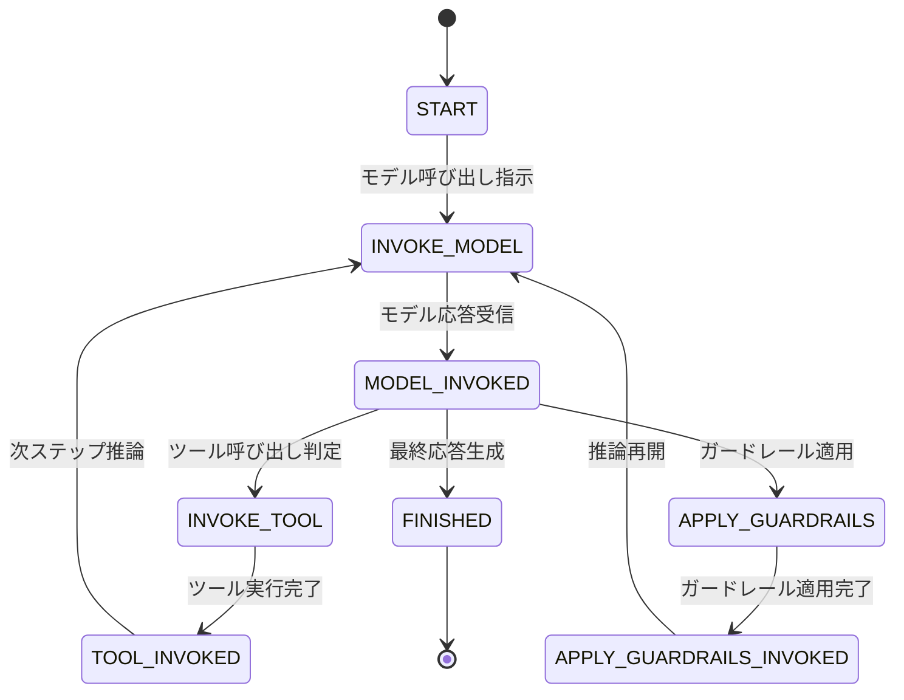
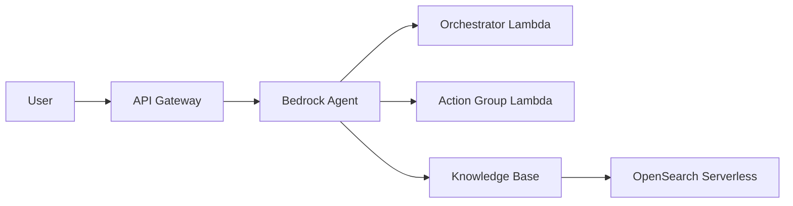

## ブログ概要（Summary）

本記事は [Getting started with Amazon Bedrock Agents custom orchestrator](https://aws.amazon.com/blogs/machine-learning/getting-started-with-amazon-bedrock-agents-custom-orchestrator/) の解説記事です。Amazon Bedrock Agentsのカスタムオーケストレーション機能は、デフォルトのReAct（Reason and Action）戦略に代えて、Lambda関数によるユーザー定義のオーケストレーションロジックを実装可能にする機能です。著者らは、状態遷移ベースのイベント駆動アーキテクチャを通じて、ReWoo（Reasoning WithOut Observation）をはじめとする代替戦略を実装し、Claude 3.5 Sonnet使用時に50-70%のレイテンシ削減を達成したと報告しています。

この記事は [Zenn記事: Bedrock Agentsカスタムオーケストレーターで配送ルート最適化の並列ツール実行を設計する](https://zenn.dev/0h_n0/articles/7264a42f5fe87e) の深掘りです。

## 情報源

- **種別**: 企業テックブログ（AWS Machine Learning Blog）
- **URL**: [Getting started with Amazon Bedrock Agents custom orchestrator](https://aws.amazon.com/blogs/machine-learning/getting-started-with-amazon-bedrock-agents-custom-orchestrator/)
- **組織**: Amazon Web Services, Machine Learning チーム
- **著者**: Kyle Blocksom, John Baker, Sudip Dutta, Maira Ladeira Tanke, Mark Roy
- **発表日**: 2024年11月27日

## 技術的背景（Technical Background）

Amazon Bedrock Agentsは、LLMに対してツール呼び出し（Action Groups）、知識検索（Knowledge Bases）、安全性制御（Guardrails）を統合するマネージドサービスです。デフォルトでは、ReAct（Reasoning and Acting）戦略が採用されています。

ReActは、Yao et al. (2022) が提案した推論とアクションのインターリーブ手法であり、各ステップでモデルが「思考（Thought）→ アクション（Action）→ 観察（Observation）」のサイクルを逐次実行します。N個のツール呼び出しが必要なタスクでは、最低N+1回のモデル呼び出しが発生します。これは透明性と逐次的な適応性を提供する一方、タスクの複雑度が増すと顕著なレイテンシ増加を招きます。

AWSの公式ブログでは、この課題に対してカスタムオーケストレーション機能を導入しています。開発者がLambda関数でオーケストレーションロジックを定義することで、ReWoo、Plan-and-Solve、Tree-of-Thought、Standard Operating Procedures（SOP）といった代替戦略を自由に実装できるようになります。これにより、ユースケースに応じた最適なオーケストレーション戦略を選択でき、レイテンシ・精度・実装コストのトレードオフを開発者が制御できるようになります。

## 実装アーキテクチャ（Architecture）

### 状態遷移モデル

カスタムオーケストレーターの中核は、有限状態機械（FSM）に基づくイベント駆動アーキテクチャです。Lambda関数が「状態（State）」を入力として受け取り、「イベント（Event）」を出力として返すことで、エージェントのワークフローが遷移します。



ブログの記載によれば、入力状態と出力イベントの対応は以下の通りです。

**入力状態（Lambda が受け取る State）**:

| 状態 | 説明 |
|------|------|
| `START` | 会話開始時の初期状態（常に最初に発火） |
| `MODEL_INVOKED` | モデル呼び出しが完了し、応答が返却された状態 |
| `TOOL_INVOKED` | ツール（Action Group / Knowledge Base）の実行が完了した状態 |
| `APPLY_GUARDRAILS_INVOKED` | ガードレール適用が完了した状態 |
| ユーザー定義状態 | 開発者が独自に定義したカスタム状態 |

**出力イベント（Lambda が返す Event）**:

| イベント | 説明 |
|----------|------|
| `INVOKE_MODEL` | Converse APIを使用してモデルを呼び出す |
| `INVOKE_TOOL` | Action Group / Knowledge Baseのツールを実行する |
| `APPLY_GUARDRAILS` | ガードレールを適用する |
| `FINISHED` | オーケストレーションを終了し最終応答を返す |
| ユーザー定義イベント | 開発者が独自に定義したカスタムイベント |

### Lambda関数のコントラクト

[AWSの公式ドキュメント](https://docs.aws.amazon.com/bedrock/latest/userguide/agents-custom-orchestration.html)では、Lambda関数の入出力がJSON形式で定義されています。入力側には`version`、`state`（現在の状態）、`input.text`（ユーザー入力またはツール結果）、`context`（リクエストID、セッションID、エージェント設定、会話履歴、セッション属性）が含まれます。出力側には`actionEvent`（次のイベント）、`output.text`（Converse APIリクエストまたは最終応答）、`output.trace`（デバッグ用トレース）、`context`（更新後のセッション属性）を返します。

入力の`context.agentConfiguration`には、エージェントの指示文、デフォルトモデルID、利用可能なツール一覧、ガードレール設定が含まれるため、オーケストレーターLambda内でこれらの情報に基づいた動的なルーティングが可能です。

### ツール統合ポイント

ブログでは、カスタムオーケストレーターから利用可能な5つの統合ポイントが解説されています。

1. **Knowledge Bases**: ユーザー入力に基づいてベクトルストアからコンテキストを検索し、RAG（Retrieval-Augmented Generation）パターンを実現する
2. **Action Groups**: Lambda関数、Return of Control（RoC）、Code Interpreterの3種類のアクション実行を提供する。Lambda関数はサーバーサイドでAPI呼び出しを実行し、RoCはクライアント側で制御を返し、Code Interpreterはコード生成・実行を行う
3. **Guardrails**: 応答がポリシーや安全基準に準拠しているかを検証する。`APPLY_GUARDRAILS`イベントで明示的に適用タイミングを制御可能
4. **Converse API**: LLMとの会話フローを管理する。`INVOKE_MODEL`イベントでConverse API形式のリクエストをモデルに送信する
5. **Session Attributes**: セッション固有のデータ（長期記憶、パーソナライゼーション設定、Knowledge Base構成）を管理し、会話間のコンテキストを維持する

### ReAct実装の状態遷移

ブログで紹介されているReAct戦略のLambda実装パターンは、[AWSの公式ドキュメント](https://docs.aws.amazon.com/bedrock/latest/userguide/agents-custom-orchestration.html)に以下のように記載されています。

```python
def react_orchestration(event: dict) -> dict:
    """ReActパターンのカスタムオーケストレーション（概念的な実装）"""
    state = event["state"]

    if state == "START":
        # 初期状態: モデルに推論を依頼
        return build_response("INVOKE_MODEL", build_converse_request(event))

    elif state == "MODEL_INVOKED":
        stop_reason = get_stop_reason(event)
        if stop_reason == "tool_use":
            # モデルがツール呼び出しを決定 → ツール実行
            return build_response("INVOKE_TOOL", extract_tool_use(event))
        elif stop_reason == "end_turn":
            # モデルが最終応答を生成 → 終了
            return build_response("FINISH", extract_final_response(event))

    elif state == "TOOL_INVOKED":
        # ツール実行完了 → 結果をモデルに渡して次ステップ推論
        return build_response("INVOKE_MODEL", build_converse_request(event))

    raise ValueError(f"Invalid state: {state}")
```

この実装は、START → INVOKE_MODEL → MODEL_INVOKED → (INVOKE_TOOL → TOOL_INVOKED →)* → FINISHED という直線的な遷移を行います。N個のツールに対してN回のツール呼び出しとN+1回のモデル呼び出しが発生するため、レイテンシがツール数に比例して増加します。

## Production Deployment Guide

### 規模別AWS実装パターン

カスタムオーケストレーターの本番導入においては、システム規模に応じた設計パターンの選定が重要です。以下に、Small（PoC/単一チーム）、Medium（部門レベル）、Large（エンタープライズ）の3パターンを整理します。

#### Small: PoC / 単一チーム（月間 1,000-10,000リクエスト）



**特徴**:
- Bedrock Agent 1台構成
- オーケストレーターLambdaとAction Group Lambdaを分離
- Knowledge BaseはOpenSearch Serverlessを使用
- API Gatewayでリクエスト制御

**Terraformによる構成例**:

```hcl
# --- Orchestrator Lambda ---
resource "aws_lambda_function" "orchestrator" {
  function_name = "bedrock-custom-orchestrator"
  runtime       = "python3.12"
  handler       = "lambda_function.handler"
  filename      = "orchestrator.zip"
  role          = aws_iam_role.orchestrator_role.arn
  timeout       = 30
  memory_size   = 256

  environment {
    variables = {
      ORCHESTRATION_STRATEGY = "rewoo"
      LOG_LEVEL              = "INFO"
    }
  }
}

# --- Lambda Permission for Bedrock ---
resource "aws_lambda_permission" "bedrock_invoke" {
  statement_id  = "AllowBedrockInvoke"
  action        = "lambda:InvokeFunction"
  function_name = aws_lambda_function.orchestrator.function_name
  principal     = "bedrock.amazonaws.com"
  source_arn    = aws_bedrockagent_agent.main.agent_arn
}

# --- Bedrock Agent with Custom Orchestration ---
resource "aws_bedrockagent_agent" "main" {
  agent_name              = "custom-orchestrated-agent"
  foundation_model        = "anthropic.claude-3-5-sonnet-20241022-v2:0"
  instruction             = "You are a helpful assistant."
  agent_resource_role_arn = aws_iam_role.agent_role.arn

  custom_orchestration {
    executor {
      lambda = aws_lambda_function.orchestrator.arn
    }
  }
}
```

**注意**: Terraform AWS Provider v5.49以降で`aws_bedrockagent_agent`リソースの`custom_orchestration`ブロックがサポートされています。`orchestration_type`に`CUSTOM_ORCHESTRATION`を指定し、Lambda ARNを関連付けます。

#### Medium: 部門レベル（月間 10,000-100,000リクエスト）

Smallパターンに加えて以下を追加します。

- **Provisioned Concurrency**: オーケストレーターLambdaのコールドスタートを回避する。カスタムオーケストレーターはエージェントの各ステップで呼び出されるため、コールドスタートのレイテンシが累積しやすい
- **DynamoDB**: セッション状態の永続化。`sessionAttributes`はBedrock側でも保持されるが、オーケストレーション固有の中間状態（ReWooの計画テキスト等）は外部ストアが必要な場合がある
- **pgvector**: OpenSearch Serverlessより低コストなベクトルストアとしてAurora PostgreSQLを選択可能

#### Large: エンタープライズ（月間 100,000+リクエスト）

Mediumパターンに加えて以下を追加します。

- **マルチリージョン**: Route 53のレイテンシベースルーティングで最寄りリージョンにルーティング
- **カナリアデプロイ**: オーケストレーターLambdaのエイリアスウェイトを使用した段階的ロールアウト
- **CloudWatch Metrics**: カスタムメトリクスでオーケストレーション戦略ごとのレイテンシ・成功率を監視

### 運用監視の設計

カスタムオーケストレーターの運用では、以下のメトリクスをCloudWatchで監視することが推奨されます。カスタムメトリクスの名前空間（例: `BedrockCustomOrchestrator`）を作成し、`Strategy`ディメンションで戦略別に集計します。

**アラーム設定例**:

| メトリクス | 閾値 | アクション |
|-----------|------|----------|
| TotalLatency (p99) | > 30秒 | SNS通知 + オンコールエスカレーション |
| ModelInvocationCount (平均) | > 8回/リクエスト | ReWoo戦略への切替検討 |
| OrchestrationType (失敗率) | > 5% | Lambda実装のデバッグ |
| Lambda Duration (p95) | > 10秒 | Provisioned Concurrency増加検討 |

### コスト最適化チェックリスト

カスタムオーケストレーターの導入において、以下の項目でコスト影響を評価する必要があります。

**モデル呼び出しコスト**:
- ReActではN+1回、ReWooでは最大2回のモデル呼び出しが発生するため、ツール数が多いほどReWooのコスト優位性が高まる
- ただし、ReWooの計画プロンプトはReActの個別プロンプトより長くなる傾向があり、入力トークン数の増加を考慮する必要がある

**Lambda実行コスト**:
- カスタムオーケストレーターLambdaはエージェントの各状態遷移で呼び出される
- ReActの場合、1リクエストあたり2N+1回（START + N回のMODEL_INVOKED + N回のTOOL_INVOKED）のLambda呼び出しが発生する
- Provisioned Concurrencyは常時課金されるため、トラフィックパターンに応じた設定が重要

**Knowledge Base / OpenSearch Serverless**:
- OCU（OpenSearch Compute Unit）の最小構成は4 OCU（月額約 $700/月、us-east-1）であるため、Smallパターンではpgvectorの方がコスト効率が良い場合がある

月間10,000リクエスト・平均3ツール呼び出しの場合、ReActでは約40,000回、ReWooでは約20,000回のモデル呼び出しが見込まれます。ただし、ReWooの計画プロンプトはReActより長いため、入力トークン数の差はモデル呼び出し回数の差ほど大きくなりません。実際のコストはプロンプト長、モデル選択、リージョンにより異なります。

## パフォーマンス最適化（Performance）

### ReAct vs ReWoo レイテンシ比較

ブログでは、レストランアシスタントを用いたベンチマークが報告されています。Claude 3.5 Sonnet v2（`anthropic.claude-3-5-sonnet-20241022-v2:0`）を使用し、複合クエリ「What do you serve for dinner? Can you make a reservation for four people at 9pm?」を実行した結果が以下の通りです。

| 戦略 | モデル呼び出し回数 | レイテンシ | 削減率 |
|------|-------------------|-----------|--------|
| ReAct | 6回 | 18秒 | — |
| ReWoo | 2回 | 9秒 | 50% |

ブログの著者らによると、ReWooは複合クエリにおいて50-70%のレイテンシ削減を達成しています。この削減はモデル呼び出し回数の減少に直接起因しており、N個のツール呼び出しに対して最大2回のモデル呼び出しで完結するためです。

ただし、ブログでは以下の制約も併記されています。

- **単純タスクでは効果が限定的**: 3回程度のモデル呼び出しで完結するタスク（例: 単一のツール呼び出し）では、ReWooでも2回のモデル呼び出しが必要なため、差は軽微になる
- **プロンプトエンジニアリングの複雑化**: ReWooの計画プロンプトは、利用可能なすべてのツールの仕様を含む必要があり、出力パースも計画テキストからツール呼び出しを抽出するロジックが必要
- **中間結果への適応不可**: ReWooは計画を先行生成するため、ツール実行の中間結果に基づく動的な計画変更ができない

### トークンコスト比較

ReWooのトークン効率について、ブログでは具体的なトークン数は報告されていませんが、学術論文（Xu et al., 2023）では5倍のトークン効率が報告されています。ブログのカスタムオーケストレーター実装においても、モデル呼び出し回数の削減に伴い、重複するコンテキスト（会話履歴 + 中間結果）の再送信が削減されるため、入力トークン総量の減少が見込まれます。

## 運用での学び（Operational Insights）

### エラーハンドリングパターン

ブログでは明示的なエラーハンドリング戦略は詳述されていませんが、公式ドキュメントの実装パターンから以下の設計指針が読み取れます。

1. **不正な状態遷移の検出**: Lambda関数内で未定義の状態を受け取った場合は例外を送出し、Bedrock側でエラーとして処理する
2. **トレース出力の活用**: `output.trace.event.text`フィールドを使って、各状態遷移の判断理由をInvokeAgentレスポンスに含めることで、デバッグ情報を提供できる
3. **ガードレールの明示的適用**: `APPLY_GUARDRAILS`イベントにより、応答生成前後の任意のタイミングでガードレールチェックを挿入できる

### Lambda同時実行制御

カスタムオーケストレーターLambdaは、エージェントの各状態遷移ステップで同期的に呼び出されます。そのため、高トラフィック環境では以下の点に注意が必要です。

- **Reserved Concurrency**: アカウントレベルのLambda同時実行上限（デフォルト1,000）のうち、オーケストレーターLambda用に予約枠を確保する。1リクエストあたり複数回のLambda呼び出しが発生するため、同時エージェントセッション数の数倍の同時実行枠が必要
- **タイムアウト設定**: Lambda関数のタイムアウトはBedrock AgentのInvokeAgentタイムアウト（デフォルト30秒）より短く設定する必要がある。オーケストレーターLambdaが1ステップで長時間ブロックすると、全体のエージェント実行がタイムアウトする

### ハマりポイント

ブログおよび公式ドキュメントから推察される実装上の注意点として、以下が挙げられます。

- **ReWooの計画パース**: ReWoo戦略では、モデルが生成した計画テキストからツール名・引数を正確にパースする必要がある。モデルの出力フォーマットが安定しない場合、計画の解析に失敗し、後続のツール呼び出しが実行されないリスクがある
- **セッション履歴の肥大化**: `context.session`にはセッション内の全中間ステップが含まれるため、長い会話ではLambdaへの入力ペイロードが大きくなる。Lambda関数のペイロードサイズ制限（6MB）に注意が必要
- **カスタム状態のデバッグ**: ユーザー定義状態を多用すると、状態遷移のデバッグが困難になる。CloudWatch Logsに各遷移を構造化ログとして出力し、遷移グラフを可視化する仕組みを設けることが推奨される

## 学術研究との関連（Academic Context）

カスタムオーケストレーターで実装されているReWoo戦略は、Xu et al. (2023) の論文 [ReWOO: Decoupling Reasoning from Observations for Efficient Augmented Language Models](https://arxiv.org/abs/2305.18323)（arXiv:2305.18323）に基づいています。

ReWOO論文は、推論（Reasoning）とツール観察（Observation）を分離するモジュラーアーキテクチャを提案しています。具体的には、Planner（計画生成）、Worker（ツール実行）、Solver（結果統合）の3モジュールに分割し、Plannerが全ツール呼び出しの計画を事前に生成した後、Workerが並列にツールを実行し、Solverが結果を統合して最終応答を生成します。

論文ではHotpotQAベンチマークにおいて、ReActと比較して5倍のトークン効率と4%の精度向上が報告されています。AWSのブログで報告されている50-70%のレイテンシ削減は、この論文のアプローチをBedrock Agentsのマネージドインフラストラクチャ上で実装した結果と位置づけられます。

ただし、ReWOO論文のベンチマークはQAタスク（HotpotQA, TriviaQA等）が中心であり、ブログのレストランアシスタントのようなAPI操作タスクへの適用は論文の直接的なスコープ外です。AWSのブログでは、API操作を含むタスクにおいてもReWooの有効性を実証している点で、論文の知見をプロダクション環境に拡張した実践例として位置づけられます。

## まとめと実践への示唆

Amazon Bedrock Agentsのカスタムオーケストレーターは、Lambda関数による状態遷移ベースの設計により、オーケストレーション戦略の柔軟な切替を実現しています。ブログの報告によると、ReWoo戦略の導入により50-70%のレイテンシ削減が達成されていますが、プロンプトエンジニアリングの複雑化や中間結果への適応不可というトレードオフがあります。

実践的には、タスクの複雑度（ツール呼び出し数）に応じて戦略を選択し、単純タスクではReAct、複合タスクではReWooを使い分けるハイブリッドアプローチが有効です。本番導入に際しては、Provisioned ConcurrencyによるLambdaコールドスタートの回避、CloudWatchメトリクスによるレイテンシ監視、セッション状態の適切な管理が重要な設計ポイントとなります。

## 参考文献

1. Kyle Blocksom, John Baker, Sudip Dutta, Maira Ladeira Tanke, Mark Roy. "Getting started with Amazon Bedrock Agents custom orchestrator." AWS Machine Learning Blog, 2024-11-27. [https://aws.amazon.com/blogs/machine-learning/getting-started-with-amazon-bedrock-agents-custom-orchestrator/](https://aws.amazon.com/blogs/machine-learning/getting-started-with-amazon-bedrock-agents-custom-orchestrator/)
2. AWS Documentation. "Customize your Amazon Bedrock Agent's behavior with custom orchestration." [https://docs.aws.amazon.com/bedrock/latest/userguide/agents-custom-orchestration.html](https://docs.aws.amazon.com/bedrock/latest/userguide/agents-custom-orchestration.html)
3. Binfeng Xu, Zhiyuan Peng, Bowen Lei, Subhabrata Mukherjee, Yuchen Liu, Dongkuan Xu. "ReWOO: Decoupling Reasoning from Observations for Efficient Augmented Language Models." arXiv:2305.18323, 2023. [https://arxiv.org/abs/2305.18323](https://arxiv.org/abs/2305.18323)
4. Shunyu Yao, Jeffrey Zhao, Dian Yu, Nan Du, Izhak Shafran, Karthik Narasimhan, Yuan Cao. "ReAct: Synergizing Reasoning and Acting in Language Models." ICLR, 2023. [https://arxiv.org/abs/2210.03629](https://arxiv.org/abs/2210.03629)
5. Amazon Bedrock Samples. "Create Agent with Custom Orchestration." GitHub. [https://github.com/aws-samples/amazon-bedrock-samples/tree/main/agents-and-function-calling/bedrock-agents/features-examples/14-create-agent-with-custom-orchestration](https://github.com/aws-samples/amazon-bedrock-samples/tree/main/agents-and-function-calling/bedrock-agents/features-examples/14-create-agent-with-custom-orchestration)
6. Terraform AWS Bedrock Module. GitHub. [https://github.com/aws-ia/terraform-aws-bedrock](https://github.com/aws-ia/terraform-aws-bedrock)
