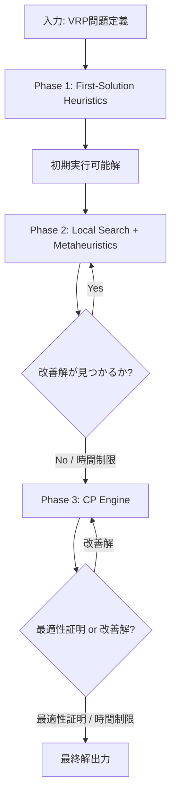
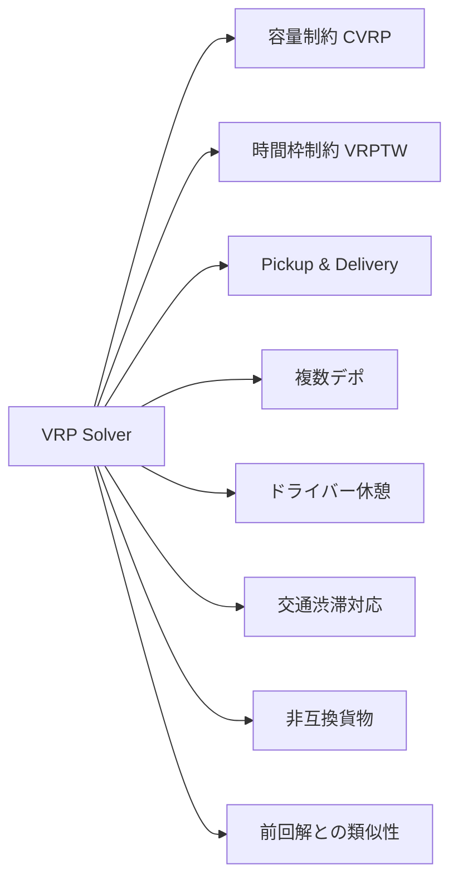

## ブログ概要（Summary）

本記事は [https://research.google/pubs/or-tools-vehicle-routing-solver-a-generic-constraint-programming-solver-with-heuristic-search-for-routing-problems/](https://research.google/pubs/or-tools-vehicle-routing-solver-a-generic-constraint-programming-solver-with-heuristic-search-for-routing-problems/) の解説記事です。

Google OR-ToolsのVehicle Routing Solverは、2008年に開発が始まり2015年にオープンソース化された汎用的な配車計画ソルバーである。著者らは、制約プログラミング（CP）エンジンを基盤としつつ、初期解ヒューリスティクス・局所探索メタヒューリスティクス・CP最適化の3段階アルゴリズムにより、容量制約、時間枠制約、ピックアップ&デリバリー、交通渋滞対応など多様な制約を持つVRP問題に対応する設計を報告している。

この記事は [Zenn記事: Bedrock Agentsカスタムオーケストレーターで配送ルート最適化の並列ツール実行を設計する](https://zenn.dev/0h_n0/articles/7264a42f5fe87e) の深掘りです。

## 情報源

- **種別**: Google Research 論文 / ROADEF 2023 発表
- **URL**: [https://research.google/pubs/or-tools-vehicle-routing-solver-a-generic-constraint-programming-solver-with-heuristic-search-for-routing-problems/](https://research.google/pubs/or-tools-vehicle-routing-solver-a-generic-constraint-programming-solver-with-heuristic-search-for-routing-problems/)
- **組織**: Google
- **著者**: Frederic Didier, Laurent Perron, Sarah Mohajeri, Steven Agostino Gay, Thibaut Cuvelier, Vincent Furnon
- **発表年**: 2023（ROADEF: Congres de la Societe francaise de recherche operationnelle et d'aide a la decision）

## 技術的背景（Technical Background）

### VRPの定義と計算量的困難さ

Vehicle Routing Problem（VRP）は、複数の車両で複数の顧客を訪問するルートを最適化する組合せ最適化問題である。TSP（巡回セールスマン問題）の一般化であり、NP困難に分類される。顧客数 $n$ に対して、可能なルート組合せは指数的に増大するため、厳密解法（分枝限定法等）は数百拠点規模で現実的な計算時間を超過する。

VRPの標準的な定式化は以下の通りである。

$$
\min \sum_{k=1}^{K} \sum_{(i,j) \in E} c_{ij} x_{ij}^k
$$

ここで、
- $K$: 車両数
- $E$: 辺集合（拠点間の移動経路）
- $c_{ij}$: 辺 $(i,j)$ の移動コスト（距離、時間、燃料費等）
- $x_{ij}^k \in \{0, 1\}$: 車両 $k$ が辺 $(i,j)$ を通るかの二値変数

**容量制約（CVRP）** は以下の不等式で表現される。

$$
\sum_{i \in V} d_i y_i^k \leq Q_k \quad \forall k \in \{1, \ldots, K\}
$$

ここで $d_i$ は顧客 $i$ の需要量、$Q_k$ は車両 $k$ の最大積載容量、$y_i^k$ は車両 $k$ が顧客 $i$ を訪問するかの二値変数である。

**時間枠制約（VRPTW）** は各顧客のサービス開始時刻 $s_i$ に対して以下を課す。

$$
a_i \leq s_i \leq b_i \quad \forall i \in V
$$

ここで $[a_i, b_i]$ は顧客 $i$ の受入可能な時間枠である。車両が時間枠の開始前に到着した場合は待機し、終了後に到着した場合は制約違反となる。

産業界では、これらの基本制約に加えて交通渋滞、ドライバー休憩規制、非互換貨物、複数デポなどの複合的な制約が求められる。OR-Toolsが「汎用性」を設計の中心に据えている理由はここにある。

## 実装アーキテクチャ（Architecture）

### 3段階アルゴリズム

著者らは、OR-ToolsのVRPソルバーが以下の3段階で動作すると報告している。



#### Phase 1: 初期解ヒューリスティクス

貪欲法やクラシカルなVRPヒューリスティクスにより、実行可能な初期解を高速に生成する。OR-Tools v9.15（2026年1月リリース）で利用可能な主要戦略は以下の通りである。

| 戦略名 | アルゴリズム概要 |
|--------|-----------------|
| `PATH_CHEAPEST_ARC` | 未訪問ノードのうち最小コストの辺を逐次追加 |
| `GLOBAL_CHEAPEST_ARC` | 全辺の中から最小コストの辺を選択 |
| `SAVINGS` | Clarke & Wright節約法。2ルートの統合による節約量が大きい順にマージ |
| `CHRISTOFIDES` | 最大マッチングベースの近似アルゴリズム（TSPの3/2近似保証） |
| `PARALLEL_CHEAPEST_INSERTION` | 最小挿入コストのノードを並列に挿入 |
| `LOCAL_CHEAPEST_INSERTION` | 各ルート内で最小挿入コストの位置にノードを挿入 |

#### Phase 2: 局所探索 + メタヒューリスティクス

初期解を近傍操作で改善する。局所探索が局所最適解に陥った場合、メタヒューリスティクスにより脱出を図る。

**主要なメタヒューリスティクス戦略**:

| 戦略名 | 特徴 |
|--------|------|
| `GUIDED_LOCAL_SEARCH` | ペナルティ関数でコスト高の辺を抑制。VRP問題で最も効果的とされる |
| `SIMULATED_ANNEALING` | 温度パラメータに基づく確率的受理。高温で劣化解も受理し局所最適を脱出 |
| `TABU_SEARCH` | 直近の移動をタブーリストで禁止し、循環を回避 |
| `GREEDY_DESCENT` | コスト改善する近傍のみ受理。高速だが局所最適に陥りやすい |

著者らによれば、`GUIDED_LOCAL_SEARCH`がVRP問題において「一般に最も効率的なメタヒューリスティクス」であると報告している。

#### Phase 3: CP（制約プログラミング）エンジン

Phase 2で得られた最良解に対して、CPエンジンが最適性の証明を試みる。あるいは、CP探索により更なる改善解を発見する場合もある。ただし、大規模問題では計算時間の制約によりPhase 2の解がそのまま最終解となることが多い。

### 対応する制約の全体像



OR-Toolsの特筆すべき点は、ユーザーが高レベルのルーティング概念（時間枠、容量等）でモデルを構築しつつ、必要に応じて基盤のCPモデルに直接アクセスできる設計である。これにより、標準的なVRP変種だけでなく、産業固有の制約も柔軟にモデリングできる。

## Production Deployment Guide

OR-Toolsを使った配送ルート最適化をAWS上で運用する際のアーキテクチャパターンを規模別に整理する。OR-Toolsは純粋なCPUベースのソルバーであり、GPUは使用しない点に留意する。

### AWS実装パターン（コスト最適化重視）

#### Small構成（〜100リクエスト/日）: Lambda + OR-Tools Layer + DynamoDB

少量リクエストにはサーバーレス構成が最もコスト効率が高い。OR-Toolsのバイナリをカスタム Lambda Layerとしてパッケージングし、距離行列をDynamoDBにキャッシュする。

| AWSサービス | 用途 | 月額概算 |
|------------|------|---------|
| Lambda (arm64, 1024MB, 平均30秒) | ソルバー実行 | $15-30 |
| DynamoDB (On-Demand) | 距離行列キャッシュ | $5-10 |
| API Gateway | HTTPエンドポイント | $3-5 |
| CloudWatch Logs | ログ・監視 | $5-10 |
| **合計** | | **$28-55/月** |

**注意**: コスト試算は2026年4月時点のAWS東京リージョン（ap-northeast-1）料金に基づく概算値である。実際のコストはリクエスト頻度やソルバー実行時間により変動するため、AWS料金計算ツールで最新見積もりを確認することを推奨する。

#### Medium構成（〜1,000リクエスト/日）: ECS Fargate + Redis + SQS

ソルバーの起動時間を短縮し、解のキャッシュを活用するにはコンテナ構成が適している。

| AWSサービス | 用途 | 月額概算 |
|------------|------|---------|
| ECS Fargate (2 vCPU, 4GB, 2タスク) | ソルバー常駐 | $120-180 |
| ElastiCache Redis (cache.t4g.micro) | 解キャッシュ | $15-25 |
| SQS | リクエストキューイング | $1-3 |
| ALB | ロードバランシング | $20-30 |
| CloudWatch | 監視・アラーム | $10-20 |
| **合計** | | **$166-258/月** |

#### Large構成（10,000+リクエスト/日）: EKS + Spot Instances + Batch

大規模リクエストにはEKSとSpotインスタンスの組み合わせが有効である。OR-ToolsはCPU集約型のため、コンピュート最適化インスタンス（c7g系）が適している。

| AWSサービス | 用途 | 月額概算 |
|------------|------|---------|
| EKS コントロールプレーン | クラスタ管理 | $73 |
| EC2 Spot (c7g.xlarge x 4) | ソルバーワーカー | $80-160 |
| AWS Batch | バッチ最適化ジョブ | $20-40 |
| ElastiCache Redis (cache.r7g.large) | 解キャッシュ | $120-150 |
| S3 | 結果永続化 | $5-10 |
| CloudWatch + X-Ray | 監視・トレーシング | $30-50 |
| **合計** | | **$328-483/月** |

Spotインスタンスの活用により、On-Demand比で最大70-90%のコスト削減が見込める。VRPソルバーは中間状態を外部に永続化しやすいため、Spotの中断耐性を確保しやすい。

### Terraformインフラコード

#### Small構成（Serverless）

```hcl
# --- Small構成: Lambda + DynamoDB ---
# OR-Tools VRP Solver - Serverless Architecture
# 2026-04時点の構成

terraform {
  required_version = ">= 1.9"
  required_providers {
    aws = {
      source  = "hashicorp/aws"
      version = "~> 5.80"
    }
  }
}

provider "aws" {
  region = "ap-northeast-1"
}

# DynamoDB: 距離行列キャッシュ
resource "aws_dynamodb_table" "distance_cache" {
  name         = "vrp-distance-cache"
  billing_mode = "PAY_PER_REQUEST"  # On-Demand: 低トラフィック時に最適
  hash_key     = "origin_dest"

  attribute {
    name = "origin_dest"
    type = "S"
  }

  ttl {
    attribute_name = "expires_at"
    enabled        = true
  }

  server_side_encryption {
    enabled = true  # KMS暗号化
  }

  tags = {
    Project = "vrp-solver"
    Env     = "prod"
  }
}

# IAMロール: 最小権限
resource "aws_iam_role" "lambda_vrp" {
  name = "vrp-solver-lambda-role"
  assume_role_policy = jsonencode({
    Version = "2012-10-17"
    Statement = [{
      Action = "sts:AssumeRole"
      Effect = "Allow"
      Principal = { Service = "lambda.amazonaws.com" }
    }]
  })
}

resource "aws_iam_role_policy" "lambda_vrp_policy" {
  name = "vrp-solver-policy"
  role = aws_iam_role.lambda_vrp.id
  policy = jsonencode({
    Version = "2012-10-17"
    Statement = [
      {
        Effect   = "Allow"
        Action   = ["dynamodb:GetItem", "dynamodb:PutItem", "dynamodb:Query"]
        Resource = aws_dynamodb_table.distance_cache.arn
      },
      {
        Effect   = "Allow"
        Action   = ["logs:CreateLogGroup", "logs:CreateLogStream", "logs:PutLogEvents"]
        Resource = "arn:aws:logs:*:*:*"
      }
    ]
  })
}

# Lambda関数
resource "aws_lambda_function" "vrp_solver" {
  function_name = "vrp-solver"
  role          = aws_iam_role.lambda_vrp.arn
  handler       = "handler.solve"
  runtime       = "python3.12"
  architectures = ["arm64"]  # Graviton: x86比で20%低コスト
  memory_size   = 1024       # OR-Tools距離行列に必要
  timeout       = 60         # VRPソルバーの実行時間上限

  filename         = "lambda_package.zip"
  source_code_hash = filebase64sha256("lambda_package.zip")

  environment {
    variables = {
      CACHE_TABLE    = aws_dynamodb_table.distance_cache.name
      SOLVER_TIMEOUT = "30"  # ソルバー内部タイムアウト(秒)
    }
  }

  tags = {
    Project = "vrp-solver"
  }
}

# CloudWatchアラーム: ソルバー実行時間監視
resource "aws_cloudwatch_metric_alarm" "lambda_duration" {
  alarm_name          = "vrp-solver-duration-high"
  comparison_operator = "GreaterThanThreshold"
  evaluation_periods  = 3
  metric_name         = "Duration"
  namespace           = "AWS/Lambda"
  period              = 300
  statistic           = "Average"
  threshold           = 45000  # 45秒（60秒タイムアウトの75%）
  alarm_description   = "VRP Solver Lambda duration exceeding 75% of timeout"

  dimensions = {
    FunctionName = aws_lambda_function.vrp_solver.function_name
  }
}
```

#### Large構成（Container）

```hcl
# --- Large構成: EKS + Karpenter + Spot ---
# OR-Tools VRP Solver - Container Architecture

module "eks" {
  source  = "terraform-aws-modules/eks/aws"
  version = "~> 20.31"

  cluster_name    = "vrp-solver-cluster"
  cluster_version = "1.32"

  vpc_id     = module.vpc.vpc_id
  subnet_ids = module.vpc.private_subnets

  # パブリックアクセス最小化
  cluster_endpoint_public_access  = true
  cluster_endpoint_private_access = true

  eks_managed_node_groups = {
    system = {
      instance_types = ["t4g.medium"]
      min_size       = 1
      max_size       = 2
      desired_size   = 1
      capacity_type  = "ON_DEMAND"  # システムPodはOn-Demand
    }
  }

  tags = {
    Project = "vrp-solver"
    Env     = "prod"
  }
}

# Karpenter Provisioner: Spot優先でコスト最適化
resource "kubectl_manifest" "karpenter_nodepool" {
  yaml_body = <<-YAML
    apiVersion: karpenter.sh/v1
    kind: NodePool
    metadata:
      name: vrp-solver-pool
    spec:
      template:
        spec:
          requirements:
            - key: karpenter.sh/capacity-type
              operator: In
              values: ["spot", "on-demand"]  # Spot優先
            - key: node.kubernetes.io/instance-type
              operator: In
              values: ["c7g.xlarge", "c7g.2xlarge", "c6g.xlarge"]
            - key: topology.kubernetes.io/zone
              operator: In
              values: ["ap-northeast-1a", "ap-northeast-1c"]
          nodeClassRef:
            group: karpenter.k8s.aws
            kind: EC2NodeClass
            name: default
      limits:
        cpu: "32"
        memory: 64Gi
      disruption:
        consolidationPolicy: WhenEmptyOrUnderutilized
        consolidateAfter: 60s
  YAML
}

# AWS Budgets: 月次予算アラート
resource "aws_budgets_budget" "vrp_monthly" {
  name         = "vrp-solver-monthly"
  budget_type  = "COST"
  limit_amount = "600"
  limit_unit   = "USD"
  time_unit    = "MONTHLY"

  notification {
    comparison_operator       = "GREATER_THAN"
    threshold                 = 80
    threshold_type            = "PERCENTAGE"
    notification_type         = "ACTUAL"
    subscriber_email_addresses = ["ops-team@example.com"]
  }
}
```

### 運用・監視設定

#### CloudWatch Logs Insights クエリ

```
# ソルバー実行時間の分布分析（P50/P95/P99）
fields @timestamp, @message
| filter @message like /solver_duration/
| stats percentile(solver_duration_ms, 50) as p50,
        percentile(solver_duration_ms, 95) as p95,
        percentile(solver_duration_ms, 99) as p99
  by bin(1h)
| sort @timestamp desc

# 制約違反の検知
fields @timestamp, constraint_type, violation_count
| filter violation_count > 0
| stats sum(violation_count) as total_violations by constraint_type
| sort total_violations desc
```

#### CloudWatch アラーム設定（Python）

```python
import boto3

cloudwatch = boto3.client("cloudwatch", region_name="ap-northeast-1")

def create_solver_alarms(function_name: str) -> None:
    """VRPソルバー用CloudWatchアラームを作成する。

    Args:
        function_name: 監視対象のLambda関数名
    """
    # ソルバータイムアウト率の監視
    cloudwatch.put_metric_alarm(
        AlarmName=f"{function_name}-timeout-rate",
        MetricName="Errors",
        Namespace="AWS/Lambda",
        Statistic="Sum",
        Period=300,
        EvaluationPeriods=2,
        Threshold=5,
        ComparisonOperator="GreaterThanThreshold",
        Dimensions=[{"Name": "FunctionName", "Value": function_name}],
        AlarmDescription="VRP Solver timeout rate exceeds threshold",
    )
```

#### X-Ray トレーシング設定（Python）

```python
from aws_xray_sdk.core import xray_recorder, patch_all

patch_all()  # boto3等の自動計装

@xray_recorder.capture("solve_vrp")
def solve_vrp(problem: dict) -> dict:
    """VRP問題を解いてX-Rayトレースを記録する。

    Args:
        problem: 問題定義（距離行列、制約等）

    Returns:
        最適化結果（ルート、コスト等）
    """
    subsegment = xray_recorder.current_subsegment()
    subsegment.put_annotation("num_locations", len(problem["locations"]))
    subsegment.put_annotation("num_vehicles", problem["num_vehicles"])
    subsegment.put_metadata("constraints", problem.get("constraints", {}))

    result = _run_solver(problem)

    subsegment.put_annotation("objective_value", result["objective"])
    subsegment.put_annotation("solver_time_ms", result["elapsed_ms"])
    return result
```

#### Cost Explorer 自動レポート（Python）

```python
import boto3
from datetime import datetime, timedelta

ce = boto3.client("ce", region_name="us-east-1")
sns = boto3.client("sns", region_name="ap-northeast-1")

def daily_cost_report(topic_arn: str, threshold_usd: float = 30.0) -> None:
    """日次コストレポートを取得し、閾値超過時にSNS通知する。

    Args:
        topic_arn: 通知先SNSトピックARN
        threshold_usd: アラート閾値（USD/日）
    """
    today = datetime.utcnow().strftime("%Y-%m-%d")
    yesterday = (datetime.utcnow() - timedelta(days=1)).strftime("%Y-%m-%d")

    response = ce.get_cost_and_usage(
        TimePeriod={"Start": yesterday, "End": today},
        Granularity="DAILY",
        Metrics=["UnblendedCost"],
        Filter={
            "Tags": {
                "Key": "Project",
                "Values": ["vrp-solver"],
            }
        },
        GroupBy=[{"Type": "DIMENSION", "Key": "SERVICE"}],
    )

    total = sum(
        float(g["Metrics"]["UnblendedCost"]["Amount"])
        for result in response["ResultsByTime"]
        for g in result["Groups"]
    )

    if total > threshold_usd:
        sns.publish(
            TopicArn=topic_arn,
            Subject=f"VRP Solver Cost Alert: ${total:.2f}/day",
            Message=f"Daily cost ${total:.2f} exceeds ${threshold_usd} threshold.",
        )
```

### コスト最適化チェックリスト

**アーキテクチャ選択**:
- [ ] トラフィック量に応じた構成選択（100 req/日以下はServerless、1000超はContainer）
- [ ] ソルバー実行時間がLambdaの15分上限に収まるか確認
- [ ] 距離行列の事前計算 vs オンデマンド計算のトレードオフ検討

**リソース最適化**:
- [ ] EC2: Spotインスタンス優先（OR-Toolsは中断耐性を確保しやすい）
- [ ] Reserved Instances: 安定稼働ノードは1年コミットで最大42%削減
- [ ] Savings Plans: Compute Savings Plansでリージョン横断の割引
- [ ] Lambda: メモリサイズの最適化（Power Tuningで実測）
- [ ] ECS/EKS: Karpenterによるアイドル時スケールダウン
- [ ] Graviton (arm64): x86比で20%低コスト

**ソルバーコスト削減**:
- [ ] 距離行列キャッシュ（DynamoDB/Redis）で再計算を回避
- [ ] ソルバーのtime_limit設定で無駄な計算を抑制
- [ ] 解のキャッシュ（類似問題の解を再利用）
- [ ] 問題分割（大規模問題をクラスタリングで分割）

**監視・アラート**:
- [ ] AWS Budgets: 月次予算アラート設定
- [ ] CloudWatch アラーム: Lambda実行時間、エラー率
- [ ] Cost Anomaly Detection: 異常コスト検知
- [ ] 日次コストレポート: SNS通知

**リソース管理**:
- [ ] 未使用リソース削除（不要なECSタスク、未使用EBS等）
- [ ] タグ戦略: Project/Env/Ownerタグによるコスト配分
- [ ] ライフサイクルポリシー: S3/ECRの古いオブジェクト自動削除
- [ ] 開発環境の夜間・週末停止
- [ ] DynamoDB TTLによるキャッシュの自動期限切れ

## パフォーマンス最適化（Performance）

### ソルバー設定のチューニング

OR-Toolsのソルバーパフォーマンスは、メタヒューリスティクスの選択と時間制限の設定に大きく依存する。著者らは、`GUIDED_LOCAL_SEARCH`がVRP問題に対して一般に最も効果的であると報告している。

**時間制限の設定指針**:
- 10-50拠点: 5-30秒で十分な品質の解が得られることが多い
- 50-200拠点: 30-120秒が実用的な範囲
- 200-500拠点: 数分以上が必要。リアルタイム応答が不要な場合はバッチ処理を検討

**初期解戦略の選択**: `SAVINGS`（Clarke & Wright節約法）は容量制約のあるCVRPに効果的である。一方、`PATH_CHEAPEST_ARC`は汎用的に使える最も簡単な選択肢である。初期解の品質はPhase 2の改善速度に直接影響するため、問題特性に応じた選択が重要となる。

### OR-Toolsと代替ソルバーの位置付け

| ソルバー | 解法 | ライセンス | 適した規模 |
|---------|------|-----------|-----------|
| OR-Tools | メタヒューリスティクス + CP | Apache 2.0 (OSS) | 中〜大規模 |
| Gurobi / CPLEX | 厳密解（分枝限定法） | 商用 | 小〜中規模（最適解保証が必要な場合） |
| LKH-3 | Lin-Kernighan改良法 | 非商用研究限定 | TSP/VRP特化、高品質解 |

OR-Toolsは厳密最適解を保証しないが、実用的な計算時間内で良質な近似解を返す。500拠点を超えるような大規模問題では、問題をクラスタリングで分割し、各クラスタにOR-Toolsを適用する戦略が有効である。

## Pythonによる VRPTW 実装例

以下は、OR-Tools v9.15でのVRPTW（時間枠付き配車計画問題）の完全な実装例である。

```python
"""OR-Tools VRPTW (Vehicle Routing Problem with Time Windows) 実装例.

OR-Tools v9.15 (2026-01リリース) 対応。
容量制約と時間枠制約の双方を含むVRP問題を解く。
"""

from dataclasses import dataclass

from ortools.constraint_solver import pywrapcp, routing_enums_pb2


@dataclass(frozen=True)
class VRPTWResult:
    """VRPTWソルバーの解を格納するデータクラス.

    Attributes:
        routes: 各車両のルート（ノードインデックスのリスト）
        arrival_times: 各車両の各ノードへの到着時刻
        total_time: 全車両の合計走行時間
        objective: 目的関数値
    """

    routes: list[list[int]]
    arrival_times: list[list[int]]
    total_time: int
    objective: int


def create_data_model() -> dict:
    """問題データを生成する.

    Returns:
        距離行列、時間行列、時間枠、需要量、車両容量を含む辞書
    """
    data: dict = {}
    # 時間行列（分単位）: 拠点間の移動時間
    data["time_matrix"] = [
        [0, 6, 9, 8, 7, 3, 6, 2, 3, 2, 6, 6, 4, 4, 5, 9, 7],
        [6, 0, 8, 3, 2, 6, 8, 4, 8, 8, 13, 7, 5, 8, 12, 10, 14],
        [9, 8, 0, 11, 10, 6, 3, 9, 5, 8, 4, 15, 14, 13, 9, 18, 9],
        [8, 3, 11, 0, 1, 7, 10, 6, 10, 10, 14, 6, 7, 9, 14, 6, 16],
        [7, 2, 10, 1, 0, 6, 9, 4, 8, 9, 13, 4, 6, 8, 12, 8, 14],
        [3, 6, 6, 7, 6, 0, 2, 3, 2, 2, 7, 9, 7, 7, 6, 12, 8],
        [6, 8, 3, 10, 9, 2, 0, 6, 2, 5, 4, 12, 10, 10, 6, 15, 5],
        [2, 4, 9, 6, 4, 3, 6, 0, 4, 4, 8, 5, 4, 3, 7, 8, 10],
        [3, 8, 5, 10, 8, 2, 2, 4, 0, 3, 4, 9, 8, 7, 3, 13, 6],
        [2, 8, 8, 10, 9, 2, 5, 4, 3, 0, 4, 6, 5, 4, 3, 9, 5],
        [6, 13, 4, 14, 13, 7, 4, 8, 4, 4, 0, 10, 9, 8, 4, 13, 4],
        [6, 7, 15, 6, 4, 9, 12, 5, 9, 6, 10, 0, 1, 3, 7, 3, 10],
        [4, 5, 14, 7, 6, 7, 10, 4, 8, 5, 9, 1, 0, 2, 6, 4, 8],
        [4, 8, 13, 9, 8, 7, 10, 3, 7, 4, 8, 3, 2, 0, 4, 5, 6],
        [5, 12, 9, 14, 12, 6, 6, 7, 3, 3, 4, 7, 6, 4, 0, 9, 2],
        [9, 10, 18, 6, 8, 12, 15, 8, 13, 9, 13, 3, 4, 5, 9, 0, 9],
        [7, 14, 9, 16, 14, 8, 5, 10, 6, 5, 4, 10, 8, 6, 2, 9, 0],
    ]
    # 各顧客の時間枠 (開始, 終了)
    data["time_windows"] = [
        (0, 5),    # デポ
        (7, 12),   # 顧客 1
        (10, 15),  # 顧客 2
        (16, 18),  # 顧客 3
        (10, 13),  # 顧客 4
        (0, 5),    # 顧客 5
        (5, 10),   # 顧客 6
        (0, 4),    # 顧客 7
        (5, 10),   # 顧客 8
        (0, 3),    # 顧客 9
        (10, 16),  # 顧客 10
        (10, 15),  # 顧客 11
        (0, 5),    # 顧客 12
        (5, 10),   # 顧客 13
        (7, 8),    # 顧客 14
        (10, 15),  # 顧客 15
        (11, 15),  # 顧客 16
    ]
    # 各顧客の需要量
    data["demands"] = [0, 1, 1, 2, 4, 2, 4, 8, 8, 1, 2, 1, 2, 4, 4, 8, 8]
    data["vehicle_capacities"] = [15, 15, 15, 15]
    data["num_vehicles"] = 4
    data["depot"] = 0
    return data


def solve_vrptw(data: dict) -> VRPTWResult | None:
    """VRPTW問題を解く.

    Args:
        data: create_data_model()で生成された問題データ

    Returns:
        解が見つかった場合はVRPTWResult、見つからなかった場合はNone
    """
    num_locations = len(data["time_matrix"])
    manager = pywrapcp.RoutingIndexManager(
        num_locations,
        data["num_vehicles"],
        data["depot"],
    )
    routing = pywrapcp.RoutingModel(manager)

    # --- 時間コールバック ---
    def time_callback(from_index: int, to_index: int) -> int:
        """2ノード間の移動時間を返す."""
        from_node = manager.IndexToNode(from_index)
        to_node = manager.IndexToNode(to_index)
        return data["time_matrix"][from_node][to_node]

    transit_callback_index = routing.RegisterTransitCallback(time_callback)
    routing.SetArcCostEvaluatorOfAllVehicles(transit_callback_index)

    # --- 時間枠制約 ---
    time_dimension_name = "Time"
    routing.AddDimension(
        transit_callback_index,
        30,     # 最大待機時間（分）
        120,    # 車両あたりの最大走行時間（分）
        False,  # 開始累積値をゼロに強制しない
        time_dimension_name,
    )
    time_dimension = routing.GetDimensionOrDie(time_dimension_name)

    for location_idx, time_window in enumerate(data["time_windows"]):
        if location_idx == data["depot"]:
            continue
        index = manager.NodeToIndex(location_idx)
        time_dimension.CumulVar(index).SetRange(time_window[0], time_window[1])

    # デポの時間枠
    depot_idx = data["depot"]
    for vehicle_id in range(data["num_vehicles"]):
        index = routing.Start(vehicle_id)
        time_dimension.CumulVar(index).SetRange(
            data["time_windows"][depot_idx][0],
            data["time_windows"][depot_idx][1],
        )

    # 出発・到着時刻の最小化
    for i in range(data["num_vehicles"]):
        routing.AddVariableMinimizedByFinalizer(
            time_dimension.CumulVar(routing.Start(i))
        )
        routing.AddVariableMinimizedByFinalizer(
            time_dimension.CumulVar(routing.End(i))
        )

    # --- 容量制約 ---
    def demand_callback(from_index: int) -> int:
        """ノードの需要量を返す."""
        from_node = manager.IndexToNode(from_index)
        return data["demands"][from_node]

    demand_callback_index = routing.RegisterUnaryTransitCallback(demand_callback)
    routing.AddDimensionWithVehicleCapacity(
        demand_callback_index,
        0,                          # slack なし
        data["vehicle_capacities"],  # 車両ごとの最大容量
        True,                       # 開始累積値をゼロに
        "Capacity",
    )

    # --- ソルバーパラメータ ---
    search_parameters = pywrapcp.DefaultRoutingSearchParameters()
    search_parameters.first_solution_strategy = (
        routing_enums_pb2.FirstSolutionStrategy.PATH_CHEAPEST_ARC
    )
    search_parameters.local_search_metaheuristic = (
        routing_enums_pb2.LocalSearchMetaheuristic.GUIDED_LOCAL_SEARCH
    )
    search_parameters.time_limit.seconds = 30  # 30秒で打ち切り

    # --- 求解 ---
    solution = routing.SolveWithParameters(search_parameters)
    if solution is None:
        return None

    # --- 解の抽出 ---
    routes: list[list[int]] = []
    arrival_times: list[list[int]] = []
    total_time = 0

    for vehicle_id in range(data["num_vehicles"]):
        route: list[int] = []
        times: list[int] = []
        index = routing.Start(vehicle_id)

        while not routing.IsEnd(index):
            node = manager.IndexToNode(index)
            time_var = time_dimension.CumulVar(index)
            route.append(node)
            times.append(solution.Min(time_var))
            index = solution.Value(routing.NextVar(index))

        # 最終ノード（デポ帰還）
        node = manager.IndexToNode(index)
        time_var = time_dimension.CumulVar(index)
        route.append(node)
        times.append(solution.Min(time_var))
        total_time += solution.Min(time_var)

        routes.append(route)
        arrival_times.append(times)

    return VRPTWResult(
        routes=routes,
        arrival_times=arrival_times,
        total_time=total_time,
        objective=solution.ObjectiveValue(),
    )


def main() -> None:
    """メインエントリーポイント."""
    data = create_data_model()
    result = solve_vrptw(data)

    if result is None:
        print("No solution found.")
        return

    print(f"Objective: {result.objective}")
    for i, (route, times) in enumerate(
        zip(result.routes, result.arrival_times, strict=True)
    ):
        route_str = " -> ".join(
            f"{node}(t={t})" for node, t in zip(route, times, strict=True)
        )
        print(f"Vehicle {i}: {route_str}")
    print(f"Total time: {result.total_time} min")


if __name__ == "__main__":
    main()
```

**実装のポイント**:
- `RoutingIndexManager`はユーザーのノードインデックスとソルバー内部の変数インデックスを変換する。コールバック関数では必ず`IndexToNode`で変換する必要がある
- `AddDimension`の第2引数（slack）は待機時間の上限を表す。VRPTWでは早着時の待機を許容するためゼロ以外の値を設定する
- `GUIDED_LOCAL_SEARCH`はペナルティ関数で高コスト辺の使用を抑制し、多様な解空間を探索する。`time_limit.seconds`との組み合わせで品質と計算時間のトレードオフを制御する

## 運用での学び（Production Lessons）

### Lambda Layer のサイズ制約

OR-Toolsのバイナリサイズは解凍後で約200-300MBに達する。Lambda Layerの250MB上限に抵触する場合がある。対策として、(1) コンテナイメージ Lambda（10GBまで）への移行、(2) 不要な言語バインディング（Java, C#等）を除外したカスタムビルド、が考えられる。arm64（Graviton）向けビルドはx86比でバイナリサイズが若干小さくなる傾向がある。

### ソルバーのコールドスタート

OR-Toolsのモデル構築には初回起動時に数秒のオーバーヘッドがある。Lambda環境ではコールドスタートと合わせて5-10秒の初期遅延が発生しうる。Provisioned Concurrencyの利用やECS常駐化でこの問題を回避できる。

### 距離行列の肥大化

顧客数 $n$ に対して距離行列は $O(n^2)$ のメモリを消費する。500拠点の場合、行列のみで約2MBとなる。Lambda のメモリ設定（最大10,240MB）を考慮し、大規模問題ではクラスタリングによる問題分割を検討する。

## 学術研究との関連（Academic Connection）

OR-Toolsのメタヒューリスティクスアプローチに対して、近年は機械学習ベースの組合せ最適化（Neural Combinatorial Optimization）が注目を集めている。POMO (Policy Optimization with Multiple Optima, Kwon et al., 2020) はRL（強化学習）ベースでTSP/CVRPを解く手法であり、小規模問題では競争力のある性能を示している。一方、LKH-3 (Helsgaun, 2017) はLin-Kernighan法の改良版であり、TSP/VRPベンチマークで最高水準の解品質を持つ。

OR-Toolsの強みは、これらの特化型手法では対応が困難な複合制約（時間枠 + 容量 + ピックアップ&デリバリー + ドライバー休憩等）を統一フレームワークで扱える汎用性にある。

## まとめと実践への示唆

Google OR-ToolsのVRPソルバーは、制約プログラミングとメタヒューリスティクスの組合せにより、多様な産業制約を持つ配車計画問題に汎用的に対応できるOSSソルバーである。厳密最適解の保証はないが、実用的な計算時間内で良質な近似解を生成する。AWS上での運用においては、リクエスト規模に応じたLambda/ECS/EKSの構成選択と、距離行列キャッシュによる計算コスト削減が重要な設計判断となる。関連Zenn記事で紹介されているBedrock Agentsとの連携パターンと組み合わせることで、生成AIによる動的な制約解釈とOR-Toolsによる最適化を統合したシステムの構築が可能である。

## 参考文献

- **Source**: [OR-Tools' Vehicle Routing Solver: a Generic Constraint-Programming Solver with Heuristic Search for Routing Problems](https://research.google/pubs/or-tools-vehicle-routing-solver-a-generic-constraint-programming-solver-with-heuristic-search-for-routing-problems/) - Frederic Didier et al., Google, ROADEF 2023
- **OR-Tools GitHub**: [https://github.com/google/or-tools](https://github.com/google/or-tools)
- **OR-Tools VRP Guide**: [https://developers.google.com/optimization/routing](https://developers.google.com/optimization/routing)
- **OR-Tools v9.15 Release**: [https://github.com/google/or-tools/releases/tag/v9.15](https://github.com/google/or-tools/releases/tag/v9.15)
- **Related Zenn article**: [Bedrock Agentsカスタムオーケストレーターで配送ルート最適化の並列ツール実行を設計する](https://zenn.dev/0h_n0/articles/7264a42f5fe87e)
