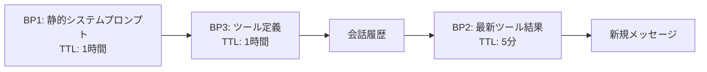

## ブログ概要（Summary）

本記事は [ProjectDiscovery Blog: How We Cut LLM Costs by 59% With Prompt Caching](https://projectdiscovery.io/blog/how-we-cut-llm-cost-with-prompt-caching) の解説記事です。

ProjectDiscoveryはセキュリティ自動化プラットフォームを提供する企業であり、AIエージェント基盤「Neo」においてClaude Opus 4.5を用いた大規模なマルチステップエージェントを本番運用している。同ブログでは、Anthropic APIのプロンプトキャッシュ機能を体系的に最適化し、キャッシュヒット率を7%から84%へ改善、LLM APIコストを全体で59%削減した手法が報告されている。中核となる施策は「3ブレークポイント戦略」と「動的コンテンツ再配置（Relocation Trick）」であり、特に後者は単独で7%から74%への改善をもたらしたとされる。

この記事は [Zenn記事: プロンプトキャッシュの本番運用設計 --- ヒット率7%→84%改善の実装パターン](https://zenn.dev/0h_n0/articles/80b83bf28e8353) の深掘りです。

## 情報源

- **種別**: 企業テックブログ
- **URL**: [https://projectdiscovery.io/blog/how-we-cut-llm-cost-with-prompt-caching](https://projectdiscovery.io/blog/how-we-cut-llm-cost-with-prompt-caching)
- **組織**: ProjectDiscovery
- **対象モデル**: Claude Opus 4.5（Anthropic）

## 技術的背景（Technical Background）

### ProjectDiscoveryのシステム規模とキャッシュの必要性

ProjectDiscoveryのNeoプラットフォームでは、平均的なタスクが26ステップ・40ツールコールを要し、システムプロンプトは2,500行以上のYAML（1エージェントあたり20,000トークン以上）で構成されると報告されている。単一ステップでも平均約47,518入力トークン、20ステップ以上では平均約376万入力トークンに達し、極端なケースでは1,225ステップで6,750万トークンを消費した事例もある。

Anthropic APIのプロンプトキャッシュは、リクエスト間で共通するプレフィックスをサーバー側に保持し、キャッシュヒット時の入力トークン単価を10分の1に削減する。ただし、キャッシュが有効に機能するにはプロンプト先頭部分がバイト単位で一致する必要がある。

### Anthropic APIのキャッシュ仕様

[公式ドキュメント](https://platform.claude.com/docs/en/build-with-claude/prompt-caching)によるキャッシュの主要制約は以下の通りである。

- **TTL**: 標準5分、拡張1時間（`ttl: "1h"`指定）
- **ブレークポイント数**: 1リクエストあたり最大4つ
- **TTL順序制約**: 長TTLエントリは短TTLエントリより前に配置
- **コスト**: 読み取りは基本入力単価の0.1倍、書き込みは1.25倍（1時間TTLは2倍）
- **プロバイダ間非共有**: Anthropic Direct、Amazon Bedrock、Google Vertex AI間でキャッシュは共有されない

## 実装アーキテクチャ（Architecture）

### 3ブレークポイント戦略の全体像

ProjectDiscoveryが採用した3ブレークポイント（BP）戦略は、APIリクエスト内のコンテンツを安定度に応じて区分し、それぞれに適切なTTLを割り当てるものである。以下にリクエスト構造とBP配置を示す。



この配置により、`[System Prompt → BP1(1h)] → [Static Tools → BP3(1h)] → [Conv. History → BP2(5min)]`というキャッシュチェーンが形成される。

### BP1: 静的システムプロンプト

BP1はシステムメッセージの末尾に配置される。動的ヘッダ（Working Memory、Relevant Skills、Runtime Context）を含むメッセージを後方から検索し、最後の非動的メッセージに`cache_control`を付与する。

```typescript
systemMessages[lastStaticIdx] = {
  ...systemMessages[lastStaticIdx],
  cache_control: { type: "ephemeral" },  // 1時間TTL
};
```

1時間TTLにより、営業時間中はユーザー間でシステムプロンプトのキャッシュが共有される。2,500行以上のYAMLで構成されるシステムプロンプトでは、この共有の削減効果が大きいとされる。

### BP3: ツール定義のソートと安定化

BP3はツール定義リストの末尾に配置される。ブログで強調されている手法は、ツールを「静的ツール（全ユーザー共通）」と「動的ツール（ユーザー固有のサブエージェント等）」に分離し、静的ツールを先頭にアルファベット順で並べることである。

```typescript
tools.sort((a, b) => {
  const aIsDynamic = dynamicToolNames.has(a.name);
  const bIsDynamic = dynamicToolNames.has(b.name);
  if (aIsDynamic !== bIsDynamic) return aIsDynamic ? 1 : -1;
  return a.name.localeCompare(b.name);
});

// 最後の静的ツールにキャッシュ制御を付与
const lastStaticTool = tools[lastStaticIdx];
lastStaticTool.cache_control = { type: "ephemeral" };
```

この配置により、`[システムプロンプト → BP1] [静的ツール → BP3]`というキャッシュチェーンが形成される。動的ツールの追加・削除があっても、静的ツール部分のキャッシュは維持される。

### BP2: 会話スライディングウィンドウ

BP2は会話履歴内の最新ツール結果に配置される。5分TTLを使用し、エージェントの各ステップ間でキャッシュを維持する。

このスライディングウィンドウ方式により、各ステップでは直前のBP2以降に追加されたメッセージのみが再処理される。ブログでは「BP2のスライディングウィンドウが376万トークン入力における主要な削減要因である」と述べられている。

さらに、ツール結果の最後のコンテンツパートに`cache_control`を付与するパート単位マーキングも実装されている。20以上のコンテンツブロックが存在する場合は18ブロックごとに中間ブレークポイントを挿入し、最大約54ブロック（18-27ステップ相当）までキャッシュ効率を維持できるとされている。

### 動的コンテンツ再配置（Relocation Trick）

ブログで報告されている最大の改善施策は、動的コンテンツの再配置である。最適化前のプロンプト構造では、Working Memory、Relevant Skills、Runtime Contextといった動的コンテンツがシステムメッセージのBP1とBP3の間に位置していた。Working Memoryはエージェントのほぼ全ステップで更新されるため、BP1以降のキャッシュが毎回無効化されていた。

解決策として、動的コンテンツをシステムメッセージから除去し、ユーザーメッセージ末尾に`<system-reminder>`タグで囲んで再配置する。ブログに示されたコア実装は以下の通りである。

```typescript
// 動的システムメッセージを検出・除去し、末尾に再配置
const combinedContent = relocated.map(r => r.content).join("\n\n");
prompt.push({
  role: "user",
  content: [{
    type: "text",
    text: `<system-reminder>\n${combinedContent}\n</system-reminder>`,
  }],
});
```

この再配置によりシステムプロンプトの静的部分がバイト単位で安定し、BP1からBP3までのキャッシュチェーンが維持される。ブログによると、この施策単独でキャッシュヒット率が7%から74%に改善したとのことである。

### 安定テンプレート変数

キャッシュ安定性を高めるため、動的値をプレースホルダに置き換える手法も報告されている（例: `current_datetime: "[provided in Runtime Context]"`）。日時は「1タスク1回のみ凍結」「日付のみ（時刻なし）」とし、Runtime Contextの変動を最小化している。

## Production Deployment Guide

プロンプトキャッシュ最適化をAWS上で実装する場合の構成パターンを示す。コスト試算は2026年4月時点のap-northeast-1リージョン概算値であり、最新料金はAWS料金計算ツールで確認を推奨する。

### AWS実装パターン（コスト最適化重視）

プロンプトキャッシュ最適化を伴うLLMエージェントの本番運用では、トラフィック量に応じて以下の構成を推奨する。

| 構成 | トラフィック | アーキテクチャ | 月額概算 | 主要サービス |
|------|-------------|---------------|---------|-------------|
| Small | ~100 req/日 | Serverless | $50-150 | Lambda + Bedrock + DynamoDB |
| Medium | ~1,000 req/日 | Hybrid | $300-800 | ECS Fargate + Bedrock + ElastiCache |
| Large | 10,000+ req/日 | Container | $2,000-5,000 | EKS + Karpenter + Spot + Bedrock |

**Small**: Lambda + DynamoDB(On-Demand) + Bedrock。月額内訳はLambda $5-15、DynamoDB $10-30、Bedrock $30-100。**Medium**: ECS Fargate常時起動 + ElastiCache(Redis)。Fargate $30-50、ElastiCache $15-30、Bedrock $200-600。**Large**: EKS + Karpenter Spot自動スケーリング。EKS CP $75、Spot(m6i.xlarge) $200-700、Bedrock $1,500-3,500。

**主なコスト削減テクニック**: Spot Instances（最大90%削減）、Bedrock Batch API（50%削減）、Prompt Caching（本事例で59-70%削減）、Reserved Instances 1年コミット（最大72%削減）。

### Terraformインフラコード

#### Small構成（Serverless: Lambda + Bedrock + DynamoDB）

```hcl
# --- Small構成: Serverless ---
terraform {
  required_version = ">= 1.8"
  required_providers {
    aws = { source = "hashicorp/aws", version = "~> 5.80" }
  }
}

provider "aws" { region = "ap-northeast-1" }

# DynamoDB: セッション状態・キャッシュメタデータ
resource "aws_dynamodb_table" "agent_sessions" {
  name         = "llm-agent-sessions"
  billing_mode = "PAY_PER_REQUEST"  # On-Demand: 低トラフィック向け
  hash_key     = "session_id"
  range_key    = "step_number"

  attribute { name = "session_id"; type = "S" }
  attribute { name = "step_number"; type = "N" }
  ttl { attribute_name = "expires_at"; enabled = true }
  server_side_encryption { enabled = true }
  tags = { Project = "llm-agent" }
}

# IAMロー��: Bedrock + DynamoDB + CloudWatch Logs の最小権限（省略）

# Lambda関数: エージェントハンドラ
resource "aws_lambda_function" "agent_handler" {
  function_name    = "llm-agent-handler"
  runtime          = "python3.12"
  handler          = "handler.lambda_handler"
  role             = aws_iam_role.lambda_role.arn
  timeout          = 900     # 15分（マルチステップタスク対応）
  memory_size      = 512     # プロンプト組立に十分な量
  filename         = "lambda_package.zip"
  source_code_hash = filebase64sha256("lambda_package.zip")

  environment {
    variables = {
      DYNAMODB_TABLE   = aws_dynamodb_table.agent_sessions.name
      MODEL_ID         = "anthropic.claude-sonnet-4-20250514"
      CACHE_TTL_STATIC = "3600"  # BP1/BP3: 1時間
      CACHE_TTL_CONV   = "300"   # BP2: 5分
    }
  }
  tracing_config { mode = "Active" }  # X-Ray有効化
  tags = { Project = "llm-agent" }
}

# CloudWatchアラーム: Lambda 10分超過で警告（省略）
```

#### Large構成（Container: EKS + Karpenter + Spot）

```hcl
# --- Large構成: Container ---
module "eks" {
  source  = "terraform-aws-modules/eks/aws"
  version = "~> 20.31"

  cluster_name    = "llm-agent-cluster"
  cluster_version = "1.31"
  vpc_id          = module.vpc.vpc_id
  subnet_ids      = module.vpc.private_subnets
  enable_cluster_creator_admin_permissions = true
  cluster_endpoint_public_access           = false
  tags = { Project = "llm-agent", Cost = "spot-optimized" }
}

# Karpenter: Spot優先の自動スケーリング
resource "kubectl_manifest" "karpenter_nodepool" {
  yaml_body = <<-YAML
    apiVersion: karpenter.sh/v1
    kind: NodePool
    metadata:
      name: llm-agent-pool
    spec:
      template:
        spec:
          requirements:
            - key: karpenter.sh/capacity-type
              operator: In
              values: ["spot", "on-demand"]
            - key: node.kubernetes.io/instance-type
              operator: In
              values: ["m6i.xlarge", "m6i.2xlarge", "m7i.xlarge", "m7i.2xlarge"]
          nodeClassRef:
            group: karpenter.k8s.aws
            kind: EC2NodeClass
            name: default
      limits:
        cpu: "100"
        memory: 400Gi
      disruption:
        consolidationPolicy: WhenEmptyOrUnderutilized
        consolidateAfter: 60s
  YAML
}

# Secrets Manager + AWS Budgets
resource "aws_secretsmanager_secret" "bedrock_config" {
  name = "llm-agent/bedrock-config"
}

resource "aws_budgets_budget" "llm_cost" {
  name         = "llm-agent-monthly"
  budget_type  = "COST"
  limit_amount = "5000"
  limit_unit   = "USD"
  time_unit    = "MONTHLY"

  notification {
    comparison_operator        = "GREATER_THAN"
    threshold                  = 80
    threshold_type             = "PERCENTAGE"
    notification_type          = "ACTUAL"
    subscriber_email_addresses = ["ops-team@example.com"]
  }
}
```

### 運用・監視設定

#### CloudWatch Logs Insights: キャッシュヒット率監視

```text
# キャッシュヒット率の時間推移（1時間ごと）
fields @timestamp, cache_hit_rate, total_input_tokens, cached_tokens
| stats avg(cache_hit_rate) as avg_cache_rate,
        sum(total_input_tokens) as total_tokens
  by bin(1h)
| sort @timestamp desc | limit 168
```

#### CloudWatchアラーム + X-Rayトレーシング

```python
import boto3
from aws_xray_sdk.core import xray_recorder, patch_all

patch_all()  # boto3自動計装

# Bedrockトークン使用量スパイク検知（500万トークン/時間）
cloudwatch = boto3.client("cloudwatch", region_name="ap-northeast-1")
cloudwatch.put_metric_alarm(
    AlarmName="bedrock-token-spike",
    Namespace="LLMAgent/Metrics", MetricName="InputTokenCount",
    Statistic="Sum", Period=3600, EvaluationPeriods=1,
    Threshold=5_000_000,
    ComparisonOperator="GreaterThanThreshold",
    AlarmActions=["arn:aws:sns:ap-northeast-1:ACCOUNT_ID:ops-alerts"],
)

@xray_recorder.capture("invoke_bedrock")
def invoke_with_cache(prompt: dict, cache_config: dict) -> dict:
    """Bedrock呼び出し + X-Rayトレーシング"""
    subsegment = xray_recorder.current_subsegment()
    subsegment.put_annotation("model_id", cache_config["model_id"])
    response = bedrock_client.invoke_model(**prompt)
    usage = response.get("usage", {})
    subsegment.put_metadata("cache_hit_tokens", usage.get("cache_read_input_tokens", 0))
    return response
```

Cost Explorer APIで日次コストレポートを取得し、$100/日超過時にSNS通知する仕組みを併用することが推奨される。

### コスト最適化チェックリスト

**アーキテクチャ選択** (2項目):
- [ ] トラフィック量に応じた構成選択（Small/Medium/Large）
- [ ] 非リアルタイム処理はBatch APIに切り替え

**リソース最適化** (6項目):
- [ ] Spot Instances優先（最大90%削減） / [ ] Reserved Instances 1年コミット（最大72%削減）
- [ ] Savings Plans検討 / [ ] Lambda Power Tuningでメモリ最適化
- [ ] Karpenterでアイドル時スケールダウン / [ ] VPCエンドポイントでNAT Gateway削減

**LLMコスト削減** (5項目):
- [ ] Prompt Caching有効化（30-70%削減） / [ ] Batch API使用（50%削減）
- [ ] モデル選択ロジック（軽量タスクはHaiku） / [ ] トークン数制限
- [ ] システムプロンプト静的/動的分離（Relocation Trick）

**監視・アラート** (5項目):
- [ ] AWS Budgets月次アラート / [ ] トークン使用量スパイクアラーム
- [ ] Cost Anomaly Detection / [ ] 日次コストレポートSNS通知
- [ ] キャッシュヒット率ダッシュボード（目標70%以上）

**リソース管理** (5項目):
- [ ] 未使用リソース定期削除 / [ ] Project/Environment/Costタグ必須
- [ ] CloudWatch Logs 30日保持 / [ ] 開発環境の夜間停止
- [ ] S3/DynamoDB TTLポリシー設定

## パフォーマンス最適化（Performance）

### キャッシュヒット率の推移

ブログでは、最適化前後のキャッシュヒット率が週次で報告されている。

| 週 | ストリーム数 | キャッシュ率 | 備考 |
|----|------------|------------|------|
| 2月2日 | 955 | 4.2% | ベースライン |
| 2月9日 | 1,186 | 7.6% | 最適化前 |
| 2月16日 | 1,384 | 73.7% | Relocation Trick導入 |
| 2月23日 | 1,497 | 78.2% | 漸進的改善 |
| 3月2日 | 1,347 | 77.4% | 安定化 |
| 3月9日 | 1,309 | 80.2% | 継続的改善 |
| 3月16日 | 1,126 | 84.3% | ピーク最適化 |
| 3月23日 | 975 | 85.0% | 最高値 |
| 3月30日 | 666 | 82.9% | 安定運用 |

2月16日のRelocation Trick導入が最大の転換点であり、1週間でキャッシュ率が7.6%から73.7%へ急上昇している。

### タスク複雑度別のキャッシュ効率

ブログでは、ステップ数とキャッシュ率の正の相関が報告されている。

| ステップ数 | ストリーム数 | キャッシュ率 | 平均入力トークン |
|-----------|------------|------------|----------------|
| 1 | 2,801 | 35.5% | 47,518 |
| 2-3 | 794 | 30.0% | 161,442 |
| 6-10 | 1,284 | 53.6% | 379,818 |
| 11-20 | 1,729 | 63.9% | 745,685 |
| 20+ | 3,139 | 74.0% | 3,763,263 |

BP2のスライディングウィンドウが長い会話ほど効果を発揮するためである。1ステップでもキャッシュ率35.5%を達成しているのは、BP1・BP3のクロスユーザーキャッシュ共有の効果と考えられる。

### コスト削減の実績

ブログで報告されているコスト削減の数値を以下にまとめる。

| 指標 | 値 |
|------|-----|
| 全期間コスト削減率 | 59% |
| 最適化後（2月16日以降）の削減率 | 66% |
| 直近10日間の削減率 | 70% |
| キャッシュ提供トークン数 | 98億トークン |

極端な例として、1,225ステップ・6,750万トークンで91.8%、1,663ステップ・5,750万トークンで92.9%のキャッシュ率が報告されている。

## 運用での学び（Production Lessons）

ブログでは以下の本番運用上の制約と対策が報告されている。

**4ブレークポイント制限**: 並列ツールコール、中間会話BP、システムプロンプトBPが4スロットを奪い合う。著者らは「ワイヤーレベルのSDK挙動はAPIドキュメントよりも重要」と述べ、SDK内部動作の検証を推奨している。

**自動キャッシュの限界**: Anthropicの自動キャッシュは安定/動的部分を区別できないため、動的コンテンツがプロンプト中間にある場合にキャッシュミスが頻発する。手動BP配置とRelocation Trickが不可欠であったとされる。

**マルチプロバイダ非共有**: Anthropic Direct、Bedrock、Vertex AI間でキャッシュは共有されない。キャッシュ重要パスではプロバイダ固定が推奨されている。Extended ThinkingとPrompt Cachingの併用にも制約がある。

**コンテンツブロック制約**: 20以上のブロックが存在するとキャッシュ無効化が発生する。18ブロックごとの中間BP挿入で対処可能とされている。

## 学術研究との関連（Academic Connection）

プロンプトキャッシュはTransformerの**KVキャッシュ再利用**と関連する。**CacheGen** (SIGCOMM 2024)はKVキャッシュのインスタンス間共有を、**ChunkKV** (2025)はチャンク単位圧縮で26.5%のスループット向上を報告している。本事例はAPI利用者側からプロンプト構造を最適化する補完的アプローチである。

## まとめと実践への示唆

ProjectDiscoveryのブログでは、Anthropic APIのプロンプトキャッシュを活用してLLMコストを59%削減した手法が報告されている。主要な知見は以下の通りである。

1. **動的コンテンツの再配置が最大の効果**: Relocation Trick単独で7%から74%への改善。静的/動的の分離がプロンプト設計の最重要事項である。
2. **3BP戦略は段階的に適用可能**: BP1・BP3は導入が容易でクロスユーザーキャッシュ共有効果が即座に得られる。BP2は長時間タスクで効果が大きい。
3. **タスク複雑度とキャッシュ効率は正の相関**: マルチステップエージェントほど恩恵が大きい。
4. **制約の事前把握が不可欠**: 4BP制限、プロバイダ間非共有、Extended Thinking非互換性を設計に織り込む必要がある。

これらの設計原則はAnthropic APIに限らず他のLLMプロバイダにも応用可能である。

## 参考文献

- **Blog URL**: [ProjectDiscovery Blog: How We Cut LLM Costs by 59% With Prompt Caching](https://projectdiscovery.io/blog/how-we-cut-llm-cost-with-prompt-caching)
- **Anthropic Prompt Caching Docs**: [https://platform.claude.com/docs/en/build-with-claude/prompt-caching](https://platform.claude.com/docs/en/build-with-claude/prompt-caching)
- **Amazon Bedrock Prompt Caching**: [https://docs.aws.amazon.com/bedrock/latest/userguide/prompt-caching.html](https://docs.aws.amazon.com/bedrock/latest/userguide/prompt-caching.html)
- **CacheGen (SIGCOMM 2024)**: KV Cache Compression and Streaming for Fast LLM Serving
- **ChunkKV**: Semantic-Preserving KV Cache Compression for Efficient Long-Context LLM Inference
- **Related Zenn article**: [プロンプトキャッシュの本番運用設計 --- ヒット率7%→84%改善の実装パターン](https://zenn.dev/0h_n0/articles/80b83bf28e8353)
