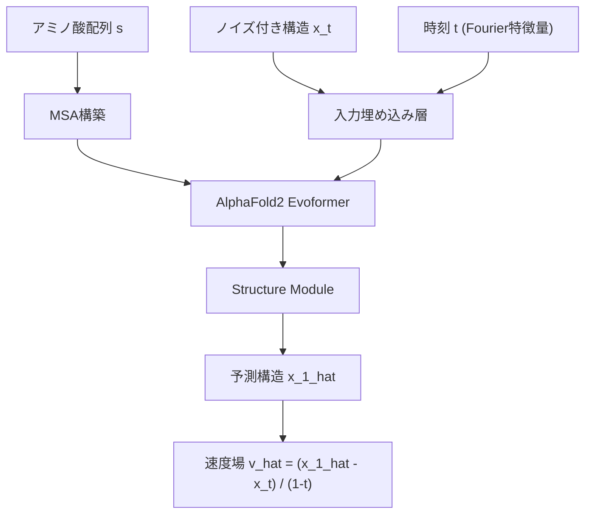

本記事は [arXiv:2402.04845](https://arxiv.org/abs/2402.04845) の解説記事です。

## 論文概要（Abstract）

AlphaFlowは、AlphaFold2やESMFoldといった既存のタンパク質構造予測モデルをフローマッチング（Flow Matching）によって再学習し、単一構造予測器を構造アンサンブルの生成モデルに転換する手法である。タンパク質は溶液中で複数のコンフォメーション（構造状態）を取るが、AlphaFold2は1つの静的構造しか予測できない。AlphaFlowはこの制約を克服し、分子動力学（MD）シミュレーションに匹敵する構造多様性を数桁高速に生成できることが著者らによって報告されている。ATLASベンチマークにおいて、per-target RMSFのPearson相関0.85を達成し、従来手法のMSAサブサンプリング（0.51）を大幅に上回る。

この記事は [Zenn記事: AISAR：AlphaFold2×NMRでタンパク質の隠れた構造状態を発見する](https://zenn.dev/0h_n0/articles/fa1b757f2324e1) の深掘りです。

## 情報源

- **会議名**: ICML 2024（41st International Conference on Machine Learning）
- **年**: 2024
- **Proceedings**: [PMLR Volume 235, pp.22277-22303](https://proceedings.mlr.press/v235/jing24a.html)
- **arXiv**: [2402.04845](https://arxiv.org/abs/2402.04845)
- **著者**: Bowen Jing, Bonnie Berger, Tommi Jaakkola（MIT CSAIL）
- **発表形式**: 2024年7月21-27日開催
- **コード**: [https://github.com/bjing2016/alphaflow](https://github.com/bjing2016/alphaflow)

## カンファレンス情報

**ICMLについて**: ICMLはNeurIPS、ICLRと並ぶ機械学習分野のトップカンファレンスである。本論文はPMLR Volume 235に収録されている。

## 技術的詳細（Technical Details）

### 問題設定

タンパク質は溶液中で熱揺らぎにより複数のコンフォメーションを取る。この構造分布 $p(\mathbf{x} \mid s)$（$\mathbf{x} \in \mathbb{R}^{3N}$ は $N$ 残基の座標、$s$ はアミノ酸配列）を学習することが目標である。AlphaFold2は $\mathbf{x}$ の点推定のみを出力するため、構造アンサンブルの生成には不向きである。

### フローマッチングの定式化

フローマッチングは、ノイズ分布 $q(\mathbf{x}_0)$ からデータ分布 $p(\mathbf{x}_1)$ への連続的な確率パスを学習する手法である。時刻 $t \in [0, 1]$ における中間状態は以下の条件付き確率パスで定義される。

$$
\mathbf{x}_t \mid \mathbf{x}_1 = (1 - t) \mathbf{x}_0 + t \mathbf{x}_1, \quad \mathbf{x}_0 \sim q(\mathbf{x}_0)
$$

ここで、
- $\mathbf{x}_0$: ノイズ分布からのサンプル
- $\mathbf{x}_1$: データ（実際のタンパク質構造）
- $t$: 補間パラメータ（$t = 0$ で完全なノイズ、$t = 1$ でデータ）

対応する条件付きベクトル場は以下で与えられる。

$$
u_t(\mathbf{x} \mid \mathbf{x}_1) = \frac{\mathbf{x}_1 - \mathbf{x}}{1 - t}
$$

モデルはこのベクトル場を近似する速度場 $\hat{v}(\mathbf{x}, t; \theta)$ を学習する。著者らは $\mathbf{x}_1$ 予測に再パラメータ化した形式を採用している。

$$
\hat{v}(\mathbf{x}, t; \theta) = \frac{\hat{\mathbf{x}}_1(\mathbf{x}, t; \theta) - \mathbf{x}}{1 - t}
$$

ここで $\hat{\mathbf{x}}_1(\mathbf{x}, t; \theta)$ はノイズ付き構造 $\mathbf{x}_t$ から元の構造 $\mathbf{x}_1$ を予測するネットワークであり、これはAlphaFold2の構造予測と自然に対応する。

### 調和的事前分布（Harmonic Prior）

著者らは等方的ガウスノイズの代わりに、タンパク質の鎖構造を反映した調和的事前分布（Harmonic Prior）を提案している。

$$
q(\mathbf{x}) \propto \exp\left[-\frac{\alpha}{2} \sum_{i=1}^{N-1} \|\mathbf{x}_i - \mathbf{x}_{i+1}\|^2\right]
$$

ここで $\alpha$ はバネ定数に相当するハイパーパラメータである。この事前分布により、隣接残基間の距離が近い初期ノイズが生成され、ポリマー鎖の物理的制約を反映した生成過程が可能となる。等方的ガウスノイズではタンパク質サイズに依存して収束速度が変化する問題があるが、調和的事前分布はこの問題を緩和する。

### SE(3)不変性の処理

タンパク質構造は剛体回転・並進に不変であるため、商空間 $\mathbb{R}^{3N}/\text{SE}(3)$ 上で動作する。各Eulerステップでのalignment後に線形補間を適用し、損失関数にはFAPE（Frame Aligned Point Error）の二乗を使用する。

### AlphaFold2のアーキテクチャ活用

AF2のテンプレート埋め込みに類似した入力層をフォールディングトランク前段に追加し、ノイズ付き構造 $\mathbf{x}_t$ と時刻 $t$（ガウシアンフーリエ特徴量）を入力する。$\beta$-炭素座標でのフロー損失と補助FAPE損失の組み合わせで学習する。



### アルゴリズム

以下にAlphaFlowの推論パイプラインの擬似コードを示す。

```python
import torch


def alphaflow_inference(
    model: torch.nn.Module,
    sequence: str,
    msa: torch.Tensor,
    n_samples: int = 250,
    n_steps: int = 10,
    t_max: float = 1.0,
) -> list[torch.Tensor]:
    """AlphaFlowによる構造アンサンブル生成

    Args:
        model: 学習済みAlphaFlowモデル
        sequence: アミノ酸配列
        msa: Multiple Sequence Alignment
        n_samples: 生成サンプル数
        n_steps: Eulerステップ数
        t_max: 温度パラメータ (0.0-1.0)

    Returns:
        生成構造のリスト (各要素: (N_residues, 3))
    """
    n_res = len(sequence)
    dt = t_max / n_steps
    ensemble: list[torch.Tensor] = []

    for _ in range(n_samples):
        x_t = sample_harmonic_prior(n_res)  # 調和的事前分布
        for i in range(n_steps):
            t = i * dt
            x1_pred = model(x_t, t, sequence, msa)
            v_t = (x1_pred - x_t) / (1.0 - t + 1e-8)
            x_t = rmsd_align(x_t + v_t * dt, x1_pred)
        ensemble.append(x_t.detach())

    return ensemble
```

### 温度パラメータによる多様性制御

AlphaFlowの重要な特徴として、推論時の温度パラメータ $T$ による多様性制御がある。

- $T \to 0$: AlphaFold2の決定論的予測に収束（単一構造）
- $T = 1$: 学習時の分布に従った完全な生成（最大の多様性）
- $0 < T < 1$: 精度と多様性のトレードオフを調整

推論時にODE積分の開始点を $\mathbf{x}_0 \sim \mathcal{N}(0, T^2 \mathbf{I})$ とスケーリングすることで温度制御を実現する。

## 実装のポイント

### モデルバリアント

著者らは3種類のモデルバリアントを提供している。

| バリアント | ベースモデル | 学習データ | MSA必要 | 特徴 |
|-----------|------------|-----------|---------|------|
| AlphaFlow-PDB | AlphaFold2 | PDB (128万例) | Yes | 実験構造の多様性を学習 |
| AlphaFlow-MD | AlphaFold2 | ATLAS MD (4.3万例) | Yes | MD軌跡の分布を学習 |
| ESMFlow | ESMFold | PDB (72万例) | No | MSA不要で高速 |

### 学習の詳細

AlphaFlow-PDBは8台のA100で267 GPU時間の学習を要する。クロップサイズ256残基、バッチサイズ64。学習時の20%を $t = 0$（ノイズなし）で実行しAF2の初期精度を維持する。

AlphaFlow-MDはATLAS（1,390タンパク質、テスト82）で追加ファインチューニングし、11 GPU時間で完了する。バッチサイズ8、$t = 0$ の学習割合10%。

ESMFlowはMSA不要でESMFoldの言語モデル埋め込みを活用する。72万PDB例で104 GPU時間の学習を要し、MSA構築不要のため推論スループットが高い。

### 蒸留モデル

10ステップのAlphaFlowを1ステップで近似する蒸留モデルも提供されている。蒸留学習には105 GPU時間を要するが、推論時に10倍の高速化を実現する。さらに2024年6月に追加された12層版モデルは、48層版と比較して2.5倍高速に動作すると報告されている。

### GPU要件

Python 3.9、PyTorch 1.12.1、CUDA 11.3が必要である。OpenFoldへの依存によりCUDA 11系が推奨される。256残基のクロップで16GB以上のGPUメモリが推奨される。

## Production Deployment Guide

タンパク質構造アンサンブル生成はGPU必須のMLワークロードである。以下にAWS上でのトラフィック量別推奨構成を示す。

**コスト試算の注意事項**: 以下の概算値は2026年4月時点のAWS ap-northeast-1（東京）リージョン料金に基づく。実際のコストはトラフィックパターン、リージョン、バースト使用量により変動する。最新料金はAWS料金計算ツールで確認を推奨する。

| 構成 | トラフィック | インスタンス | 月額概算 |
|------|------------|------------|---------|
| Small | ~10 req/日 | g5.xlarge (1 A10G, 24GB) x1 | $800-1,200 |
| Medium | ~100 req/日 | g5.2xlarge x2 (Spot) | $1,500-2,500 |
| Large | 1000+ req/日 | p4d.24xlarge (8 A100) on EKS | $8,000-15,000 |

**Small構成**: SageMaker Real-time Endpointにg5.xlargeインスタンスを配置。1リクエストあたり250サンプル生成で数分の推論時間を想定。夜間自動停止で月額40-50%削減可能。

**Medium構成**: SageMaker Asynchronous Inferenceを利用し、Spot Instancesで最大70%のコスト削減を実現。S3を介した非同期処理により、長時間推論をタイムアウトなく実行できる。

**Large構成**: EKS上にKarpenterを導入し、GPU Spot Nodesを自動スケーリング。p4d.24xlarge（8xA100）でバッチ推論を並列実行する。Reserved Instancesの1年コミットで最大40%削減。

**コスト削減テクニック**:
- Spot Instances活用で最大70%削減（GPU Spotはオンデマンド比で変動が大きいため70%を保守的に見積もる）
- SageMaker Savings Plans購入で最大64%削減
- 蒸留モデル使用で推論時間10分の1に短縮（同一コストで10倍スループット）
- 12層版モデル使用で推論時間2.5分の1に短縮

### Terraformインフラコード

**Small構成（SageMaker Endpoint）**:

```hcl
# SageMaker Real-time Endpoint for AlphaFlow inference
# Region: ap-northeast-1, 2026-04 時点の構成

resource "aws_iam_role" "sagemaker_execution" {
  name               = "alphaflow-sagemaker-role"
  assume_role_policy = jsonencode({
    Version = "2012-10-17"
    Statement = [{
      Action    = "sts:AssumeRole"
      Effect    = "Allow"
      Principal = { Service = "sagemaker.amazonaws.com" }
    }]
  })
}

resource "aws_sagemaker_model" "alphaflow" {
  name               = "alphaflow-model"
  execution_role_arn = aws_iam_role.sagemaker_execution.arn
  primary_container {
    image          = "763104351884.dkr.ecr.ap-northeast-1.amazonaws.com/pytorch-inference:2.1.0-gpu-py310-cu121-ubuntu20.04-sagemaker"
    model_data_url = "s3://alphaflow-model-artifacts/model.tar.gz"
  }
}

resource "aws_sagemaker_endpoint_configuration" "alphaflow" {
  name = "alphaflow-endpoint-config"
  production_variants {
    variant_name           = "primary"
    model_name             = aws_sagemaker_model.alphaflow.name
    instance_type          = "ml.g5.xlarge"  # 1x A10G 24GB
    initial_instance_count = 1
  }
}

resource "aws_sagemaker_endpoint" "alphaflow" {
  name                 = "alphaflow-endpoint"
  endpoint_config_name = aws_sagemaker_endpoint_configuration.alphaflow.name
}

resource "aws_budgets_budget" "alphaflow" {
  name         = "alphaflow-monthly-budget"
  budget_type  = "COST"
  limit_amount = "1200"
  limit_unit   = "USD"
  time_unit    = "MONTHLY"
  notification {
    comparison_operator        = "GREATER_THAN"
    threshold                  = 80
    threshold_type             = "PERCENTAGE"
    notification_type          = "ACTUAL"
    subscriber_email_addresses = ["alerts@example.com"]
  }
}
```

**Large構成（EKS + Karpenter + Spot）**:

```hcl
module "eks" {
  source          = "terraform-aws-modules/eks/aws"
  version         = "~> 20.0"
  cluster_name    = "alphaflow-cluster"
  cluster_version = "1.30"
  vpc_id          = module.vpc.vpc_id
  subnet_ids      = module.vpc.private_subnets
}

# Karpenter: GPU Spot ノード自動スケーリング
resource "kubectl_manifest" "karpenter_nodepool" {
  yaml_body = <<-YAML
    apiVersion: karpenter.sh/v1
    kind: NodePool
    metadata:
      name: gpu-spot
    spec:
      template:
        spec:
          requirements:
            - key: "node.kubernetes.io/instance-type"
              operator: In
              values: ["g5.xlarge", "g5.2xlarge", "g5.4xlarge"]
            - key: "karpenter.sh/capacity-type"
              operator: In
              values: ["spot", "on-demand"]
      limits:
        nvidia.com/gpu: "8"
      disruption:
        consolidationPolicy: WhenEmptyOrUnderutilized
  YAML
}
```

### 運用・監視設定

**CloudWatch Logs Insights クエリ**:

```
# 推論レイテンシ分析（P95/P99）
fields @timestamp, @message
| filter @message like /inference_time/
| stats percentile(inference_time_ms, 95) as p95,
        percentile(inference_time_ms, 99) as p99
  by bin(1h)
```

**CloudWatch アラーム設定（Python）**:

```python
import boto3


def create_sagemaker_alarms(endpoint_name: str, sns_topic_arn: str) -> None:
    """SageMakerエンドポイントの監視アラームを作成"""
    cw = boto3.client("cloudwatch", region_name="ap-northeast-1")

    # 推論レイテンシ異常検知 (P99 > 600秒でアラート)
    cw.put_metric_alarm(
        AlarmName=f"{endpoint_name}-high-latency",
        MetricName="ModelLatency",
        Namespace="AWS/SageMaker",
        Statistic="p99",
        Period=300,
        EvaluationPeriods=2,
        Threshold=600_000_000,  # マイクロ秒単位
        ComparisonOperator="GreaterThanThreshold",
        Dimensions=[
            {"Name": "EndpointName", "Value": endpoint_name},
            {"Name": "VariantName", "Value": "primary"},
        ],
        AlarmActions=[sns_topic_arn],
    )
```

**Cost Explorer日次レポート（Python）**:

```python
import boto3
from datetime import datetime, timedelta


def get_daily_gpu_cost_report() -> dict[str, float]:
    """AlphaFlow関連の日次GPUコストレポートを取得"""
    ce = boto3.client("ce", region_name="us-east-1")
    today = datetime.utcnow().date()
    response = ce.get_cost_and_usage(
        TimePeriod={"Start": (today - timedelta(days=1)).isoformat(), "End": today.isoformat()},
        Granularity="DAILY",
        Metrics=["UnblendedCost"],
        Filter={"Tags": {"Key": "Project", "Values": ["alphaflow"]}},
        GroupBy=[{"Type": "DIMENSION", "Key": "SERVICE"}],
    )
    costs = {g["Keys"][0]: float(g["Metrics"]["UnblendedCost"]["Amount"])
             for g in response["ResultsByTime"][0]["Groups"]}
    if sum(costs.values()) > 100:
        boto3.client("sns", region_name="ap-northeast-1").publish(
            TopicArn="arn:aws:sns:ap-northeast-1:ACCOUNT:alphaflow-alerts",
            Subject="AlphaFlow日次コスト警告",
            Message=f"日次コスト超過: {costs}",
        )
    return costs
```

### コスト最適化チェックリスト

**アーキテクチャ選択**: トラフィック量に応じた構成選択（Small: SageMaker / Large: EKS + Spot）、非同期処理可能ならAsync Inference、バッチ処理可能ならBatch Transform。

**リソース最適化**: GPU Spot優先（g5系で最大70%削減）、SageMaker Savings Plans（最大64%削減）、蒸留モデル（推論10分の1）、12層版（2.5分の1）、夜間自動停止。

**モデル最適化**: バッチ推論で複数配列同時処理、Eulerステップ最小化（10ステップで十分）、温度 $T$ の用途別調整、ESMFlow活用でMSA構築回避。

**監視**: AWS Budgets（80%通知）、CloudWatch GPU監視、Cost Anomaly Detection、日次コストレポート。

**リソース管理**: 未使用エンドポイント削除、S3ライフサイクルポリシー、Projectタグ、開発環境夜間停止。

## 実験結果（Results）

### ATLASベンチマーク（MD軌跡との比較）

著者らはATLASデータセットの82テストタンパク質に対して、MDシミュレーション軌跡との一致度を評価している。以下にTable 1（論文）の主要指標を示す。

| 指標 | AlphaFlow-MD | AlphaFlow-MD (蒸留) | MSAサブサンプリング | MD参照 |
|------|-------------|-------------------|------------------|--------|
| Pairwise RMSD (A) | 2.89 | 1.94 | 4.40 | 2.18 |
| RMSD Pearson $r$ | 0.48 | 0.48 | 0.03 | 0.94 |
| All-atom RMSF (A) | 1.68 | 1.28 | 5.38 | 1.31 |
| Global RMSF $r$ | 0.60 | 0.54 | 0.13 | 0.91 |
| Per-target RMSF $r$ | 0.85 | 0.81 | 0.51 | 0.90 |
| MD PCA $W_2$ (A) | 1.52 | 1.73 | 2.44 | 1.25 |
| PC similarity >0.5 | 44% | 34% | 15% | 44% |
| Weak contacts Jaccard | 0.62 | 0.52 | 0.40 | 0.62 |

値は82テストタンパク質の中央値。MD参照列はMD軌跡の半分をリファレンス、半分を評価に使用した場合の上限値（論文Table 1より）。

### 結果の分析

**Per-target RMSF相関**: AlphaFlow-MDは0.85という高い相関を達成しており、MSAサブサンプリングの0.51を大幅に上回る。これは各タンパク質の柔軟な領域と剛直な領域の識別に成功していることを示している。

**アンサンブル多様性**: Pairwise RMSD 2.89 AはMD参照の2.18 Aよりやや大きいが、MSAサブサンプリングの4.40 Aと比較して物理的に妥当な範囲に収まっている。

**高次の構造観測量**: PC similarity（主成分類似度）は44%であり、MD参照の上限44%に匹敵する。Weak contacts Jaccard係数も0.62とMD参照と同値であり、残基間接触パターンの再現に成功している。

**蒸留モデルのトレードオフ**: 蒸留モデルは推論速度10倍の一方、Per-target RMSF相関は0.85から0.81、PC similarityは44%から34%に低下する。

**計算効率**: 著者らは蒸留モデルがMD軌跡の平衡特性への収束において約10倍高速であると報告している（論文Figure 4）。250サンプルでMD軌跡と同等の品質に到達する。

## 実運用への応用（Practical Applications）

### 創薬（Drug Discovery）

構造アンサンブルは薬剤結合部位の柔軟性評価に直結する。MDは1タンパク質に数日-数週間を要するが、AlphaFlowは数分で生成でき、仮想スクリーニングにおける複数コンフォメーションへのドッキング計算を現実的にする。

### タンパク質工学（Protein Engineering）

変異体の構造アンサンブルを生成し、変異が構造揺らぎに与える影響を評価できる。ESMFlowならMSA不要で高速であり、多数の変異候補スクリーニングに適する。

### MDシミュレーションの高速プロキシ

全原子MDは各タンパク質に数マイクロ秒のシミュレーション時間を要するが、AlphaFlowは数秒-数分で近似する。ただし著者らが指摘する通り、ATLASの時間スケールを超える遅い構造変化は評価できない。

### AISARとの関連

Zenn記事のAISARはAlphaFold2とNMRデータの組み合わせで構造状態を発見する手法であり、AlphaFlowとは異なるアプローチだが、AF2を構造アンサンブル生成に拡張する目標を共有する。AlphaFlowがMDベースの学習で多様性を獲得し、AISARがNMR実験データを制約として活用する点で相補的である。

## まとめ

AlphaFlowはAlphaFold2をフローマッチングで再学習し、構造アンサンブル生成を実現した手法である。Per-target RMSF相関0.85を達成し、MDの高速プロキシとして機能する。温度 $T$ による多様性制御、蒸留モデルの10倍高速化、MSA不要のESMFlowなど実用的な設計がなされている。制約として、ATLASの時間スケールを超える構造変化への非対応が著者らにより明示されている。

## 参考文献

- **Conference Proceedings**: [PMLR v235, pp.22277-22303](https://proceedings.mlr.press/v235/jing24a.html)
- **arXiv**: [https://arxiv.org/abs/2402.04845](https://arxiv.org/abs/2402.04845)
- **Code**: [https://github.com/bjing2016/alphaflow](https://github.com/bjing2016/alphaflow)
- **ATLAS Dataset**: Vander Meersche et al., "ATLAS: protein flexibility and dynamics", Nucleic Acids Research, 2024
- **AlphaFold2**: Jumper et al., "Highly accurate protein structure prediction with AlphaFold", Nature, 2021
- **Flow Matching**: Lipman et al., "Flow Matching for Generative Modeling", ICLR 2023
- **Related Zenn article**: [https://zenn.dev/0h_n0/articles/fa1b757f2324e1](https://zenn.dev/0h_n0/articles/fa1b757f2324e1)
