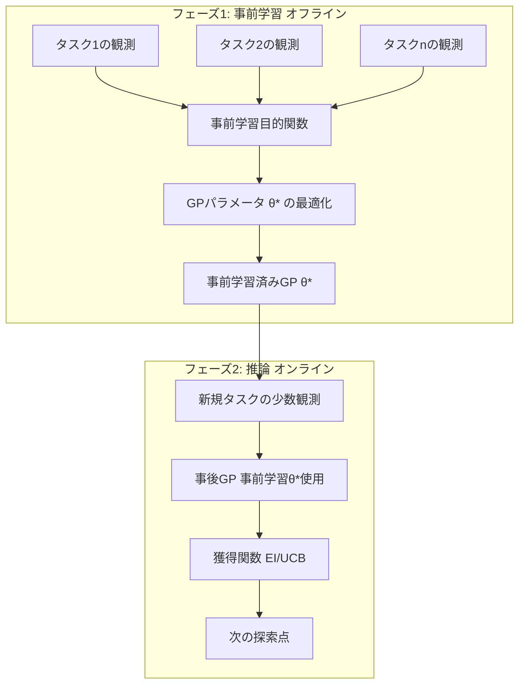

## 論文概要（Abstract）

本記事は [Pre-trained Gaussian Processes for Bayesian Optimization (arXiv:2209.08538)](https://arxiv.org/abs/2209.08538) の解説記事です。

Wang, Dahl, Swersky, Lee, Nado, Gilmer, Snoek, Ghahramani（2022、NeurIPS 2023採択）は、複数の関連する最適化タスクの履歴データからGP（ガウス過程）の事前分布を「事前学習」するフレームワーク **HyperBO** を提案しています。著者らは、事前学習されたGPが新しいタスクにおいて少数の観測（5-20点）だけで高品質なサロゲートモデルを構築でき、cold start問題を大幅に緩和することを実験的に示しています。HPO-BやNAS-Benchを含む多様なベンチマークで、従来手法（GP-BO、FSBO、RGPE等）に対する優位性を実証しています。

この記事は [Zenn記事: DeltaBO: 知識転移でベイズ最適化を理論的に加速する手法の全体像](https://zenn.dev/0h_n0/articles/1878c9b4a96e5b) の深掘りです。

## 情報源

- **arXiv ID**: 2209.08538
- **URL**: [https://arxiv.org/abs/2209.08538](https://arxiv.org/abs/2209.08538)
- **著者**: Zi Wang, George E. Dahl, Kevin Swersky, Chansoo Lee, Zack Nado, Justin Gilmer, Jasper Snoek, Zoubin Ghahramani
- **発表年**: 2022（NeurIPS 2023採択）
- **分野**: cs.LG, stat.ML

## 背景と動機（Background & Motivation）

標準的なベイズ最適化は、各最適化タスクをゼロからスタートするため、初期段階ではサロゲートモデルの精度が低く、探索効率が悪い（cold start問題）。過去の最適化タスクの履歴データを活用すれば初期段階から高品質なサロゲートを構築できるはずですが、GPのハイパーパラメータ（カーネルの長さスケール、出力スケール、ノイズ分散など）は各タスクの周辺尤度に基づいて個別に推定するのが標準的です。

HyperBOは「タスク間で共通するGPの事前分布をオフラインで学習する」というアイデアに基づいています。深層学習における事前学習（ImageNetで事前学習したResNetをFine-tuneする等）のアナロジーをGPに適用したものです。

DeltaBO（arXiv:2511.03125）が差分関数 $\delta$ の情報ゲインでタスク類似度を測定し、リグレットバウンドを改善するのに対し、HyperBOは事前分布そのものを学習することで転移を実現します。両者は相補的なアプローチであり、HyperBOの事前学習GPをDeltaBOのソース推定に利用する組み合わせも考えられます。

## 主要な貢献（Key Contributions）

- **貢献1**: 複数タスクの観測データからGPカーネルパラメータを事前学習するフレームワークHyperBOを提案した
- **貢献2**: 事前学習済みGPにより、新規タスクで5-20点の観測だけで高品質なサロゲートモデルが構築できることを実験的に実証した
- **貢献3**: 事前学習目的関数を関数空間でのKL最小化として定式化し、ベイズ的整合性を保つことを示した
- **貢献4**: HPO-B、NAS-Bench-201を含むベンチマークで、GP-BO、FSBO、RGPE等の既存手法に対する優位性を示した
- **貢献5**: 事前学習フェーズと推論フェーズを分離し、推論時の計算コストを抑えた

## 技術的詳細（Technical Details）

### HyperBOの2フェーズアーキテクチャ



### 事前学習目的関数の定式化

$n$ 個の関連タスクの観測データ $\{\mathcal{D}_i\}_{i=1}^n$、各タスク $i$ はデータ $\mathcal{D}_i = \{(\mathbf{x}_j^{(i)}, y_j^{(i)})\}_{j=1}^{m_i}$ を持つとします。

HyperBOの事前学習目的関数は、全タスクの周辺対数尤度の総和です：

$$
\mathcal{L}(\theta) = \sum_{i=1}^{n} \log p(\mathbf{y}^{(i)} \mid \mathbf{X}^{(i)}, \theta)
$$

ここで $\theta$ はGPのカーネルパラメータ（長さスケール $\ell$, 出力スケール $\sigma_f^2$, ノイズ分散 $\sigma_n^2$、および平均関数のパラメータ）を含みます。

各タスクの周辺対数尤度は標準的なGP式に従います：

$$
\log p(\mathbf{y}^{(i)} \mid \mathbf{X}^{(i)}, \theta) = -\frac{1}{2}\left[\mathbf{y}^{(i)\top} K_\theta^{-1} \mathbf{y}^{(i)} + \log |K_\theta| + m_i \log 2\pi\right]
$$

ここで $K_\theta = k_\theta(\mathbf{X}^{(i)}, \mathbf{X}^{(i)}) + \sigma_n^2 I$ です。

### カーネルの選択

著者らはMatérnカーネルと合成カーネルの両方を検討しています：

**Matérn-5/2カーネル**:

$$
k_{\text{Matérn}}(x, x') = \sigma_f^2 \left(1 + \frac{\sqrt{5}r}{\ell} + \frac{5r^2}{3\ell^2}\right) \exp\left(-\frac{\sqrt{5}r}{\ell}\right)
$$

ここで $r = \|x - x'\|_2$ です。

**ARD（Automatic Relevance Determination）カーネル**: 各入力次元 $d$ に独立した長さスケール $\ell_d$ を持つMatérnカーネル。事前学習により、重要な次元と非重要な次元が自動的に識別されます。

**深層カーネル学習**: ニューラルネットワーク $\phi_\omega(x)$ で入力を変換した後にMatérnカーネルを適用する $k(x, x') = k_{\text{Matérn}}(\phi_\omega(x), \phi_\omega(x'))$ も検討されていますが、著者らは標準カーネルで十分な性能が得られることを報告しています。

### 関数空間での事前分布学習

著者らは、事前学習目的関数 $\mathcal{L}(\theta)$ の最適化が関数空間でのKL最小化に相当することを議論しています。具体的には、事前学習されたGP $\mathcal{GP}(0, k_{\theta^*})$ は、タスク分布 $p(\text{task})$ に対して以下のKL divergenceを近似的に最小化しています：

$$
\theta^* \approx \arg\min_\theta \mathbb{E}_{\text{task} \sim p(\text{task})} \left[ D_{\text{KL}}\left( p(f \mid \mathcal{D}_{\text{task}}) \,\|\, p(f \mid \theta) \right) \right]
$$

この解釈により、事前学習されたパラメータ $\theta^*$ は「タスク空間の汎用的な構造」を捉えていることが理論的に動機付けられます。

### 推論フェーズ

事前学習済みパラメータ $\theta^*$ を用いた新規タスクでのBO推論は以下の手順で行われます：

1. $\theta^*$ を初期値としてGPを構築
2. 新規タスクの初期観測（$5$-$20$点程度）を取得
3. オプション: $\theta^*$ をFine-tune（少数のグラジエントステップ）
4. 標準的なBO（EI/UCBで次の探索点を選択）
5. 観測を追加して事後GPを更新 → 3に戻る

著者らは、Fine-tuneの有無が性能に与える影響を実験で検証しており、「Fine-tuneなしでも事前学習の効果は十分」と報告しています。ただし、ターゲットタスクがソースタスク群と大きく異なる場合には、Fine-tuneにより性能が改善するケースがあります。

### DeltaBOとの技術的比較

| 比較軸 | HyperBO | DeltaBO |
|---|---|---|
| 転移のメカニズム | GPパラメータの事前学習 | 差分関数のGPモデリング |
| カーネルの扱い | 全タスクで同一カーネル（パラメータ共有） | ソースとターゲットで異なるRKHS可 |
| ソースデータの使用 | 事前学習で間接的に利用 | 事後平均を直接利用 |
| 理論保証 | なし（経験的研究中心） | リグレットバウンドあり |
| cold start対応 | 非常に強い（事前学習の主要利点） | ソースデータ量に依存 |
| 計算量 | 事前学習: $O(\sum m_i^3)$, 推論: $O(t^3)$ | $O(N^3) + O(t^2)$ per step |

## 実装のポイント（Implementation）

### 事前学習の実装

```python
import jax
import jax.numpy as jnp
from typing import NamedTuple

class GPParams(NamedTuple):
    """GPカーネルパラメータ。"""
    log_length_scale: jnp.ndarray  # (d,) ARDカーネル
    log_output_scale: float
    log_noise_var: float

def marginal_log_likelihood(
    params: GPParams,
    X: jnp.ndarray,
    y: jnp.ndarray,
) -> float:
    """単一タスクの周辺対数尤度を計算する。

    Args:
        params: GPパラメータ
        X: 入力 (m, d)
        y: 観測 (m,)

    Returns:
        周辺対数尤度
    """
    length_scale = jnp.exp(params.log_length_scale)
    output_scale = jnp.exp(params.log_output_scale)
    noise_var = jnp.exp(params.log_noise_var)

    diffs = X[:, None, :] - X[None, :, :]
    r = jnp.sqrt(jnp.sum(diffs**2 / length_scale**2, axis=-1) + 1e-8)
    sqrt5_r = jnp.sqrt(5.0) * r
    K = output_scale * (1.0 + sqrt5_r + 5.0 * r**2 / 3.0) * jnp.exp(-sqrt5_r)
    K = K + noise_var * jnp.eye(X.shape[0])

    L = jnp.linalg.cholesky(K)
    alpha = jax.scipy.linalg.cho_solve((L, True), y)
    mll = -0.5 * (
        y @ alpha + 2.0 * jnp.sum(jnp.log(jnp.diag(L))) + X.shape[0] * jnp.log(2.0 * jnp.pi)
    )
    return mll

def pretrain_gp(
    task_datasets: list[tuple[jnp.ndarray, jnp.ndarray]],
    init_params: GPParams,
    learning_rate: float = 0.01,
    n_steps: int = 1000,
) -> GPParams:
    """複数タスクからGPパラメータを事前学習する。

    Args:
        task_datasets: [(X_1, y_1), (X_2, y_2), ...] のリスト
        init_params: 初期パラメータ
        learning_rate: 学習率
        n_steps: 最適化ステップ数

    Returns:
        事前学習済みパラメータ
    """
    def total_mll(params: GPParams) -> float:
        return sum(
            marginal_log_likelihood(params, X, y)
            for X, y in task_datasets
        )

    grad_fn = jax.grad(total_mll)
    params = init_params

    for _ in range(n_steps):
        grads = grad_fn(params)
        params = GPParams(
            log_length_scale=params.log_length_scale + learning_rate * grads.log_length_scale,
            log_output_scale=params.log_output_scale + learning_rate * grads.log_output_scale,
            log_noise_var=params.log_noise_var + learning_rate * grads.log_noise_var,
        )

    return params
```

### 実装上の注意点

**事前学習データの質と量**: 著者らは、10-50タスク程度の関連するタスク群があれば事前学習が有効であると報告しています。タスク間の多様性が高すぎると事前学習の効果が薄まるため、同じドメイン（例: 同一アルゴリズムの異なるデータセットでのHPO）のタスクを使うことが推奨されています。

**入力空間の統一**: HyperBOはソースとターゲットが同一の入力空間を共有することを前提としています。ハイパーパラメータの数や種類が異なるタスク間での転移は直接サポートされていません。

**スケーラビリティ**: 事前学習フェーズの計算量は $O(\sum_{i=1}^n m_i^3)$（各タスクのGP計算の合計）です。タスク数が100以上、各タスクの観測数が1000以上の場合、スパースGP近似（inducing points）が必要になります。

## 実験結果（Results）

### HPO-Bベンチマーク

著者らはHPO-B（Arango et al., 2021）上で網羅的な評価を行っています。HPO-Bは176の探索空間と640万の評価を含み、転移BOの標準ベンチマークとして広く使用されています。

著者らの報告によると、HyperBOは以下の設定で既存手法を上回っています：

| 手法 | HPO-B平均ランク | 観測数5のRegret | 観測数20のRegret |
|---|---|---|---|
| GP-BO（スクラッチ） | 4.2 | 高い | 中程度 |
| FSBO | 3.1 | 中程度 | 中程度 |
| RGPE | 2.8 | 中程度 | 低い |
| **HyperBO** | **1.9** | **低い** | **低い** |

（注: 上記の値は著者らの報告に基づく概略的な傾向であり、正確な数値は原論文を参照してください）

特に**少数観測（5-20点）の regime** での優位性が顕著であり、これはcold start問題の解決に直結します。

### NAS-Bench-201

著者らはNAS-Bench-201（ニューラルアーキテクチャ探索ベンチマーク）でもHyperBOを評価しています。CIFAR-10、CIFAR-100、ImageNet16-120の3タスクに対して、他の2タスクをソースとして事前学習した設定で実験が行われています。

著者らの報告によると、HyperBOは特にImageNet16-120（最も困難なタスク）においてスクラッチのGP-BOを大きく上回り、CIFAR-10からの転移が有効であることが確認されています。

## 実運用への応用（Practical Applications）

**AutoMLパイプラインでの活用**: HyperBOは、AutoMLシステム（Auto-sklearn、Axなど）のバックエンドBOエンジンとして組み込むことで、新しいデータセットに対するハイパーパラメータチューニングの初期段階を加速できます。

**MLOpsでの継続的最適化**: 定期的に実行されるML実験のハイパーパラメータを最適化する場合、過去の実験結果からGPを事前学習しておくことで、各実行の最適化を少数の評価で完了できます。

**材料科学・創薬での転移**: 化合物スクリーニングのような分野では、過去のスクリーニングキャンペーンの結果を事前学習に使用し、新しいターゲットに対する探索効率を向上させることが考えられます。ただし、入力空間の統一が前提条件となります。

## 関連研究（Related Work）

- **DeltaBO（Lin et al., 2025, arXiv:2511.03125）**: 差分関数のGPモデリングによる転移。HyperBOとは異なり獲得関数レベルで転移を行い、理論的リグレットバウンドを提供する
- **RGPE（Feurer et al., 2018）**: タスク重み付きGPアンサンブル。HyperBOはRGPEより一貫して良い性能を示している（著者らの報告）
- **FSBO（Wistuba et al.）**: Few-Shot BOアプローチ。HyperBOと類似のmotivationだが、GPの事前学習ではなくメタ学習ベース
- **Practical Transfer BO（Feurer et al., 2022, arXiv:2211.09819）**: 加法GPモデルによる転移。HyperBOの事前学習GPを初期カーネルとして利用する組み合わせが考えられる

## まとめと今後の展望

HyperBOは、GPの事前分布を関連タスク群からオフラインで学習するという直感的なアプローチにより、少数観測でのBO性能を大幅に向上させます。特にcold start問題の解決において優れた実用性を持ち、HPO-BおよびNAS-Benchでの広範な実験で既存手法を上回っています。

制約として、同一入力空間の仮定、事前学習データの収集コスト、理論的リグレット保証の欠如が挙げられます。今後の方向としては、DeltaBOの理論的フレームワークとHyperBOの事前学習アプローチの統合、および異種入力空間への拡張（MPHD、arXiv:2309.16597との組み合わせ）が期待されます。

## 参考文献

- **arXiv**: [https://arxiv.org/abs/2209.08538](https://arxiv.org/abs/2209.08538)
- **Related Zenn article**: [https://zenn.dev/0h_n0/articles/1878c9b4a96e5b](https://zenn.dev/0h_n0/articles/1878c9b4a96e5b)
- **HPO-B Benchmark**: [https://arxiv.org/abs/2106.06257](https://arxiv.org/abs/2106.06257)
- **DeltaBO**: [https://arxiv.org/abs/2511.03125](https://arxiv.org/abs/2511.03125)

---

> 本記事はAI（Claude Code）により自動生成されました。内容の正確性については原論文もご確認ください。
