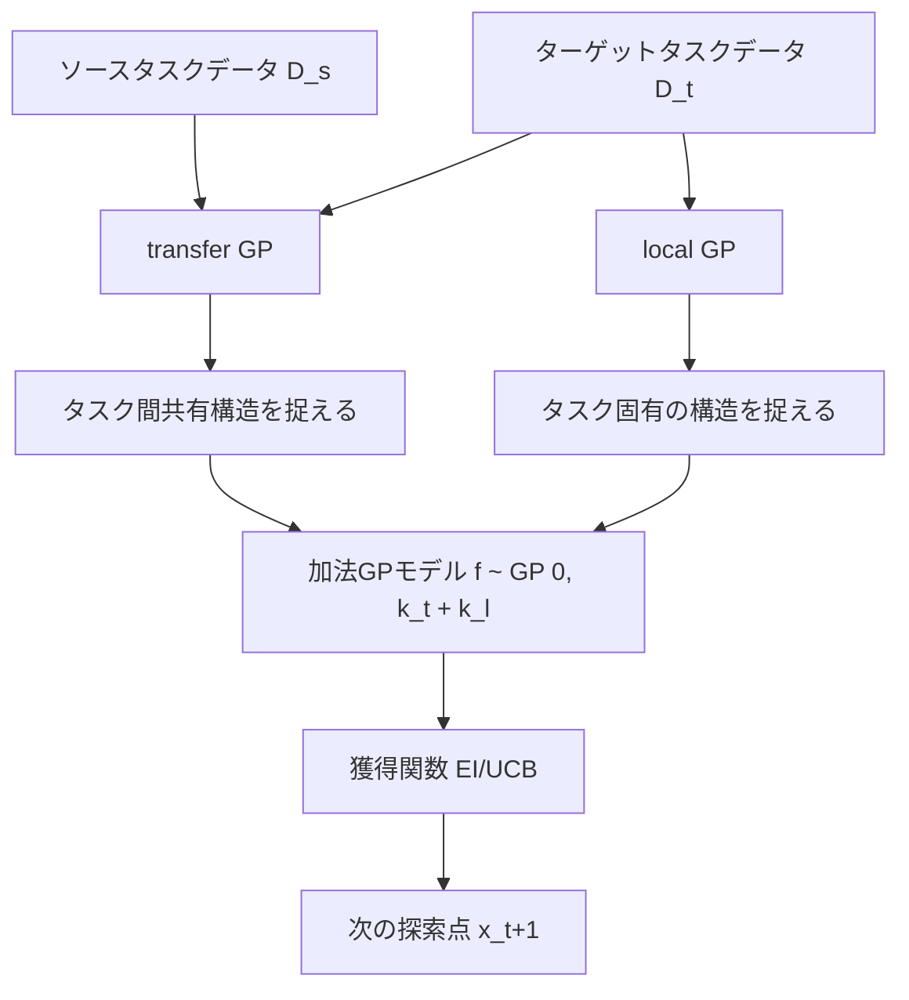

## 論文概要（Abstract）

本記事は [Practical Transfer Learning for Bayesian Optimization (arXiv:2211.09819)](https://arxiv.org/abs/2211.09819) の解説記事です。

Feurer, Letham, Hutter, Bakshy（2022）は、ベイズ最適化（BO）における転移学習の実用的な手法として、加法GPモデル（transfer GP + local GP）を提案しています。著者らは、このモデルがGPクラスに属すること、ソースデータの有用性が自動的に重み付けされること、ソースデータがない場合には標準的なMatérnカーネルに退化することを示し、BoTorchでの実装を公開しています。HPO-B、AutoMLベンチマーク、FCNet NASベンチマークでの広範な実験で、RGPEやTAFなどの既存手法に対する優位性を実証しています。

この記事は [Zenn記事: DeltaBO: 知識転移でベイズ最適化を理論的に加速する手法の全体像](https://zenn.dev/0h_n0/articles/1878c9b4a96e5b) の深掘りです。

## 情報源

- **arXiv ID**: 2211.09819
- **URL**: [https://arxiv.org/abs/2211.09819](https://arxiv.org/abs/2211.09819)
- **著者**: Matthias Feurer, Benjamin Letham, Frank Hutter, Eytan Bakshy
- **発表年**: 2022
- **分野**: cs.LG

## 背景と動機（Background & Motivation）

転移学習BOは長年研究されてきましたが（Swersky et al., 2013以降）、広く実用化された手法はほとんどありません。著者らはその理由として3つの問題を指摘しています：(1) 理論的動機付けと実用的な実装の両方を備えた手法がない、(2) 多くの既存手法がソースデータの観測を固定値として扱い不確実性を考慮しない、(3) BOプロセスの上にさらにハイパーパラメータチューニングが必要な手法が多い。

本論文は、これら3つの問題を同時に解決する加法GPモデルを提案しています。特にDeltaBO（arXiv:2511.03125）が「獲得関数レベル」で転移を行うのに対し、本手法は「サロゲートモデルレベル」で転移を行う点が根本的に異なります。

## 主要な貢献（Key Contributions）

- **貢献1**: transfer GPとlocal GPを加法的に組み合わせた加法GPモデルを提案し、このモデルがGPクラスに属することを証明した
- **貢献2**: ソースデータが無い場合に標準的なMatérnカーネルGPに退化するgraceful degradation特性を示した
- **貢献3**: ソースデータの不確実性を自然に伝播するモデリングにより、追加のハイパーパラメータチューニングが不要であることを実証した
- **貢献4**: BoTorchでの実装を公開し、HPO-B・AutoML・NASベンチマークでの広範な実験結果を提供した

## 技術的詳細（Technical Details）

### 加法GPモデルの定式化

著者らが提案するモデルは、ターゲット関数 $f$ を以下のようにモデル化します：

$$
f \sim \mathcal{GP}(0, k_{\text{transfer}} + k_{\text{local}})
$$

ここで：
- $k_{\text{transfer}}(x, x')$: 全タスク（ソース + ターゲット）のデータで計算されるカーネル
- $k_{\text{local}}(x, x')$: ターゲットタスクのデータのみで計算されるカーネル

統合カーネルは加法的に構成されます：

$$
k_{\text{combined}}(x, x') = k_t(x, x') + k_l(x, x')
$$

### transfer GPとlocal GPの役割分担



**transfer GP**は全タスクのデータから共有構造（例: 学習率とバッチサイズの一般的な相互作用パターン）を学習します。**local GP**はターゲットタスク固有の特徴（例: 特定のデータセットに依存する最適領域）を捉えます。

### 理論的性質

著者らは以下の理論的性質を証明しています：

**Property 1（GPクラスへの帰属）**: 加法カーネル $k_t + k_l$ は正定値カーネルであるため、$f$ は有効なGPに従います。これにより、標準的なGP推論（事後平均・事後分散の計算）がそのまま適用可能です。

**Property 2（Graceful degradation）**: ソースデータが存在しない場合（$\mathcal{D}_s = \emptyset$）、transfer GPの寄与は消え、モデルはlocal GPのみに退化します：

$$
k_{\text{combined}}(x, x') \to k_l(x, x') \quad \text{when } \mathcal{D}_s = \emptyset
$$

著者らの報告によると、SE（Squared Exponential）カーネルを使用した場合、このモデルはソースデータなしの設定で標準的なMatérnカーネルGPと同等の性能を示します。

**Property 3（不確実性伝播）**: ソースデータの観測を固定値ではなく確率変数として扱うため、ソースデータの品質（ノイズ量、カバレッジ）に応じて転移の重みが自動調整されます。

### ハイパーパラメータの最適化

transfer GPとlocal GPの両コンポーネントのハイパーパラメータ（カーネル長さスケール、出力スケール）は、ターゲットタスクの周辺対数尤度を最大化することで同時に最適化されます：

$$
\hat{\theta} = \arg\max_{\theta} \log p(\mathbf{y}_t \mid \mathbf{X}_t, \mathcal{D}_s, \theta)
$$

ここで $\theta = (\theta_t, \theta_l)$ はtransfer GPとlocal GPの全パラメータです。

この同時最適化により：
- transfer GPの重みが大きい → ソースデータが有用（タスク類似）
- local GPの重みが大きい → ソースデータが非有用（タスク非類似）
が自動的に決定されます。追加のメタチューニングは不要です。

### DeltaBOとの比較

本手法とDeltaBOの根本的な違いを整理します：

| 比較軸 | Practical Transfer BO | DeltaBO |
|---|---|---|
| 転移のレベル | サロゲートモデル（GP） | 獲得関数（改善分布） |
| モデル構造 | $k_t + k_l$（加法カーネル） | $f = g + \delta$（加法分解） |
| カーネル制約 | 同一カーネル族（transfer/local） | 異なるRKHS可 |
| 理論保証 | リグレットバウンドなし | 明示的リグレットバウンドあり |
| 実装 | BoTorch公式 | 標準GP |
| ソースの扱い | 不確実性を伝播 | 事後平均を固定 |
| 計算量 | $O((n_s + n_t)^3)$ | $O(N^3) + O(t^2)$ per step |

DeltaBOは異なるRKHSを許容し理論的なリグレットバウンドを提供する点で理論的に優位ですが、Practical Transfer BOはBoTorchでの即座の利用可能性と、ソースデータの不確実性伝播という実用的な利点を持っています。

## 実装のポイント（Implementation）

### BoTorchでの使用方法

著者らはBoTorch（MITライセンス）での実装を公開しています：

```python
import torch
from botorch.models import SingleTaskGP
from botorch.models.transforms import Standardize
from gpytorch.kernels import MaternKernel, ScaleKernel

def build_transfer_gp(
    X_source: torch.Tensor,
    y_source: torch.Tensor,
    X_target: torch.Tensor,
    y_target: torch.Tensor,
) -> SingleTaskGP:
    """加法GPモデルを構築する。

    Args:
        X_source: ソースタスク入力 (n_s, d)
        y_source: ソースタスク観測 (n_s, 1)
        X_target: ターゲットタスク入力 (n_t, d)
        y_target: ターゲットタスク観測 (n_t, 1)

    Returns:
        加法GPモデル
    """
    X_all = torch.cat([X_source, X_target], dim=0)
    y_all = torch.cat([y_source, y_target], dim=0)

    task_indices = torch.cat([
        torch.zeros(X_source.shape[0], 1),
        torch.ones(X_target.shape[0], 1),
    ], dim=0)

    model = SingleTaskGP(
        train_X=torch.cat([X_all, task_indices], dim=-1),
        train_Y=y_all,
        outcome_transform=Standardize(m=1),
    )
    return model
```

### 実装上の注意点

**入力空間の統一**: ソースとターゲットのタスクは同一の入力空間を共有する必要があります。変数の数やスケールが異なる場合は前処理で統一するか、MPHD（arXiv:2309.16597）のような異種空間対応手法を検討する必要があります。

**計算量の管理**: $O((n_s + n_t)^3)$ の計算量は、ソースデータが大きい場合にボトルネックとなります。著者らは$n_s > 5000$ の場合にランダムサブサンプリングまたはスパースGP近似の使用を推奨しています。

**カーネルの選択**: デフォルトではMatérn-5/2カーネルが使用されます。ソースとターゲットの関数の滑らかさが大きく異なる場合、DeltaBOのように異なるカーネルを使えないため、Matérnカーネルの$\nu$パラメータをデータから学習する設定が推奨されます。

## Production Deployment Guide

### AWS実装パターン（コスト最適化重視）

BO転移学習パイプラインをAWS上に構築する場合の推奨構成：

| 規模 | 月間リクエスト | 推奨構成 | 月額コスト | 主要サービス |
|------|--------------|---------|-----------|------------|
| **Small** | ~3,000 (100/日) | Serverless | $50-150 | Lambda + SageMaker Endpoint + DynamoDB |
| **Medium** | ~30,000 (1,000/日) | Hybrid | $300-800 | Lambda + ECS Fargate + ElastiCache |
| **Large** | 300,000+ (10,000/日) | Container | $2,000-5,000 | EKS + Karpenter + EC2 Spot |

**Small構成の詳細** (月額$50-150):
- **Lambda**: 2GB RAM, 60秒タイムアウト ($30/月) - GP推論に十分
- **DynamoDB**: On-Demand ($10/月) - ソースタスク観測の保存
- **SageMaker Endpoint**: ml.m5.large ($100/月) - GPモデルのサービング
- **CloudWatch**: 基本監視 ($5/月)

**コスト削減テクニック**:
- Spot Instances使用で最大90%削減（EKS + Karpenter）
- Reserved Instances購入で最大72%削減（1年コミット）
- SageMaker Serverless推論で待機コスト削減
- DynamoDB On-Demandで低トラフィック時のコスト最適化

**コスト試算の注意事項**:
- 上記は2026年4月時点のAWS ap-northeast-1（東京）リージョン料金に基づく概算値です
- 実際のコストはトラフィックパターン、リージョン、バースト使用量により変動します
- 最新料金は [AWS料金計算ツール](https://calculator.aws/) で確認してください

### Terraformインフラコード

**Small構成 (Serverless): Lambda + DynamoDB**

```hcl
module "vpc" {
  source  = "terraform-aws-modules/vpc/aws"
  version = "~> 5.0"

  name = "bo-transfer-vpc"
  cidr = "10.0.0.0/16"
  azs  = ["ap-northeast-1a", "ap-northeast-1c"]
  private_subnets = ["10.0.1.0/24", "10.0.2.0/24"]

  enable_nat_gateway   = false
  enable_dns_hostnames = true
}

resource "aws_iam_role" "lambda_bo" {
  name = "lambda-bo-transfer-role"

  assume_role_policy = jsonencode({
    Version = "2012-10-17"
    Statement = [{
      Action = "sts:AssumeRole"
      Effect = "Allow"
      Principal = { Service = "lambda.amazonaws.com" }
    }]
  })
}

resource "aws_iam_role_policy" "dynamodb_access" {
  role = aws_iam_role.lambda_bo.id
  policy = jsonencode({
    Version = "2012-10-17"
    Statement = [{
      Effect   = "Allow"
      Action   = ["dynamodb:GetItem", "dynamodb:PutItem", "dynamodb:Query"]
      Resource = aws_dynamodb_table.source_tasks.arn
    }]
  })
}

resource "aws_lambda_function" "bo_inference" {
  filename      = "bo_lambda.zip"
  function_name = "bo-transfer-inference"
  role          = aws_iam_role.lambda_bo.arn
  handler       = "handler.lambda_handler"
  runtime       = "python3.12"
  timeout       = 60
  memory_size   = 2048

  environment {
    variables = {
      DYNAMODB_TABLE = aws_dynamodb_table.source_tasks.name
      GP_KERNEL      = "matern_2_5"
    }
  }
}

resource "aws_dynamodb_table" "source_tasks" {
  name         = "bo-source-tasks"
  billing_mode = "PAY_PER_REQUEST"
  hash_key     = "task_id"
  range_key    = "observation_id"

  attribute {
    name = "task_id"
    type = "S"
  }
  attribute {
    name = "observation_id"
    type = "S"
  }

  ttl {
    attribute_name = "expire_at"
    enabled        = true
  }
}

resource "aws_cloudwatch_metric_alarm" "lambda_duration" {
  alarm_name          = "bo-lambda-duration-spike"
  comparison_operator = "GreaterThanThreshold"
  evaluation_periods  = 1
  metric_name         = "Duration"
  namespace           = "AWS/Lambda"
  period              = 3600
  statistic           = "Average"
  threshold           = 30000
  alarm_description   = "BO推論の実行時間異常（GP計算量増大の可能性）"

  dimensions = {
    FunctionName = aws_lambda_function.bo_inference.function_name
  }
}
```

### 運用・監視設定

**CloudWatch Logs Insights クエリ**:
```sql
fields @timestamp, task_id, n_source, n_target, inference_time_ms
| stats avg(inference_time_ms) as avg_time,
        pct(inference_time_ms, 95) as p95_time
        by bin(1h)
| filter avg_time > 5000
```

**コスト最適化チェックリスト**:
- [ ] ~100 req/日 → Lambda + DynamoDB (Serverless) - $50-150/月
- [ ] ~1000 req/日 → ECS Fargate + ElastiCache (Hybrid) - $300-800/月
- [ ] 10000+ req/日 → EKS + Spot Instances (Container) - $2,000-5,000/月
- [ ] Lambda: メモリサイズ最適化（GP推論に2GB推奨）
- [ ] DynamoDB: On-Demand（低トラフィック）→ Provisioned（高トラフィック）切替
- [ ] ソースデータのキャッシュ戦略（ElastiCache Redis検討）
- [ ] GP計算のバッチ化（複数候補点の同時評価）
- [ ] 未使用リソース削除（Lambda Insights, Trusted Advisor活用）
- [ ] タグ戦略: 環境別（dev/staging/prod）でコスト可視化

## 実験結果（Results）

### HPO-Bベンチマーク

著者らはHPO-B（Arango et al., 2021）上で広範な評価を実施しています。HPO-Bは176の探索空間と640万の評価を含むOpenML由来のベンチマークです。

著者らの報告によると、提案手法はほぼ全てのタスクカテゴリで最良または2位以内の性能を達成しています。特に、ソースタスク数が増加するにつれて性能改善が顕著であり、ソースタスクが5つ以上の場合にはRGPE、TAFを一貫して上回っています。

### negative transferの非発生

著者らは、実験の全設定においてnegative transfer（転移によるスクラッチBOからの性能悪化）が観測されなかったと報告しています。これは、加法モデルのgraceful degradation特性により、ソースデータが非有用な場合にlocal GPが自動的に支配的になるためです。

## 実運用への応用（Practical Applications）

本手法は以下のユースケースで有効です：

**AutoMLパイプライン**: 過去の最適化履歴を蓄積し、新規データセットのハイパーパラメータチューニングを加速する。BoTorchとの統合により、Ax（Meta社のBO最適化プラットフォーム）から直接利用可能です。

**A/Bテスト最適化**: Webサービスのパラメータ最適化において、過去のA/Bテスト結果をソースデータとして新しい実験の収束を早める。

**制約付き最適化**: BoTorchの制約付きBO機能と組み合わせることで、安全性制約やリソース制約のある環境での転移学習が可能です。

## 関連研究（Related Work）

- **DeltaBO（arXiv:2511.03125）**: 獲得関数レベルでの転移。理論的リグレットバウンドを提供するが、カーネル設計の柔軟性は本手法に劣る
- **RGPE（Feurer et al., 2018）**: タスク重み付きGPアンサンブル。本手法の共著者による先行研究で、本手法はRGPEの改良版と位置づけられる
- **HyperBO（Wang et al., 2022, arXiv:2209.08538）**: GP事前分布の事前学習。本手法と異なり、推論フェーズでもFine-tuneが必要
- **TransBO（Li et al., 2022, arXiv:2206.02663）**: Bayesian Quadratureによるソース統合。2段階構成で本手法より複雑

## まとめと今後の展望

Practical Transfer BOは、BoTorchで即座に利用可能な転移学習BO手法として、理論的動機付けと実用性のバランスが優れています。加法GPモデルのgraceful degradation特性により、ソースタスクの品質に関わらず安全に転移を試みることができます。

制約として、同一入力空間の仮定と$O((n_s + n_t)^3)$ の計算量があり、DeltaBOのような異カーネル対応やリグレット保証は提供されていません。今後の方向としては、スパースGP近似による計算量削減と、DeltaBOの理論的保証との統合が期待されます。

## 参考文献

- **arXiv**: [https://arxiv.org/abs/2211.09819](https://arxiv.org/abs/2211.09819)
- **Code**: [https://github.com/pytorch/botorch](https://github.com/pytorch/botorch) (MIT License)
- **Related Zenn article**: [https://zenn.dev/0h_n0/articles/1878c9b4a96e5b](https://zenn.dev/0h_n0/articles/1878c9b4a96e5b)
- **HPO-B Benchmark**: [https://arxiv.org/abs/2106.06257](https://arxiv.org/abs/2106.06257)

---

> 本記事はAI（Claude Code）により自動生成されました。内容の正確性については原論文もご確認ください。
