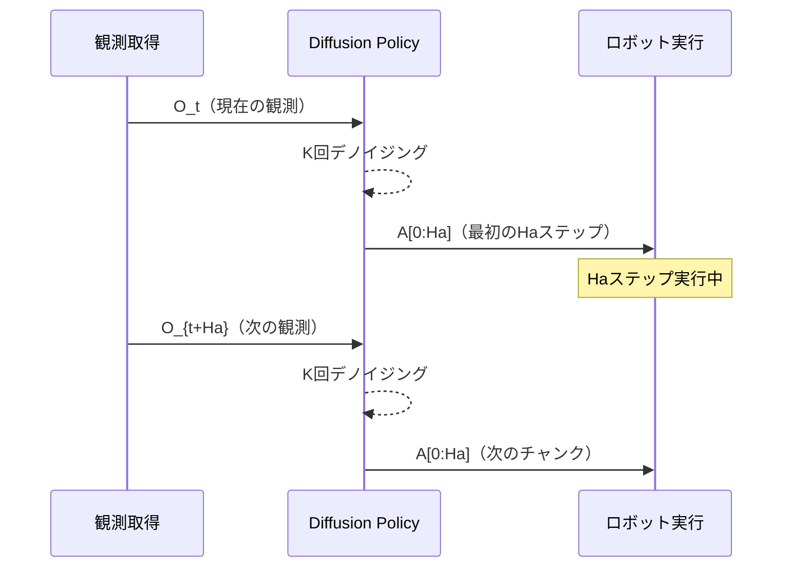

## 論文概要（Abstract）

本記事は [arXiv:2303.04137 Diffusion Policy: Visuomotor Policy Learning via Action Diffusion](https://arxiv.org/abs/2303.04137) の解説記事です。

Diffusion Policyは、Columbia大学とMIT CSAILの研究者が2023年3月に発表した、条件付きデノイジング拡散過程をロボットの行動生成に適用する手法である。従来のBehavior Cloning（BC）やImplicit Behavior Cloning（IBC）と異なり、マルチモーダルな行動分布を自然にモデル化できる。著者らによると、4つのロボット操作ベンチマーク（計12タスク）で平均46.9%の改善を達成したと報告されている。RSS 2023で発表された後、International Journal of Robotics Researchの拡張版として公開されている。π0シリーズのFlow Matchingアクション生成の直接的な技術的前身である。

この記事は [Zenn記事: π0.7徹底解説 ─ ロボット基盤モデルに構成的汎化が芽生えた](https://zenn.dev/0h_n0/articles/b8a023d5dfc83c) の深掘りです。

## 情報源

- **arXiv ID**: [2303.04137](https://arxiv.org/abs/2303.04137)
- **著者**: Cheng Chi, Zhenjia Xu, Siyuan Feng, Eric Cousineau, Yilun Du, Benjamin Burchfiel, Russ Tedrake, Shuran Song
- **発表年**: 2023年3月（v1）、2024年3月（v5改訂）
- **会議**: RSS 2023（Best Paper Award Finalist）
- **分野**: cs.RO
- **コード**: [github.com/real-stanford/diffusion_policy](https://github.com/real-stanford/diffusion_policy)（MIT License）

## 背景と動機（Background & Motivation）

ロボットのBehavior Cloning（BC）では、デモンストレーションデータから方策 $\pi(a \mid o)$（観測 $o$ が与えられたときの行動 $a$ の分布）を直接学習する。しかし従来のBCには根本的な課題があった。

**マルチモーダル性の問題**: 同じタスクに対して複数の正解経路が存在する場合（テーブルの左から回り込む or 右から回り込む等）、平均回帰型の損失関数（MSE等）では複数のモードの平均を学習してしまい、どちらの経路にも属さない不自然な行動を生成する。

**高次元行動空間**: ロボットの自由度が増えると行動空間の次元が急増する。従来の明示的密度モデル（GMM等）は次元の呪いにより表現力が不足する。Implicit Behavior Cloning（IBC）はエネルギーベースモデルで暗黙的にマルチモーダル分布を表現するが、高次元空間でのサンプリングが不安定であった。

Diffusion Policyの着想は、画像生成で成功を収めたデノイジング拡散モデルを行動分布の表現とサンプリングに応用することである。拡散過程は本質的にマルチモーダルな分布を扱え、高次元でもサンプリングが安定する利点を持つ。

## 主要な貢献（Key Contributions）

- **拡散モデルのロボット方策への初適用**: 画像生成のための拡散モデルを行動生成タスクに再定式化し、視覚運動方策としての有効性を実証した
- **アクションチャンキングの提案**: 将来の複数ステップ分の行動列を一括予測するReceding Horizon Control方式を導入し、時間的一貫性と滑らかな動作を実現した
- **CNN版とTransformer版の2実装**: ResNetベースの軽量実装（~30M params）とTransformerベースの高性能実装（~100M params）を提供した

## 技術的詳細（Technical Details）

### 行動分布の拡散モデル化

Diffusion Policyは、DDPM（Denoising Diffusion Probabilistic Model）のフレームワークをロボット行動生成に適用する。

**前方過程（ノイズ付加）**: デモンストレーションデータのアクション列 $\mathbf{A}_0 = [a_t, a_{t+1}, ..., a_{t+H-1}]$ に対し、$K$ ステップにわたってガウスノイズを段階的に付加する。

$$
q(\mathbf{A}_k \mid \mathbf{A}_{k-1}) = \mathcal{N}(\mathbf{A}_k; \sqrt{1-\beta_k}\mathbf{A}_{k-1}, \beta_k \mathbf{I})
$$

ここで、
- $\mathbf{A}_k$: ステップ $k$ でのノイズ付きアクション列
- $\beta_k$: ノイズスケジュール（線形またはコサイン）
- $K$: 拡散ステップ数（訓練時 $K=100$、推論時DDIMで $K=10$ に短縮）

**逆過程（デノイジング）**: 学習されたノイズ予測ネットワーク $\epsilon_\theta$ を用いて、ノイズから元のアクション列を復元する。

$$
p_\theta(\mathbf{A}_{k-1} \mid \mathbf{A}_k, \mathbf{O}_t) = \mathcal{N}(\mathbf{A}_{k-1}; \mu_\theta(\mathbf{A}_k, k, \mathbf{O}_t), \sigma_k^2 \mathbf{I})
$$

ここで、
- $\mathbf{O}_t$: 現在の観測（画像 + ロボット状態）
- $\mu_\theta$: ノイズ予測 $\epsilon_\theta$ から計算される平均
- $\sigma_k^2$: ステップ $k$ での分散

訓練目的関数はシンプルなMSE損失である：

$$
\mathcal{L}(\theta) = \mathbb{E}_{k, \mathbf{A}_0, \epsilon} \left[ \left\| \epsilon - \epsilon_\theta(\mathbf{A}_k, k, \mathbf{O}_t) \right\|^2 \right]
$$

### Receding Horizon Controlとアクションチャンキング

Diffusion Policyの重要な設計選択がアクションチャンキングである。1回の推論で $H$ ステップ分のアクション列を予測するが、最初の $H_a$ ステップ分のみを実行し、次の推論を開始する。



典型的なパラメータ設定（論文の推奨値）：
- 予測ホライズン $H = 16$（制御周波数10Hzで1.6秒先まで予測）
- 実行ホライズン $H_a = 8$（予測の前半のみ実行）
- 観測履歴 $T_o = 2$（現在と直前の2フレーム）

### CNN版 vs Transformer版

**CNN版（1D U-Net）**: 1Dの時系列U-Netでアクション列を処理する。ResNet残差ブロックを基本構造とし、FiLM条件付けでタイムステップ $k$ と観測 $\mathbf{O}_t$ の情報を注入する。パラメータ数は約30Mで推論が高速である。

**Transformer版（DiT）**: Diffusion Transformerアーキテクチャを採用する。アクション列の各タイムステップをトークンとして処理し、self-attentionで時間的依存性を捉える。パラメータ数は約100Mだが長期的な依存関係の表現に優れる。

```python
import torch
import torch.nn as nn

class ConditionalUNet1D(nn.Module):
    """Simplified 1D U-Net for Diffusion Policy action denoising."""

    def __init__(self, action_dim: int, obs_dim: int, hidden_dim: int = 256):
        super().__init__()
        self.time_embed = nn.Sequential(
            nn.Linear(1, hidden_dim), nn.SiLU(), nn.Linear(hidden_dim, hidden_dim)
        )
        self.obs_proj = nn.Linear(obs_dim, hidden_dim)
        self.encoder = nn.Sequential(
            nn.Conv1d(action_dim, hidden_dim, kernel_size=3, padding=1),
            nn.SiLU(),
            nn.Conv1d(hidden_dim, hidden_dim * 2, kernel_size=3, padding=1, stride=2),
            nn.SiLU(),
        )
        self.decoder = nn.Sequential(
            nn.ConvTranspose1d(hidden_dim * 2, hidden_dim, kernel_size=4, stride=2, padding=1),
            nn.SiLU(),
            nn.Conv1d(hidden_dim, action_dim, kernel_size=3, padding=1),
        )

    def forward(
        self, noisy_action: torch.Tensor, timestep: torch.Tensor, obs: torch.Tensor
    ) -> torch.Tensor:
        """Predict noise from noisy action sequence.

        Args:
            noisy_action: (B, H, action_dim)
            timestep: (B,) normalized to [0, 1]
            obs: (B, obs_dim)

        Returns:
            noise_pred: (B, H, action_dim)
        """
        t_emb = self.time_embed(timestep.unsqueeze(-1))
        o_emb = self.obs_proj(obs)
        cond = (t_emb + o_emb).unsqueeze(-1)

        x = noisy_action.permute(0, 2, 1)
        h = self.encoder(x) + cond
        out = self.decoder(h)
        return out.permute(0, 2, 1)
```

### Flow Matchingへの発展 ─ π0への道

Diffusion PolicyからFlow Matchingへの発展は、デノイジングプロセスの定式化の変更である。この違いがπ0のアーキテクチャ設計に直接影響を与えている。

**Diffusion Policy（DDPM）**: 確率的な前方・逆過程、ノイズ予測

$$
\text{Target}: \epsilon_\theta(\mathbf{A}_k, k, \mathbf{O}) \approx \epsilon \quad (\text{added noise})
$$

**Flow Matching（π0等）**: 決定論的なベクトル場回帰、速度予測

$$
\text{Target}: v_\theta(\mathbf{A}_t, t, \mathbf{O}) \approx \mathbf{A}_0 - \epsilon \quad (\text{velocity field})
$$

Flow Matchingは直線的な補間パス $\mathbf{A}_t = (1-t)\mathbf{A}_0 + t\epsilon$ を使用するため、サンプリング軌跡が直線的になり、少ないステップ数で高品質なサンプルを生成できる。Lipman et al. (2022) の理論的基盤に基づき、π0のアクションエキスパートはこの手法を採用している。

## 実装のポイント（Implementation）

### ノイズスケジュールの選択

著者らはSquared Cosineスケジュールを推奨している。線形スケジュールと比較して、行動空間の低周波成分（大きな動き）の学習が安定すると報告されている。

### DDIMによる推論高速化

訓練時は100ステップの拡散過程を使用するが、推論時はDDIM（Denoising Diffusion Implicit Models）により10〜16ステップに短縮できる。著者らによると、10ステップでも100ステップと比較して品質劣化はほぼ見られないとのことである。

### 観測エンコーダの固定

画像からの観測特徴抽出には事前学習済みのResNet-18を使用し、エンコーダの重みは固定（frozen）する。これにより訓練の安定性が向上し、少量のデモデータでも過学習を回避できる。

### 実ロボットでの留意点

- **制御周波数とチャンク幅のトレードオフ**: チャンク幅を大きくすると推論頻度が下がりレイテンシに余裕が出るが、環境変化への反応が遅れる
- **安全停止**: 拡散モデルの生成するアクションにはクリッピングが必要。関節角度・速度の物理制約を逸脱するアクションを生成する場合がある
- **リアルタイム性**: CNN版で10ステップDDIMを使用した場合、RTX 4090で約30-50ms/推論。10Hz制御ループに収まる

## Production Deployment Guide

### AWS実装パターン（コスト最適化重視）

Diffusion PolicyはCNN版なら30Mパラメータと軽量であり、CPU推論も実用的である。

| 規模 | ロボット台数 | 推奨構成 | 月額コスト | 主要サービス |
|------|------------|---------|-----------|------------|
| **Small** | 1-5台 | CPU推論 | $50-200 | EC2 c6i.xlarge |
| **Medium** | 10-30台 | GPU推論 | $500-1,500 | EC2 g5.xlarge |
| **Large** | 50台以上 | GPU Cluster | $3,000-8,000 | EKS + Karpenter |

**Small構成の詳細**（月額$50-200）:
- **EC2 c6i.xlarge**: 4 vCPU、8GB RAM（$60/月 On-Demand）
- **CNN版**: DDIMの10ステップ推論、CPU上で約30-50ms/chunk
- **S3**: モデルチェックポイント保存（$5/月）

**コスト試算の注意事項**: 上記は2026年4月時点のAWS ap-northeast-1リージョン料金の概算値です。CNN版（30M params）はCPU推論で実用的な速度を達成可能で、GPU不要のためコストを大幅に削減できます。

### Terraformインフラコード

```hcl
module "vpc" {
  source  = "terraform-aws-modules/vpc/aws"
  version = "~> 5.0"
  name    = "diffpol-vpc"
  cidr    = "10.0.0.0/16"
  azs     = ["ap-northeast-1a"]
  private_subnets = ["10.0.1.0/24"]
  public_subnets  = ["10.0.101.0/24"]
  enable_nat_gateway = true
  single_nat_gateway = true
}

resource "aws_instance" "diffpol_server" {
  ami           = "ami-0abcdef1234567890"
  instance_type = "c6i.xlarge"
  subnet_id     = module.vpc.private_subnets[0]
  root_block_device {
    volume_size = 50
    volume_type = "gp3"
    encrypted   = true
  }
  tags = { Name = "diffusion-policy-server" }
}

resource "aws_cloudwatch_metric_alarm" "cpu_high" {
  alarm_name          = "diffpol-cpu-high"
  comparison_operator = "GreaterThanThreshold"
  evaluation_periods  = 3
  metric_name         = "CPUUtilization"
  namespace           = "AWS/EC2"
  period              = 300
  statistic           = "Average"
  threshold           = 85
  alarm_description   = "CPU使用率85%超過"
}
```

### コスト最適化チェックリスト

- [ ] CNN版（30M）: CPU推論 $50/月〜、Transformer版（100M）: GPU $500/月〜
- [ ] DDIMステップ数最適化: 10ステップで品質維持
- [ ] ONNX/TensorRT変換で推論速度2-3倍改善
- [ ] Spot Instances: 最大70%削減
- [ ] Auto Scaling: ロボット稼働時間に応じたスケーリング
- [ ] CloudWatch: 推論レイテンシ・CPU/GPU使用率監視
- [ ] AWS Budgets: 月額予算80%で警告
- [ ] S3ライフサイクル: 古いチェックポイント自動削除

## 実験結果（Results）

著者らは4つのベンチマーク（計12タスク）で評価を実施したと報告している。

### Robomimicベンチマーク

| タスク | BC-RNN | IBC | Diffusion Policy (CNN) | Diffusion Policy (Transformer) |
|--------|--------|-----|----------------------|------------------------------|
| Lift | 100% | 91.0% | 100% | 100% |
| Can | 100% | 93.4% | 100% | 100% |
| Square | 75.4% | 43.2% | 95.4% | 89.4% |
| Transport | 16.0% | 12.3% | 91.2% | 78.4% |

（論文Table 1より。各タスク50回試行の成功率）

Transportタスク（2台のロボットアームの協調操作）では従来手法を大幅に上回っている。著者らは、このタスクがマルチモーダルな行動分布を持つため拡散モデルの表現力が効果を発揮したと分析している。

### Push-Tベンチマーク

2DのT字型オブジェクト操作タスクでは、Diffusion Policyが軌道の多様性を保ちつつ高い成功率を達成した。マルチモーダルな行動分布の視覚化では、拡散モデルが複数の有効な戦略を同時に表現していることが確認されている。

## 実運用への応用（Practical Applications）

Diffusion Policyの軽量さ（CNN版30M params）は、エッジデバイスへのデプロイを可能にする。NVIDIA Jetsonシリーズ等の組込みGPUでもリアルタイム推論が実現可能であり、ネットワーク接続不要のスタンドアロン運用に適している。

一方、Diffusion Policyは単一タスクの学習を前提としており、π0のようなクロスタスク・クロスエンボディメントの汎化能力は持たない。実運用ではタスクごとに別モデルを訓練する必要がある。この制約がπ0でのVLM統合とクロスエンボディメント事前学習の動機となった。

## 関連研究（Related Work）

- **π0**（Black et al., 2024）: Diffusion PolicyのFlow Matching発展型。VLMとの統合によりクロスタスク汎化を実現。アクションチャンキングの概念を継承している
- **DDPM**（Ho et al., 2020）: 画像生成のためのデノイジング拡散確率モデル。Diffusion Policyはこのフレームワークを行動生成に適用した
- **IBC**（Florence et al., 2022）: エネルギーベースモデルによる暗黙的方策学習。マルチモーダル分布を表現可能だが高次元でのサンプリングが不安定
- **ACT**（Zhao et al., 2023）: CVAEベースのアクションチャンキングでALOHA双腕ロボットの器用操作を実証

## まとめと今後の展望

Diffusion Policyは拡散モデルをロボット行動生成に適用した先駆的研究であり、π0シリーズのFlow Matchingアクションエキスパートの直接的な技術基盤となっている。マルチモーダルな行動分布の表現、アクションチャンキングによる時間的一貫性の確保は、後続のVLA研究全般に影響を与えた。Flow Matchingへの発展を経て、π0.7の構成的汎化能力の実現につながっている。

## 参考文献

- **arXiv**: [https://arxiv.org/abs/2303.04137](https://arxiv.org/abs/2303.04137)
- **Code**: [https://github.com/real-stanford/diffusion_policy](https://github.com/real-stanford/diffusion_policy)
- **Project Page**: [https://diffusion-policy.cs.columbia.edu/](https://diffusion-policy.cs.columbia.edu/)
- **Related Zenn article**: [https://zenn.dev/0h_n0/articles/b8a023d5dfc83c](https://zenn.dev/0h_n0/articles/b8a023d5dfc83c)
