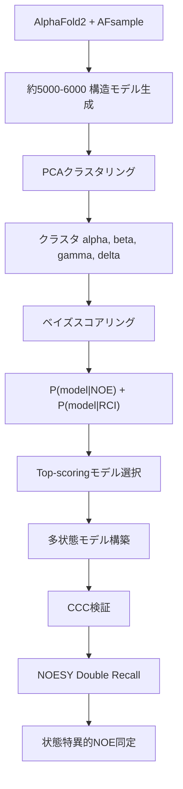

## 論文概要（Abstract）

本記事は [https://arxiv.org/abs/2402.10085](https://arxiv.org/abs/2402.10085) の解説記事です。

AlphaFold-NMR（AISAR: AI SAmpling with NMR Recall selection）は、AlphaFold2のニューラルネットワークドロップアウトを利用した構造サンプリングと、NMR実験データに基づくベイズスコアリングを統合し、タンパク質の隠れた構造状態を同定する手法である。著者らは、従来のNMR構造決定法が距離拘束への変換過程で生じる「コンフォメーションピニング」を回避し、*Gaussia* luciferase（GLuc）における600-800 A^3の cryptic pocket や CDK2AP1 における85:15の2状態平衡を同定したと報告している。

この記事は [Zenn記事: AISAR：AlphaFold2×NMRでタンパク質の隠れた構造状態を発見する](https://zenn.dev/0h_n0/articles/fa1b757f2324e1) の深掘りです。

## 情報源

- **arXiv ID**: 2402.10085
- **URL**: [https://arxiv.org/abs/2402.10085](https://arxiv.org/abs/2402.10085)
- **著者**: Huang YJ, Ramelot TA, Spaman LE, Kobayashi N, Montelione GT
- **発表年**: 2024（プレプリント）、2026（Nature Communications掲載）
- **分野**: q-bio.BM（Biomolecules）、構造生物学・計算生物学
- **コード**: [https://github.rpi.edu/RPIBioinformatics/AlphaFold-NMR](https://github.rpi.edu/RPIBioinformatics/AlphaFold-NMR)

## 背景と動機（Background & Motivation）

タンパク質は静的な構造ではなく、機能に本質的な複数の構造状態間で動的平衡にある。従来のNMR構造決定法は、NOESY（Nuclear Overhauser Effect SpectroscopY）ピークから原子間距離拘束を導出し、これを満たす構造を計算する。しかし、この手法には根本的な問題がある。複数の構造状態が共存する場合、異なる状態に由来するNOEシグナルを同時に満たそうとすると、実在しない妥協的な構造（コンフォメーションピニング）が生成される。

AlphaFold2は単一構造予測では高精度だが、標準設定ではタンパク質の構造多様性を捉えられない。特に、学習データに1つの状態しか含まれていない場合、代替構造状態の予測にバイアスがかかる。また、Multiple Sequence Alignment（MSA）ベースの手法（AF_alt、AF_cluster）は、浅いMSA（GLucでは229配列）では十分な構造多様性を生成できないことが報告されている。

## 主要な貢献（Key Contributions）

- **AI駆動サンプリングとNMR検証の統合**: AFsampleによるドロップアウトサンプリングで約5,000-6,000の構造モデルを生成し、NOE RecallとRCI相関によるベイズスコアリングで実験データとの整合性を定量評価するフレームワークを構築した
- **コンフォメーションピニングの回避**: NOEシグナルを距離拘束に変換せず、モデルからNOEの説明可能性を直接評価するRecallベースのアプローチにより、多状態モデルの正確な同定を可能にした
- **隠れた構造状態の発見**: GLucの600-800 A^3 cryptic pocketとCDK2AP1の2状態平衡（85:15）を同定し、従来のNMR構造では見逃されていた構造的特徴を明らかにした

## 技術的詳細（Technical Details）

### AISARパイプラインの全体像

AISARは3段階のパイプラインで構成される。



### Stage 1: AFsampleによる構造サンプリング

AFsampleは、AlphaFold v2.2.0の推論時にニューラルネットワークの各層にドロップアウトを有効化し、構造的多様性を持つモデルを生成する手法である。著者らは6種類の異なるドロップアウト設定を用いて、GLucでは4,990モデル、CDK2AP1では5,984モデルを生成したと報告している。テンプレート構造は使用せず（ColabFold AF-multimer v1.5.3のno templates設定）、リラクゼーション後に水素原子を付加する。

### Stage 2: ベイズスコアリング

生成されたモデル群を、NMR実験データとの整合性に基づいてスコアリングする。2種類の独立したスコアリング関数を定義し、その平均を最終スコアとする。

#### NOE Recallスコア

NOEYSピークリストに対するモデルの説明能力を定量化する。

$$
P(\text{NOE} \mid \text{model}) = \frac{\text{Recall}(\text{model}) - \text{Recall}_{\min}}{\text{Recall}_{\max} - \text{Recall}_{\min}}
$$

$$
P(\text{model} \mid \text{NOE}) = \sqrt{P(\text{NOE} \mid \text{model}) \times \text{pTM}}
$$

ここで、
- $\text{Recall}(\text{model})$: モデルの短いプロトン間距離で説明可能なNOESYピークの割合
- $\text{Recall}_{\min}, \text{Recall}_{\max}$: 全モデルにおけるRecallの最小・最大値
- $\text{pTM}$: AlphaFold2が出力する予測TM-score（モデルの全体的な信頼度）

NOE Recallの定義は、従来のRPF-DP（Recall-Precision-F-measure-Discrimination Power）スコアリングに基づく。Precision（モデルの短距離プロトンペアのうちNOESYピークで支持される割合）との違いは、RecallがNOESYデータの説明能力を、Precisionがモデルの妥当性を評価する点にある。

#### RCI相関スコア

化学シフトから導出されるRandom Coil Index（RCI）と、AlphaFold2のpLDDTスコアの相関を利用する。

$$
P(\text{RCI} \mid \text{model}) = \lvert \text{SCC}(\text{pLDDT}, \text{RCI}) \rvert
$$

$$
P(\text{model} \mid \text{RCI}) = \sqrt{\lvert \text{SCC}(\text{pLDDT}, \text{RCI}) \rvert \times \langle \text{pLDDT} \rangle}
$$

ここで、
- $\text{SCC}$: Spearmanの順位相関係数
- $\text{pLDDT}$: 残基ごとのAlphaFold2信頼度スコア
- $\text{RCI}$: 化学シフトから計算される柔軟性指標（値が大きいほど柔軟）
- $\langle \text{pLDDT} \rangle$: 全残基にわたるpLDDTの平均値

pLDDTが高い残基は構造的に安定であり、RCIが低い（剛直な）残基と対応する。この負の相関（|SCC|で評価）が高いモデルほど、実験的な柔軟性プロファイルと整合的である。

#### 統合スコア

$$
P(\text{model} \mid \text{NMR data}) = \frac{P(\text{model} \mid \text{NOE}) + P(\text{model} \mid \text{RCI})}{2}
$$

### Stage 3: 多状態モデル検証

#### CCC（Concordance Correlation Coefficient）

多状態モデルの検証には、アンサンブルから計算したRMSF（Root Mean Square Fluctuation）と、実験的RCI値から導出したRMSFの一致度をCCCで評価する。

$$
\text{CCC} = \frac{2 \rho \sigma_X \sigma_Y}{\sigma_X^2 + \sigma_Y^2 + (\mu_X - \mu_Y)^2}
$$

ここで、
- $\rho$: Pearsonの相関係数
- $\sigma_X, \sigma_Y$: $\text{RMSF}_{\text{ENS}}$と$\text{RMSF}_{\text{RCI}}$の標準偏差
- $\mu_X, \mu_Y$: それぞれの平均値

CCCは$-1 \leq -\lvert \text{PCC} \rvert \leq \text{CCC} \leq +\lvert \text{PCC} \rvert \leq +1$の不等式を満たし、相関だけでなくスケールとオフセットの一致も要求する厳密な指標である。

#### NOESY Double Recall

2つのコンフォマーアンサンブルA, Bを比較し、各状態に特異的なNOEを同定する。RPF Recall Violation Reportを用いて、アンサンブルAでのみ説明されるNOE（状態A固有）とアンサンブルBでのみ説明されるNOE（状態B固有）を分離する。結果はコンタクトマップ形式の2次元プロットとして可視化される。

### アルゴリズム（疑似コード）

```python
import numpy as np
from dataclasses import dataclass


@dataclass
class StructuralModel:
    """AFsampleが生成する構造モデル"""
    coordinates: np.ndarray  # (N_atoms, 3)
    plddt: np.ndarray        # (N_residues,)
    ptm: float               # predicted TM-score


def aisar_pipeline(
    sequence: str,
    noesy_peaks: list[dict],
    chemical_shifts: dict[str, np.ndarray],
) -> dict:
    """AISARパイプラインの疑似コード"""
    # Stage 1: AFsample (6 dropout settings x ~1000 models)
    models = [run_alphafold_with_dropout(sequence, s)
              for s in range(6) for _ in range(1000)]

    # Stage 2: PCAクラスタリング + ベイズスコアリング
    clusters = hierarchical_clustering(
        pca_transform(extract_calpha_coordinates(models)))
    rci = compute_rci(chemical_shifts)

    scored = []
    for m in models:
        p_noe = np.sqrt(normalize_recall(
            compute_noe_recall(m, noesy_peaks)) * m.ptm)
        scc = spearman_correlation(m.plddt, rci)
        p_rci = np.sqrt(abs(scc) * np.mean(m.plddt))
        scored.append((m, (p_noe + p_rci) / 2.0))

    # Stage 3: CCC最大化による多状態選択
    best_ccc, best_states = -1.0, None
    for s1 in select_top(clusters, scored):
        for s2 in select_top(clusters, scored):
            ccc = concordance_correlation(
                compute_ensemble_rmsf(s1 + s2),
                compute_rmsf_from_rci(rci))
            if ccc > best_ccc:
                best_ccc, best_states = ccc, (s1, s2)

    return {"states": best_states, "ccc": best_ccc,
            "noes": noesy_double_recall(*best_states, noesy_peaks)}
```

## 実装のポイント（Implementation）

### AFsampleのセットアップ

AFsampleはAlphaFold v2.2.0を改変し、推論時にドロップアウトを有効化する。ColabFold AF-multimer v1.5.3を使用し、テンプレート構造なしの設定で実行する。6種類のドロップアウト設定で各約1,000モデルを生成し、合計5,000-6,000モデルを得る。著者らは具体的なドロップアウト率を本文中に明記していないが、AFsampleの原著論文（Wallner, 2023）を参照している。

### NMRデータの要件

AISARの適用には以下のNMRデータが必要である。

1. **NOESYピークリスト**: 3D NOESYスペクトルのピーク位置と帰属（未帰属ピークも利用可能）
2. **化学シフト帰属**: $^{1}\text{H}$, $^{13}\text{C}$, $^{15}\text{N}$の主鎖・側鎖化学シフト（RCI計算に使用）
3. **hetNOEデータ**（任意）: $^{15}\text{N}$-$^{1}\text{H}$ heteronuclear NOEによる骨格ダイナミクス情報

### 計算リソースと注意点

1タンパク質あたり約5,000-6,000回のAlphaFold2推論が必要であり、AFsampleの推論がボトルネックとなる。AmberリラクゼーションとRPFスコアリングはCPUで実行可能である。著者らは、生成モデルの一部に非現実的な構造（不正キラリティ、非天然*cis*ペプチド結合）が含まれると報告しており、手動キュレーションが必要な場合がある。

## Production Deployment Guide

AISARパイプラインはAlphaFold2の大量推論を中核とするため、GPU計算が主なワークロードとなる。以下では、AWS上でのデプロイパターンを構成規模別に示す。

### AWS実装パターン（GPU計算最適化）

| 構成 | 想定規模 | 主要サービス | 月額概算 |
|------|----------|-------------|---------|
| Small | 1-5タンパク質/月 | AWS Batch + g5.xlarge | $200-600 |
| Medium | 5-20タンパク質/月 | AWS Batch + g5.2xlarge + S3 | $800-2,500 |
| Large | 20+タンパク質/月 | EKS + GPU Node Pool + FSx | $3,000-8,000 |

上記は2026年4月時点のAWS ap-northeast-1料金に基づく概算値。Spot活用で最大70%削減、Batch min_vcpus=0でアイドル時自動終了。

### Terraformインフラコード

**Small構成（AWS Batch + GPU）**:

```hcl
# AISAR Small構成: AWS Batch + g5 GPU Spot instances
resource "aws_batch_compute_environment" "aisar_gpu" {
  compute_environment_name = "aisar-afsample-gpu"
  type                     = "MANAGED"
  state                    = "ENABLED"

  compute_resources {
    type           = "SPOT"              # コスト削減: Spot優先
    bid_percentage = 70                  # オンデマンドの70%上限
    max_vcpus      = 32
    min_vcpus      = 0                   # アイドル時ゼロ
    instance_type  = ["g5.xlarge"]       # NVIDIA A10G, 24GB VRAM
    subnets        = var.private_subnet_ids
    instance_role  = aws_iam_instance_profile.batch.arn

    ec2_configuration {
      image_type = "ECS_AL2_NVIDIA"      # GPU対応AMI
    }
  }
  service_role = aws_iam_role.batch_service.arn
}

resource "aws_batch_job_definition" "afsample" {
  name = "aisar-afsample"
  type = "container"
  container_properties = jsonencode({
    image   = "${var.ecr_repo_url}:latest"
    vcpus   = 4
    memory  = 16384
    command = ["python", "run_afsample.py", "--sequence", "Ref::sequence"]
    resourceRequirements = [{ type = "GPU", value = "1" }]
  })
}
```

**Large構成（EKS + Karpenter GPU）**:

```hcl
module "eks" {
  source          = "terraform-aws-modules/eks/aws"
  version         = "~> 20.0"
  cluster_name    = "aisar-cluster"
  cluster_version = "1.31"
  vpc_id          = var.vpc_id
  subnet_ids      = var.private_subnet_ids
  cluster_endpoint_public_access = false
}

resource "kubectl_manifest" "gpu_node_pool" {
  yaml_body = yamlencode({
    apiVersion = "karpenter.sh/v1"
    kind       = "NodePool"
    metadata   = { name = "aisar-gpu" }
    spec = {
      template.spec = {
        requirements = [
          { key = "node.kubernetes.io/instance-type", operator = "In",
            values = ["g5.xlarge", "g5.2xlarge"] },
          { key = "karpenter.sh/capacity-type", operator = "In",
            values = ["spot", "on-demand"] },
        ]
      }
      limits     = { cpu = "128", "nvidia.com/gpu" = "8" }
      disruption = { consolidationPolicy = "WhenEmptyOrUnderutilized" }
    }
  })
}

resource "aws_budgets_budget" "aisar" {
  name         = "aisar-monthly"
  budget_type  = "COST"
  limit_amount = "5000"
  limit_unit   = "USD"
  time_unit    = "MONTHLY"
  notification {
    comparison_operator        = "GREATER_THAN"
    threshold                  = 80
    threshold_type             = "PERCENTAGE"
    notification_type          = "ACTUAL"
    subscriber_email_addresses = [var.alert_email]
  }
}
```

### 運用・監視設定

```python
import boto3
from datetime import datetime, timedelta

cloudwatch = boto3.client("cloudwatch", region_name="ap-northeast-1")

# GPU使用率アラーム（30%未満でインスタンスサイズ見直し通知）
cloudwatch.put_metric_alarm(
    AlarmName="aisar-gpu-utilization-low",
    Namespace="AWS/Batch",
    MetricName="GPUUtilization",
    Dimensions=[{"Name": "JobQueue", "Value": "aisar-job-queue"}],
    Statistic="Average", Period=300, EvaluationPeriods=3,
    Threshold=30.0, ComparisonOperator="LessThanThreshold",
    AlarmActions=[sns_topic_arn],
)

# 日次コストレポート
ce = boto3.client("ce", region_name="us-east-1")

def daily_cost_report() -> dict:
    """日次GPU計算コストレポートを取得"""
    end = datetime.utcnow().strftime("%Y-%m-%d")
    start = (datetime.utcnow() - timedelta(days=1)).strftime("%Y-%m-%d")
    return ce.get_cost_and_usage(
        TimePeriod={"Start": start, "End": end},
        Granularity="DAILY", Metrics=["UnblendedCost"],
        Filter={"Tags": {"Key": "Project", "Values": ["aisar"]}},
        GroupBy=[{"Type": "DIMENSION", "Key": "SERVICE"}],
    )["ResultsByTime"]
```

### コスト最適化チェックリスト

**アーキテクチャ**: 月間処理数に応じた構成選択 / バッチ非同期実行

**リソース最適化**: g5 Spot優先（最大70%削減） / Reserved 1年コミット（最大40%削減） / Savings Plans適用 / Batch min_vcpus=0でアイドル終了 / Karpenter自動統合

**GPU計算削減**: AFsampleモデル数の最適化 / 複数配列同時処理でGPU稼働率向上 / スコア収束時の早期終了 / S3キャッシュで再計算防止

**ストレージ**: S3 Intelligent-Tiering / 90日後Glacier移行 / 中間ファイル自動削除

**監視**: AWS Budgets月額アラート / CloudWatch GPU使用率・失敗率 / Cost Anomaly Detection / 日次コストレポートSNS通知 / Project/Environmentタグ必須化

## 実験結果（Results）

### GLuc（*Gaussia* luciferase）

著者らは、GLucに対してAISARを適用し、従来のNMR構造（NMR7d2o）では検出できなかった代替構造状態を同定したと報告している。

| 指標 | 標準AF2 | NMR7d2o | AISAR State 1+2 |
|------|---------|---------|-----------------|
| NOESY Recall | 0.86 | 0.89 | 0.88+ |
| CCC (RMSF_ENS vs RMSF_RCI) | 0.05 | 0.30 | 0.55 |
| 説明可能NOE数 | 138 | 543 | 543 + 218追加 |

- **State 1（closed）**: 185の固有NOE（うち101が長距離）、ポケット体積30-110 A^3
- **State 2（open）**: 164の固有NOE（うち71が長距離）、主ポケット体積600-800 A^3

PCAクラスタリングにより、モデル群は4つのクラスタ（alpha約20%、beta約20%、gamma約25%、delta約35%）に分類された。State 1とState 2の組み合わせでCCCが0.55に達し、他の2状態組み合わせ（0.12、0.06）を大きく上回ったと報告されている。

### CDK2AP1

CDK2AP1（ホモ二量体）では、2状態平衡が同定された。

| 指標 | State 1のみ | State 2のみ | State 1+2 |
|------|------------|------------|-----------|
| CCC | 0.39 | 0.14 | 0.70 |
| 固有NOE数 | 22（16長距離） | 23（3長距離） | - |
| Backbone RMSD | - | - | 0.56-1.32 A |

- **集団比率**: 主状態（State 1）約85%、副状態（State 2）約15%
- **交換速度**: ミリ秒以上の遅い交換（Thr109, Glu110のHN共鳴でピーク二重化を確認）
- **システイン-芳香族相互作用**: State 1ではチェーン間Sgamma-Czeta距離4.0-4.1 A、State 2ではチェーン内3.5-3.7 A

PCAクラスタ分布はalpha約50%、beta約47%、gamma約2%、delta約1%であり、GLucとは異なるクラスタ構造を示した。

## 実運用への応用（Practical Applications）

**創薬ターゲット探索**: AISARが同定するcryptic pocketは薬剤結合部位の候補となる。GLucの600-800 A^3ポケットは低分子結合に十分な体積であり、アロステリック薬の設計に応用可能である。

**多状態ドッキング**: 従来の単一構造依存から脱却し、AISARの多状態モデルに対するドッキングシミュレーションが可能となる。CDK2AP1の副状態（15%集団）に特異的なリガンド探索などが想定される。

**既存NMRデータの再解析**: BMRBに登録済みの化学シフトとNOESYピークリストを入力とするため、追加実験なしで隠れた状態を探索可能である。ただし、pLDDTとRCIの相関が弱い高度に動的な領域ではスコアリングの信頼性が低下する。

## 関連研究（Related Work）

- **AFsample2**（Wallner, 2023）: AISARのStage 1の基盤。ドロップアウト+MSAサブサンプリングで構造多様性を向上
- **AlphaFlow**（Jing et al., 2024）: フローマッチングによる構造アンサンブル生成。NMRデータ不要だがアンサンブル生成で競合
- **BioEmu**（Lewis et al., 2025）: 拡散モデルベースのボルツマンアンサンブル生成。実験データ非依存の設計思想
- **MD+MSM**: 従来の標準手法。計算コストが高いが物理的に妥当な遷移経路情報を得られる

## まとめと今後の展望

AISARは、AlphaFold2のドロップアウトサンプリングとNMR実験データのベイズスコアリングを統合し、従来のNMR構造決定法では検出困難だった隠れた構造状態を同定するフレームワークである。GLucのcryptic pocket発見とCDK2AP1の2状態平衡の同定は、この手法の有効性を示す具体的な事例として報告されている。

今後の展望として、著者らはRDC（残差双極子カップリング）やPRE（常磁性緩和促進）などの追加NMRデータの統合、およびAlphaFold3への拡張を示唆している。また、pLDDTとRCIの相関が弱い高度に動的な領域でのスコアリング改善、およびAFsampleが生成する非現実的構造の自動フィルタリングも重要な課題である。

## 参考文献

- **arXiv**: [https://arxiv.org/abs/2402.10085](https://arxiv.org/abs/2402.10085)
- **Nature Communications**: [https://www.nature.com/articles/s41467-026-71997-6](https://www.nature.com/articles/s41467-026-71997-6)
- **PMC**: [https://pmc.ncbi.nlm.nih.gov/articles/PMC11875312/](https://pmc.ncbi.nlm.nih.gov/articles/PMC11875312/)
- **Code**: [https://github.rpi.edu/RPIBioinformatics/AlphaFold-NMR](https://github.rpi.edu/RPIBioinformatics/AlphaFold-NMR)
- **GLuc構造データ**: PDB 9A8V, Zenodo [https://zenodo.org/records/13831427](https://zenodo.org/records/13831427)
- **CDK2AP1構造データ**: PDB 9A8Z, BMRB ID 16808
- **Related Zenn article**: [https://zenn.dev/0h_n0/articles/fa1b757f2324e1](https://zenn.dev/0h_n0/articles/fa1b757f2324e1)
