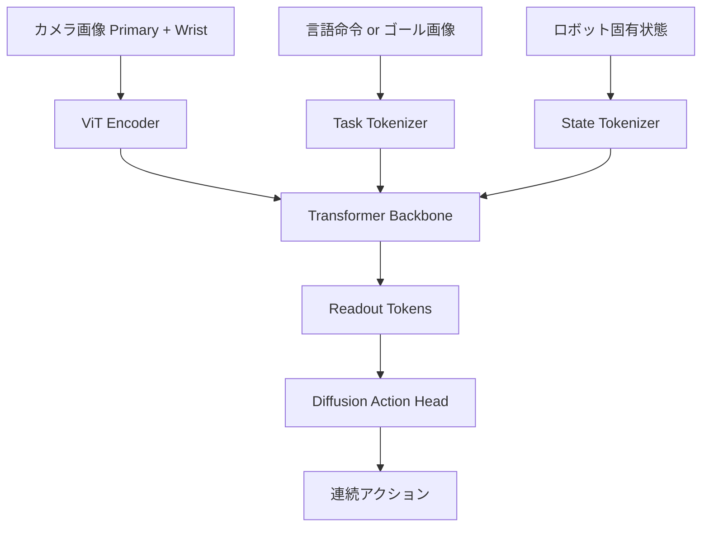

## 論文概要（Abstract）

本記事は [arXiv:2405.12213 Octo: An Open-Source Generalist Robot Policy](https://arxiv.org/abs/2405.12213) の解説記事です。

OctoはUC Berkeley、Stanford、CMU等の共同研究により2024年5月に発表された、約93Mパラメータのオープンソース汎用ロボットポリシーである。Open X-Embodimentデータセットから選択した800,000トラジェクトリで訓練されたTransformerベースのモデルで、言語命令またはゴール画像による指示を受け付ける。著者らによると、9種類のロボットプラットフォームでの評価において、新しいロボットセットアップへの数時間のファインチューニングで効果的な適応が可能であったと報告されている。MIT Licenseで公開されている。

この記事は [Zenn記事: π0.7徹底解説 ─ ロボット基盤モデルに構成的汎化が芽生えた](https://zenn.dev/0h_n0/articles/b8a023d5dfc83c) の深掘りです。

## 情報源

- **arXiv ID**: [2405.12213](https://arxiv.org/abs/2405.12213)
- **著者**: Octo Model Team: Dibya Ghosh, Homer Walke, Karl Pertsch, Kevin Black, Oier Mees, Sudeep Dasari, Joey Hejna, Sergey Levine, Chelsea Finn, et al.
- **発表年**: 2024年5月
- **分野**: cs.RO, cs.LG
- **コード**: [github.com/octo-models/octo](https://github.com/octo-models/octo)（MIT License）

## 背景と動機（Background & Motivation）

2024年時点で、ロボティクスにおける「基盤モデル」の構築は大きな課題であった。NLPやコンピュータビジョンではGPTやViTが事前学習済みモデルとして広く活用されていたが、ロボティクスでは同様の汎用事前学習モデルが存在しなかった。

その主な障壁は以下の通りである。

**データの異質性**: 異なるロボットは異なるセンサ構成（カメラ台数、位置）、異なるアクション空間（関節角度、エンドエフェクタ位置）、異なる制御周波数を持つ。単純にデータを結合することが困難であった。

**スケールの不足**: 個々のロボット研究室が収集するデモンストレーションデータは数百〜数千エピソード程度であり、大規模学習には不十分であった。

Open X-Embodimentプロジェクト（arXiv:2310.08864）は、22種類のエンボディメントから970,000以上のトラジェクトリを集約することでデータスケールの問題に取り組んだ。Octoの動機は、このデータセットを活用し、新しいロボットセットアップに容易に適応できる汎用ポリシーをオープンソースとして提供することにあった。

## 主要な貢献（Key Contributions）

- **異種データの統合学習**: 異なるセンサ構成・アクション空間を持つ複数のロボットデータを、タスク・ロボット固有のトークン化なしに統合して訓練する手法を提案
- **柔軟な入出力アーキテクチャ**: 言語命令とゴール画像の両方を受け付け、異なるアクション空間にも対応するモジュラー設計を実現
- **軽量かつ効果的な事前学習**: 93Mパラメータという比較的小さなモデルで、消費者向けGPU（RTX 4090）上での数時間のファインチューニングを可能にした

## 技術的詳細（Technical Details）

### Transformerベースのアーキテクチャ

Octoのアーキテクチャは、柔軟な入力処理と汎用的なアクション生成を両立するモジュラー設計を採用している。



**入力処理**:

画像入力はViT（Vision Transformer）エンコーダで処理される。Primary（前方カメラ）とWrist（手首カメラ）の2系統を独立に処理し、パッチトークンとしてTransformerに入力する。カメラが欠損するロボットではマスクトークンで補完する。

タスク指示は言語命令またはゴール画像のいずれかで与える。言語命令はT5テキストエンコーダで埋め込みベクトルに変換する。ゴール画像はViTエンコーダで処理する。

**Transformer Backbone**:

約93MパラメータのデコーダのみのTransformerで構成される。すべての入力トークン（画像パッチ、タスク指示、ロボット状態）を統一的に処理し、リードアウトトークンを生成する。

**Diffusion Action Head**:

Octoはアクション生成にDiffusion Policyと同様の拡散ベースのヘッドを採用している。Transformerバックボーンの出力を条件として、DDPMでアクション列を生成する。

$$
\mathbf{a}_0 \sim p_\theta(\mathbf{a} \mid \mathbf{o}, \mathbf{task}) = \int p_\theta(\mathbf{a}_{0:K} \mid \mathbf{o}, \mathbf{task}) \, d\mathbf{a}_{1:K}
$$

### クロスエンボディメントの統合

Octoが異なるロボットのデータを統合できる鍵は、以下の設計にある。

**アクション空間の統一**: 各ロボットのアクション空間を固定次元のベクトルにパディングする。未使用の次元はゼロでマスクし、損失計算から除外する。

$$
\mathbf{a}_{\text{unified}} = [\underbrace{a_1, ..., a_{d_i}}_{\text{robot } i \text{ の実アクション}}, \underbrace{0, ..., 0}_{\text{padding}}] \in \mathbb{R}^{d_{\max}}
$$

ここで $d_i$ はロボット $i$ のアクション次元、$d_{\max}$ は最大アクション次元である。

**観測空間の統一**: Primary画像とWrist画像の2チャンネルを基本とし、追加カメラや欠損カメラにはマスキングで対応する。

この設計により、ロボット固有のアダプタやヘッドを設けることなく、単一のモデルで複数のロボットを扱える。

### 訓練データの選択とウェイティング

Open X-Embodimentデータセットの全データを使用するのではなく、著者らは品質と多様性のバランスを考慮して約800,000トラジェクトリを選択している。

選択基準として報告されているのは：
- タスクの多様性が高いデータセットを優先
- 品質の低いデータ（不完全なデモ、ラベルミス等）を除外
- データセット間のバランスを調整（大規模データセットの過剰支配を防止）

各データセットのサンプリング確率 $w_i$ は、データセットサイズの平方根に比例するように設定されている：

$$
w_i = \frac{\sqrt{N_i}}{\sum_j \sqrt{N_j}}
$$

この設計により、小規模だが多様性の高いデータセットも十分にサンプリングされる。

## 実装のポイント（Implementation）

### ファインチューニングの実践

Octoの最大の特徴は、新しいロボットへの適応が容易な点である。著者らが報告しているファインチューニング手順は以下の通り。

1. **データ収集**: 新しいロボットで50〜200エピソードのデモンストレーションを収集
2. **アクション空間の定義**: ロボットのアクション次元をOctoの統一フォーマットにマッピング
3. **ファインチューニング**: 事前学習済みのOctoモデルに対し、全パラメータまたはAction Headのみを微調整
4. **評価**: 実ロボットでの成功率を測定

RTX 4090（24GB VRAM）で2〜4時間のファインチューニングが典型的な所要時間とのことである。

### 推論速度

OctoのTransformerバックボーン（93M params）は比較的軽量であり、推論速度は以下の通り報告されている：

- **RTX 4090**: 約10Hz（DDIMで10ステップデノイジング）
- **バッチ推論**: 複数ロボットの推論を並列処理可能

VLM統合型のπ0（3B params）やOpenVLA（7B params）と比較すると、Octoは推論速度で有利だが、言語理解能力は限定的である。

```python
import jax
import jax.numpy as jnp
from octo.model.octo_model import OctoModel

def load_and_finetune_octo(
    pretrained_path: str = "hf://rail-berkeley/octo-base-1.5",
    dataset_path: str = "./my_robot_data",
    num_steps: int = 10000,
    batch_size: int = 128,
) -> OctoModel:
    """Octoモデルをロードし、新しいロボットデータでファインチューニングする。

    Args:
        pretrained_path: 事前学習済みモデルのパス
        dataset_path: ファインチューニング用データのパス
        num_steps: 訓練ステップ数
        batch_size: バッチサイズ

    Returns:
        ファインチューニング済みのOctoModel
    """
    model = OctoModel.load_pretrained(pretrained_path)

    config = model.config
    config.update({
        "dataset_kwargs": {"path": dataset_path},
        "training": {
            "num_steps": num_steps,
            "batch_size": batch_size,
            "learning_rate": 3e-4,
            "warmup_steps": 500,
        },
    })

    model = model.finetune(config)
    return model


def predict_action(
    model: OctoModel,
    image: jnp.ndarray,
    task_description: str,
    num_denoise_steps: int = 10,
) -> jnp.ndarray:
    """観測とタスク指示からアクションを予測する。

    Args:
        model: Octoモデル
        image: (H, W, 3) カメラ画像
        task_description: 自然言語のタスク記述
        num_denoise_steps: DDIMデノイジングステップ数

    Returns:
        action: (action_dim,) 予測アクション
    """
    observation = {"image_primary": image[None]}
    task = model.create_tasks(texts=[task_description])
    action = model.sample_actions(
        observation,
        task,
        rng=jax.random.PRNGKey(0),
        num_denoise_iters=num_denoise_steps,
    )
    return action[0, 0]
```

## Production Deployment Guide

### AWS実装パターン（コスト最適化重視）

Octoは93Mパラメータと軽量であり、GPU要件はDiffusion Policyよりわずかに高い程度（拡散ヘッドのため）である。

| 規模 | ロボット台数 | 推奨構成 | 月額コスト | 主要サービス |
|------|------------|---------|-----------|------------|
| **Small** | 1-3台 | 単一GPU | $300-700 | EC2 g5.xlarge |
| **Medium** | 5-20台 | GPU Scaling | $1,500-4,000 | ECS GPU Tasks |
| **Large** | 30台以上 | GPU Cluster | $5,000-15,000 | EKS + Karpenter |

**Small構成の詳細**（月額$300-700）:
- **EC2 g5.xlarge**: NVIDIA A10G（Spot: $250/月、On-Demand: $650/月）
- **S3**: モデルチェックポイント・ファインチューニングデータ保存（$10/月）
- **CloudWatch**: GPU利用率監視（$10/月）

**コスト試算の注意事項**: 上記は2026年4月時点のAWS ap-northeast-1リージョン料金の概算値です。OctoはJAXベースのため、GPU上での推論が必要です。

### Terraformインフラコード

```hcl
module "vpc" {
  source  = "terraform-aws-modules/vpc/aws"
  version = "~> 5.0"
  name    = "octo-vpc"
  cidr    = "10.0.0.0/16"
  azs     = ["ap-northeast-1a"]
  private_subnets = ["10.0.1.0/24"]
  public_subnets  = ["10.0.101.0/24"]
  enable_nat_gateway = true
  single_nat_gateway = true
}

resource "aws_instance" "octo_server" {
  ami           = "ami-0abcdef1234567890"
  instance_type = "g5.xlarge"
  subnet_id     = module.vpc.private_subnets[0]
  root_block_device {
    volume_size = 100
    volume_type = "gp3"
    encrypted   = true
  }
  tags = { Name = "octo-inference-server" }
}

resource "aws_cloudwatch_metric_alarm" "gpu_memory" {
  alarm_name          = "octo-gpu-memory"
  comparison_operator = "GreaterThanThreshold"
  evaluation_periods  = 2
  metric_name         = "GPUMemoryUsedPercent"
  namespace           = "Custom/Octo"
  period              = 60
  statistic           = "Maximum"
  threshold           = 85
  alarm_description   = "GPU VRAM使用率85%超過"
}
```

### コスト最適化チェックリスト

- [ ] 93M params: g5.xlarge（24GB VRAM）で余裕をもって動作
- [ ] Spot Instances: g5.xlarge Spotで最大60%削減
- [ ] バッチ推論: 複数ロボットのリクエストをバッチ処理
- [ ] JAX JIT: 初回コンパイル後は高速推論
- [ ] ファインチューニング: 同一GPU上でオンライン学習も可能
- [ ] CloudWatch: GPU使用率・推論レイテンシ監視
- [ ] AWS Budgets: 月額予算設定
- [ ] S3: モデルチェックポイントのバージョニング管理

## 実験結果（Results）

### 9種類のロボットプラットフォームでの評価

著者らは9種類のロボットプラットフォームでゼロショット転移とファインチューニング後の性能を評価したと報告している。

**ゼロショット性能**: 事前学習のみで、一部のタスク（簡単な物体把持等）では実用的な成功率を達成。ただし、複雑なタスクでは追加のファインチューニングが必要。

**ファインチューニング後**: 50〜200エピソードのファインチューニングにより、スクラッチからの訓練を上回る性能を達成したと著者らは報告している。事前学習の効果は、特にデータ量が限られる場合（~50エピソード）に顕著であった。

### アブレーション実験

著者らは以下のアブレーションを実施し、設計選択の妥当性を検証している。

- **データセット構成**: 多様性の高いデータセットの除外は性能を大きく低下させる
- **Action Head**: 拡散ベースのヘッドが、MSE回帰ヘッドを一貫して上回る
- **言語 vs ゴール画像**: タスクの種類に依存するが、組み合わせ使用が最も効果的

## 実運用への応用（Practical Applications）

Octoは研究用途での汎用ベースラインとして特に有用である。新しいロボットプラットフォームの立ち上げ時に、ゼロからの訓練ではなくOctoからのファインチューニングにより、必要なデモンストレーション数を大幅に削減できる。

ただし、VLMバックボーンを持たないため、言語理解能力はOpenVLAやπ0と比較して限定的である。「赤いカップを左に動かせ」のような複合的な言語指示への対応は苦手であり、明確なオブジェクト中心の指示が推奨される。

## 関連研究（Related Work）

- **π0**（Black et al., 2024）: Octoと同様にクロスエンボディメント訓練を行うが、VLMバックボーンの導入とFlow Matchingの採用により、より高い汎化能力を持つ。パラメータ数は約30倍（3B vs 93M）
- **OpenVLA**（Kim et al., 2024）: 7BパラメータのVLA。Octoよりも大規模だが、離散トークン方式のためマルチモーダル行動分布の表現に制約がある
- **RT-1**（Brohan et al., 2022）: Google DeepMindの大規模実演データによるロボットTransformer。Octoと同様のスケーリングアプローチだが、単一ロボット（Everyday Robots）に特化

## まとめと今後の展望

Octoはオープンソースの汎用ロボットポリシーとして、クロスエンボディメント事前学習の有効性を実証した。93Mパラメータという軽量さと、消費者向けGPUでのファインチューニング対応により、研究コミュニティにとってアクセスしやすい汎用ベースラインを提供している。

π0.7との関連では、Octoのクロスエンボディメント訓練アプローチがπ0シリーズの設計に影響を与えている。一方、VLM統合やFlow Matchingの採用により、π0シリーズはOctoの限界を大きく超える汎化能力を達成している。

## 参考文献

- **arXiv**: [https://arxiv.org/abs/2405.12213](https://arxiv.org/abs/2405.12213)
- **Code**: [https://github.com/octo-models/octo](https://github.com/octo-models/octo)
- **Project Page**: [https://octo-models.github.io/](https://octo-models.github.io/)
- **Related Zenn article**: [https://zenn.dev/0h_n0/articles/b8a023d5dfc83c](https://zenn.dev/0h_n0/articles/b8a023d5dfc83c)
