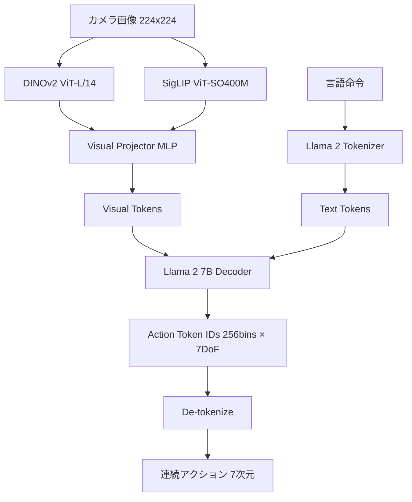

## 論文概要（Abstract）

本記事は [arXiv:2406.09246 OpenVLA: An Open-Source Vision-Language-Action Model](https://arxiv.org/abs/2406.09246) の解説記事です。

OpenVLAはStanford大学、UC Berkeley、Toyota Research Institute等の共同研究により2024年6月に発表された、7Bパラメータのオープンソース Vision-Language-Action（VLA）モデルである。Llama 2をバックボーンに、DINOv2とSigLIPのデュアルビジョンエンコーダを組み合わせ、970,000件の実世界ロボットデモンストレーション（Open X-Embodiment由来）で訓練されている。著者らによると、55BパラメータのRT-2-Xを29タスクにおいて絶対成功率で16.5%上回り、パラメータ数は約7分の1であったと報告されている。Apache 2.0ライセンスでモデル重み・コードが公開されており、消費者向けGPUでLoRAによる効率的なファインチューニングが可能である。

この記事は [Zenn記事: π0.7徹底解説 ─ ロボット基盤モデルに構成的汎化が芽生えた](https://zenn.dev/0h_n0/articles/b8a023d5dfc83c) の深掘りです。

## 情報源

- **arXiv ID**: [2406.09246](https://arxiv.org/abs/2406.09246)
- **著者**: Moo Jin Kim, Karl Pertsch, Siddharth Karamcheti, Ted Xiao, Ashwin Balakrishna, Suraj Nair, Chelsea Finn, Sergey Levine, Percy Liang, et al.
- **発表年**: 2024年6月
- **分野**: cs.RO, cs.LG
- **コード**: [github.com/openvla/openvla](https://github.com/openvla/openvla)（Apache 2.0）

## 背景と動機（Background & Motivation）

2024年時点で、VLAモデルの研究は主にGoogle DeepMindのRT-2に代表される閉じたモデルが主流であった。RT-2は55Bパラメータという大規模モデルでWeb知識のロボット制御への転移を実証したが、モデル重みは非公開であり、再現研究やカスタマイズが困難であった。

一方、ロボティクスコミュニティではOpen X-Embodimentプロジェクトにより、22種類のエンボディメントから970,000トラジェクトリ以上の大規模データセットが公開されていた。しかし、このデータセットを活用した高性能なオープンソースVLAは存在しなかった。

OpenVLAの動機は、オープンソースのVLAモデルを提供し、研究コミュニティが自由にVLAの研究・開発を行える基盤を整備することにあった。具体的には、(1)閉じたモデルと同等以上の性能を達成し、(2)消費者向けGPUでファインチューニング可能な効率的なモデルを目指した。

## 主要な貢献（Key Contributions）

- **オープンソースVLAの公開**: 7BパラメータでRT-2-X（55B）を上回る性能のモデルを、重み・コード・訓練レシピとともにApache 2.0で公開した
- **デュアルビジョンエンコーダの有効性**: DINOv2（局所的空間特徴に強い）とSigLIP（意味的理解に強い）の組み合わせが、単一エンコーダよりもロボット操作タスクで優れることを実証した
- **効率的なファインチューニング**: LoRA（rank=32）による微調整により、RTX 4090単体で数時間のファインチューニングでタスク適応が可能であることを示した

## 技術的詳細（Technical Details）

### アーキテクチャ

OpenVLAは既存の事前学習済みコンポーネントを巧みに組み合わせた設計になっている。



**DINOv2 ViT-L/14**: 自己教師あり学習で訓練されたビジョンエンコーダ。パッチレベルの空間特徴表現に優れ、物体の形状・位置・テクスチャを高精度で捉える。

**SigLIP ViT-SO400M**: テキスト-画像コントラスト学習で訓練されたビジョンエンコーダ。意味的な理解（「赤いカップ」「木製のテーブル」等）に強く、言語命令との整合性を提供する。

**Llama 2 7B**: 言語命令の理解とアクション列の自己回帰生成を担うデコーダ。テキストトークンとビジュアルトークンを同じ系列として処理し、アクショントークンを生成する。

### 離散トークン方式によるアクション生成

OpenVLAはπ0のFlow Matching方式とは対照的に、**離散トークン方式**でアクションを生成する。連続的なアクション値を256ビンに量子化し、テキストトークンと同じ語彙空間で自己回帰的に予測する。

具体的には、7自由度（6DoF + グリッパー開閉）の各次元を独立に256段階に離散化する：

$$
a_{\text{token}}^{(i)} = \text{round}\left(\frac{a^{(i)} - a_{\min}^{(i)}}{a_{\max}^{(i)} - a_{\min}^{(i)}} \times 255\right), \quad i = 1, ..., 7
$$

ここで、
- $a^{(i)}$: 第 $i$ 次元の連続アクション値
- $a_{\min}^{(i)}, a_{\max}^{(i)}$: 訓練データから計算された各次元の最小・最大値
- $a_{\text{token}}^{(i)}$: 量子化されたトークンID（0〜255）

推論時は自己回帰的に7つのトークンを順次生成し、逆量子化して連続アクションに変換する。

**Flow Matching方式との比較**:

| 特性 | OpenVLA（離散トークン） | π0（Flow Matching） |
|------|----------------------|-------------------|
| アクション表現 | 256ビン量子化 | 連続値 |
| 生成方式 | 自己回帰（7ステップ） | デノイジング（10-20ステップ） |
| 推論速度 | ~3-6Hz（RTX 4090） | ~2-5Hz（アクションチャンキングで実用化） |
| 精度 | 量子化誤差あり | 連続値で高精度 |
| マルチモーダル分布 | 苦手（モード崩壊リスク） | 自然に表現可能 |
| VLM統合 | 容易（同一語彙空間） | cross-attention等の設計が必要 |

離散トークン方式の利点は、LLMの自己回帰生成パイプラインをそのまま流用できる実装の簡潔さにある。一方、量子化による情報損失は避けられず、256段階の解像度はサブミリメートル精度が要求される精密操作には不十分な場合がある。

### 訓練レシピ

**ステージ1: VLM事前学習**
Prismatic VLMフレームワークを使用し、Llama 2 7B + DINOv2 + SigLIPの組み合わせを、画像キャプション・VQA等のマルチモーダルタスクで事前学習する。

**ステージ2: ロボットデータ訓練**
Open X-Embodimentデータセットから選択した970,000トラジェクトリで訓練する。全パラメータをファインチューニングし、ロボット制御のためのアクション予測能力を獲得する。

**ステージ3: タスク特化ファインチューニング（オプション）**
特定のロボット・タスク向けにLoRA（rank=32）で微調整する。著者らによると、RTX 4090単体で1-2時間の訓練で効果的な適応が可能であると報告されている。

```python
from transformers import AutoModelForVision2Seq, AutoProcessor
from peft import LoraConfig, get_peft_model
import torch

def setup_openvla_finetuning(
    model_name: str = "openvla/openvla-7b",
    lora_rank: int = 32,
    learning_rate: float = 2e-5,
) -> tuple:
    """OpenVLAのLoRAファインチューニングをセットアップする。

    Args:
        model_name: HuggingFaceモデルID
        lora_rank: LoRAのランク
        learning_rate: 学習率

    Returns:
        (model, processor) のタプル
    """
    processor = AutoProcessor.from_pretrained(model_name, trust_remote_code=True)
    model = AutoModelForVision2Seq.from_pretrained(
        model_name,
        torch_dtype=torch.bfloat16,
        trust_remote_code=True,
    )

    lora_config = LoraConfig(
        r=lora_rank,
        lora_alpha=lora_rank * 2,
        lora_dropout=0.05,
        target_modules=["q_proj", "v_proj", "k_proj", "o_proj"],
        bias="none",
    )
    model = get_peft_model(model, lora_config)
    model.print_trainable_parameters()
    return model, processor


def predict_action(
    model: torch.nn.Module,
    processor: AutoProcessor,
    image: "PIL.Image.Image",
    instruction: str,
) -> list[float]:
    """画像と言語命令からロボットアクションを予測する。

    Args:
        model: OpenVLAモデル
        processor: OpenVLAプロセッサ
        image: カメラ画像（PIL Image）
        instruction: 自然言語の操作命令

    Returns:
        7次元の連続アクションベクトル [dx, dy, dz, rx, ry, rz, gripper]
    """
    prompt = f"In: What action should the robot take to {instruction}?\nOut:"
    inputs = processor(prompt, image).to(model.device, dtype=torch.bfloat16)
    action = model.predict_action(**inputs, unnorm_key="bridge_orig", do_sample=False)
    return action.tolist()
```

## 実装のポイント（Implementation）

### ファインチューニングの実践ガイド

OpenVLAの最大の利点は、消費者向けGPUでファインチューニング可能な点である。著者らが報告している推奨設定は以下の通り。

- **GPU**: RTX 4090（24GB VRAM）1枚で動作。A100 40GBなら全パラメータ微調整も可能
- **LoRA設定**: rank=32、alpha=64、dropout=0.05。target_modulesはQ/K/V/O projectionの4層
- **データ量**: 50〜200エピソードで効果的な適応が可能（著者らの報告による）。ただし、訓練データに含まれないロボットへの適応には500エピソード以上が推奨される
- **バッチサイズ**: gradient accumulation使用で実効バッチサイズ16〜32

### 量子化の影響と対策

256ビンの量子化は、アクション空間の各次元で約0.4%の相対解像度に相当する。実用上、以下の影響がある。

- **位置制御**: エンドエフェクタの移動量が小さい精密操作では、量子化ノイズが支配的になる場合がある
- **グリッパー制御**: 開閉の2値に近い制御では問題にならないが、把持力の微調整には不向き
- **回転制御**: オイラー角表現での量子化は、ジンバルロック付近で誤差が増大する

対策として、アクション空間の正規化範囲を訓練データの分布に合わせて調整することが重要である。

## Production Deployment Guide

### AWS実装パターン（コスト最適化重視）

OpenVLAは7Bパラメータモデルのため、GPU推論が必要である。ただし、π0のFlow Matchingと異なり自己回帰生成のため、推論パターンはLLMサービングに近い。

| 規模 | 接続ロボット数 | 推奨構成 | 月額コスト | 主要サービス |
|------|--------------|---------|-----------|------------|
| **Small** | 1-2台 | 単一GPU | $500-1,000 | EC2 g5.xlarge + vLLM |
| **Medium** | 5-15台 | GPU Cluster | $2,000-5,000 | ECS GPU + ALB |
| **Large** | 30台以上 | Multi-GPU | $8,000-25,000 | EKS + Karpenter + TensorRT |

**Small構成の詳細**（月額$500-1,000）:
- **EC2 g5.xlarge**: NVIDIA A10G GPU、4 vCPU（Spot: $250/月、On-Demand: $650/月）
- **vLLMサーバ**: OpenVLAをbf16でロード、continuous batchingで効率化
- **S3**: LoRAチェックポイント保存（$5/月）
- **CloudWatch**: 基本監視（$10/月）

**コスト試算の注意事項**:
- 上記は2026年4月時点のAWS ap-northeast-1リージョン料金の概算値です
- OpenVLAは7Bパラメータのため、g5.xlargeの24GB VRAMでbf16推論が可能です
- 実際のコストはバッチサイズ、推論頻度、LoRAアダプタ切り替え頻度により変動します

### Terraformインフラコード

**Small構成: vLLMサーバ**

```hcl
module "vpc" {
  source  = "terraform-aws-modules/vpc/aws"
  version = "~> 5.0"

  name = "openvla-vpc"
  cidr = "10.0.0.0/16"
  azs  = ["ap-northeast-1a"]
  private_subnets = ["10.0.1.0/24"]
  public_subnets  = ["10.0.101.0/24"]
  enable_nat_gateway = true
  single_nat_gateway = true
}

resource "aws_iam_role" "openvla_inference" {
  name = "openvla-inference-role"
  assume_role_policy = jsonencode({
    Version = "2012-10-17"
    Statement = [{
      Action    = "sts:AssumeRole"
      Effect    = "Allow"
      Principal = { Service = "ec2.amazonaws.com" }
    }]
  })
}

resource "aws_instance" "openvla_server" {
  ami           = "ami-0abcdef1234567890"
  instance_type = "g5.xlarge"
  subnet_id     = module.vpc.private_subnets[0]

  iam_instance_profile = aws_iam_instance_profile.openvla.name

  root_block_device {
    volume_size = 100
    volume_type = "gp3"
    encrypted   = true
  }

  user_data = <<-EOF
    #!/bin/bash
    pip install vllm transformers peft
    python -m vllm.entrypoints.openai.api_server \
      --model openvla/openvla-7b \
      --dtype bfloat16 \
      --max-model-len 2048
  EOF

  tags = { Name = "openvla-inference", Project = "openvla" }
}
```

### 運用・監視設定

```python
import boto3

cloudwatch = boto3.client('cloudwatch')

cloudwatch.put_metric_alarm(
    AlarmName='openvla-inference-latency',
    ComparisonOperator='GreaterThanThreshold',
    EvaluationPeriods=2,
    MetricName='InferenceLatencyMs',
    Namespace='Custom/OpenVLA',
    Period=300,
    Statistic='Average',
    Threshold=500,
    AlarmDescription='OpenVLA推論レイテンシ異常（500ms超過）',
)
```

### コスト最適化チェックリスト

- [ ] ~2台: EC2 g5.xlarge (Spot) — $250-650/月
- [ ] ~15台: ECS GPU × 2-3 tasks — $2,000-5,000/月
- [ ] 30台+: EKS + Karpenter — $8,000-25,000/月
- [ ] INT8量子化: VRAMを半減（g5.xlargeで余裕を確保）
- [ ] LoRAアダプタ切り替え: タスク別に軽量アダプタを動的ロード
- [ ] Spot Instances: g5インスタンスで最大70%削減
- [ ] vLLM continuous batching: 同時リクエストの効率処理
- [ ] モデルキャッシュ: S3 → EBSの事前ダウンロードで起動高速化
- [ ] CloudWatch: GPU使用率・推論レイテンシ監視
- [ ] AWS Budgets: 月額予算設定（80%で警告）
- [ ] Cost Anomaly Detection: 異常検知有効化

## 実験結果（Results）

### SimplerEnvベンチマーク

著者らはSimulaated環境であるSimplerEnvで定量評価を実施したと報告している。RT-2-X（55B）と比較して、OpenVLA（7B）は29タスク中多くで同等以上の成功率を達成した。

| モデル | パラメータ数 | 平均成功率 | ライセンス |
|--------|-------------|-----------|-----------|
| RT-2-X | 55B | ベースライン | 非公開 |
| OpenVLA | 7B | +16.5%（著者ら報告） | Apache 2.0 |
| Octo | 93M | ベースライン以下 | MIT |

### 実ロボット評価

WidowXロボットでの実環境評価では、LoRAファインチューニング後に高い成功率を報告している。特に、言語の接地能力（「赤いカップを左に動かせ」等の未知の言語指示への対応）においてベースラインを上回る性能を示したと著者らは述べている。

ただし、RT-2-Xとの直接比較は同一条件下での再現実験ではなく、各モデルの公式報告値に基づいている点に注意が必要である。

## 実運用への応用（Practical Applications）

OpenVLAの最大の強みはオープンソースであることである。研究・プロトタイピング用途では以下の利点がある。

- **カスタマイズ性**: LoRAによるタスク特化微調整が容易。独自のロボットプラットフォームへの適応が数時間で可能
- **再現性**: 訓練コード・データ・重みが公開されており、研究の再現・拡張が可能
- **コスト**: RTX 4090単体で推論・ファインチューニングが可能。クラウドGPU不要

一方、離散トークン方式に起因する精度上の制約は実運用上の課題である。π0系列のFlow Matching方式と比較すると、高精度操作（サブミリメートル精度が必要なタスク）では性能差が顕在化する可能性がある。

## 関連研究（Related Work）

- **RT-2**（Brohan et al., 2023）: PaLI-X/PaLM-Eベースの55B VLA。Web知識のロボット制御への転移を実証した先行研究。OpenVLAはこれをオープンソース化し、性能でも上回ることを目指した
- **π0**（Black et al., 2024）: Flow Matching方式のVLA。OpenVLAの離散トークン方式とは対照的に連続アクション生成を採用し、より高精度な操作を実現する
- **Octo**（Ghosh et al., 2024）: 93Mパラメータの軽量汎用ポリシー。Open X-Embodimentデータで訓練されたオープンソースベースラインだが、VLMバックボーンを持たないため言語理解能力は限定的

## まとめと今後の展望

OpenVLAは、高性能なVLAモデルをオープンソースとして公開した点で、ロボティクス研究コミュニティに大きな貢献を果たした。7Bパラメータで55BのRT-2-Xを上回る性能は、効率的なアーキテクチャ設計とデュアルビジョンエンコーダの有効性を示している。

一方、離散トークン方式の限界は明確であり、後続のOpenVLA v2やπ0系列のFlow Matching方式への移行が進んでいる。今後は、オープンソースでありながらFlow Matchingや拡散方式を採用する次世代VLAモデルの登場が期待される。

## 参考文献

- **arXiv**: [https://arxiv.org/abs/2406.09246](https://arxiv.org/abs/2406.09246)
- **Code**: [https://github.com/openvla/openvla](https://github.com/openvla/openvla)
- **HuggingFace**: [https://huggingface.co/openvla/openvla-7b](https://huggingface.co/openvla/openvla-7b)
- **Related Zenn article**: [https://zenn.dev/0h_n0/articles/b8a023d5dfc83c](https://zenn.dev/0h_n0/articles/b8a023d5dfc83c)
