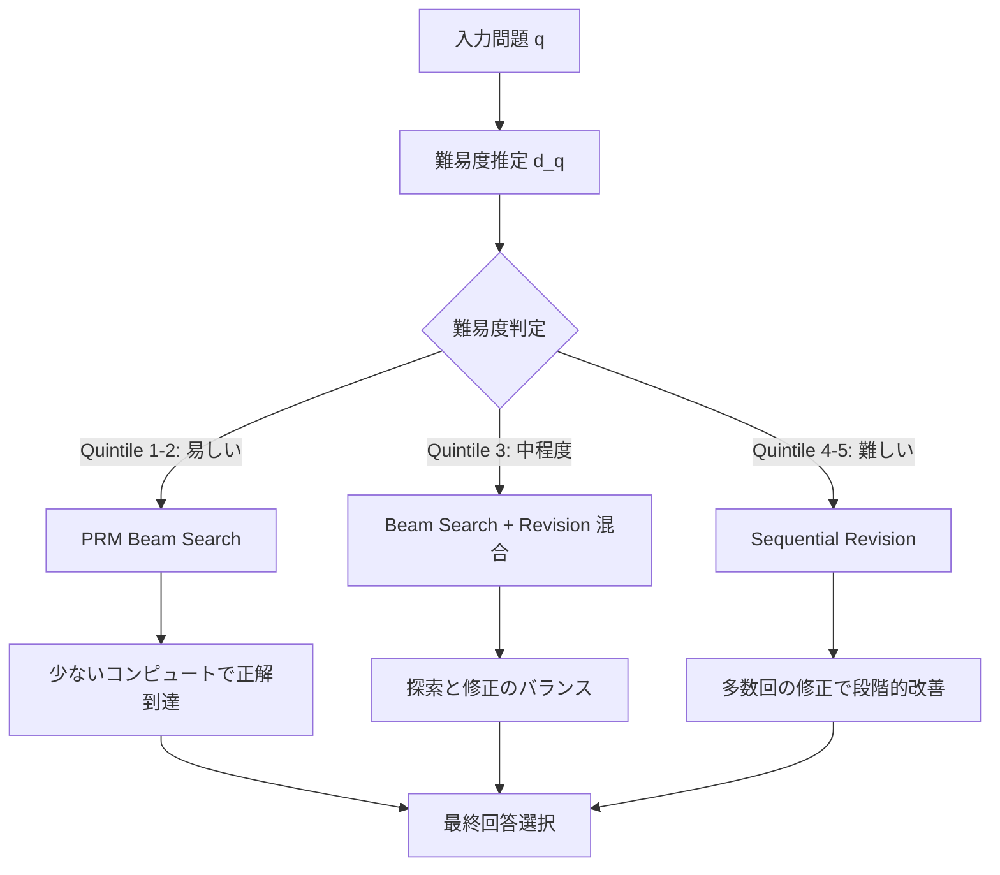

## 論文概要（Abstract）

本記事は [Scaling LLM Test-Time Compute論文 (arXiv:2408.03314)](https://arxiv.org/abs/2408.03314) の解説記事です。

著者らは、LLMの推論時（test-time）に追加のコンピュートを投入する際、その配分方法を最適化すれば、事前学習時にモデルパラメータをスケールするよりも効率的に性能を向上できることを示している。具体的には、MATHベンチマークにおいて、compute-optimal戦略を用いた場合、14倍小さいPaLM 2-Sモデルが、追加コンピュートなしのPaLM 2-Lモデルに匹敵する精度を達成したと報告されている。推論時コンピュートの2つの主要メカニズム---PRM-guided searchとsequential revision---を問題難易度に応じて適応的に切り替える戦略が、性能効率の鍵となる。

この記事は [Zenn記事: Claude Opus 4.7×Agentic RAGで社内検索の推論時スケーリングを実装する](https://zenn.dev/0h_n0/articles/caa33fe1c36da4) の深掘りです。

## 情報源

- **arXiv ID**: 2408.03314
- **URL**: [arXiv:2408.03314](https://arxiv.org/abs/2408.03314)
- **著者**: Charlie Snell, Jaehoon Lee, Kelvin Xu, Aviral Kumar（UC Berkeley / Google DeepMind）
- **発表年**: 2024年8月
- **分野**: Machine Learning (cs.LG)

## 背景と動機（Background & Motivation）

LLMの性能向上は従来、モデルパラメータの増大（事前学習時のスケーリング）に依存してきた。Kaplanらのスケーリング則（2020）やChinchilla（Hoffmann et al., 2022）の研究が示す通り、事前学習のFLOPs・データ・パラメータ数を増やすことで予測可能に性能が向上する。しかし、事前学習のスケーリングはコストが指数関数的に増大し、エネルギー消費や環境負荷も懸念されるようになっている。

一方、OpenAIのo1やGoogleのGemini Thinkingなど、推論時にモデルが「より多く考える」ことで性能を向上させるアプローチが実用化され始めていた。Chain-of-Thought（Wei et al., 2022）やSelf-Consistency（Wang et al., 2023）は推論時コンピュートの有効性を示しているが、追加コンピュートをどのように配分すべきかという体系的な分析は不足していた。

本論文は「推論時コンピュートの最適配分」という問いに正面から取り組み、FLOPs制約下での効率的な推論時スケーリング戦略を提示した点で重要な貢献を果たしている。

## 主要な貢献（Key Contributions）

- **Compute-Optimal戦略の提案**: 問題難易度に応じてtest-time computeを適応的に配分する戦略を定式化し、固定配分と比較して最大4倍の効率改善を達成
- **2つのメカニズムの体系的比較**: PRM-guided search（検証器ベース探索）とsequential revision（逐次修正）について、難易度別の有効性を実験的に解明
- **事前学習スケーリングとの統一的比較**: FLOPs制約下で14倍小さいモデル（PaLM 2-S）がPaLM 2-Lに匹敵することを示し、推論時スケーリングの潜在的価値を定量化
- **難易度依存分析**: MATHの問題を5つのQuintileに分類し、難易度ごとの最適戦略が異なることを実験的に明示

## 技術的詳細（Technical Details）

### Compute-Optimal戦略の定式化

著者らは、推論時コンピュートの最適配分を以下のように定式化している。問題 $q$ に対し、ベースモデル $M$ と追加コンピュート予算 $N$（生成回数）が与えられたとき、正答確率を最大化する配分戦略 $\pi$ を求める：

$$
\pi^*(q, N) = \arg\max_{\pi \in \Pi} \, p\bigl(\text{correct} \mid q, M, \pi, N\bigr)
$$

ここで、
- $q$: 入力問題
- $N$: 追加コンピュート予算（生成サンプル数）
- $\Pi$: 利用可能な戦略の集合（beam search, best-of-N, sequential revision等）
- $M$: ベースLLM

重要な知見として、最適戦略 $\pi^*$ は問題の難易度 $d(q)$ に依存する。著者らは難易度を、ベースモデルの正答確率 $p_{\text{base}}(q)$ で推定している。

### PRM-guided Beam Search

Process Reward Model（PRM）は、解答の各推論ステップに対してスコアを付与する検証器である。PRMスコアを用いたbeam searchは以下のように動作する：

$$
s_t = \text{PRM}(q, a_{1:t})
$$

ここで $s_t$ はステップ $t$ までの部分解 $a_{1:t}$ に対するPRMスコアである。beam幅 $B$ のbeam searchでは、各ステップで上位 $B$ 個の部分解を保持する：

$$
\mathcal{B}_t = \text{top-}B_{a_{1:t}} \, s_t
$$

著者らは2つのPRMスコア集約方法を比較している：

1. **Best-of-N with PRM**: $N$ 個の完全な解を独立生成し、PRMスコアが最大のものを選択

$$
a^* = \arg\max_{a^{(i)}, i \in \{1,\ldots,N\}} \prod_{t=1}^{T_i} s_t^{(i)}
$$

2. **PRM Beam Search**: 各ステップでPRMスコアに基づきビームを選択・展開

論文の実験（Section 4.1）では、beam searchがbest-of-Nよりも一貫して高い性能を示したと報告されている。

### Sequential Revision

Sequential revision（逐次修正）は、モデル自身が前の解を受け取り、改善する手法である。STaR（Zelikman et al., 2022）に着想を得たアプローチで、$k$ 回目の修正は以下のように行われる：

$$
a^{(k)} = M\bigl(q, a^{(k-1)}\bigr), \quad k = 1, 2, \ldots, K
$$

最終的な回答は、全修正結果の中からPRMスコアまたは多数決で選択される。著者らは、修正回数 $K$ に対する性能の飽和（diminishing returns）を観測しており、特に易しい問題では早期に正解に達する一方、難しい問題では多くの修正ラウンドが有効であると報告している。

### 難易度別戦略選択

著者らの核心的発見は、問題難易度によって最適な戦略が異なる点である。以下のフロー図にこの戦略選択を示す：



難易度の推定には、ベースモデルでの少数サンプル生成による正答率 $\hat{p}_{\text{base}}(q)$ を利用する。論文Table 3によると、Quintile 1（最易）ではPRM beam searchが支配的に有効で、Quintile 5（最難）ではsequential revisionが優位となる。

## 実装のポイント（Implementation）

### PRMの訓練

PRMの品質が全体性能を大きく左右する。著者らはPaLM 2ベースのPRMを、MATHの訓練データに対するステップレベルの正誤ラベルで訓練している。実務では、PRMの訓練データ生成が大きなボトルネックとなる。各ステップの正誤ラベルを人手で付与するのはコストが高いため、Monte-Carlo rolloutによる自動ラベリング（各ステップから先を複数回サンプリングし、正答率をステップスコアとする）が現実的な代替手段となる。

### 難易度推定の実装例

問題の難易度推定は、少数の予備サンプリングで実現できる。以下にPythonでの簡易実装例を示す：

```python
from dataclasses import dataclass


@dataclass
class DifficultyEstimate:
    """問題難易度の推定結果

    Attributes:
        question: 入力問題
        base_accuracy: ベースモデルの正答率（0.0-1.0）
        quintile: 難易度Quintile（1=最易, 5=最難）
        recommended_strategy: 推奨戦略
    """
    question: str
    base_accuracy: float
    quintile: int
    recommended_strategy: str


def estimate_difficulty(
    question: str,
    answers: list[str],
    ground_truth: str,
    n_samples: int = 8,
) -> DifficultyEstimate:
    """ベースモデルの正答率から問題難易度を推定する

    Args:
        question: 入力問題テキスト
        answers: ベースモデルが生成した回答リスト
        ground_truth: 正解
        n_samples: サンプル数

    Returns:
        DifficultyEstimate: 難易度推定結果
    """
    correct_count = sum(
        1 for ans in answers[:n_samples]
        if normalize_answer(ans) == normalize_answer(ground_truth)
    )
    base_accuracy = correct_count / n_samples

    # Quintile分類（論文Section 4の基準に準拠）
    if base_accuracy >= 0.8:
        quintile = 1
        strategy = "prm_beam_search"
    elif base_accuracy >= 0.6:
        quintile = 2
        strategy = "prm_beam_search"
    elif base_accuracy >= 0.4:
        quintile = 3
        strategy = "hybrid"
    elif base_accuracy >= 0.2:
        quintile = 4
        strategy = "sequential_revision"
    else:
        quintile = 5
        strategy = "sequential_revision"

    return DifficultyEstimate(
        question=question,
        base_accuracy=base_accuracy,
        quintile=quintile,
        recommended_strategy=strategy,
    )


def normalize_answer(answer: str) -> str:
    """回答文字列を正規化する

    Args:
        answer: 正規化前の回答文字列

    Returns:
        正規化済みの回答文字列
    """
    return answer.strip().lower().replace(" ", "")
```

### Beam Search実装の注意点

PRM beam searchの実装では、ステップ境界の検出が重要となる。数学的推論では改行や特定トークンでステップを区切るが、自然言語タスクではステップ粒度の設計がドメイン依存となる。また、beam幅 $B$ とサンプル数 $N$ のトレードオフにも注意が必要で、論文ではbeam幅を増やすほど性能が向上するが、計算コストも線形に増加することが示されている。

## Production Deployment Guide

### AWS実装パターン（コスト最適化重視）

本論文のcompute-optimal戦略をプロダクション環境に適用する場合、推論時コンピュートの動的配分が鍵となる。以下にトラフィック量別の推奨構成を示す。

コスト試算は2026年4月時点のAWS ap-northeast-1（東京）リージョン料金に基づく概算値である。実際のコストはトラフィックパターン、リージョン、バースト使用量により変動するため、最新料金はAWS料金計算ツールでの確認を推奨する。

| 構成 | トラフィック | 主要サービス | 月額概算 |
|------|------------|-------------|---------|
| Small | ~100 req/日 | Lambda + Bedrock + DynamoDB | $80-200 |
| Medium | ~1,000 req/日 | ECS Fargate + Bedrock + ElastiCache | $400-900 |
| Large | 10,000+ req/日 | EKS + Karpenter + Spot + Bedrock | $2,500-6,000 |

**Small構成の内訳**: Lambda（難易度推定+ルーティング: $5-10/月）、Bedrock Claude API（メイン推論: $50-150/月、トークン量依存）、DynamoDB（キャッシュ+結果保存: $5-15/月）、CloudWatch（監視: $10-20/月）。

**コスト削減テクニック**:
- **Bedrock Batch API**: 非同期処理が許容される場合、50%のコスト削減
- **Prompt Caching**: 同一プレフィックスの問題群で30-90%のトークンコスト削減
- **難易度ルーティング**: 易しい問題にはHaikuクラスの小型モデル、難しい問題にのみOpusクラスを使用（Zenn記事のeffort routing戦略）
- **Spot Instances**: EKS構成で最大90%のコンピュートコスト削減

### Terraformインフラコード

#### Small構成（Serverless）: Lambda + Bedrock + DynamoDB

```hcl
# --- Small構成: 難易度適応型推論ルーター ---
# Lambda で難易度推定 → Bedrock で推論（beam search / revision）

terraform {
  required_version = ">= 1.9"
  required_providers {
    aws = {
      source  = "hashicorp/aws"
      version = "~> 5.80"
    }
  }
}

provider "aws" {
  region = "ap-northeast-1"
}

# --- IAM: 最小権限 ---
resource "aws_iam_role" "inference_router" {
  name = "test-time-compute-router"
  assume_role_policy = jsonencode({
    Version = "2012-10-17"
    Statement = [{
      Action = "sts:AssumeRole"
      Effect = "Allow"
      Principal = { Service = "lambda.amazonaws.com" }
    }]
  })
}

resource "aws_iam_role_policy" "inference_router" {
  name = "inference-router-policy"
  role = aws_iam_role.inference_router.id
  policy = jsonencode({
    Version = "2012-10-17"
    Statement = [
      {
        Effect   = "Allow"
        Action   = ["bedrock:InvokeModel", "bedrock:InvokeModelWithResponseStream"]
        Resource = "arn:aws:bedrock:ap-northeast-1::foundation-model/*"
      },
      {
        Effect   = "Allow"
        Action   = ["dynamodb:GetItem", "dynamodb:PutItem", "dynamodb:Query"]
        Resource = aws_dynamodb_table.inference_cache.arn
      },
      {
        Effect = "Allow"
        Action = [
          "logs:CreateLogGroup", "logs:CreateLogStream", "logs:PutLogEvents"
        ]
        Resource = "arn:aws:logs:*:*:*"
      }
    ]
  })
}

# --- DynamoDB: 推論結果キャッシュ（On-Demand でコスト最適化） ---
resource "aws_dynamodb_table" "inference_cache" {
  name         = "test-time-compute-cache"
  billing_mode = "PAY_PER_REQUEST" # On-Demand: 低トラフィック時にコスト最適
  hash_key     = "question_hash"

  attribute {
    name = "question_hash"
    type = "S"
  }

  ttl {
    attribute_name = "expires_at"
    enabled        = true
  }

  server_side_encryption {
    enabled = true # KMS暗号化
  }
}

# --- Lambda: 難易度推定 + 推論ルーター ---
resource "aws_lambda_function" "inference_router" {
  function_name = "test-time-compute-router"
  role          = aws_iam_role.inference_router.arn
  runtime       = "python3.13"
  handler       = "handler.lambda_handler"
  timeout       = 120 # beam search/revision に十分な時間
  memory_size   = 512

  filename         = "lambda_package.zip"
  source_code_hash = filebase64sha256("lambda_package.zip")

  environment {
    variables = {
      CACHE_TABLE        = aws_dynamodb_table.inference_cache.name
      DIFFICULTY_SAMPLES = "8"  # 難易度推定のサンプル数
      BEAM_WIDTH         = "4"  # PRM beam search のビーム幅
      MAX_REVISIONS      = "5"  # Sequential revision の最大ラウンド
    }
  }

  tracing_config {
    mode = "Active" # X-Ray トレーシング有効化
  }
}

# --- CloudWatch アラーム: コスト監視 ---
resource "aws_cloudwatch_metric_alarm" "lambda_duration" {
  alarm_name          = "test-time-compute-high-duration"
  comparison_operator = "GreaterThanThreshold"
  evaluation_periods  = 3
  metric_name         = "Duration"
  namespace           = "AWS/Lambda"
  period              = 300
  statistic           = "Average"
  threshold           = 60000 # 60秒超過でアラート
  alarm_description   = "推論時間が長い場合、beam幅またはrevision回数の調整を検討"

  dimensions = {
    FunctionName = aws_lambda_function.inference_router.function_name
  }
}
```

#### Large構成（Container）: EKS + Karpenter + Spot

```hcl
# --- Large構成: EKS + Karpenter（Spot優先）---

module "eks" {
  source  = "terraform-aws-modules/eks/aws"
  version = "~> 20.31"

  cluster_name    = "test-time-compute"
  cluster_version = "1.31"

  vpc_id     = module.vpc.vpc_id
  subnet_ids = module.vpc.private_subnets

  # Karpenter用IRSA
  enable_irsa = true
}

# --- Karpenter: Spot優先の自動スケーリング ---
resource "kubectl_manifest" "karpenter_nodepool" {
  yaml_body = yamlencode({
    apiVersion = "karpenter.sh/v1"
    kind       = "NodePool"
    metadata   = { name = "inference-pool" }
    spec = {
      template = {
        spec = {
          requirements = [
            { key = "karpenter.sh/capacity-type", operator = "In", values = ["spot", "on-demand"] },
            { key = "node.kubernetes.io/instance-type", operator = "In",
              values = ["m7i.xlarge", "m7i.2xlarge", "c7i.xlarge", "c7i.2xlarge"] }
          ]
        }
      }
      limits   = { cpu = "64", memory = "256Gi" }
      disruption = {
        consolidationPolicy = "WhenEmptyOrUnderutilized"
        consolidateAfter    = "30s"
      }
    }
  })
}

# --- Secrets Manager: Bedrock設定 ---
resource "aws_secretsmanager_secret" "bedrock_config" {
  name       = "test-time-compute/bedrock"
  kms_key_id = aws_kms_key.app.arn
}

# --- AWS Budgets: 予算アラート ---
resource "aws_budgets_budget" "monthly" {
  name         = "test-time-compute-monthly"
  budget_type  = "COST"
  limit_amount = "5000"
  limit_unit   = "USD"
  time_unit    = "MONTHLY"

  notification {
    comparison_operator       = "GREATER_THAN"
    threshold                 = 80
    threshold_type            = "PERCENTAGE"
    notification_type         = "ACTUAL"
    subscriber_email_addresses = ["ops-team@example.com"]
  }
}
```

### 運用・監視設定

#### CloudWatch Logs Insights クエリ

```
# コスト異常検知: 1時間あたりのBedrock トークン使用量
fields @timestamp, detail.input_tokens, detail.output_tokens, detail.strategy
| filter detail.service = "bedrock"
| stats sum(detail.input_tokens) as total_input,
        sum(detail.output_tokens) as total_output,
        count(*) as request_count
  by bin(1h), detail.strategy
| sort total_output desc

# レイテンシ分析: 戦略別P95/P99
fields @timestamp, detail.duration_ms, detail.strategy, detail.quintile
| filter detail.event = "inference_complete"
| stats percentile(detail.duration_ms, 95) as p95,
        percentile(detail.duration_ms, 99) as p99,
        avg(detail.duration_ms) as avg_ms
  by detail.strategy
```

#### CloudWatch アラーム設定

```python
import boto3


def create_token_usage_alarm(
    cloudwatch: boto3.client,
    sns_topic_arn: str,
    threshold: int = 500000,
) -> dict:
    """Bedrockトークン使用量のスパイク検知アラームを作成する

    Args:
        cloudwatch: CloudWatch クライアント
        sns_topic_arn: 通知先SNSトピックARN
        threshold: アラーム閾値（トークン数/5分）

    Returns:
        CloudWatch put_metric_alarm レスポンス
    """
    return cloudwatch.put_metric_alarm(
        AlarmName="bedrock-token-spike",
        MetricName="InputTokenCount",
        Namespace="AWS/Bedrock",
        Statistic="Sum",
        Period=300,
        EvaluationPeriods=2,
        Threshold=threshold,
        ComparisonOperator="GreaterThanThreshold",
        AlarmActions=[sns_topic_arn],
        AlarmDescription="Bedrockトークン使用量が閾値を超過。難易度ルーティングの閾値を確認",
    )
```

#### X-Ray トレーシング設定

```python
from aws_xray_sdk.core import xray_recorder, patch_all


# boto3自動計装
patch_all()


@xray_recorder.capture("difficulty_estimation")
def estimate_and_route(question: str, model_id: str) -> dict:
    """難易度推定と戦略ルーティングをX-Rayトレースに記録する

    Args:
        question: 入力問題テキスト
        model_id: Bedrockモデル ID

    Returns:
        推論結果（strategy, answer, metadata を含む辞書）
    """
    subsegment = xray_recorder.current_subsegment()
    subsegment.put_annotation("model_id", model_id)

    # 難易度推定（アノテーションに記録）
    difficulty = estimate_difficulty_from_base(question)
    subsegment.put_annotation("quintile", difficulty.quintile)
    subsegment.put_annotation("strategy", difficulty.recommended_strategy)
    subsegment.put_metadata("base_accuracy", difficulty.base_accuracy)

    # 戦略に基づく推論実行
    result = execute_strategy(question, difficulty.recommended_strategy)
    subsegment.put_metadata("token_count", result.get("token_count", 0))

    return result
```

#### Cost Explorer 自動レポート

```python
import datetime

import boto3


def get_daily_cost_report(
    ce_client: boto3.client,
    sns_client: boto3.client,
    sns_topic_arn: str,
    alert_threshold_usd: float = 100.0,
) -> dict:
    """日次コストレポートを取得し、閾値超過時にSNS通知する

    Args:
        ce_client: Cost Explorer クライアント
        sns_client: SNS クライアント
        sns_topic_arn: 通知先SNSトピックARN
        alert_threshold_usd: アラート閾値（USD/日）

    Returns:
        コストレポート辞書（service別コスト、total、alert_triggered を含む）
    """
    today = datetime.date.today()
    yesterday = today - datetime.timedelta(days=1)

    response = ce_client.get_cost_and_usage(
        TimePeriod={
            "Start": yesterday.isoformat(),
            "End": today.isoformat(),
        },
        Granularity="DAILY",
        Metrics=["UnblendedCost"],
        GroupBy=[{"Type": "DIMENSION", "Key": "SERVICE"}],
    )

    # Bedrock/Lambda/EKS コスト抽出
    costs: dict[str, float] = {}
    for group in response["ResultsByTime"][0]["Groups"]:
        service = group["Keys"][0]
        amount = float(group["Metrics"]["UnblendedCost"]["Amount"])
        if any(
            keyword in service
            for keyword in ["Bedrock", "Lambda", "EKS", "EC2"]
        ):
            costs[service] = amount

    total = sum(costs.values())

    alert_triggered = False
    if total > alert_threshold_usd:
        alert_triggered = True
        sns_client.publish(
            TopicArn=sns_topic_arn,
            Subject=f"[ALERT] Test-Time Compute日次コスト ${total:.2f}",
            Message=(
                f"日次コストが閾値 ${alert_threshold_usd} を超過しました。\n"
                f"合計: ${total:.2f}\n"
                f"内訳: {costs}"
            ),
        )

    return {"services": costs, "total": total, "alert_triggered": alert_triggered}
```

### コスト最適化チェックリスト

#### アーキテクチャ選択

- [ ] トラフィック量に応じた構成を選択（~100 req/日: Serverless、~1,000 req/日: Hybrid、10,000+ req/日: Container）
- [ ] 難易度ルーティングを実装し、不要な大型モデル呼び出しを削減

#### リソース最適化

- [ ] EC2/EKS: Spot Instances優先（最大90%削減、Karpenter でフォールバック設定）
- [ ] Reserved Instances: 安定ワークロードには1年コミット（最大72%削減）
- [ ] Savings Plans: Compute Savings Plans検討
- [ ] Lambda: メモリサイズ最適化（Power Tuningツールで検証）
- [ ] ECS/EKS: アイドル時スケールダウン（Karpenter consolidationPolicy設定）

#### LLMコスト削減

- [ ] Bedrock Batch API: 非同期処理が許容される場合に使用（50%削減）
- [ ] Prompt Caching: 同一プレフィックスの問題群で有効化（30-90%削減）
- [ ] モデル選択ロジック: 難易度Quintile 1-2はHaikuクラス、Quintile 4-5はOpusクラスに振り分け
- [ ] トークン数制限: beam search/revisionの最大トークン数を制限
- [ ] 早期停止: PRM beam searchで閾値を超えたら探索を打ち切り

#### 監視・アラート

- [ ] AWS Budgets: 月次予算アラート設定（80%/100%閾値）
- [ ] CloudWatch アラーム: Bedrockトークン使用量、Lambda実行時間
- [ ] Cost Anomaly Detection: 異常検知の自動有効化
- [ ] 日次コストレポート: Cost Explorer APIで自動取得・SNS通知

#### リソース管理

- [ ] 未使用リソース: 定期的な棚卸し（Lambda未使用関数、DynamoDB未使用テーブル）
- [ ] タグ戦略: `project:test-time-compute`、`environment:{dev,staging,prod}` タグ付け
- [ ] ライフサイクルポリシー: DynamoDB TTL、S3ライフサイクル設定
- [ ] 開発環境: 夜間・週末の自動停止（EventBridge Scheduler）
- [ ] CloudTrail/Config: 監査ログの有効化（セキュリティ要件）

## 実験結果（Results）

### PaLM 2-S vs PaLM 2-L 比較

論文の主要実験はMATHベンチマーク上で実施されている。以下に主な結果を示す（論文Figure 1, Table 1より）：

| モデル | 戦略 | MATHスコア | 備考 |
|--------|------|-----------|------|
| PaLM 2-L | ベースライン（追加コンピュートなし） | ~33.4% | 基準性能 |
| PaLM 2-S | ベースライン（追加コンピュートなし） | ~18.2% | 14倍小さいモデル |
| PaLM 2-S | Best-of-N（固定配分） | ~27% | 一律のサンプリング |
| PaLM 2-S | Compute-Optimal戦略 | ~33% | PaLM 2-Lに匹敵 |

compute-optimal戦略を適用したPaLM 2-Sは、PaLM 2-Lのベースライン性能に匹敵する結果を達成している。これは、同じFLOPs予算であれば、大きなモデルを1回実行するよりも、小さいモデルで推論時コンピュートを最適配分する方が効率的であることを示唆している。

### Quintile別分析

著者らはMATHの問題を正答率で5つのQuintileに分類し、戦略ごとの有効性を分析している（論文Figure 5より）：

| Quintile | 難易度 | 最適戦略 | 理由 |
|----------|--------|---------|------|
| Q1（最易） | ベース正答率 ~80%+ | PRM Beam Search | 少ないサンプルで正解到達可能 |
| Q2 | ベース正答率 ~60% | PRM Beam Search | 検証器で誤りを排除可能 |
| Q3 | ベース正答率 ~40% | Hybrid | 探索と修正の両方が有効 |
| Q4 | ベース正答率 ~20% | Sequential Revision | 段階的な改善が必要 |
| Q5（最難） | ベース正答率 ~5% | Sequential Revision | 初回解が大幅に間違っており、修正が不可欠 |

この結果は、固定戦略（全問題に同一手法を適用）と比較して、compute-optimal戦略が最大4倍の効率改善を達成することを裏付けている。

## 実運用への応用（Practical Applications）

### RAGシステムのEffort Routing

Zenn記事で紹介されているAgentic RAGへの応用が本論文の直接的な実用化パスとなる。クエリの難易度を推定し、推論リソースを適応的に配分するeffort routingは、本論文のcompute-optimal戦略そのものである。

具体的な応用パターンとして以下が考えられる：

1. **クエリ難易度推定**: ユーザークエリを分類し、FAQ的な簡単な質問にはキャッシュまたは小型モデル、複雑な分析クエリには大型モデル+multi-step推論を割り当てる
2. **PRM的な検証**: RAGで取得した文書と生成回答の整合性をスコアリングし、閾値未満であれば再生成する
3. **段階的推論**: 初回のRAG結果が不十分な場合、追加の文書検索と回答修正を逐次的に実行する

ただし、本論文の実験はMATHベンチマーク（正解が一意に定まる数学問題）に限定されている点に注意が必要である。自然言語での質問応答やコード生成など、正解が一意でないタスクへの直接的な転用には、PRMの設計やスコアリング基準の再検討が求められる。

## 関連研究（Related Work）

- **Chain-of-Thought Prompting**（Wei et al., 2022）: 推論ステップを明示的に生成させることで性能を向上させる手法。本論文の sequential revisionはこの考え方を拡張し、複数ラウンドの修正を行う点で異なる
- **Self-Consistency**（Wang et al., 2023）: 複数の推論パスを生成し多数決で回答を選択する手法。本論文のbest-of-Nに類似するが、PRMによるスコアリングで多数決より精緻な選択を実現している
- **Tree of Thoughts**（Yao et al., 2023）: 推論を木構造で探索する手法。本論文のbeam searchはこれの変種と解釈でき、PRMによるステップレベルの評価で効率的な枝刈りを行う

## まとめと今後の展望

本論文は、推論時コンピュートの配分最適化という観点から、LLMの性能向上に新たなスケーリング軸があることを実験的に示した重要な研究である。14倍小さいモデルが大型モデルに匹敵するという結果は、推論コストの削減と性能向上を両立できる可能性を示唆している。

今後の研究方向としては、PRM品質への依存度の低減、MATH以外のタスク（コード生成、自然言語推論等）への汎化、reward hackingリスクへの対策、そしてリアルタイム難易度推定の高精度化が挙げられる。2024年以降、OpenAI o1/o3やDeepSeek-R1など推論時コンピュートを活用するモデルが実用化されており、本論文の知見はこれらのシステム設計の理論的基盤として位置づけられる。

## 参考文献

- **arXiv**: [https://arxiv.org/abs/2408.03314](https://arxiv.org/abs/2408.03314)
- **Related Zenn article**: [https://zenn.dev/0h_n0/articles/caa33fe1c36da4](https://zenn.dev/0h_n0/articles/caa33fe1c36da4)
- Wei, J. et al. (2022). "Chain-of-Thought Prompting Elicits Reasoning in Large Language Models." NeurIPS 2022.
- Wang, X. et al. (2023). "Self-Consistency Improves Chain of Thought Reasoning in Language Models." ICLR 2023.
- Yao, S. et al. (2023). "Tree of Thoughts: Deliberate Problem Solving with Large Language Models." NeurIPS 2023.
- Zelikman, E. et al. (2022). "STaR: Bootstrapping Reasoning With Reasoning." NeurIPS 2022.
- Kaplan, J. et al. (2020). "Scaling Laws for Neural Language Models."
- Hoffmann, J. et al. (2022). "Training Compute-Optimal Large Language Models." (Chinchilla)
