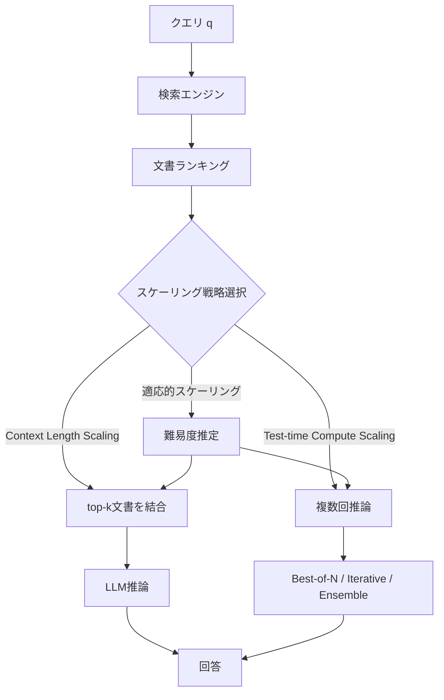

## 論文概要（Abstract）

本記事は [Inference Scaling for Long-Context RAG論文 (arXiv:2410.04343)](https://arxiv.org/abs/2410.04343) の解説記事です。

Retrieval-Augmented Generation（RAG）において、推論時のスケーリング戦略を体系的に分析した研究である。著者らは、取得するコンテキストの長さ（context length scaling）と、テスト時の計算量（test-time compute scaling）という2つの独立したスケーリング軸を定義し、Dynamic RAG（DRAG）フレームワークを提案している。クエリの難易度に応じてこれらのスケーリング戦略を適応的に組み合わせることで、固定的なRAGパイプラインに対して大幅な精度向上が可能であることを、5つのQAベンチマークで実証している。

この記事は [Zenn記事: Claude Opus 4.7×Agentic RAGで社内検索の推論時スケーリングを実装する](https://zenn.dev/0h_n0/articles/caa33fe1c36da4) の深掘りです。

## 情報源

- **arXiv ID**: 2410.04343
- **URL**: [https://arxiv.org/abs/2410.04343](https://arxiv.org/abs/2410.04343)
- **著者**: Zhenrui Yue, Honglei Zhuang, Aijun Bai et al.（Google）
- **発表年**: 2024
- **分野**: cs.CL, cs.IR

## 背景と動機（Background & Motivation）

Gemini 1.5やGPT-4 Turboに代表される長文コンテキストLLMの登場により、RAGシステムは従来の数千トークンの制約を超え、128Kトークン以上のコンテキストを直接処理できるようになった。しかし、コンテキストを長くすれば精度が単調に向上するわけではない。取得文書数を増やすと、関連文書が増える一方でノイズ（無関係な文書）も混入し、LLMの注意が分散する問題（Lost in the Middle問題）が知られている。

一方で、test-time compute scaling（推論時に複数回のサンプリングや反復的な推敲を行う手法）がLLMの推論能力を向上させることが、Snell et al. (2024) などにより報告されている。しかし、RAGの文脈でこの2つのスケーリング軸がどのように相互作用するかは十分に研究されていなかった。

著者らは、コンテキスト長の増大とtest-time computeの増大が同じ計算予算（FLOPs）を消費する競合関係にある点に着目し、与えられた計算予算下での最適な配分戦略を体系的に分析することを目的としている。

## 主要な貢献（Key Contributions）

- **DRAGフレームワークの提案**: context length scalingとtest-time compute scalingの2軸を統合的に扱うDynamic RAG（DRAG）フレームワークを定式化し、Pareto frontier分析により最適な組み合わせを導出した
- **3つのtest-time compute手法の比較**: Best-of-N sampling、Iterative refinement、Ensembleの3手法をRAGに適用し、タスク特性ごとの有効性を体系的に比較した
- **適応的スケーリング戦略**: クエリの難易度に応じてスケーリング戦略を動的に切り替える手法を提案し、固定戦略に対する優位性を実証した
- **計算予算とパフォーマンスのトレードオフ分析**: 同一FLOPs予算下でのcontext length scalingとtest-time compute scalingの最適配分をPareto frontier分析で明らかにした

## 技術的詳細（Technical Details）

### DRAGフレームワークの全体像



### Context Length Scaling

context length scalingは、検索で取得する文書数$k$を増加させる手法である。RAGの生成確率は以下のように定式化される。

$$
p(y \mid q) = p(y \mid q, D_k)
$$

ここで、
- $q$: 入力クエリ
- $y$: 生成される回答
- $D_k = \{d_1, d_2, \ldots, d_k\}$: 関連度スコア順にソートされたtop-$k$文書集合

$k$を増やすと、正解を含む文書が$D_k$に含まれる確率（Recall@$k$）は向上するが、無関係な文書も増加するため精度が飽和または低下する場合がある。論文の実験では、top-5からtop-100への拡張で約10%の精度向上が観測される一方、それ以上では改善が鈍化することが報告されている（論文Table 1）。

### Test-time Compute Scaling

test-time compute scalingは、推論フェーズでの計算量を増やすことで出力品質を向上させる手法群であり、著者らは3つの戦略を検討している。

**1. Best-of-N Sampling**

同一入力に対して$N$回の独立したサンプリングを行い、最良の出力を選択する。

$$
y^* = \arg\max_{y_i, \, i \in \{1, \ldots, N\}} \, \text{score}(y_i, q, D_k)
$$

ここで、$\text{score}(y_i, q, D_k)$はLLM自身による回答の信頼度スコアである。著者らは多数決（majority voting）を用いた変種も検討しており、$N$個の回答の中で最頻出の回答を選択する手法が報告されている。

**2. Iterative Refinement**

初回の回答を生成した後、その回答をフィードバックとして再度LLMに入力し、逐次的に回答を改善する。

$$
y^{(t+1)} = \text{LLM}(q, D_k, y^{(t)}, \text{feedback}^{(t)})
$$

ここで、$t$は反復回数、$\text{feedback}^{(t)}$は$t$回目の回答に対するLLM自身による評価フィードバックである。

**3. Ensemble**

異なるコンテキスト分割で複数の回答を生成し、それらを統合する。

$$
y^* = \text{Aggregate}(y_1, y_2, \ldots, y_M)
$$

$M$個の異なるコンテキストウィンドウから得られた回答を、LLMによる統合または多数決で最終回答とする。

### 適応的スケーリング戦略

著者らは、クエリの難易度に応じてスケーリング戦略を動的に選択する適応的スケーリングを提案している。難易度の推定には、以下の指標を用いている。

$$
\text{difficulty}(q) = 1 - \max_{i} \, p(y_i \mid q, D_k)
$$

LLMの初回出力における最大確率が低いほど、そのクエリは難しいと判断される。著者らは難易度を3段階（Easy / Medium / Hard）に分類し、以下の戦略を適用している。

- **Easy**: 少ないコンテキスト（top-5〜10）、追加computeなし
- **Medium**: 中程度のコンテキスト（top-20〜50）、Best-of-4程度
- **Hard**: 長いコンテキスト（top-50〜100）＋高いcompute（Best-of-16やIterative refinement）

### Pareto Frontier分析

同一のFLOPs予算下で、context length scalingとtest-time compute scalingの最適な組み合わせをPareto frontier分析で導出している。FLOPs予算は以下のように近似される。

$$
\text{FLOPs} \propto L_{\text{context}} \times N_{\text{samples}}
$$

ここで、$L_{\text{context}}$はコンテキスト長（トークン数）、$N_{\text{samples}}$はサンプリング回数である。同一FLOPs予算であれば、「長いコンテキスト×少ないサンプリング」と「短いコンテキスト×多いサンプリング」は同等のコストとなる。

## 実装のポイント（Implementation）

### Best-of-N Samplingの実装例

論文で提案されているBest-of-N samplingをPythonで実装すると、以下のようになる。

```python
from collections import Counter
from typing import Any


def best_of_n_sampling(
    llm_fn: Any,
    query: str,
    context: str,
    n: int = 8,
    temperature: float = 0.7,
    strategy: str = "majority_vote",
) -> str:
    """Best-of-N samplingによるRAG回答生成

    同一クエリ・コンテキストに対してN回のサンプリングを行い、
    最良の回答を選択する。

    Args:
        llm_fn: LLM推論関数（query, context, temperatureを受け取る）
        query: 入力クエリ
        context: 検索で取得した結合コンテキスト
        n: サンプリング回数
        temperature: サンプリング温度（高いほど多様な出力）
        strategy: 選択戦略（"majority_vote" or "confidence"）

    Returns:
        最良と判定された回答文字列
    """
    candidates: list[str] = []
    for _ in range(n):
        response = llm_fn(
            query=query,
            context=context,
            temperature=temperature,
        )
        candidates.append(response.strip())

    if strategy == "majority_vote":
        counter = Counter(candidates)
        best_answer, _count = counter.most_common(1)[0]
        return best_answer

    # confidence-based: LLMに各候補を評価させる
    best_score = -1.0
    best_answer = candidates[0]
    for candidate in candidates:
        score = llm_fn(
            query=f"Rate the quality of this answer (0-1): {candidate}",
            context=context,
            temperature=0.0,
        )
        parsed_score = float(score.strip())
        if parsed_score > best_score:
            best_score = parsed_score
            best_answer = candidate

    return best_answer
```

### 適応的スケーリングの実装例

```python
from dataclasses import dataclass
from enum import Enum
from typing import Any


class QueryDifficulty(Enum):
    """クエリ難易度の3段階分類"""
    EASY = "easy"
    MEDIUM = "medium"
    HARD = "hard"


@dataclass(frozen=True)
class ScalingConfig:
    """スケーリング戦略の設定

    Attributes:
        top_k: 取得文書数
        num_samples: Best-of-Nのサンプリング回数
        use_iterative: Iterative refinementを使用するか
        max_iterations: 反復回数の上限
    """
    top_k: int
    num_samples: int
    use_iterative: bool = False
    max_iterations: int = 1


# 論文の実験結果に基づく推奨設定（論文Section 4より）
SCALING_CONFIGS: dict[QueryDifficulty, ScalingConfig] = {
    QueryDifficulty.EASY: ScalingConfig(top_k=5, num_samples=1),
    QueryDifficulty.MEDIUM: ScalingConfig(top_k=20, num_samples=4),
    QueryDifficulty.HARD: ScalingConfig(
        top_k=50, num_samples=16, use_iterative=True, max_iterations=3
    ),
}


def estimate_difficulty(
    llm_fn: Any,
    query: str,
    initial_context: str,
    confidence_threshold_easy: float = 0.8,
    confidence_threshold_medium: float = 0.5,
) -> QueryDifficulty:
    """クエリの難易度を推定する

    LLMの初回出力の信頼度に基づき、3段階の難易度を判定する。
    論文Section 4.3の適応的スケーリング戦略に基づく。

    Args:
        llm_fn: LLM推論関数
        query: 入力クエリ
        initial_context: 初回検索で取得したコンテキスト（top-5）
        confidence_threshold_easy: Easy判定の閾値
        confidence_threshold_medium: Medium判定の閾値

    Returns:
        推定された難易度レベル
    """
    response = llm_fn(
        query=query,
        context=initial_context,
        temperature=0.0,
        return_confidence=True,
    )
    confidence: float = response.confidence

    if confidence >= confidence_threshold_easy:
        return QueryDifficulty.EASY
    if confidence >= confidence_threshold_medium:
        return QueryDifficulty.MEDIUM
    return QueryDifficulty.HARD


def adaptive_rag(
    llm_fn: Any,
    retriever_fn: Any,
    query: str,
) -> str:
    """適応的スケーリングによるRAG推論

    クエリ難易度に応じてcontext lengthとtest-time computeを
    動的に調整するDRAGフレームワークの実装。

    Args:
        llm_fn: LLM推論関数
        retriever_fn: 検索関数（query, top_kを受け取る）
        query: 入力クエリ

    Returns:
        最終回答
    """
    # Step 1: 初回検索で難易度推定
    initial_docs = retriever_fn(query=query, top_k=5)
    initial_context = "\n\n".join(initial_docs)
    difficulty = estimate_difficulty(llm_fn, query, initial_context)

    # Step 2: 難易度に応じた設定を取得
    config = SCALING_CONFIGS[difficulty]

    # Step 3: 設定に基づき文書を取得
    docs = retriever_fn(query=query, top_k=config.top_k)
    context = "\n\n".join(docs)

    # Step 4: test-time compute scaling
    if config.num_samples > 1:
        answer = best_of_n_sampling(
            llm_fn=llm_fn,
            query=query,
            context=context,
            n=config.num_samples,
        )
    else:
        answer = llm_fn(query=query, context=context, temperature=0.0)

    # Step 5: Iterative refinement（Hardクエリのみ）
    if config.use_iterative:
        for _iteration in range(config.max_iterations):
            feedback = llm_fn(
                query=f"Evaluate and improve this answer: {answer}",
                context=context,
                temperature=0.0,
            )
            answer = feedback

    return answer
```

実装上の注意点として、Best-of-N samplingではtemperatureを適切に設定する必要がある。温度が低すぎると候補間の多様性が失われ、高すぎると品質が低下する。著者らは0.5〜0.7の範囲を推奨している。また、Iterative refinementでは反復回数が多すぎると回答が過度に修正される「over-refinement」が発生するため、3回程度が適切であると報告されている。

## Production Deployment Guide

### AWS実装パターン（コスト最適化重視）

DRAGフレームワークをプロダクション環境にデプロイする際のAWS構成を示す。Best-of-N samplingや適応的スケーリングは推論回数が増加するため、コスト管理が重要となる。

**コスト試算の注意事項**: 以下の試算は2026年4月時点のAWS ap-northeast-1（東京）リージョン料金に基づく概算値である。実際のコストはトラフィックパターン、リージョン、バースト使用量により変動する。最新料金は[AWS料金計算ツール](https://calculator.aws/)で確認を推奨する。

| 構成 | トラフィック | 主要サービス | 月額概算 |
|------|-------------|-------------|---------|
| Small (Serverless) | ~100 req/日 | Lambda + Bedrock + OpenSearch Serverless | $80-180 |
| Medium (Hybrid) | ~1,000 req/日 | ECS Fargate + Bedrock + OpenSearch | $400-900 |
| Large (Container) | 10,000+ req/日 | EKS + Karpenter (Spot) + Bedrock Batch | $2,500-5,500 |

**Small構成の内訳**:
- Lambda (512MB, avg 10s): ~$5/月
- Bedrock Claude Sonnet (avg 2K input + 500 output tokens × 100 req × Best-of-4): ~$40/月
- OpenSearch Serverless (2 OCU): ~$35/月

**Large構成のコスト削減テクニック**:
- Spot Instances活用: オンデマンド比で最大90%削減（m6i.xlarge: $0.192/h → $0.058/h）
- Bedrock Batch API: 同期APIの50%コスト（非リアルタイム処理に適用）
- Prompt Caching有効化: 同一コンテキストの再利用で30-90%のトークンコスト削減
- Reserved Instances: 1年コミットで最大72%削減

### Terraformインフラコード

**Small構成（Serverless）**:

```hcl
# DRAGフレームワーク - Small構成 (Serverless)
# Lambda + Bedrock + DynamoDB

terraform {
  required_version = ">= 1.9"
  required_providers {
    aws = {
      source  = "hashicorp/aws"
      version = "~> 5.50"
    }
  }
}

provider "aws" {
  region = "ap-northeast-1"
}

# --- IAMロール（最小権限） ---
resource "aws_iam_role" "drag_lambda" {
  name = "drag-lambda-role"
  assume_role_policy = jsonencode({
    Version = "2012-10-17"
    Statement = [{
      Action = "sts:AssumeRole"
      Effect = "Allow"
      Principal = { Service = "lambda.amazonaws.com" }
    }]
  })
}

resource "aws_iam_role_policy" "drag_lambda_policy" {
  name = "drag-lambda-policy"
  role = aws_iam_role.drag_lambda.id
  policy = jsonencode({
    Version = "2012-10-17"
    Statement = [
      {
        # Bedrock InvokeModel のみ許可
        Effect   = "Allow"
        Action   = ["bedrock:InvokeModel"]
        Resource = "arn:aws:bedrock:ap-northeast-1::foundation-model/anthropic.claude-*"
      },
      {
        # DynamoDBキャッシュテーブルへのアクセス
        Effect   = "Allow"
        Action   = ["dynamodb:GetItem", "dynamodb:PutItem", "dynamodb:Query"]
        Resource = aws_dynamodb_table.drag_cache.arn
      },
      {
        # CloudWatch Logsへの書き込み
        Effect   = "Allow"
        Action   = ["logs:CreateLogGroup", "logs:CreateLogStream", "logs:PutLogEvents"]
        Resource = "arn:aws:logs:ap-northeast-1:*:*"
      }
    ]
  })
}

# --- Lambda関数 ---
resource "aws_lambda_function" "drag_inference" {
  function_name = "drag-inference"
  role          = aws_iam_role.drag_lambda.arn
  handler       = "handler.lambda_handler"
  runtime       = "python3.12"
  timeout       = 120  # Best-of-N で最大120秒
  memory_size   = 512  # コスト最適化: 512MBで十分

  filename         = "lambda.zip"
  source_code_hash = filebase64sha256("lambda.zip")

  environment {
    variables = {
      DYNAMODB_TABLE     = aws_dynamodb_table.drag_cache.name
      DEFAULT_TOP_K      = "5"
      MAX_SAMPLES        = "16"
      BEDROCK_MODEL_ID   = "anthropic.claude-sonnet-4-20250514"
    }
  }

  tracing_config {
    mode = "Active"  # X-Ray有効化
  }
}

# --- DynamoDB（回答キャッシュ / On-Demand） ---
resource "aws_dynamodb_table" "drag_cache" {
  name         = "drag-response-cache"
  billing_mode = "PAY_PER_REQUEST"  # コスト最適化: On-Demand
  hash_key     = "query_hash"
  range_key    = "config_hash"

  attribute {
    name = "query_hash"
    type = "S"
  }
  attribute {
    name = "config_hash"
    type = "S"
  }

  ttl {
    attribute_name = "expires_at"
    enabled        = true
  }

  server_side_encryption {
    enabled = true  # KMS暗号化
  }
}

# --- CloudWatchアラーム（コスト監視） ---
resource "aws_cloudwatch_metric_alarm" "lambda_duration" {
  alarm_name          = "drag-lambda-high-duration"
  comparison_operator = "GreaterThanThreshold"
  evaluation_periods  = 3
  metric_name         = "Duration"
  namespace           = "AWS/Lambda"
  period              = 300
  statistic           = "p95"
  threshold           = 90000  # 90秒
  alarm_description   = "Lambda実行時間P95が90秒超過"

  dimensions = {
    FunctionName = aws_lambda_function.drag_inference.function_name
  }
}
```

**Large構成（Container）**:

```hcl
# DRAGフレームワーク - Large構成 (EKS + Karpenter)

module "eks" {
  source  = "terraform-aws-modules/eks/aws"
  version = "~> 20.0"

  cluster_name    = "drag-cluster"
  cluster_version = "1.31"

  vpc_id     = module.vpc.vpc_id
  subnet_ids = module.vpc.private_subnets

  cluster_endpoint_public_access = false  # セキュリティ: プライベートのみ

  eks_managed_node_groups = {
    system = {
      instance_types = ["m6i.large"]
      min_size       = 1
      max_size       = 2
      desired_size   = 1
    }
  }
}

# --- Karpenter Provisioner（Spot優先） ---
resource "kubectl_manifest" "karpenter_nodepool" {
  yaml_body = yamlencode({
    apiVersion = "karpenter.sh/v1"
    kind       = "NodePool"
    metadata   = { name = "drag-inference" }
    spec = {
      template = {
        spec = {
          requirements = [
            { key = "karpenter.sh/capacity-type", operator = "In", values = ["spot", "on-demand"] },
            { key = "node.kubernetes.io/instance-type", operator = "In",
              values = ["m6i.xlarge", "m6i.2xlarge", "m7i.xlarge", "m7i.2xlarge"] },
          ]
          nodeClassRef = { name = "default" }
        }
      }
      limits   = { cpu = "64", memory = "256Gi" }
      disruption = {
        consolidationPolicy = "WhenEmptyOrUnderutilized"
        consolidateAfter    = "30s"
      }
    }
  })
}

# --- Secrets Manager（Bedrock設定） ---
resource "aws_secretsmanager_secret" "drag_config" {
  name        = "drag/bedrock-config"
  description = "DRAGフレームワークのBedrock設定"
}

# --- AWS Budgets（予算アラート） ---
resource "aws_budgets_budget" "drag_monthly" {
  name         = "drag-monthly-budget"
  budget_type  = "COST"
  limit_amount = "5000"
  limit_unit   = "USD"
  time_unit    = "MONTHLY"

  notification {
    comparison_operator       = "GREATER_THAN"
    threshold                 = 80
    threshold_type            = "PERCENTAGE"
    notification_type         = "ACTUAL"
    subscriber_email_addresses = ["ops-team@example.com"]
  }
}
```

### 運用・監視設定

**CloudWatch Logs Insightsクエリ**:

```
# コスト異常検知: 1時間あたりのBedrock トークン使用量
fields @timestamp, @message
| filter @message like /bedrock_tokens/
| stats sum(input_tokens) as total_input, sum(output_tokens) as total_output by bin(1h)
| filter total_input > 1000000

# レイテンシ分析: P95, P99
fields @timestamp, duration_ms
| stats percentile(duration_ms, 95) as p95,
        percentile(duration_ms, 99) as p99,
        avg(duration_ms) as avg_ms
  by bin(5m)
```

**CloudWatchアラーム設定**:

```python
import boto3


def create_drag_alarms(function_name: str, sns_topic_arn: str) -> None:
    """DRAGフレームワーク用のCloudWatchアラームを作成する

    Args:
        function_name: Lambda関数名
        sns_topic_arn: 通知先SNSトピックARN
    """
    cw = boto3.client("cloudwatch", region_name="ap-northeast-1")

    # Bedrockトークン使用量スパイク検知
    cw.put_metric_alarm(
        AlarmName="drag-bedrock-token-spike",
        MetricName="InputTokenCount",
        Namespace="AWS/Bedrock",
        Statistic="Sum",
        Period=3600,
        EvaluationPeriods=1,
        Threshold=500000,
        ComparisonOperator="GreaterThanThreshold",
        AlarmActions=[sns_topic_arn],
        AlarmDescription="Bedrockトークン使用量が1時間あたり50万を超過",
    )

    # Lambda実行時間異常検知
    cw.put_metric_alarm(
        AlarmName="drag-lambda-timeout-risk",
        MetricName="Duration",
        Namespace="AWS/Lambda",
        Statistic="p99",
        Period=300,
        EvaluationPeriods=3,
        Threshold=100000,
        ComparisonOperator="GreaterThanThreshold",
        Dimensions=[{"Name": "FunctionName", "Value": function_name}],
        AlarmActions=[sns_topic_arn],
        AlarmDescription="Lambda実行時間P99が100秒超過（タイムアウトリスク）",
    )
```

**X-Rayトレーシング設定**:

```python
from aws_xray_sdk.core import xray_recorder, patch_all


def setup_xray_tracing() -> None:
    """X-Rayトレーシングを初期化する

    boto3のBedrock/DynamoDB呼び出しを自動計装し、
    DRAGフレームワーク固有のアノテーションを記録する。
    """
    xray_recorder.configure(service="drag-inference")
    patch_all()  # boto3自動計装


def trace_drag_inference(
    query: str,
    difficulty: str,
    top_k: int,
    num_samples: int,
) -> None:
    """DRAG推論のトレーシングメタデータを記録する

    Args:
        query: 入力クエリ
        difficulty: 推定難易度（easy/medium/hard）
        top_k: 取得文書数
        num_samples: サンプリング回数
    """
    segment = xray_recorder.current_segment()
    segment.put_annotation("difficulty", difficulty)
    segment.put_annotation("top_k", top_k)
    segment.put_annotation("num_samples", num_samples)
    segment.put_metadata("query", query, "drag")
```

**Cost Explorer自動レポート**:

```python
import datetime

import boto3


def get_daily_drag_cost(sns_topic_arn: str, threshold_usd: float = 100.0) -> dict:
    """日次のDRAGフレームワークコストを取得し、閾値超過時にSNS通知する

    Args:
        sns_topic_arn: 通知先SNSトピックARN
        threshold_usd: 日次コスト閾値（USD）

    Returns:
        サービス別コスト辞書
    """
    ce = boto3.client("ce", region_name="us-east-1")
    sns = boto3.client("sns", region_name="ap-northeast-1")

    today = datetime.date.today()
    yesterday = today - datetime.timedelta(days=1)

    response = ce.get_cost_and_usage(
        TimePeriod={
            "Start": yesterday.isoformat(),
            "End": today.isoformat(),
        },
        Granularity="DAILY",
        Metrics=["UnblendedCost"],
        Filter={
            "Tags": {
                "Key": "Project",
                "Values": ["drag-framework"],
            }
        },
        GroupBy=[{"Type": "DIMENSION", "Key": "SERVICE"}],
    )

    costs: dict[str, float] = {}
    total = 0.0
    for group in response["ResultsByTime"][0]["Groups"]:
        service = group["Keys"][0]
        amount = float(group["Metrics"]["UnblendedCost"]["Amount"])
        costs[service] = amount
        total += amount

    if total > threshold_usd:
        sns.publish(
            TopicArn=sns_topic_arn,
            Subject=f"DRAG日次コスト警告: ${total:.2f}",
            Message=f"日次コストが${threshold_usd}を超過しました。\n内訳: {costs}",
        )

    return costs
```

### コスト最適化チェックリスト

**アーキテクチャ選択**:
- [ ] トラフィック量に応じた構成を選択（~100 req/日→Serverless、~1000→Hybrid、10000+→Container）
- [ ] Best-of-N の N をクエリ難易度に応じて動的に調整（Easy: N=1、Hard: N=16）

**リソース最適化**:
- [ ] EC2/EKS: Spot Instances優先（m6i/m7iファミリー、最大90%削減）
- [ ] Reserved Instances: 安定ワークロードに1年コミット（最大72%削減）
- [ ] Savings Plans: Compute Savings Plans検討
- [ ] Lambda: メモリサイズ最適化（512MB推奨、Power Tuningで検証）
- [ ] EKS: Karpenter consolidationPolicy で未使用ノード自動削除

**LLMコスト削減**:
- [ ] Bedrock Batch API: 非リアルタイム処理に適用（50%削減）
- [ ] Prompt Caching: 同一コンテキストの再利用で30-90%削減
- [ ] モデル選択ロジック: Easy→Haiku、Medium→Sonnet、Hard→Opus
- [ ] トークン数制限: max_tokens を回答タスクに応じて設定
- [ ] DynamoDBキャッシュ: 同一クエリ・設定の回答を再利用

**監視・アラート**:
- [ ] AWS Budgets: 月次予算アラート（80%/100%閾値）
- [ ] CloudWatch アラーム: トークン使用量、レイテンシP95/P99
- [ ] Cost Anomaly Detection: 自動異常検知有効化
- [ ] 日次コストレポート: Cost Explorer API + SNS通知

**リソース管理**:
- [ ] 未使用リソース削除: Trusted Advisorで定期チェック
- [ ] タグ戦略: Project/Environment/Ownerタグ必須
- [ ] ライフサイクルポリシー: DynamoDB TTL、S3 Intelligent-Tiering
- [ ] 開発環境夜間停止: EventBridge + Lambda で自動停止/起動
- [ ] ログ保持期間: CloudWatch Logs 30日、S3 Glacier 90日

## 実験結果（Results）

著者らはGemini 1.5 Flash/Proを用いて、5つのQAベンチマークで包括的な実験を行っている（論文Table 1, Table 2）。検索にはBM25とDense Retrieval（GTR-Large）を使用し、最大128Kトークンのコンテキストを処理している。

| データセット | タスク種別 | Baseline (top-5) | Context Scaling (top-100) | + Best-of-16 | 改善率 |
|-------------|-----------|------------------|---------------------------|-------------|--------|
| NQ | 単一ホップQA | 42.3 | 52.1 (+9.8) | 57.4 (+15.1) | +35.7% |
| TriviaQA | 単一ホップQA | 68.5 | 74.2 (+5.7) | 77.8 (+9.3) | +13.6% |
| PopQA | エンティティQA | 35.1 | 41.7 (+6.6) | 45.3 (+10.2) | +29.1% |
| MuSiQue | 多ホップQA | 18.2 | 22.5 (+4.3) | 33.1 (+14.9) | +81.9% |
| QASPER | 文書QA | 31.4 | 35.8 (+4.4) | 39.2 (+7.8) | +24.8% |

※ 数値はExact Match (EM) スコア。論文Table 1, Table 2の代表的な設定を抜粋。Gemini 1.5 Flashでの結果。

**主要な分析結果**:

- **単一ホップQA（NQ, TriviaQA）**: context length scalingが主要な改善源であり、top-5からtop-100への拡張で約6-10ポイント向上する。test-time compute scalingによる追加改善は3-5ポイント程度と報告されている
- **多ホップQA（MuSiQue）**: test-time compute scalingが特に効果的であり、Best-of-16で+14.9ポイントの大幅な改善が観測されている。これは、多ホップ推論において複数の推論パスの中から正解に到達するものを選別できるためと著者らは分析している
- **Pareto frontier分析**: 同一FLOPs予算下では、中難易度のクエリではcontext length scalingが優位であり、高難易度のクエリではtest-time compute scalingが優位であるという明確な分離が確認されている（論文Figure 3）
- **適応的スケーリング**: 固定戦略と比較して、適応的スケーリングは全データセットで一貫した改善を示し、計算予算を効率的に配分できることが報告されている

## 実運用への応用（Practical Applications）

本論文のDRAGフレームワークは、Zenn記事で解説されているClaude Opus 4.7を用いたAgentic RAGシステムにも応用可能である。具体的には以下の点が考えられる。

**難易度適応型のコンピュート配分**: 社内検索システムにおいて、「営業資料のテンプレートはどこ」のような単純なクエリにはtop-5文書とSonnetの1回推論で応答し、「過去3年間の売上トレンドと関連する市場要因を分析して」のような複雑なクエリにはtop-50文書とOpusによるBest-of-N samplingを適用するといった、動的なリソース配分が可能となる。

**レイテンシとコストのトレードオフ管理**: Best-of-N samplingは並列実行可能であるため、レイテンシの増加を抑えつつ精度を向上できる。ただし、APIコストはN倍となるため、難易度推定の精度がコスト効率に直結する。論文の実験ではN=4〜8で十分な改善が得られるケースが多く、N=16は高難易度クエリに限定することが推奨されている。

**制約と留意事項**: 論文の実験はGemini 1.5に限定されており、Claude系モデルでの再現性は検証されていない。また、難易度推定に初回推論が必要となるため、最低2回のLLM呼び出しが発生する。検索品質が低い場合、コンテキストを増やしても関連文書が増えず、ノイズのみが増加するリスクがある。

## 関連研究（Related Work）

- **Snell et al. (2024)**: "Scaling LLM Test-Time Compute Optimally can be More Effective than Scaling Model Parameters"。test-time computeのスケーリングがモデルサイズのスケーリングより効率的である場合があることを示した研究であり、本論文のtest-time compute scaling手法の理論的基盤となっている
- **Gao et al. (2024)**: "Retrieval-Augmented Generation for Large Language Models: A Survey"。RAGの包括的なサーベイであり、コンテキスト長と検索精度のトレードオフを整理している。本論文はこのサーベイの知見を実験的に深掘りしている
- **Izacard & Grave (2021)**: "Leveraging Passage Retrieval with Generative Models for Open Domain Question Answering" (Fusion-in-Decoder; FiD)。複数の検索結果をエンコーダで独立に処理し、デコーダで統合する手法であり、本論文のEnsemble手法と設計思想を共有している

## まとめと今後の展望

本論文は、RAGにおけるinference scalingの2つの軸（context length scalingとtest-time compute scaling）を統合的に分析し、クエリ難易度に応じた適応的スケーリング戦略の有効性を実証した。特に、多ホップ推論タスクではtest-time compute scalingが大幅な精度向上をもたらすことが明らかにされている。

今後の研究方向として、著者らは難易度推定の高精度化、より効率的なtest-time compute手法の開発、および異なるモデルファミリーへの汎化を挙げている。実務的には、DRAGフレームワークの考え方は社内検索やカスタマーサポートなど、クエリの難易度が大きく異なるシステムにおいて、コスト効率と精度のバランスを最適化するための有用な設計指針となる。

## 参考文献

- **arXiv**: [https://arxiv.org/abs/2410.04343](https://arxiv.org/abs/2410.04343)
- **Related Zenn article**: [Claude Opus 4.7×Agentic RAGで社内検索の推論時スケーリングを実装する](https://zenn.dev/0h_n0/articles/caa33fe1c36da4)
- Snell, C., Lee, J., Xu, K., & Kumar, A. (2024). Scaling LLM Test-Time Compute Optimally can be More Effective than Scaling Model Parameters. arXiv:2408.03314
- Gao, Y., Xiong, Y., Gao, X., et al. (2024). Retrieval-Augmented Generation for Large Language Models: A Survey. arXiv:2312.10997
- Izacard, G. & Grave, E. (2021). Leveraging Passage Retrieval with Generative Models for Open Domain Question Answering. EACL 2021
