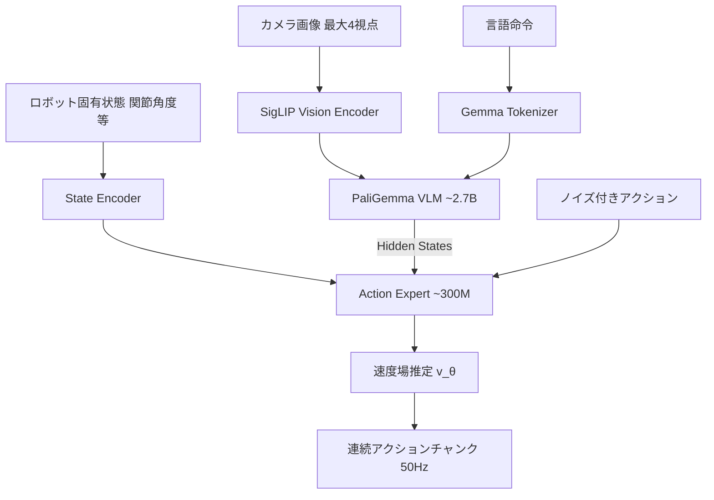

## 論文概要（Abstract）

本記事は [arXiv:2410.24164 π₀: A Vision-Language-Action Flow Model for General Robot Control](https://arxiv.org/abs/2410.24164) の解説記事です。

π0はPhysical Intelligence社が2024年10月に発表した汎用ロボット制御のための基盤モデルである。事前学習済みのVision-Language Model（VLM）であるPaliGemmaにFlow Matchingベースのアクションエキスパートを組み合わせ、約3Bパラメータの統合アーキテクチャを構成する。単腕・双腕・移動マニピュレータを含む複数のデクスタラスロボットプラットフォームのデータで訓練され、洗濯物折り、テーブル片付け、段ボール箱組み立てなど多様なタスクにおいてゼロショットでの実行能力を著者らは報告している。

この記事は [Zenn記事: π0.7徹底解説 ─ ロボット基盤モデルに構成的汎化が芽生えた](https://zenn.dev/0h_n0/articles/b8a023d5dfc83c) の深掘りです。

## 情報源

- **arXiv ID**: [2410.24164](https://arxiv.org/abs/2410.24164)
- **著者**: Kevin Black, Noah Brown, Danny Driess, Chelsea Finn, Karol Hausman, Sergey Levine, et al.（Physical Intelligence）
- **発表年**: 2024年10月（v1）、2026年1月（v4改訂）
- **分野**: cs.LG, cs.RO

## 背景と動機（Background & Motivation）

汎用ロボット制御の実現に向けて、LLMやVLMが言語・視覚タスクで見せたスケーリング則をロボティクスに適用する試みが活発化していた。しかし、2024年時点で主流だったアプローチにはそれぞれ課題があった。

**離散トークン方式**（RT-2など）は、ロボットの動作を離散化されたトークン列として自己回帰生成する。テキスト生成と同じパイプラインを流用できる利点があるが、量子化による精度損失が避けられず、高精度な器用操作（dexterous manipulation）に不向きであった。

**従来の拡散方式**（Diffusion Policyなど）は、連続的な行動軌道を生成できるが、VLMとの統合が技術的に困難であった。拡散モデルのデノイジングプロセスとVLMの自己回帰推論は本質的に異なる計算パラダイムであり、単純な結合では互いの利点を殺してしまう。

π0の動機は、VLMが持つインターネット規模の知識（物体認識、言語理解、常識推論）と、Flow Matchingが持つ連続行動空間での高品質な軌道生成能力を、アーキテクチャレベルで統合することにあった。

## 主要な貢献（Key Contributions）

- **VLM + Flow Matchingの統合アーキテクチャ**: VLMバックボーン（PaliGemma）にFlow Matchingベースのアクションエキスパートを接続する2コンポーネント設計を提案。VLMの推論能力と連続行動生成を両立した
- **クロスエンボディメント事前学習**: 単腕、双腕、移動マニピュレータを含む6種類以上の異なるロボットプラットフォームのデータを統合して事前学習。ロボット固有のアダプタなしで複数形態をサポートする
- **効率的なファインチューニングフレームワーク**: 事前学習済みモデルを数時間〜数十時間のタスク固有データでファインチューニングし、高い成功率を達成する手法を確立した

## 技術的詳細（Technical Details）

### 2コンポーネントアーキテクチャ

π0のアーキテクチャは、意図的にVLMとアクション生成を分離した設計になっている。



**PaliGemma VLMバックボーン（~2.7Bパラメータ）**は、GoogleのSigLIPビジョンエンコーダとGemma言語モデルを組み合わせたマルチモーダルモデルである。画像とテキストを統合的に処理し、高次の意味表現を生成する。ImageNet、WebLI等のインターネット規模データで事前学習されており、物体認識・空間推論・言語理解の能力を持つ。

**アクションエキスパート（~300Mパラメータ）**は、VLMの隠れ状態を受け取り、Flow Matchingの目的関数で連続的なアクション軌道を生成するモジュールである。VLMとは独立したTransformerブロックで構成され、cross-attentionでVLMの表現を参照する。

### Flow Matchingによるアクション生成

Flow Matchingは、ノイズサンプル $\mathbf{a}_1 \sim \mathcal{N}(0, I)$ を学習された速度場 $v_\theta$ に沿って変換し、有効なアクション $\mathbf{a}_0$ を生成する手法である。

訓練時の目的関数は以下の通りである：

$$
\mathcal{L}_{\text{FM}}(\theta) = \mathbb{E}_{t \sim U(0,1), \mathbf{a}_0, \epsilon} \left[ \left\| v_\theta(\mathbf{a}_t, t, \mathbf{c}) - (\mathbf{a}_0 - \epsilon) \right\|^2 \right]
$$

ここで、
- $\mathbf{a}_t = (1-t)\mathbf{a}_0 + t\epsilon$: 時刻 $t$ における補間されたアクション
- $\epsilon \sim \mathcal{N}(0, I)$: ガウスノイズ
- $\mathbf{c}$: コンテキスト（画像・言語・ロボット状態）
- $v_\theta$: 学習される速度場

推論時は、$\mathbf{a}_1 \sim \mathcal{N}(0, I)$ から開始し、常微分方程式（ODE）を数値積分することで $\mathbf{a}_0$ を復元する：

$$
\mathbf{a}_0 = \mathbf{a}_1 - \int_1^0 v_\theta(\mathbf{a}_t, t, \mathbf{c}) \, dt
$$

実装ではEulerソルバーを使用し、10〜20ステップのデノイジングで実用的な品質を達成している。

**拡散モデルとの違い**: 拡散モデル（DDPMなど）が確率微分方程式（SDE）を解くのに対し、Flow Matchingは決定論的なベクトル場への回帰問題に帰着する。著者らは、この簡潔さが訓練の安定性向上に寄与すると主張している。先行研究では、1ステップのFlow Matchingで16ステップの拡散方策と同等の性能が報告されている。

### アクションチャンキング

π0は50Hzの制御周波数でアクションを生成する。毎ステップで独立にFlow Matchingを実行するのではなく、**アクションチャンク**（複数タイムステップ分のアクションをまとめて生成）を採用している。

具体的には、1回の推論で将来の $H$ ステップ分のアクション列 $[\mathbf{a}^{(1)}, \mathbf{a}^{(2)}, ..., \mathbf{a}^{(H)}]$ を一括生成する。典型的には $H = 50$（1秒分）を使用する。現在のチャンクを実行しながら次のチャンクを並行して計算し、チャンク間の遷移ではアルゴリズム的なスムージングを適用することで、連続的で滑らかな動作を実現している。

### 訓練レシピ

訓練は3段階で構成される。

**ステージ1: VLM事前学習**（PaliGemmaの重みをそのまま使用）。インターネット規模のマルチモーダルデータで訓練された知識をロボット制御に転移する。

**ステージ2: クロスエンボディメント事前学習**。6種類以上のロボットプラットフォームから収集されたデモンストレーションデータを使用し、VLMバックボーンとアクションエキスパートを共同で訓練する。異なるロボットのアクション空間は、ロボット固有のトークン化によって統一的に扱う。

**ステージ3: タスク特化ファインチューニング**。特定のタスク・ロボット向けにLoRA等で効率的に微調整する。著者らによると、数時間〜数十時間のデモンストレーションデータで高い成功率を達成できると報告されている。

## 実装のポイント（Implementation）

### ロボット固有状態の処理

各ロボットプラットフォームは異なる自由度（DOF）を持つ。π0はロボット固有のエンコーダを用いて、関節角度・グリッパー状態・ベース速度等を統一的な表現にマッピングする。新しいロボットを追加する際は、このエンコーダの定義とキャリブレーションが必要になる。

### マルチカメラ入力の処理

最大4台のカメラ（前方、左手首、右手首、オプションの後方）からの画像を入力として処理する。各カメラ画像は独立にSigLIPエンコーダで特徴量に変換され、VLMへの入力トークンとして結合される。カメラの構成はロボットごとに異なるため、欠損するビューはマスクトークンで補完する。

### 推論レイテンシの考慮

Flow Matchingの10〜20ステップのデノイジングは、約50〜200msの推論時間を要する。50Hzの制御ループ（20ms/ステップ）を維持するために、アクションチャンキングが不可欠である。推論サーバはGPU搭載のデータセンターに配置し、ロボットとはネットワーク経由で通信する設計が採用されている。

```python
import torch
from typing import Optional

class Pi0ActionExpert(torch.nn.Module):
    """π0 Action Expert: Flow Matching head for continuous action generation."""

    def __init__(self, vlm_dim: int = 2048, action_dim: int = 7, chunk_size: int = 50):
        super().__init__()
        self.chunk_size = chunk_size
        self.action_dim = action_dim
        self.cross_attn = torch.nn.MultiheadAttention(vlm_dim, num_heads=16, batch_first=True)
        self.velocity_net = torch.nn.Sequential(
            torch.nn.Linear(vlm_dim + action_dim * chunk_size + 1, 1024),
            torch.nn.SiLU(),
            torch.nn.Linear(1024, 1024),
            torch.nn.SiLU(),
            torch.nn.Linear(1024, action_dim * chunk_size),
        )

    def forward(
        self, noisy_action: torch.Tensor, t: torch.Tensor, vlm_features: torch.Tensor
    ) -> torch.Tensor:
        """Estimate velocity field for Flow Matching.

        Args:
            noisy_action: (B, chunk_size * action_dim) noised action chunk
            t: (B, 1) diffusion timestep in [0, 1]
            vlm_features: (B, S, D) VLM hidden states

        Returns:
            velocity: (B, chunk_size * action_dim) estimated velocity
        """
        context = self.cross_attn(
            noisy_action.unsqueeze(1).expand(-1, vlm_features.size(1), -1),
            vlm_features,
            vlm_features,
        )[0].mean(dim=1)
        x = torch.cat([context, noisy_action, t], dim=-1)
        return self.velocity_net(x)

    @torch.no_grad()
    def sample(
        self, vlm_features: torch.Tensor, num_steps: int = 10, device: Optional[str] = None
    ) -> torch.Tensor:
        """Generate action chunk via Euler ODE solver.

        Args:
            vlm_features: (B, S, D) VLM hidden states
            num_steps: number of Euler integration steps
            device: target device

        Returns:
            actions: (B, chunk_size, action_dim)
        """
        B = vlm_features.size(0)
        a_t = torch.randn(B, self.chunk_size * self.action_dim, device=device)
        dt = 1.0 / num_steps

        for i in range(num_steps, 0, -1):
            t = torch.full((B, 1), i / num_steps, device=device)
            v = self.forward(a_t, t, vlm_features)
            a_t = a_t - v * dt

        return a_t.view(B, self.chunk_size, self.action_dim)
```

## Production Deployment Guide

### AWS実装パターン（コスト最適化重視）

π0のようなVLAモデルの推論サーバをAWS上に構築する場合、トラフィック量（接続ロボット台数）に応じて以下の構成が考えられる。

| 規模 | 接続ロボット数 | 推奨構成 | 月額コスト | 主要サービス |
|------|--------------|---------|-----------|------------|
| **Small** | 1-3台 | 単一GPU | $800-1,500 | EC2 g5.xlarge + S3 |
| **Medium** | 5-20台 | GPU Auto Scaling | $3,000-8,000 | ECS Fargate(GPU) + ElastiCache |
| **Large** | 50台以上 | GPU Cluster | $15,000-40,000 | EKS + Karpenter + Spot GPU |

**Small構成の詳細**（月額$800-1,500）:
- **EC2 g5.xlarge**: NVIDIA A10G GPU 1基、4 vCPU、16GB RAM（$650/月 On-Demand、Spot利用で$250/月）
- **S3**: モデルチェックポイント保存（$5/月）
- **CloudWatch**: 推論レイテンシ・GPU利用率監視（$10/月）
- **Route 53 + ALB**: ロボット接続用エンドポイント（$30/月）

**Medium構成の詳細**（月額$3,000-8,000）:
- **ECS Fargate (GPU)**: g5.xlarge相当 × 2-5タスク（$2,500/月）
- **ElastiCache Redis**: アクションチャンクキャッシュ、cache.r6g.large（$200/月）
- **Application Load Balancer**: WebSocket対応（$50/月）
- **CloudWatch + X-Ray**: 詳細監視（$50/月）

**コスト試算の注意事項**:
- 上記は2026年4月時点のAWS ap-northeast-1（東京）リージョン料金に基づく概算値です
- GPU Spot Instancesは可用性により価格が変動します（最大70%削減）
- 実際のコストはロボット接続数、推論頻度、モデルサイズにより変動します
- 最新料金は [AWS料金計算ツール](https://calculator.aws/) で確認してください

### Terraformインフラコード

**Small構成: 単一GPU推論サーバ**

```hcl
module "vpc" {
  source  = "terraform-aws-modules/vpc/aws"
  version = "~> 5.0"

  name = "vla-inference-vpc"
  cidr = "10.0.0.0/16"
  azs  = ["ap-northeast-1a", "ap-northeast-1c"]
  private_subnets = ["10.0.1.0/24", "10.0.2.0/24"]
  public_subnets  = ["10.0.101.0/24", "10.0.102.0/24"]

  enable_nat_gateway   = true
  single_nat_gateway   = true
  enable_dns_hostnames = true
}

resource "aws_iam_role" "vla_inference" {
  name = "vla-inference-role"
  assume_role_policy = jsonencode({
    Version = "2012-10-17"
    Statement = [{
      Action    = "sts:AssumeRole"
      Effect    = "Allow"
      Principal = { Service = "ec2.amazonaws.com" }
    }]
  })
}

resource "aws_iam_role_policy" "s3_model_access" {
  role = aws_iam_role.vla_inference.id
  policy = jsonencode({
    Version = "2012-10-17"
    Statement = [{
      Effect   = "Allow"
      Action   = ["s3:GetObject", "s3:ListBucket"]
      Resource = ["arn:aws:s3:::vla-model-checkpoints/*"]
    }]
  })
}

resource "aws_instance" "vla_gpu" {
  ami           = "ami-0abcdef1234567890"  # Deep Learning AMI (Ubuntu)
  instance_type = "g5.xlarge"              # NVIDIA A10G
  subnet_id     = module.vpc.private_subnets[0]

  iam_instance_profile = aws_iam_instance_profile.vla_inference.name

  root_block_device {
    volume_size = 200
    volume_type = "gp3"
    encrypted   = true
  }

  tags = { Name = "vla-inference-server", Project = "pi0" }
}

resource "aws_cloudwatch_metric_alarm" "gpu_utilization" {
  alarm_name          = "vla-gpu-utilization-low"
  comparison_operator = "LessThanThreshold"
  evaluation_periods  = 3
  metric_name         = "GPUUtilization"
  namespace           = "Custom/VLA"
  period              = 300
  statistic           = "Average"
  threshold           = 10
  alarm_description   = "GPU利用率低下（コスト浪費の可能性）"
}
```

**Large構成: EKS + Karpenter + Spot GPU**

```hcl
module "eks" {
  source  = "terraform-aws-modules/eks/aws"
  version = "~> 20.0"

  cluster_name    = "vla-inference-cluster"
  cluster_version = "1.31"
  vpc_id          = module.vpc.vpc_id
  subnet_ids      = module.vpc.private_subnets

  cluster_endpoint_public_access = true
  enable_cluster_creator_admin_permissions = true
}

resource "kubectl_manifest" "karpenter_gpu_provisioner" {
  yaml_body = <<-YAML
    apiVersion: karpenter.sh/v1
    kind: NodePool
    metadata:
      name: gpu-spot-pool
    spec:
      template:
        spec:
          requirements:
            - key: karpenter.sh/capacity-type
              operator: In
              values: ["spot"]
            - key: node.kubernetes.io/instance-type
              operator: In
              values: ["g5.xlarge", "g5.2xlarge"]
            - key: nvidia.com/gpu
              operator: Exists
          nodeClassRef:
            group: karpenter.k8s.aws
            kind: EC2NodeClass
            name: default
      limits:
        cpu: "64"
        memory: "256Gi"
        nvidia.com/gpu: "8"
      disruption:
        consolidationPolicy: WhenEmptyOrUnderutilized
        consolidateAfter: 60s
  YAML
}

resource "aws_budgets_budget" "vla_monthly" {
  name         = "vla-inference-monthly"
  budget_type  = "COST"
  limit_amount = "40000"
  limit_unit   = "USD"
  time_unit    = "MONTHLY"

  notification {
    comparison_operator       = "GREATER_THAN"
    threshold                 = 80
    threshold_type            = "PERCENTAGE"
    notification_type         = "ACTUAL"
    subscriber_email_addresses = ["ops@example.com"]
  }
}
```

### 運用・監視設定

```python
import boto3
import json

cloudwatch = boto3.client('cloudwatch')

cloudwatch.put_metric_alarm(
    AlarmName='vla-inference-latency-p99',
    ComparisonOperator='GreaterThanThreshold',
    EvaluationPeriods=2,
    MetricName='InferenceLatencyMs',
    Namespace='Custom/VLA',
    Period=300,
    ExtendedStatistic='p99',
    Threshold=200,  # 200ms超過でアラート（アクションチャンク生成遅延）
    AlarmDescription='VLA推論レイテンシP99異常',
    AlarmActions=['arn:aws:sns:ap-northeast-1:123456789:vla-alerts'],
)

cloudwatch.put_metric_alarm(
    AlarmName='vla-gpu-memory-usage',
    ComparisonOperator='GreaterThanThreshold',
    EvaluationPeriods=1,
    MetricName='GPUMemoryUsedPercent',
    Namespace='Custom/VLA',
    Period=60,
    Statistic='Maximum',
    Threshold=90,
    AlarmDescription='GPU VRAM使用率90%超過（OOM予兆）',
)
```

### コスト最適化チェックリスト

- [ ] ~3台: 単一EC2 g5.xlarge (Spot) — $250-800/月
- [ ] ~20台: ECS GPU Tasks + Auto Scaling — $3,000-8,000/月
- [ ] 50台+: EKS + Karpenter Spot GPU — $15,000-40,000/月
- [ ] Spot Instances優先（最大70%削減、GPU可用性に注意）
- [ ] Reserved Instances: 1年コミットで最大40%削減
- [ ] Savings Plans: Compute Savings Plans検討
- [ ] モデル量子化: FP16/INT8でVRAM削減・推論高速化
- [ ] アクションチャンクキャッシュ: 同一コンテキストの再計算回避
- [ ] アイドルタイムのスケールダウン: 夜間・休日のGPU停止
- [ ] CloudWatch: GPU利用率・推論レイテンシ監視
- [ ] AWS Budgets: 月額予算設定（80%で警告）
- [ ] Cost Anomaly Detection: 異常検知有効化
- [ ] タグ戦略: ロボットID別・タスク別でコスト可視化
- [ ] S3ライフサイクル: 古いチェックポイント自動削除（90日）

## 実験結果（Results）

著者らは複数のタスクカテゴリで評価を実施したと報告している。

**デクスタラス操作タスク**:
- 洗濯物折り: 複数種類の衣類を認識し、折りたたむ長期的タスク
- エスプレッソマシン操作: カップ配置→ボタン操作の多段階タスク
- テーブル片付け: 散乱した物体を適切な場所に分類・配置

**クロスエンボディメント性能**:
著者らによると、π0は事前学習に含まれない新しいタスクに対して、少量のファインチューニングデータ（数十〜数百エピソード）で高い成功率を達成したとされる。特に、事前学習済みモデルからのファインチューニングは、スクラッチからの訓練と比較して収束速度と最終性能の両方で優位であったと報告されている。

**ゼロショット性能の制約**:
ゼロショット（ファインチューニングなし）での性能は、タスクの複雑さに大きく依存する。単純な物体把持は高い成功率を示す一方、多段階の操作タスクでは追加の微調整が必要であったと著者らは述べている。この制約が、後続のπ*0.6（RECAP RL）およびπ0.7（構成的汎化）の研究動機となった。

## 実運用への応用（Practical Applications）

π0のアーキテクチャは、物流倉庫でのピック＆プレース、製造ラインでの組立支援、家庭内でのサービスロボットなど、多様な応用が想定される。

**実運用上の考慮点**:
- **推論コスト**: GPU推論サーバが必須。ロボット1台あたり月額$250-800のインフラコストが発生する
- **ネットワーク依存**: データセンター推論のため、安定したネットワーク接続が不可欠。ネットワーク断時のフォールバック機構が必要
- **安全性**: 物理環境での動作のため、異常検知と緊急停止メカニズムの実装が必須。π0自体には安全性保証の機構は含まれていない
- **データ収集**: 新しいタスクへの適用にはテレオペレーションによるデモンストレーション収集が必要で、これが主要なボトルネックとなる

## 関連研究（Related Work）

- **RT-2**（Brohan et al., 2023）: 55Bパラメータの大規模VLAで離散トークン方式を採用。Web知識のロボット制御への転移を実証したが、動作の滑らかさに課題があった。π0はFlow Matchingでこの課題を解決する
- **Diffusion Policy**（Chi et al., 2023）: 拡散過程によるロボット行動生成の先駆的研究。π0のアクションエキスパートはこの手法をFlow Matchingに発展させたものと位置づけられる
- **Octo**（Ghosh et al., 2024）: Open X-Embodimentデータセットで訓練されたオープンソース汎用ロボットポリシー。93Mパラメータと軽量だが、拡散ベースのアクション生成を採用

## まとめと今後の展望

π0はVLMとFlow Matchingの統合により、複数のロボットプラットフォームに対応する汎用制御基盤モデルの可能性を示した。後続研究では、π*0.6がRL微調整によるタスク特化スペシャリストの構築に成功し、π0.7が単一の汎用モデルでスペシャリスト同等の構成的汎化能力を獲得するに至っている。

課題として、データ収集コストの高さ、エッジ推論の未実現、安全性保証の欠如が挙げられる。VLAモデルの実用化に向けては、これらの課題への取り組みが今後の研究方向となる。

## 参考文献

- **arXiv**: [https://arxiv.org/abs/2410.24164](https://arxiv.org/abs/2410.24164)
- **Physical Intelligence Blog**: [https://www.pi.website/blog/pi0](https://www.pi.website/blog/pi0)
- **Related Zenn article**: [https://zenn.dev/0h_n0/articles/b8a023d5dfc83c](https://zenn.dev/0h_n0/articles/b8a023d5dfc83c)
