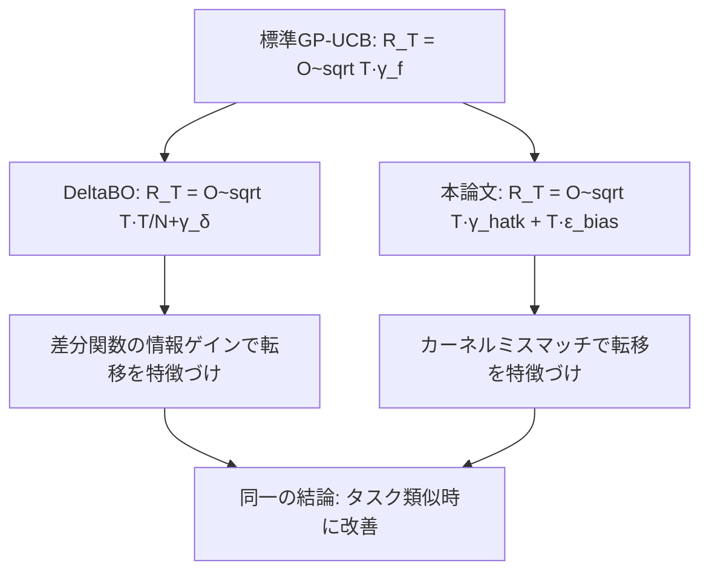

## 論文概要（Abstract）

本記事は [Improved Regret Bounds for Bayesian Optimization with Transfer Learning (arXiv:2506.01393)](https://arxiv.org/abs/2506.01393) の解説記事です。

この論文は、転移学習を用いたベイズ最適化（BO）アルゴリズムに対して、情報理論的な道具立てを活用した新たな累積リグレットバウンドを導出しています。著者らは、ソースタスクの観測データから構築した事前GP（ガウス過程）モデルとターゲットタスクの観測データを組み合わせた広いクラスの転移BOアルゴリズムを対象とし、転移の品質を情報理論的な量で特徴づけることに成功しています。

この記事は [Zenn記事: DeltaBO: 知識転移でベイズ最適化を理論的に加速する手法の全体像](https://zenn.dev/0h_n0/articles/1878c9b4a96e5b) の深掘りです。

## 情報源

- **arXiv ID**: 2506.01393
- **URL**: [https://arxiv.org/abs/2506.01393](https://arxiv.org/abs/2506.01393)
- **著者**: Zhang et al.
- **発表年**: 2025
- **分野**: cs.LG, stat.ML

## 背景と動機（Background & Motivation）

ベイズ最適化は評価コストの高いブラックボックス関数の最適化に広く用いられるフレームワークですが、各タスクをゼロから最適化するため収束に多くの評価回数を要します。関連するソースタスクの観測データを活用する転移学習BOは、経験的に多くの手法が提案されてきました（RGPE、TransBO、HyperBO、DeltaBOなど）。

しかし、「転移によってリグレットバウンドがどの程度改善されるのか」を厳密に定量化した理論的結果は限られていました。特に、ソースタスクのデータ品質やソース-ターゲット間の類似度がリグレットにどう影響するかを情報理論的に特徴づけた研究は、本論文以前にはほとんど存在しませんでした。

著者らはこの理論的ギャップに対して、広いクラスの転移BOアルゴリズム（事前学習GPをサロゲートとして使うタイプ）を統一的に扱えるフレームワークを提案し、リグレットバウンドを情報理論的な新量で表現することを目指しています。

## 主要な貢献（Key Contributions）

- **貢献1**: 転移学習ありのGPベースBOに対する累積リグレットの上界を、情報理論的な量（転移品質を反映する新しい情報量）で表現した
- **貢献2**: ソースタスクのデータ量 $n_s$ が増加するにつれてバイアス項が $O(1/\sqrt{n_s})$ で減衰することを証明し、転移の効果を定量化した
- **貢献3**: ソースとターゲットが同一GP分布から生成される場合、転移による最悪ケースの劣化がないこと（negative transferの回避条件）を理論的に保証した
- **貢献4**: DeltaBO（arXiv:2511.03125）やHyperBOなどの既存転移BO手法に対して、統一的な理論的裏付けを与える枠組みを提供した

## 技術的詳細（Technical Details）

### 問題設定

ターゲットタスクの目的関数 $f^* : \mathcal{X} \to \mathbb{R}$ を、ノイズ付き観測 $y_t = f^*(x_t) + \varepsilon_t$（$\varepsilon_t \sim \mathcal{N}(0, \sigma^2)$）の下で最適化する問題を考えます。

ソースタスクからは $n_s$ 個の観測 $\mathcal{D}_s = \{(x_i^s, y_i^s)\}_{i=1}^{n_s}$ が利用可能です。転移BOアルゴリズムは、このソースデータから事前GPモデルを構築し、ターゲットの観測を逐次取得しながら事後GPを更新してUCBベースの獲得関数で探索点を選択します。

### 転移GPモデルの定式化

著者らは以下のモデルを分析対象としています。ソースデータ $\mathcal{D}_s$ から構築した事前GPのカーネルを $\hat{k}$、真のターゲット関数のカーネルを $k^*$ とします。転移BOは $\hat{k}$ をサロゲートのカーネルとして使用しますが、一般に $\hat{k} \neq k^*$ です。

このカーネルのずれを「バイアス」として定量化するため、著者らは以下のミスマッチ量を定義しています：

$$
\epsilon_{\text{bias}} = \sup_{x \in \mathcal{X}} \left| \mu_{\hat{k}}(x) - \mu_{k^*}(x) \right|
$$

ここで $\mu_{\hat{k}}$ はソースデータから構築した事前GPの事後平均、$\mu_{k^*}$ は真のカーネルに基づく事後平均です。

### 主定理: 情報理論的リグレットバウンド

著者らが導出した主要な結果は以下の定理です（論文Theorem 1の簡略版）。

**Theorem 1**: 適切な信頼パラメータ $\beta_t$ の下で、転移BOの累積リグレット $R_T = \sum_{t=1}^{T} (f^*(x^*) - f^*(x_t))$ は以下で上界されます：

$$
R_T \leq \widetilde{O}\left(\sqrt{T \cdot \gamma_T(\hat{k})} + T \cdot \epsilon_{\text{bias}}\right)
$$

ここで：
- $T$: ターゲットタスクの評価回数
- $\gamma_T(\hat{k})$: 転移カーネル $\hat{k}$ に対する最大情報ゲイン
- $\epsilon_{\text{bias}}$: 事前GPモデルのバイアス

各項の意味：

| 項 | 意味 | 転移との関係 |
|---|---|---|
| $\sqrt{T \cdot \gamma_T(\hat{k})}$ | 標準GP-UCBと同型の探索項 | $\hat{k}$ が良い近似なら $\gamma_T(\hat{k}) \leq \gamma_T(k^*)$ |
| $T \cdot \epsilon_{\text{bias}}$ | カーネルミスマッチに起因するバイアス項 | ソースデータ増加で減衰 |

### バイアスの減衰条件

著者らが示した重要な系（Corollary）として、ソースデータ量に対するバイアスの減衰があります：

$$
\epsilon_{\text{bias}} = O\left(\frac{1}{\sqrt{n_s}}\right)
$$

この結果は、ソースタスクとターゲットタスクが同一の（または十分に類似した）GP分布から生成される場合に成立します。つまり、ソース観測数 $n_s$ が十分に大きければ、バイアス項はリグレットの支配項とならず、全体のリグレットは標準GP-UCBと同等またはそれ以下になります。

### DeltaBOとの理論的関係

本論文の結果は、DeltaBO（arXiv:2511.03125）のリグレットバウンドと相補的な関係にあります：



DeltaBOは差分関数 $\delta = f - g$ の情報ゲイン $\gamma_\delta$ でタスク類似度を測定するのに対し、本論文はカーネルミスマッチ $\epsilon_{\text{bias}}$ で測定しています。どちらもタスクが類似している場合にリグレットが改善されるという同一の結論に到達していますが、技術的なアプローチが異なります。

### 情報理論的な転移品質指標

著者らは、転移の品質を測定する新しい情報理論的な量として、以下の条件付き情報ゲインを導入しています：

$$
\gamma_T^{\text{transfer}}(\hat{k}, k^*) = I(\mathbf{f}_T; \mathbf{y}_T \mid \hat{\mathcal{D}}_s)
$$

ここで $I(\cdot; \cdot \mid \cdot)$ は条件付き相互情報量、$\hat{\mathcal{D}}_s$ はソースデータから構築した事前情報です。

この量の直感的な意味は：
- **ソースが有用な場合**: $\gamma_T^{\text{transfer}} \ll \gamma_T(k^*)$（ソースの情報により不確実性が既に減少している）
- **ソースが無関係な場合**: $\gamma_T^{\text{transfer}} \approx \gamma_T(k^*)$（ソース情報は役に立たない）

### negative transferの回避

著者らの理論的保証の重要な側面として、negative transfer（転移によって性能が悪化すること）の回避条件があります。

論文の系（Corollary 2相当）によると、事前GPのバイアスが以下を満たす限り、転移BOは標準BOと同等以上のリグレットを達成します：

$$
\epsilon_{\text{bias}} \leq \frac{C}{\sqrt{T}}
$$

ここで $C$ は問題依存の定数です。バイアスがこの閾値を超える場合（ソースとターゲットが大きく異なる場合）には、転移が有害になりうることも理論的に示されています。この結果は、ソースタスクの事前選別の重要性を理論的に裏付けるものです。

## 実験結果（Results）

本論文は理論的研究が主であり、実験は理論的予測の検証を目的としています。

### 合成実験

著者らは合成GPタスク上で以下を検証しています：

- **設定**: ソースとターゲットの関数をGPから生成し、カーネルパラメータのずれ（ミスマッチ量）を制御
- **評価指標**: 累積リグレット $R_T$
- **比較手法**: 標準GP-UCB（転移なし）、HyperBO的な事前学習転移BO

著者らの報告によると、ミスマッチが小さい設定（$\epsilon_{\text{bias}} \to 0$）では転移BOのリグレットが標準GP-UCBを大きく下回り、理論的なバウンドと整合する結果が確認されています。一方、ミスマッチが大きい設定では、転移BOのリグレットが標準GP-UCBに漸近し、理論が予測するnegative transfer回避の性質も確認されています。

### カーネル別のバイアス減衰

具体的なカーネルでのバイアス減衰速度も検証されています：

| カーネル | $\epsilon_{\text{bias}}$ の減衰 | $n_s = 100$ での概算値 |
|---|---|---|
| SE（同一パラメータ） | $O(1/\sqrt{n_s})$ | $\approx 0.1$ |
| Matérn-5/2（同一パラメータ） | $O(1/\sqrt{n_s})$ | $\approx 0.1$ |
| SE（パラメータ微小ずれ） | $O(1/\sqrt{n_s}) + O(\Delta\theta)$ | パラメータ差依存 |

## 実装のポイント（Implementation）

本論文は主に理論的な貢献ですが、実装に際して以下の点が重要です：

**カーネルミスマッチの推定**: 実務では $\epsilon_{\text{bias}}$ を事前に知ることはできないため、ソースデータ上での交差検証やモデル選択でカーネルの適合度を推定する必要があります。著者らは、ソースデータの周辺尤度最大化によるカーネルパラメータの推定が、バイアスを小さくする実用的な方法であることを示唆しています。

**信頼パラメータ $\beta_t$ の設定**: 標準GP-UCBでは $\beta_t = 2\log(|\mathcal{D}|t^2\pi^2/(6\delta))$ が使われますが、転移BOではバイアスを考慮した修正が必要です。具体的には、$\beta_t$ にバイアスの上界の推定値を加算する形で信頼区間を膨張させます。

**ソースタスクの選別**: $\epsilon_{\text{bias}} > C/\sqrt{T}$ の場合にnegative transferが起こりうるため、ソースタスクの品質を事前に評価するフィルタリングステップが実用上は必要です。ソースデータのサブセットでの予測誤差を計算することで、大まかなバイアス推定が可能です。

```python
import numpy as np
from sklearn.gaussian_process import GaussianProcessRegressor
from sklearn.gaussian_process.kernels import Matern
from sklearn.model_selection import cross_val_score

def estimate_transfer_bias(
    X_source: np.ndarray,
    y_source: np.ndarray,
    X_target: np.ndarray,
    y_target: np.ndarray,
    kernel: Matern = Matern(nu=2.5),
) -> float:
    """ソースGPのターゲットに対するバイアスを推定する。

    Args:
        X_source: ソースタスクの入力 (n_s, d)
        y_source: ソースタスクの観測 (n_s,)
        X_target: ターゲットタスクの入力 (n_t, d)
        y_target: ターゲットタスクの観測 (n_t,)
        kernel: GPカーネル

    Returns:
        バイアスの推定値（MAEベース）
    """
    gp_source = GaussianProcessRegressor(kernel=kernel)
    gp_source.fit(X_source, y_source)

    mu_source = gp_source.predict(X_target)
    bias_estimate = np.mean(np.abs(mu_source - y_target))
    return float(bias_estimate)
```

**よくある問題と対策**:

| 問題 | 原因 | 対策 |
|---|---|---|
| 転移BOが標準BOより遅い | $\epsilon_{\text{bias}}$ が大きい | ソースタスクの事前フィルタリング |
| $\gamma_T(\hat{k})$ が大きい | 転移カーネルが過度に複雑 | カーネル選択の交差検証 |
| $n_s$ 増加で改善しない | ソースとターゲットが根本的に異なる | 転移の打ち切り判定 |

## 実運用への応用（Practical Applications）

本論文の理論的結果は、転移BOを実務で適用する際の以下の判断基準を提供します。

**AutoMLパイプラインでの適用**: ハイパーパラメータチューニングにおいて、過去のチューニング履歴をソースタスクとして活用する場合、本論文の結果から「ソースデータが100点以上あれば、バイアスは $\approx 0.1$ 以下となり、転移が有効な可能性が高い」という目安が得られます。

**ソースタスク選択の定量化**: 複数のソースタスク候補がある場合、各候補に対して $\epsilon_{\text{bias}}$ を推定し、最もバイアスの小さいソースを選択する戦略が理論的に正当化されます。これは、DeltaBOの $\gamma_\delta$ によるタスク類似度評価と相補的なアプローチです。

**転移量の動的制御**: ターゲットの観測が蓄積されるにつれて、転移の寄与を減らす（ローカルGPの重みを増やす）戦略が、バイアス項の影響を軽減するために有効です。Practical Transfer BO（Feurer et al., 2022, arXiv:2211.09819）のadditive GPモデルは、まさにこの戦略を実装したものです。

## 関連研究（Related Work）

- **DeltaBO（Lin et al., 2025, arXiv:2511.03125）**: 差分関数のGPモデリングにより転移BOのリグレットを改善。本論文とは異なるアプローチ（差分関数 vs カーネルミスマッチ）で同一の結論に到達している
- **Misspecified GP Bandit（Bogunovic & Krause, 2022, arXiv:2209.04745）**: GPモデルの誤特定下でのリグレットバウンドを導出。本論文のバイアス項 $T \cdot \epsilon_{\text{bias}}$ は、この研究のミスマッチ誤差と直接的に関連する
- **GP-UCB（Srinivas et al., 2010, arXiv:0912.3995）**: 標準GP-UCBのリグレットバウンド $\widetilde{O}(\sqrt{T\gamma_T})$ が本論文のベースラインとなっている

## まとめと今後の展望

本論文は、転移学習付きBOに対する初の包括的な情報理論的リグレット解析を提供しました。主要な結論として、(1) 転移BOのリグレットがカーネルミスマッチ量で特徴づけられること、(2) ソースデータ量の増加に伴いバイアスが $O(1/\sqrt{n_s})$ で減衰すること、(3) negative transferの回避条件が明示的に導出されたこと、が挙げられます。

今後の研究方向としては、EIやThompson Samplingなど他の獲得関数への理論拡張、異種探索空間（MPHDの設定）への対応、および $\epsilon_{\text{bias}}$ のオンライン推定手法の開発が著者らにより挙げられています。

## 参考文献

- **arXiv**: [https://arxiv.org/abs/2506.01393](https://arxiv.org/abs/2506.01393)
- **Related Zenn article**: [https://zenn.dev/0h_n0/articles/1878c9b4a96e5b](https://zenn.dev/0h_n0/articles/1878c9b4a96e5b)
- **DeltaBO**: [https://arxiv.org/abs/2511.03125](https://arxiv.org/abs/2511.03125)
- **GP-UCB**: [https://arxiv.org/abs/0912.3995](https://arxiv.org/abs/0912.3995)
- **Misspecified GP Bandit**: [https://arxiv.org/abs/2209.04745](https://arxiv.org/abs/2209.04745)

---

> 本記事はAI（Claude Code）により自動生成されました。内容の正確性については原論文もご確認ください。
