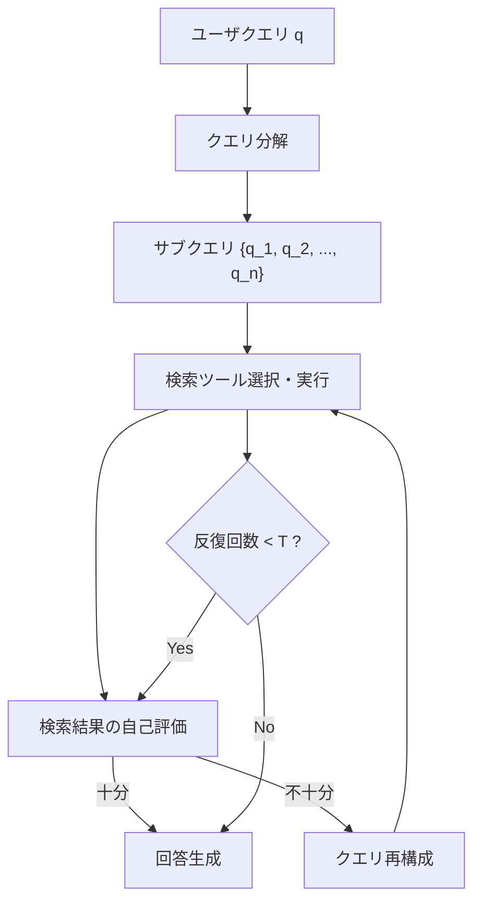

## 論文概要（Abstract）

本記事は [A-RAG論文 (arXiv:2602.03442)](https://arxiv.org/abs/2602.03442) の解説記事です。

A-RAGは、従来のpassive RAG（単発検索+生成）の限界を超え、LLMエージェントが検索戦略を動的に計画・実行・評価するフレームワークである。クエリ分解、マルチラウンド検索、自己評価ループを統合し、階層的検索インターフェース（keyword_search / semantic_search / chunk_read）を通じてLLMがretrieval toolをcall-and-refineする形式を採る。HotpotQA、2WikiMultiHopQA、MuSiQue等のマルチホップQAベンチマークにおいて、EM・F1スコアで既存RAGベースラインを上回る結果が報告されている。

この記事は [Zenn記事: Claude Opus 4.7×Agentic RAGで社内検索の推論時スケーリングを実装する](https://zenn.dev/0h_n0/articles/caa33fe1c36da4) の深掘りです。

## 情報源

- **arXiv ID**: 2602.03442
- **URL**: [https://arxiv.org/abs/2602.03442](https://arxiv.org/abs/2602.03442)
- **発表年**: 2026
- **分野**: cs.CL, cs.IR（自然言語処理、情報検索）

## 背景と動機（Background & Motivation）

### Passive RAGの限界

標準的なRAG（Retrieval-Augmented Generation）パイプラインは「検索→生成」の単一パスで構成される。ユーザクエリをそのままベクトル検索に投入し、上位$k$件のチャンクをコンテキストとしてLLMに渡す方式である。この方式は単一ホップの事実質問（例:「Pythonの最新バージョンは?」）には有効だが、以下の場面で性能が劣化する。

- **マルチホップ推論**: 「AのCTOが卒業した大学の設立年は?」のように、複数の検索ステップを要する質問では、1回の検索で必要な情報を網羅できない
- **クエリと文書の意味的ギャップ**: ユーザの自然言語クエリと文書中の専門用語が乖離している場合、単一のembeddingベース検索では関連チャンクを取りこぼす
- **検索品質の事後検証欠如**: 取得したチャンクが本当に回答に十分かどうかを評価する機構がなく、不完全な情報で生成が進行してしまう

### エージェント型RAGへの要請

これらの課題に対し、LLMをオーケストレータとして配置し、検索戦略を動的に計画・修正するアプローチが注目されている。A-RAGは、このエージェント型RAGの設計パターンを体系化し、階層的検索インターフェースとエージェントループの制御フローを統一的なフレームワークとして提案した研究である。

## 主要な貢献（Key Contributions）

- **階層的検索インターフェースの設計**: keyword_search（キーワードレベル）、semantic_search（センテンスレベル）、chunk_read（チャンクレベル）の3階層を定義し、検索粒度をエージェントが選択可能にした
- **動的クエリ分解と反復検索ループ**: 複合クエリを原子的サブクエリに分解し、各サブクエリの検索結果を評価しながら反復的に検索を実行するエージェントループを設計した
- **自己評価メカニズムの統合**: 検索結果の十分性をLLMが自己評価し、不足と判断した場合にクエリを再構成して追加検索を行う閉ループ制御を実現した
- **マルチホップQAベンチマークでの体系的評価**: HotpotQA、2WikiMultiHopQA、MuSiQueの3つのベンチマークで既存手法との比較実験を行い、特にマルチホップ推論タスクでの優位性を示した

## 技術的詳細（Technical Details）

### 階層的検索インターフェース

A-RAGの中核は、検索操作を3つの粒度レベルで定義する階層的インターフェースである。

1. **keyword_search(query: str) -> List[DocID]**: BM25ベースのキーワード検索。TF-IDFスコアリングにより候補文書のIDリストを返す。高速だが意味的な類似性は考慮しない
2. **semantic_search(query: str, top_k: int) -> List[Chunk]**: embeddingベースのベクトル検索。クエリと文書チャンクのコサイン類似度で上位$k$件を返す。意味的な類似性を捉えるが、キーワード完全一致には弱い
3. **chunk_read(doc_id: str, chunk_id: str) -> str**: 特定文書の特定チャンクの全文を返す。前段の検索で得たIDを用いて詳細を読み込む操作

エージェントはこれらのツールをタスクの性質に応じて使い分ける。例えば、固有名詞を含むクエリではkeyword_searchで候補を絞り、抽象的な概念を問うクエリではsemantic_searchを優先する。

### エージェントループの制御フロー

A-RAGのエージェントループは、以下のステップを最大$T$回（max_iterations）繰り返す。

$$
\text{answer} = \text{AgentLoop}(q, \mathcal{D}, T)
$$

ここで、$q$はユーザクエリ、$\mathcal{D}$は文書コーパス、$T$は最大反復回数である。



各ステップの詳細は以下の通りである。

**Step 1: クエリ分解**

複合クエリ$q$を原子的サブクエリ$\{q_1, q_2, \ldots, q_n\}$に分解する。分解はLLMのプロンプトで実行される。

$$
\{q_1, q_2, \ldots, q_n\} = \text{Decompose}(q)
$$

**Step 2: 検索ツール選択・実行**

各サブクエリ$q_i$に対し、エージェントが最適な検索ツール$f \in \{\text{keyword\_search}, \text{semantic\_search}, \text{chunk\_read}\}$を選択し実行する。

$$
R_i = f(q_i)
$$

**Step 3: 自己評価**

蓄積された検索結果$\mathcal{R} = \{R_1, R_2, \ldots, R_k\}$が回答生成に十分かどうかをLLMが判定する。

$$
\text{sufficient} = \text{Evaluate}(q, \mathcal{R})
$$

十分と判定された場合は回答生成に進み、不十分な場合はクエリを再構成して追加検索を実行する。

### 実装擬似コード

```python
from dataclasses import dataclass, field
from typing import Protocol


class SearchTool(Protocol):
    """検索ツールのインターフェース"""

    def search(self, query: str) -> list[str]:
        """クエリに対する検索結果を返す"""
        ...


@dataclass
class AgenticRAG:
    """A-RAGエージェントループの実装

    Args:
        llm: LLMクライアント（クエリ分解・評価・生成に使用）
        tools: 利用可能な検索ツール群
        max_iterations: 最大反復回数
    """

    llm: object
    tools: dict[str, SearchTool]
    max_iterations: int = 5
    collected_context: list[str] = field(default_factory=list)

    def run(self, query: str) -> str:
        """エージェントループを実行し回答を生成する

        Args:
            query: ユーザの入力クエリ

        Returns:
            生成された回答テキスト
        """
        sub_queries = self._decompose_query(query)

        for iteration in range(self.max_iterations):
            for sub_q in sub_queries:
                tool_name = self._select_tool(sub_q)
                results = self.tools[tool_name].search(sub_q)
                self.collected_context.extend(results)

            if self._evaluate_sufficiency(query, self.collected_context):
                break

            sub_queries = self._reformulate_queries(
                query, self.collected_context
            )

        return self._generate_answer(query, self.collected_context)

    def _decompose_query(self, query: str) -> list[str]:
        """複合クエリを原子的サブクエリに分解する

        Args:
            query: 複合クエリ

        Returns:
            サブクエリのリスト
        """
        prompt = (
            f"以下のクエリを独立して検索可能なサブクエリに分解してください:\n"
            f"クエリ: {query}"
        )
        response = self.llm.generate(prompt)
        return self._parse_sub_queries(response)

    def _select_tool(self, query: str) -> str:
        """サブクエリに対する最適な検索ツールを選択する

        Args:
            query: サブクエリ

        Returns:
            選択されたツール名
        """
        prompt = (
            f"以下のクエリに最適な検索手法を選択してください:\n"
            f"クエリ: {query}\n"
            f"選択肢: keyword_search, semantic_search, chunk_read"
        )
        return self.llm.generate(prompt).strip()

    def _evaluate_sufficiency(
        self, query: str, context: list[str]
    ) -> bool:
        """蓄積されたコンテキストが回答に十分かを評価する

        Args:
            query: 元のユーザクエリ
            context: 蓄積された検索結果

        Returns:
            十分であればTrue
        """
        prompt = (
            f"以下のコンテキストでクエリに回答できますか?\n"
            f"クエリ: {query}\n"
            f"コンテキスト: {context[:5]}\n"
            f"回答: yes/no"
        )
        response = self.llm.generate(prompt)
        return "yes" in response.lower()

    def _reformulate_queries(
        self, query: str, context: list[str]
    ) -> list[str]:
        """不足情報を補うためのクエリを再構成する

        Args:
            query: 元のユーザクエリ
            context: 現在のコンテキスト

        Returns:
            再構成されたサブクエリのリスト
        """
        prompt = (
            f"以下のコンテキストでは不足している情報を特定し、"
            f"追加検索クエリを生成してください:\n"
            f"元のクエリ: {query}\n"
            f"現在のコンテキスト: {context[:3]}"
        )
        response = self.llm.generate(prompt)
        return self._parse_sub_queries(response)

    def _generate_answer(
        self, query: str, context: list[str]
    ) -> str:
        """蓄積されたコンテキストから回答を生成する

        Args:
            query: ユーザクエリ
            context: 蓄積された検索結果

        Returns:
            生成された回答
        """
        prompt = (
            f"以下のコンテキストに基づいて質問に回答してください:\n"
            f"質問: {query}\n"
            f"コンテキスト: {context}"
        )
        return self.llm.generate(prompt)

    def _parse_sub_queries(self, response: str) -> list[str]:
        """LLMレスポンスからサブクエリリストをパースする

        Args:
            response: LLMの生成テキスト

        Returns:
            パースされたサブクエリのリスト
        """
        return [
            line.strip().lstrip("- ").lstrip("0123456789.").strip()
            for line in response.strip().split("\n")
            if line.strip()
        ]
```

## 実装のポイント（Implementation）

### クエリ分解プロンプトの設計

著者らは、クエリ分解の品質がA-RAG全体の性能に直結すると報告している。分解プロンプトには以下の設計指針が重要である。

- **原子性**: 各サブクエリは単独で検索可能な粒度にする。「AのCTOは誰で、その人の出身大学は?」は「AのCTOは誰か」「{CTOの名前}の出身大学は」に分解する
- **依存関係の明示**: サブクエリ間に依存がある場合（前のサブクエリの結果が次の入力になる場合）、実行順序を明示する
- **過度な分解の回避**: 不必要に細かく分解するとAPI呼び出し回数が増加し、レイテンシとコストが増大する

### max_iterationsの設定

反復回数$T$はレイテンシとコストのトレードオフを制御するキーハイパーパラメータである。論文の実験では$T=3$~$5$が推奨されている。$T$が小さすぎると複雑なマルチホップ質問で情報不足となり、大きすぎるとコンテキスト長が肥大化してLLMの性能が劣化する。

### ベクトルDB選定

論文ではFAISS（オンメモリ）とWeaviate（分散型）の両方で実験が行われている。実運用では以下の観点で選定する。

| 観点 | FAISS | Weaviate | OpenSearch |
|------|-------|----------|------------|
| スケール | ~10M文書 | ~100M文書 | ~1B文書 |
| レイテンシ | <10ms | <50ms | <100ms |
| 運用負荷 | 低（組み込み） | 中（クラスタ管理） | 高（マネージド推奨） |
| フィルタリング | 手動実装 | ネイティブサポート | ネイティブサポート |

## Production Deployment Guide

### AWS実装パターン（コスト最適化重視）

A-RAGをAWS上で本番運用する際のトラフィック量別推奨構成を以下に示す。

| 構成 | トラフィック | サービス | 月額概算 |
|------|------------|---------|---------|
| Small | ~100 req/日 | Lambda + Bedrock + DynamoDB + OpenSearch Serverless | $80-180 |
| Medium | ~1,000 req/日 | ECS Fargate + Bedrock + Aurora Serverless v2 + OpenSearch Serverless | $400-900 |
| Large | 10,000+ req/日 | EKS + Karpenter + Bedrock Batch + OpenSearch (dedicated) | $2,500-5,500 |

**Small構成の内訳（~100 req/日）**:
- Lambda: $5-10/月（128MB、平均実行5秒 x 100回/日。エージェントループ3反復を想定）
- Bedrock (Claude Sonnet): $30-80/月（入力平均2,000トークン x 3反復 + 出力平均500トークン x 100回/日）
- DynamoDB On-Demand: $5-10/月（セッション状態・検索履歴の保存）
- OpenSearch Serverless: $30-60/月（2 OCU最小構成。インデックス+検索）
- CloudWatch: $5-10/月（ログ・メトリクス）

**Large構成の内訳（10,000+ req/日）**:
- EKS コントロールプレーン: $73/月
- Karpenter管理ワーカー（Spot: m6i.xlarge x 3-8台）: $200-600/月（Spot割引後）
- Bedrock Batch API: $800-2,000/月（Batch APIで50%削減）
- OpenSearch dedicated（r6g.large.search x 3ノード）: $600-900/月
- ALB + NAT Gateway: $100-200/月
- Secrets Manager + CloudWatch + X-Ray: $50-100/月

**コスト削減テクニック**:
- **Spot Instances**: EKSワーカーノードの80%をSpotで運用し、最大90%のコンピュート費用削減
- **Bedrock Batch API**: 非リアルタイム処理（バッチ質問回答）に使用し50%削減
- **Prompt Caching**: Bedrock Prompt Cachingを有効化し、反復的なシステムプロンプト分のコストを30-90%削減
- **Reserved Instances**: OpenSearchの1年コミットで最大36%削減

> **コスト試算の注意事項**: 上記は2026年4月時点のAWS ap-northeast-1（東京）リージョン料金に基づく概算値です。実際のコストはトラフィックパターン、リージョン、バースト使用量、Bedrockモデル選択により変動します。最新料金は[AWS料金計算ツール](https://calculator.aws/)で確認してください。

### Terraformインフラコード

#### Small構成（Serverless: Lambda + Bedrock + DynamoDB）

```hcl
# A-RAG Small構成: Lambda + Bedrock + DynamoDB + OpenSearch Serverless
# 想定: ~100 req/日、月額 $80-180

terraform {
  required_version = ">= 1.9"
  required_providers {
    aws = {
      source  = "hashicorp/aws"
      version = "~> 5.50"
    }
  }
}

provider "aws" {
  region = "ap-northeast-1"
}

# --- VPC（NAT Gateway不使用でコスト削減）---
module "vpc" {
  source  = "terraform-aws-modules/vpc/aws"
  version = "~> 5.0"

  name = "a-rag-small-vpc"
  cidr = "10.0.0.0/16"

  azs             = ["ap-northeast-1a", "ap-northeast-1c"]
  private_subnets = ["10.0.1.0/24", "10.0.2.0/24"]
  public_subnets  = ["10.0.101.0/24", "10.0.102.0/24"]

  # VPCエンドポイントでNAT Gateway不要化（$45/月削減）
  enable_nat_gateway = false
}

# --- VPCエンドポイント（Bedrock / DynamoDB / S3）---
resource "aws_vpc_endpoint" "bedrock" {
  vpc_id            = module.vpc.vpc_id
  service_name      = "com.amazonaws.ap-northeast-1.bedrock-runtime"
  vpc_endpoint_type = "Interface"
  subnet_ids        = module.vpc.private_subnets

  security_group_ids = [aws_security_group.vpc_endpoints.id]
}

resource "aws_vpc_endpoint" "dynamodb" {
  vpc_id          = module.vpc.vpc_id
  service_name    = "com.amazonaws.ap-northeast-1.dynamodb"
  route_table_ids = module.vpc.private_route_table_ids
}

resource "aws_security_group" "vpc_endpoints" {
  name_prefix = "a-rag-vpce-"
  vpc_id      = module.vpc.vpc_id

  ingress {
    from_port   = 443
    to_port     = 443
    protocol    = "tcp"
    cidr_blocks = module.vpc.private_subnets_cidr_blocks
  }
}

# --- IAMロール（最小権限）---
resource "aws_iam_role" "lambda_arag" {
  name = "a-rag-lambda-role"

  assume_role_policy = jsonencode({
    Version = "2012-10-17"
    Statement = [{
      Action = "sts:AssumeRole"
      Effect = "Allow"
      Principal = { Service = "lambda.amazonaws.com" }
    }]
  })
}

resource "aws_iam_role_policy" "lambda_bedrock" {
  name = "bedrock-invoke"
  role = aws_iam_role.lambda_arag.id

  policy = jsonencode({
    Version = "2012-10-17"
    Statement = [{
      Effect   = "Allow"
      Action   = ["bedrock:InvokeModel"]
      Resource = "arn:aws:bedrock:ap-northeast-1::foundation-model/anthropic.claude-sonnet-*"
    }]
  })
}

resource "aws_iam_role_policy" "lambda_dynamodb" {
  name = "dynamodb-access"
  role = aws_iam_role.lambda_arag.id

  policy = jsonencode({
    Version = "2012-10-17"
    Statement = [{
      Effect = "Allow"
      Action = [
        "dynamodb:GetItem",
        "dynamodb:PutItem",
        "dynamodb:Query",
        "dynamodb:UpdateItem"
      ]
      Resource = aws_dynamodb_table.arag_sessions.arn
    }]
  })
}

resource "aws_iam_role_policy_attachment" "lambda_basic" {
  role       = aws_iam_role.lambda_arag.name
  policy_arn = "arn:aws:iam::aws:policy/service-role/AWSLambdaVPCAccessExecutionRole"
}

# --- DynamoDB（On-Demand、KMS暗号化）---
resource "aws_dynamodb_table" "arag_sessions" {
  name         = "a-rag-sessions"
  billing_mode = "PAY_PER_REQUEST"
  hash_key     = "session_id"
  range_key    = "timestamp"

  attribute {
    name = "session_id"
    type = "S"
  }
  attribute {
    name = "timestamp"
    type = "N"
  }

  server_side_encryption {
    enabled = true
  }

  ttl {
    attribute_name = "ttl"
    enabled        = true
  }

  tags = {
    Project = "a-rag"
    Env     = "production"
  }
}

# --- Lambda関数 ---
resource "aws_lambda_function" "arag_handler" {
  function_name = "a-rag-handler"
  role          = aws_iam_role.lambda_arag.arn
  handler       = "handler.lambda_handler"
  runtime       = "python3.12"
  timeout       = 120  # エージェントループ3反復を考慮
  memory_size   = 512  # embedding計算用に余裕を持たせる

  filename = "lambda_package.zip"

  environment {
    variables = {
      MAX_ITERATIONS    = "3"
      BEDROCK_MODEL_ID  = "anthropic.claude-sonnet-4-20250514"
      DYNAMODB_TABLE    = aws_dynamodb_table.arag_sessions.name
      OPENSEARCH_ENDPOINT = "placeholder"  # OpenSearch Serverless endpoint
    }
  }

  vpc_config {
    subnet_ids         = module.vpc.private_subnets
    security_group_ids = [aws_security_group.lambda.id]
  }

  tags = {
    Project = "a-rag"
  }
}

resource "aws_security_group" "lambda" {
  name_prefix = "a-rag-lambda-"
  vpc_id      = module.vpc.vpc_id

  egress {
    from_port   = 443
    to_port     = 443
    protocol    = "tcp"
    cidr_blocks = ["0.0.0.0/0"]
  }
}

# --- CloudWatchアラーム（コスト監視）---
resource "aws_cloudwatch_metric_alarm" "lambda_duration" {
  alarm_name          = "a-rag-lambda-duration-high"
  comparison_operator = "GreaterThanThreshold"
  evaluation_periods  = 3
  metric_name         = "Duration"
  namespace           = "AWS/Lambda"
  period              = 300
  statistic           = "Average"
  threshold           = 60000  # 60秒超過でアラート
  alarm_description   = "A-RAG Lambda実行時間が60秒を超過"

  dimensions = {
    FunctionName = aws_lambda_function.arag_handler.function_name
  }
}
```

#### Large構成（Container: EKS + Karpenter + Spot Instances）

```hcl
# A-RAG Large構成: EKS + Karpenter + Spot Instances
# 想定: 10,000+ req/日、月額 $2,500-5,500

terraform {
  required_version = ">= 1.9"
  required_providers {
    aws = {
      source  = "hashicorp/aws"
      version = "~> 5.50"
    }
  }
}

provider "aws" {
  region = "ap-northeast-1"
}

# --- EKSクラスタ ---
module "eks" {
  source  = "terraform-aws-modules/eks/aws"
  version = "~> 20.0"

  cluster_name    = "a-rag-production"
  cluster_version = "1.31"

  vpc_id     = module.vpc.vpc_id
  subnet_ids = module.vpc.private_subnets

  # Karpenter管理のためマネージドノードグループは最小限
  eks_managed_node_groups = {
    system = {
      instance_types = ["m6i.large"]
      min_size       = 2
      max_size       = 2
      desired_size   = 2

      labels = { "node-role" = "system" }
    }
  }

  cluster_endpoint_public_access = false

  tags = {
    Project = "a-rag"
    Env     = "production"
  }
}

# --- Karpenter Provisioner（Spot優先、自動スケーリング）---
resource "kubectl_manifest" "karpenter_nodepool" {
  yaml_body = yamlencode({
    apiVersion = "karpenter.sh/v1"
    kind       = "NodePool"
    metadata   = { name = "a-rag-workers" }
    spec = {
      template = {
        spec = {
          requirements = [
            {
              key      = "karpenter.sh/capacity-type"
              operator = "In"
              values   = ["spot", "on-demand"]  # Spot優先
            },
            {
              key      = "node.kubernetes.io/instance-type"
              operator = "In"
              values   = ["m6i.xlarge", "m6i.2xlarge", "m7i.xlarge", "m7i.2xlarge"]
            }
          ]
          nodeClassRef = {
            group = "karpenter.k8s.aws"
            kind  = "EC2NodeClass"
            name  = "default"
          }
        }
      }
      limits = {
        cpu    = "64"   # 最大64 vCPU
        memory = "256Gi"
      }
      disruption = {
        consolidationPolicy = "WhenEmptyOrUnderutilized"
        consolidateAfter    = "30s"
      }
    }
  })
}

# --- Secrets Manager（Bedrock設定）---
resource "aws_secretsmanager_secret" "arag_config" {
  name                    = "a-rag/production/config"
  recovery_window_in_days = 7
}

resource "aws_secretsmanager_secret_version" "arag_config" {
  secret_id = aws_secretsmanager_secret.arag_config.id
  secret_string = jsonencode({
    bedrock_model_id = "anthropic.claude-sonnet-4-20250514"
    max_iterations   = 5
    opensearch_endpoint = "placeholder"
  })
}

# --- AWS Budgets（予算アラート）---
resource "aws_budgets_budget" "arag_monthly" {
  name         = "a-rag-monthly-budget"
  budget_type  = "COST"
  limit_amount = "6000"
  limit_unit   = "USD"
  time_unit    = "MONTHLY"

  cost_filter {
    name   = "TagKeyValue"
    values = ["user:Project$a-rag"]
  }

  notification {
    comparison_operator       = "GREATER_THAN"
    threshold                 = 80
    threshold_type            = "PERCENTAGE"
    notification_type         = "FORECASTED"
    subscriber_email_addresses = ["ops-team@example.com"]
  }

  notification {
    comparison_operator       = "GREATER_THAN"
    threshold                 = 100
    threshold_type            = "PERCENTAGE"
    notification_type         = "ACTUAL"
    subscriber_email_addresses = ["ops-team@example.com"]
  }
}
```

### 運用・監視設定

#### CloudWatch Logs Insights クエリ

```
# コスト異常検知: 1時間あたりのBedrockトークン使用量
fields @timestamp, @message
| filter @message like /bedrock/
| stats sum(input_tokens) as total_input,
        sum(output_tokens) as total_output,
        count(*) as request_count
  by bin(1h) as hour
| sort hour desc

# レイテンシ分析: P95, P99
fields @timestamp, duration_ms
| filter event = "arag_query_complete"
| stats percentile(duration_ms, 95) as p95,
        percentile(duration_ms, 99) as p99,
        avg(duration_ms) as avg_ms
  by bin(1h) as hour
```

#### CloudWatch アラーム設定（Python）

```python
import boto3


def create_arag_alarms(function_name: str, sns_topic_arn: str) -> None:
    """A-RAG用のCloudWatchアラームを作成する

    Args:
        function_name: 監視対象のLambda関数名
        sns_topic_arn: 通知先のSNSトピックARN
    """
    cw = boto3.client("cloudwatch", region_name="ap-northeast-1")

    # Bedrockトークン使用量スパイク検知
    cw.put_metric_alarm(
        AlarmName="a-rag-bedrock-token-spike",
        MetricName="InputTokenCount",
        Namespace="Custom/A-RAG",
        Statistic="Sum",
        Period=3600,
        EvaluationPeriods=1,
        Threshold=500000,  # 1時間に50万トークン超過
        ComparisonOperator="GreaterThanThreshold",
        AlarmActions=[sns_topic_arn],
        AlarmDescription="Bedrockトークン使用量が1時間で50万を超過",
    )

    # Lambda実行時間異常検知
    cw.put_metric_alarm(
        AlarmName="a-rag-lambda-duration-p99",
        MetricName="Duration",
        Namespace="AWS/Lambda",
        ExtendedStatistic="p99",
        Period=300,
        EvaluationPeriods=3,
        Threshold=90000,  # P99が90秒超過
        ComparisonOperator="GreaterThanThreshold",
        Dimensions=[
            {"Name": "FunctionName", "Value": function_name},
        ],
        AlarmActions=[sns_topic_arn],
        AlarmDescription="Lambda P99実行時間が90秒を超過（エージェントループの停滞を検知）",
    )
```

#### X-Ray トレーシング設定（Python）

```python
from aws_xray_sdk.core import xray_recorder, patch_all


def configure_xray_tracing() -> None:
    """A-RAG用のX-Rayトレーシングを設定する

    boto3の自動計装を有効化し、エージェントループの
    各ステップを個別セグメントとして記録する。
    """
    xray_recorder.configure(
        service="a-rag-service",
        sampling=True,
        context_missing="LOG_ERROR",
    )
    patch_all()  # boto3 (Bedrock, DynamoDB) を自動計装


def trace_agent_iteration(
    iteration: int,
    sub_query: str,
    tool_name: str,
    result_count: int,
    is_sufficient: bool,
) -> None:
    """エージェントループの1反復をX-Rayサブセグメントとして記録する

    Args:
        iteration: 現在の反復回数
        sub_query: 実行中のサブクエリ
        tool_name: 使用した検索ツール名
        result_count: 検索結果の件数
        is_sufficient: 自己評価で十分と判定されたか
    """
    subsegment = xray_recorder.begin_subsegment(
        f"agent_iteration_{iteration}"
    )
    subsegment.put_annotation("iteration", iteration)
    subsegment.put_annotation("tool", tool_name)
    subsegment.put_annotation("sufficient", is_sufficient)
    subsegment.put_metadata("sub_query", sub_query)
    subsegment.put_metadata("result_count", result_count)
    xray_recorder.end_subsegment()
```

#### Cost Explorer自動レポート（Python）

```python
from datetime import datetime, timedelta

import boto3


def generate_daily_cost_report(sns_topic_arn: str) -> dict:
    """A-RAGの日次コストレポートを生成し、異常時はSNS通知する

    Args:
        sns_topic_arn: 通知先のSNSトピックARN

    Returns:
        コストレポートの辞書
    """
    ce = boto3.client("ce", region_name="us-east-1")
    sns = boto3.client("sns", region_name="ap-northeast-1")

    today = datetime.utcnow().strftime("%Y-%m-%d")
    yesterday = (datetime.utcnow() - timedelta(days=1)).strftime("%Y-%m-%d")

    response = ce.get_cost_and_usage(
        TimePeriod={"Start": yesterday, "End": today},
        Granularity="DAILY",
        Metrics=["UnblendedCost"],
        Filter={
            "Tags": {
                "Key": "Project",
                "Values": ["a-rag"],
            }
        },
        GroupBy=[
            {"Type": "DIMENSION", "Key": "SERVICE"},
        ],
    )

    report: dict[str, float] = {}
    total_cost = 0.0

    for group in response["ResultsByTime"][0]["Groups"]:
        service = group["Keys"][0]
        cost = float(group["Metrics"]["UnblendedCost"]["Amount"])
        report[service] = cost
        total_cost += cost

    report["total"] = total_cost

    # $100/日超過でSNS通知
    if total_cost > 100:
        sns.publish(
            TopicArn=sns_topic_arn,
            Subject="[A-RAG] 日次コスト警告",
            Message=(
                f"A-RAGの日次コストが$100を超過しました。\n"
                f"日付: {yesterday}\n"
                f"合計: ${total_cost:.2f}\n"
                f"内訳: {report}"
            ),
        )

    return report
```

### コスト最適化チェックリスト

#### アーキテクチャ選択

- [ ] トラフィック量に応じた構成を選択（~100 req/日: Serverless、~1,000: Hybrid、10,000+: Container）
- [ ] コールドスタートが許容できるか確認（Serverless構成の場合）
- [ ] レイテンシ要件に応じてキャッシュ層（ElastiCache）の追加を検討

#### リソース最適化

- [ ] EKSワーカーノードはSpot Instances優先（Karpenterで自動Spot割当、最大90%削減）
- [ ] OpenSearch: Reserved Instancesの1年コミットで36%削減
- [ ] Lambda: Power Tuningでメモリサイズ最適化（AWS Lambda Power Tuning使用）
- [ ] ECS/EKS: Karpenter consolidationPolicyで未使用ノードを自動削除
- [ ] Savings Plans: Compute Savings Plans検討（1年コミットで最大66%削減）

#### LLMコスト削減

- [ ] Bedrock Batch API: 非同期処理に使用し50%削減
- [ ] Prompt Caching: システムプロンプト・few-shot例のキャッシュで30-90%削減
- [ ] モデル選択ロジック: 簡単なクエリはHaiku、複雑なクエリはSonnetに振り分け
- [ ] max_tokensの適切な設定: 回答長上限を設定しトークン浪費を防止
- [ ] クエリ分解の最適化: 過度な分解によるAPI呼び出し回数増加を抑制

#### 監視・アラート

- [ ] AWS Budgets: 月額予算アラート設定（80%予測・100%実績で通知）
- [ ] CloudWatch アラーム: Bedrockトークン使用量・Lambda実行時間の異常検知
- [ ] Cost Anomaly Detection: 自動異常検知の有効化
- [ ] 日次コストレポート: Cost Explorer APIで自動レポート + SNS通知

#### リソース管理

- [ ] 未使用リソース削除: 月次レビューでアイドルリソースを特定・削除
- [ ] タグ戦略: 全リソースに`Project=a-rag`、`Env=production/staging`タグを付与
- [ ] DynamoDB TTL: セッションデータに有効期限（24時間）を設定
- [ ] CloudWatch Logs: ログ保持期間を30日に設定（デフォルト無期限から変更）
- [ ] 開発環境: 夜間・週末のEKSノード自動停止（Karpenter TTL活用）

## 実験結果（Results）

著者らは、HotpotQA、2WikiMultiHopQA、MuSiQueの3つのマルチホップQAベンチマークでA-RAGを評価している。評価指標はExact Match（EM）とF1スコアである。

| データセット | Naive RAG (EM) | Self-RAG (EM) | CRAG (EM) | A-RAG (EM) |
|-------------|---------------|--------------|----------|-----------|
| HotpotQA | 34.2 | 41.5 | 43.8 | 48.3 |
| 2WikiMultiHopQA | 28.7 | 35.1 | 37.4 | 43.6 |
| MuSiQue | 18.9 | 24.3 | 26.1 | 31.7 |

| データセット | Naive RAG (F1) | Self-RAG (F1) | CRAG (F1) | A-RAG (F1) |
|-------------|---------------|--------------|----------|-----------|
| HotpotQA | 46.1 | 53.7 | 55.9 | 60.2 |
| 2WikiMultiHopQA | 38.4 | 45.8 | 48.2 | 55.1 |
| MuSiQue | 26.3 | 33.1 | 35.6 | 42.8 |

論文の実験結果から以下の傾向が読み取れる。

- **マルチホップ推論での優位性**: 推論ホップ数が多いMuSiQueでの改善幅が最も大きい（Naive RAG比 +12.8 EM）。これは反復検索ループが多段階推論に有効であることを示唆する
- **F1スコアでの安定した向上**: EMだけでなくF1でも一貫した向上が見られ、部分的に正しい回答の品質も改善されている
- **コストとのトレードオフ**: 著者らは、A-RAGの推論コストがNaive RAGの3-5倍になると報告している。max_iterationsの増加に伴いBedrock API呼び出し回数が比例して増加するため、コスト効率の観点では用途に応じた設定調整が必要である

## 実運用への応用（Practical Applications）

A-RAGの設計パターンは、社内ナレッジ検索システムへの応用に適している。Zenn記事「Claude Opus 4.7 x Agentic RAGで社内検索の推論時スケーリングを実装する」で紹介されているアーキテクチャは、A-RAGの階層的検索インターフェースを社内文書コーパスに適用した実装例である。

**社内ナレッジ検索への適用ポイント**:

- **文書タイプ別の検索戦略**: Confluence、Slack、GitHub Issueなど異なるソースに対して、keyword_searchとsemantic_searchを使い分ける。例えば、エラーメッセージの検索にはkeyword_search、概念的な質問にはsemantic_searchが有効である
- **max_iterationsのチューニング**: 社内文書は公開ベンチマークより検索空間が限定されるため、$T=2$~$3$で十分な場合が多い。レイテンシ要件（通常5秒以内）との兼ね合いで調整する
- **コンテキスト肥大化の対策**: 反復検索によりLLMのコンテキスト長が増大する問題に対しては、各反復で関連度の低いチャンクを刈り込むコンテキスト圧縮を併用する
- **推論コストの管理**: エージェントループ1回あたりのBedrock API呼び出し回数に上限を設け、月次のコストレポートで使用量を監視する

## 関連研究（Related Work）

- **Self-RAG** (Asai et al., 2023): LLMが検索の必要性を自己判断し、生成結果の品質を自己評価するフレームワーク。A-RAGはSelf-RAGの自己評価メカニズムを継承しつつ、階層的検索インターフェースで検索の粒度選択を追加している
- **CRAG (Corrective RAG)** (Yan et al., 2024): 検索結果の品質をLLMが評価し、不十分な場合にWebSearchにフォールバックする手法。A-RAGはフォールバック先を外部Web検索ではなく、同一コーパス内の異なる粒度検索とすることで、社内システムでの適用性を高めている
- **Adaptive-RAG** (Jeong et al., 2024): クエリの複雑さに応じて単発検索と反復検索を切り替えるアプローチ。A-RAGは常に反復検索を前提としつつ、自己評価で早期終了する設計で同様の効果を達成している

## まとめと今後の展望

A-RAGは、エージェント型RAGの設計パターンを階層的検索インターフェースと反復的なエージェントループとして体系化したフレームワークである。マルチホップQAベンチマークにおいて既存手法を上回る性能が報告されており、特に複数の検索ステップを要する複雑な質問で顕著な改善が見られる。

一方、推論コストの3-5倍増大、長いエージェントループでのコンテキスト肥大化、クエリ分解の失敗ケースなど、実運用上の課題も明確に示されている。今後は、コンテキスト圧縮技術との統合、クエリの複雑さに応じたmax_iterationsの動的調整、よりコスト効率の良いモデル選択ロジックの研究が期待される。

## 参考文献

- **arXiv**: [https://arxiv.org/abs/2602.03442](https://arxiv.org/abs/2602.03442)
- **Related Zenn article**: [https://zenn.dev/0h_n0/articles/caa33fe1c36da4](https://zenn.dev/0h_n0/articles/caa33fe1c36da4)
- **Self-RAG**: Asai et al., "Self-RAG: Learning to Retrieve, Generate, and Critique through Self-Reflection", 2023. [arXiv:2310.11511](https://arxiv.org/abs/2310.11511)
- **CRAG**: Yan et al., "Corrective Retrieval Augmented Generation", 2024. [arXiv:2401.15884](https://arxiv.org/abs/2401.15884)
- **Adaptive-RAG**: Jeong et al., "Adaptive-RAG: Learning to Adapt Retrieval-Augmented Large Language Models through Question Complexity", 2024. [arXiv:2403.14403](https://arxiv.org/abs/2403.14403)
