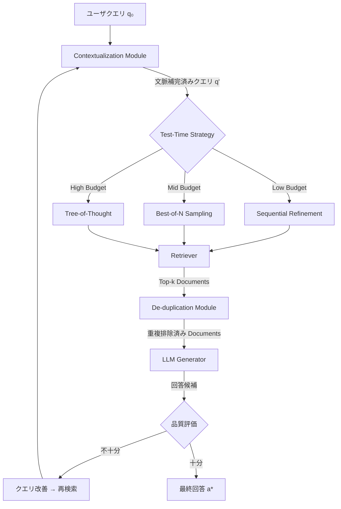

本記事は [Test-Time Strategies for More Efficient and Accurate Agentic RAG 論文 (arXiv:2603.12396)](https://arxiv.org/abs/2603.12396) の解説記事です。

## 論文概要（Abstract）

本論文は、Agentic RAG（Retrieval-Augmented Generation）システムにおけるtest-time compute（推論時計算）の最適な割り当て戦略を体系的に整理した研究である。著者らは、Best-of-N sampling、Sequential refinement、Tree-of-Thought探索の3つのパラダイムをRAG文脈で比較評価し、さらにContextualization（クエリの文脈補完）とDe-duplication（重複ドキュメント排除）の2つの補助モジュールを導入することで、検索精度の向上と検索ステップ数の削減を同時に達成したと報告している。

この記事は [Zenn記事: Claude Opus 4.7×Agentic RAGで社内検索の推論時スケーリングを実装する](https://zenn.dev/0h_n0/articles/caa33fe1c36da4) の深掘りです。

## 情報源

- **arXiv ID**: 2603.12396
- **URL**: [https://arxiv.org/abs/2603.12396](https://arxiv.org/abs/2603.12396)
- **発表年**: 2026
- **分野**: cs.CL, cs.IR

## 背景と動機（Background & Motivation）

RAGシステムは外部知識を検索し、LLMの回答精度を向上させる手法として広く普及している。しかし、単純なsingle-hop検索では複雑なマルチホップ質問への対応が困難であり、Agentic RAGと呼ばれるエージェント型の反復検索アーキテクチャが注目されている。

一方、LLMの推論時計算（test-time compute）を増やすことで出力品質を向上させるtest-time scalingが活発に研究されている。数学的推論やコード生成ではBest-of-Nサンプリングやchain-of-thought（CoT）の長大化が有効であると報告されているが、RAGタスクにおけるtest-time computeの最適配分は十分に研究されていない。

本論文の動機は、RAGシステムにおいて「どのtest-time戦略を、どの程度のcompute budgetで適用すべきか」という実用的な問いに回答することである。具体的には、compute budgetが限られた環境で最大の精度を引き出す戦略と、追加のcompute投入による精度向上が飽和するポイントを特定することを目的としている。従来のAgentic RAGは検索ステップ数に上限を設けるだけの単純な制御が多く、compute-awareな戦略選択のフレームワークが存在しなかった。

## 主要な貢献（Key Contributions）

- **貢献1**: RAGにおけるtest-time compute戦略を3パラダイム（Best-of-N、Sequential refinement、Tree-of-Thought）に体系化し、compute budget別の精度-効率トレードオフを定量的に比較
- **貢献2**: Contextualizationモジュールの導入。会話履歴を踏まえてクエリを自己完結した形に書き換え、代名詞を具体名詞に置換し省略された文脈を補完することで検索クエリの質を向上
- **貢献3**: De-duplicationモジュールの導入。複数回の検索で同一ドキュメントが繰り返し取得される問題をJaccard係数ベースの類似度判定で解決し、情報の多様性を確保
- **貢献4**: Search-R1パイプライン上でのQwen2.5-7b + HotpotQA実験により、EM scoreで+5.6%、LLM Matchで+6.7%の改善を達成しつつ、検索ステップ数を約10.5%削減

## 技術的詳細（Technical Details）

### 3つのTest-Time戦略

著者らは、RAGにおけるtest-time compute scalingを以下の3つのパラダイムに分類している。

**Best-of-N (BoN) sampling**: 同一のクエリに対して$N$回の独立した検索-生成パイプラインを並列に実行し、最も高スコアの回答を選択する。スコア関数 $s(a_i)$ を用いて最終回答を決定する。

$$
a^* = \arg\max_{a_i, \; i \in \{1, \ldots, N\}} s(a_i)
$$

ここで、
- $a_i$: $i$番目のパイプライン実行による回答
- $s(a_i)$: 回答のスコア（LLM自己評価、文書との整合性スコア等）
- $N$: 並列実行数（compute budgetに比例）

**Sequential refinement**: 検索結果に基づいてクエリを反復的に改善する。ステップ$t$でのクエリ$q_t$は、前ステップの検索結果$D_{t-1}$と初期クエリ$q_0$を用いて生成される。

$$
q_t = f_{\text{refine}}(q_0, D_1, D_2, \ldots, D_{t-1})
$$

$$
D_t = \text{Retrieve}(q_t, k)
$$

ここで、
- $q_t$: ステップ$t$での検索クエリ
- $D_t$: ステップ$t$で取得された上位$k$件のドキュメント集合
- $f_{\text{refine}}$: LLMベースのクエリ改善関数

**Tree-of-Thought (ToT) 探索**: 検索クエリをツリー構造で展開し、各ノードで複数の検索方向を探索する。幅$b$、深さ$d$のツリーにおける探索空間は$O(b^d)$となる。

$$
\text{TotalNodes} = \sum_{l=0}^{d} b^l = \frac{b^{d+1} - 1}{b - 1}
$$

著者らの報告によると、低compute budget（$N \leq 3$程度）ではSequential refinementが最も効率的であり、中程度のbudget（$3 < N \leq 8$）ではBoNが安定した精度向上を示し、高compute budget（$N > 8$）ではToTが最高精度を達成するが、収穫逓減が顕著になるとのことである。

### 全体アーキテクチャ



### Contextualizationモジュール

Contextualizationは、会話履歴や前ステップの検索結果を踏まえて、検索クエリを自己完結した形に書き換えるモジュールである。具体的には以下の2つの操作を行う。

1. **代名詞解決（Pronoun Resolution）**: 「それ」「この手法」などの代名詞を、会話履歴から特定された具体名詞に置換する
2. **文脈補完（Context Completion）**: 省略された前提条件や制約を補完し、検索エンジンが正確なドキュメントを返せるようにする

変換関数 $g_{\text{ctx}}$ は以下のように定式化される。

$$
q' = g_{\text{ctx}}(q_t, H_t)
$$

ここで、
- $q'$: 文脈補完済みクエリ
- $q_t$: 現在のクエリ
- $H_t = \{(q_0, D_0), (q_1, D_1), \ldots, (q_{t-1}, D_{t-1})\}$: 検索履歴

### De-duplicationモジュール

複数回の反復検索では、同一または極めて類似したドキュメントが繰り返し取得される問題が生じる。De-duplicationモジュールは、Jaccard係数ベースの類似度判定により重複を排除する。

ドキュメント $d_i$ と $d_j$ のJaccard類似度は以下で定義される。

$$
J(d_i, d_j) = \frac{|T(d_i) \cap T(d_j)|}{|T(d_i) \cup T(d_j)|}
$$

ここで、
- $T(d)$: ドキュメント $d$ から抽出されたトークン（またはn-gram）の集合
- $J(d_i, d_j) \geq \tau$ の場合、$d_j$ を重複として除外（閾値 $\tau$）

著者らは$\tau = 0.7$を推奨値としている。累積検索結果 $\mathcal{D}_{\text{all}} = \bigcup_{t} D_t$ に対して、各新規ドキュメントを既存の全ドキュメントと比較し、閾値を超えるものを除外する。これにより、各検索ステップで新たな情報が追加される確率が向上し、結果として必要な検索ステップ数が削減される。

## 実装のポイント（Implementation）

Contextualizationモジュールの実装では、LLMを用いたプロンプトベースの書き換えが中核となる。以下に、実装パターンの例を示す。

```python
from dataclasses import dataclass, field


@dataclass(frozen=True)
class SearchStep:
    """検索ステップの記録"""
    query: str
    documents: list[str]


@dataclass
class SearchHistory:
    """検索履歴を管理するコンテナ"""
    steps: list[SearchStep] = field(default_factory=list)

    def format_for_prompt(self) -> str:
        """プロンプト用に検索履歴をフォーマットする

        Returns:
            検索履歴の文字列表現
        """
        lines: list[str] = []
        for i, step in enumerate(self.steps):
            lines.append(f"Step {i+1}: Query='{step.query}'")
            for j, doc in enumerate(step.documents[:3]):
                lines.append(f"  Doc {j+1}: {doc[:200]}...")
        return "\n".join(lines)


def contextualize_query(
    current_query: str,
    history: SearchHistory,
    llm_client: object,
) -> str:
    """会話履歴を踏まえてクエリを自己完結した形に書き換える

    Args:
        current_query: 現在のクエリ（代名詞・省略を含む可能性あり）
        history: 過去の検索ステップの履歴
        llm_client: LLM APIクライアント

    Returns:
        文脈補完済みの自己完結クエリ
    """
    if not history.steps:
        return current_query

    prompt = (
        "以下の検索履歴を踏まえ、現在のクエリを自己完結した形に書き換えてください。\n"
        "- 代名詞（それ、この手法等）を具体名詞に置換\n"
        "- 省略された文脈を補完\n"
        "- 書き換え後のクエリのみ出力\n\n"
        f"検索履歴:\n{history.format_for_prompt()}\n\n"
        f"現在のクエリ: {current_query}\n\n"
        "書き換え後のクエリ:"
    )
    response = llm_client.generate(prompt)  # type: ignore[attr-defined]
    return response.strip()


def deduplicate_documents(
    new_docs: list[str],
    existing_docs: list[str],
    threshold: float = 0.7,
) -> list[str]:
    """Jaccard係数ベースで重複ドキュメントを除外する

    Args:
        new_docs: 新規取得ドキュメントのリスト
        existing_docs: 既存の累積ドキュメントリスト
        threshold: Jaccard類似度の閾値（デフォルト0.7）

    Returns:
        重複を除外したドキュメントのリスト
    """
    def _tokenize(text: str) -> set[str]:
        return set(text.lower().split())

    def _jaccard(a: set[str], b: set[str]) -> float:
        if not a or not b:
            return 0.0
        return len(a & b) / len(a | b)

    existing_tokens = [_tokenize(doc) for doc in existing_docs]
    filtered: list[str] = []

    for doc in new_docs:
        doc_tokens = _tokenize(doc)
        is_duplicate = any(
            _jaccard(doc_tokens, et) >= threshold
            for et in existing_tokens
        )
        if not is_duplicate:
            filtered.append(doc)
            existing_tokens.append(doc_tokens)

    return filtered
```

実装上の注意点として、Jaccard係数の計算はドキュメント数の2乗に比例するため、累積ドキュメント数が増大する場合はMinHash等の近似手法への切り替えが推奨される。また、Contextualizationの書き換え処理自体がLLM呼び出しを伴うため、この処理のレイテンシがtest-time computeの一部として考慮される必要がある。

## Production Deployment Guide

本論文で提案されているAgentic RAGパイプラインは、検索-生成の反復ループとLLMベースのクエリ書き換えを中核とするため、LLM推論コストと検索レイテンシのバランスが運用上の主要課題となる。以下では、AWS上でのデプロイパターンを構成規模別に示す。

### AWS実装パターン（コスト最適化重視）

| 構成 | 想定規模 | 主要サービス | 月額概算 |
|------|----------|-------------|---------|
| Small | ~100 req/日 | Lambda + Bedrock + OpenSearch Serverless | $50-150 |
| Medium | ~1,000 req/日 | ECS Fargate + Bedrock + OpenSearch | $300-800 |
| Large | 10,000+ req/日 | EKS + Karpenter + SageMaker Endpoint + OpenSearch | $2,000-5,000 |

上記は2026年4月時点のAWS ap-northeast-1（東京）リージョン料金に基づく概算値。実際のコストはトラフィックパターン、リージョン、バースト使用量、LLMモデル選択により変動する。最新料金はAWS料金計算ツールで確認を推奨。

**Small構成の内訳**:
- Lambda: $0.20/100万リクエスト + 実行時間課金（~$5/月）
- Bedrock Claude Sonnet: 入力$3/MTok, 出力$15/MTok（~$30-80/月、1リクエストあたり平均3回のLLM呼び出し想定）
- OpenSearch Serverless: 2 OCU最小構成（~$15-50/月）
- DynamoDB On-Demand: 検索履歴保存（~$1-5/月）

**コスト削減テクニック**:
- Bedrock Batch API使用で50%削減（非同期処理が許容される場合）
- Prompt Caching有効化で30-90%削減（Contextualizationのシステムプロンプト部分をキャッシュ）
- Bedrock Intelligent Prompt Routingで小規模クエリをHaikuに振り分け、コストを60-70%削減
- OpenSearch Serverless のOCU自動スケーリングでアイドル時コストを最小化

### Terraformインフラコード

**Small構成（Serverless: Lambda + Bedrock + OpenSearch Serverless）**:

```hcl
# Agentic RAG Small構成: Lambda + Bedrock + OpenSearch Serverless
terraform {
  required_version = ">= 1.9"
  required_providers {
    aws = { source = "hashicorp/aws", version = "~> 5.70" }
  }
}

provider "aws" {
  region = "ap-northeast-1"
}

# --- IAMロール（最小権限） ---
resource "aws_iam_role" "rag_lambda" {
  name = "agentic-rag-lambda-role"
  assume_role_policy = jsonencode({
    Version = "2012-10-17"
    Statement = [{
      Action = "sts:AssumeRole"
      Effect = "Allow"
      Principal = { Service = "lambda.amazonaws.com" }
    }]
  })
}

resource "aws_iam_role_policy" "rag_lambda_policy" {
  name = "agentic-rag-lambda-policy"
  role = aws_iam_role.rag_lambda.id
  policy = jsonencode({
    Version = "2012-10-17"
    Statement = [
      {
        Effect   = "Allow"
        Action   = ["bedrock:InvokeModel", "bedrock:InvokeModelWithResponseStream"]
        Resource = "arn:aws:bedrock:ap-northeast-1::foundation-model/*"
      },
      {
        Effect   = "Allow"
        Action   = ["aoss:APIAccessAll"]
        Resource = aws_opensearchserverless_collection.rag.arn
      },
      {
        Effect   = "Allow"
        Action   = ["dynamodb:PutItem", "dynamodb:GetItem", "dynamodb:Query"]
        Resource = aws_dynamodb_table.search_history.arn
      },
      {
        Effect   = "Allow"
        Action   = ["logs:CreateLogGroup", "logs:CreateLogStream", "logs:PutLogEvents"]
        Resource = "arn:aws:logs:ap-northeast-1:*:*"
      },
      {
        Effect   = "Allow"
        Action   = ["xray:PutTraceSegments", "xray:PutTelemetryRecords"]
        Resource = "*"
      }
    ]
  })
}

# --- Lambda関数 ---
resource "aws_lambda_function" "rag_handler" {
  function_name = "agentic-rag-handler"
  role          = aws_iam_role.rag_lambda.arn
  handler       = "handler.lambda_handler"
  runtime       = "python3.12"
  timeout       = 120        # 反復検索に十分なタイムアウト
  memory_size   = 512        # Jaccard計算用メモリ
  filename      = "lambda.zip"

  tracing_config { mode = "Active" }  # X-Ray有効化

  environment {
    variables = {
      OPENSEARCH_ENDPOINT  = aws_opensearchserverless_collection.rag.collection_endpoint
      BEDROCK_MODEL_ID     = "anthropic.claude-sonnet-4-20250514"
      DEDUP_THRESHOLD      = "0.7"
      MAX_SEARCH_STEPS     = "5"
    }
  }
}

# --- DynamoDB（検索履歴） ---
resource "aws_dynamodb_table" "search_history" {
  name         = "agentic-rag-search-history"
  billing_mode = "PAY_PER_REQUEST"  # On-Demand
  hash_key     = "session_id"
  range_key    = "step_number"

  attribute {
    name = "session_id"
    type = "S"
  }
  attribute {
    name = "step_number"
    type = "N"
  }

  ttl { attribute_name = "ttl", enabled = true }

  server_side_encryption { enabled = true }  # KMS暗号化
}

# --- OpenSearch Serverless ---
resource "aws_opensearchserverless_collection" "rag" {
  name = "agentic-rag-docs"
  type = "VECTORSEARCH"
}

# --- CloudWatchアラーム ---
resource "aws_cloudwatch_metric_alarm" "lambda_duration" {
  alarm_name          = "agentic-rag-lambda-duration-high"
  namespace           = "AWS/Lambda"
  metric_name         = "Duration"
  dimensions          = { FunctionName = aws_lambda_function.rag_handler.function_name }
  statistic           = "p95"
  period              = 300
  evaluation_periods  = 2
  threshold           = 90000   # 90秒（タイムアウト120秒の75%）
  comparison_operator = "GreaterThanThreshold"
  alarm_actions       = [var.sns_topic_arn]
}
```

**Large構成（EKS + Karpenter + SageMaker Endpoint）**:

```hcl
module "eks" {
  source          = "terraform-aws-modules/eks/aws"
  version         = "~> 20.0"
  cluster_name    = "agentic-rag-cluster"
  cluster_version = "1.31"
  vpc_id          = var.vpc_id
  subnet_ids      = var.private_subnet_ids
  cluster_endpoint_public_access = false
}

# Karpenter: CPU Workerノード（Spot優先）
resource "kubectl_manifest" "rag_worker_pool" {
  yaml_body = yamlencode({
    apiVersion = "karpenter.sh/v1"
    kind       = "NodePool"
    metadata   = { name = "rag-worker" }
    spec = {
      template.spec = {
        requirements = [
          { key = "node.kubernetes.io/instance-type", operator = "In",
            values = ["m7i.xlarge", "m7i.2xlarge", "m6i.xlarge"] },
          { key = "karpenter.sh/capacity-type", operator = "In",
            values = ["spot", "on-demand"] },
        ]
      }
      limits     = { cpu = "64" }
      disruption = { consolidationPolicy = "WhenEmptyOrUnderutilized" }
    }
  })
}

# Secrets Manager: API設定
resource "aws_secretsmanager_secret" "bedrock_config" {
  name = "agentic-rag/bedrock-config"
}

resource "aws_secretsmanager_secret_version" "bedrock_config" {
  secret_id = aws_secretsmanager_secret.bedrock_config.id
  secret_string = jsonencode({
    model_id           = "anthropic.claude-sonnet-4-20250514"
    max_search_steps   = 5
    dedup_threshold    = 0.7
    contextualization  = true
  })
}

# AWS Budgets: 月額予算アラート
resource "aws_budgets_budget" "rag_monthly" {
  name         = "agentic-rag-monthly"
  budget_type  = "COST"
  limit_amount = "5000"
  limit_unit   = "USD"
  time_unit    = "MONTHLY"
  notification {
    comparison_operator        = "GREATER_THAN"
    threshold                  = 80
    threshold_type             = "PERCENTAGE"
    notification_type          = "ACTUAL"
    subscriber_email_addresses = [var.alert_email]
  }
}
```

### 運用・監視設定

```python
import boto3
from datetime import datetime, timedelta

cloudwatch = boto3.client("cloudwatch", region_name="ap-northeast-1")
sns_topic_arn = "arn:aws:sns:ap-northeast-1:123456789012:agentic-rag-alerts"

# --- Bedrockトークン使用量スパイク検知 ---
cloudwatch.put_metric_alarm(
    AlarmName="agentic-rag-bedrock-token-spike",
    Namespace="AWS/Bedrock",
    MetricName="InputTokenCount",
    Dimensions=[{"Name": "ModelId", "Value": "anthropic.claude-sonnet-4-20250514"}],
    Statistic="Sum",
    Period=3600,         # 1時間
    EvaluationPeriods=1,
    Threshold=500000,    # 1時間50万トークンで警告
    ComparisonOperator="GreaterThanThreshold",
    AlarmActions=[sns_topic_arn],
)

# --- Lambda実行時間異常検知 ---
cloudwatch.put_metric_alarm(
    AlarmName="agentic-rag-lambda-p99-latency",
    Namespace="AWS/Lambda",
    MetricName="Duration",
    Dimensions=[{"Name": "FunctionName", "Value": "agentic-rag-handler"}],
    ExtendedStatistic="p99",
    Period=300,
    EvaluationPeriods=3,
    Threshold=100000,    # 100秒
    ComparisonOperator="GreaterThanThreshold",
    AlarmActions=[sns_topic_arn],
)
```

**CloudWatch Logs Insights クエリ**:

```
# 検索ステップ数の分布（効率化モニタリング）
fields @timestamp, @message
| filter @message like /search_steps/
| stats avg(search_steps) as avg_steps,
        pct(search_steps, 95) as p95_steps,
        count() as total_requests
  by bin(1h)

# De-duplication効果の確認
fields @timestamp, @message
| filter @message like /dedup_removed/
| stats sum(dedup_removed) as total_removed,
        avg(dedup_removed) as avg_removed_per_request
  by bin(1d)
```

**X-Ray トレーシング設定**:

```python
from aws_xray_sdk.core import xray_recorder, patch_all

patch_all()  # boto3自動計装


@xray_recorder.capture("contextualize_query")
def traced_contextualize(query: str, history: list[dict]) -> str:
    """X-Rayトレース付きContextualization

    Args:
        query: 現在のクエリ
        history: 検索履歴

    Returns:
        文脈補完済みクエリ
    """
    subsegment = xray_recorder.current_subsegment()
    if subsegment:
        subsegment.put_annotation("search_step", len(history))
        subsegment.put_metadata("original_query", query)

    result = contextualize_query_impl(query, history)

    if subsegment:
        subsegment.put_metadata("rewritten_query", result)
    return result
```

**Cost Explorer 日次レポート**:

```python
import boto3
from datetime import datetime, timedelta

ce = boto3.client("ce", region_name="us-east-1")
sns = boto3.client("sns", region_name="ap-northeast-1")


def daily_rag_cost_report() -> dict:
    """日次Agentic RAGコストレポートを取得・通知

    Returns:
        サービス別コスト辞書
    """
    end = datetime.utcnow().strftime("%Y-%m-%d")
    start = (datetime.utcnow() - timedelta(days=1)).strftime("%Y-%m-%d")

    result = ce.get_cost_and_usage(
        TimePeriod={"Start": start, "End": end},
        Granularity="DAILY",
        Metrics=["UnblendedCost"],
        Filter={"Tags": {"Key": "Project", "Values": ["agentic-rag"]}},
        GroupBy=[{"Type": "DIMENSION", "Key": "SERVICE"}],
    )

    costs: dict[str, float] = {}
    for group in result["ResultsByTime"][0].get("Groups", []):
        service = group["Keys"][0]
        amount = float(group["Metrics"]["UnblendedCost"]["Amount"])
        costs[service] = amount

    total = sum(costs.values())
    if total > 100:
        sns.publish(
            TopicArn="arn:aws:sns:ap-northeast-1:123456789012:agentic-rag-alerts",
            Subject="Agentic RAG日次コスト警告",
            Message=f"日次コスト ${total:.2f} が$100を超過。内訳: {costs}",
        )
    return costs
```

### コスト最適化チェックリスト

**アーキテクチャ選択**: トラフィック量で判断（~100 req/日: Serverless / ~1,000 req/日: Hybrid / 10,000+ req/日: Container） / 非同期処理可否でBatch API適用判断

**リソース最適化**: EC2 Spot Instances優先（最大90%削減） / Reserved Instances 1年コミット（最大72%削減） / Savings Plans検討 / Lambda メモリサイズ最適化（Power Tuningで検証） / ECS/EKS アイドル時スケールダウン / Karpenter consolidationPolicyで未使用ノード自動削除

**LLMコスト削減**: Bedrock Batch API使用（50%削減、非同期許容時） / Prompt Caching有効化（Contextualizationシステムプロンプトキャッシュで30-90%削減） / Intelligent Prompt Routingで単純クエリをHaikuに振り分け / 検索ステップ上限設定（MAX_SEARCH_STEPS=5） / De-duplicationによる不要な再検索の削減

**監視・アラート**: AWS Budgets月額上限設定 / CloudWatch Bedrockトークン使用量アラーム / CloudWatch Lambda実行時間P99アラーム / Cost Anomaly Detection有効化 / 日次コストレポートSNS通知

**リソース管理**: DynamoDB TTLで古い検索履歴を自動削除 / Project/Environmentタグ必須化 / OpenSearch Serverless OCU最適化 / 開発環境の夜間停止スケジュール / S3ライフサイクルポリシー（ログ90日後Glacier移行）

## 実験結果（Results）

著者らは、Search-R1パイプライン上でQwen2.5-7BモデルとHotpotQAデータセットを用いて評価を実施している。

| 指標 | ベースライン (Search-R1) | 提案手法 (+ Ctx + Dedup) | 改善 |
|------|------------------------|--------------------------|------|
| EM Score | 0.464 | 0.490 | +5.6% |
| LLM Match | - | - | +6.7% |
| 平均検索ステップ数 | 2.39 | 2.14 | -10.5% |

（出典: 論文の実験結果。ベースラインはSearch-R1のデフォルト設定）

**分析ポイント**:
- EM scoreの+5.6%向上は、Contextualizationによるクエリの質の改善が主因であると著者らは分析している。代名詞や省略表現を含むマルチホップクエリにおいて、書き換えによる検索精度向上の効果が顕著である
- 検索ステップ数の10.5%削減は、De-duplicationモジュールにより各ステップで新規情報が効率的に取得されるようになった結果である
- LLM Matchの+6.7%向上は、EM scoreの厳密一致では捕捉できない部分的な回答品質の改善を反映している
- 著者らは、compute budgetをさらに増加させた場合（$N > 10$程度）には精度向上が飽和し、コスト効率が悪化すると報告している
- 評価はopen-domain QA（HotpotQA）に限定されており、要約・対話・コード生成などの他タスクへの汎化は検証されていない

## 実運用への応用（Practical Applications）

本論文の知見は、Zenn記事で解説したClaude Opus 4.7を用いたAgentic RAGシステムに直接応用可能である。

**社内検索システムへの適用**: Contextualizationモジュールは、社内のSlackやドキュメント検索において、ユーザが「さっきの件」「あのAPI」などの曖昧な表現で検索するケースに有効である。検索履歴をDynamoDB等に保持し、クエリ書き換えを挟むことで検索精度が向上する。

**コスト制御**: test-time戦略の選択ガイドラインにより、compute budgetに応じた最適な戦略を事前に設定できる。低トラフィック環境ではSequential refinement（反復回数3以下）、高トラフィック環境ではBoN（$N=5$程度）が実用的なバランスとなる。

**レイテンシ最適化**: De-duplicationにより検索ステップ数が約10%削減されるため、エンドツーエンドのレイテンシも短縮される。ただし、Contextualization自体にLLM呼び出しが追加されるため、ネットのレイテンシ改善はユースケースに依存する。

**制約事項**: 著者らが指摘するように、compute budgetの最適値はタスク種別に依存し、汎用的なルールは存在しない。本番導入時にはA/Bテストによる戦略選択の検証が推奨される。

## 関連研究（Related Work）

- **A-RAG（Agentic RAG）**: エージェントが自律的に検索クエリを生成・改善し、複数回の検索を通じて回答精度を向上させるフレームワーク。本論文はA-RAGの枠組みにtest-time compute scalingの観点を導入した位置づけである
- **Search-R1**: 強化学習ベースのRAGパイプライン。検索行動を報酬関数で最適化し、エージェントが適切なタイミングで検索を実行する方法を学習する。本論文のベースラインとして使用されている
- **Self-RAG（Asai et al., 2024）**: LLMが自身の出力を評価し、検索の必要性を判断する自己反省型RAG。ContextualizationやDe-duplicationのような明示的なモジュールではなく、LLM自体の自己評価能力に依存する点で本論文のアプローチとは異なる

## まとめと今後の展望

本論文は、Agentic RAGにおけるtest-time compute戦略を3パラダイムに体系化し、ContextualizationとDe-duplicationの2つの補助モジュールが精度向上と検索効率の改善に寄与することを示した。Qwen2.5-7B + HotpotQAでの実験では、EM score +5.6%、検索ステップ数 -10.5%という改善が報告されている。

今後の研究方向として、compute budgetの動的制御（クエリの難易度に応じた自動調整）、タスク種別を跨いだ汎用的な戦略選択ルールの構築、およびContextualizationモジュール自体の軽量化（小規模モデルやルールベースの代替）が挙げられる。また、評価がopen-domain QAに限定されている点は今後の拡張課題として残されている。

## 参考文献

- **arXiv**: [https://arxiv.org/abs/2603.12396](https://arxiv.org/abs/2603.12396)
- **Search-R1**: [https://github.com/PeterGriffinJin/Search-R1](https://github.com/PeterGriffinJin/Search-R1)
- **Self-RAG**: [https://arxiv.org/abs/2310.11511](https://arxiv.org/abs/2310.11511)
- **Related Zenn article**: [https://zenn.dev/0h_n0/articles/caa33fe1c36da4](https://zenn.dev/0h_n0/articles/caa33fe1c36da4)
