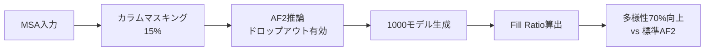

## 論文概要（Abstract）

AFsample2は、AlphaFold2（AF2）の推論時にMSA（Multiple Sequence Alignment）のカラムをランダムにマスキングすることで、共進化シグナルを減衰させ、構造予測の多様性を拡張する手法である。著者らは、OC23データセット（23種のopen/closed状態を持つタンパク質）において、AFsample2が78.3%のターゲットで両状態をTM-score 0.8以上で予測できたと報告している。また、標準AF2と比較して中間コンフォメーションの多様性が70%向上し、一部のターゲットではTM-scoreが0.58から0.98へと50%以上改善された。

本記事は [https://www.nature.com/articles/s42003-025-07791-9](https://www.nature.com/articles/s42003-025-07791-9) の解説記事です。

この記事は [Zenn記事: AISAR：AlphaFold2×NMRでタンパク質の隠れた構造状態を発見する](https://zenn.dev/0h_n0/articles/fa1b757f2324e1) の深掘りです。

## 情報源

- **ジャーナル**: Communications Biology, Volume 8, Article 373
- **URL**: [https://www.nature.com/articles/s42003-025-07791-9](https://www.nature.com/articles/s42003-025-07791-9)
- **著者**: Yogesh Kalakoti, Bjorn Wallner（Linkoping University, Sweden）
- **発表年**: 2025年3月
- **コード**: [https://wallnerlab.org/AFsample2](https://wallnerlab.org/AFsample2)
- **データ**: Zenodo DOI: 10.5281/zenodo.14534088

## 背景と動機（Background & Motivation）

タンパク質は単一の静的構造ではなく、複数のコンフォメーション状態を行き来する動的な分子である。創薬やタンパク質工学において、この構造アンサンブル全体を把握することは極めて重要である。しかし、AlphaFold2は単一の高信頼度構造を予測するよう訓練されており、コンフォメーション多様性の探索には本質的な限界がある。

初代AFsampleは、推論時にドロップアウト層を有効化することで予測のばらつきを生み出し、複数のコンフォメーションを捕捉する手法であった。しかし、ドロップアウトのみでは共進化シグナルの支配的な影響を十分に抑制できず、AF2が学習した「最も確からしい単一構造」への収束傾向を完全には克服できなかった。特にMSAに含まれる共進化情報は、残基間の接触パターンを強力に規定するため、構造予測が特定のコンフォメーションに固定されやすいという課題があった。

この課題に対し、AFsample2ではMSAカラムマスキングという追加の摂動メカニズムを導入し、共進化シグナルを直接的に減衰させることで構造多様性の拡張を実現している。

## 主要な貢献（Key Contributions）

- **MSAカラムマスキングの導入**: MSAの列をランダムに「X」（未知アミノ酸）に置換することで、共進化シグナルを減衰させ、AF2の構造探索空間を拡大した。前処理や追加の計算コストを必要としない
- **高品質な両端状態と多様な中間構造の同時予測**: OC23データセットで78.3%のターゲットが両状態TM-score 0.8以上を達成し、中間コンフォメーションの多様性も70%向上させた
- **膜タンパク質トランスポーターへの適用**: 16種の膜タンパク質トランスポーター（TP16データセット）で、8/16ターゲットが両状態をTM-score 0.8以上で予測可能であることを実証した

## 技術的詳細（Technical Details）

### MSAカラムマスキングのメカニズム

AFsample2の核心は、MSAの各カラム（列）をランダムに「X」（未知アミノ酸）へ置換するマスキング操作にある。ここで重要なのは、MSAの1行目（ターゲット配列そのもの）はマスキング対象から除外される点である。これにより、予測対象の配列情報は保持しつつ、相同配列から得られる共進化情報のみを選択的に減衰させる。

MSA行列 $\mathbf{M} \in \mathbb{R}^{N_{\text{seq}} \times L}$（$N_{\text{seq}}$: 配列数、$L$: 配列長）に対し、マスキング率 $r$ で各カラムを「X」に置換する。

$$
\mathbf{M}_{i,j}^{\text{masked}} = \begin{cases} X & \text{if } i > 1 \text{ and } j \in \mathcal{S}_{\text{mask}} \\ \mathbf{M}_{i,j} & \text{otherwise} \end{cases}
$$

ここで、$\mathcal{S}_{\text{mask}}$はマスキング対象カラムの集合であり、$|\mathcal{S}_{\text{mask}}| \approx r \cdot L$ となるようランダムに選択される。

著者らは0-50%のマスキング率を検証し、15%が最も良好な結果を示したと報告している。ただし最適値はターゲットごとに異なる。信頼度は5ポイントごとに約2%低下し、35%超で急落する。

### 多様性評価指標：Fill Ratio

AFsample2では、構造アンサンブルの多様性を定量化するためにFill Ratioという独自指標を導入している。各モデルをopen/closedの両参照構造に対するTM-scoreで2次元空間にプロットし、両状態を結ぶ対角線上に射影する。対角線を100個のビンに分割し、モデルが存在するビンの重み付き割合を算出する。

$$
w(k) = 1 + 16 \left(\frac{k}{\text{bins} - 1} - 0.5\right)^2
$$

$$
\text{Fill Ratio} = \frac{\sum_{k \in \text{populated}} w(k)}{\sum_{k=0}^{\text{bins}-1} w(k)}
$$

ここで $k$ はビンのインデックス、$w(k)$ は放物線型の重み関数である。両端（open/closed付近）のビンにより大きな重みを与えることで、端状態の予測品質を重視した評価となっている。

### AF2推論設定

AFsample2はAlphaFold v2.3.1をベースとし、以下の設定で推論を行う。

- **モデル重み**: 10個のモノマー用ニューラルネットワーク重みすべてを使用
- **テンプレート**: 不使用（テンプレートフリー予測）
- **MSA生成**: HHblitsおよびJackhammer検索（Uniref90, BFD, Uniclust30, MGnifyデータベース）
- **デフォルトサンプリング数**: ターゲットあたり1000モデル
- **ドロップアウト**: 推論時に有効化（AFsampleから継承）

### アルゴリズム

```python
import numpy as np
from typing import Optional


def mask_msa_columns(
    msa: np.ndarray,
    mask_ratio: float = 0.15,
    seed: Optional[int] = None,
) -> np.ndarray:
    """MSAカラムマスキングを適用する。

    Args:
        msa: MSA行列 (n_seq, seq_len)。各要素はアミノ酸のインデックス。
        mask_ratio: マスキングするカラムの割合 (0.0-1.0)。
        seed: 乱数シード（再現性のため）。

    Returns:
        マスキング済みMSA行列。1行目（ターゲット配列）は変更されない。
    """
    rng = np.random.default_rng(seed)
    n_seq, seq_len = msa.shape
    n_mask = int(seq_len * mask_ratio)
    mask_columns = rng.choice(seq_len, size=n_mask, replace=False)

    masked_msa = msa.copy()
    masked_msa[1:, mask_columns] = 20  # 'X' (unknown)
    return masked_msa


def afsample2_pipeline(
    target_sequence: str,
    msa: np.ndarray,
    n_models: int = 1000,
    mask_ratio: float = 0.15,
    n_weights: int = 10,
) -> list[dict]:
    """AFsample2パイプラインの擬似コード。

    Args:
        target_sequence: ターゲットタンパク質の配列。
        msa: 前処理済みMSA行列。
        n_models: 生成するモデル数。
        mask_ratio: MSAカラムマスキング率。
        n_weights: 使用するAF2モデル重みの数。

    Returns:
        予測構造のリスト。
    """
    predictions = []
    models_per_weight = n_models // n_weights

    for weight_idx in range(n_weights):
        for sample_idx in range(models_per_weight):
            seed = weight_idx * models_per_weight + sample_idx
            masked_msa = mask_msa_columns(msa, mask_ratio, seed=seed)
            prediction = run_alphafold2(
                sequence=target_sequence,
                msa=masked_msa,
                model_weight_index=weight_idx,
                enable_dropout=True,
                use_templates=False,
            )
            predictions.append(prediction)

    return predictions
```

## 実装のポイント

AFsample2を実際に利用する際の重要な考慮事項を以下にまとめる。

**マスキング率の選択**: 著者らは15%を推奨しているが、ターゲットによって最適値が異なる。35%を超えると予測品質が急激に低下するため、実運用では複数のマスキング率で並列実行し事後的に選択する戦略が現実的である。

**計算リソース**: 1ターゲットあたり1000モデル生成は10個のモデル重みを用いるためGPU負荷が大きい。ただし、MSA検索の前処理は1回のみで、マスキングはインプレース操作のため追加コストは無視できる。

**信頼度スコアの解釈**: AF2は単一構造への高信頼度を出すよう訓練されているため、代替コンフォメーションの信頼度は必然的に低い。著者らは信頼度が低い予測でも構造的に妥当な代替状態を含み得ることを示しており、信頼度のみでフィルタリングすべきでないと指摘している。

## Production Deployment Guide

AFsample2はGPU集約型のバッチ構造予測ワークロードであり、リアルタイムAPIではなくバッチジョブとして設計される。以下では、創薬パイプラインや構造生物学研究でのプロダクション運用を想定したAWS構成を示す。

### AWS実装パターン（GPU構造予測ワークロード向け）

**トラフィック量別の推奨構成**:

| 規模 | 構成 | 月額コスト概算 |
|------|------|---------------|
| Small (~10ターゲット/日) | 単一 g5.2xlarge + S3 | $800-1,500 |
| Medium (~50ターゲット/日) | AWS Batch + g5.xlarge Spot | $2,000-4,000 |
| Large (200+ターゲット/日) | AWS Batch + p4d.24xlarge Spot + FSx | $8,000-15,000 |

**Small構成**: g5.2xlarge（A10G, 24GB VRAM）でAF2推論を実行し、MSAデータベースはEBS gp3（3TB）、結果はS3に保存する。**Medium構成**: AWS Batchでg5.xlarge Spotを動的確保し、MSA前処理とGPU推論をジョブ分離する。**Large構成**: p4d.24xlarge（8x A100）SpotでFSx for Lustreを用いた高速MSA共有と並列処理を行う。

**コスト削減テクニック**: Spot Instances活用で最大90%削減（g5系は中断頻度が低い）、MSA前処理のみCPUインスタンスで実行しGPU時間を最小化、S3 Intelligent-Tieringで古い結果を自動アーカイブする。

**コスト試算の注意事項**: 上記は2026年4月時点のAWS東京リージョン料金に基づく概算値。実際のコストはSpot中断頻度やターゲットの配列長により変動する。

### Terraformインフラコード

**Small構成（単一GPUインスタンス + S3）**:

```hcl
# AFsample2 Small構成: g5.2xlarge + S3
terraform {
  required_version = ">= 1.8"
  required_providers {
    aws = { source = "hashicorp/aws", version = "~> 5.50" }
  }
}

provider "aws" { region = "ap-northeast-1" }

resource "aws_s3_bucket" "predictions" {
  bucket = "afsample2-predictions-${data.aws_caller_identity.current.account_id}"
}

resource "aws_s3_bucket_server_side_encryption_configuration" "predictions" {
  bucket = aws_s3_bucket.predictions.id
  rule {
    apply_server_side_encryption_by_default { sse_algorithm = "aws:kms" }
  }
}

resource "aws_iam_role" "afsample2" {
  name = "afsample2-inference"
  assume_role_policy = jsonencode({
    Version = "2012-10-17"
    Statement = [{
      Action    = "sts:AssumeRole"
      Effect    = "Allow"
      Principal = { Service = "ec2.amazonaws.com" }
    }]
  })
}

data "aws_caller_identity" "current" {}
```

**Large構成（AWS Batch + Spot GPU）**:

```hcl
# AFsample2 Large構成: AWS Batch + g5 Spot
resource "aws_batch_compute_environment" "gpu_spot" {
  compute_environment_name = "afsample2-gpu-spot"
  type                     = "MANAGED"
  compute_resources {
    type                = "SPOT"
    bid_percentage      = 60
    allocation_strategy = "SPOT_CAPACITY_OPTIMIZED"
    max_vcpus           = 96
    min_vcpus           = 0
    instance_type       = ["g5.xlarge", "g5.2xlarge"]
    subnets             = var.private_subnet_ids
    security_group_ids  = [aws_security_group.batch.id]
    instance_role       = aws_iam_instance_profile.batch.arn
    ec2_configuration { image_type = "ECS_AL2_NVIDIA" }
  }
  service_role = aws_iam_role.batch_service.arn
}

resource "aws_batch_job_definition" "af2_inference" {
  name = "afsample2-inference"
  type = "container"
  container_properties = jsonencode({
    image   = "${var.ecr_repo_url}:latest"
    vcpus   = 8
    memory  = 30000
    resourceRequirements = [{ type = "GPU", value = "1" }]
    environment = [
      { name = "MASK_RATIO", value = "0.15" },
      { name = "N_MODELS",   value = "1000" },
    ]
  })
}

resource "aws_budgets_budget" "monthly" {
  name         = "afsample2-monthly"
  budget_type  = "COST"
  limit_amount = "5000"
  limit_unit   = "USD"
  time_unit    = "MONTHLY"
  notification {
    comparison_operator        = "GREATER_THAN"
    threshold                  = 80
    threshold_type             = "PERCENTAGE"
    notification_type          = "ACTUAL"
    subscriber_email_addresses = [var.alert_email]
  }
}
```

### 運用・監視設定

**CloudWatch Logs Insightsクエリ（ジョブ実行時間分析）**:

```
fields @timestamp, @message
| filter @message like /inference_complete/
| stats avg(duration_ms) as avg_ms,
        percentile(duration_ms, 95) as p95_ms,
        count() as total_jobs
  by bin(1h)
```

**CloudWatchアラーム・Cost Explorer（Python）**:

```python
import boto3
from datetime import date, timedelta


def create_batch_alarm(region: str = "ap-northeast-1") -> None:
    """AWS Batchジョブ失敗率のアラームを作成する。"""
    cw = boto3.client("cloudwatch", region_name=region)
    cw.put_metric_alarm(
        AlarmName="afsample2-job-failure-rate",
        MetricName="FailedJobCount",
        Namespace="CustomMetrics/AFsample2",
        Statistic="Sum",
        Period=3600,
        EvaluationPeriods=1,
        Threshold=5,
        ComparisonOperator="GreaterThanThreshold",
        AlarmActions=["arn:aws:sns:ap-northeast-1:ACCOUNT:afsample2-alerts"],
    )


def daily_cost_report(region: str = "ap-northeast-1") -> float:
    """日次コストを取得し$300超過でSNS通知する。"""
    ce = boto3.client("ce", region_name=region)
    today = date.today()
    result = ce.get_cost_and_usage(
        TimePeriod={
            "Start": (today - timedelta(days=1)).isoformat(),
            "End": today.isoformat(),
        },
        Granularity="DAILY",
        Metrics=["UnblendedCost"],
        Filter={"Tags": {"Key": "Project", "Values": ["afsample2"]}},
    )
    total = float(
        result["ResultsByTime"][0]["Total"]["UnblendedCost"]["Amount"]
    )
    if total > 300:
        boto3.client("sns", region_name=region).publish(
            TopicArn="arn:aws:sns:ap-northeast-1:ACCOUNT:afsample2-alerts",
            Subject="AFsample2 日次コスト超過",
            Message=f"日次コスト: ${total:.2f} (閾値: $300)",
        )
    return total
```

### コスト最適化チェックリスト

**アーキテクチャ選択**: ターゲット数/日でSmall/Medium/Large構成を選択し、MSA前処理（CPU）とAF2推論（GPU）のジョブを分離する。夜間・週末のバッチスケジューリングも有効である。

**リソース最適化**: g5 Spot Instances優先（中断時はAWS Batchが自動リトライ）、EBS gp3ボリューム（gp2比20%削減）、S3 Intelligent-Tiering（90日超自動アーカイブ）、EFS共有ストレージでEBS重複排除、常時稼働時はReserved Instances 1年コミットを検討する。

**GPU最適化**: 配列長に応じたインスタンスタイプ選択（短鎖: g5.xlarge、長鎖: g5.2xlarge）、複数ターゲットのバッチ処理でGPU idle時間を最小化、MSAマスキングはCPU上で実行しGPUはAF2推論に専念させる。

**監視・アラート**: AWS Budgets月次予算アラート（80%/100%閾値）、CloudWatch Batchジョブ失敗率アラーム、Cost Anomaly Detection自動異常検知、日次コストレポートSNS通知を設定する。

**リソース管理**: 未使用EBSボリュームの定期削除、プロジェクトタグ（Project: afsample2）の全リソース適用、S3ライフサイクルポリシー、開発環境のBatch Compute Environmentを夜間0 vCPUに設定する。

## 実験結果（Results）

### OC23データセットでの比較

OC23データセットは23種のopen/closed状態が実験的に確認されたタンパク質で構成される。著者らは以下の比較結果を報告している（論文Table相当）。

| 手法 | 両状態TM>0.8達成率 | 改善ターゲット数(ΔTM>0.05) |
|------|-------------------|--------------------------|
| AFsample2 (15%マスキング) | 78.3% | ベースライン |
| SPEACH_AF | 73.9% | 4/23 |
| MSA subsampling | 69.6% | 5/23 |
| AFsample (v1) | 56.5% | 8/23 |
| AFvanilla (標準AF2) | 47.8% | 9/23 |
| AFcluster | 47.8% | 17/23 |

マスキングなし（0%）からの改善として、closed状態のTM-scoreは0.89から0.90、open状態は0.80から0.88へ向上している。特にopen状態（通常AF2が苦手とする代替構造）での改善が顕著である。

### TP16膜タンパク質トランスポーターでの結果

膜タンパク質は構造多様性の予測が特に困難なターゲットとして知られる。著者らはTP16データセット（16種のトランスポーター）での評価を行い、AFsample2が8/16ターゲットで両状態をTM-score 0.8以上で予測したと報告している。他の手法では最大4/16にとどまっており、AFsample2の優位性が示されている。11/16のターゲットでAFvanillaに対してΔTM>0.05の改善が確認されている。

### 中間コンフォメーションの多様性



Fill Ratio指標による評価では、AFsample2は標準AF2と比較して中間コンフォメーションの多様性を70%向上させた。これは、open/closedの両端状態だけでなく、遷移途中の構造も捕捉できていることを意味する。著者らは4つのターゲットについて、予測された中間構造に対応する実験構造がPDBに存在することを確認している。

### フォールドスイッチタンパク質への適用

S6リボソームタンパク質変異体において、AFsample2はα/β-plaitフォールド（FS1）と3α-helicalフォールド（FS2）の両方をTM>0.8で予測できることが示されている。FS2の信頼度はFS1（0.88）より低い0.75であった。

## 実運用への応用（Practical Applications）

### 創薬パイプラインへの統合

AFsample2による構造アンサンブル予測は、構造ベース創薬（SBDD）において複数のコンフォメーション状態を標的としたドッキングを可能にする。従来の単一構造ドッキングでは見逃されていた結合ポケットが、代替コンフォメーションで露出する場合がある。著者らの結果は、膜タンパク質トランスポーターのような創薬上重要なターゲットにおいても有効であることを示している。

### AISARとの関連

本論文はAISARのStage 1（AI構造サンプリング）の基盤技術と直接的に関連する。AISARではAlphaFold2ベースのサンプリングで構造多様性を生成し、NMR化学シフトデータで実験的に検証する。AFsample2のMSAカラムマスキングは、このサンプリング段階での構造探索空間を拡大する有力な手法であり、NMRデータとの統合により実験的に裏付けられた構造アンサンブルの構築が期待される。

### タンパク質工学への応用

AFsample2はフォールドスイッチタンパク質のような劇的な構造変化も予測可能であり、酵素設計やバイオセンサー開発における構造変化のシミュレーションへの活用が期待される。

## 関連研究（Related Work）

- **AFsample (Wallner, 2023)**: AFsample2の前身。推論時ドロップアウトによる多様性拡張を提案。AFsample2はMSAカラムマスキングを追加し性能を向上
- **SPEACH_AF (Wayment-Steele et al.)**: in-silicoアラニンスキャニングで構造多様性を探索。一方の状態を既知として利用する必要がある
- **AFcluster (Wayment-Steele et al.)**: MSAクラスタリングでサブMSAを作成し多様性を得る。OC23での両状態予測率は47.8%
- **AlphaFlow (Jing et al.)**: フローマッチングをAF2に統合し構造アンサンブルを生成
- **AISAR (Ito et al.)**: AF2サンプリングとNMR化学シフトデータを統合した手法。AFsample2のサンプリング戦略をStage 1で活用

## まとめと今後の展望

AFsample2は、MSAカラムマスキングという前処理不要の手法をAF2の推論パイプラインに統合することで、構造予測の多様性を拡張した。OC23で78.3%の両状態予測率、中間コンフォメーション多様性の70%向上という結果は、AF2ベースの構造サンプリングにおける現時点での有力なアプローチであることを示している。

著者らはマルチマー複合体への拡張やRosettaFold/OpenFold/AF3への適用を今後の検討事項として挙げている。NMRデータとの統合（AISARのようなアプローチ）も重要な研究方向である。

## 参考文献

- **論文**: Kalakoti, Y., Wallner, B. "AFsample2 predicts multiple conformations and ensembles with AlphaFold2." Communications Biology 8, 373 (2025). [https://www.nature.com/articles/s42003-025-07791-9](https://www.nature.com/articles/s42003-025-07791-9)
- **PMC**: [https://pmc.ncbi.nlm.nih.gov/articles/PMC11882827/](https://pmc.ncbi.nlm.nih.gov/articles/PMC11882827/)
- **Code**: [https://wallnerlab.org/AFsample2](https://wallnerlab.org/AFsample2)
- **Data**: Zenodo DOI: 10.5281/zenodo.14534088
- **Related Zenn article**: [https://zenn.dev/0h_n0/articles/fa1b757f2324e1](https://zenn.dev/0h_n0/articles/fa1b757f2324e1)
