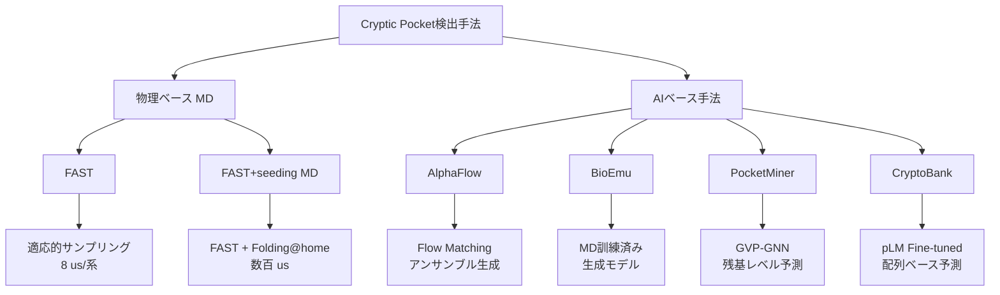
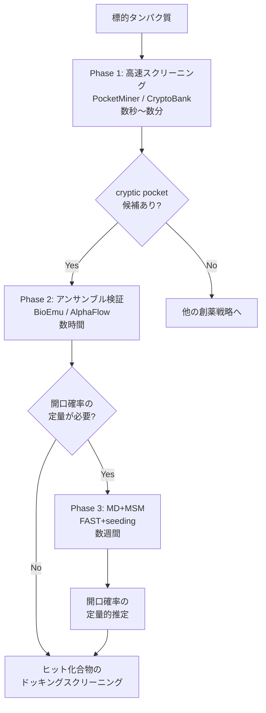

## 論文概要（Abstract）

本論文は、タンパク質に存在するcryptic pocket（隠れたポケット）の検出において、AI手法（AlphaFlow、BioEmu、PocketMiner、CryptoBank）と物理ベースの分子動力学（MD）シミュレーション（FAST、FAST+seeding）の予測能力を体系的に比較した研究である。エボラウイルスVP35のインターフェロン阻害ドメインおよびTEM-1 β-ラクタマーゼ（M182T変異体）を用いたベンチマークにおいて、すべての手法がVP35でのポケット検出と変異体間の開閉傾向の区別に成功した一方、ポケット開口が微妙なTEMでは手法間で性能に大きなばらつきが見られた。著者らは、AI手法は高速で定性的なスクリーニングに適するが、ポケット開口確率の定量的予測にはMDシミュレーション+Markov State Model（MSM）が依然として優位であると結論づけている。

本記事は [bioRxivプレプリント（2026年1月公開）](https://www.biorxiv.org/content/10.64898/2026.01.21.700870v1) の解説記事です。

この記事は [Zenn記事: AISAR：AlphaFold2×NMRでタンパク質の隠れた構造状態を発見する](https://zenn.dev/0h_n0/articles/fa1b757f2324e1) の深掘りです。

## 情報源

- **bioRxiv ID**: 10.64898/2026.01.21.700870
- **URL**: [https://www.biorxiv.org/content/10.64898/2026.01.21.700870v1](https://www.biorxiv.org/content/10.64898/2026.01.21.700870v1)
- **著者**: Si Zhang, Justin J. Miller, Gregory R. Bowman
- **発表年**: 2026（bioRxivプレプリント、Journal of Chemical Theory and Computationに採録）
- **分野**: 計算生物学、創薬、タンパク質動態

## 背景と動機（Background & Motivation）

### Cryptic pocketとは何か

Cryptic pocket（隠れたポケット）とは、タンパク質のアポ構造（リガンド非結合状態）では閉じているが、タンパク質の動的なコンフォメーション変化によって一時的に露出する結合ポケットである。KRAS G12CのSwitch-IIポケットに対するFDA承認薬（AMG 510、MRTX849）の成功が示すように、cryptic pocketは「創薬困難」とされるタンパク質に対する新たな標的となりうる。

### 検出の困難さ

cryptic pocketの検出が困難な理由は、ポケットの開口が以下の特性を持つためである。

- **時間スケールの問題**: 二次構造の運動を伴うポケット開口はマイクロ秒から分のオーダーで起こり、通常のMDシミュレーションの実用的な限界を超える場合がある
- **集団の希少性**: 野生型タンパク質における開口状態の存在比は数%以下であることが多く、十分なサンプリングが必要
- **構造変化の微妙さ**: X線結晶構造解析やcryo-EMでは支配的な状態に偏り、マイナー状態が見逃される

### AI手法の台頭と課題

近年、AlphaFold2を基盤とした構造アンサンブル生成手法（AFsample、AlphaFlow）やMDデータで訓練された生成モデル（BioEmu）、グラフニューラルネットワークに基づく残基レベル予測器（PocketMiner）などのAI手法が登場し、cryptic pocketの検出を大幅に高速化している。しかし、これらの手法が**どの程度まで定量的な予測を提供できるか**は十分に検証されていなかった。本論文はこの空白を埋めるために設計されたベンチマーク研究である。

## 主要な貢献（Key Contributions）

- **貢献1**: VP35とTEM β-ラクタマーゼという実験的にポケット開口確率が定量化されている2つのモデル系を用いて、AI手法4種とMDシミュレーション2種を同一条件で体系的にベンチマークした
- **貢献2**: AI手法は変異体間のポケット開口傾向（開口促進 vs 抑制）を定性的に区別できるが、ポケット開口確率の絶対値の定量予測は困難であることを明確にした
- **貢献3**: MDシミュレーション（FAST+seeding+MSM）は野生型タンパク質のポケット開口確率を実験値に近い精度で再現できる一方、実験的に1%未満の希少な開口状態の定量予測はすべての手法で課題が残ることを示した

## 技術的詳細（Technical Details）

### ベンチマーク対象タンパク質

著者らは、cryptic pocketの開口確率が実験的に定量化されている2つのモデルタンパク質系を選定している。

#### 1. VP35（エボラウイルス VP35 インターフェロン阻害ドメイン）

VP35のcryptic pocketは、4-ヘリックスバンドルからヘリックス5が分離することで形成される。Bowmanらの先行研究（Nature Communications, 2022）により、チオールラベリングアッセイを用いて各変異体の平衡定数が実験的に測定されている。

| 変異体 | 平衡定数（C307露出） | ポケット開口傾向 |
|--------|---------------------|----------------|
| 野生型 | $4.0 \times 10^{-1} \pm 1.0 \times 10^{-2}$ | 基準 |
| F239A | $1.1 \pm 0.2$ | 開口促進（約2倍） |
| I303A | — | 開口促進 |
| A291P | $1.4 \times 10^{-4} \pm 2.0 \times 10^{-4}$ | 開口抑制（劇的に減少） |

このうちF239AとI303Aはポケット開口を促進する変異、A291Pはポケット形成を劇的に抑制する変異として知られている。

#### 2. TEM-1 β-ラクタマーゼ（M182T変異体）

TEM β-ラクタマーゼのcryptic pocketは、$\Omega$-ループの構造変化によって形成される。開口確率はチオールラベリングとNMR CEST（Chemical Exchange Saturation Transfer）の両方で測定されている。

| 変異体 | 開口確率（実験値） | 測定手法 |
|--------|-------------------|---------|
| 野生型（M182T） | $1.1 \pm 0.2$% | チオールラベリング |
| 野生型（M182T） | $1.05 \pm 0.03$% | NMR CEST |
| E240D | $4 \pm 1$% | チオールラベリング |
| E240D/R241P | $0.19 \pm 0.01$% | チオールラベリング |

TEMのポケット開口は1%程度と非常に微妙であり、AI手法にとってより困難なベンチマークとなっている。

### 比較対象手法



#### 物理ベース手法

**FAST（Fluctuation Amplification of Specific Traits）**: 目標指向型適応的サンプリングアルゴリズムである。コンフォメーション空間の広範な探索と、ポケット体積が大きいコンフォメーションへの重点的サンプリングのバランスを取りながら反復的にシミュレーションを実行する。各系について10ラウンドの適応的サンプリング（各ラウンド10本の並列トラジェクトリ×80 ns）を実施し、合計8 $\mu$sのサンプリングを行っている。ポケット体積の算出にはLIGSITEアルゴリズムが用いられた。

**FAST+seeding MD**: FASTで発見されたコンフォメーション空間を均等に分散するクラスタ中心（1,000クラスタ）から長時間MDシミュレーションを播種（seeding）し、Folding@home分散コンピューティングプラットフォームで実行する手法である。VP35では合計122 $\mu$sの集約シミュレーション時間が報告されている。得られたトラジェクトリからMSMを構築し、4,469コンフォメーション状態を含むモデルから開口状態の平衡集団を推定する。

MSMの構築では、マルコフ時間（ラグタイム）として25 nsが使用されている。開口状態の集団推定は以下の式に基づく。

$$
p_{\text{open}} = \sum_{i \in S_{\text{open}}} \pi_i
$$

ここで、$\pi_i$は状態$i$の定常分布確率、$S_{\text{open}}$はポケットが開いていると判定された状態の集合である。

#### AI手法

**AlphaFlow**: AlphaFold2をFlow Matching（フローマッチング）フレームワークで微調整した配列条件付き生成モデルである（Jing et al., ICML 2024）。MDシミュレーションのアンサンブルまたはPDBの実験的アンサンブルで訓練され、タンパク質のコンフォメーション多様性を表現する構造アンサンブルを生成する。本論文では各系について3レプリカのアンサンブル生成を実施している。

**BioEmu**: 200ミリ秒超のMDシミュレーションデータ（Folding@home由来を含む）と静的構造、実験的タンパク質安定性データで訓練された生成モデルである。タンパク質の多様な機能的運動を予測する構造アンサンブルを生成する。34件の検証済みケースでホロ構造の回復率86%、アポ構造の回復率56%が報告されている。

**PocketMiner**: Geometric Vector Perceptron（GVP）ベースのグラフニューラルネットワーク（GNN）で、残基レベルでcryptic pocketの存在を予測する。38タンパク質（39 cryptic pocket）と数千のMDスナップショットで訓練され、二面角や残基間距離などの幾何学的特徴を入力とする。ROC-AUCは0.87であり、CryptoSite（0.85）を上回る。予測は**秒単位**で完了する。

**CryptoBank**: 55万以上の構造アラインメントから構築されたデータベースに基づき、Prot-T5-XL-UniRef50タンパク質言語モデルを微調整した配列ベースの予測器である。71のcryptic / 128のnon-crypticな訓練例を使用。訓練データと配列同一性が20%以上のタンパク質では高い性能を示すが、新規配列への汎化性に限界がある。

### ポケット開口の判定基準

各手法で生成されたコンフォメーションについて、ポケットが「開いている」か「閉じている」かを判定する基準が定義されている。

- **LIGSITE**: グリッドベースのポケット体積計算アルゴリズム。FASTサンプリングで最大化する目的変数として使用
- **fpocket**: ドラッカビリティスコア（druggability score）の算出。VP35のcryptic pocketでは0.681のスコアが報告されている
- **RMSD/構造基準**: 既知のホロ構造に対するRMSDや特定残基の距離変化に基づく判定

## アルゴリズムと比較方法論（Comparison Methodology）

### ベンチマーク設計

著者らのベンチマーク設計は以下の2つの評価軸に基づいている。

1. **定性的評価**: 変異体間でポケット開口傾向のランキングを正しく予測できるか（例: F239A > WT > A291P）
2. **定量的評価**: ポケット開口確率の絶対値を実験値に近い精度で予測できるか

```mermaid
graph LR
    A[タンパク質配列/構造] --> B{手法選択}
    B --> C[FAST<br/>8 us適応的サンプリング]
    B --> D[FAST+seeding<br/>+Folding@home]
    B --> E[AlphaFlow<br/>3レプリカ]
    B --> F[BioEmu<br/>3レプリカ]
    B --> G[PocketMiner<br/>残基スコア]
    B --> H[CryptoBank<br/>配列スコア]
    C --> I[MSM構築]
    D --> I
    I --> J[開口確率推定]
    E --> K[開口コンフォメーション<br/>割合計算]
    F --> K
    G --> L[残基レベル<br/>crypticスコア]
    H --> L
    J --> M[実験値と比較]
    K --> M
    L --> M
```

### 計算コスト

各手法の計算コストは大きく異なる。

| 手法 | 計算時間の目安 | 必要リソース |
|------|--------------|------------|
| PocketMiner | 秒 | CPU/GPU 1基 |
| CryptoBank | 秒 | CPU/GPU 1基 |
| AlphaFlow | 数時間 | GPU |
| BioEmu | 数時間 | GPU |
| FAST | 数日〜数週間 | GPU複数台 |
| FAST+seeding | 数週間〜数ヶ月 | 分散コンピューティング |

AI手法は物理ベース手法と比較して**1,000倍以上**高速であり、大規模なスクリーニングへの適用が可能である。

## 実験結果（Results）

### VP35におけるcryptic pocket検出

VP35のcryptic pocketは比較的大きな構造変化を伴うため、すべての手法がポケットの存在を検出し、開口促進変異体（F239A、I303A）と抑制変異体（A291P）の区別に成功している。

**BioEmuの予測結果**（著者らの報告による）:

| VP35変異体 | BioEmu開口割合 | 実験的傾向 |
|-----------|--------------|----------|
| 野生型 | $10.4 \pm 0.2$% | 基準 |
| F239A | $12.6 \pm 0.4$% | 開口促進 |
| I303A | $18.4 \pm 0.4$% | 開口促進 |
| A291P | $10.2 \pm 0.4$% | 開口抑制 |

BioEmuはI303Aで最も高い開口割合を示し、F239Aでも野生型を上回る傾向を正しく捉えている。しかしA291Pについては野生型とほぼ同等の開口割合を予測しており、実験で観測される劇的な開口抑制（平衡定数が3桁以上低下）を十分に反映できていない。

**AlphaFlowの予測結果**: AlphaFlowはすべてのVP35系で開口コンフォメーションの割合が1%未満にとどまり、cryptic pocketの検出に困難を示している。

**FAST+seeding MD**: 物理ベースのFAST+seeding MDは、FASTで発見された構造を起点としたシーディングにより再現性のある開口状態集団を得ており、変異体間のランキングと野生型の開口確率の両方で良好な一致を示している。

### TEM β-ラクタマーゼにおける結果

TEMのcryptic pocketは開口確率が約1%と低く、より困難なベンチマークである。著者らは、この系において手法間で性能に顕著なばらつきが生じたと報告している。

- **FAST+seeding MD**: 野生型の開口確率について実験値（$\sim 1$%）に近い推定値を得ている
- **BioEmuとPocketMiner**: 実験的に開口確率が1%を超える変異体についてはある程度の傾向を捉えるが、系統的な誤差があり、開口確率が1%未満の希少な開口状態の予測では精度が低下する
- **全手法共通の課題**: 実験的に1%未満の開口確率を持つポケットについては、すべての手法で信頼性の高い定量予測が困難である

### 定性 vs 定量の総括

著者らの結論を以下の表にまとめる。

| 評価軸 | AI手法 | MD+MSM |
|--------|--------|--------|
| ポケットの存在検出 | 可能（VP35で成功） | 可能 |
| 変異体間のランキング | 概ね正しい方向 | 正確 |
| 開口確率の絶対値（WT） | 系統的誤差あり | 実験値に近い |
| 希少状態（<1%）の定量 | 困難 | 困難（改善の余地） |
| 計算速度 | 秒〜数時間 | 数日〜数ヶ月 |
| 新規タンパク質への適用 | 訓練データへの依存 | 汎用的 |

## 実運用への応用（Practical Applications）

### 創薬パイプラインにおける位置づけ

本論文の知見は、cryptic pocketを標的とした創薬において、AI手法とMDシミュレーションの使い分け戦略を示唆している。

**段階的アプローチ**:



1. **Phase 1（秒〜分）**: PocketMinerやCryptoBankで大規模な標的候補のスクリーニングを実施し、cryptic pocketを持つ可能性が高いタンパク質を絞り込む
2. **Phase 2（時間）**: BioEmuやAlphaFlowでコンフォメーションアンサンブルを生成し、ポケットの形状と位置を確認する
3. **Phase 3（週〜月）**: 有望な候補についてFAST+seeding MDで定量的なポケット開口確率を推定し、創薬ターゲットとしての実現可能性を評価する

### AISARとの関連

本論文の知見は、関連Zenn記事で紹介したAISAR（AI SAmpling with NMR Recall selection）の意義を強く裏付けている。AISARはAlphaFold2のドロップアウトサンプリング（AFsample）で構造アンサンブルを生成した上で、NMR実験データ（NOESYスペクトル）によるベイズスコアリングで多状態モデルを選択・検証する。

本論文が示した「AI手法は**どこに**cryptic pocketがあるかを検出できるが、**どの程度の頻度で**開口するかの定量予測にはMDが必要」という知見に対して、AISARは第三のアプローチを提示している。すなわち、AI手法のスケーラビリティを活かしつつ、NMR実験データという独立した検証軸で多状態モデルの妥当性を担保するハイブリッド戦略である。MDシミュレーションの代わりにNMR実験データを用いることで、計算コストの問題を回避しながら定量的な構造情報を得ることが可能となる。

### 実験的検証の不可欠性

本論文のもう一つの示唆は、**いかなる計算手法も実験的検証なしには信頼性が保証されない**という点である。VP35のチオールラベリング（平衡定数）やTEMのNMR CEST（交換速度 $k_{\text{ex}} = 98 \pm 6 \text{ s}^{-1}$）のような定量的実験データが、計算予測の基準点（ground truth）として不可欠であることが改めて示された。

## 関連研究（Related Work）

- **AISAR（Ramanathan et al., 2024）**: AlphaFold2のドロップアウトサンプリングとNMR NOESY Recallを組み合わせた多状態構造決定フレームワーク。本論文が指摘するAI手法の定量性の限界を、実験データ統合で補完するアプローチ
- **AlphaFold-SFA（Bhakat, 2022）**: AlphaFold2からのMD開始による cryptic pocket探索の加速。結晶構造からの開始と比較して、AlphaFold予測構造からのMDでポケット発見が加速されることを報告
- **PocketMiner（Meller et al., 2023）**: GVPベースのGNNによる残基レベルcryptic pocket予測。CryptoSiteの1,000倍以上高速で同等以上の精度（ROC-AUC 0.87）
- **BioEmu（Microsoft Research, 2024）**: 200 ms超のMDデータで訓練された生成モデル。ホロ構造回復率86%
- **CryptoSite（Cimermancic et al., 2016）**: 84件のcryptic pocketで訓練されたML予測器。オンザフライMDを特徴量に使用するため計算コストが高い（約1日/構造）
- **CrypToth（2024）**: 混合溶媒MDシミュレーションとトポロジカルデータ解析を組み合わせたcryptic pocket検出手法

## まとめと今後の展望

### 主要な成果

著者らは、AI手法とMDシミュレーションのcryptic pocket検出能力を同一ベンチマークで比較し、以下の知見を得ている。

1. AI手法は高速（秒〜時間）で定性的なポケット検出に有効だが、開口確率の定量予測には系統的な誤差がある
2. MD+MSM（FAST+seeding）は野生型タンパク質の開口確率を実験値に近い精度で再現できるが、計算コストが高い
3. 実験的に1%未満の希少な開口状態の定量予測は、すべての手法にとって未解決の課題である

### 今後の方向性

- **大規模ベンチマークデータセットの構築**: 実験的にポケット開口確率が定量化されたタンパク質が限られているため、より多くの検証済みデータセットが必要
- **AI手法と物理ベース手法の統合**: AlphaFold予測構造からのMD開始（AlphaFold-SFA）やAISARのようなハイブリッドアプローチの発展
- **実験的検証との連携**: 計算予測はすべて実験的検証と組み合わせることで信頼性が向上する。NMR、チオールラベリング、FPOPなどの実験手法との統合パイプラインの構築が重要

### 本論文の限界

著者らが議論している限界として、ベンチマークが2つのモデルタンパク質系に限定されている点が挙げられる。VP35は比較的大きなポケット開口を示すのに対し、TEMは微妙な開口であり、中間的な特性を持つ系での検証が今後必要である。また、各AI手法の訓練データセットが異なるため、純粋な手法の優劣比較には注意が必要である。

## 参考文献

- **bioRxiv (v1)**: [https://www.biorxiv.org/content/10.64898/2026.01.21.700870v1](https://www.biorxiv.org/content/10.64898/2026.01.21.700870v1)
- **JCTC (Published)**: [https://pubs.acs.org/doi/10.1021/acs.jctc.6c00135](https://pubs.acs.org/doi/10.1021/acs.jctc.6c00135)
- **VP35 cryptic pocket (Nature Communications 2022)**: [https://www.nature.com/articles/s41467-022-29927-9](https://www.nature.com/articles/s41467-022-29927-9)
- **TEM β-lactamase cryptic pocket (PNAS 2021)**: [https://www.pnas.org/doi/10.1073/pnas.2106473118](https://www.pnas.org/doi/10.1073/pnas.2106473118)
- **AlphaFlow (ICML 2024)**: [https://proceedings.mlr.press/v235/jing24a.html](https://proceedings.mlr.press/v235/jing24a.html)
- **PocketMiner**: ROC-AUC 0.87, CryptoSiteの1000倍以上高速
- **Related Zenn article**: [https://zenn.dev/0h_n0/articles/fa1b757f2324e1](https://zenn.dev/0h_n0/articles/fa1b757f2324e1)
