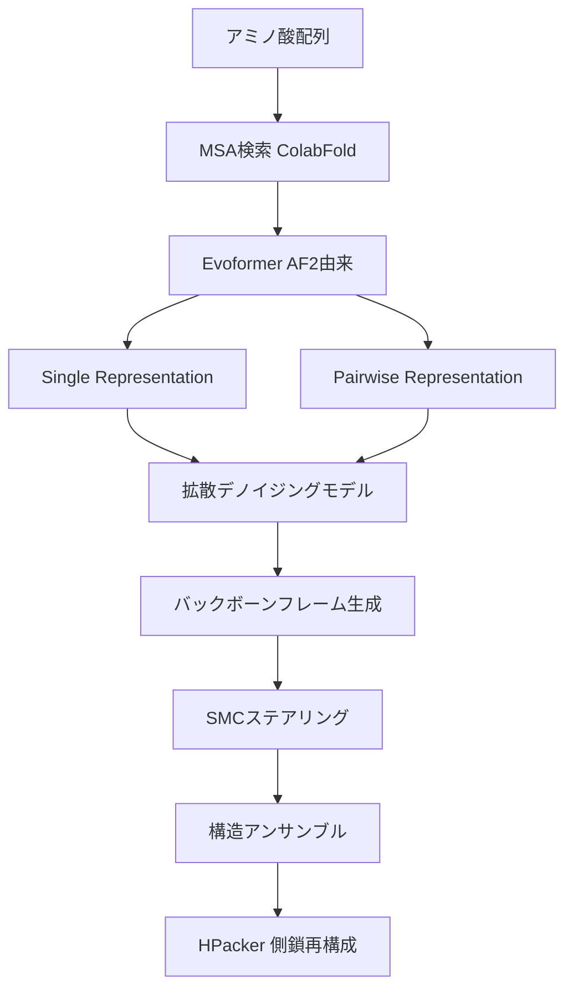

## 論文概要（Abstract）

BioEmuは、Microsoft Researchが開発した拡散ベースの生成モデルであり、タンパク質のアミノ酸配列のみを入力として、ボルツマン分布に従う平衡構造アンサンブルを高速に生成する。従来の分子動力学（MD）シミュレーションではスーパーコンピュータで数ヶ月を要する計算を、単一GPUで1時間あたり数千構造の生成へと加速した。AlphaFold2のEvoformerモジュールを配列エンコーダとして活用し、200ミリ秒超のMDトラジェクトリデータとMEGAscaleデータセットの50万件以上の実験的安定性データで学習することで、相対自由エネルギー誤差を約1 kcal/mol以下に抑えている。

本記事は [bioRxiv: Scalable emulation of protein equilibrium ensembles with generative deep learning](https://www.biorxiv.org/content/10.1101/2024.12.05.626885v1) の解説記事です。

この記事は [Zenn記事: AISAR：AlphaFold2×NMRでタンパク質の隠れた構造状態を発見する](https://zenn.dev/0h_n0/articles/fa1b757f2324e1) の深掘りです。

## 情報源

- **bioRxiv**: [10.1101/2024.12.05.626885](https://www.biorxiv.org/content/10.1101/2024.12.05.626885v1)（2024年12月、後にScience誌に掲載）
- **Science掲載**: [10.1126/science.adv9817](https://www.science.org/doi/10.1126/science.adv9817)（2025年）
- **著者**: Sarah Lewis, Tim Hempel, José Jiménez-Luna, Michael Gastegger, Yu Xie, et al.（Microsoft Research）
- **コード**: [github.com/microsoft/bioemu](https://github.com/microsoft/bioemu)（MIT License）
- **分野**: 計算生物学・生成モデル

## 背景と動機（Background & Motivation）

タンパク質は単一の静的構造ではなく、熱力学的平衡下で多数の構造状態間を遷移する動的な存在である。この構造アンサンブルの理解は、酵素触媒の機構解明、クリプティック結合ポケットの発見、薬剤設計において不可欠である。

従来、構造アンサンブルの計算にはMDシミュレーションが用いられてきた。しかし、生物学的に関連するミリ秒スケールの構造変化をサンプリングするには、専用スーパーコンピュータ（Anton等）で数ヶ月の計算が必要であり、大規模なスクリーニングへの適用は現実的ではなかった。一方、AlphaFold2に代表される構造予測手法は高精度な単一構造を予測できるが、「映画の1フレーム」に相当する静的な情報しか提供しない。

この計算コストのボトルネックを解消し、配列から直接ボルツマン分布に従う構造アンサンブルを高速生成する手法が求められていた。AISARのようにNMR実験データを活用するアプローチも存在するが、実験データの取得自体に多大なコストがかかる。BioEmuは実験データなしに構造多様性を予測する、相補的なアプローチとして位置づけられる。

## 主要な貢献（Key Contributions）

- **スケーラブルな構造アンサンブル生成**: 単一GPUで1時間あたり最大10,000構造を生成し、MDシミュレーションに対して4〜5桁の高速化を実現した
- **3段階学習パイプラインの提案**: AlphaFoldデータベースでの事前学習、200ミリ秒超のMDデータによるファインチューニング、MEGAscaleデータセットを用いたProperty Prediction Fine-Tuning（PPFT）の3段階で、ボルツマン分布に忠実なアンサンブルを学習する手法を確立した
- **機能的構造変化の予測**: ドメイン運動（55〜90%の成功率）、局所的アンフォールディング、クリプティック結合ポケット形成など、従来長時間MDでしか捉えられなかった構造変化の予測を可能にした

## 技術的詳細（Technical Details）

### アーキテクチャ

BioEmuのアーキテクチャは、Distributional Graphormer（DiG）をベースとしており、大きく2つのコンポーネントから構成される。



**配列エンコーダ**: AlphaFold2のEvoformerモジュールを用いて、入力配列のMultiple Sequence Alignment（MSA）からシングル表現とペアワイズ表現を生成する。これにより配列と構造間の深い関連性が捉えられる。

**拡散デノイジングモデル**: 粗視化バックボーンフレーム表現上で動作するスコアベース拡散モデルである。モデルは31.4Mパラメータ（v1.0/v1.1）または35.7Mパラメータ（v1.2）で構成される。

### デノイジングスコアマッチング

拡散モデルの学習には、デノイジングスコアマッチング（DSM）目的関数が用いられる。前進過程で構造 $\mathbf{x}_0$ にガウスノイズを段階的に付加し、時刻 $t$ でのノイズ付き構造 $\mathbf{x}_t$ を得る。

$$
\mathbf{x}_t = \alpha_t \mathbf{x}_0 + \sigma_t \boldsymbol{\epsilon}, \quad \boldsymbol{\epsilon} \sim \mathcal{N}(\mathbf{0}, \mathbf{I})
$$

ここで、$\alpha_t$ と $\sigma_t$ はノイズスケジュールにより定まる係数、$\boldsymbol{\epsilon}$ は標準ガウスノイズである。スコアネットワーク $s_\theta(\mathbf{x}_t, t)$ は、各時刻 $t$ におけるスコア関数 $\nabla_{\mathbf{x}_t} \log p_t(\mathbf{x}_t)$ を近似するよう学習される。

$$
\mathcal{L}_{\text{DSM}} = \mathbb{E}_{t, \mathbf{x}_0, \boldsymbol{\epsilon}} \left[ \lambda(t) \left\| s_\theta(\mathbf{x}_t, t) - \nabla_{\mathbf{x}_t} \log p_{t|0}(\mathbf{x}_t | \mathbf{x}_0) \right\|^2 \right]
$$

ここで、$\lambda(t)$ は時刻 $t$ に依存する重み関数、$p_{t|0}(\mathbf{x}_t | \mathbf{x}_0)$ はノイズ付加の遷移確率密度である。

推論時には、学習済みスコアネットワークを用いてノイズから構造を復元する逆拡散過程を実行する。BioEmuでは2次積分スキームを採用しており、30〜50ステップ（通常100ステップ）で高品質な構造を生成できる。

### ボルツマン分布への学習

BioEmuの目標は、生成される構造アンサンブルがボルツマン分布に従うことである。ボルツマン分布では、構造 $\mathbf{x}$ の出現確率はポテンシャルエネルギー $U(\mathbf{x})$ により決まる。

$$
p_{\text{Boltzmann}}(\mathbf{x}) = \frac{1}{Z} \exp\left(-\frac{U(\mathbf{x})}{k_B T}\right)
$$

ここで、$Z$ は分配関数、$k_B$ はボルツマン定数、$T$ は温度である。MDトラジェクトリから得られるサンプルはこの分布に近似するが、有限時間のシミュレーションでは平衡分布から系統的にずれる。このバイアスを補正するため、マルコフ状態モデル（MSM）による再重み付けが適用される。

### Property Prediction Fine-Tuning（PPFT）

PPFTは、BioEmuの学習における重要な技術的貢献である。実験的に測定された折りたたみ自由エネルギー（$\Delta G$）を用いて、生成分布を実験値と整合させる。

PPFTでは、性質予測ヘッド（MLP）と拡散損失を同時最適化する。具体的には、生成サンプルの性質分布と実験ラベル間のKLダイバージェンスを最小化する。

$$
\mathcal{L}_{\text{PPFT}} = D_{\text{KL}}\left( p_\theta(\Delta G) \| p_{\text{exp}}(\Delta G) \right)
$$

ここで、$p_\theta(\Delta G)$ はモデルが生成する構造から予測される $\Delta G$ の分布、$p_{\text{exp}}(\Delta G)$ は実験値から得られる分布である。PPFTでは高速近似サンプリング（8デノイジングステップ）を用いて、各サンプル構造が折りたたみ状態かアンフォールディング状態かを分類する。

### Sequential Monte Carlo（SMC）ステアリング

BioEmuはSequential Monte Carlo（SMC）を用いたステアリングシステムを組み込んでいる。拡散過程を物理的に妥当な構造に誘導するため、出力サンプルあたり3〜10個のステアリング粒子を使用し、非物理的な構造の生成を抑制する。

## アルゴリズム（擬似コード）

```python
import torch
from dataclasses import dataclass


@dataclass
class BioEmuConfig:
    """BioEmu推論パイプラインの設定

    Attributes:
        num_denoising_steps: 逆拡散のステップ数
        num_steering_particles: SMCステアリング粒子数
        num_samples: 生成する構造の数
    """
    num_denoising_steps: int = 100
    num_steering_particles: int = 3
    num_samples: int = 1000


def bioemu_inference(
    sequence: str,
    config: BioEmuConfig,
) -> list[torch.Tensor]:
    """BioEmu推論パイプライン（擬似コード）

    Args:
        sequence: アミノ酸配列（1文字表記）
        config: 推論設定

    Returns:
        生成された構造のバックボーン座標リスト
    """
    # Stage 1: 配列エンコーディング（AF2 Evoformer）
    msa = run_colabfold_msa_search(sequence)
    single_repr, pair_repr = evoformer_encode(msa)

    # Stage 2: 逆拡散過程による構造生成
    structures = []
    for _ in range(config.num_samples):
        # ガウスノイズから初期化
        x_T = torch.randn(len(sequence), 3)  # バックボーンフレーム

        x_t = x_T
        for t in reversed(range(config.num_denoising_steps)):
            # スコアネットワークでノイズ除去方向を予測
            score = score_network(
                x_t, t, single_repr, pair_repr
            )
            # 2次積分スキームで構造を更新
            x_t = second_order_update(x_t, score, t)

        # Stage 3: SMCステアリングで物理的妥当性を向上
        x_0 = smc_steering(
            x_t,
            num_particles=config.num_steering_particles,
        )
        structures.append(x_0)

    return structures


# CLI実行例（実際のBioEmuパッケージ）:
# python -m bioemu.sample \
#     --sequence GYDPETGTWG \
#     --num_samples 1000 \
#     --output_dir ./output
```

## 実装のポイント（Implementation）

### 学習データ

BioEmuの3段階学習パイプラインは、それぞれ異なるデータソースを使用する。

| 学習段階 | データソース | 規模 |
|---------|------------|------|
| Stage 1: 事前学習 | AlphaFoldデータベース（AFDB） | 約50,000クラスタ |
| Stage 2: MD学習 | MDトラジェクトリ（MSM再重み付け） | 200ミリ秒超（数千タンパク質） |
| Stage 3: PPFT | MEGAscale安定性データ | 50万〜130万件（v1.2） |

v1.2ではMDデータが145.4ミリ秒、安定性データが130万件に拡張されており、学習データの質と量の両面で改善が図られている。

### ハードウェア要件

著者らが報告しているA100 GPU（80GB VRAM）でのサンプリング時間は以下の通りである。

| 残基数 | 1,000サンプル生成時間 |
|-------|---------------------|
| 100 | 約4分 |
| 300 | 約40分 |
| 600 | 約150分 |

側鎖再構成（HPacker）を使用する場合はCUDA 12互換ドライバが必要である。推論コードはPython 3.10以上で動作し、`pip install bioemu[cuda]`でインストールできる。

### 実装上の注意点

- **MSA検索**: ColabFoldのインライン版を使用しており、初回実行時にAlphaFold2モデル重み（約3.5GB）が自動ダウンロードされる
- **バックボーンフレーム表現**: BioEmuはバックボーン原子のみを扱い、側鎖は後処理で再構成する設計のため、側鎖間相互作用の精度には限界がある
- **モデルバージョン**: v1.0（31.4Mパラメータ）、v1.1（31.4M）、v1.2（35.7M）の3バージョンがあり、v1.2が最も多くの学習データを活用している

## Production Deployment Guide

BioEmuの推論パイプラインは、GPUを用いた拡散モデル推論が主要な計算ワークロードとなる。創薬スクリーニングやタンパク質工学のパイプラインに組み込む場合、バッチ推論の効率化とGPU利用率の最大化が重要である。

### AWS実装パターン（GPU推論向けコスト最適化）

**トラフィック量別の推奨構成**:

| 構成 | ユースケース | インスタンス | 月額概算 |
|------|------------|------------|---------|
| Small | 研究用（~50タンパク質/日） | g5.xlarge（1 A10G） | $800-1,200 |
| Medium | パイプライン統合（~500タンパク質/日） | g5.2xlarge × 2 | $3,000-5,000 |
| Large | 大規模スクリーニング（5,000+/日） | p4d.24xlarge（8 A100） | $15,000-25,000 |

**コスト試算の注意事項**: 上記は2026年4月時点のAWS ap-northeast-1（東京）リージョンのオンデマンド料金に基づく概算値である。実際のコストはバッチサイズ、タンパク質の残基数、生成サンプル数により大きく変動する。最新料金は[AWS料金計算ツール](https://calculator.aws/)で確認を推奨する。

**コスト削減テクニック**:
- Spot Instances: g5インスタンスのSpot価格はオンデマンドの60〜70%オフ（中断耐性のあるバッチ推論に適する）
- Reserved Instances: 1年コミットで最大40%削減
- 推論バッチ化: 複数配列を1バッチにまとめてGPU利用率を向上

### Terraformインフラコード

**Small構成（研究用バッチ推論）**:

```hcl
# BioEmu推論用 GPU バッチ処理基盤
# 2026-04 時点の構成

resource "aws_batch_compute_environment" "bioemu_gpu" {
  compute_environment_name = "bioemu-gpu-env"
  type                     = "MANAGED"

  compute_resources {
    type                = "SPOT"
    allocation_strategy = "SPOT_CAPACITY_OPTIMIZED"
    bid_percentage      = 70  # オンデマンドの70%まで

    min_vcpus = 0
    max_vcpus = 16

    instance_type = ["g5.xlarge", "g5.2xlarge"]

    subnets            = var.private_subnet_ids
    security_group_ids = [aws_security_group.bioemu.id]
    instance_role      = aws_iam_instance_profile.batch.arn

    ec2_configuration {
      image_type = "ECS_AL2_NVIDIA"
    }
  }

  service_role = aws_iam_role.batch_service.arn
}

resource "aws_batch_job_definition" "bioemu_inference" {
  name = "bioemu-inference"
  type = "container"

  container_properties = jsonencode({
    image   = "${var.ecr_repo_url}:latest"
    command = ["python", "-m", "bioemu.sample",
               "--sequence", "Ref::sequence",
               "--num_samples", "Ref::num_samples",
               "--output_dir", "/output"]

    resourceRequirements = [
      { type = "VCPU", value = "4" },
      { type = "MEMORY", value = "16384" },
      { type = "GPU", value = "1" }
    ]

    mountPoints = [{
      sourceVolume  = "output"
      containerPath = "/output"
    }]

    volumes = [{
      name = "output"
      efsVolumeConfiguration = {
        fileSystemId = aws_efs_file_system.bioemu.id
      }
    }]
  })
}

# S3バケット（結果保存・KMS暗号化）
resource "aws_s3_bucket" "bioemu_results" {
  bucket = "bioemu-results-${var.environment}"

  tags = {
    Project = "bioemu"
    Cost    = "gpu-inference"
  }
}

resource "aws_s3_bucket_server_side_encryption_configuration" "bioemu" {
  bucket = aws_s3_bucket.bioemu_results.id
  rule {
    apply_server_side_encryption_by_default {
      sse_algorithm     = "aws:kms"
      kms_master_key_id = aws_kms_key.bioemu.arn
    }
  }
}
```

**Large構成（EKS + Karpenter）**: EKSクラスタ（v1.31）にKarpenter NodePoolを設定し、g5.xlarge〜g5.4xlargeのSpot/On-Demandインスタンスを自動スケーリングする。GPU数上限8、`consolidationPolicy: WhenEmpty`で60秒後にアイドルノードを縮退させる。AWS Budgetsで月額$5,000のアラートを設定する。

### 運用・監視設定

**CloudWatch Logs Insights — GPU利用率・推論レイテンシ分析**:

```
fields @timestamp, @message
| filter @message like /inference_complete/
| stats avg(duration_ms) as avg_latency,
        pct(duration_ms, 95) as p95_latency,
        pct(duration_ms, 99) as p99_latency,
        count(*) as total_inferences
  by bin(1h)
```

**CloudWatch アラーム**: GPU利用率が30分間20%未満の場合にSNS通知（`GPUUtilization` / `CWAgent`名前空間）。推論レイテンシP99が閾値超過時にもアラートを発火させる。

**Cost Explorer日次レポート**: `ce.get_cost_and_usage` APIでProjectタグ`bioemu`のサービス別日次コストを取得し、$500/日超過でSNS通知する。

### コスト最適化チェックリスト

**アーキテクチャ選択**:
- [ ] バッチ推論 → AWS Batch + Spot（推奨）
- [ ] リアルタイム推論 → EKS + Karpenter（自動スケール）
- [ ] 少量テスト → SageMaker Processing Job

**リソース最適化**:
- [ ] GPU: Spot Instances優先（g5系で最大60-70%削減）
- [ ] Reserved Instances: 定常負荷には1年コミット
- [ ] Savings Plans: コンピュート全体で検討
- [ ] アイドル時のノード自動縮退（Karpenter consolidation）
- [ ] EFSスループットモード最適化（Bursting vs. Provisioned）

**推論コスト削減**:
- [ ] バッチサイズ最適化（GPU VRAM利用率80%以上を目標）
- [ ] デノイジングステップ数の調整（品質とコストのトレードオフ）
- [ ] MSAキャッシュ（同一配列の再計算回避）
- [ ] 構造フィルタリング（SMCステアリング後に品質閾値で選別）

**監視・アラート**:
- [ ] AWS Budgets設定（月次・日次）
- [ ] CloudWatch GPU利用率アラーム
- [ ] Cost Anomaly Detection有効化
- [ ] 日次コストレポート（SNS通知）

**リソース管理**:
- [ ] 未使用EBSボリューム削除
- [ ] Projectタグ戦略の徹底
- [ ] S3ライフサイクルポリシー（中間ファイル30日削除）
- [ ] 開発環境の夜間・週末自動停止
- [ ] ECRイメージのライフサイクル（古いイメージの自動削除）

## 実験結果（Results）

### 自由エネルギー予測精度

著者らは、BioEmuが生成するアンサンブルから計算した折りたたみ自由エネルギーを、ミリ秒スケールMDシミュレーションおよび実験データと比較している。著者らの報告によれば、相対自由エネルギー誤差は1 kcal/mol以下であり、絶対折りたたみ自由エネルギーおよび自由エネルギー変化の相関係数は0.6以上を達成している。

### 構造変化の予測

BioEmuの構造サンプリング能力は、既知の構造変化を再現できるかどうかで評価されている。

| 構造変化タイプ | 成功率（RMSD ≤ 3 Å） | 代表例 |
|-------------|---------------------|-------|
| ドメイン運動 | 55〜90% | アデニル酸キナーゼの開閉運動 |
| 局所的アンフォールディング | 55〜80% | Ras Switch IIの活性/不活性状態 |
| クリプティック結合ポケット | 検出成功 | シアル酸結合因子、Fascinタンパク質 |

著者らはOOD60テストセット（AlphaFold2学習データとの配列類似度が最大60%のタンパク質群）でも評価を行い、BioEmuがAlphaFlowやAFClusterを上回る性能を示したと報告している。

### 計算効率

MDシミュレーションとの比較では、同等の品質のアンサンブルを得るのに必要なGPU時間が4〜5桁少ない。著者らの報告では、MDで数千GPU時間を要する計算が、BioEmuでは1 GPU時間未満で完了する場合が多いとされている。

### 制限事項

著者らは以下の制限を報告している。
- 単鎖タンパク質のみに対応しており、タンパク質-タンパク質相互作用や多鎖複合体には適用できない
- 低分子との相互作用は予測できない
- 500残基以上の大きなタンパク質や、学習データに類似配列が少ないタンパク質では性能が低下する可能性がある
- 学習データのバイアス（主に実験的に構造決定された単鎖タンパク質）を継承する

## 実運用への応用（Practical Applications）

### 創薬パイプラインへの統合

BioEmuが予測するクリプティック結合ポケットは、従来の静的構造ベースのドッキングでは発見できない薬剤標的を提供する。アンサンブルドッキング（ensemble docking）と組み合わせることで、ヒット率の向上が期待される。著者らはシアル酸結合因子やFascinタンパク質でのクリプティックポケット検出を実証している。

### タンパク質工学

MEGAscaleデータセットによるPPFTにより、BioEmuは折りたたみ安定性の予測が可能である。これは治療用タンパク質の安定性最適化や、変異による安定性変化の高速スクリーニングに応用できる。

### AISARとの相補性

Zenn記事で解説されているAISARはNMR実験データとAlphaFold2を組み合わせて構造アンサンブルを推定するが、BioEmuは実験データなしに配列のみから構造多様性を予測する。両者を組み合わせることで、BioEmuで広範な構造空間を探索し、AISARでNMRデータを用いて実験的に検証・精緻化するワークフローが構築可能である。

## 関連研究（Related Work）

- **AlphaFlow**: AlphaFold/ESMFoldをフローマッチングでファインチューニングし、構造アンサンブルを生成する手法。BioEmuと比較してMD学習データが少ない（380マイクロ秒 vs. 200ミリ秒超）
- **Distributional Graphormer（DiG）**: BioEmuのアーキテクチャの基盤となったモデル。分子系の平衡分布予測を目的とするが、BioEmuは新たなデータ拡張手法とPPFTで大幅に拡張されている
- **Str2Str**: PDBデータのみで学習された拡散モデル。AlphaFold予測を初期構造として部分的ノイズ付加・除去で多様な構造を生成する
- **AISAR**: NMR実験データとAlphaFold2を統合して構造アンサンブルを推定する。BioEmuとは異なり実験データを直接活用するアプローチ
- **P2DFlow**: SE(3)フローマッチングを用いたタンパク質アンサンブル生成モデル。AlphaFlowやStr2Strを上回る性能を報告している

## まとめと今後の展望

BioEmuは、タンパク質構造アンサンブル生成において、MDシミュレーションの計算コストボトルネックを大幅に緩和した。3段階学習パイプライン（AFDB事前学習、MDファインチューニング、PPFT）により、ボルツマン分布に忠実なアンサンブルを単一GPUで効率的に生成できることを著者らは実証している。

今後の研究方向として、著者らは多鎖複合体への拡張、膜タンパク質への適用、クライオ電顕や単分子蛍光等のマルチモーダル実験データとの統合を挙げている。また、BioEmuで生成したアンサンブルをMDシミュレーションの初期構造として活用する増強型MDアプローチも提案されており、計算生物学における拡散モデルの応用範囲は今後さらに拡大すると考えられる。

## 参考文献

- **bioRxiv**: [https://www.biorxiv.org/content/10.1101/2024.12.05.626885v1](https://www.biorxiv.org/content/10.1101/2024.12.05.626885v1)
- **Science**: [https://www.science.org/doi/10.1126/science.adv9817](https://www.science.org/doi/10.1126/science.adv9817)
- **Code**: [https://github.com/microsoft/bioemu](https://github.com/microsoft/bioemu)
- **PMC Review**: [https://pmc.ncbi.nlm.nih.gov/articles/PMC12643044/](https://pmc.ncbi.nlm.nih.gov/articles/PMC12643044/)
- **Related Zenn article**: [https://zenn.dev/0h_n0/articles/fa1b757f2324e1](https://zenn.dev/0h_n0/articles/fa1b757f2324e1)
