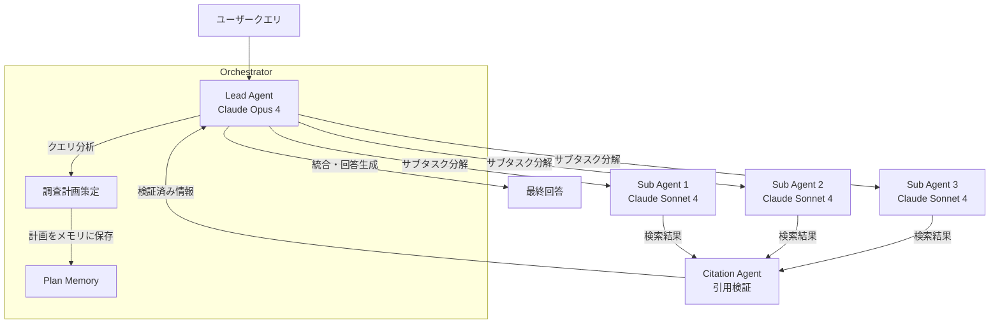

# Anthropic Engineering解説: マルチエージェント研究システムの構築

## ブログ概要

本記事は [Anthropic Engineering Blog: How we built our multi-agent research system](https://www.anthropic.com/engineering/multi-agent-research-system) の解説記事です。

Anthropicのエンジニアリングチームは、Claude.aiに搭載されるリサーチ機能の中核として**Orchestrator-workerパターン**によるマルチエージェントシステムを構築した。Lead agentがユーザークエリを分析し戦略を策定、複数のサブエージェントを並列起動してWeb検索・情報収集を実行、CitationAgentが引用の正確性を検証した上で最終回答を統合する。ブログによると、この構成によりClaude Opus 4単体での処理と比較して**90.2%の品質向上**を達成し、並列ツール呼び出しにより複雑なクエリの調査時間を**90%削減**したと報告されている。

この記事は [Zenn記事: Claude Opus 4.7×Agentic RAGで社内検索の推論時スケーリングを実装する](https://zenn.dev/0h_n0/articles/caa33fe1c36da4) の深掘りです。

---

## 情報源

- **種別**: 企業テックブログ
- **URL**: [https://www.anthropic.com/engineering/multi-agent-research-system](https://www.anthropic.com/engineering/multi-agent-research-system)
- **組織**: Anthropic Engineering
- **著者**: Jeremy Hadfield, Barry Zhang, Kenneth Lien, Florian Scholz, Jeremy Fox, Daniel Ford
- **公開日**: 2025年6月13日

---

## 技術的背景

### 単一エージェントの限界

大規模言語モデル（LLM）を用いたリサーチタスクでは、単一エージェントが逐次的に検索・分析・回答を行うアプローチが最初に採用される。しかし、Anthropicのエンジニアチームはこのアプローチに以下の構造的な限界があると述べている。

**コンテキストウィンドウの飽和**: 複雑なリサーチクエリでは、検索結果の蓄積により200Kトークンを超過することがある。コンテキストがtruncateされると、初期の検索結果や計画が失われ、回答品質が劣化する。

**逐次処理のレイテンシ**: 単一エージェントは検索→読解→追加検索を直列に実行するため、複数の情報源を横断する調査では処理時間が線形に増加する。

**戦略的視点の欠如**: 検索結果の評価と次の検索方針の策定を同一エージェントが行うと、局所的な情報に引きずられて全体最適な調査戦略を維持しにくい。

これらの課題に対し、マルチエージェントアーキテクチャは**関心の分離（Separation of Concerns）**を導入することで、計画・実行・検証を独立したエージェントに委譲し、並列処理と品質保証を両立させる設計判断であるとブログでは説明されている。

---

## 実装アーキテクチャ

### Orchestrator-workerパターンの全体像

Anthropicのマルチエージェント研究システムは、3層の役割分担で構成される。



### Lead Agent（Orchestrator層）

Lead agentはClaude Opus 4で動作し、以下の責務を担う。

1. **クエリ分析**: ユーザーの質問を分解し、必要な情報源の種類と数を判断する
2. **調査計画の策定**: サブエージェントへの指示を具体的なサブタスクとして定義する
3. **計画のメモリ保存**: 策定した計画をメモリに明示的に保存する。ブログによると、これは200Kトークンを超過した際のtruncation対策として設計されている。コンテキストが切り詰められても計画を参照できるようにするためである
4. **結果の統合**: サブエージェントから返却された情報を統合し、最終回答を生成する

### Sub Agents（Worker層）

サブエージェントはClaude Sonnet 4で動作し、3〜5エージェントが並列に起動される。各エージェントは**interleaved thinking**（推論と行動の交互実行）を用いて検索結果を逐次評価し、追加検索の要否を自律的に判断する。ブログでは、各サブエージェントが3つ以上のツールを同時に呼び出す並列ツール実行をサポートしていると述べられている。

### Citation Agent（検証層）

Citation Agentは、サブエージェントが収集した情報と引用元URLの対応関係を検証する。引用の正確性を担保することで、ハルシネーションによる誤情報の混入を防止する。

### コンテキスト管理戦略

ブログでは、コンテキスト管理が本システムの設計上の重要課題であったと述べられている。

```python
from dataclasses import dataclass, field
from typing import Any


@dataclass
class LeadAgentMemory:
    """Lead agentの計画メモリ管理

    200Kトークン超過時のtruncation対策として、
    計画を明示的にメモリに保存する設計パターン。

    Attributes:
        plan: 調査計画の構造化データ
        sub_task_status: 各サブタスクの進捗状況
        aggregated_findings: サブエージェントからの統合結果
    """
    plan: dict[str, Any] = field(default_factory=dict)
    sub_task_status: dict[str, str] = field(default_factory=dict)
    aggregated_findings: list[dict[str, Any]] = field(default_factory=list)

    def save_plan(self, query: str, sub_tasks: list[str]) -> None:
        """調査計画をメモリに保存する

        Args:
            query: ユーザーの元クエリ
            sub_tasks: 分解されたサブタスクのリスト
        """
        self.plan = {
            "original_query": query,
            "sub_tasks": sub_tasks,
            "status": "in_progress",
        }
        for task in sub_tasks:
            self.sub_task_status[task] = "pending"

    def update_task_result(
        self, task: str, result: dict[str, Any]
    ) -> None:
        """サブタスク完了時に結果を記録する

        Args:
            task: 完了したサブタスク名
            result: サブエージェントからの返却結果
        """
        self.sub_task_status[task] = "completed"
        self.aggregated_findings.append(
            {"task": task, "result": result}
        )
```

Lead agentが計画をメモリオブジェクトとして保持することで、コンテキストウィンドウのtruncationが発生しても調査の方向性を維持できる。この設計は、長時間のリサーチセッションにおいて特に有効であるとブログでは説明されている。

---

## Production Deployment Guide

### AWS実装パターン（コスト最適化重視）

Anthropicのブログで示されたOrchestrator-workerパターンをAWS上で実装する場合の推奨構成を、トラフィック量別に示す。コスト試算は2026年4月時点のap-northeast-1（東京）リージョン料金に基づく概算値であり、実際のコストはトラフィックパターン、バースト使用量により変動する。最新料金はAWS料金計算ツールで確認を推奨する。

| 構成 | トラフィック | AWS構成 | 月額概算 |
|------|-------------|---------|---------|
| **Small** | ~100 req/日 | Lambda + Bedrock + DynamoDB + SQS | $80-200 |
| **Medium** | ~1,000 req/日 | ECS Fargate + Bedrock + ElastiCache + SQS | $500-1,200 |
| **Large** | 10,000+ req/日 | EKS + Karpenter(Spot) + Bedrock + ElastiCache | $3,000-7,000 |

**Small構成の内訳**:
- Lambda（Lead agent + Sub agents起動）: ~$15/月（128MB, 平均60秒実行 x 500回/日）
- Bedrock API（Claude Sonnet 4）: ~$50-120/月（入力500K + 出力200Kトークン/日）
- DynamoDB On-Demand（計画メモリ・結果保存）: ~$5/月
- SQS（サブエージェント間通信）: ~$1/月
- CloudWatch Logs: ~$5/月

**Large構成の内訳**:
- EKS コントロールプレーン: ~$75/月
- EC2 Spot Instances（m6i.xlarge x 3, Karpenter管理）: ~$200-400/月（Spot割引70-90%適用）
- Bedrock API（Claude Opus 4 Lead + Sonnet 4 Sub）: ~$2,000-5,000/月
- ElastiCache（Redis, cache.r6g.large）: ~$150/月
- ALB: ~$30/月

**コスト削減テクニック**:
- **Spot Instances**: EKSワーカーノードをSpot優先にすることで最大90%削減
- **Bedrock Batch API**: 非リアルタイム処理に適用で50%削減
- **Prompt Caching**: システムプロンプト・計画テンプレートのキャッシュで30-90%削減
- **モデル選択ロジック**: 単純なクエリはSonnet 4のみ、複雑なクエリのみOpus 4をLeadに使用

### Terraformインフラコード

**Small構成（Serverless）**:

```hcl
# --- VPC基盤（NAT Gateway不使用でコスト削減） ---
resource "aws_vpc" "main" {
  cidr_block           = "10.0.0.0/16"
  enable_dns_support   = true
  enable_dns_hostnames = true

  tags = { Name = "multi-agent-research-vpc" }
}

resource "aws_subnet" "private" {
  count             = 2
  vpc_id            = aws_vpc.main.id
  cidr_block        = "10.0.${count.index + 1}.0/24"
  availability_zone = data.aws_availability_zones.available.names[count.index]

  tags = { Name = "private-${count.index}" }
}

# --- IAMロール（最小権限） ---
resource "aws_iam_role" "lead_agent_lambda" {
  name = "multi-agent-lead-lambda-role"

  assume_role_policy = jsonencode({
    Version = "2012-10-17"
    Statement = [{
      Action = "sts:AssumeRole"
      Effect = "Allow"
      Principal = { Service = "lambda.amazonaws.com" }
    }]
  })
}

resource "aws_iam_role_policy" "lead_agent_policy" {
  name = "lead-agent-policy"
  role = aws_iam_role.lead_agent_lambda.id

  # Bedrock InvokeModel + DynamoDB + SQS + CloudWatch Logs
  policy = jsonencode({
    Version = "2012-10-17"
    Statement = [
      {
        Effect   = "Allow"
        Action   = ["bedrock:InvokeModel", "bedrock:InvokeModelWithResponseStream"]
        Resource = "arn:aws:bedrock:ap-northeast-1::foundation-model/anthropic.*"
      },
      {
        Effect   = "Allow"
        Action   = ["dynamodb:PutItem", "dynamodb:GetItem", "dynamodb:UpdateItem"]
        Resource = aws_dynamodb_table.plan_memory.arn
      },
      {
        Effect   = "Allow"
        Action   = ["sqs:SendMessage", "sqs:ReceiveMessage", "sqs:DeleteMessage"]
        Resource = aws_sqs_queue.sub_agent_tasks.arn
      },
      {
        Effect   = "Allow"
        Action   = ["logs:CreateLogGroup", "logs:CreateLogStream", "logs:PutLogEvents"]
        Resource = "arn:aws:logs:*:*:*"
      }
    ]
  })
}

# --- Lambda（Lead Agent） ---
resource "aws_lambda_function" "lead_agent" {
  function_name = "multi-agent-lead"
  runtime       = "python3.12"
  handler       = "lead_agent.handler"
  role          = aws_iam_role.lead_agent_lambda.arn
  timeout       = 300  # 5分（複雑なクエリ対応）
  memory_size   = 256  # コスト最適: 最小限のメモリ

  environment {
    variables = {
      PLAN_MEMORY_TABLE   = aws_dynamodb_table.plan_memory.name
      SUB_AGENT_QUEUE_URL = aws_sqs_queue.sub_agent_tasks.url
      BEDROCK_MODEL_ID    = "anthropic.claude-sonnet-4-20250514-v1:0"
    }
  }

  tracing_config { mode = "Active" }  # X-Ray有効化
}

# --- DynamoDB（計画メモリ、On-Demand） ---
resource "aws_dynamodb_table" "plan_memory" {
  name         = "multi-agent-plan-memory"
  billing_mode = "PAY_PER_REQUEST"  # On-Demand: 低トラフィック最適
  hash_key     = "session_id"

  attribute {
    name = "session_id"
    type = "S"
  }

  server_side_encryption { enabled = true }  # KMS暗号化
  point_in_time_recovery { enabled = true }

  ttl {
    attribute_name = "expires_at"
    enabled        = true
  }
}

# --- SQS（サブエージェント間通信） ---
resource "aws_sqs_queue" "sub_agent_tasks" {
  name                       = "multi-agent-sub-tasks"
  visibility_timeout_seconds = 600  # Lambda timeout x 2
  message_retention_seconds  = 86400
  sqs_managed_sse_enabled    = true  # 暗号化

  redrive_policy = jsonencode({
    deadLetterTargetArn = aws_sqs_queue.sub_agent_dlq.arn
    maxReceiveCount     = 3  # 3回リトライ後DLQ
  })
}

resource "aws_sqs_queue" "sub_agent_dlq" {
  name                    = "multi-agent-sub-tasks-dlq"
  sqs_managed_sse_enabled = true
}

# --- CloudWatchアラーム（コスト監視） ---
resource "aws_cloudwatch_metric_alarm" "lambda_errors" {
  alarm_name          = "multi-agent-lead-errors"
  comparison_operator = "GreaterThanThreshold"
  evaluation_periods  = 2
  metric_name         = "Errors"
  namespace           = "AWS/Lambda"
  period              = 300
  statistic           = "Sum"
  threshold           = 5
  alarm_description   = "Lead agent Lambda errors > 5 in 10min"

  dimensions = {
    FunctionName = aws_lambda_function.lead_agent.function_name
  }

  alarm_actions = [aws_sns_topic.alerts.arn]
}
```

**Large構成（Container）**:

```hcl
# --- EKSクラスタ ---
module "eks" {
  source  = "terraform-aws-modules/eks/aws"
  version = "~> 20.0"

  cluster_name    = "multi-agent-research"
  cluster_version = "1.31"

  vpc_id     = aws_vpc.main.id
  subnet_ids = aws_subnet.private[*].id

  cluster_endpoint_public_access = false  # プライベートアクセスのみ

  # Karpenter用のIAMロール
  enable_karpenter = true
}

# --- Karpenter Provisioner（Spot優先） ---
resource "kubectl_manifest" "karpenter_nodepool" {
  yaml_body = yamlencode({
    apiVersion = "karpenter.sh/v1"
    kind       = "NodePool"
    metadata   = { name = "multi-agent-workers" }
    spec = {
      template = {
        spec = {
          requirements = [
            { key = "karpenter.sh/capacity-type", operator = "In", values = ["spot", "on-demand"] },
            { key = "node.kubernetes.io/instance-type", operator = "In", values = ["m6i.xlarge", "m6i.2xlarge", "m7i.xlarge"] }
          ]
        }
      }
      disruption = {
        consolidationPolicy = "WhenEmptyOrUnderutilized"
        consolidateAfter    = "30s"
      }
      limits = { cpu = "64", memory = "256Gi" }
    }
  })
}

# --- Secrets Manager（Bedrock設定） ---
resource "aws_secretsmanager_secret" "bedrock_config" {
  name       = "multi-agent/bedrock-config"
  kms_key_id = aws_kms_key.main.arn
}

# --- AWS Budgets（予算アラート） ---
resource "aws_budgets_budget" "monthly" {
  name         = "multi-agent-monthly-budget"
  budget_type  = "COST"
  limit_amount = "5000"
  limit_unit   = "USD"
  time_unit    = "MONTHLY"

  notification {
    comparison_operator       = "GREATER_THAN"
    threshold                 = 80
    threshold_type            = "PERCENTAGE"
    notification_type         = "ACTUAL"
    subscriber_email_addresses = ["ops-team@example.com"]
  }
}
```

### 運用・監視設定

**CloudWatch Logs Insights クエリ**（コスト異常検知）:

```
# 1時間あたりのBedrock トークン使用量（コスト異常検知）
fields @timestamp, @message
| filter @message like /bedrock/
| stats sum(input_tokens) as total_input, sum(output_tokens) as total_output by bin(1h)
| sort @timestamp desc
| limit 24
```

**CloudWatch Logs Insights クエリ**（レイテンシ分析）:

```
# Lead agent レイテンシ P95/P99
fields @timestamp, duration_ms
| filter event = "lead_agent_complete"
| stats percentile(duration_ms, 95) as p95, percentile(duration_ms, 99) as p99 by bin(1h)
```

**CloudWatch アラーム設定コード（Python）**:

```python
import boto3


def create_bedrock_token_alarm(
    cloudwatch: boto3.client,
    sns_topic_arn: str,
    threshold_tokens: int = 1_000_000,
) -> dict:
    """Bedrockトークン使用量スパイク検知アラームを作成する

    Args:
        cloudwatch: CloudWatch boto3クライアント
        sns_topic_arn: 通知先SNSトピックARN
        threshold_tokens: アラーム閾値（トークン数/時間）

    Returns:
        CloudWatch put_metric_alarm APIレスポンス
    """
    return cloudwatch.put_metric_alarm(
        AlarmName="multi-agent-bedrock-token-spike",
        MetricName="InputTokenCount",
        Namespace="AWS/Bedrock",
        Statistic="Sum",
        Period=3600,
        EvaluationPeriods=1,
        Threshold=threshold_tokens,
        ComparisonOperator="GreaterThanThreshold",
        AlarmActions=[sns_topic_arn],
        TreatMissingData="notBreaching",
    )
```

**X-Ray トレーシング設定コード（Python）**:

```python
from aws_xray_sdk.core import xray_recorder, patch_all

# boto3自動計装（Bedrock, DynamoDB, SQS呼び出しを自動トレース）
patch_all()


def trace_lead_agent_invocation(
    session_id: str,
    query: str,
    sub_agent_count: int,
) -> None:
    """Lead agent実行をX-Rayでトレースする

    Args:
        session_id: セッション識別子
        query: ユーザークエリ
        sub_agent_count: 起動したサブエージェント数
    """
    segment = xray_recorder.current_segment()
    segment.put_annotation("session_id", session_id)
    segment.put_annotation("sub_agent_count", sub_agent_count)
    segment.put_metadata(
        "query_info",
        {"query": query, "query_length": len(query)},
        "multi-agent",
    )
```

**Cost Explorer自動レポート（Python）**:

```python
from datetime import date, timedelta

import boto3


def get_daily_cost_report(
    ce_client: boto3.client,
    sns_client: boto3.client,
    sns_topic_arn: str,
    alert_threshold_usd: float = 100.0,
) -> dict:
    """日次コストレポートを取得し、閾値超過時にSNS通知する

    Args:
        ce_client: Cost Explorer boto3クライアント
        sns_client: SNS boto3クライアント
        sns_topic_arn: 通知先SNSトピックARN
        alert_threshold_usd: アラート閾値（USD/日）

    Returns:
        Cost Explorerレスポンス（ResultsByTime）
    """
    today = date.today()
    yesterday = today - timedelta(days=1)

    response = ce_client.get_cost_and_usage(
        TimePeriod={
            "Start": yesterday.isoformat(),
            "End": today.isoformat(),
        },
        Granularity="DAILY",
        Metrics=["UnblendedCost"],
        Filter={
            "Tags": {
                "Key": "Project",
                "Values": ["multi-agent-research"],
            }
        },
        GroupBy=[
            {"Type": "DIMENSION", "Key": "SERVICE"},
        ],
    )

    total_cost = sum(
        float(group["Metrics"]["UnblendedCost"]["Amount"])
        for result in response["ResultsByTime"]
        for group in result["Groups"]
    )

    if total_cost > alert_threshold_usd:
        sns_client.publish(
            TopicArn=sns_topic_arn,
            Subject=f"[ALERT] Multi-Agent daily cost: ${total_cost:.2f}",
            Message=(
                f"日次コストが閾値 ${alert_threshold_usd} を超過しました。\n"
                f"合計: ${total_cost:.2f}\n"
                f"対象日: {yesterday.isoformat()}"
            ),
        )

    return response
```

### コスト最適化チェックリスト

**アーキテクチャ選択**:
- [ ] トラフィック量に基づく構成選択（~100 req/日: Serverless、~1000: Hybrid、10000+: Container）
- [ ] Lead agentとSub agentのモデル分離（Opus/Sonnet）でコスト最適化

**リソース最適化**:
- [ ] EC2: Spot Instances優先（Karpenter `spot` 優先設定）
- [ ] Reserved Instances: 安定ワークロードに1年コミット（最大72%削減）
- [ ] Savings Plans: Compute Savings Plans検討
- [ ] Lambda: メモリサイズ最適化（Power Tuningで計測）
- [ ] ECS/EKS: アイドル時スケールダウン（Karpenter consolidation）
- [ ] NAT Gateway: 不要な場合は削除（VPCエンドポイント使用）

**LLMコスト削減**:
- [ ] Bedrock Batch API: 非リアルタイム処理に適用（50%削減）
- [ ] Prompt Caching有効化: システムプロンプト・計画テンプレート（30-90%削減）
- [ ] モデル選択ロジック: クエリ複雑度に応じたOpus/Sonnet切り替え
- [ ] トークン数制限: 出力トークン上限設定
- [ ] 不要なコンテキスト除去: 検索結果のサマリ化

**監視・アラート**:
- [ ] AWS Budgets: 月次予算アラート（80%/100%閾値）
- [ ] CloudWatch アラーム: Lambda エラー率、Bedrock トークンスパイク
- [ ] Cost Anomaly Detection: 異常コスト自動検知
- [ ] 日次コストレポート: Cost Explorer API + SNS通知

**リソース管理**:
- [ ] 未使用リソース削除: 定期的なリソース棚卸し
- [ ] タグ戦略: `Project`, `Environment`, `CostCenter` タグ必須
- [ ] ライフサイクルポリシー: DynamoDB TTL、S3ライフサイクル設定
- [ ] 開発環境夜間停止: EKSノードのスケジュールスケーリング
- [ ] CloudWatch Logs保持期間: 本番90日、開発30日

---

## パフォーマンス最適化

### マルチエージェント vs 単一エージェントの性能比較

ブログによると、Anthropicのエンジニアチームは性能評価において以下の結果を報告している。

**品質向上**: Claude Opus 4をLead agent、Claude Sonnet 4をサブエージェントとするマルチエージェント構成は、単一のClaude Opus 4と比較して**90.2%のケースで優れた回答**を生成した。この評価はBrowseCompベンチマークを含む複数の評価基準で実施されている。

**トークン使用量の分析**: ブログでは、BrowseComp評価における性能の95%を3つの要因で説明できると報告されており、そのうち**トークン使用量が80%**を占める。マルチエージェント構成のトークン消費量は通常のチャットの約15倍（単一エージェントの約4倍）であるが、情報の網羅性と正確性の向上によりコスト対効果は正当化されると述べられている。

**並列処理による時間短縮**: 3〜5のサブエージェントが各3つ以上のツールを同時実行する並列構成により、複雑なクエリの調査時間が**90%削減**された。

**ツール設計の最適化**: ブログによると、MCP（Model Context Protocol）ツールの説明文を書き換えるツールテストエージェントの導入により、タスク完了時間が**40%短縮**された。ツールインターフェースの設計がエージェントの性能に直接影響することを示す結果である。

### トークン効率の数式的理解

マルチエージェント構成のトークン効率を以下のように定式化できる。

$$
\text{Efficiency} = \frac{\text{Quality Score}_{multi}}{\text{Token Cost}_{multi}} \bigg/ \frac{\text{Quality Score}_{single}}{\text{Token Cost}_{single}}
$$

ここで、
- $\text{Quality Score}_{multi}$: マルチエージェント構成の品質スコア
- $\text{Token Cost}_{multi}$: マルチエージェント構成の総トークン消費量
- $\text{Quality Score}_{single}$: 単一エージェントの品質スコア
- $\text{Token Cost}_{single}$: 単一エージェントの総トークン消費量

ブログの報告値から、$\text{Token Cost}_{multi} \approx 4 \times \text{Token Cost}_{single}$ であり、品質が90.2%のケースで上回ることから、トークン量あたりの品質向上は並列化による情報網羅性の改善に起因すると考えられる。

---

## 運用での学び

### 7つのプロンプティング原則からの深掘り

ブログではマルチエージェントシステム構築における7つのプロンプティング原則が提示されている。ここでは特に実務的な影響が大きい3つを深掘りする。

#### 原則1: Think like your agents

Anthropicのエンジニアチームは、プロンプトを書く前に**エージェントの立場でシミュレーション**を構築することを推奨している。具体的には、Lead agentが受け取るクエリを自分で処理する場合にどのような手順を踏むかを書き出し、その手順をプロンプトに反映する。これにより、エージェントの行動予測精度が向上し、不要なリトライが減少するとブログでは述べられている。

#### 原則3: Scale effort to complexity

すべてのクエリに同一のリソースを投入するのではなく、**クエリの複雑度に応じてサブエージェント数とトークン予算を動的に調整**する。単純な事実確認は1エージェントで処理し、複数情報源の横断比較が必要なクエリのみ5エージェントを並列起動する。ブログによると、この動的スケーリングによりトークンコストを抑えつつ品質を維持できると報告されている。

#### 原則4: Tool design criticality

ツールのインターフェース設計（関数名、引数名、説明文）がエージェントの性能を大きく左右する。ブログでは、MCPツールの説明文をツールテストエージェントが自律的に書き換えることでタスク完了時間が40%短縮された事例が紹介されている。ツールの「使い方」を人間が理解できるように設計するのではなく、**LLMが正確に呼び出せる**ように設計することが重要である。

### 本番運用の課題と対策

**Stateful agentsの累積エラー対策**: マルチエージェントシステムでは、各エージェントの小さなエラーが伝播・累積する。ブログでは、リトライ機構とチェックポイント機構を組み合わせることで、エラーの影響を局所化する設計が採用されていると述べられている。

**フルトレーシング**: すべてのエージェント間通信をトレーシングすることで、デバッグ可能性を確保している。ブログによると、マルチエージェントシステムのデバッグはログだけでは困難であり、リクエスト単位でのエンドツーエンドトレースが不可欠であるとしている。

**Rainbow deployments**: 新バージョンのデプロイ時に段階的にトラフィックを移行する手法を採用している。ブログでは、マルチエージェントシステムの挙動予測が困難であるため、全トラフィックの一斉切り替えではなく漸進的な移行が本番運用には必要であると述べられている。

**同期実行のボトルネック**: Lead agentがサブエージェントの完了を同期的に待機する設計上の制約がある。ブログでは、この待機時間がレイテンシの主要因であり、非同期実行やストリーミング統合による改善が今後の課題として挙げられている。

### 評価手法

ブログによると、評価は3段階で実施されている。

1. **小サンプル評価**: 20クエリの代表セットで素早くイテレーション
2. **LLM-as-judge**: 正確性、引用品質、完全性、ソース品質、ツール効率の5軸で自動評価
3. **人間評価**: LLM-as-judgeの結果を人間が検証し、最終的な品質判断を行う

---

## 学術研究との関連

Anthropicのマルチエージェント研究システムは、学術的には以下の研究と関連が深い。

**A-RAG（Adaptive RAG）**: クエリの複雑度に応じて検索戦略を動的に切り替えるフレームワーク。Anthropicの「Scale effort to complexity」原則は、A-RAGの適応的ルーティングと類似した設計思想を持つ。ただし、A-RAGが単一モデル内での切り替えを主眼とするのに対し、Anthropicのアプローチはモデル間の役割分担（Opus/Sonnet）を含む点で拡張されている。

**Self-RAG**: 検索結果の自己評価と再検索を行うフレームワーク。Anthropicのサブエージェントがinterleaved thinkingで検索結果を逐次評価する機構は、Self-RAGの自己反省（self-reflection）メカニズムをマルチエージェント環境に適用したものと位置づけられる。

**Orchestrator-workerパターンの学術的系譜**: このパターンは分散システム研究における**Master-Worker**パターンに起源を持つ。LLMエージェント文脈では、AutoGen（Microsoft Research）やCrewAIが同様のパターンを実装しているが、Anthropicのアプローチはモデル間の性能差（Opus vs Sonnet）を活用したコスト最適化と、CitationAgentによる引用検証層の追加が特徴的である。

---

## まとめと実践への示唆

Anthropicのマルチエージェント研究システムは、Orchestrator-workerパターンにより単一エージェントの構造的限界を克服した事例として、RAGシステム設計に重要な示唆を与える。特に、Lead agentの計画メモリ保存によるコンテキスト管理、クエリ複雑度に応じた動的スケーリング、ツールインターフェース設計の最適化は、自社のRAGシステムに適用可能な知見である。一方で、トークン消費量が15倍に増加する点、同期実行のレイテンシ課題、Rainbow deploymentsの運用コストは、導入時のトレードオフとして考慮する必要がある。ブログで報告された定量的な成果を参考に、自社のユースケースにおけるコスト対効果を慎重に評価した上で導入を検討することが推奨される。

---

## 参考文献

- **Blog URL**: [How we built our multi-agent research system](https://www.anthropic.com/engineering/multi-agent-research-system) - Anthropic Engineering, 2025年6月13日
- **Related Zenn article**: [Claude Opus 4.7×Agentic RAGで社内検索の推論時スケーリングを実装する](https://zenn.dev/0h_n0/articles/caa33fe1c36da4)
- **A-RAG (Adaptive RAG)**: Jeong et al., "Adaptive-RAG: Learning to Adapt Retrieval-Augmented Large Language Models through Question Complexity", 2024
- **Self-RAG**: Asai et al., "Self-RAG: Learning to Retrieve, Generate, and Critique through Self-Reflection", NeurIPS 2023
- **AutoGen**: Wu et al., "AutoGen: Enabling Next-Gen LLM Applications via Multi-Agent Conversation", Microsoft Research, 2023
- **BrowseComp**: OpenAI, "BrowseComp: A Simple Challenge for Browsing Agents", 2025
