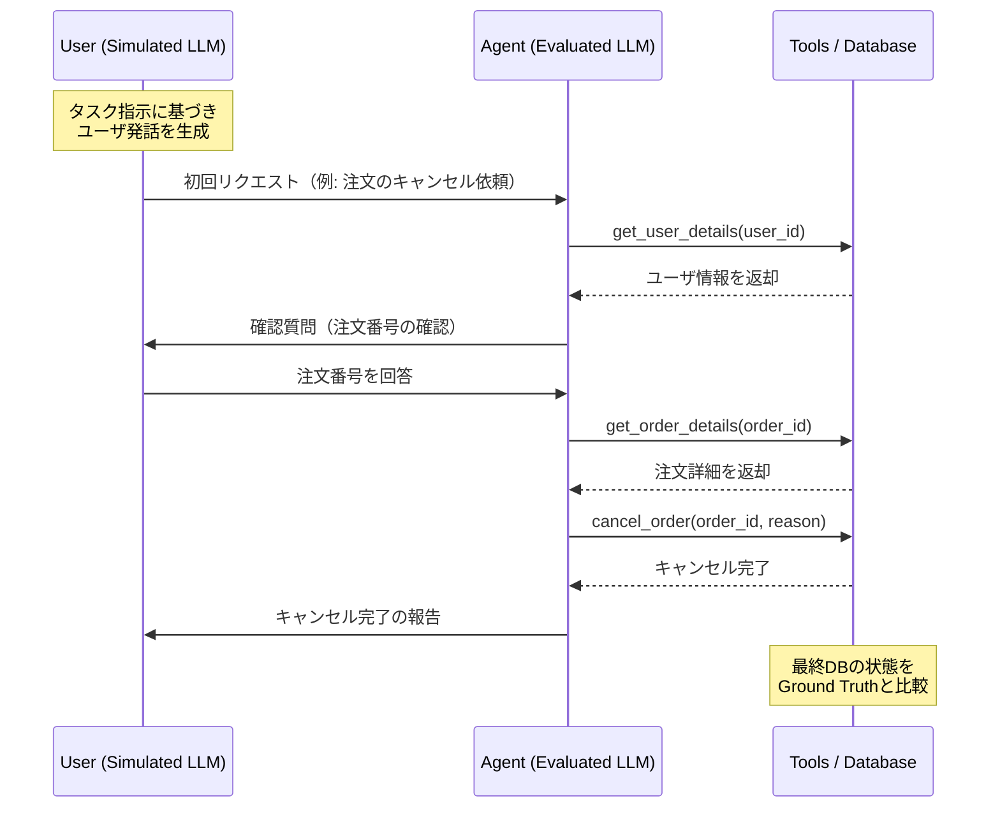
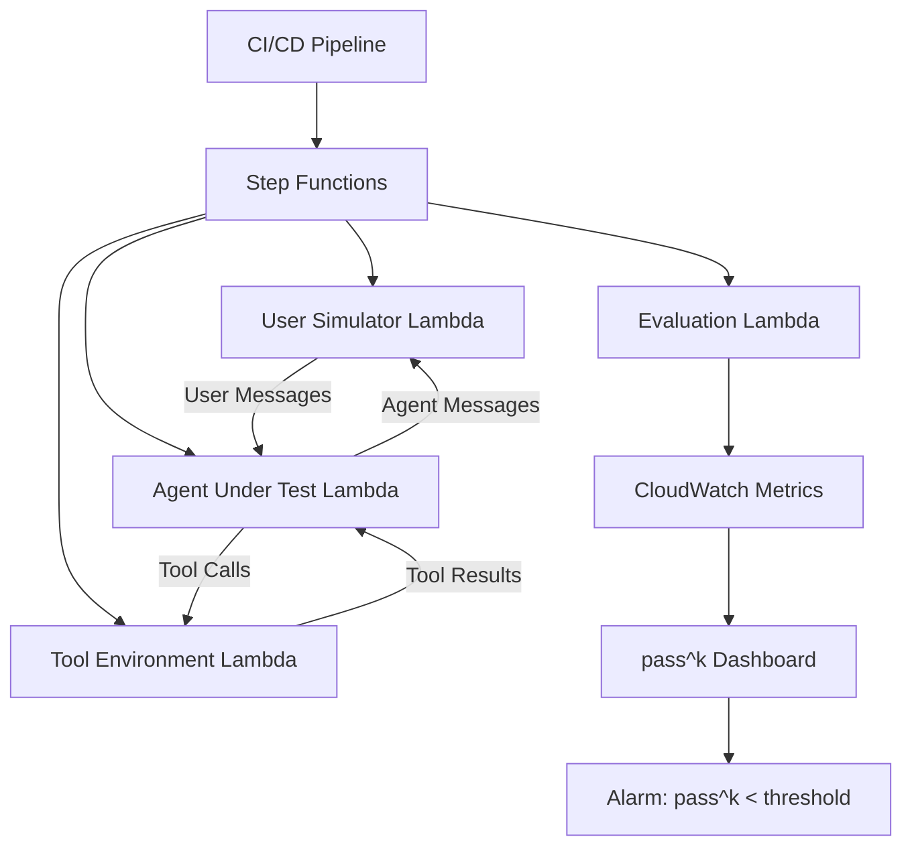

本記事は [arXiv:2406.12045](https://arxiv.org/abs/2406.12045) の解説記事です。

## 論文概要（Abstract）

Yao, Shinn, Razavi, Narasimhan（2024）は、LLMエージェントのツール使用能力・ポリシー準拠・ユーザインタラクション能力を包括的に評価するベンチマークτ-bench（Tool-Agent-User Interaction Benchmark）を提案した。従来のベンチマークが静的な入出力ペアや単純なツール呼び出しを評価していたのに対し、τ-benchはカスタマーサービスドメイン（retail・airline）において、シミュレートされたユーザとの動的な対話を通じた複雑なタスク遂行能力を測定する。著者らは評価指標として $pass^k$ メトリクスを導入し、LLMエージェントの信頼性を定量化している。最も高性能なモデル（GPT-4o）でも retail ドメインの $pass@1$ は44.2%にとどまり、現行のLLMエージェントがポリシー準拠タスクにおいて十分な信頼性を達成していないことを示した。

この記事は [Zenn記事: Deep AgentsのHarness Profilesでモデル別エージェント挙動を制御する](https://zenn.dev/0h_n0/articles/b9a0f33be2f0ac) の深掘りです。

## 情報源

- **arXiv ID**: 2406.12045
- **URL**: [https://arxiv.org/abs/2406.12045](https://arxiv.org/abs/2406.12045)
- **著者**: Shunyu Yao, Noah Shinn, Pedram Razavi, Karthik Narasimhan
- **所属**: Princeton University / Salesforce Research
- **発表年**: 2024年6月
- **分野**: cs.AI, cs.CL

## 背景と動機（Background & Motivation）

LLMエージェントの研究は、コード生成（HumanEval）、推論（GSM8K）、ツール使用（ToolBench）など個別能力の評価から発展してきた。しかし実世界のエージェント応用では、これらの能力を統合して動的な環境で運用する必要がある。特にカスタマーサービスのようなドメインでは、以下の3つの能力が同時に要求される。

1. **ツール使用能力**: データベース参照、注文変更、返品処理などのAPIを正確に呼び出す
2. **ポリシー準拠**: ドメイン固有のルール文書（返品条件、決済方法制約など）に厳密に従う
3. **ユーザインタラクション**: 曖昧な要求の明確化、確認の取得、適切な情報提供を含む対話を遂行する

従来のベンチマークには以下の限界があった。ToolBench（Qin et al., 2024）はツール呼び出しの正確性を評価するが、複雑なポリシー準拠は扱わない。AgentBench（Liu et al., 2023）はウェブ操作やOS操作を含むが、自然言語の対話ルールへの準拠は評価しない。WebArena（Zhou et al., 2024）はウェブ環境でのエージェント評価を行うが、ユーザとのマルチターン対話は含まない。

著者らはこれらの限界を踏まえ、「ツール・エージェント・ユーザの三者間インタラクション」を一貫して評価するベンチマークの必要性を主張している。

## 主要な貢献（Key Contributions）

- **貢献1**: カスタマーサービスドメインにおけるツール・ポリシー・ユーザインタラクションの統合ベンチマークτ-benchの構築。retail（115タスク）とairline（50タスク）の2ドメインを提供
- **貢献2**: $pass^k$ メトリクスの導入。k回の独立試行すべてが成功する確率を測定し、エージェントの信頼性を定量化
- **貢献3**: 主要LLM（GPT-4o, Claude 3 Opus, Gemini 1.5 Pro等）の包括的評価。最高性能モデルでも $pass@1$ が約50%にとどまることを実証
- **貢献4**: タスク難易度（適用すべきルール数）とエージェント性能の関係を分析し、ルール数増加に伴う性能低下を定量的に示した

## 技術的詳細（Technical Details）

### ベンチマークアーキテクチャ

τ-benchは、LLMエージェント・シミュレートされたユーザ・ツール環境（データベース+API）の三者間インタラクションを模擬する。全体のアーキテクチャを以下に示す。



**エージェント（被評価LLM）** はシステムプロンプトとしてドメイン固有のポリシー文書を受け取り、ユーザからのリクエストに対して適切なツールを呼び出しながらタスクを遂行する。**シミュレートされたユーザ（GPT-4o）** はタスク指示書に基づいて自然言語で応答し、実際の顧客の行動を模擬する。タスク完了後、**データベースの最終状態**がground truthと一致するかどうかで成否を判定する。

### ドメイン設計

#### Retailドメイン（115タスク）

Retailドメインでは、ECサイトのカスタマーサービスを模擬する。データベースは以下の3テーブルで構成される。

- **顧客プロファイル**: ユーザID、氏名、メールアドレス、住所、決済手段
- **注文履歴**: 注文ID、商品リスト、ステータス（pending/shipped/delivered）、決済方法
- **商品カタログ**: 商品ID、名称、価格、カテゴリ、在庫状況

利用可能なツールは以下の通りである。

| ツール名 | 機能 |
|---------|------|
| `get_user_details` | ユーザ情報の取得 |
| `get_order_details` | 注文詳細の取得 |
| `modify_order` | 注文内容の変更（ステータス・アイテム） |
| `return_delivered_order_items` | 配達済み商品の返品処理 |
| `cancel_order` | 注文キャンセル |
| `exchange_delivered_order_items` | 配達済み商品の交換 |
| `modify_user_address` | ユーザ住所の変更 |
| `calculate` | 計算処理（返金額の算出等） |
| `think` | エージェントの内部思考（ツール呼び出しなし） |

ポリシー文書には、注文変更の条件（ステータスがpendingの場合のみ変更可能等）、返品・返金ポリシー（配達後30日以内、元の決済方法への返金等）、決済方法に関するルール（ギフトカードの取り扱い等）が定められている。

#### Airlineドメイン（50タスク）

Airlineドメインでは航空会社のカスタマーサービスを模擬する。データベースは旅客プロファイル、フライト情報、予約詳細で構成される。ツールとして `get_user_details`、`get_reservation_details`、`get_flight_details`、`search_direct_flight`、`update_reservation_flights`、`cancel_reservation` 等が提供される。ポリシー文書には再予約ルール、キャンセル・返金ポリシー、手荷物ポリシーが含まれる。

### $pass^k$ メトリクス

τ-benchの中核的な評価指標が $pass^k$ メトリクスである。これは従来の $pass@k$（k回中少なくとも1回成功する確率）とは逆の指標であり、k回の独立試行すべてが成功する確率を測定する。

**定義**: あるタスク $i$ の成功確率を $p_i$ とすると、k回の独立試行すべてが成功する確率は以下で定義される。

$$
pass^k_i = p_i^k
$$

ベンチマーク全体の $pass^k$ は全タスクの平均として計算される。

$$
pass^k = \frac{1}{N} \sum_{i=1}^{N} p_i^k
$$

ここで $N$ はタスク総数である。

**$pass@k$ との対比**: $pass@k$ はk回中1回でも成功すれば良い楽観的な指標であり、以下で定義される。

$$
pass@k_i = 1 - (1 - p_i)^k
$$

$pass@k$ は研究開発段階（「少なくとも1回は正しく動作するか」）の評価に適するが、プロダクション環境では「毎回正しく動作するか」が重要である。$pass^k$ はこのプロダクション要件を反映した指標であり、kが増加するほど急速に低下する。

**数値例（GPT-4o, Retail, 論文 Table 2 より）**:

| k | $pass^k$ |
|---|----------|
| 1 | 44.2% |
| 2 | 31.7% |
| 3 | 24.5% |
| 5 | 15.9% |

$k=5$ で $pass^k$ が15.9%まで低下する点は、GPT-4oクラスのモデルであっても「5回連続で正しくタスクを遂行する」ことが極めて難しいことを示している。著者らはこの結果を「現行LLMエージェントの信頼性が、プロダクション要件と大きく乖離している」と解釈している。

### think()ツールの設計

τ-benchの独自機能として `think()` ツールがある。これはReAct（Yao et al., 2023）のreasoningステップに相当し、エージェントが行動を起こす前に内部推論を明示的に行うためのツールである。`think()` は外部環境に一切の副作用を持たず、エージェントの推論過程をトレース可能にする。

著者らの実験（論文 Table 3 より）によると、`think()` ツールの使用は $pass@1$ を +3 から +8 ポイント改善する。GPT-4o の retail ドメインでは +6.1pp の改善が報告されている。この結果は、明示的な推論ステップがポリシー準拠タスクにおいて有効であることを示唆する。

### タスク難易度と性能の関係

著者らは各タスクの難易度を「そのタスクの正解に必要なポリシールール数」で定義している（論文 Section 4.3 より）。GPT-4oのretailドメインにおける難易度別の $pass@1$ は以下の通りである。

| 難易度 | 適用ルール数 | $pass@1$（概算） |
|--------|------------|----------------|
| Easy | 1-2 rules | 約70% |
| Medium | 3-4 rules | 約45% |
| Hard | 5+ rules | 約25% |

ルール数が増加するに従い性能が急激に低下する傾向が見られる。この結果は、LLMが長いコンテキスト内の複数のルールを同時に考慮・適用する能力に限界があることを示唆している。

### 評価パイプライン

タスクの成否判定は以下の手順で行われる。

1. エージェントがタスクを完了（またはタイムアウト）
2. データベースの最終状態を取得
3. Ground truth（期待される最終状態）と比較
4. すべてのフィールドが一致すれば成功、一つでも不一致があれば失敗

この評価方式は中間ステップの評価を行わず、最終状態のみで判定する。著者らはこの設計を「多様な解法を許容しつつ、結果の正確性を厳密に評価する」と説明している。

## 実装のポイント（Implementation）

### τ-benchの再現実装

τ-benchの評価環境を再現する場合の主要な実装ポイントを以下にまとめる。

**ユーザシミュレータの構成**: ユーザシミュレータはGPT-4oをベースとし、タスク指示書に基づいて応答を生成する。タスク指示書には、ユーザの目的、提供すべき情報（注文番号、ユーザID等）、応答のトーン（丁寧/怒りなど）が記載されている。

```python
from dataclasses import dataclass
from typing import Any

from pydantic import BaseModel, Field


class UserInstruction(BaseModel):
    """タスク指示書のスキーマ（論文 Section 3 のタスク定義に基づく）"""

    task_id: str = Field(description="タスクID")
    user_goal: str = Field(description="ユーザの目的")
    user_info: dict[str, Any] = Field(
        description="ユーザが提供する情報（注文番号、氏名等）"
    )
    tone: str = Field(
        default="neutral",
        description="応答トーン（neutral/frustrated/polite）",
    )


class ToolCall(BaseModel):
    """エージェントのツール呼び出し"""

    tool_name: str = Field(description="ツール名")
    arguments: dict[str, Any] = Field(description="ツール引数")


@dataclass
class ConversationTurn:
    """1ターンの対話"""

    role: str  # "user", "agent", "tool_result"
    content: str
    tool_call: ToolCall | None = None
```

**データベース環境の構成**: 各タスクに対してデータベースの初期状態が定義されており、エージェントのツール呼び出しによって状態が更新される。

```python
import copy
import json
from pathlib import Path
from typing import Any

from pydantic import BaseModel, Field


class DatabaseState(BaseModel):
    """データベース状態（Retailドメイン、論文 Section 3.1 に基づく）"""

    users: dict[str, dict[str, Any]] = Field(default_factory=dict)
    orders: dict[str, dict[str, Any]] = Field(default_factory=dict)
    products: dict[str, dict[str, Any]] = Field(default_factory=dict)


class TaskEnvironment:
    """τ-benchタスク環境"""

    def __init__(self, initial_state: DatabaseState) -> None:
        self._state = copy.deepcopy(initial_state)
        self._action_log: list[dict[str, Any]] = []

    def execute_tool(
        self, tool_name: str, arguments: dict[str, Any]
    ) -> dict[str, Any]:
        """ツールを実行してDB状態を更新する"""
        handler = self._get_handler(tool_name)
        result = handler(**arguments)
        self._action_log.append(
            {"tool": tool_name, "args": arguments, "result": result}
        )
        return result

    def get_final_state(self) -> DatabaseState:
        """最終DB状態を取得（Ground Truthとの比較用）"""
        return copy.deepcopy(self._state)

    def _get_handler(self, tool_name: str) -> Any:
        handlers = {
            "get_user_details": self._get_user_details,
            "get_order_details": self._get_order_details,
            "cancel_order": self._cancel_order,
            "think": self._think,
        }
        if tool_name not in handlers:
            raise ValueError(f"Unknown tool: {tool_name}")
        return handlers[tool_name]

    def _get_user_details(self, user_id: str) -> dict[str, Any]:
        return self._state.users.get(user_id, {})

    def _get_order_details(self, order_id: str) -> dict[str, Any]:
        return self._state.orders.get(order_id, {})

    def _cancel_order(
        self, order_id: str, reason: str
    ) -> dict[str, Any]:
        order = self._state.orders.get(order_id)
        if order is None:
            return {"success": False, "error": "Order not found"}
        if order["status"] != "pending":
            return {
                "success": False,
                "error": f"Cannot cancel order with status: {order['status']}",
            }
        order["status"] = "cancelled"
        order["cancellation_reason"] = reason
        return {"success": True, "order_id": order_id}

    def _think(self, thought: str) -> dict[str, Any]:
        """think()ツール: 副作用なし、推論トレース用"""
        return {"thought_recorded": True}


def evaluate_task(
    final_state: DatabaseState,
    ground_truth: DatabaseState,
) -> bool:
    """最終DB状態をGround Truthと比較"""
    return final_state.model_dump() == ground_truth.model_dump()
```

### $pass^k$ メトリクスの計算

```python
import numpy as np
from pydantic import BaseModel, Field


class PassKResult(BaseModel):
    """pass^kメトリクスの計算結果"""

    k: int = Field(description="試行回数")
    pass_k: float = Field(description="pass^k値")
    per_task: list[float] = Field(
        description="タスクごとのpass^k値"
    )


def estimate_pass_k(
    results: list[list[bool]],
    k: int,
) -> PassKResult:
    """pass^kを推定する

    Args:
        results: タスクごとの試行結果リスト
                 results[i][j] = タスクiのj回目の試行の成否
        k: 連続成功回数

    Returns:
        PassKResult: pass^kの推定値
    """
    per_task_pass_k: list[float] = []
    for task_results in results:
        n_trials = len(task_results)
        n_success = sum(task_results)
        p_hat = n_success / n_trials  # 成功確率の推定値
        pass_k_i = p_hat**k  # pass^k_i = p_i^k
        per_task_pass_k.append(pass_k_i)

    avg_pass_k = float(np.mean(per_task_pass_k))
    return PassKResult(k=k, pass_k=avg_pass_k, per_task=per_task_pass_k)
```

## Production Deployment Guide

τ-benchの評価フレームワークをプロダクション環境でのエージェント品質モニタリングに応用する場合の構成を示す。τ-benchの設計思想（ポリシー準拠 + ツール使用 + ユーザインタラクション の統合評価）は、カスタマーサービスAIの本番品質保証に直接転用できる。

### AWS実装パターン

以下の構成は、エージェントのリリース前テストおよび本番環境での継続的品質モニタリングを想定している。

コスト試算は2026年5月時点のAWS ap-northeast-1（東京）リージョン料金に基づく概算値であり、実際のコストはトラフィックパターン、テスト頻度、モデル選択により変動する。

| 構成 | 用途 | 主要サービス | 月額概算 |
|------|------|-------------|---------|
| CI/CD統合 | リリース前ゲート | Lambda + Step Functions + Bedrock | $50-200 |
| 継続的モニタリング | 本番品質監視 | ECS Fargate + Bedrock + CloudWatch | $300-800 |
| 大規模回帰テスト | 多モデル比較 | EKS + Batch + Bedrock | $1,500-4,000 |

### アーキテクチャ概要



### Terraformインフラコード

#### CI/CD統合構成: Step Functions によるτ-bench評価パイプライン

```hcl
# --- CI/CD統合: τ-bench評価パイプライン ---
# Step Functions で対話ループを制御し、Bedrock で推論

terraform {
  required_version = ">= 1.9"
  required_providers {
    aws = {
      source  = "hashicorp/aws"
      version = "~> 5.80"
    }
  }
}

provider "aws" {
  region = "ap-northeast-1"
}

# --- IAM: 評価パイプライン用ロール ---
resource "aws_iam_role" "tau_bench_evaluator" {
  name = "tau-bench-evaluator"
  assume_role_policy = jsonencode({
    Version = "2012-10-17"
    Statement = [{
      Action    = "sts:AssumeRole"
      Effect    = "Allow"
      Principal = { Service = "lambda.amazonaws.com" }
    }]
  })
}

resource "aws_iam_role_policy" "tau_bench_evaluator" {
  name = "tau-bench-evaluator-policy"
  role = aws_iam_role.tau_bench_evaluator.id
  policy = jsonencode({
    Version = "2012-10-17"
    Statement = [
      {
        Effect   = "Allow"
        Action   = ["bedrock:InvokeModel"]
        Resource = "arn:aws:bedrock:ap-northeast-1::foundation-model/*"
      },
      {
        Effect = "Allow"
        Action = [
          "dynamodb:GetItem", "dynamodb:PutItem",
          "dynamodb:UpdateItem", "dynamodb:Query"
        ]
        Resource = aws_dynamodb_table.tau_bench_state.arn
      },
      {
        Effect = "Allow"
        Action = [
          "logs:CreateLogGroup", "logs:CreateLogStream",
          "logs:PutLogEvents"
        ]
        Resource = "arn:aws:logs:*:*:*"
      },
      {
        Effect = "Allow"
        Action = ["cloudwatch:PutMetricData"]
        Resource = "*"
      }
    ]
  })
}

# --- DynamoDB: タスク環境のDB状態管理 ---
resource "aws_dynamodb_table" "tau_bench_state" {
  name         = "tau-bench-task-state"
  billing_mode = "PAY_PER_REQUEST"
  hash_key     = "task_id"
  range_key    = "trial_id"

  attribute {
    name = "task_id"
    type = "S"
  }

  attribute {
    name = "trial_id"
    type = "S"
  }

  ttl {
    attribute_name = "expires_at"
    enabled        = true
  }

  tags = {
    Project = "tau-bench-eval"
  }
}

# --- CloudWatch: pass^kメトリクスダッシュボード ---
resource "aws_cloudwatch_dashboard" "tau_bench" {
  dashboard_name = "tau-bench-pass-k"
  dashboard_body = jsonencode({
    widgets = [
      {
        type   = "metric"
        x      = 0
        y      = 0
        width  = 12
        height = 6
        properties = {
          title   = "pass^k by Model (Retail)"
          metrics = [
            ["TauBench", "PassK", "Domain", "retail", "Model", "claude-sonnet", "K", "1"],
            ["TauBench", "PassK", "Domain", "retail", "Model", "claude-sonnet", "K", "3"],
            ["TauBench", "PassK", "Domain", "retail", "Model", "claude-sonnet", "K", "5"]
          ]
          period = 86400
          stat   = "Average"
          region = "ap-northeast-1"
        }
      },
      {
        type   = "metric"
        x      = 12
        y      = 0
        width  = 12
        height = 6
        properties = {
          title   = "pass^k by Model (Airline)"
          metrics = [
            ["TauBench", "PassK", "Domain", "airline", "Model", "claude-sonnet", "K", "1"],
            ["TauBench", "PassK", "Domain", "airline", "Model", "claude-sonnet", "K", "3"],
            ["TauBench", "PassK", "Domain", "airline", "Model", "claude-sonnet", "K", "5"]
          ]
          period = 86400
          stat   = "Average"
          region = "ap-northeast-1"
        }
      }
    ]
  })
}

# --- CloudWatch Alarm: pass^k低下検知 ---
resource "aws_cloudwatch_metric_alarm" "pass_k_degradation" {
  alarm_name          = "tau-bench-pass-k-degradation"
  comparison_operator = "LessThanThreshold"
  evaluation_periods  = 1
  metric_name         = "PassK"
  namespace           = "TauBench"
  period              = 86400
  statistic           = "Average"
  threshold           = 0.3  # pass^1 < 30% でアラート
  alarm_description   = "Agent pass@1 dropped below 30%"

  dimensions = {
    Domain = "retail"
    K      = "1"
  }

  alarm_actions = [] # SNS Topic ARN をここに追加
}
```

### 評価ランナーの実装

```python
"""τ-bench評価ランナー（Production Deployment用）

CloudWatch Metricsにpass^kを送信し、
エージェント品質の継続的モニタリングを実現する。
"""

import json
import time
from typing import Any

import boto3
from pydantic import BaseModel, Field

bedrock = boto3.client("bedrock-runtime", region_name="ap-northeast-1")
cloudwatch = boto3.client("cloudwatch", region_name="ap-northeast-1")
dynamodb = boto3.resource("dynamodb", region_name="ap-northeast-1")


class EvalConfig(BaseModel):
    """評価設定"""

    model_id: str = Field(description="Bedrock モデルID")
    domain: str = Field(description="評価ドメイン（retail/airline）")
    n_trials: int = Field(default=5, description="タスクあたりの試行回数")
    max_turns: int = Field(default=20, description="最大対話ターン数")


def run_single_trial(
    config: EvalConfig,
    task: dict[str, Any],
) -> bool:
    """1タスク1試行を実行し、成否を返す"""
    db_state = json.loads(json.dumps(task["initial_db_state"]))
    conversation: list[dict[str, str]] = []
    system_prompt = task["policy_document"]

    for turn in range(config.max_turns):
        if turn == 0:
            user_msg = task["initial_user_message"]
        else:
            user_msg = _simulate_user(
                task["user_instruction"], conversation
            )

        conversation.append({"role": "user", "content": user_msg})

        agent_response = _invoke_agent(
            config.model_id, system_prompt, conversation
        )

        if agent_response.get("tool_calls"):
            for tc in agent_response["tool_calls"]:
                result = _execute_tool(tc, db_state)
                conversation.append(
                    {"role": "tool", "content": json.dumps(result)}
                )

        conversation.append(
            {"role": "assistant", "content": agent_response["text"]}
        )

        if agent_response.get("task_complete"):
            break

    return db_state == task["ground_truth_db_state"]


def publish_pass_k(
    config: EvalConfig,
    results: list[list[bool]],
) -> None:
    """pass^kメトリクスをCloudWatchに送信"""
    for k in [1, 3, 5]:
        per_task = [
            (sum(r) / len(r)) ** k for r in results
        ]
        avg_pass_k = sum(per_task) / len(per_task)

        cloudwatch.put_metric_data(
            Namespace="TauBench",
            MetricData=[
                {
                    "MetricName": "PassK",
                    "Dimensions": [
                        {"Name": "Domain", "Value": config.domain},
                        {"Name": "Model", "Value": config.model_id},
                        {"Name": "K", "Value": str(k)},
                    ],
                    "Value": avg_pass_k,
                    "Unit": "None",
                    "Timestamp": time.time(),
                }
            ],
        )


def _invoke_agent(
    model_id: str,
    system_prompt: str,
    conversation: list[dict[str, str]],
) -> dict[str, Any]:
    """Bedrock経由でエージェントを呼び出す（実装は省略）"""
    raise NotImplementedError


def _simulate_user(
    instruction: dict[str, Any],
    conversation: list[dict[str, str]],
) -> str:
    """ユーザシミュレータ（実装は省略）"""
    raise NotImplementedError


def _execute_tool(
    tool_call: dict[str, Any],
    db_state: dict[str, Any],
) -> dict[str, Any]:
    """ツール実行（実装は省略）"""
    raise NotImplementedError
```

### 運用上の注意点

**ユーザシミュレータのコスト**: τ-bench方式では1タスクあたりユーザシミュレータ（GPT-4o相当）とエージェント（被評価LLM）の2つのLLM呼び出しが発生する。$n$ タスク $\times$ $k$ 試行 $\times$ 平均ターン数 $t$ のAPI呼び出しが必要であり、retail全115タスクを $k=5$ で評価する場合、約5,750回の対話ターンが発生する。

**評価の再現性**: LLMの出力は確率的であるため、同一タスクでも試行ごとに異なる結果が得られる。$pass^k$ メトリクスはこの非決定性を前提とした指標だが、有意な変化検知のためには十分な試行回数が必要である。著者らは論文中で各タスク5回の試行を用いている。

**ポリシー文書の管理**: プロダクション環境ではポリシー文書が頻繁に更新される。ポリシー変更時にはτ-benchのground truthも更新する必要がある。バージョン管理とテストケースの連動が重要である。

## 実験結果（Results）

### モデル比較（論文 Table 1 より）

著者らは主要なLLMについて $pass@1$ を測定している。各値は複数回の試行の平均である。

**Retailドメイン（115タスク）**:

| モデル | $pass@1$ |
|--------|----------|
| GPT-4o | 44.2% |
| GPT-4-Turbo | 36.0% |
| GPT-3.5-Turbo | 21.2% |
| Claude 3 Opus | 43.5% |
| Claude 3 Sonnet | 35.4% |
| Claude 3 Haiku | 30.3% |
| Llama-3-70B | 23.1% |
| Gemini 1.5 Pro | 41.8% |

**Airlineドメイン（50タスク）**:

| モデル | $pass@1$ |
|--------|----------|
| GPT-4o | 53.0% |
| GPT-4-Turbo | 46.0% |
| GPT-3.5-Turbo | 30.0% |
| Claude 3 Opus | 50.0% |
| Claude 3 Sonnet | 44.0% |
| Gemini 1.5 Pro | 46.0% |

いくつかの注目すべき傾向が読み取れる。

1. **全モデルで $pass@1$ が50%前後以下**: 最高性能のGPT-4oでもretailで44.2%、airlineで53.0%にとどまる。カスタマーサービスの品質要件（一般に90%以上の正確性が求められる）との乖離が大きい
2. **ドメイン間の差異**: airlineドメインの方がretailよりも高い $pass@1$ を示す。著者らはairlineドメインのタスク数が少ない（50 vs 115）ことに加え、retailのポリシーがより複雑であることを理由として挙げている
3. **モデルサイズと性能の相関**: GPT-4oとGPT-3.5-Turboの差は約20ppであり、モデル能力がエージェント性能に直結する傾向が見られる

### $pass^k$ の急激な低下

GPT-4oのretailドメインにおける $pass^k$ の推移（論文 Table 2 より）は以下の通りである。

$$
pass^1 = 44.2\%, \quad pass^2 = 31.7\%, \quad pass^3 = 24.5\%, \quad pass^5 = 15.9\%
$$

$k=1$ から $k=5$ にかけて $pass^k$ は約3分の1に低下する。この低下率は、個々のタスクの成功確率 $p_i$ が一様でないことに起因する。仮に全タスクの成功確率が均一に $p = 0.442$ であれば $pass^5 = 0.442^5 \approx 1.6\%$ となるが、実際には $pass^5 = 15.9\%$ であることから、一部のタスクでは高い成功確率、一部では極めて低い成功確率を持つ不均一な分布であることが推察できる。

### think()ツールの効果（論文 Table 3 より）

| モデル | ドメイン | think()なし | think()あり | 改善幅 |
|--------|---------|-----------|-----------|-------|
| GPT-4o | Retail | 38.1% | 44.2% | +6.1pp |
| GPT-4o | Airline | 50.0% | 53.0% | +3.0pp |
| Claude 3 Opus | Retail | 35.7% | 43.5% | +7.8pp |

think()ツールによる改善は、特にルール数の多い難しいタスクで顕著であると著者らは報告している。これはエージェントが行動前に「このタスクに適用すべきルールは何か」を明示的に整理することで、ポリシー違反を減らせることを示唆する。

## 実運用への応用（Practical Applications）

### カスタマーサービスAIの品質ゲート

τ-benchの最も直接的な応用は、カスタマーサービスAIエージェントのリリース前品質評価である。$pass^k$ メトリクスを品質ゲートとして導入し、以下のような閾値を設定することが考えられる。

- **$pass^1 \geq 0.85$**: 最低限の単発正確性要件
- **$pass^3 \geq 0.70$**: プロダクション信頼性要件
- **$pass^5 \geq 0.50$**: 高信頼性要件

現行の最高性能モデルでもこれらの閾値を大きく下回っている点は、カスタマーサービスAIの完全自動化がまだ時期尚早であることを示唆する。人間のエスカレーションパスとの組み合わせが実用的な選択肢となる。

### エージェントフレームワークの評価

Zenn記事で取り上げているDeep Agents のような、モデル別にエージェント挙動を制御するフレームワークの評価にτ-benchは適している。Harness Profilesでモデルごとのパラメータ（ツール呼び出し方式、推論ステップの挿入等）を変更した場合の $pass^k$ の変化を測定することで、プロファイル設定の最適化を定量的に行える。

### ポリシー文書の複雑度管理

τ-benchの結果が示すように、適用ルール数の増加はエージェント性能を急激に低下させる。この知見はポリシー設計に対する実用的な示唆を持つ。1タスクあたりの適用ルール数を3-4以下に抑える設計、または階層的ポリシー構造（タスクカテゴリごとにサブポリシーを分離）の採用が推奨される。

## 関連研究（Related Work）

- **AgentBench (Liu et al., 2023)**: ウェブブラウジング、OS操作、データベースクエリ等8つの環境でLLMエージェントを評価。τ-benchと異なりユーザインタラクションは含まない（[arXiv:2308.03688](https://arxiv.org/abs/2308.03688)）
- **ToolBench (Qin et al., 2024)**: 16,000以上の実世界APIを対象としたツール使用ベンチマーク。API呼び出しの正確性に焦点。τ-benchはポリシー準拠を加えた点で差別化される（[arXiv:2305.16504](https://arxiv.org/abs/2305.16504)）
- **WebArena (Zhou et al., 2024)**: ウェブ環境でのエージェント評価。マルチターン対話は含まないが、環境の複雑性が高い（[arXiv:2307.13854](https://arxiv.org/abs/2307.13854)）
- **ReAct (Yao et al., 2023)**: τ-benchの `think()` ツールの設計に影響を与えたreasoningフレームワーク。著者のYaoは両論文に関与している（[arXiv:2210.03629](https://arxiv.org/abs/2210.03629)）
- **MINT (Wang et al., 2024)**: マルチターンインタラクションによるLLM評価。τ-benchと類似の問題意識だが、ドメイン固有ポリシーの準拠は扱わない（[arXiv:2309.10691](https://arxiv.org/abs/2309.10691)）

## 制限事項

著者らは以下の制限を論文中で明示している。

1. **ユーザシミュレーションの忠実度**: シミュレートされたユーザ（GPT-4oベース）は実際のカスタマーの行動を完全には捉えていない可能性がある
2. **ドメインカバレッジ**: retail・airlineの2ドメインのみであり、医療・法律・金融等の他ドメインへの一般化は検証されていない
3. **静的ポリシー**: 実世界のポリシーは時間とともに変化するが、τ-benchでは固定されている
4. **Ground truthの完全性**: 一部のタスクでは複数の有効な解が存在し得るが、τ-benchは単一のground truthとの完全一致で判定する
5. **ユーザシミュレータバイアス**: ユーザシミュレータがGPT-4oベースであるため、GPT-4oをエージェントとして評価する際にバイアスが生じ得る
6. **言語**: 英語のみ。多言語対応は今後の課題である
7. **規模**: 165タスク（retail 115 + airline 50）は比較的小規模であり、統計的検定力に限界がある

## まとめと今後の展望

τ-benchは、LLMエージェントのツール使用・ポリシー準拠・ユーザインタラクション能力を統合的に評価する初のベンチマークである。$pass^k$ メトリクスの導入により、エージェントの「信頼性」を定量化した点が理論的に重要である。最高性能モデル（GPT-4o）でも $pass@1$ が約50%、$pass^5$ が約16%にとどまるという結果は、現行LLMエージェントとプロダクション要件の間に大きなギャップが存在することを明確に示している。

今後の研究方向として、ドメインの拡張（医療・法律等）、動的ポリシーへの対応、多言語対応、ユーザシミュレータの高度化（実際の顧客ログからの学習）が考えられる。また、$pass^k$ メトリクスをCI/CDパイプラインに統合し、エージェントのリリース品質を継続的に監視するフレームワークの構築も実用的な発展方向である。

## 参考文献

- **arXiv**: [https://arxiv.org/abs/2406.12045](https://arxiv.org/abs/2406.12045)
- **Related Zenn article**: [https://zenn.dev/0h_n0/articles/b9a0f33be2f0ac](https://zenn.dev/0h_n0/articles/b9a0f33be2f0ac)
- **AgentBench (Liu et al., 2023)**: [https://arxiv.org/abs/2308.03688](https://arxiv.org/abs/2308.03688)
- **ToolBench (Qin et al., 2024)**: [https://arxiv.org/abs/2305.16504](https://arxiv.org/abs/2305.16504)
- **WebArena (Zhou et al., 2024)**: [https://arxiv.org/abs/2307.13854](https://arxiv.org/abs/2307.13854)
- **ReAct (Yao et al., 2023)**: [https://arxiv.org/abs/2210.03629](https://arxiv.org/abs/2210.03629)
