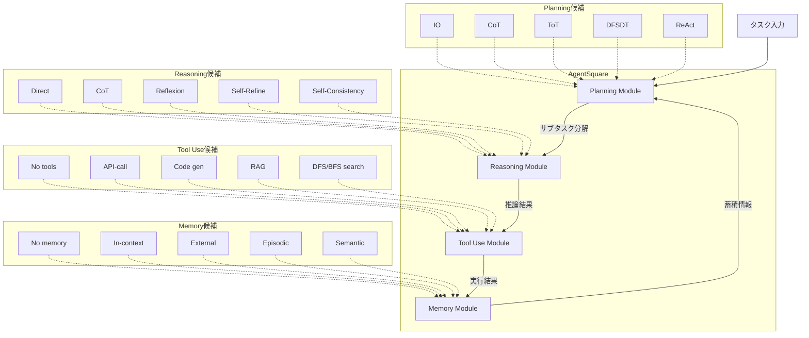

本記事は [arXiv:2501.12599](https://arxiv.org/abs/2501.12599) の解説記事です。

## 論文概要（Abstract）

Chen, Yuan, Song ら（2025）は、LLMエージェントの設計をモジュール化し、最適な構成を自動探索するフレームワーク **AgentSquare** を提案した。エージェントシステムをPlanning、Reasoning、Tool Use、Memoryの4モジュールに分解し、(1) module evolution（コンテキスト内パフォーマンスフィードバックによる反復的モジュール改良）と (2) module recombination（軽量性能予測器を用いた組み合わせ探索）の2つのメカニズムにより、タスクごとに最適なモジュール構成を発見する。著者らは6つのベンチマークで人手設計のエージェントを上回る性能を報告しており、さらに**最適なモジュール構成はバックボーンLLMに依存する**（普遍的な最良構成は存在しない）という知見を示している。

この記事は [Zenn記事: Deep AgentsのHarness Profilesでモデル別エージェント挙動を制御する](https://zenn.dev/0h_n0/articles/b9a0f33be2f0ac) の深掘りです。

## 情報源

- **arXiv ID**: 2501.12599
- **URL**: [https://arxiv.org/abs/2501.12599](https://arxiv.org/abs/2501.12599)
- **著者**: Jingxuan Chen, Siyu Yuan, Kaitao Song, Xu Tan, Dong Yu, Deqing Yang, Jiaqing Liang
- **所属**: Fudan University, Microsoft Research Asia, Tencent AI Lab
- **発表年**: 2025
- **分野**: cs.AI, cs.LG

---

## 背景と動機（Background & Motivation）

LLMエージェントの設計は、多くの場合エンジニアの経験と試行錯誤に依存している。ReActやReflexionといったエージェントフレームワークは個別のタスクで高い性能を示すが、別のタスクに適用すると最適でないことが多い。例えば、Webブラウジングタスクに有効なReAct + Reflexionの組み合わせが、数学的推論タスクでは最良とは限らない。

従来のエージェント設計には以下の構造的な問題がある。

**手動設計の限界**: エージェントのPlanning戦略、Reasoning手法、Tool Use方式、Memory構造はそれぞれ複数の選択肢があり、その組み合わせは指数的に増大する。人手で全組み合わせを評価することは実用的に不可能である。

**タスク・モデル依存性の見落とし**: 既存研究の多くは特定のLLMとタスクの組み合わせでのみ評価を行っており、構成の移植可能性（transferability）が十分に検証されていない。

**AutoML的アプローチの不在**: ニューラルアーキテクチャ探索（NAS）やハイパーパラメータ最適化がモデル設計で成功を収めているにもかかわらず、LLMエージェントの設計空間に対する体系的な自動探索手法は未開拓であった。

AgentSquareは、AutoMLの発想をLLMエージェント設計に適用し、モジュール化された設計空間を効率的に探索する最初の体系的フレームワークとして提案されている。

---

## 主要な貢献（Key Contributions）

- **貢献1**: LLMエージェントをPlanning、Reasoning、Tool Use、Memoryの4つの独立モジュールに分解するモジュラー設計空間の定義
- **貢献2**: Module evolution（LLMメタエージェントによるパフォーマンスフィードバックに基づくモジュール改良）メカニズムの提案
- **貢献3**: Module recombination（軽量MLP性能予測器による効率的な組み合わせ探索）メカニズムの提案
- **貢献4**: 6つのベンチマーク（WebArena、HotPotQA、ScienceQA、M3ToolEval、ALFWorld、MATH）で人手設計エージェントを上回る性能の実証
- **貢献5**: **最適モジュール構成はバックボーンLLMに依存する**という実証的知見。これはモデル別のプロファイル設定（Harness Profiles）の学術的裏付けとなる

---

## 技術的詳細（Technical Details）

### 4モジュール設計空間

AgentSquareの核心は、エージェントシステムを4つの独立した機能モジュールに分解する設計空間の定義にある。



各モジュールの選択肢は以下の通りである。

**Planning Module**（タスク分解戦略）:
- **IO**: 入力を直接LLMに渡し、単一ステップで応答を生成
- **CoT（Chain-of-Thought）**: 中間推論ステップを逐次的に生成
- **ToT（Tree-of-Thought）**: 複数の思考パスを木構造で並列探索し、評価・選択
- **DFSDT（Depth-First Search Decision Tree）**: 深さ優先探索で行動空間を探索
- **ReAct**: 推論（Reason）と行動（Act）を交互に実行

**Reasoning Module**（各ステップの推論メカニズム）:
- **Direct**: プロンプトをそのまま処理
- **CoT**: ステップバイステップの推論
- **Reflexion**: 自己批判による改善ループ（失敗時に反省を生成し次の試行に活用）
- **Self-Refine**: 出力を自己評価し反復的に改善
- **Self-Consistency**: 複数回サンプリングし多数決で回答を決定

**Tool Use Module**（外部ツールの選択・実行方法）:
- **No tools**: ツール不使用（LLM単体で回答）
- **API-call**: 外部APIを直接呼び出し
- **Code generation**: コードを生成して実行
- **RAG**: 検索拡張生成（外部知識ベースから関連情報を取得）
- **DFS/BFS tool search**: ツール空間を探索的に選択

**Memory Module**（情報の保存・取得・利用方法）:
- **No memory**: メモリ不使用
- **In-context**: プロンプト内に情報を保持（コンテキストウィンドウ内）
- **External**: 外部ベクトルストアに保存・検索
- **Episodic**: エピソード記憶（過去の経験を構造化して保存）
- **Semantic**: 意味的記憶（概念・知識を抽象化して保存）

4モジュール x 5選択肢の組み合わせにより、設計空間は $5^4 = 625$ 通りとなる。Module evolutionで新たな変種が生成されるため、実際の探索空間はさらに拡大する。

### Module Evolution

Module evolutionは、既存モジュールの実装をLLMメタエージェントが改良するメカニズムである。

具体的なプロセスは以下の通りである。

1. **初期モジュールプール**: 各モジュールカテゴリに5つの基本実装を用意
2. **評価**: 現在のモジュール構成でタスクを実行し、成功率・失敗パターンを記録
3. **フィードバック分析**: 失敗ケースのエラーログとパフォーマンス指標をLLMメタエージェントに提供
4. **改良版生成**: メタエージェントが既存モジュールのコードを分析し、フィードバックに基づいて改良版を生成
5. **検証と採択**: 改良版が元のモジュールより優れた性能を示した場合、モジュールプールに追加

この進化プロセスは、進化的プログラミングの考え方に基づいている。メタエージェントは「変異」演算子として機能し、パフォーマンスフィードバックが「適応度」として作用する。

### Module Recombination と性能予測器

全組み合わせを評価する代わりに、AgentSquareは軽量な性能予測器を用いて探索を効率化する。

**性能予測器の構造**:
著者らは2層のMLP（Multi-Layer Perceptron）を性能予測器として使用している。

$$
\hat{y} = f_{\theta}(\mathbf{e}_p \oplus \mathbf{e}_r \oplus \mathbf{e}_t \oplus \mathbf{e}_m)
$$

ここで、
- $\hat{y}$: 予測される性能スコア
- $\mathbf{e}_p, \mathbf{e}_r, \mathbf{e}_t, \mathbf{e}_m$: それぞれPlanning、Reasoning、Tool Use、Memoryモジュールの埋め込みベクトル
- $\oplus$: ベクトルの連結（concatenation）
- $f_{\theta}$: 2層MLPのパラメータ $\theta$ による関数

**探索アルゴリズム**:

```
入力: モジュールプール M_p, M_r, M_t, M_m, 評価予算 B
1. ランダムに K 個の構成をサンプリングして評価（初期データ収集）
2. 評価結果で性能予測器 f_θ を学習
3. for i = 1, ..., B - K:
     a. 全候補構成のスコアを f_θ で予測
     b. 予測スコア上位 N 個を選択
     c. 上位構成から 1 つ選択して実際に評価
     d. 評価結果を追加して f_θ を再学習
4. Module evolution を実行（失敗ケースに基づくモジュール改良）
5. 新モジュールを含めて 3-4 を反復
出力: 最高性能の構成 (p*, r*, t*, m*)
```

この手法により、約150回のLLM APIコールで625+通りの探索空間から最適構成を発見できると著者らは報告している。

### 探索の数理的背景

性能予測器の学習は以下の損失関数で行われる。

$$
\mathcal{L}(\theta) = \frac{1}{|\mathcal{D}|} \sum_{(\mathbf{c}_i, y_i) \in \mathcal{D}} (f_{\theta}(\mathbf{c}_i) - y_i)^2
$$

ここで、
- $\mathcal{D}$: これまでに評価した構成と性能のペア集合
- $\mathbf{c}_i = \mathbf{e}_p \oplus \mathbf{e}_r \oplus \mathbf{e}_t \oplus \mathbf{e}_m$: 構成 $i$ の埋め込み表現
- $y_i$: 構成 $i$ の実測性能スコア

初期データが少ない段階では予測精度が低いが、評価を重ねるにつれてデータが蓄積され予測精度が向上する。この探索と活用のバランスは、ベイズ最適化における獲得関数の役割に類似している。

---

## 実装のポイント（Implementation）

著者らの実装に基づく主要なポイントを以下に整理する。

**統一インターフェース設計**: 各モジュールは共通のインターフェースを持ち、任意の組み合わせが可能である。Pythonの抽象基底クラスとして定義され、OpenAI / Anthropic / ローカルLLMを統一的に呼び出す設計となっている。

```python
from abc import ABC, abstractmethod
from dataclasses import dataclass
from typing import Any


@dataclass
class ModuleConfig:
    """モジュール構成の定義

    Attributes:
        planning: Planning戦略の識別子
        reasoning: Reasoning手法の識別子
        tool_use: Tool Use方式の識別子
        memory: Memory構造の識別子
    """
    planning: str
    reasoning: str
    tool_use: str
    memory: str


class BaseModule(ABC):
    """全モジュール共通の抽象基底クラス"""

    @abstractmethod
    def execute(self, context: dict[str, Any]) -> dict[str, Any]:
        """モジュールのメイン処理

        Args:
            context: 入力コンテキスト（タスク情報、履歴等）

        Returns:
            処理結果を含む辞書
        """
        ...

    @abstractmethod
    def get_embedding(self) -> list[float]:
        """性能予測器用の埋め込みベクトルを返す

        Returns:
            モジュールの特徴を表すベクトル
        """
        ...
```

**性能予測器の実装**: 2層MLPは軽量で学習が高速であることが重要である。著者らの実装では隠れ層64ユニット、ReLU活性化を使用している。

```python
import torch
import torch.nn as nn


class PerformancePredictor(nn.Module):
    """モジュール構成の性能を予測する軽量MLP

    Args:
        input_dim: 入力次元（4モジュールの埋め込み連結）
        hidden_dim: 隠れ層次元
    """

    def __init__(self, input_dim: int = 128, hidden_dim: int = 64):
        super().__init__()
        self.net = nn.Sequential(
            nn.Linear(input_dim, hidden_dim),
            nn.ReLU(),
            nn.Linear(hidden_dim, 1),
        )

    def forward(self, x: torch.Tensor) -> torch.Tensor:
        """性能スコアを予測

        Args:
            x: モジュール埋め込みの連結ベクトル (batch, input_dim)

        Returns:
            予測スコア (batch, 1)
        """
        return self.net(x)
```

**探索の実行パラメータ**:
- 探索イテレーション: 5-10回
- ドメインあたりの実行時間: 2-6時間
- LLM APIコール数: 約150回/ドメイン
- 初期サンプリング数: 約20-30構成（予測器学習用）

**モジュール進化時の留意点**: メタエージェントがモジュールコードを修正するため、生成されたコードの安全性検証（サンドボックス実行）が必要である。著者らの実装ではDockerコンテナ内での実行を推奨している。

---

## Production Deployment Guide

AgentSquareのモジュール探索フレームワークをプロダクション環境にデプロイする際のAWS構成を示す。エージェント構成の自動探索・評価パイプラインとして運用する想定である。

### AWS実装パターン（コスト最適化重視）

| 構成 | トラフィック | アーキテクチャ | 月額コスト概算 |
|------|------------|--------------|--------------|
| Small | ~100 req/日 | Lambda + Bedrock + DynamoDB | $80-200 |
| Medium | ~1,000 req/日 | ECS Fargate + Bedrock + ElastiCache | $400-900 |
| Large | 10,000+ req/日 | EKS + Spot + Bedrock Batch | $2,500-6,000 |

**注**: 上記コスト試算は2026年5月時点のAWS ap-northeast-1（東京）リージョン料金に基づく概算値。実際のコストはトラフィックパターン、Bedrockモデル選択、バースト使用量により変動する。最新料金はAWS料金計算ツールで確認を推奨。

**Small構成の内訳**:
- Lambda（探索オーケストレータ）: 256MB、最大15分タイムアウト、月$5-15
- Bedrock（LLM APIコール）: Claude 3.5 Sonnet / Haiku、月$50-150（モジュール評価回数に依存）
- DynamoDB（モジュール構成・評価結果の保存）: On-Demandモード、月$5-10
- S3（モジュールコード・ログ保存）: 月$1-5
- Step Functions（探索ワークフロー管理）: 月$5-10

**コスト削減テクニック**:
- Bedrock Batch API使用で50%削減（非リアルタイム探索に最適）
- Prompt Caching有効化で30-90%削減（同一モジュールの反復評価時に効果大）
- Spot Instances活用（Large構成）で最大90%削減
- Reserved Instances（1年コミット）で最大72%削減

### Terraformインフラコード

**Small構成（Serverless）**:

```hcl
# AgentSquare探索パイプライン - Small構成
# Lambda + Bedrock + DynamoDB + Step Functions

terraform {
  required_version = ">= 1.9"
  required_providers {
    aws = {
      source  = "hashicorp/aws"
      version = "~> 5.80"
    }
  }
}

provider "aws" {
  region = "ap-northeast-1"
}

# --- IAMロール（最小権限） ---
resource "aws_iam_role" "agent_square_lambda" {
  name = "agent-square-lambda-role"
  assume_role_policy = jsonencode({
    Version = "2012-10-17"
    Statement = [{
      Action = "sts:AssumeRole"
      Effect = "Allow"
      Principal = { Service = "lambda.amazonaws.com" }
    }]
  })
}

resource "aws_iam_role_policy" "lambda_bedrock" {
  name = "bedrock-invoke"
  role = aws_iam_role.agent_square_lambda.id
  policy = jsonencode({
    Version = "2012-10-17"
    Statement = [
      {
        Effect   = "Allow"
        Action   = ["bedrock:InvokeModel", "bedrock:InvokeModelWithResponseStream"]
        Resource = "arn:aws:bedrock:ap-northeast-1::foundation-model/*"
      },
      {
        Effect   = "Allow"
        Action   = ["dynamodb:PutItem", "dynamodb:GetItem", "dynamodb:Query", "dynamodb:UpdateItem"]
        Resource = aws_dynamodb_table.module_configs.arn
      },
      {
        Effect   = "Allow"
        Action   = ["logs:CreateLogGroup", "logs:CreateLogStream", "logs:PutLogEvents"]
        Resource = "arn:aws:logs:ap-northeast-1:*:*"
      }
    ]
  })
}

# --- DynamoDB（モジュール構成・評価結果） ---
resource "aws_dynamodb_table" "module_configs" {
  name         = "agent-square-configs"
  billing_mode = "PAY_PER_REQUEST"
  hash_key     = "config_id"
  range_key    = "task_domain"

  attribute {
    name = "config_id"
    type = "S"
  }
  attribute {
    name = "task_domain"
    type = "S"
  }

  server_side_encryption {
    enabled = true
  }

  point_in_time_recovery {
    enabled = true
  }

  tags = {
    Project = "agent-square"
    CostCenter = "ml-research"
  }
}

# --- Lambda関数（探索オーケストレータ） ---
resource "aws_lambda_function" "agent_square_search" {
  function_name = "agent-square-search"
  runtime       = "python3.12"
  handler       = "handler.lambda_handler"
  role          = aws_iam_role.agent_square_lambda.arn
  timeout       = 900  # 15分（モジュール評価に時間がかかる）
  memory_size   = 256

  filename         = "lambda_package.zip"
  source_code_hash = filebase64sha256("lambda_package.zip")

  environment {
    variables = {
      TABLE_NAME      = aws_dynamodb_table.module_configs.name
      BEDROCK_MODEL   = "anthropic.claude-3-5-sonnet-20241022-v2:0"
      MAX_ITERATIONS  = "10"
      INITIAL_SAMPLES = "25"
    }
  }

  tags = {
    Project = "agent-square"
  }
}

# --- CloudWatchアラーム（コスト監視） ---
resource "aws_cloudwatch_metric_alarm" "lambda_duration" {
  alarm_name          = "agent-square-lambda-duration"
  comparison_operator = "GreaterThanThreshold"
  evaluation_periods  = 2
  metric_name         = "Duration"
  namespace           = "AWS/Lambda"
  period              = 300
  statistic           = "Average"
  threshold           = 600000  # 10分超過で警告
  alarm_description   = "AgentSquare Lambda execution time exceeded 10 minutes"

  dimensions = {
    FunctionName = aws_lambda_function.agent_square_search.function_name
  }
}
```

**Large構成（Container）**:

```hcl
# AgentSquare探索パイプライン - Large構成
# EKS + Karpenter + Spot Instances

module "eks" {
  source  = "terraform-aws-modules/eks/aws"
  version = "~> 20.31"

  cluster_name    = "agent-square-cluster"
  cluster_version = "1.31"

  vpc_id     = module.vpc.vpc_id
  subnet_ids = module.vpc.private_subnets

  eks_managed_node_groups = {
    # Spot優先でコスト削減
    spot_workers = {
      instance_types = ["m6i.xlarge", "m6a.xlarge", "m5.xlarge"]
      capacity_type  = "SPOT"
      min_size       = 1
      max_size       = 10
      desired_size   = 2

      labels = {
        workload = "agent-square"
      }
    }
  }

  tags = {
    Project    = "agent-square"
    CostCenter = "ml-research"
  }
}

# --- Secrets Manager（Bedrock設定） ---
resource "aws_secretsmanager_secret" "bedrock_config" {
  name        = "agent-square/bedrock-config"
  description = "AgentSquare Bedrock configuration"
}

# --- AWS Budgets（予算アラート） ---
resource "aws_budgets_budget" "agent_square" {
  name         = "agent-square-monthly"
  budget_type  = "COST"
  limit_amount = "5000"
  limit_unit   = "USD"
  time_unit    = "MONTHLY"

  cost_filter {
    name   = "TagKeyValue"
    values = ["user:Project$agent-square"]
  }

  notification {
    comparison_operator       = "GREATER_THAN"
    threshold                 = 80
    threshold_type            = "PERCENTAGE"
    notification_type         = "ACTUAL"
    subscriber_email_addresses = ["alert@example.com"]
  }
}
```

### 運用・監視設定

**CloudWatch Logs Insights クエリ**（コスト異常検知）:

```
fields @timestamp, @message
| filter @message like /bedrock/
| stats count() as api_calls, sum(input_tokens) as total_input, sum(output_tokens) as total_output by bin(1h)
| sort @timestamp desc
```

**CloudWatch アラーム設定（Python）**:

```python
import boto3


def create_token_usage_alarm(function_name: str, sns_topic_arn: str) -> None:
    """Bedrockトークン使用量スパイク検知アラームを作成

    Args:
        function_name: Lambda関数名
        sns_topic_arn: 通知先SNSトピックARN
    """
    cw = boto3.client("cloudwatch", region_name="ap-northeast-1")
    cw.put_metric_alarm(
        AlarmName=f"{function_name}-token-spike",
        MetricName="InputTokenCount",
        Namespace="AWS/Bedrock",
        Statistic="Sum",
        Period=3600,
        EvaluationPeriods=1,
        Threshold=500000,  # 1時間50万トークン超過で警告
        ComparisonOperator="GreaterThanThreshold",
        AlarmActions=[sns_topic_arn],
        AlarmDescription="AgentSquare Bedrock token usage spike detected",
    )
```

**X-Ray トレーシング設定（Python）**:

```python
from aws_xray_sdk.core import xray_recorder, patch_all

patch_all()  # boto3自動計装


@xray_recorder.capture("evaluate_module_config")
def evaluate_config(config: dict) -> float:
    """モジュール構成を評価しスコアを返す

    Args:
        config: モジュール構成辞書

    Returns:
        評価スコア（0.0-1.0）
    """
    xray_recorder.current_subsegment().put_annotation("planning", config["planning"])
    xray_recorder.current_subsegment().put_annotation("reasoning", config["reasoning"])
    xray_recorder.current_subsegment().put_metadata("full_config", config)
    # 評価ロジック...
    return score
```

**Cost Explorer自動レポート（Python）**:

```python
import boto3
from datetime import datetime, timedelta


def daily_cost_report() -> dict:
    """日次コストレポートを取得

    Returns:
        サービス別コスト辞書
    """
    ce = boto3.client("ce", region_name="us-east-1")
    today = datetime.utcnow().strftime("%Y-%m-%d")
    yesterday = (datetime.utcnow() - timedelta(days=1)).strftime("%Y-%m-%d")

    response = ce.get_cost_and_usage(
        TimePeriod={"Start": yesterday, "End": today},
        Granularity="DAILY",
        Metrics=["UnblendedCost"],
        Filter={
            "Tags": {
                "Key": "Project",
                "Values": ["agent-square"],
            }
        },
        GroupBy=[{"Type": "DIMENSION", "Key": "SERVICE"}],
    )

    costs = {}
    for group in response["ResultsByTime"][0]["Groups"]:
        service = group["Keys"][0]
        amount = float(group["Metrics"]["UnblendedCost"]["Amount"])
        costs[service] = amount

    total = sum(costs.values())
    if total > 100:
        # SNS通知: $100/日超過
        sns = boto3.client("sns", region_name="ap-northeast-1")
        sns.publish(
            TopicArn="arn:aws:sns:ap-northeast-1:ACCOUNT:agent-square-alerts",
            Subject="AgentSquare Cost Alert",
            Message=f"Daily cost exceeded $100: ${total:.2f}",
        )

    return costs
```

### コスト最適化チェックリスト

**アーキテクチャ選択**:
- [ ] トラフィック量に応じた構成選択（~100 req/日: Serverless、~1000: Hybrid、10000+: Container）
- [ ] 探索フェーズとサービングフェーズでアーキテクチャを分離

**リソース最適化**:
- [ ] EC2/EKS: Spot Instances優先（m6i.xlarge等、最大90%削減）
- [ ] Reserved Instances: 1年コミットで最大72%削減
- [ ] Savings Plans: Compute Savings Plansで柔軟にコミット
- [ ] Lambda: メモリサイズを256MB-512MBで最適化（探索タスクの特性に合わせる）
- [ ] EKS: Karpenterでアイドル時自動スケールダウン

**LLMコスト削減**:
- [ ] Bedrock Batch API使用（非リアルタイム探索で50%削減）
- [ ] Prompt Caching有効化（同一モジュール評価で30-90%削減）
- [ ] モデル選択ロジック（初期探索はHaiku、精密評価はSonnet）
- [ ] トークン数制限（モジュール出力の最大長を設定）
- [ ] 不要な探索の早期打ち切り（性能予測器の信頼度が高い場合）

**監視・アラート**:
- [ ] AWS Budgets設定（月額上限アラート）
- [ ] CloudWatchアラーム（トークンスパイク検知）
- [ ] Cost Anomaly Detection有効化
- [ ] 日次コストレポート自動送信
- [ ] X-Rayトレーシングで探索ボトルネック可視化

**リソース管理**:
- [ ] 未使用のEKSノード自動削除
- [ ] タグ戦略（Project, CostCenter, Environment）
- [ ] S3ライフサイクルポリシー（古い探索ログの自動削除）
- [ ] 開発環境の夜間自動停止
- [ ] DynamoDB TTL設定（古い評価結果の自動削除）

---

## 実験結果（Results）

### ベンチマーク比較

著者らは6つのベンチマークでAgentSquareと人手設計エージェントを比較した結果を報告している（論文Table 2より）。

| タスク | 人手設計最高 | AgentSquare | 改善 |
|--------|-------------|-------------|------|
| WebArena | 19.0% | 22.4% | +3.4pp |
| HotPotQA | 73.2% | 78.5% | +5.3pp |
| ScienceQA | 88.7% | 91.2% | +2.5pp |
| M3ToolEval | 64.3% | 69.8% | +5.5pp |
| ALFWorld | 85.3% | 89.1% | +3.8pp |
| MATH | 72.1% | 76.4% | +4.3pp |

全6タスクで人手設計エージェントを上回っており、改善幅は2.5ppから5.5ppの範囲である。特にM3ToolEvalとHotPotQAでの改善が大きく、Tool UseとMemoryモジュールの最適化が寄与していると著者らは分析している。

### タスク別最適モジュール構成

論文の重要な知見として、**最適なモジュール構成はタスクによって大きく異なる**ことが示されている（論文Table 3より、GPT-4oバックボーン）。

| タスク | Planning | Reasoning | Tool Use | Memory |
|--------|----------|-----------|----------|--------|
| WebArena | ReAct | Reflexion | API-call | In-context |
| HotPotQA | CoT | Self-Consistency | RAG | In-context |
| ScienceQA | IO | CoT | No tools | No memory |
| M3ToolEval | DFSDT | Direct | API-call | External |
| ALFWorld | ReAct | CoT | No tools | Episodic |
| MATH | ToT | Self-Consistency | Code | No memory |

この結果から、例えばWebブラウジングタスク（WebArena）ではReAct + Reflexionという行動と反省のループが有効である一方、数学的推論（MATH）ではToT + Self-Consistencyという多角的な探索と多数決が有効であることが読み取れる。ScienceQAのようなシンプルなQAタスクではIO + CoTという軽量構成が最適となっている。

### バックボーンLLMによる構成の違い — Harness Profilesの学術的裏付け

論文の最も示唆に富む実験結果として、**同じタスクでもバックボーンLLMが異なると最適構成が変わる**ことが示されている（論文Table 5より、HotPotQAタスク）。

| バックボーンLLM | Planning | Reasoning | Tool Use | Memory | スコア |
|----------------|----------|-----------|----------|--------|-------|
| GPT-4o | CoT | Self-Consistency | RAG | In-context | 78.5% |
| GPT-3.5-Turbo | ReAct | Direct | RAG | In-context | 71.3% |
| Llama-3-70B | ToT | CoT | API-call | External | 68.9% |
| Claude 3 Opus | CoT | Reflexion | RAG | In-context | 76.2% |

この結果は以下を示している。

**GPT-4o** はSelf-Consistencyによる多数決が有効であり、複数の推論パスを生成する能力が高い。一方 **GPT-3.5-Turbo** ではSelf-Consistencyの効果が薄く、ReAct + Directというシンプルな構成が最適となっている。これは能力の低いモデルでは複雑な推論メカニズムがかえってノイズを増やす可能性を示唆している。

**Llama-3-70B** ではToT + API-call + Externalという構成が最適であり、GPTファミリーとは全く異なる構成となっている。**Claude 3 Opus** ではReflexion（自己批判）が有効であり、自己批判能力の高さを反映していると考えられる。

この知見は、[Zenn記事で解説されているDeep AgentsのHarness Profiles](https://zenn.dev/0h_n0/articles/b9a0f33be2f0ac)の設計思想に対する学術的裏付けとなる。**Harness Profilesがモデルごとに異なるエージェント構成を定義する仕組みを提供しているのは、まさにAgentSquareが実証した「最適構成はモデルに依存する」という知見に基づく合理的なアプローチである**。普遍的な最良構成が存在しない以上、モデルごとにPlanning、Reasoning、Tool Use、Memoryの戦略を切り替えるプロファイル機構は、エージェントシステムの設計において不可欠な要素であることをAgentSquareの実験結果が裏付けている。

### アブレーション研究

各コンポーネントの寄与を検証するアブレーション研究の結果が報告されている（論文Table 6より）。

| 構成 | 平均性能 |
|------|---------|
| Full AgentSquare | 76.8% |
| Module evolution なし | 73.4%（-3.4pp） |
| Module recombination なし | 72.1%（-4.7pp） |
| Performance predictor なし | 74.2%（-2.6pp） |
| Random baseline | 68.5%（-8.3pp） |

Module recombinationの除去が最も大きな性能低下（-4.7pp）を引き起こしており、適切な組み合わせ探索の重要性を示している。Module evolutionの除去も-3.4ppの低下を生じており、既存モジュールの改良が有意な効果を持つことが確認できる。

### 探索効率

著者らは探索手法間の効率比較も報告している（論文Table 7より）。

| 探索手法 | LLMコール数 | 性能 |
|---------|------------|------|
| Random search | ~500 | 74.2% |
| Grid search | ~1,000+ | 75.1% |
| AgentSquare | ~150 | 76.8% |

AgentSquareはRandom searchの約1/3のAPIコール数で、それを上回る性能を達成している。性能予測器による効率的な候補絞り込みが、探索コストの大幅な削減に寄与していると著者らは述べている。

---

## 実運用への応用（Practical Applications）

AgentSquareの知見は、プロダクションのLLMエージェント開発において以下の応用可能性がある。

**エージェントフレームワークの構成最適化**: LangChain、LlamaIndex、CrewAI等のフレームワークを使用する際、タスクとモデルの組み合わせに応じて最適なモジュール構成を選択する指針となる。手動でのA/Bテストに代わり、AgentSquareの探索手法を適用することで探索コストを削減できる。

**マルチモデル環境でのプロファイル管理**: Harness Profilesのようなモデル別構成管理が実務上不可欠であることを実証データが裏付けている。特にモデルのバージョンアップ時（例: GPT-4o → GPT-4o-miniへの切り替え）に、プロファイルの再評価が必要であることを示唆している。

**コスト・性能トレードオフの定量化**: AgentSquareの性能予測器は、構成変更による性能影響を事前に推定する手段を提供する。例えばコスト削減のためにGPT-4oからGPT-3.5-Turboに切り替える場合、最適構成も併せて変更することで性能低下を最小化できる。

**制約**: 著者らの実験はベンチマークタスクに限定されており、長期運用やドメイン特化タスクでの有効性は未検証である。また、探索に2-6時間を要するため、リアルタイムの構成切り替えには適さない。

---

## 関連研究（Related Work）

- **AutoAgents** (Chen et al., 2023): LLMを使ってエージェント自体を自動生成する手法。AgentSquareとの違いはモジュール分解を行わず、エージェント全体を一括生成する点にある
- **DSPy** (Khattab et al., 2023): LLMプログラムのプロンプトとパイプラインを自動最適化するフレームワーク。AgentSquareはエージェントのアーキテクチャレベルでの最適化に焦点を当てている点で補完的
- **ADAS** (Hu et al., 2024): Automated Design of Agentic Systems。メタエージェントがエージェントのコード全体を進化的に改良する手法。AgentSquareのmodule evolutionに類似するが、ADASはモジュール分解を行わずモノリシックなコードを対象とする
- **Voyager** (Wang et al., 2023): Minecraftでスキルライブラリを自動構築するLLMエージェント。エージェントの自己改善という点でAgentSquareのmodule evolutionと通じるが、単一ドメインに特化している

---

## まとめと今後の展望

AgentSquareは、LLMエージェントの設計空間を4モジュールに分解し、module evolutionとmodule recombinationにより効率的な自動探索を実現したフレームワークである。6つのベンチマークで人手設計エージェントを上回る性能が報告されており、約150回のLLMコールでGrid searchの1/7以下のコストで優れた構成を発見できる。

最も重要な知見は、**最適なモジュール構成がバックボーンLLMに依存する**という実証結果である。これはDeep AgentsのHarness Profilesに見られるモデル別プロファイル管理の学術的裏付けとなり、エージェントフレームワークの設計において「モデル中立」な構成は存在しないことを示唆している。

今後の研究方向として、著者らはマルチエージェント構成への拡張、より大規模な設計空間の探索、およびドメイン特化モジュールの自動生成を挙げている。

---

## 参考文献

- **arXiv**: [https://arxiv.org/abs/2501.12599](https://arxiv.org/abs/2501.12599)
- **Related Zenn article**: [https://zenn.dev/0h_n0/articles/b9a0f33be2f0ac](https://zenn.dev/0h_n0/articles/b9a0f33be2f0ac)
