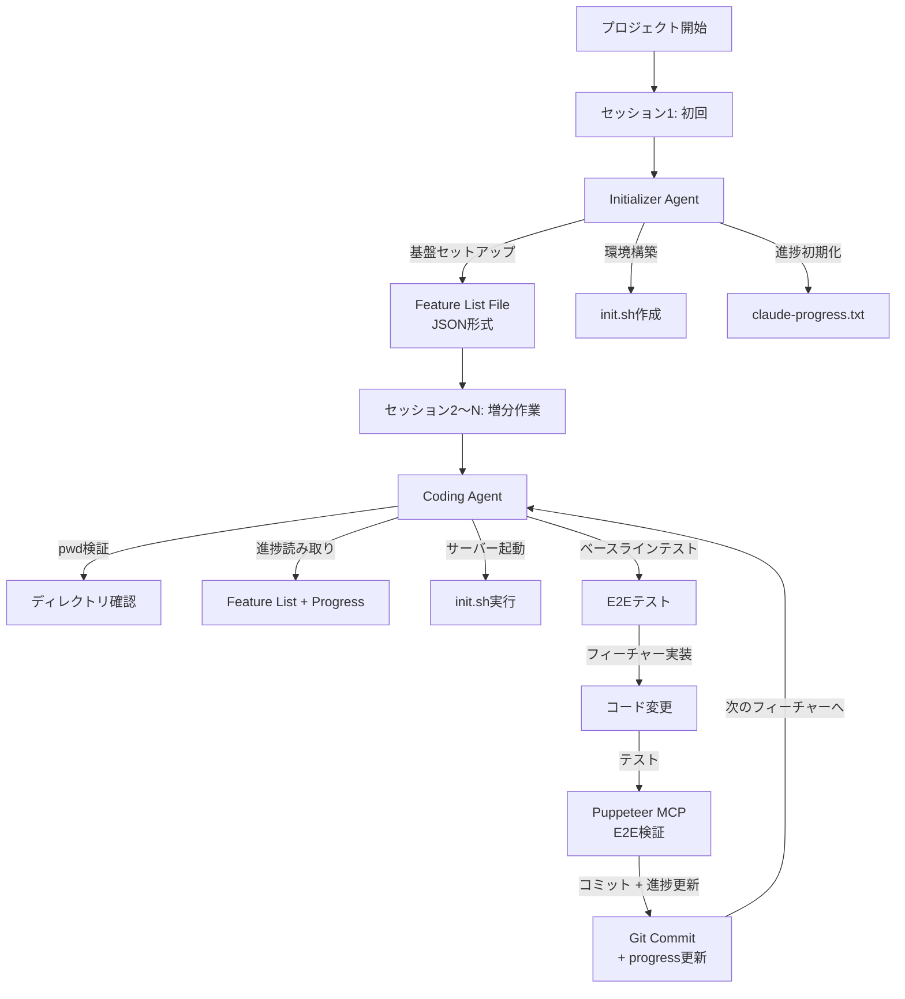
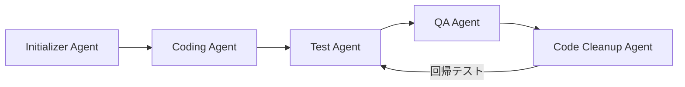

# Anthropicブログ解説: Effective Harnesses for Long-Running Agents

## ブログ概要

本記事は [Anthropic Engineering Blog: Effective harnesses for long-running agents](https://www.anthropic.com/engineering/effective-harnesses-for-long-running-agents) の解説記事です。

Anthropicのエンジニアリングチームは、長時間動作するAIエージェントが大規模なコードベースを自律的に構築・修正するための「ハーネス（harness）」設計パターンを公開した。ブログによると、200以上のフィーチャーを持つWebアプリケーションを複数セッションにわたって構築するタスクにおいて、2エージェント構成（Initializer Agent + Coding Agent）、JSON形式のFeature List File、セッション初期化プロトコルの3つの設計要素が効果的であったと報告されている。使用モデルはClaude Opus 4.5であり、Claude Agent SDKのコンテキスト圧縮機能を活用している。

この記事は [Zenn記事: Deep AgentsのHarness Profilesでモデル別エージェント挙動を制御する](https://zenn.dev/0h_n0/articles/b9a0f33be2f0ac) の深掘りです。

---

## 情報源

- **種別**: 企業テックブログ
- **URL**: [https://www.anthropic.com/engineering/effective-harnesses-for-long-running-agents](https://www.anthropic.com/engineering/effective-harnesses-for-long-running-agents)
- **組織**: Anthropic Engineering
- **著者**: Justin Young
- **貢献者**: David Hershey, Prithvi Rajasakeran, Jeremy Hadfield, Naia Bouscal, Michael Tingley, Jesse Mu, Jake Eaton, Marius Buleandara, Maggie Vo, Pedram Navid, Nadine Yasser, Alex Notov
- **公開日**: 2025年11月26日

---

## 技術的背景

### 長時間動作エージェントの課題

LLMベースのエージェントを長時間（数時間〜数日）にわたって動作させる場合、単一セッションでの対話とは質的に異なる課題が発生する。Anthropicのブログでは、200以上のフィーチャーを持つWebアプリケーションの構築を具体的なユースケースとして、以下の問題群を報告している。

**早期プロジェクト完了宣言**: エージェントがプロジェクトの一部を完了した時点で全体の完了を宣言してしまう問題。200フィーチャーのうち30フィーチャーを実装した段階で「完了」と報告するケースが観察されている。これはLLMの自己評価能力の限界と、明示的なタスク追跡メカニズムの欠如に起因する。

**セッション間の状態断絶**: 長時間のタスクは複数のセッションに分割される必要があるが、セッション間でコンテキストが失われると、エージェントは前回の作業内容を把握できない。git履歴のみでは「何をやっていたか」は分かっても「次に何をすべきか」の判断が困難である。

**環境状態の不整合**: 開発サーバーの起動状態、依存パッケージのインストール状況、テスト環境の整備状態など、セッション開始時の環境が前セッション終了時と異なる場合がある。エージェントがこれらの不整合を検知・修復する機構がないと、無関係なエラーに時間を浪費する。

**不完全なフィーチャーテスト**: コードを書いてもテストせずに次のフィーチャーに移行する、またはテストが不十分なまま「完了」とマークするケースが発生する。ブログによると、この問題はブラウザベースのアプリケーションにおいて特に顕著であったと報告されている。

### ハーネスの位置づけ

ここでいう「ハーネス」とは、エージェントの外部から動作を制御・支援するインフラストラクチャを指す。システムプロンプト、ツール定義、ファイル構造、初期化スクリプトなど、エージェントの行動空間を制約し方向付ける仕組みの総称である。ハーネスはエージェントの内部能力を補完するものであり、モデル自体の改善とは独立に設計・改善できる点が実務上の利点である。

---

## 実装アーキテクチャ

### 2エージェント構成の全体像

Anthropicのブログで提案されたアーキテクチャは、2種類のエージェントによる役割分担を中核とする。



### Initializer Agent（初回セッション）

Initializer Agentは初回セッションのみで動作し、プロジェクト全体の基盤を構築する。その責務は以下の3つに分類される。

**Feature List Fileの生成**: プロジェクト仕様を受け取り、実装すべきフィーチャーの一覧をJSON形式で出力する。ブログによると、JSON形式を採用した理由は「モデルはMarkdownファイルと比較して、JSONファイルを不適切に変更・上書きする可能性が低い」ためであると説明されている。

```json
{
  "features": [
    {
      "id": "auth-001",
      "name": "ユーザー認証基盤",
      "description": "JWT認証フローの実装",
      "passing": false,
      "dependencies": []
    },
    {
      "id": "auth-002",
      "name": "OAuth2連携",
      "description": "Google/GitHubのOAuth2プロバイダ連携",
      "passing": false,
      "dependencies": ["auth-001"]
    },
    {
      "id": "dashboard-001",
      "name": "ダッシュボード基本レイアウト",
      "description": "サイドバー + メインコンテンツの2カラムレイアウト",
      "passing": false,
      "dependencies": ["auth-001"]
    }
  ],
  "metadata": {
    "total_features": 3,
    "completed": 0,
    "created_at": "2025-11-01T09:00:00Z"
  }
}
```

各フィーチャーには`passing`ブーリアンフラグが付与される。ブログによると、このフラグの存在が「早期プロジェクト完了宣言」問題を解決する鍵であった。`passing: false`のフィーチャーが残っている限り、エージェントはプロジェクトを完了と判断しない。

**init.shスクリプトの作成**: 開発サーバーの起動手順、依存パッケージのインストール手順を1つのシェルスクリプトにまとめる。セッション開始時にこのスクリプトを実行することで、環境状態の不整合を解消する。

**claude-progress.txtの初期化**: 自然言語形式の進捗追跡ファイルを作成する。Feature List Fileが構造化データとしてフィーチャーの完了状態を追跡するのに対し、このファイルは「現在の作業コンテキスト」を自然言語で記述する。セッション終了時にCoding Agentがこのファイルを更新し、次のセッションの開始時にCoding Agentが読み取ることで、セッション間の文脈引き継ぎを実現する。

### Coding Agent（後続セッション）

Coding Agentは2回目以降のすべてのセッションで動作する。各セッションの開始時に以下の初期化プロトコルを実行する。

```python
from dataclasses import dataclass, field
from pathlib import Path
from typing import Any
import json
import subprocess


@dataclass
class SessionInitProtocol:
    """Coding Agentのセッション初期化プロトコル

    ブログで報告された5ステップの初期化手順を
    構造化したもの。各ステップは順序依存性がある。

    Attributes:
        project_root: プロジェクトルートパス
        feature_list_path: Feature List Fileのパス
        progress_path: 進捗ファイルのパス
        init_script_path: init.shのパス
    """
    project_root: Path
    feature_list_path: Path = field(init=False)
    progress_path: Path = field(init=False)
    init_script_path: Path = field(init=False)

    def __post_init__(self) -> None:
        self.feature_list_path = self.project_root / "feature_list.json"
        self.progress_path = self.project_root / "claude-progress.txt"
        self.init_script_path = self.project_root / "init.sh"

    def step1_verify_directory(self) -> bool:
        """Step 1: pwdコマンドでディレクトリ検証

        Returns:
            ディレクトリが正しい場合True
        """
        result = subprocess.run(
            ["pwd"],
            capture_output=True,
            text=True,
            timeout=10,
        )
        current_dir = Path(result.stdout.strip())
        return current_dir == self.project_root

    def step2_read_progress(self) -> dict[str, Any]:
        """Step 2: gitログと進捗ファイルの読み取り

        Returns:
            進捗状態の辞書
        """
        # Feature List Fileの読み取り
        with open(self.feature_list_path) as f:
            feature_list = json.load(f)

        # 進捗テキストの読み取り
        progress_text = self.progress_path.read_text()

        # 直近のgitログ取得
        git_result = subprocess.run(
            ["git", "log", "--oneline", "-20"],
            capture_output=True,
            text=True,
            cwd=self.project_root,
            timeout=10,
        )

        return {
            "feature_list": feature_list,
            "progress_text": progress_text,
            "recent_commits": git_result.stdout.strip(),
        }

    def step3_select_next_feature(
        self, feature_list: dict[str, Any]
    ) -> dict[str, Any] | None:
        """Step 3: 最優先の未完了フィーチャーを選択

        依存関係を考慮し、passingがfalseの
        フィーチャーのうち最優先のものを返す。

        Args:
            feature_list: Feature List Fileの内容

        Returns:
            次に実装すべきフィーチャー（全完了時はNone）
        """
        completed_ids = {
            f["id"]
            for f in feature_list["features"]
            if f["passing"]
        }

        for feature in feature_list["features"]:
            if feature["passing"]:
                continue
            # 依存フィーチャーが全て完了しているか確認
            deps_met = all(
                dep in completed_ids
                for dep in feature.get("dependencies", [])
            )
            if deps_met:
                return feature

        return None  # 全フィーチャー完了

    def step4_run_init_script(self) -> subprocess.CompletedProcess:
        """Step 4: init.sh開発サーバースクリプトの実行

        Returns:
            スクリプト実行結果
        """
        return subprocess.run(
            ["bash", str(self.init_script_path)],
            capture_output=True,
            text=True,
            cwd=self.project_root,
            timeout=120,
        )

    def step5_run_baseline_tests(self) -> subprocess.CompletedProcess:
        """Step 5: ベースラインE2Eテストの実行

        既に完了したフィーチャーのテストを実行し、
        回帰がないことを確認する。

        Returns:
            テスト実行結果
        """
        return subprocess.run(
            ["npm", "test", "--", "--passWithNoTests"],
            capture_output=True,
            text=True,
            cwd=self.project_root,
            timeout=300,
        )
```

初期化プロトコルの各ステップは順序依存性がある。ブログによると、特にStep 1のディレクトリ検証を省略すると、エージェントが誤ったディレクトリで作業を開始するケースが観察されたと報告されている。

### セッション終了プロトコル

セッション終了時には、次のセッションへの引き継ぎのために以下の操作を実行する。

```python
from dataclasses import dataclass
from pathlib import Path
from typing import Any
import json
import subprocess


@dataclass
class SessionEndProtocol:
    """セッション終了時の状態保存プロトコル

    Attributes:
        project_root: プロジェクトルートパス
        feature_list_path: Feature List Fileのパス
        progress_path: 進捗ファイルのパス
    """
    project_root: Path
    feature_list_path: Path
    progress_path: Path

    def update_feature_status(
        self,
        feature_id: str,
        passing: bool,
        feature_list: dict[str, Any],
    ) -> None:
        """フィーチャーの完了状態を更新する

        Args:
            feature_id: 対象フィーチャーID
            passing: テスト通過状態
            feature_list: 現在のFeature List
        """
        for feature in feature_list["features"]:
            if feature["id"] == feature_id:
                feature["passing"] = passing
                break

        completed = sum(
            1 for f in feature_list["features"] if f["passing"]
        )
        feature_list["metadata"]["completed"] = completed

        with open(self.feature_list_path, "w") as f:
            json.dump(feature_list, f, indent=2, ensure_ascii=False)

    def update_progress_text(self, summary: str) -> None:
        """進捗テキストファイルを更新する

        Args:
            summary: 今回のセッションの作業サマリ
        """
        self.progress_path.write_text(summary)

    def commit_progress(self, message: str) -> None:
        """進捗をGitコミットする

        Args:
            message: コミットメッセージ
        """
        subprocess.run(
            ["git", "add", "-A"],
            cwd=self.project_root,
            timeout=30,
        )
        subprocess.run(
            ["git", "commit", "-m", message],
            cwd=self.project_root,
            timeout=30,
        )
```

ブログによると、セッション終了時にGitコミットと進捗ファイル更新の両方を実行することが重要であると述べられている。Gitコミットのみでは「次に何をすべきか」の情報が不足し、進捗ファイルのみではコード変更の追跡性が失われるためである。

### 状態管理の設計思想

ブログで提案されたハーネスの状態管理は、3種類のメカニズムを組み合わせている。

| 状態管理手段 | データ形式 | 目的 | 更新タイミング |
|-------------|-----------|------|--------------|
| Feature List File | JSON | フィーチャー完了追跡 | フィーチャー実装完了時 |
| claude-progress.txt | 自然言語テキスト | 作業コンテキスト引き継ぎ | セッション終了時 |
| Git履歴 | コミットログ | コード変更追跡・リバート | フィーチャー実装完了時 |

この3重の状態管理は冗長に見えるが、それぞれが異なる情報を担っている。Feature List Fileは「何が完了したか」、claude-progress.txtは「次に何をすべきか」、Git履歴は「何が変更されたか」を記録する。ブログでは、この冗長性がセッション間のコンテキスト損失を防ぐ設計上のトレードオフであると説明されている。

### テスト戦略: Puppeteer MCPによるE2E検証

ブログではフィーチャー実装後のテスト手段としてPuppeteer MCP（Model Context Protocol）を推奨している。Puppeteer MCPはブラウザ自動化ツールであり、エージェントがエンドユーザーと同様にブラウザを操作してテストを実行する。

```python
from dataclasses import dataclass


@dataclass
class PuppeteerTestResult:
    """Puppeteer MCPによるE2Eテスト結果

    Attributes:
        feature_id: テスト対象フィーチャーID
        passed: テスト通過したか
        screenshot_path: スクリーンショット保存先
        error_message: 失敗時のエラーメッセージ
    """
    feature_id: str
    passed: bool
    screenshot_path: str | None = None
    error_message: str | None = None


def evaluate_test_result(
    result: PuppeteerTestResult,
) -> dict[str, str]:
    """テスト結果を評価し、次のアクションを決定する

    ブログで報告された制限事項:
    - Puppeteer MCPではブラウザネイティブの
      アラートモーダル（window.alert）が見えない
    - これらのUIはCustom Modal実装に置き換える必要がある

    Args:
        result: テスト結果

    Returns:
        次のアクション（pass/fix/skip）と理由
    """
    if result.passed:
        return {
            "action": "pass",
            "reason": f"Feature {result.feature_id} passed E2E test",
        }

    if result.error_message and "alert" in result.error_message.lower():
        return {
            "action": "fix",
            "reason": (
                "Native alert detected. "
                "Replace with custom modal component. "
                "Puppeteer MCP cannot interact with native alerts."
            ),
        }

    return {
        "action": "fix",
        "reason": f"E2E test failed: {result.error_message}",
    }
```

ブログによると、Puppeteer MCPの主要な制限事項として、ブラウザネイティブのアラートモーダル（`window.alert`, `window.confirm`）が検出できない点が挙げられている。この制限に対する対策として、ネイティブアラートをカスタムモーダルコンポーネントに置き換えるアプローチが採用されたと報告されている。

---

## Production Deployment Guide

### AWS実装パターン（コスト最適化重視）

Anthropicのブログで示された2エージェント構成をAWS上で本番運用する場合の推奨構成を、ワークロード規模別に示す。コスト試算は2026年5月時点のap-northeast-1（東京）リージョン料金に基づく概算値であり、実際のコストはエージェントの平均セッション時間、フィーチャー数により変動する。最新料金はAWS料金計算ツールで確認を推奨する。

| 構成 | ワークロード | AWS構成 | 月額概算 |
|------|-------------|---------|---------|
| **Small** | ~10プロジェクト/月 | Lambda + Step Functions + S3 + Bedrock | $150-400 |
| **Medium** | ~50プロジェクト/月 | ECS Fargate + Step Functions + DynamoDB + Bedrock | $800-2,000 |
| **Large** | 100+プロジェクト/月 | EKS + Karpenter(Spot) + DynamoDB + Bedrock + ElastiCache | $4,000-10,000 |

**Small構成の内訳**:
- Lambda（セッション管理 + Feature List更新）: ~$10/月（256MB, 平均30秒実行 x 100回/日）
- Step Functions（セッション間オーケストレーション）: ~$5/月（Standard Workflow, 30遷移/実行）
- Bedrock API（Claude Opus 4.5）: ~$100-300/月（入力1M + 出力500Kトークン/日）
- S3（Feature List File + progress保存）: ~$1/月
- CloudWatch Logs: ~$5/月

**Large構成の内訳**:
- EKS コントロールプレーン: ~$75/月
- EC2 Spot Instances（m6i.xlarge x 4, Karpenter管理）: ~$300-600/月（Spot割引70-90%適用）
- Bedrock API（Claude Opus 4.5, 長時間セッション）: ~$3,000-8,000/月
- DynamoDB On-Demand（Feature List + セッション状態）: ~$20/月
- ElastiCache（Redis, Feature List キャッシュ）: ~$150/月
- ALB: ~$30/月

**コスト削減テクニック**:
- **Spot Instances**: EKSワーカーノードをSpot優先にすることで最大90%削減
- **Bedrock Batch API**: 非リアルタイムのフィーチャー実装に適用で50%削減
- **Prompt Caching**: システムプロンプト・セッション初期化プロンプトのキャッシュで30-90%削減
- **セッション分割最適化**: 1セッションあたりのフィーチャー数を適切に設定し、コンテキスト圧縮のオーバーヘッドを最小化

### Terraformインフラコード

**Small構成（Serverless + Step Functions）**:

```hcl
# --- S3バケット（Feature List + Progress保存） ---
resource "aws_s3_bucket" "agent_state" {
  bucket = "long-running-agent-state"

  tags = { Name = "agent-harness-state" }
}

resource "aws_s3_bucket_versioning" "agent_state" {
  bucket = aws_s3_bucket.agent_state.id
  versioning_configuration { status = "Enabled" }
}

resource "aws_s3_bucket_server_side_encryption_configuration" "agent_state" {
  bucket = aws_s3_bucket.agent_state.id
  rule {
    apply_server_side_encryption_by_default {
      sse_algorithm = "aws:kms"
    }
  }
}

# --- IAMロール（最小権限） ---
resource "aws_iam_role" "session_manager_lambda" {
  name = "agent-harness-session-lambda-role"

  assume_role_policy = jsonencode({
    Version = "2012-10-17"
    Statement = [{
      Action    = "sts:AssumeRole"
      Effect    = "Allow"
      Principal = { Service = "lambda.amazonaws.com" }
    }]
  })
}

resource "aws_iam_role_policy" "session_manager_policy" {
  name = "session-manager-policy"
  role = aws_iam_role.session_manager_lambda.id

  policy = jsonencode({
    Version = "2012-10-17"
    Statement = [
      {
        Effect   = "Allow"
        Action   = ["bedrock:InvokeModel", "bedrock:InvokeModelWithResponseStream"]
        Resource = "arn:aws:bedrock:ap-northeast-1::foundation-model/anthropic.*"
      },
      {
        Effect   = "Allow"
        Action   = ["s3:GetObject", "s3:PutObject", "s3:ListBucket"]
        Resource = [
          aws_s3_bucket.agent_state.arn,
          "${aws_s3_bucket.agent_state.arn}/*"
        ]
      },
      {
        Effect   = "Allow"
        Action   = ["states:StartExecution", "states:DescribeExecution"]
        Resource = aws_sfn_state_machine.session_orchestrator.arn
      },
      {
        Effect   = "Allow"
        Action   = ["logs:CreateLogGroup", "logs:CreateLogStream", "logs:PutLogEvents"]
        Resource = "arn:aws:logs:*:*:*"
      }
    ]
  })
}

# --- Lambda（セッション管理） ---
resource "aws_lambda_function" "session_manager" {
  function_name = "agent-harness-session-manager"
  runtime       = "python3.12"
  handler       = "session_manager.handler"
  role          = aws_iam_role.session_manager_lambda.arn
  timeout       = 300
  memory_size   = 256

  environment {
    variables = {
      STATE_BUCKET     = aws_s3_bucket.agent_state.id
      BEDROCK_MODEL_ID = "anthropic.claude-opus-4-20250514-v1:0"
    }
  }

  tracing_config { mode = "Active" }
}

# --- Step Functions（セッション間オーケストレーション） ---
resource "aws_sfn_state_machine" "session_orchestrator" {
  name     = "agent-harness-session-orchestrator"
  role_arn = aws_iam_role.step_functions_role.arn

  definition = jsonencode({
    Comment = "Long-running agent session orchestration"
    StartAt = "InitializeSession"
    States = {
      InitializeSession = {
        Type     = "Task"
        Resource = aws_lambda_function.session_manager.arn
        Parameters = {
          "action"     = "initialize"
          "project_id.$" = "$.project_id"
        }
        Next = "CheckCompletion"
      }
      CheckCompletion = {
        Type = "Choice"
        Choices = [{
          Variable     = "$.all_features_passing"
          BooleanEquals = true
          Next         = "ProjectComplete"
        }]
        Default = "RunCodingSession"
      }
      RunCodingSession = {
        Type     = "Task"
        Resource = aws_lambda_function.session_manager.arn
        Parameters = {
          "action"     = "coding_session"
          "project_id.$" = "$.project_id"
          "feature_id.$" = "$.next_feature_id"
        }
        TimeoutSeconds = 1800
        Retry = [{
          ErrorEquals     = ["States.TaskFailed"]
          IntervalSeconds = 60
          MaxAttempts     = 2
          BackoffRate     = 2.0
        }]
        Next = "CheckCompletion"
      }
      ProjectComplete = {
        Type = "Succeed"
      }
    }
  })
}

# --- CloudWatchアラーム ---
resource "aws_cloudwatch_metric_alarm" "session_errors" {
  alarm_name          = "agent-harness-session-errors"
  comparison_operator = "GreaterThanThreshold"
  evaluation_periods  = 2
  metric_name         = "Errors"
  namespace           = "AWS/Lambda"
  period              = 300
  statistic           = "Sum"
  threshold           = 3
  alarm_description   = "Session manager errors > 3 in 10min"

  dimensions = {
    FunctionName = aws_lambda_function.session_manager.function_name
  }

  alarm_actions = [aws_sns_topic.alerts.arn]
}
```

**Large構成（Container + EKS）**:

```hcl
# --- EKSクラスタ ---
module "eks" {
  source  = "terraform-aws-modules/eks/aws"
  version = "~> 20.0"

  cluster_name    = "agent-harness-cluster"
  cluster_version = "1.31"

  vpc_id     = aws_vpc.main.id
  subnet_ids = aws_subnet.private[*].id

  cluster_endpoint_public_access = false
  enable_karpenter               = true
}

# --- Karpenter Provisioner（Spot優先） ---
resource "kubectl_manifest" "karpenter_nodepool" {
  yaml_body = yamlencode({
    apiVersion = "karpenter.sh/v1"
    kind       = "NodePool"
    metadata   = { name = "agent-harness-workers" }
    spec = {
      template = {
        spec = {
          requirements = [
            { key = "karpenter.sh/capacity-type", operator = "In", values = ["spot", "on-demand"] },
            { key = "node.kubernetes.io/instance-type", operator = "In", values = ["m6i.xlarge", "m6i.2xlarge", "m7i.xlarge"] }
          ]
        }
      }
      disruption = {
        consolidationPolicy = "WhenEmptyOrUnderutilized"
        consolidateAfter    = "30s"
      }
      limits = { cpu = "96", memory = "384Gi" }
    }
  })
}

# --- DynamoDB（Feature List + セッション状態） ---
resource "aws_dynamodb_table" "feature_state" {
  name         = "agent-harness-feature-state"
  billing_mode = "PAY_PER_REQUEST"
  hash_key     = "project_id"
  range_key    = "feature_id"

  attribute {
    name = "project_id"
    type = "S"
  }

  attribute {
    name = "feature_id"
    type = "S"
  }

  server_side_encryption { enabled = true }
  point_in_time_recovery { enabled = true }

  ttl {
    attribute_name = "expires_at"
    enabled        = true
  }
}

# --- AWS Budgets ---
resource "aws_budgets_budget" "monthly" {
  name         = "agent-harness-monthly-budget"
  budget_type  = "COST"
  limit_amount = "8000"
  limit_unit   = "USD"
  time_unit    = "MONTHLY"

  notification {
    comparison_operator        = "GREATER_THAN"
    threshold                  = 80
    threshold_type             = "PERCENTAGE"
    notification_type          = "ACTUAL"
    subscriber_email_addresses = ["ops-team@example.com"]
  }
}
```

### 運用・監視設定

**CloudWatch Logs Insights クエリ**（セッション完了率分析）:

```
# セッションあたりの完了フィーチャー数
fields @timestamp, project_id, session_id, features_completed
| filter event = "session_end"
| stats avg(features_completed) as avg_features, max(features_completed) as max_features by bin(1d)
| sort @timestamp desc
| limit 30
```

**CloudWatch Logs Insights クエリ**（障害モード検知）:

```
# セッション初期化失敗の分類
fields @timestamp, project_id, error_type, error_message
| filter event = "session_init_failed"
| stats count() as failure_count by error_type
| sort failure_count desc
| limit 10
```

**セッション監視コード（Python）**:

```python
import boto3


def create_session_duration_alarm(
    cloudwatch: boto3.client,
    sns_topic_arn: str,
    max_duration_seconds: int = 3600,
) -> dict:
    """セッション時間超過アラームを作成する

    長時間動作エージェントが想定以上に長いセッションを
    実行している場合に通知する。

    Args:
        cloudwatch: CloudWatch boto3クライアント
        sns_topic_arn: 通知先SNSトピックARN
        max_duration_seconds: アラーム閾値（秒）

    Returns:
        CloudWatch put_metric_alarm APIレスポンス
    """
    return cloudwatch.put_metric_alarm(
        AlarmName="agent-harness-session-duration",
        MetricName="SessionDuration",
        Namespace="AgentHarness",
        Statistic="Maximum",
        Period=300,
        EvaluationPeriods=1,
        Threshold=max_duration_seconds,
        ComparisonOperator="GreaterThanThreshold",
        AlarmActions=[sns_topic_arn],
        TreatMissingData="notBreaching",
    )
```

**Feature完了率トラッキング（Python）**:

```python
from datetime import datetime, timezone

import boto3


def track_feature_completion_rate(
    dynamodb: boto3.resource,
    cloudwatch: boto3.client,
    project_id: str,
    table_name: str = "agent-harness-feature-state",
) -> float:
    """プロジェクトのフィーチャー完了率を計算しCloudWatchに送信する

    Args:
        dynamodb: DynamoDB boto3リソース
        cloudwatch: CloudWatch boto3クライアント
        project_id: プロジェクト識別子
        table_name: DynamoDBテーブル名

    Returns:
        完了率（0.0〜1.0）
    """
    table = dynamodb.Table(table_name)
    response = table.query(
        KeyConditionExpression="project_id = :pid",
        ExpressionAttributeValues={":pid": project_id},
    )

    features = response["Items"]
    if not features:
        return 0.0

    completed = sum(1 for f in features if f.get("passing", False))
    rate = completed / len(features)

    cloudwatch.put_metric_data(
        Namespace="AgentHarness",
        MetricData=[
            {
                "MetricName": "FeatureCompletionRate",
                "Value": rate * 100,
                "Unit": "Percent",
                "Timestamp": datetime.now(tz=timezone.utc),
                "Dimensions": [
                    {"Name": "ProjectId", "Value": project_id},
                ],
            }
        ],
    )

    return rate
```

### コスト最適化チェックリスト

**アーキテクチャ選択**:
- [ ] ワークロード規模に基づく構成選択（~10プロジェクト/月: Serverless、~50: Hybrid、100+: Container）
- [ ] セッション分割粒度の最適化（1セッション = 1〜3フィーチャー）

**リソース最適化**:
- [ ] EC2: Spot Instances優先（Karpenter `spot` 優先設定）
- [ ] Lambda: メモリサイズ最適化（Power Tuningで計測）
- [ ] EKS: アイドル時スケールダウン（Karpenter consolidation）
- [ ] S3: Intelligent-Tiering有効化（Feature Listの古いバージョン）

**LLMコスト削減**:
- [ ] Prompt Caching有効化: セッション初期化プロンプト・Feature List読み取りプロンプト（30-90%削減）
- [ ] コンテキスト圧縮: Claude Agent SDKのコンテキスト圧縮を活用し、不要な履歴を圧縮
- [ ] Bedrock Batch API: 非リアルタイムのフィーチャー実装バッチに適用（50%削減）
- [ ] 出力トークン上限設定: セッション初期化・テスト結果解析で出力を制限

**監視・アラート**:
- [ ] AWS Budgets: 月次予算アラート（80%/100%閾値）
- [ ] CloudWatch アラーム: セッションエラー率、セッション時間超過
- [ ] Cost Anomaly Detection: 異常コスト自動検知
- [ ] フィーチャー完了率ダッシュボード: CloudWatch Dashboard

---

## パフォーマンス最適化

### 障害モードと解決策の体系化

ブログで報告された障害モードは、エージェントの認知的限界とシステム設計の両面から理解する必要がある。以下に障害モード、根本原因、解決策を体系的に整理する。

| 障害モード | 根本原因 | 解決策 | 効果 |
|-----------|---------|--------|------|
| 早期プロジェクト完了宣言 | タスク全体像の把握困難 | `passing`フラグ付きFeature List | 完了判定の客観化 |
| セッション間のコンテキスト断絶 | コンテキストウィンドウの制約 | Git commit + progress.txt更新 | 状態の永続化 |
| 不完全なフィーチャーテスト | テスト手段の不足 | Puppeteer MCP E2E検証 | エンドユーザー視点テスト |
| アプリ起動手順の理解不足 | 暗黙知の多い環境構築 | 事前作成init.shスクリプト | 環境セットアップの確実化 |
| 不良変更の蓄積 | リバート判断の困難 | フィーチャー単位のGitコミット | 変更の局所化・巻き戻し可能化 |

### コンテキスト圧縮とセッション分割

ブログによると、Claude Agent SDKのコンテキスト圧縮機能が長時間動作エージェントの実現に重要な役割を果たしている。コンテキストウィンドウの上限に近づくと、Agent SDKが自動的に過去の会話履歴を要約・圧縮する。

この機構の効果を定式化すると以下のようになる。

$$
T_{effective}(n) = T_{window} - \sum_{i=1}^{n} \Delta C_i + \sum_{j=1}^{m} R_j
$$

ここで、
- $T_{effective}(n)$: $n$ステップ後の実効コンテキスト容量
- $T_{window}$: コンテキストウィンドウの最大容量
- $\Delta C_i$: 各ステップで消費されるコンテキスト量
- $R_j$: コンテキスト圧縮による回復量（$m$回の圧縮が発生）

圧縮なしの場合（$R_j = 0$）、$T_{effective}$は単調減少しゼロに到達するとセッションが終了する。コンテキスト圧縮により$R_j > 0$となるため、理論上はセッションを無限に延長できる。ただし、圧縮は情報の損失を伴うため、圧縮前のコンテキストに含まれていた詳細な情報（コードの具体的な行番号、エラーメッセージの全文など）が失われる可能性がある。

ブログではこの情報損失に対する対策として、重要な状態を外部ファイル（Feature List File, claude-progress.txt）に永続化する設計が採用されている。コンテキスト圧縮で失われうる情報を外部ストレージに退避させることで、圧縮後もエージェントが必要な情報にアクセスできるようにしている。

### JSON vs Markdown: フォーマット選択の根拠

ブログで報告されたJSON形式の採用理由は、LLMの出力傾向に基づく実務的な判断である。

Markdown形式のリストは人間の可読性が高いが、LLMが編集時にフォーマットを崩したり、リスト項目を意図せず追加・削除する傾向がある。これはMarkdownの構文が比較的自由度が高く、小さな編集でもファイル全体の構造に影響しうるためと考えられる。

一方、JSON形式は厳密な構文規則を持つため、LLMが構文エラーを含む出力を生成した場合にパーサーがエラーを検出できる。加えて、ブログによると、LLMはJSON構造を「変更すべきでない固定フォーマット」として扱う傾向があり、不適切な上書きの頻度が低いと報告されている。

この観察は、LLMの学習データにおけるJSONファイルの取り扱いパターン（設定ファイルとして読み取り専用に扱うケースが多い）に起因する可能性がある。ただし、この傾向はモデルやバージョンに依存するため、他のモデルでも同様の効果が得られるかは実験的に確認する必要がある。

---

## 運用での学び

### 単一エージェント vs 2エージェント構成のトレードオフ

ブログの2エージェント構成は、初回セッションと後続セッションの責務を明確に分離する。この設計にはいくつかのトレードオフが存在する。

**利点**:
- **関心の分離**: Initializer Agentは環境構築、Coding Agentはフィーチャー実装に集中できる
- **クリーンな状態遷移**: 各セッションの開始状態が初期化プロトコルにより正規化される
- **スケーラビリティ**: Coding Agentは独立して並列実行可能（フィーチャー間の依存関係がない場合）

**制約**:
- **Initializer Agentの品質依存**: Feature List Fileの品質がプロジェクト全体の成否を決める。フィーチャーの粒度が粗すぎると1セッションで完了できず、細かすぎるとオーバーヘッドが増大する
- **セッション間の暗黙的な依存**: Feature List Fileで明示的な依存関係を定義しているが、コード上の暗黙的な依存（共有ライブラリの変更、CSSのグローバルスタイルなど）は捕捉できない
- **Initializer Agentのやり直しコスト**: Feature List Fileの品質に問題がある場合、プロジェクト全体のやり直しが必要になりうる

### init.shスクリプトの設計原則

ブログによると、init.shスクリプトはエージェントが「アプリケーションの起動方法を理解していない」問題を解決するために導入された。具体的な設計原則は以下の通りである。

**冪等性**: init.shは何度実行しても同じ結果を生成する。既にサーバーが起動している場合は再起動しない。既にパッケージがインストールされている場合は再インストールしない。

**タイムアウト設定**: サーバー起動に時間がかかる場合でも、一定時間後にタイムアウトして次のステップに進む。エージェントがサーバー起動を永遠に待ち続ける状態を防止する。

**エラーハンドリング**: 起動に失敗した場合のフォールバック処理を含む。ポート競合、依存パッケージの不足、権限不足などの一般的なエラーに対する対処が含まれる。

### マルチエージェント専門化の展望

ブログでは今後の研究方向として、マルチエージェント専門化の可能性が議論されている。現在の2エージェント構成を拡張し、以下のような専門エージェントを導入する構想である。



- **Test Agent**: Puppeteer MCPを専門的に操作し、E2Eテストの設計・実行を担う
- **QA Agent**: テスト結果を分析し、品質基準を満たさないフィーチャーを特定する
- **Code Cleanup Agent**: 全フィーチャー完了後に、コードの整理・最適化を実行する

ブログによると、この専門化アプローチと単一の汎用エージェント（1つのCoding Agentがすべてを担う）のどちらが効果的かは、今後の研究課題として位置づけられている。専門化のメリットは各エージェントのプロンプト最適化が容易な点、デメリットはエージェント間の通信オーバーヘッドとエラー伝播のリスクが増大する点である。

### 不良変更のリバート戦略

ブログでは、フィーチャー単位のGitコミットが不良変更への対処において重要であると述べている。エージェントが実装したフィーチャーがベースラインテスト（既存フィーチャーの回帰テスト）を壊した場合、そのフィーチャーのコミットを`git revert`で取り消し、再実装を試みる。

この戦略が有効に機能するためには、以下の条件を満たす必要がある。
- **1コミット = 1フィーチャー**: 複数のフィーチャーを1コミットに含めると、リバート時に関係のないフィーチャーも巻き戻される
- **ベースラインテストの網羅性**: リバート判断の基準となるテストが不十分だと、不良変更を検出できない
- **依存関係の考慮**: フィーチャーAに依存するフィーチャーBが実装済みの場合、フィーチャーAのリバートは連鎖的にフィーチャーBも破壊する

---

## 学術研究との関連

Anthropicのハーネス設計は、学術的には以下の研究分野と関連が深い。

**Planning and Acting in Partially Observable Environments**: エージェントの初期化プロトコル（`pwd`確認、状態読み取り）は、部分観測環境におけるBeliefState更新と対応する。セッション開始時にエージェントは環境の全状態を直接観測できないため、複数の観測行動（ディレクトリ確認、ファイル読み取り、Gitログ確認）を通じて環境のBeliefStateを構築する。この設計は、POMDPsにおけるobservation-based state estimationの実装として位置づけられる。

**Stateful Agent Architectures**: SWE-bench（Jimenez et al., 2024）をはじめとするエージェントベンチマークでは、エージェントの状態管理が性能の重要な決定要因であることが示されている。Anthropicのハーネスにおける3重の状態管理（Feature List + Progress + Git）は、状態の冗長性により単一障害点を排除する設計として、信頼性工学の冗長設計原則と整合する。

**Tool Use in LLM Agents**: Schick et al.（2024）の「Toolformer」やQin et al.（2023）の「ToolLLM」が示したように、ツールの設計がエージェントの性能に直接影響する。Anthropicのブログで報告されたPuppeteer MCPの制限事項（ネイティブアラートの非検出）は、ツール設計における「エージェントの行動空間」の定義が実用上の制約を決定することを示す事例である。

**Hierarchical Task Networks（HTN）**: Feature List Fileの依存関係構造は、HTNにおけるタスク分解と類似する。Initializer AgentがHTNの分解フェーズ、Coding Agentが実行フェーズに対応し、依存関係に基づくフィーチャー選択（Step 3）はHTNのオーダリング制約の実装として解釈できる。

---

## まとめと実践への示唆

Anthropicのブログで報告された長時間動作エージェントのハーネス設計は、LLMの認知的限界（早期完了宣言、コンテキスト損失、環境理解の不足）を外部インフラストラクチャで補完する実践的なアプローチである。2エージェント構成（Initializer + Coding）による関心の分離、JSON形式のFeature List Fileによる進捗追跡、セッション初期化プロトコルによる状態正規化の3要素は、いずれも既存の技術で実装可能であり、自社のエージェントシステムへの適用障壁は低い。

一方で、Feature List Fileの品質がプロジェクト全体の成否を左右する点、Puppeteer MCPの制限事項（ネイティブアラート非検出）、コンテキスト圧縮による情報損失など、導入時に考慮すべき制約も存在する。また、マルチエージェント専門化（Test Agent、QA Agent等）の効果は今後の研究課題として残されている。

実践への適用においては、まず小規模なプロジェクト（10-20フィーチャー）で2エージェント構成を試行し、Feature List Fileの粒度設計とセッション初期化プロトコルの有効性を検証することが推奨される。その上で、フィーチャー数の増加に応じてハーネスの構成要素を段階的に拡張するアプローチが、リスクを最小化しつつ効果を最大化する方法であると考えられる。

---

## 参考文献

- **Blog URL**: [Effective harnesses for long-running agents](https://www.anthropic.com/engineering/effective-harnesses-for-long-running-agents) - Anthropic Engineering, Justin Young, 2025年11月26日
- **Related Zenn article**: [Deep AgentsのHarness Profilesでモデル別エージェント挙動を制御する](https://zenn.dev/0h_n0/articles/b9a0f33be2f0ac)
- **Claude Agent SDK**: [https://github.com/anthropics/anthropic-sdk-python](https://github.com/anthropics/anthropic-sdk-python) - Anthropic
- **SWE-bench**: Jimenez et al., "SWE-bench: Can Language Models Resolve Real-World GitHub Issues?", ICLR 2024
- **Toolformer**: Schick et al., "Toolformer: Language Models Can Teach Themselves to Use Tools", NeurIPS 2023
- **ToolLLM**: Qin et al., "ToolLLM: Facilitating Large Language Models to Master 16000+ Real-world APIs", ICLR 2024
- **Hierarchical Task Networks**: Erol et al., "HTN Planning: Complexity and Expressivity", AAAI 1994
- **Puppeteer MCP**: Model Context Protocol browser automation tool
