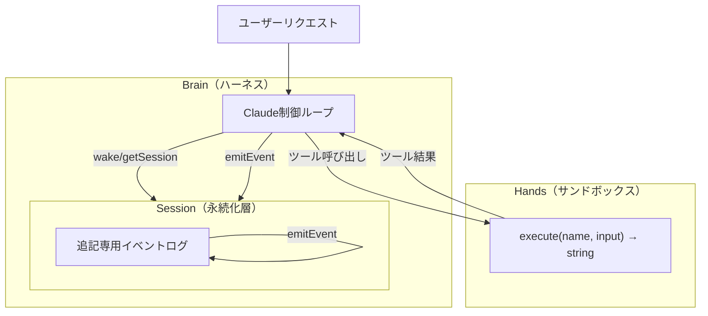
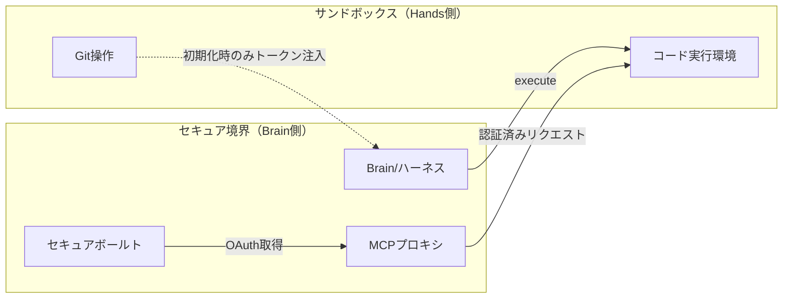

# Anthropicブログ解説: Scaling Managed Agents - Brain/Hands/Session分離アーキテクチャ

## ブログ概要

本記事は [Anthropic Engineering Blog: Scaling Managed Agents: Decoupling the brain from the hands](https://www.anthropic.com/engineering/managed-agents) の解説記事である。

Anthropicのエンジニアリングチーム（Lance Martin, Gabe Cemaj, Michael Cohen）は、マネージドエージェントをプロダクション環境でスケールさせるために、従来のモノリシックなコンテナ設計を**Brain（ハーネス）/ Hands（サンドボックス）/ Session（イベントログ）**の3コンポーネントに分離するアーキテクチャを採用した。著者らは、この分離により**TTFT（Time To First Token）のp50が約60%削減、p95が90%以上削減**されたと報告している。各コンポーネントが独立して障害からの回復・交換が可能となり、カスケード障害を防止する設計が実現された。

この記事は [Zenn記事: Deep AgentsのHarness Profilesでモデル別エージェント挙動を制御する](https://zenn.dev/0h_n0/articles/b9a0f33be2f0ac) の深掘りです。

---

## 情報源

- **種別**: 企業テックブログ
- **URL**: [https://www.anthropic.com/engineering/managed-agents](https://www.anthropic.com/engineering/managed-agents)
- **組織**: Anthropic
- **著者**: Lance Martin, Gabe Cemaj, Michael Cohen
- **貢献者**: Nodir Turakulov, Jeremy Fox, Agents API team, Jake Eaton
- **公開日**: 2026年4月8日

---

## 技術的背景

### モノリシック・コンテナ設計の構造的限界

LLMベースのエージェントシステムをプロダクション環境で運用する場合、最も直感的な実装は単一コンテナにモデル推論ループ・ツール実行環境・セッション状態をすべて同居させる設計である。しかし、著者らはこの構成には以下の深刻な問題があると述べている。

**障害の連鎖（Cascading Failures）**: コンテナ内でツール実行が失敗すると、モデルの推論ループ全体がクラッシュし、進行中のセッション状態も失われる。サンドボックスの障害がエージェント全体の障害に直結する。

**リソース効率の低下**: モデル推論はGPU/CPUバースト型のワークロードであるのに対し、ツール実行（ファイル操作、Git操作、API呼び出し等）はI/Oバウンドのワークロードである。これらを同一コンテナでプロビジョニングすると、リソースの過剰割り当てか不足が常に発生する。

**TTFT（Time To First Token）の悪化**: 全コンポーネントを含む重いコンテナをツール呼び出しごとにプロビジョニングすると、起動時間がレイテンシの支配的要因となる。

**スケーリングの硬直性**: コンポーネントが密結合しているため、推論ループだけをスケールアウトすることも、サンドボックスだけを増設することもできない。

この背景から、著者らはマイクロサービスにおける関心の分離（Separation of Concerns）をエージェントアーキテクチャに適用し、Brain/Hands/Sessionの3層分離に到達したと説明している。

---

## 実装アーキテクチャ

### Brain/Hands/Session 3層分離モデル

著者らが提唱するアーキテクチャは、以下の3コンポーネントで構成される。



#### 1. Brain（ハーネス）

BrainはClaudeモデルとその制御ループを指す。ブログでは「ハーネス」とも呼ばれている。

**責務**: ユーザーからの入力を受け取り、モデル推論を実行し、ツール呼び出しの判断と結果の解釈を行う。

**設計原則**: **完全にステートレス**であること。Brainは内部にセッション状態を保持せず、すべての状態をSession層に委譲する。これにより、Brainコンテナが障害で終了しても、新しいBrainインスタンスがSessionからイベントログを読み込んで処理を再開できる。

著者らは、Brainのステートレス性を以下の3つの耐久性プリミティブで実現したと述べている。

- `wake(sessionId)`: 指定されたセッションIDでBrainを起動し、既存のイベントログから状態を復元する
- `getSession(id)`: セッションの現在の状態（イベントログ全体）を取得する
- `emitEvent(id, event)`: セッションに新しいイベントを追記する

これらのプリミティブにより、Brainはリブート後もイベントログを再生することで、中断された処理を正確に再開できる。

#### 2. Hands（サンドボックス）

Handsはツール実行環境であり、コード実行、ファイル操作、Git操作、外部API呼び出しなどを行うサンドボックスである。

**標準化インターフェース**: すべてのツールは `execute(name, input) → string` という統一的なインターフェースでアクセスされる。この抽象化により、ツールの実装詳細がBrainから完全に隠蔽される。

**「Cattle」としてのコンテナ管理**: 著者らは、Handsコンテナを「ペット（pets）」ではなく「家畜（cattle）」として扱う設計哲学を採用したと述べている。具体的には以下の通りである。

- コンテナはツール呼び出し時にオンデマンドでプロビジョニングされる
- 失敗したコンテナはツール呼び出しエラーを生成し、Brainがキャッチして新しいインスタンスを再初期化する
- 個々のコンテナの存続に依存しない設計

この設計の要点は、Handsの障害がBrainやSessionに波及しないことである。コンテナが予期せず終了しても、Brainは新しいHandsインスタンスを起動してツール呼び出しをリトライできる。

#### 3. Session（永続化層）

Sessionは**耐久性のある追記専用（append-only）イベントログ**であり、コンテナ外部の永続ストレージに保存される。

**設計の核心**: Sessionは「コンテキストウィンドウ外の耐久的コンテキストオブジェクト」として機能する。モデルのコンテキストウィンドウは有限であるが、Sessionログは理論上無制限に蓄積可能であり、過去のすべてのイベント（ユーザー入力、モデル応答、ツール呼び出し結果、エラー情報）を保持する。

**`getEvents()`インターフェース**: 著者らは、Sessionログの照会に柔軟なインターフェースを提供していると述べている。具体的には以下の操作をサポートする。

- **位置スライシング**: イベントログの特定範囲を取得する
- **巻き戻し（rewind）**: 特定の時点まで状態を巻き戻す
- **コンテキスト書き換え**: Claudeに渡す前にイベントストリームを変換する（要約、フィルタリングなど）

この柔軟性により、コンテキストウィンドウの制約内で最適な情報をモデルに提供するコンテキスト管理戦略を実装できる。

---

### セキュリティ境界の設計

3層分離アーキテクチャのセキュリティ面について、著者らは以下の設計判断を報告している。

**クレデンシャルの隔離**: Claude生成コードが実行されるサンドボックス（Hands）には、クレデンシャルが一切公開されない。これにより、プロンプトインジェクション攻撃やコード実行による認証情報の漏洩を防ぐ。

**Gitトークンの扱い**: Gitリポジトリの初期化時にトークンをバンドルし、以降のpush/pull操作ではエージェントがトークンを直接扱わない設計となっている。

**OAuthトークンの管理**: OAuthトークンはサンドボックス外のセキュアボールトに保存される。MCPプロキシ（Model Context Protocol proxy）が必要時にトークンを取得し、サンドボックス内のコードからはトークンの存在自体が見えない。



この設計により、万が一サンドボックス内のコードが侵害されても、認証情報へのアクセスが構造的に不可能となる。

---

## パフォーマンス最適化

### TTFT削減の実測値

著者らは、3層分離アーキテクチャの導入により以下のパフォーマンス改善を報告している。

| メトリクス | 改善率 | 意味 |
|-----------|--------|------|
| TTFT p50 | 約60%削減 | 中央値のユーザー体験が大幅改善 |
| TTFT p95 | 90%以上削減 | テールレイテンシがほぼ解消 |

**p95の90%以上削減**は特に注目に値する。モノリシック設計では、重いコンテナの起動やリソース競合がテールレイテンシの主因であったが、分離設計ではBrainが軽量なステートレスコンテナとして起動し、Handsはツール呼び出し時にのみオンデマンドプロビジョニングされるため、不要なリソース初期化が排除された。

### オンデマンド・プロビジョニング戦略

Handsコンテナのオンデマンド・プロビジョニングは、TTFT削減の主要な要因である。従来の設計ではセッション開始時にすべての実行環境を準備する必要があったが、分離設計では以下のフローとなる。

1. ユーザーリクエスト到着 → Brainのみ起動（軽量、ステートレス）
2. モデル推論で初回応答を生成 → **TTFTはBrainの起動時間のみに依存**
3. ツール呼び出しが必要な場合のみHandsをプロビジョニング
4. ツール実行完了後、Handsは不要であれば解放可能

この戦略により、ツールを使用しない応答（純粋なテキスト生成）ではHandsのプロビジョニングコストがゼロとなる。

---

## 運用での学び

### コンテナ障害からの回復パターン

著者らは、プロダクション環境での障害パターンとその対処について以下の知見を共有している。

**Hands障害**: サンドボックスコンテナが予期せず終了した場合、ツール呼び出しはエラーを返す。Brainはこのエラーをキャッチし、新しいHandsインスタンスを自動的に再初期化する。Sessionにはエラーイベントも記録されるため、モデルは「前回のツール呼び出しが失敗した」というコンテキストを持った状態で処理を再開できる。

**Brain障害**: ハーネスがクラッシュした場合、新しいBrainインスタンスが`wake(sessionId)`を呼び出し、Sessionからイベントログを再生して状態を復元する。ステートレス設計により、Brain障害がSessionの整合性に影響を与えない。

**Session層の耐久性**: Sessionは追記専用のイベントログであり、コンテナ外部の永続ストレージに保存される。BrainとHandsの両方が同時にクラッシュしても、Sessionデータは保全される。

### モデル固有の動作とハーネス設計の進化

著者らは、モデルの世代によってエージェントの動作特性が大きく異なることを報告している。これはZenn記事「Deep AgentsのHarness Profilesでモデル別エージェント挙動を制御する」で論じられているハーネスプロファイル概念に直結する知見である。

**「コンテキスト不安」（Context Anxiety）**: Claude Sonnet 4.5では、コンテキストウィンドウの限界に近づくとタスクを早期終了する傾向（著者らはこれを「コンテキスト不安」と呼んでいる）が観察された。この動作に対処するため、ハーネスにコンテキストリセット機構が実装された。

**モデル進化による陳腐化**: Claude Opus 4.5ではこの「コンテキスト不安」が消失したと報告されている。結果として、コンテキストリセットのハーネスコンポーネントが不要となった。著者らはこれを「ハーネスの仮定がモデルの進化に伴い陳腐化する」現象として指摘している。

この知見は、ハーネス設計においてモデル固有の動作に対する**アダプティブなプロファイル管理**が不可欠であることを示している。モデルがアップグレードされるたびにハーネスの各コンポーネントを再評価し、不要になった回避策を除去する必要がある。

### VPCピアリング不要の通信設計

従来のモノリシック設計では、複数のエージェントインスタンス間の通信にVPCピアリングが必要であったが、分離設計ではBrain間通信がSessionを介して行われるため、VPCピアリングが不要となった。これにより、マルチリージョンデプロイメントのネットワーク設計が大幅に簡素化される。

### マルチ実行環境間の推論

著者らは、初期のモデルでは複数の実行環境（異なるHandsインスタンス）間の推論が困難であったが、モデルのインテリジェンスのスケーリングにより、これが可能になったと報告している。Brain/Hands分離設計は、この能力の進化を前提としている。

---

## 学術研究との関連

### Separation of Concernsの適用

著者らのBrain/Hands/Session分離は、ソフトウェア工学における**Separation of Concerns（関心の分離）**をLLMエージェントアーキテクチャに適用したものである。従来のマイクロサービス設計ではビジネスロジック、データ永続化、外部I/Oの分離が標準的だが、著者らはこれを「推論（Brain）」「実行（Hands）」「状態（Session）」に対応させている。

### Event Sourcing パターン

Sessionの追記専用イベントログは、**Event Sourcing**パターン（Fowler, 2005）との類似性が指摘できる。Event Sourcingでは、システムの状態を「現在の状態のスナップショット」ではなく「イベントの系列」として永続化する。Sessionのイベントログはまさにこのパターンに該当し、任意の時点への巻き戻しやイベントの再生による状態復元が可能である。

### Cattle vs Pets のインフラ哲学

Handsコンテナを「cattle」として扱う設計は、**Cattle vs Pets**のインフラ哲学（Bill Baker, Microsoft, 2012年頃に提唱）に基づいている。この哲学はクラウドネイティブなコンテナオーケストレーション（Kubernetes等）で広く採用されているが、著者らはこれをLLMエージェントの実行環境管理に適用した点が独自性である。

---

## Production Deployment Guide

本セクションでは、著者らのBrain/Hands/Session分離アーキテクチャをAWS上でプロダクション環境として構築するための具体的な構成を示す。記事生成時点（2026年5月）の料金に基づく概算値であり、実際のコストはトラフィックパターン、リージョン、バースト使用量により変動する。最新料金はAWS料金計算ツールで確認を推奨する。

### AWS実装パターン（コスト最適化重視）

#### トラフィック量別の推奨構成

| 構成 | トラフィック | 月額コスト | 主要サービス |
|------|------------|-----------|-------------|
| Small | ~100 req/日 | $50-150 | Lambda + Step Functions + DynamoDB |
| Medium | ~1,000 req/日 | $400-900 | ECS Fargate + ElastiCache + DynamoDB |
| Large | 10,000+ req/日 | $2,500-6,000 | EKS + Karpenter + Spot Instances |

**Small構成（~100 req/日、月額$50-150）**:
- **Brain**: Lambda関数（1024MB RAM、タイムアウト900秒）でステートレスなClaude制御ループを実行。Bedrock InvokeModel APIでClaude呼び出し。月額$20-40（Lambda + Bedrock）。
- **Hands**: Lambda関数（別関数、2048MB RAM）でツール実行サンドボックスを提供。Step Functionsでオーケストレーション。月額$10-30。
- **Session**: DynamoDB On-Demand（追記専用イベントログ）。月額$5-20。
- **Bedrock推論**: Claude Sonnet 4使用。入力$3/MTok、出力$15/MTok。月額$15-60。

**Medium構成（~1,000 req/日、月額$400-900）**:
- **Brain**: ECS Fargate（0.5 vCPU、1GB RAM）。Brainコンテナは軽量イメージ（< 200MB）。月額$100-200。
- **Hands**: ECS Fargate（1 vCPU、2GB RAM）でオンデマンドタスク起動。月額$150-300。
- **Session**: DynamoDB + ElastiCache（Redis、cache.t4g.small）で頻繁なgetEvents()を高速化。月額$80-150。
- **Bedrock推論**: Prompt Caching有効化で30-90%削減。月額$70-250。

**Large構成（10,000+ req/日、月額$2,500-6,000）**:
- **Brain**: EKS + Karpenter。Spot Instances優先（c6g.xlarge、ARM）で最大90%コスト削減。月額$800-1,500。
- **Hands**: EKS Pod（Spot Instances、m6g.large）でオンデマンド起動。Karpenter Provisionerで自動スケーリング。月額$600-1,200。
- **Session**: DynamoDB + DAX（DynamoDB Accelerator）でマイクロ秒レイテンシ。月額$400-800。
- **Bedrock推論**: Batch API使用で50%削減。Prompt Caching併用。月額$700-2,500。

**コスト削減テクニック**:
- Spot Instances活用でBrain/Handsコンテナのコストを最大90%削減
- Reserved Instances（1年コミット）でベースラインワーカーを最大72%削減
- Bedrock Batch API使用で非リアルタイム推論を50%削減
- Prompt Caching有効化で反復的な推論パターンを30-90%削減

### Terraformインフラコード

#### Small構成（Serverless: Lambda + DynamoDB）

```hcl
# Brain/Hands/Session分離 - Small構成
# AWS ap-northeast-1（東京）、2026年5月時点の構成

terraform {
  required_version = ">= 1.9"
  required_providers {
    aws = {
      source  = "hashicorp/aws"
      version = "~> 5.80"
    }
  }
}

provider "aws" {
  region = "ap-northeast-1"
}

# === Session層: DynamoDB（追記専用イベントログ） ===
resource "aws_dynamodb_table" "session_events" {
  name         = "managed-agent-sessions"
  billing_mode = "PAY_PER_REQUEST"  # On-Demand: 低トラフィック時コスト最適
  hash_key     = "session_id"
  range_key    = "event_seq"

  attribute {
    name = "session_id"
    type = "S"
  }
  attribute {
    name = "event_seq"
    type = "N"
  }

  point_in_time_recovery {
    enabled = true  # Session耐久性のためPITR有効化
  }

  server_side_encryption {
    enabled = true  # KMS暗号化
  }

  tags = {
    Component = "session"
    Project   = "managed-agents"
  }
}

# === Brain層: Lambda（ステートレスClaude制御ループ） ===
resource "aws_iam_role" "brain_role" {
  name = "managed-agent-brain-role"
  assume_role_policy = jsonencode({
    Version = "2012-10-17"
    Statement = [{
      Action = "sts:AssumeRole"
      Effect = "Allow"
      Principal = { Service = "lambda.amazonaws.com" }
    }]
  })
}

resource "aws_iam_role_policy" "brain_policy" {
  name = "brain-minimal-permissions"
  role = aws_iam_role.brain_role.id
  policy = jsonencode({
    Version = "2012-10-17"
    Statement = [
      {
        Effect   = "Allow"
        Action   = ["bedrock:InvokeModel", "bedrock:InvokeModelWithResponseStream"]
        Resource = "arn:aws:bedrock:ap-northeast-1::foundation-model/anthropic.claude-*"
      },
      {
        Effect   = "Allow"
        Action   = ["dynamodb:GetItem", "dynamodb:PutItem", "dynamodb:Query"]
        Resource = aws_dynamodb_table.session_events.arn
      },
      {
        Effect   = "Allow"
        Action   = ["lambda:InvokeFunction"]
        Resource = aws_lambda_function.hands.arn
      },
      {
        Effect   = "Allow"
        Action   = ["logs:CreateLogGroup", "logs:CreateLogStream", "logs:PutLogEvents"]
        Resource = "arn:aws:logs:ap-northeast-1:*:*"
      }
    ]
  })
}

resource "aws_lambda_function" "brain" {
  function_name = "managed-agent-brain"
  runtime       = "python3.12"
  handler       = "brain.handler"
  role          = aws_iam_role.brain_role.arn
  timeout       = 900      # 最大15分
  memory_size   = 1024     # Brain: 推論ループのみなので1GB

  environment {
    variables = {
      SESSION_TABLE = aws_dynamodb_table.session_events.name
      HANDS_FUNCTION = aws_lambda_function.hands.function_name
      MODEL_ID      = "anthropic.claude-sonnet-4-20250514"
    }
  }

  filename = "brain.zip"  # デプロイパッケージ

  tags = {
    Component = "brain"
  }
}

# === Hands層: Lambda（サンドボックスツール実行） ===
resource "aws_lambda_function" "hands" {
  function_name = "managed-agent-hands"
  runtime       = "python3.12"
  handler       = "hands.handler"
  role          = aws_iam_role.hands_role.arn
  timeout       = 300      # ツール実行: 5分
  memory_size   = 2048     # Hands: コード実行のため2GB

  environment {
    variables = {
      SANDBOX_MODE = "restricted"
    }
  }

  filename = "hands.zip"

  tags = {
    Component = "hands"
  }
}

resource "aws_iam_role" "hands_role" {
  name = "managed-agent-hands-role"
  assume_role_policy = jsonencode({
    Version = "2012-10-17"
    Statement = [{
      Action = "sts:AssumeRole"
      Effect = "Allow"
      Principal = { Service = "lambda.amazonaws.com" }
    }]
  })
}

# Hands: 最小権限（Bedrockアクセスなし、クレデンシャル隔離）
resource "aws_iam_role_policy" "hands_policy" {
  name = "hands-minimal-permissions"
  role = aws_iam_role.hands_role.id
  policy = jsonencode({
    Version = "2012-10-17"
    Statement = [
      {
        Effect   = "Allow"
        Action   = ["logs:CreateLogGroup", "logs:CreateLogStream", "logs:PutLogEvents"]
        Resource = "arn:aws:logs:ap-northeast-1:*:*"
      },
      {
        Effect   = "Allow"
        Action   = ["s3:GetObject", "s3:PutObject"]
        Resource = "arn:aws:s3:::managed-agent-workspace/*"
      }
    ]
  })
}

# === 監視: CloudWatch アラーム ===
resource "aws_cloudwatch_metric_alarm" "brain_errors" {
  alarm_name          = "managed-agent-brain-errors"
  comparison_operator = "GreaterThanThreshold"
  evaluation_periods  = 2
  metric_name         = "Errors"
  namespace           = "AWS/Lambda"
  period              = 300
  statistic           = "Sum"
  threshold           = 5
  alarm_description   = "Brain Lambda errors > 5 in 10 min"

  dimensions = {
    FunctionName = aws_lambda_function.brain.function_name
  }
}
```

#### Large構成（Container: EKS + Karpenter + Spot）

```hcl
# Brain/Hands/Session分離 - Large構成
# EKS + Karpenter + Spot Instances

module "eks" {
  source  = "terraform-aws-modules/eks/aws"
  version = "~> 20.31"

  cluster_name    = "managed-agents-cluster"
  cluster_version = "1.31"

  vpc_id     = module.vpc.vpc_id
  subnet_ids = module.vpc.private_subnets

  # コントロールプレーンのみ（ノードはKarpenterが管理）
  cluster_endpoint_public_access = false

  tags = {
    Project = "managed-agents"
  }
}

# Karpenter: Spot優先の自動スケーリング
resource "helm_release" "karpenter" {
  name       = "karpenter"
  repository = "oci://public.ecr.aws/karpenter"
  chart      = "karpenter"
  version    = "1.1.1"
  namespace  = "kube-system"
}

# Brain用NodePool: 軽量Spot
resource "kubectl_manifest" "brain_nodepool" {
  yaml_body = yamlencode({
    apiVersion = "karpenter.sh/v1"
    kind       = "NodePool"
    metadata   = { name = "brain-pool" }
    spec = {
      template = {
        spec = {
          requirements = [
            { key = "karpenter.sh/capacity-type", operator = "In", values = ["spot", "on-demand"] },
            { key = "node.kubernetes.io/instance-type", operator = "In",
              values = ["c6g.medium", "c6g.large", "c7g.medium"] },
          ]
          nodeClassRef = { group = "karpenter.k8s.aws", kind = "EC2NodeClass", name = "default" }
        }
      }
      limits   = { cpu = "32", memory = "64Gi" }
      disruption = {
        consolidationPolicy = "WhenEmptyOrUnderutilized"
        consolidateAfter    = "30s"
      }
    }
  })
}

# Hands用NodePool: オンデマンド起動、Spot優先
resource "kubectl_manifest" "hands_nodepool" {
  yaml_body = yamlencode({
    apiVersion = "karpenter.sh/v1"
    kind       = "NodePool"
    metadata   = { name = "hands-pool" }
    spec = {
      template = {
        spec = {
          requirements = [
            { key = "karpenter.sh/capacity-type", operator = "In", values = ["spot"] },
            { key = "node.kubernetes.io/instance-type", operator = "In",
              values = ["m6g.large", "m6g.xlarge", "m7g.large"] },
          ]
          nodeClassRef = { group = "karpenter.k8s.aws", kind = "EC2NodeClass", name = "default" }
        }
      }
      limits   = { cpu = "64", memory = "128Gi" }
      disruption = {
        consolidationPolicy = "WhenEmptyOrUnderutilized"
        consolidateAfter    = "60s"
      }
    }
  })
}

# Secrets Manager: Bedrock設定（サンドボックス外）
resource "aws_secretsmanager_secret" "bedrock_config" {
  name = "managed-agents/bedrock-config"
}

# AWS Budgets: 月額予算アラート
resource "aws_budgets_budget" "monthly" {
  name         = "managed-agents-monthly"
  budget_type  = "COST"
  limit_amount = "6000"
  limit_unit   = "USD"
  time_unit    = "MONTHLY"

  notification {
    comparison_operator       = "GREATER_THAN"
    threshold                 = 80
    threshold_type            = "PERCENTAGE"
    notification_type         = "ACTUAL"
    subscriber_email_addresses = ["alerts@example.com"]
  }
}
```

### 運用・監視設定

#### CloudWatch Logs Insights クエリ

```
# コスト異常検知: 1時間あたりのBedrock トークン使用量
fields @timestamp, @message
| filter @message like /bedrock/
| stats sum(input_tokens) as total_input, sum(output_tokens) as total_output by bin(1h)
| sort @timestamp desc

# レイテンシ分析: Brain→Hands間のツール呼び出しレイテンシ P95/P99
fields @timestamp, tool_name, duration_ms
| filter component = "brain" and event_type = "tool_call"
| stats percentile(duration_ms, 95) as p95, percentile(duration_ms, 99) as p99 by tool_name
```

#### CloudWatch アラーム設定（Python）

```python
import boto3

cloudwatch = boto3.client("cloudwatch", region_name="ap-northeast-1")

def create_bedrock_token_alarm() -> None:
    """Bedrockトークン使用量スパイク検知アラーム"""
    cloudwatch.put_metric_alarm(
        AlarmName="bedrock-token-spike",
        MetricName="InputTokenCount",
        Namespace="AWS/Bedrock",
        Statistic="Sum",
        Period=3600,
        EvaluationPeriods=1,
        Threshold=500000,
        ComparisonOperator="GreaterThanThreshold",
        AlarmActions=["arn:aws:sns:ap-northeast-1:ACCOUNT:alerts"],
    )

def create_brain_duration_alarm() -> None:
    """Brain Lambda実行時間異常検知"""
    cloudwatch.put_metric_alarm(
        AlarmName="brain-duration-anomaly",
        MetricName="Duration",
        Namespace="AWS/Lambda",
        Statistic="p95",
        Period=300,
        EvaluationPeriods=3,
        Threshold=600000,  # 10分超過で警告
        ComparisonOperator="GreaterThanThreshold",
        Dimensions=[{"Name": "FunctionName", "Value": "managed-agent-brain"}],
        AlarmActions=["arn:aws:sns:ap-northeast-1:ACCOUNT:alerts"],
    )
```

#### X-Ray トレーシング設定（Python）

```python
from aws_xray_sdk.core import xray_recorder, patch_all

# boto3自動計装
patch_all()

def trace_tool_execution(session_id: str, tool_name: str, tool_input: str) -> str:
    """ツール実行のX-Rayトレーシング"""
    subsegment = xray_recorder.begin_subsegment(f"tool:{tool_name}")
    subsegment.put_annotation("session_id", session_id)
    subsegment.put_annotation("component", "hands")
    subsegment.put_metadata("tool_input", tool_input, "agent")
    try:
        result = execute_tool(tool_name, tool_input)
        subsegment.put_metadata("tool_output_size", len(result), "agent")
        return result
    except Exception as e:
        subsegment.add_exception(e, stack=True)
        raise
    finally:
        xray_recorder.end_subsegment()
```

#### Cost Explorer 自動レポート（Python）

```python
import boto3
from datetime import datetime, timedelta

ce = boto3.client("ce", region_name="us-east-1")
sns = boto3.client("sns", region_name="ap-northeast-1")

def daily_cost_report() -> dict:
    """日次コストレポート取得"""
    end = datetime.utcnow().strftime("%Y-%m-%d")
    start = (datetime.utcnow() - timedelta(days=1)).strftime("%Y-%m-%d")

    response = ce.get_cost_and_usage(
        TimePeriod={"Start": start, "End": end},
        Granularity="DAILY",
        Metrics=["UnblendedCost"],
        Filter={
            "Tags": {
                "Key": "Project",
                "Values": ["managed-agents"],
            }
        },
        GroupBy=[{"Type": "SERVICE", "Key": "SERVICE"}],
    )

    total = sum(
        float(g["Metrics"]["UnblendedCost"]["Amount"])
        for r in response["ResultsByTime"]
        for g in r["Groups"]
    )

    if total > 100:
        sns.publish(
            TopicArn="arn:aws:sns:ap-northeast-1:ACCOUNT:cost-alerts",
            Subject="Managed Agents: 日次コスト $100超過",
            Message=f"日次コスト: ${total:.2f}\n詳細: {response}",
        )

    return {"date": start, "total_cost": total, "breakdown": response}
```

### コスト最適化チェックリスト

**アーキテクチャ選択**:
- [ ] トラフィック量に応じた構成選択（~100 req/日: Serverless、~1,000 req/日: Hybrid、10,000+: Container）
- [ ] Brain/Hands分離によりリソースの独立スケーリングが可能か確認
- [ ] Session層のストレージ選択（DynamoDB On-Demand vs Provisioned）

**リソース最適化**:
- [ ] EC2/EKS: Spot Instances優先（最大90%削減）
- [ ] Reserved Instances: 1年コミットでベースライン確保（最大72%削減）
- [ ] Savings Plans: Compute Savings Plansで柔軟性維持
- [ ] Lambda: Power Tuningでメモリサイズ最適化（Brain 1024MB、Hands 2048MB目安）
- [ ] ECS/EKS: Karpenter consolidationPolicyでアイドル時自動スケールダウン

**LLMコスト削減**:
- [ ] Bedrock Batch API: 非リアルタイム処理で50%削減
- [ ] Prompt Caching有効化: 反復パターンで30-90%削減
- [ ] モデル選択ロジック: 軽量タスクはHaiku、複雑タスクはSonnet/Opus
- [ ] トークン数制限: max_tokens設定で過剰生成防止
- [ ] コンテキスト圧縮: getEvents()で必要なイベントのみ取得

**監視・アラート**:
- [ ] AWS Budgets: プロジェクト別月額予算設定
- [ ] CloudWatch アラーム: Bedrockトークンスパイク、Lambda実行時間
- [ ] Cost Anomaly Detection: 自動異常検知有効化
- [ ] 日次コストレポート: Cost Explorer APIで自動生成
- [ ] X-Ray: Brain→Hands間レイテンシの可視化

**リソース管理**:
- [ ] 未使用リソース削除: 孤立したHandsコンテナ、未参照セッション
- [ ] タグ戦略: Component（brain/hands/session）+ Project タグ必須
- [ ] ライフサイクルポリシー: 古いSessionログのS3 Glacier移行
- [ ] 開発環境夜間停止: EKSノード数を0にスケールダウン
- [ ] ECRイメージ: ライフサイクルポリシーで古いイメージを自動削除

---

## 実運用への応用

### Zenn記事との接続

本ブログで報告されているBrain/Hands/Session分離アーキテクチャは、Zenn記事「Deep AgentsのHarness Profilesでモデル別エージェント挙動を制御する」で論じられている**ハーネスプロファイル**の設計思想と直接的に関連する。

具体的には、Brain層はZenn記事でのHarness Profileに対応し、モデルごとの動作特性（コンテキスト不安の有無、ツール使用パターン等）に基づいてハーネスのコンポーネント構成を動的に変更する仕組みである。著者らが報告したClaude Sonnet 4.5とClaude Opus 4.5でのコンテキスト不安の差異は、ハーネスプロファイルがモデル固有の動作を吸収する設計の必要性を裏付けている。

### プロダクション適用時の考慮事項

**コンテキスト管理戦略**: getEvents()の柔軟性を活用し、モデルのコンテキストウィンドウに収まるようイベントストリームを要約・フィルタリングする戦略が必要である。ただし、著者らが報告しているように、モデルの進化によりこの戦略の最適解も変化するため、継続的な評価が求められる。

**マルチテナント環境での適用**: Brain/Hands/Session分離はマルチテナント環境に適している。Brainをテナント共有とし、HandsとSessionをテナントごとに隔離することで、セキュリティとリソース効率を両立できる。

**段階的な移行**: モノリシック設計からの移行は、まずSessionの外部化から始め、次にHandsの分離、最後にBrainのステートレス化という段階的なアプローチが著者らの設計から示唆される。

---

## まとめと実践への示唆

Anthropicが公開したBrain/Hands/Session分離アーキテクチャは、LLMエージェントのプロダクション運用における主要な課題（障害の連鎖、リソース効率、レイテンシ）に対する体系的な解決策を提示している。著者らが報告したTTFT p50の約60%削減、p95の90%以上削減という成果は、分離設計の実効性を定量的に示している。

特に、モデルの世代による動作特性の差異（コンテキスト不安の有無）がハーネス設計に与える影響は、エージェントシステムの運用において継続的なハーネスプロファイルの更新が不可欠であることを示す重要な知見である。Sessionの追記専用イベントログによる耐久性パターンは、Event Sourcingの実績ある設計パターンをLLMエージェントに適用した実用的な例として参考になる。

ただし、著者らの報告は自社プロダクション環境（Anthropicのインフラ）での結果であり、異なるインフラ環境やワークロードパターンでの再現性については留意が必要である。

---

## 参考文献

- **Blog URL**: [Scaling Managed Agents: Decoupling the brain from the hands](https://www.anthropic.com/engineering/managed-agents)
- **Related Zenn article**: [Deep AgentsのHarness Profilesでモデル別エージェント挙動を制御する](https://zenn.dev/0h_n0/articles/b9a0f33be2f0ac)
