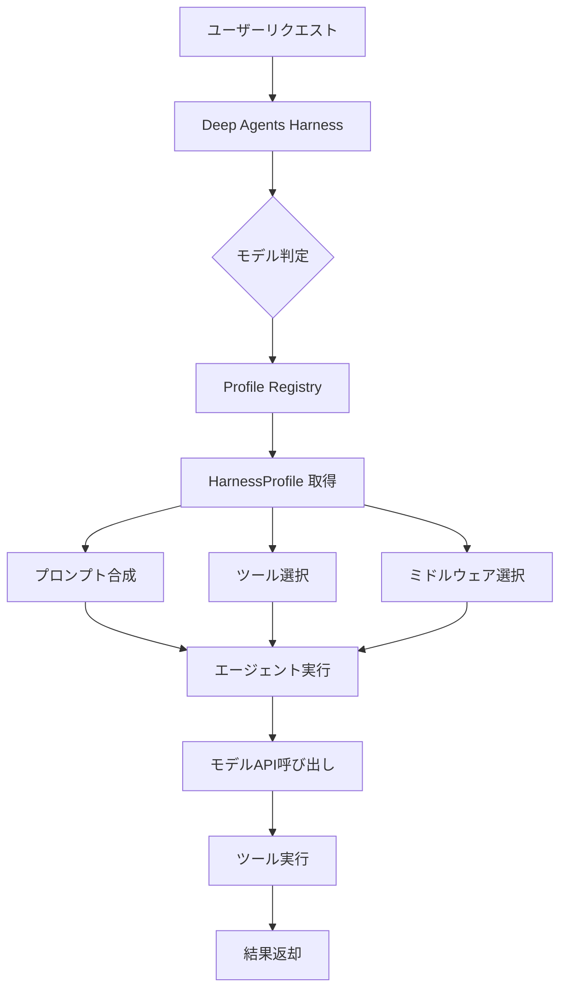
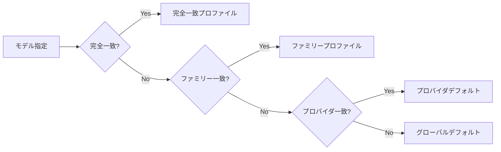
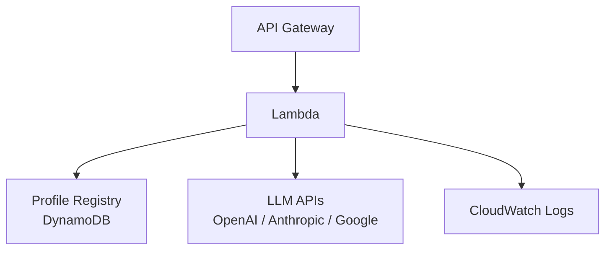
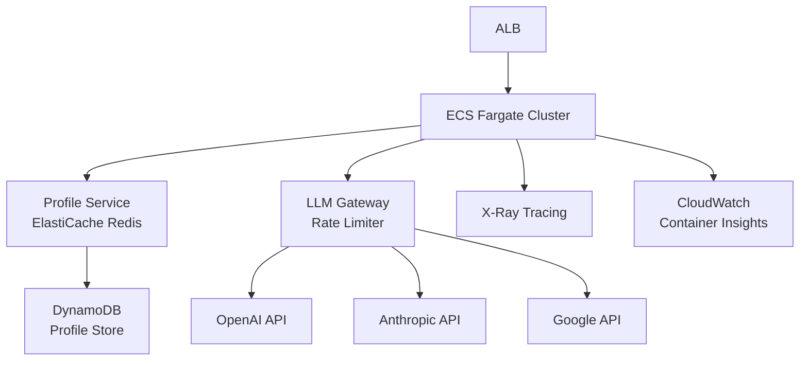

## ブログ概要

本記事は [Tuning Deep Agents to Work Well with Different Models](https://www.langchain.com/blog/tuning-deep-agents-different-models)（LangChain公式ブログ、2026年4月29日、Vivek Trivedy・Mason Daugherty著）の解説記事です。

LLMベースのエージェントフレームワークにおいて、モデルごとに異なるプロンプト戦略やツール構成が必要になる問題は広く認識されている。LangChainのDeep Agentsプロジェクトでは、この問題に対して**Harness Profiles**という宣言的なオーバーライド機構を導入した。著者らは、Harness Profilesを用いたモデル別チューニングにより、tau2-benchベンチマークにおいてGPT 5.3 Codexで33%から53%へ、Claude Opus 4.7で43%から53%へとスコアが改善したと報告している（ブログのベンチマーク表より）。

本記事では、Harness Profilesの設計思想、実装パターン、およびプロダクション環境での運用方法を技術的に解説する。

この記事は [Zenn記事: Deep AgentsのHarness Profilesでモデル別エージェント挙動を制御する](https://zenn.dev/0h_n0/articles/b9a0f33be2f0ac) の深掘りです。

## 情報源

- **種別**: 企業テックブログ（LangChain）
- **URL**: [Tuning Deep Agents to Work Well with Different Models](https://www.langchain.com/blog/tuning-deep-agents-different-models)
- **著者**: Vivek Trivedy, Mason Daugherty
- **発行日**: 2026年4月29日
- **組織**: LangChain

## 技術的背景

### マルチモデル対応の課題

LLMエージェントの開発において、単一のエージェント実装を複数のモデルで動作させる際、以下の課題が生じる。

**ツール呼び出しの差異**: OpenAIのモデルとAnthropicのモデルでは、ツール呼び出しの期待するフォーマットや命名規則が異なる。たとえばOpenAI系のモデルは`apply_patch`のような差分適用ツールを好む一方、Anthropic系のモデルは`file_edit`のような高レベルなツールインターフェースで高い性能を示す。

**プロンプト最適化の分岐**: あるモデルでは並列ツール呼び出しを促す指示が有効である一方、別のモデルでは逐次実行のほうが安定する場合がある。モデルごとに最適なプロンプト戦略が異なるため、単一のシステムプロンプトでは性能を最大化できない。

**ミドルウェアの互換性**: トークン要約や文脈圧縮などのミドルウェアが、モデルによっては逆効果になるケースがある。

### 従来のアプローチとその限界

```python
# 従来: if-elseによるモデル別分岐
def build_agent(model_name: str):
    if "gpt" in model_name:
        tools = [apply_patch, shell_command]
        system_prompt = "Use parallel tool calls..."
    elif "claude" in model_name:
        tools = [file_edit, execute]
        system_prompt = "Reflect on tool results..."
    elif "gemini" in model_name:
        tools = [file_edit, execute]
        system_prompt = "Be concise..."
    # モデル追加のたびに分岐が増大
    return Agent(model=model_name, tools=tools, prompt=system_prompt)
```

この方式では以下の問題が生じる。

- **スケーラビリティの欠如**: 新しいモデルの追加ごとに条件分岐が増大し、コードの保守が困難になる
- **設定の散在**: プロンプト、ツール、ミドルウェアの設定がコード内に散在し、変更の影響範囲が不透明になる
- **テスト困難性**: 各モデル向けの設定が手続き的に記述されるため、設定の正しさを宣言的に検証しにくい

## 実装アーキテクチャ

### Harness Profilesの設計

著者らはHarness Profilesを「ハーネスの中でモデルごとに異なる部分に対する宣言的なオーバーライドレイヤー（declarative override layers for the parts of the harness that vary per model）」と定義している。

Harness Profileが制御する範囲は以下の通りである。

| 制御対象 | 説明 | 例 |
|---------|------|-----|
| システムプロンプト修正 | モデル固有のプロンプトサフィックスを追加 | 並列呼び出し指示の追加 |
| ツール追加/命名 | ツールの置換やエイリアス設定 | `file_edit` → `apply_patch` |
| ミドルウェア選択 | 不要なミドルウェアの除外 | 要約ミドルウェアの無効化 |
| サブエージェント設定 | サブエージェントの構成変更 | 並列度の調整 |
| スキル | エージェントが利用可能なスキルの制御 | モデル固有スキルの有効化 |

### プロファイル登録の実装

ブログで紹介されているプロファイル登録のコードを以下に示す（ブログ記載のコード例より）。

```python
from deepagents import HarnessProfile, register_harness_profile

register_harness_profile(
    "openai:gpt-5.4",
    HarnessProfile(
        system_prompt_suffix="Respond in under 100 words.",
        excluded_tools={"execute"},
        excluded_middleware={"SummarizationMiddleware"},
    ),
)
```

この設計では、モデル識別子（`openai:gpt-5.4`）に対してプロファイルを紐づける。プロファイルは`HarnessProfile`データクラスとして宣言的に定義され、システムプロンプトの追記、ツールの除外、ミドルウェアの除外を明示的に指定する。

### アーキテクチャ全体像



### モデル別チューニングの詳細

#### OpenAI / Codex向けチューニング

著者らが報告しているOpenAI系モデル向けの主なチューニングは以下の3点である。

1. **ツール名の置換**: `file_edit`を`apply_patch`に置換する。OpenAI系のモデルは差分パッチ形式のツールで高い精度を示すとされている
2. **コマンドツールのエイリアス**: `execute`を`shell_command`にエイリアスする。モデルが期待するツール名に合わせることで、ツール選択の精度が向上する
3. **並列ツール呼び出し指示**: システムプロンプトに並列ツール呼び出しを促す指示を追加する

```python
openai_profile = HarnessProfile(
    system_prompt_suffix=(
        "When multiple independent operations are needed, "
        "use parallel tool calls to improve efficiency."
    ),
    tool_aliases={"file_edit": "apply_patch", "execute": "shell_command"},
    excluded_middleware={"SummarizationMiddleware"},
)
register_harness_profile("openai:gpt-5.3-codex", openai_profile)
```

#### Anthropic / Claude向けチューニング

Anthropic系モデル向けのチューニングは、ツール結果の活用方法に焦点を当てている。

1. **反省（Reflection）ガイダンス**: ツール結果に対して「慎重に品質を振り返り、最適な次のステップを判断せよ（carefully reflect on their quality and determine optimal next steps）」というガイダンスを追加する
2. **直接観察の指示強化**: 「記憶から推論するのではなく、ツールを使って直接状態を観察せよ（use tools to observe state directly rather than reasoning from memory）」という指示を追加する

```python
anthropic_profile = HarnessProfile(
    system_prompt_suffix=(
        "After receiving tool results, carefully reflect on their quality "
        "and determine optimal next steps. Always use tools to observe "
        "state directly rather than reasoning from memory."
    ),
)
register_harness_profile("anthropic:claude-opus-4.7", anthropic_profile)
```

これらのチューニングは、各モデルファミリーの特性を踏まえた設計である。OpenAI系モデルは並列実行と特定のツール名に親和性が高く、Anthropic系モデルはツール結果の反省プロセスを明示することで精度が向上するとされている。

### プロファイル解決の流れ

プロファイルの解決（どのプロファイルを適用するか）は以下の優先順位で行われる。



たとえば`openai:gpt-5.3-codex`が指定された場合、まず完全一致するプロファイルを検索し、見つからなければ`openai:gpt-5.3`ファミリー、さらに`openai`プロバイダのデフォルトプロファイルへとフォールバックする。

## Production Deployment Guide

### AWS実装パターン

Harness Profilesを用いたマルチモデルエージェントをAWS上で運用する際の構成を、トラフィック量別に示す。

#### Small構成（〜100 req/日）

月間コスト目安: $50-150（LLM API料金除く）



- **Lambda**: エージェント実行のエントリポイント。コールドスタート対策としてProvisioned Concurrencyは不要（リクエスト頻度が低いため）
- **DynamoDB**: プロファイル定義の格納。オンデマンドキャパシティで十分
- **API Gateway**: REST APIエンドポイント。スロットリングで過負荷を防止

#### Medium構成（100-10,000 req/日）

月間コスト目安: $200-800（LLM API料金除く）

- Lambda + SQSキューによる非同期処理
- DynamoDB DAXキャッシュでプロファイル読み取りの低レイテンシ化
- CloudWatch Alarms + SNSで異常検知通知

#### Large構成（10,000+ req/日）

月間コスト目安: $1,000-5,000（LLM API料金除く）



- **ECS Fargate**: コンテナベースのスケーラブルな実行環境
- **ElastiCache Redis**: プロファイルのインメモリキャッシュ（TTL 300秒）
- **LLM Gateway**: 各プロバイダのレートリミット管理と自動リトライ
- **X-Ray**: リクエスト全体のトレーシング（プロファイル解決〜モデル応答）

### Terraformインフラコード

#### Small構成

```hcl
# small構成: Lambda + DynamoDB + API Gateway

resource "aws_dynamodb_table" "harness_profiles" {
  name         = "harness-profiles"
  billing_mode = "PAY_PER_REQUEST"
  hash_key     = "model_id"

  attribute {
    name = "model_id"
    type = "S"
  }

  tags = {
    Environment = "production"
    Service     = "deep-agents"
  }
}

resource "aws_lambda_function" "agent_executor" {
  function_name = "deep-agent-executor"
  runtime       = "python3.12"
  handler       = "handler.lambda_handler"
  memory_size   = 512
  timeout       = 300

  environment {
    variables = {
      PROFILE_TABLE    = aws_dynamodb_table.harness_profiles.name
      LOG_LEVEL        = "INFO"
    }
  }

  tags = {
    Environment = "production"
    Service     = "deep-agents"
  }
}

resource "aws_api_gateway_rest_api" "agent_api" {
  name        = "deep-agent-api"
  description = "Deep Agents with Harness Profiles"

  endpoint_configuration {
    types = ["REGIONAL"]
  }
}

resource "aws_cloudwatch_log_group" "agent_logs" {
  name              = "/aws/lambda/deep-agent-executor"
  retention_in_days = 30
}
```

#### Large構成

```hcl
# large構成: ECS Fargate + ElastiCache + ALB

resource "aws_ecs_cluster" "agents" {
  name = "deep-agents-cluster"

  setting {
    name  = "containerInsights"
    value = "enabled"
  }
}

resource "aws_ecs_service" "agent_service" {
  name            = "agent-executor"
  cluster         = aws_ecs_cluster.agents.id
  task_definition = aws_ecs_task_definition.agent.arn
  desired_count   = 3
  launch_type     = "FARGATE"

  load_balancer {
    target_group_arn = aws_lb_target_group.agents.arn
    container_name   = "agent"
    container_port   = 8080
  }

  network_configuration {
    subnets          = var.private_subnet_ids
    security_groups  = [aws_security_group.agent_sg.id]
    assign_public_ip = false
  }
}

resource "aws_elasticache_replication_group" "profiles" {
  replication_group_id = "harness-profiles-cache"
  description          = "Profile cache for Deep Agents"
  node_type            = "cache.r7g.medium"
  num_cache_clusters   = 2
  engine               = "redis"
  engine_version       = "7.1"

  at_rest_encryption_enabled = true
  transit_encryption_enabled = true
}

resource "aws_lb" "agents" {
  name               = "deep-agents-alb"
  internal           = false
  load_balancer_type = "application"
  security_groups    = [aws_security_group.alb_sg.id]
  subnets            = var.public_subnet_ids
}

resource "aws_lb_target_group" "agents" {
  name        = "deep-agents-tg"
  port        = 8080
  protocol    = "HTTP"
  vpc_id      = var.vpc_id
  target_type = "ip"

  health_check {
    path                = "/health"
    healthy_threshold   = 2
    unhealthy_threshold = 3
    interval            = 30
  }
}
```

### 運用・監視設定

#### CloudWatch ダッシュボード

```json
{
  "widgets": [
    {
      "type": "metric",
      "properties": {
        "title": "Profile Resolution Latency",
        "metrics": [
          ["DeepAgents", "ProfileResolutionMs", "Environment", "production"]
        ],
        "period": 60,
        "stat": "p99"
      }
    },
    {
      "type": "metric",
      "properties": {
        "title": "Model API Latency by Provider",
        "metrics": [
          ["DeepAgents", "ModelLatencyMs", "Provider", "openai"],
          ["DeepAgents", "ModelLatencyMs", "Provider", "anthropic"],
          ["DeepAgents", "ModelLatencyMs", "Provider", "google"]
        ],
        "period": 300,
        "stat": "Average"
      }
    },
    {
      "type": "metric",
      "properties": {
        "title": "Agent Task Success Rate by Model",
        "metrics": [
          ["DeepAgents", "TaskSuccessRate", "Model", "gpt-5.3-codex"],
          ["DeepAgents", "TaskSuccessRate", "Model", "claude-opus-4.7"]
        ],
        "period": 3600,
        "stat": "Average"
      }
    }
  ]
}
```

#### X-Ray トレーシング

エージェント実行のトレーシングでは、以下のセグメントを計測することが推奨される。

1. **ProfileResolution**: プロファイル解決（DynamoDB/Redis読み取り）
2. **PromptComposition**: プロンプト合成（ベースプロンプト + プロファイルサフィックス）
3. **ModelInvocation**: LLM API呼び出し（プロバイダ・モデル名をアノテーション）
4. **ToolExecution**: ツール実行（ツール名・実行時間をアノテーション）

```python
from aws_xray_sdk.core import xray_recorder

@xray_recorder.capture("ProfileResolution")
def resolve_profile(model_id: str) -> HarnessProfile:
    subsegment = xray_recorder.current_subsegment()
    subsegment.put_annotation("model_id", model_id)

    profile = cache.get(model_id)
    if profile is None:
        subsegment.put_metadata("cache_hit", False)
        profile = dynamodb_table.get_item(Key={"model_id": model_id})["Item"]
        cache.set(model_id, profile, ttl=300)
    else:
        subsegment.put_metadata("cache_hit", True)

    return HarnessProfile(**profile)
```

#### Cost Explorer タグ戦略

```python
# モデル別・プロファイル別のコスト追跡
COST_TAGS = {
    "Service": "deep-agents",
    "ModelProvider": "openai",  # or "anthropic", "google"
    "ModelId": "gpt-5.3-codex",
    "ProfileVersion": "v2.1",
    "Environment": "production",
}
```

### コスト最適化チェックリスト

- [ ] **プロファイルキャッシュの導入**: DynamoDBへの毎回の読み取りを避け、ElastiCacheまたはLambdaレイヤーのインメモリキャッシュを利用する（TTL 300秒推奨）
- [ ] **不要ミドルウェアの除外**: `excluded_middleware`でモデルに不要な処理を省き、レイテンシとコストを削減する
- [ ] **プロバイダ別レートリミット管理**: 各プロバイダのAPIレートリミットを超えないよう、トークンバケット方式でリクエストを制御する
- [ ] **モデル別タスクルーティング**: 単純なタスクには安価なモデル（Haiku等）を割り当て、複雑なタスクにはOpus等を使う
- [ ] **Provisioned Concurrency（Large構成）**: 予測可能なトラフィックパターンがある場合、ECS Fargateの最小タスク数を適切に設定する
- [ ] **ログレベルの最適化**: 本番環境ではINFOレベルに設定し、デバッグログによるCloudWatchコストを抑制する
- [ ] **Cost Explorerでのタグ別分析**: 上記のタグ戦略により、モデル別・プロファイル別のコスト推移を可視化する

## パフォーマンス最適化

### ベンチマーク結果の分析

著者らはtau2-benchを用いた評価結果を以下のように報告している（ブログのベンチマーク表より）。

| モデル | デフォルトハーネス | カスタムプロファイル適用後 | 改善幅 |
|--------|------------------|------------------------|--------|
| GPT 5.3 Codex | 33% | 53% | +20pt |
| Claude Opus 4.7 | 43% | 53% | +10pt |

この結果から、以下の点が読み取れる。

**モデル間の差が縮小**: デフォルトハーネスではGPT 5.3 Codex（33%）とClaude Opus 4.7（43%）の間に10ptの差があったが、カスタムプロファイル適用後は両者とも53%で同水準に達している。著者らの設計意図として、Harness Profilesはモデル間の性能差を吸収する機構として機能している。

**チューニング効果の非対称性**: GPT 5.3 Codexでは+20ptの大幅な改善が見られた一方、Claude Opus 4.7では+10ptの改善にとどまっている。これは、デフォルトハーネスがAnthropic系モデルに比較的適合していた可能性を示唆する。

### プロファイル解決のパフォーマンス

プロファイル解決はエージェント実行の最初のステップであるため、低レイテンシが求められる。

```python
import time
from functools import lru_cache
from typing import Optional


class ProfileResolver:
    """プロファイル解決を効率化するリゾルバ。

    モデルIDの完全一致 → ファミリー一致 → プロバイダ一致 → グローバルデフォルト
    の優先順位でプロファイルを解決する。
    """

    def __init__(self, registry: dict[str, HarnessProfile]):
        self._registry = registry
        self._cache: dict[str, tuple[HarnessProfile, float]] = {}
        self._cache_ttl = 300.0  # 5分

    def resolve(self, model_id: str) -> HarnessProfile:
        """モデルIDに対応するプロファイルを解決する。

        Args:
            model_id: "provider:model-name" 形式のモデル識別子

        Returns:
            解決されたHarnessProfile
        """
        cached = self._cache.get(model_id)
        if cached and (time.monotonic() - cached[1]) < self._cache_ttl:
            return cached[0]

        profile = self._resolve_hierarchical(model_id)
        self._cache[model_id] = (profile, time.monotonic())
        return profile

    def _resolve_hierarchical(self, model_id: str) -> HarnessProfile:
        # 完全一致
        if model_id in self._registry:
            return self._registry[model_id]

        # ファミリー一致（例: "openai:gpt-5.3-codex" → "openai:gpt-5.3"）
        parts = model_id.rsplit("-", 1)
        if len(parts) == 2:
            family_id = parts[0]
            if family_id in self._registry:
                return self._registry[family_id]

        # プロバイダ一致（例: "openai:gpt-5.3" → "openai"）
        provider = model_id.split(":")[0]
        if provider in self._registry:
            return self._registry[provider]

        # グローバルデフォルト
        return self._registry.get("default", HarnessProfile())
```

### トークン効率の最適化

Harness Profilesのシステムプロンプトサフィックスは、トークン数を意識した設計が求められる。

```python
# 悪い例: 冗長なプロンプトサフィックス
bad_suffix = """
You are an AI assistant that should always try to use tools when possible.
When you receive results from tools, you should carefully examine them
and think about what to do next. It's important to use tools to directly
observe the state of things rather than trying to guess or remember
what the state might be. Please be thorough and careful in your work.
"""  # ~60 tokens

# 良い例: 簡潔で効果的なサフィックス
good_suffix = (
    "After tool results, reflect on quality and determine next steps. "
    "Use tools to observe state directly rather than reasoning from memory."
)  # ~25 tokens
```

トークン数の削減は、以下の点で有利に働く。

- **コンテキストウィンドウの有効活用**: サフィックスが短いほど、タスク固有の指示やツール結果に多くのトークンを割り当てられる
- **API料金の削減**: 入力トークン数に比例する料金を抑制できる
- **レイテンシの短縮**: 入力トークン数が少ないほど、Time To First Token（TTFT）が短縮される傾向がある

## 運用での学び

### マルチモデル運用の実践的知見

著者らのブログから読み取れる運用上の知見を整理する。

#### 1. 宣言的設定の利点

Harness Profilesが宣言的（declarative）であることは、運用面で以下の利点をもたらす。

- **バージョン管理**: プロファイル定義をYAMLやJSONで管理し、Gitでバージョン追跡できる
- **差分レビュー**: プロファイル変更のPRレビューにより、意図しないモデル挙動変更を防止できる
- **ロールバック**: 問題が発生した場合、プロファイルを前のバージョンに戻すだけで復旧できる

```yaml
# profiles/openai-gpt-5.3-codex.yaml
model_id: "openai:gpt-5.3-codex"
version: "2.1"
system_prompt_suffix: |
  When multiple independent operations are needed,
  use parallel tool calls to improve efficiency.
excluded_tools:
  - execute
tool_aliases:
  file_edit: apply_patch
  execute: shell_command
excluded_middleware:
  - SummarizationMiddleware
```

#### 2. プロファイルのテスト戦略

プロファイル変更の影響を評価するには、ベンチマークの自動実行が有効である。

```python
import pytest
from deepagents import HarnessProfile, load_profile


class TestHarnessProfile:
    """プロファイルの整合性テスト。"""

    def test_openai_profile_excludes_execute(self) -> None:
        profile = load_profile("openai:gpt-5.3-codex")
        assert "execute" in profile.excluded_tools

    def test_openai_profile_has_parallel_instruction(self) -> None:
        profile = load_profile("openai:gpt-5.3-codex")
        assert "parallel" in profile.system_prompt_suffix.lower()

    def test_anthropic_profile_has_reflection(self) -> None:
        profile = load_profile("anthropic:claude-opus-4.7")
        assert "reflect" in profile.system_prompt_suffix.lower()

    def test_fallback_to_provider_default(self) -> None:
        """未知のモデルバージョンでもプロバイダデフォルトが適用される。"""
        profile = load_profile("openai:gpt-6.0-unknown")
        assert profile is not None
```

#### 3. デフォルトプロファイルの管理

著者らは、OpenAI、Anthropic、Googleの各モデルファミリー向けのデフォルトプロファイルを同梱していると報告している。これにより、新しいモデルバージョンがリリースされた際にも、プロバイダレベルのデフォルトプロファイルが適用される。

ただし、デフォルトプロファイルが新しいモデルに最適であるとは限らない。新モデルのリリース直後は、ベンチマークを実行してデフォルトプロファイルの有効性を検証し、必要に応じてモデル固有のプロファイルを追加することが推奨される。

### 制約と限界

本ブログの内容にはいくつかの制約がある。

1. **ベンチマーク範囲の限定**: tau2-benchでの評価のみが報告されており、他のベンチマーク（SWE-bench、HumanEval等）での効果は不明である
2. **チューニングの汎化性**: 報告されているチューニング内容がtau2-bench特有のタスクに過適合している可能性がある
3. **プロファイル設計の自動化**: 現時点ではプロファイルの設計は手動で行われており、自動的に最適なプロファイルを発見する機構は報告されていない
4. **スケール特性**: 大量のモデルバリエーション（ファインチューニングモデル等）に対するプロファイル管理の実践例は示されていない
5. **評価指標の単一性**: スコア改善のみが報告されており、レイテンシやコストへの影響は定量的に示されていない

## 学術研究との関連

### プロンプトチューニングとの関連

Harness Profilesのシステムプロンプトサフィックスは、学術分野における**Prompt Tuning**の概念と関連がある。Lester et al. (2021) の "The Power of Scale for Parameter-Efficient Prompt Tuning" では、タスク固有のソフトプロンプトを学習する手法が提案された。Harness Profilesはソフトプロンプトではなくハードプロンプト（自然言語テキスト）を用いるが、モデルの挙動をモデルパラメータを変更せずに制御するという点で共通の設計思想を持つ。

### ツール使用の最適化

Schick et al. (2023) の "Toolformer: Language Models Can Teach Themselves to Use Tools" では、LLMがツールの使用方法を自己学習する手法が提案されている。Harness Profilesは、ツール使用の最適化をモデル学習ではなくハーネスレベルの設定で実現するアプローチであり、モデルの再学習なしにツール構成を変更できる点が実用上の利点である。

### マルチエージェントシステムとの関連

Wu et al. (2023) の "AutoGen: Enabling Next-Gen LLM Applications via Multi-Agent Conversation" では、複数のエージェントが会話を通じて協調するフレームワークが提案されている。Harness Profilesのサブエージェント設定機能は、マルチエージェントシステムにおいて各サブエージェントのモデル・プロンプトを独立に制御する機構として位置付けられる。

### Configuration as Codeとの関連

Harness Profilesの宣言的な設計は、DevOpsにおけるInfrastructure as Code（IaC）やConfiguration as Codeの思想と通底する。Puppet、Ansible、Terraformといったツールが「あるべき状態」を宣言的に定義するのと同様に、Harness Profilesは「モデルに対するエージェントハーネスのあるべき状態」を宣言的に定義する。

## まとめ

LangChainのDeep AgentsプロジェクトにおけるHarness Profilesは、マルチモデルエージェント開発における「モデルごとにチューニングが必要」という現実的な課題に対する、宣言的な解決策である。

**主な技術的貢献**:

1. **宣言的オーバーライド機構**: プロンプト・ツール・ミドルウェアをモデルごとに宣言的に制御し、手続き的なif-else分岐を排除する設計
2. **階層的プロファイル解決**: 完全一致 → ファミリー → プロバイダ → デフォルトのフォールバック構造により、新モデルへの自動対応を実現
3. **ベンチマーク改善**: tau2-benchにおいてGPT 5.3 Codexで+20pt、Claude Opus 4.7で+10ptの改善を達成（著者らの報告による）

**実用上の意義**:

マルチモデル対応のエージェントシステムにおいて、モデル固有の設定を体系的に管理する枠組みは、運用コストの削減とモデル切り替えの柔軟性向上に寄与する。特に、LLMプロバイダの価格変動やモデル廃止に対するリスク分散の観点から、複数モデルを切り替え可能に保つことの重要性は高まっている。

一方で、ベンチマークがtau2-benchに限定されている点、プロファイル設計の自動化が実現されていない点など、今後の研究・開発の余地は大きい。

## 参考文献

1. Trivedy, V. & Daugherty, M. (2026). "Tuning Deep Agents to Work Well with Different Models." LangChain Blog. [https://www.langchain.com/blog/tuning-deep-agents-different-models](https://www.langchain.com/blog/tuning-deep-agents-different-models)
2. Lester, B., Al-Rfou, R., & Constant, N. (2021). "The Power of Scale for Parameter-Efficient Prompt Tuning." *Proceedings of the 2021 Conference on Empirical Methods in Natural Language Processing (EMNLP)*.
3. Schick, T., Dwivedi-Yu, J., Dessì, R., et al. (2023). "Toolformer: Language Models Can Teach Themselves to Use Tools." *arXiv:2302.04761*.
4. Wu, Q., Bansal, G., Zhang, J., et al. (2023). "AutoGen: Enabling Next-Gen LLM Applications via Multi-Agent Conversation." *arXiv:2308.08155*.
