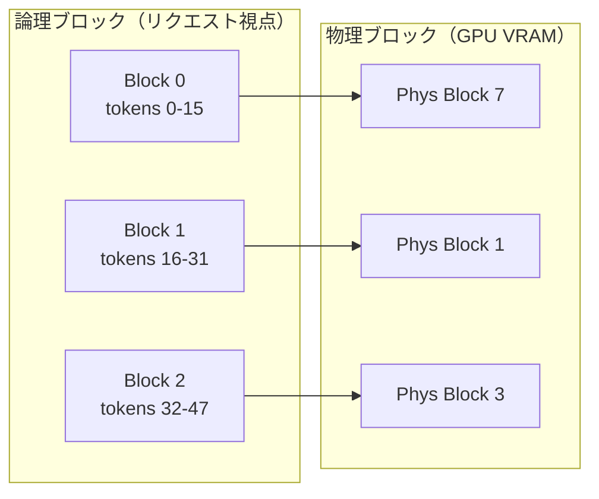

本記事は [Efficient Memory Management for Large Language Model Serving with PagedAttention](https://arxiv.org/abs/2309.06180)（SOSP 2023）の解説記事です。

## 論文概要（Abstract）

本論文は、LLMサービングにおけるKVキャッシュのメモリ管理問題に対して、OSの仮想メモリとページング機構に着想を得た**PagedAttention**アルゴリズムを提案している。著者らはこの手法を実装したLLMサービングエンジン**vLLM**を構築し、既存システムと比較してスループットを2〜24倍向上させたと報告している。

この記事は [Zenn記事: Vertex AI Model GardenでオープンLLMを本番デプロイする実践ガイド](https://zenn.dev/0h_n0/articles/4a07c4e096da93) の深掘りです。Vertex AI Model Gardenが内部で使用しているvLLMの基盤技術を詳しく解説します。

## 情報源

- **arXiv ID**: 2309.06180
- **URL**: [https://arxiv.org/abs/2309.06180](https://arxiv.org/abs/2309.06180)
- **著者**: Woosuk Kwon, Zhuohan Li, Siyuan Zhuang et al.（UC Berkeley, Stanford University）
- **発表年**: 2023（SOSP 2023で採択）
- **分野**: cs.CL, cs.DC
- **コード**: [github.com/vllm-project/vllm](https://github.com/vllm-project/vllm)（Apache 2.0ライセンス）

## 背景と動機（Background & Motivation）

LLMの推論処理では、Transformerの各レイヤーで生成されるKey-Value（KV）キャッシュがGPUメモリの大部分を占有する。たとえばLLaMA-13Bモデルで単一のリクエストを処理する場合、最大1.7GBのKVキャッシュが必要となる。

従来のLLMサービングシステム（FasterTransformer、Orcaなど）は、リクエストの最大シーケンス長に基づいてKVキャッシュ用の連続メモリ領域を事前確保していた。この方式には3つの深刻な非効率が存在していた：

1. **事前確保による無駄（Reservation waste）**: 実際の生成長が最大長より短い場合、確保済みメモリが無駄になる
2. **内部断片化（Internal fragmentation）**: メモリ割り当ての粒度が粗く、使われない領域が発生する
3. **外部断片化（External fragmentation）**: 異なるサイズのリクエストが到着・終了を繰り返すことで、連続した空き領域が減少する

著者らの分析によれば、既存システムではGPUメモリの**60〜80%が無駄に消費**されていた（論文Figure 2より）。このメモリ非効率がバッチサイズを制限し、結果としてGPU演算能力が十分に活用されない状態を招いていた。

## 主要な貢献（Key Contributions）

- **貢献1**: OSの仮想メモリ管理に着想を得たPagedAttentionアルゴリズムの提案。KVキャッシュを固定サイズのブロックに分割し、非連続なメモリ領域に格納可能にした
- **貢献2**: PagedAttentionをベースとしたLLMサービングエンジンvLLMの実装。Continuous BatchingとPagedAttentionを組み合わせ、メモリ無駄を4%未満に抑制
- **貢献3**: 複数リクエスト間でのKVキャッシュ共有メカニズムの実現。Beam Search、Parallel Sampling、Shared Prefixの3つのユースケースで効率的なメモリ利用を実現

## 技術的詳細（Technical Details）

### PagedAttentionのメモリモデル

PagedAttentionの核心は、OSの仮想メモリ管理をKVキャッシュに適用する点にある。具体的には以下のマッピング構造を導入する：

- **論理ブロック（Logical Block）**: 各リクエストのKVキャッシュを固定長のブロック単位で管理。1ブロックはデフォルトで16トークン分のKey/Valueテンソルを格納する
- **物理ブロック（Physical Block）**: GPU VRAM上の実際のメモリ領域。論理ブロックと1対1で対応するが、物理的に連続している必要はない
- **ブロックテーブル（Block Table）**: 論理ブロックから物理ブロックへのマッピングを管理するページテーブル相当の構造



### PagedAttentionの計算式

標準的なSelf-Attentionは以下の式で計算される：

$$
\text{Attention}(Q, K, V) = \text{softmax}\left(\frac{QK^T}{\sqrt{d_k}}\right)V
$$

ここで $Q \in \mathbb{R}^{1 \times d_k}$（デコード時は1トークン分のクエリ）、$K, V \in \mathbb{R}^{n \times d_k}$（$n$: これまでの全トークン数）である。

PagedAttentionでは、$K$と$V$がブロック単位で非連続メモリに格納されているため、Attentionスコアの計算をブロック単位に分解する：

$$
A_j = \frac{\exp(q \cdot K_j^T / \sqrt{d_k})}{\sum_{i=1}^{N} \exp(q \cdot K_i^T / \sqrt{d_k})} \cdot V_j
$$

ここで、
- $q$: 現在のクエリベクトル（$\in \mathbb{R}^{d_k}$）
- $K_j, V_j$: $j$番目の物理ブロックに格納されたKey/Valueテンソル
- $N$: 総ブロック数
- $d_k$: Attentionヘッドの次元数

最終的な出力は全ブロックの寄与を合算する：$\text{output} = \sum_{j=1}^{N} A_j$

### CUDAカーネル実装

著者らはPagedAttention用に2種類のCUDAカーネルを実装している：

- **PagedAttention v1**: 1ブロックあたり1ワープ（32スレッド）を割り当てる方式。シーケンス長が短い場合に効率的
- **PagedAttention v2**: ブロック群をさらに分割してreductionを行うsplit-KV方式。長いシーケンスで高い並列性を実現

```python
import torch
from typing import Optional

def paged_attention_v1(
    query: torch.Tensor,
    key_cache: torch.Tensor,
    value_cache: torch.Tensor,
    block_tables: torch.Tensor,
    context_lens: torch.Tensor,
    scale: float,
    block_size: int = 16,
) -> torch.Tensor:
    """PagedAttention v1の簡略化された実装イメージ

    Args:
        query: (num_seqs, num_heads, head_size) - 現在のクエリ
        key_cache: (num_blocks, block_size, num_heads, head_size) - 物理ブロックのKeyキャッシュ
        value_cache: (num_blocks, block_size, num_heads, head_size) - 物理ブロックのValueキャッシュ
        block_tables: (num_seqs, max_num_blocks) - 論理→物理ブロックのマッピング
        context_lens: (num_seqs,) - 各リクエストの現在のコンテキスト長
        scale: Attentionスケーリング係数 (1/sqrt(d_k))
        block_size: ブロックあたりのトークン数

    Returns:
        output: (num_seqs, num_heads, head_size)
    """
    num_seqs = query.shape[0]
    output = torch.zeros_like(query)

    for seq_idx in range(num_seqs):
        ctx_len = context_lens[seq_idx].item()
        num_blocks = (ctx_len + block_size - 1) // block_size

        q = query[seq_idx]  # (num_heads, head_size)
        all_scores = []
        all_values = []

        for block_idx in range(num_blocks):
            phys_block = block_tables[seq_idx, block_idx].item()
            k_block = key_cache[phys_block]  # (block_size, num_heads, head_size)
            v_block = value_cache[phys_block]

            tokens_in_block = min(block_size, ctx_len - block_idx * block_size)
            k_block = k_block[:tokens_in_block]
            v_block = v_block[:tokens_in_block]

            scores = torch.einsum("hd,thd->ht", q, k_block) * scale
            all_scores.append(scores)
            all_values.append(v_block)

        all_scores = torch.cat(all_scores, dim=-1)  # (num_heads, total_tokens)
        all_values = torch.cat(all_values, dim=0)    # (total_tokens, num_heads, head_size)

        weights = torch.softmax(all_scores, dim=-1)  # (num_heads, total_tokens)
        output[seq_idx] = torch.einsum("ht,thd->hd", weights, all_values)

    return output
```

### KVキャッシュ共有メカニズム

PagedAttentionのブロック単位管理は、Copy-on-Write（CoW）セマンティクスによるKVキャッシュ共有を自然に実現する。

**Parallel Sampling**の場合、同一プロンプトから複数の応答を生成する際、プロンプト部分のKVキャッシュを物理ブロックレベルで共有する。各サンプルが異なるトークンを生成し始めた時点で、該当ブロックのみをコピーする（CoW）。

**Beam Search**では、ビーム間で共通するプレフィックス部分のKVキャッシュを共有し、分岐したビームのみ新たな物理ブロックを割り当てる。論文Table 3によれば、Beam Search（beam_width=4）でのメモリ使用量を最大55%削減できたと報告されている。

## 実装のポイント（Implementation）

vLLMを本番環境で運用する際の重要な設定パラメータ：

- **`block_size`**（デフォルト: 16）: ブロックサイズはメモリ効率と内部断片化のトレードオフ。大きいほどブロック管理のオーバーヘッドは減るが、最終ブロックの内部断片化が増加する。論文Figure 10によれば、ブロックサイズ16が最適なバランスを示している
- **`gpu_memory_utilization`**（推奨: 0.85〜0.95）: GPU VRAMのうちKVキャッシュに使用する割合。高いほどバッチサイズを大きくできるが、CUDA OOMのリスクが増加する
- **`tensor_parallel_size`**: Megatronスタイルのcolumn/row parallel linearでモデルを分割。GPU数と一致させる
- **`max_num_seqs`**: 同時処理リクエスト数。テキストモデルでは256、マルチモーダルモデルでは12程度が推奨される（VRAMの画像処理による消費が大きいため）

## Production Deployment Guide

### AWS実装パターン（コスト最適化重視）

**トラフィック量別の推奨構成**:

| 規模 | 月間リクエスト | 推奨構成 | 月額コスト | 主要サービス |
|------|--------------|---------|-----------|------------|
| **Small** | ~3,000 (100/日) | Serverless | $50-150 | Lambda + Bedrock + DynamoDB |
| **Medium** | ~30,000 (1,000/日) | Hybrid | $300-800 | ECS Fargate + ElastiCache |
| **Large** | 300,000+ (10,000/日) | Container | $2,000-5,000 | EKS + Karpenter + EC2 Spot |

**Small構成の詳細** (月額$50-150):
- **Lambda**: 1GB RAM, 60秒タイムアウト ($20/月)
- **Bedrock**: Claude 3.5 Haiku, Prompt Caching有効 ($80/月)
- **DynamoDB**: On-Demand ($10/月)
- **CloudWatch**: 基本監視 ($5/月)

**Large構成の詳細** (月額$2,000-5,000):
- **EKS**: コントロールプレーン ($72/月)
- **EC2 Spot**: g5.xlarge × 2-4台 (平均$800/月、最大90%削減)
- **Karpenter**: 自動スケーリング
- **S3**: モデルキャッシュ ($20/月)

**コスト試算の注意事項**: 上記は2026年5月時点のAWS ap-northeast-1リージョン料金に基づく概算値です。実際のコストはトラフィックパターンにより変動します。最新料金は [AWS料金計算ツール](https://calculator.aws/) で確認してください。

### Terraformインフラコード

**Small構成 (Serverless): Lambda + Bedrock + DynamoDB**

```hcl
module "vpc" {
  source  = "terraform-aws-modules/vpc/aws"
  version = "~> 5.0"

  name = "vllm-cache-vpc"
  cidr = "10.0.0.0/16"
  azs  = ["ap-northeast-1a", "ap-northeast-1c"]
  private_subnets = ["10.0.1.0/24", "10.0.2.0/24"]

  enable_nat_gateway   = false
  enable_dns_hostnames = true
}

resource "aws_iam_role" "lambda_bedrock" {
  name = "vllm-lambda-bedrock-role"
  assume_role_policy = jsonencode({
    Version = "2012-10-17"
    Statement = [{
      Action    = "sts:AssumeRole"
      Effect    = "Allow"
      Principal = { Service = "lambda.amazonaws.com" }
    }]
  })
}

resource "aws_iam_role_policy" "bedrock_invoke" {
  role = aws_iam_role.lambda_bedrock.id
  policy = jsonencode({
    Version = "2012-10-17"
    Statement = [{
      Effect   = "Allow"
      Action   = ["bedrock:InvokeModel", "bedrock:InvokeModelWithResponseStream"]
      Resource = "arn:aws:bedrock:ap-northeast-1::foundation-model/anthropic.claude-3-5-haiku*"
    }]
  })
}

resource "aws_lambda_function" "inference_handler" {
  filename      = "lambda.zip"
  function_name = "vllm-inference-handler"
  role          = aws_iam_role.lambda_bedrock.arn
  handler       = "index.handler"
  runtime       = "python3.12"
  timeout       = 60
  memory_size   = 1024

  environment {
    variables = {
      BEDROCK_MODEL_ID    = "anthropic.claude-3-5-haiku-20241022-v1:0"
      DYNAMODB_TABLE      = aws_dynamodb_table.kv_cache.name
      ENABLE_PROMPT_CACHE = "true"
    }
  }
}

resource "aws_dynamodb_table" "kv_cache" {
  name         = "vllm-kv-cache"
  billing_mode = "PAY_PER_REQUEST"
  hash_key     = "prompt_hash"

  attribute {
    name = "prompt_hash"
    type = "S"
  }

  ttl {
    attribute_name = "expire_at"
    enabled        = true
  }
}
```

**Large構成 (Container): EKS + Karpenter + Spot Instances**

```hcl
module "eks" {
  source  = "terraform-aws-modules/eks/aws"
  version = "~> 20.0"

  cluster_name    = "vllm-inference-cluster"
  cluster_version = "1.31"

  vpc_id     = module.vpc.vpc_id
  subnet_ids = module.vpc.private_subnets

  cluster_endpoint_public_access = true
  enable_cluster_creator_admin_permissions = true
}

resource "kubectl_manifest" "karpenter_provisioner" {
  yaml_body = <<-YAML
    apiVersion: karpenter.sh/v1
    kind: NodePool
    metadata:
      name: gpu-spot-pool
    spec:
      template:
        spec:
          requirements:
            - key: karpenter.sh/capacity-type
              operator: In
              values: ["spot"]
            - key: node.kubernetes.io/instance-type
              operator: In
              values: ["g5.xlarge", "g5.2xlarge"]
          limits:
            cpu: "32"
            memory: "128Gi"
      disruption:
        consolidationPolicy: WhenEmpty
        consolidateAfter: 30s
  YAML
}

resource "aws_budgets_budget" "vllm_monthly" {
  name         = "vllm-monthly-budget"
  budget_type  = "COST"
  limit_amount = "5000"
  limit_unit   = "USD"
  time_unit    = "MONTHLY"

  notification {
    comparison_operator        = "GREATER_THAN"
    threshold                  = 80
    threshold_type             = "PERCENTAGE"
    notification_type          = "ACTUAL"
    subscriber_email_addresses = ["ops@example.com"]
  }
}
```

### セキュリティベストプラクティス

- IAMロール: 最小権限の原則。Bedrock InvokeModelのみ許可
- ネットワーク: VPC内配置、パブリックアクセス最小化
- シークレット: Secrets Manager使用、環境変数ハードコード禁止
- 暗号化: S3/DynamoDB全てKMS暗号化
- 監査: CloudTrail/Config有効化

### 運用・監視設定

```python
import boto3

cloudwatch = boto3.client('cloudwatch')

cloudwatch.put_metric_alarm(
    AlarmName='vllm-kv-cache-miss-rate',
    ComparisonOperator='GreaterThanThreshold',
    EvaluationPeriods=1,
    MetricName='CacheMissRate',
    Namespace='Custom/vLLM',
    Period=3600,
    Statistic='Average',
    Threshold=0.3,
    ActionsEnabled=True,
    AlarmActions=['arn:aws:sns:ap-northeast-1:123456789:vllm-alerts'],
    AlarmDescription='KVキャッシュミス率が30%を超過'
)
```

### コスト最適化チェックリスト

- [ ] ~100 req/日 → Lambda + Bedrock (Serverless) - $50-150/月
- [ ] ~1000 req/日 → ECS Fargate (Hybrid) - $300-800/月
- [ ] 10000+ req/日 → EKS + Spot Instances (Container) - $2,000-5,000/月
- [ ] Spot Instances優先（最大90%削減）
- [ ] Reserved Instances: 1年コミットで最大72%削減
- [ ] Bedrock Batch API: 50%割引（非リアルタイム処理）
- [ ] Prompt Caching有効化で30-90%削減
- [ ] Lambda: メモリサイズ最適化
- [ ] ECS/EKS: アイドル時スケールダウン
- [ ] AWS Budgets: 月額予算設定
- [ ] CloudWatch アラーム: 異常検知
- [ ] Cost Anomaly Detection有効化
- [ ] 日次コストレポート: SNS/Slack送信
- [ ] 未使用リソース削除: Trusted Advisor活用
- [ ] タグ戦略: 環境別コスト可視化
- [ ] S3ライフサイクル: 古いキャッシュ自動削除（30日）
- [ ] 開発環境: 夜間停止設定
- [ ] CloudTrail/Config: 監査ログ有効化
- [ ] KMS暗号化: S3/DynamoDB/EBS
- [ ] TLS 1.2以上使用

## 実験結果（Results）

著者らが報告した主要なベンチマーク結果は以下の通りである（論文Table 2, Figure 8より）。

| 評価項目 | FasterTransformer | Orca | vLLM | 改善率（vs Orca） |
|---------|-------------------|------|------|------------------|
| スループット（OPT-13B, ShareGPT） | 1x | 3.5x | 14.0x | **4.0x** |
| スループット（OPT-13B, Alpaca） | 1x | 4.1x | 24.3x | **5.9x** |
| メモリ無駄率 | 60-80% | 60-80% | **<4%** | - |

**分析ポイント**:

- ShareGPTデータセット（平均出力長が長い）では、KVキャッシュのメモリ効率改善が大きく寄与し、より多くのリクエストを同時バッチ処理できるようになった
- Alpacaデータセット（短い出力）では、Continuous Batchingとの相乗効果が顕著に現れている
- メモリ無駄率の劇的な改善（60-80% → <4%）は、PagedAttentionのブロック単位管理が外部断片化と事前確保の無駄を根本的に解消したことによる

## 実運用への応用（Practical Applications）

Vertex AI Model Gardenでは、vLLMがOpenモデルのデフォルトサービングエンジンとして採用されている。Zenn記事で解説したOpenModel SDKの`model.deploy()`を呼び出すと、内部的にPagedAttentionが有効化されたvLLMコンテナが自動的にデプロイされる。

本番運用における具体的な応用：

- **`--gpu-memory-utilization=0.9`の設定**: PagedAttentionによりメモリ断片化が最小化されるため、VRAMの90%をKVキャッシュに充当しても安定稼働する
- **Tensor Parallelism連携**: `--tensor-parallel-size=8`（L4×8構成）で70Bモデルを分散配置する際、各GPUのKVキャッシュがPagedAttentionで独立管理される
- **Continuous Batching**: 新規リクエストを既存バッチに動的追加することで、GPU利用率を最大化する。PagedAttentionのブロック単位割り当てがこの動的追加を効率的に実現する
- **Dynamic LoRA**: Vertex AIカスタムvLLMの機能として、LoRAアダプタの動的切り替え時にもPagedAttentionのブロック管理が活用されている

## 関連研究（Related Work）

- **Orca**（Yu et al., OSDI 2022）: Continuous Batching（iteration-level scheduling）を初めてLLMサービングに導入。vLLMはOrcaのスケジューリング手法を継承しつつ、メモリ管理を根本的に改善した
- **FlashAttention**（Dao et al., NeurIPS 2022）: GPU SRAMとHBM間のI/Oを最適化するAttention実装。PagedAttentionとは補完的な関係にあり、vLLMでは両者を組み合わせて使用可能
- **FasterTransformer**（NVIDIA）: NVIDIA公式のTransformer推論ライブラリ。高度に最適化されたCUDAカーネルを提供するが、KVキャッシュの連続メモリ制約があった

## まとめと今後の展望

PagedAttentionは、LLMサービングにおけるKVキャッシュのメモリ管理問題を、OS仮想メモリの原理を応用して解決した。メモリ無駄率を60-80%から4%未満に削減し、スループットを最大24倍向上させたと著者らは報告している。

vLLMはその後もPagedAttention v2、Speculative Decoding、Prefix Cachingなどの機能が追加され、Vertex AI Model Garden、Amazon SageMaker、Azure ML等の主要クラウドプラットフォームのデフォルトサービングエンジンとして広く採用されている。

## 参考文献

- **arXiv**: [https://arxiv.org/abs/2309.06180](https://arxiv.org/abs/2309.06180)
- **SOSP 2023**: [https://dl.acm.org/doi/10.1145/3600006.3613165](https://dl.acm.org/doi/10.1145/3600006.3613165)
- **Code**: [https://github.com/vllm-project/vllm](https://github.com/vllm-project/vllm)
- **Related Zenn article**: [https://zenn.dev/0h_n0/articles/4a07c4e096da93](https://zenn.dev/0h_n0/articles/4a07c4e096da93)
