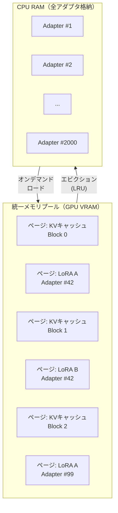

本記事は [S-LoRA: Serving Thousands of Concurrent LoRA Adapters](https://arxiv.org/abs/2311.04928)（arXiv 2023）の解説記事です。

## 論文概要（Abstract）

S-LoRAは、単一のGPUサーバ上で数千のLoRA（Low-Rank Adaptation）アダプタを同時にサービングするシステムである。著者らは、KVキャッシュとLoRAアダプタ重みの両方をページング方式で統一的に管理する「Unified Paging」と、異なるランクのLoRAをバッチ内で効率的に計算するカスタムCUDAカーネル「BGMV」を提案している。論文の実験によれば、2000アダプタの同時サービングで、単一アダプタ専用サービング比4倍のスループットを達成したと報告されている。

この記事は [Zenn記事: Vertex AI Model GardenでオープンLLMを本番デプロイする実践ガイド](https://zenn.dev/0h_n0/articles/4a07c4e096da93) の深掘りです。Zenn記事で言及されたVertex AIカスタムvLLMのDynamic LoRA機能の背景技術を解説します。

## 情報源

- **arXiv ID**: 2311.04928
- **URL**: [https://arxiv.org/abs/2311.04928](https://arxiv.org/abs/2311.04928)
- **著者**: Ying Sheng, Shiyi Cao, Dacheng Li et al.（UC Berkeley, Stanford University）
- **発表年**: 2023
- **分野**: cs.LG, cs.DC
- **コード**: [github.com/S-LoRA/S-LoRA](https://github.com/S-LoRA/S-LoRA)

## 背景と動機（Background & Motivation）

LoRA（Low-Rank Adaptation）は、事前学習済みLLMに少数のパラメータ（ランク$r$の低ランク行列ペア）を追加してファインチューニングする手法であり、タスク固有のモデルを効率的に作成できる。

実際のサービング環境では、異なる顧客・タスク向けに数百〜数千のLoRAアダプタが存在することがある。従来のアプローチには以下の問題があった：

1. **各アダプタに専用GPUを割り当て**: リソース利用効率が低い。100アダプタに100台のGPUが必要
2. **アダプタを動的にロード/アンロード**: CPUメモリからGPU VRAMへの転送がボトルネック。LoRA重みの断片化でメモリ効率が低下
3. **先行研究Punica**: バッチ内の異なるLoRAアダプタを処理するカスタムカーネルを提供するが、メモリ管理が粗く、アダプタ数のスケーラビリティに限界があった

著者らの分析によれば、Punicaと比較してスループット4倍、アダプタスケール30倍の改善が可能であると報告している。

## 主要な貢献（Key Contributions）

- **貢献1**: Unified Pagingの提案。KVキャッシュとLoRAアダプタ重みを同一の統一メモリプールでページング管理し、メモリ断片化を排除
- **貢献2**: カスタムCUDA BGMVカーネルの実装。バッチ内で異なるランクのLoRAアダプタを効率的にバッチ計算
- **貢献3**: 2000アダプタの同時サービングを実証。LLaMA-7B/13B/30B/70B、A10G/A100 GPUで評価

## 技術的詳細（Technical Details）

### LoRA演算の数式

LoRAは事前学習済みの重み行列$W_0 \in \mathbb{R}^{d \times k}$に、低ランク行列ペア$A \in \mathbb{R}^{d \times r}$, $B \in \mathbb{R}^{r \times k}$を加算する：

$$
h = W_0 x + \Delta W x = W_0 x + A B x
$$

ここで、
- $x \in \mathbb{R}^{k}$: 入力ベクトル
- $h \in \mathbb{R}^{d}$: 出力ベクトル
- $r$: LoRAランク（通常$r \ll \min(d, k)$、典型的には8〜64）
- $W_0$: 凍結されたベースモデルの重み（全アダプタで共有）
- $AB$: LoRAアダプタ固有の低ランク更新

バッチ処理において、バッチ内の各リクエストが異なるLoRAアダプタを使用する場合、従来のバッチ行列乗算は適用できない。各リクエスト$i$について異なる$A_i, B_i$で個別に計算する必要がある：

$$
h_i = W_0 x_i + A_i B_i x_i \quad (i = 1, \ldots, \text{batch\_size})
$$

### Unified Paging

S-LoRAの核心技術であるUnified Pagingは、vLLMのPagedAttention（KVキャッシュのページング管理）をLoRAアダプタ重みの管理に拡張したものである。



**メモリ管理の粒度**: LoRAアダプタ重みはテンソル単位でページングされる。各ページは1つのアダプタテンソル（例：特定レイヤーの$A$行列）に対応する。

**常駐ポリシー**: ベースモデル（$W_0$）は常にGPU VRAMに常駐する。LoRAアダプタ重みのみがCPU↔GPU間で動的にロード/アンロードされる。

**エビクション戦略**: LRU（Least Recently Used）キャッシュで管理。最近使用されていないアダプタから順にCPU RAMに退避する。

### BGMVカーネル

S-LoRAのもう一つの技術革新は、バッチ内で異なるLoRAアダプタを効率的に計算するBGMV（Batched Gather Matrix-Vector Multiply）カスタムCUDAカーネルである。

標準のバッチGEMMでは、全リクエストが同一の行列を使用することを前提としている。しかしS-LoRAのバッチでは、各リクエストが異なるLoRAアダプタ（異なる$A_i, B_i$）を使用し、さらにランク$r_i$も異なる場合がある。

BGMVカーネルは以下の操作を1回のカーネル起動で実行する：

$$
\text{BGMV}: \quad y_i = y_i + A_i \cdot (B_i \cdot x_i) \quad \forall i \in \text{batch}
$$

```python
import torch
from typing import Optional

def bgmv_reference(
    y: torch.Tensor,
    x: torch.Tensor,
    lora_a_weights: list[torch.Tensor],
    lora_b_weights: list[torch.Tensor],
    adapter_indices: torch.Tensor,
    scale: float = 1.0,
) -> torch.Tensor:
    """BGMV カーネルのリファレンス実装

    Args:
        y: (batch_size, d_out) - 出力テンソル（ベースモデル出力に加算）
        x: (batch_size, d_in) - 入力テンソル
        lora_a_weights: 各アダプタのA行列リスト (d_out, r_i)
        lora_b_weights: 各アダプタのB行列リスト (r_i, d_in)
        adapter_indices: (batch_size,) - 各リクエストのアダプタID
        scale: LoRAスケーリング係数

    Returns:
        y: (batch_size, d_out) - LoRA加算済み出力
    """
    for i in range(x.shape[0]):
        adapter_id = adapter_indices[i].item()
        if adapter_id >= 0:
            a = lora_a_weights[adapter_id]  # (d_out, r)
            b = lora_b_weights[adapter_id]  # (r, d_in)
            lora_out = a @ (b @ x[i]) * scale
            y[i] += lora_out
    return y
```

CUDAカーネルの実装では、各リクエストのアダプタIDに基づいてPagedメモリから適切なLoRA重みを取得し、行列-ベクトル積を並列計算する。異なるランクのアダプタが混在するバッチでも効率的に処理できる点がPunicaとの主要な違いである。

## 実装のポイント（Implementation）

S-LoRAを本番環境で運用する際の重要なポイント：

- **アダプタキャッシュサイズ**: GPU VRAMのうちLoRAアダプタに割り当てる領域の設定。KVキャッシュとのバランスが重要。論文ではVRAMの20-30%をアダプタキャッシュに割り当てることを推奨している
- **LoRAランクの影響**: ランク$r$が大きいほど（$r \geq 64$）アダプタ重みのメモリ消費が増大する。ランク8〜16がメモリ効率と精度のバランスに優れている
- **事前ロード戦略**: トラフィック分布が偏っている場合、頻繁に使用されるアダプタを事前にGPU VRAMにロードしておくことで、コールドスタートのレイテンシを回避できる
- **vLLM統合**: vLLMの現行バージョンではS-LoRAの手法を一部取り込んでおり、`--enable-lora`フラグでLoRAサービングが有効化される。Vertex AIカスタムvLLMのDynamic LoRA機能もこの系譜にある

## Production Deployment Guide

### AWS実装パターン（コスト最適化重視）

**トラフィック量別の推奨構成**:

| 規模 | 月間リクエスト | 推奨構成 | 月額コスト | 主要サービス |
|------|--------------|---------|-----------|------------|
| **Small** | ~3,000 (100/日) | Serverless | $50-150 | Lambda + Bedrock + S3（アダプタ保存） |
| **Medium** | ~30,000 (1,000/日) | Hybrid | $400-900 | ECS Fargate + S3 + ElastiCache |
| **Large** | 300,000+ (10,000/日) | Container | $2,000-5,000 | EKS + GPU + S3（アダプタリポジトリ） |

**Large構成の詳細**:
- **EKS**: コントロールプレーン ($72/月)
- **EC2**: g5.xlarge × 2-4台（LoRA対応vLLM）
- **S3**: アダプタ重みリポジトリ ($20/月、数千アダプタ対応)
- **ElastiCache**: アダプタルーティングテーブル ($15/月)

**コスト試算の注意事項**: 上記は2026年5月時点のAWS ap-northeast-1リージョン料金に基づく概算値です。最新料金は [AWS料金計算ツール](https://calculator.aws/) で確認してください。

### Terraformインフラコード

```hcl
module "eks" {
  source  = "terraform-aws-modules/eks/aws"
  version = "~> 20.0"

  cluster_name    = "slora-cluster"
  cluster_version = "1.31"

  vpc_id     = module.vpc.vpc_id
  subnet_ids = module.vpc.private_subnets

  cluster_endpoint_public_access = true
  enable_cluster_creator_admin_permissions = true
}

resource "aws_s3_bucket" "lora_adapters" {
  bucket = "slora-adapter-repository"
}

resource "aws_s3_bucket_lifecycle_configuration" "lora_lifecycle" {
  bucket = aws_s3_bucket.lora_adapters.id

  rule {
    id     = "archive-old-adapters"
    status = "Enabled"

    transition {
      days          = 90
      storage_class = "GLACIER"
    }
  }
}

resource "kubectl_manifest" "gpu_nodepool" {
  yaml_body = <<-YAML
    apiVersion: karpenter.sh/v1
    kind: NodePool
    metadata:
      name: lora-gpu-pool
    spec:
      template:
        spec:
          requirements:
            - key: karpenter.sh/capacity-type
              operator: In
              values: ["spot"]
            - key: node.kubernetes.io/instance-type
              operator: In
              values: ["g5.xlarge", "g5.2xlarge"]
          limits:
            nvidia.com/gpu: "8"
      disruption:
        consolidationPolicy: WhenEmpty
        consolidateAfter: 30s
  YAML
}

resource "aws_budgets_budget" "slora_monthly" {
  name         = "slora-monthly-budget"
  budget_type  = "COST"
  limit_amount = "5000"
  limit_unit   = "USD"
  time_unit    = "MONTHLY"

  notification {
    comparison_operator        = "GREATER_THAN"
    threshold                  = 80
    threshold_type             = "PERCENTAGE"
    notification_type          = "ACTUAL"
    subscriber_email_addresses = ["ops@example.com"]
  }
}
```

### セキュリティベストプラクティス

- IAMロール: S3アダプタリポジトリへの最小権限アクセス
- S3: バケットポリシーでVPCエンドポイント経由のみ許可
- KMS暗号化: S3/EBS全てKMS暗号化
- CloudTrail: アダプタアクセスの監査ログ

### コスト最適化チェックリスト

- [ ] ベースモデルは1つ、アダプタのみ切り替え（GPU節約）
- [ ] S3 Glacierで使用頻度の低いアダプタを自動アーカイブ
- [ ] Spot Instances優先（最大90%削減）
- [ ] Reserved Instances: 1年コミットで最大72%削減
- [ ] アダプタプリロード: 頻繁に使用されるアダプタを事前ロード
- [ ] LoRAランク最適化: r=8〜16でメモリ効率と精度のバランス
- [ ] アイドル時スケールダウン設定
- [ ] AWS Budgets: 月額予算設定
- [ ] CloudWatch: アダプタキャッシュヒット率監視
- [ ] Cost Anomaly Detection有効化
- [ ] 日次コストレポート
- [ ] 未使用リソース削除
- [ ] タグ戦略: アダプタ別コスト可視化
- [ ] S3ライフサイクル: 古いアダプタバージョン自動削除
- [ ] 開発環境: 夜間/週末にGPUノード停止
- [ ] KMS暗号化: S3/EBS
- [ ] TLS 1.2以上使用
- [ ] CloudTrail有効化
- [ ] アダプタ管理の自動化（CI/CDパイプライン）
- [ ] GPU VRAMのアダプタ/KVキャッシュ配分の定期チューニング

## 実験結果（Results）

著者らが報告した主要なベンチマーク結果（論文Table 1, Figure 5より）：

| 評価項目 | 専用サービング | Punica | S-LoRA | 改善率 |
|---------|--------------|--------|--------|--------|
| スループット（2000アダプタ） | 1x | 1x | **4x** | 4倍 |
| 最大アダプタ数 | 1 | ~60 | **2000** | 30倍（vs Punica） |
| メモリ効率 | 低（専用割り当て） | 中 | **高（Unified Paging）** | - |

**分析ポイント**:

- 2000アダプタの同時サービングは、Unified Pagingによるメモリ断片化の排除が鍵。各アダプタのテンソルが個別にページ管理されるため、アダプタのロード/アンロードがメモリレイアウトに影響しない
- BGMVカーネルにより、バッチ内で異なるランクのアダプタが混在しても効率的に計算できる。Punicaは同一ランクを前提としていたため、異種ランク環境でのスケーラビリティに限界があった
- 評価はLLaMA-7B/13B/30B/70B、A10G/A100 GPU、ShareGPT/Alpacaデータセットで実施されている

## 実運用への応用（Practical Applications）

S-LoRAの技術は、Vertex AI Model GardenのDynamic LoRA機能の基盤技術である。Zenn記事で言及されている「Dynamic LoRA: ディスクキャッシュとCloud Storage連携によるLoRAアダプタの動的切り替え」は、S-LoRAのUnified PagingとLRUキャッシュの概念をVertex AI固有のCloud Storage連携に拡張したものと考えられる。

具体的なユースケース：

- **マルチテナントLLMサービス**: 各顧客に固有のLoRAアダプタを提供し、単一のGPUサーバで全顧客にサービング。GPU台数を顧客数に比例させる必要がなくなる
- **A/Bテスト**: 複数のファインチューニングバリアントを同時にサービングし、リアルタイムで比較評価
- **段階的ロールアウト**: 新しいLoRAアダプタをトラフィックの一部にだけ適用し、品質を検証してから全体に展開

## 関連研究（Related Work）

- **LoRA原論文**（Hu et al., ICLR 2022）: Low-Rank Adaptationの提案。S-LoRAはLoRAのサービング側の最適化
- **Punica**（Chen et al., 2024）: 複数LoRAのバッチ処理用CUDAカーネルを提供した先行研究。S-LoRAはPunicaのスケーラビリティ限界を解消
- **vLLM/PagedAttention**（Kwon et al., SOSP 2023）: S-LoRAのUnified Pagingの基盤。KVキャッシュのページング管理をLoRAアダプタ管理に拡張

## まとめと今後の展望

S-LoRAは、LLMサービングにおけるLoRAアダプタの大規模同時サービング問題を、Unified PagingとBGMVカーネルにより解決した。2000アダプタの同時サービングを実証し、vLLMの標準LoRAサービング機能やVertex AIのDynamic LoRA機能に技術的影響を与えている。

今後のModel Garden的なユースケース（多数の顧客固有モデルを単一クラスタで提供）において、S-LoRAの技術はさらに重要性を増すと考えられる。

## 参考文献

- **arXiv**: [https://arxiv.org/abs/2311.04928](https://arxiv.org/abs/2311.04928)
- **Code**: [https://github.com/S-LoRA/S-LoRA](https://github.com/S-LoRA/S-LoRA)
- **LoRA原論文**: [https://arxiv.org/abs/2106.09685](https://arxiv.org/abs/2106.09685)
- **Related Zenn article**: [https://zenn.dev/0h_n0/articles/4a07c4e096da93](https://zenn.dev/0h_n0/articles/4a07c4e096da93)
