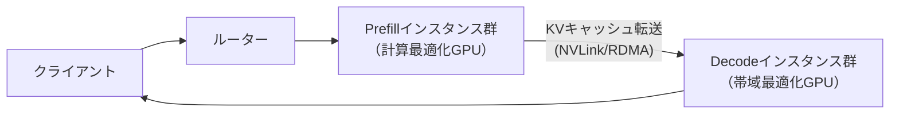

本記事は [DistServe: Disaggregating Prefill and Decoding for Goodput-optimized Large Language Model Serving](https://arxiv.org/abs/2404.09526)（arXiv 2024）の解説記事です。

## 論文概要（Abstract）

DistServeは、LLM推論のPrefill（プロンプト処理）とDecode（トークン生成）を物理的に異なるGPUインスタンスに分離（Disaggregate）し、それぞれに最適なリソース割り当てと並列化戦略を適用するシステムである。著者らは、SLO（Service Level Objective）を達成するスループットを"Goodput"と定義し、vLLMと比較してGoodputを最大4.48倍向上させたと報告している。

この記事は [Zenn記事: Vertex AI Model GardenでオープンLLMを本番デプロイする実践ガイド](https://zenn.dev/0h_n0/articles/4a07c4e096da93) の深掘りです。Zenn記事で解説したPrefill/Decode段階の特性差と、それがコスト・性能最適化にどう影響するかを掘り下げます。

## 情報源

- **arXiv ID**: 2404.09526
- **URL**: [https://arxiv.org/abs/2404.09526](https://arxiv.org/abs/2404.09526)
- **著者**: Yinmin Zhong, Shengyu Liu, Junda Chen et al.
- **発表年**: 2024
- **分野**: cs.DC, cs.LG

## 背景と動機（Background & Motivation）

LLM推論のPrefillとDecodeは本質的に異なる計算特性を持つ：

- **Prefill（計算律速）**: 入力プロンプト全体のAttention計算を一括処理。計算量はシーケンス長の二乗に比例し、GPU演算能力がボトルネックになる
- **Decode（メモリ帯域律速）**: 1トークンずつ逐次生成。モデル重みとKVキャッシュの読み出しI/Oが支配的

従来のLLMサービングシステム（vLLM、Orcaなど）は、PrefillとDecodeを同一GPUインスタンス上でコロケーション（同居）していた。この方式には**Prefill-Decode干渉**という深刻な問題がある：長いプロンプトのPrefill処理中は、同じGPU上のDecode処理が待たされ、TPOT（Time Per Output Token）が悪化する。逆に、Decodeが多数並行する状況ではPrefillのTTFT（Time to First Token）が遅延する。

著者らはこの干渉問題を定量的に分析し、PrefillとDecodeを物理的に分離することで両方のSLOを同時に最適化できると主張している。

## 主要な貢献（Key Contributions）

- **貢献1**: "Goodput"の概念を提案。SLO（TTFT < 2秒、TPOT < 200ms等）を達成したリクエストのスループットのみを評価指標とし、単純なスループットとは区別した
- **貢献2**: Prefill/Decode分離アーキテクチャの設計と実装。各段階に独立したGPUプール、並列化戦略、スケーリングポリシーを割り当て可能にした
- **貢献3**: KVキャッシュ転送のオーバーヘッド分析。NVLink環境ではPrefill時間の10%未満に収まることを実証した

## 技術的詳細（Technical Details）

### 分離アーキテクチャの全体像



DistServeの核心は、PrefillとDecodeを独立したGPUインスタンスプールで処理する点にある。各プールは異なるリソース構成を持つことができる：

- **Prefillプール**: 計算能力重視。Tensor Parallelism（TP）を大きく設定し、TTFT SLOを達成
- **Decodeプール**: メモリ帯域重視。Pipeline Parallelism（PP）が有効な場合もある。TPOT SLOを達成

### Goodputの定義

著者らが提案するGoodputは以下のように定義される：

$$
\text{Goodput} = \frac{|\{r \in R : \text{TTFT}(r) \leq T_{\text{TTFT}} \land \text{TPOT}(r) \leq T_{\text{TPOT}}\}|}{T_{\text{total}}}
$$

ここで、
- $R$: 処理されたリクエスト集合
- $\text{TTFT}(r)$: リクエスト$r$のTime to First Token
- $\text{TPOT}(r)$: リクエスト$r$のTime Per Output Token
- $T_{\text{TTFT}}, T_{\text{TPOT}}$: 各SLO閾値
- $T_{\text{total}}$: 総観測時間

通常のスループット（全リクエスト数/時間）とは異なり、SLOを達成できなかったリクエストはGoodputにカウントされない。これにより、「高スループットだがレイテンシが悪い」構成と「適切なスループットでSLOを達成する」構成を正しく比較できる。

### KVキャッシュ転送メカニズム

PrefillインスタンスからDecodeインスタンスへのKVキャッシュ転送は、DistServeの性能を左右する重要な要素である。

KVキャッシュの転送データ量は以下で計算される：

$$
D_{\text{KV}} = 2 \times n_{\text{layers}} \times n_{\text{heads}} \times d_{\text{head}} \times s \times \text{sizeof(dtype)}
$$

ここで、
- $n_{\text{layers}}$: Transformerレイヤー数
- $n_{\text{heads}}$: Attentionヘッド数
- $d_{\text{head}}$: ヘッド次元数
- $s$: シーケンス長（プロンプト長）
- 係数2はKeyとValueの両方を転送するため

たとえばLLaMA-13B（40レイヤー、40ヘッド、128次元、FP16）でプロンプト長1024トークンの場合：

$$
D_{\text{KV}} = 2 \times 40 \times 40 \times 128 \times 1024 \times 2 \text{ bytes} \approx 838 \text{ MB}
$$

論文の実験によれば、NVLink環境ではこの転送がPrefill時間の10%未満で完了すると報告されている。PCIe環境ではオーバーヘッドが大きくなるため、高速インターコネクトが前提となる。

### スケジューラ設計

DistServeのスケジューラはSJF（Shortest Job First）ベースで実装されている。Prefillキューではプロンプト長の短いリクエストを優先し、TTFT SLOの達成率を最大化する。

```python
from dataclasses import dataclass
from typing import Optional
import heapq

@dataclass
class InferenceRequest:
    """推論リクエスト"""
    request_id: str
    prompt_length: int
    max_output_tokens: int
    ttft_slo_ms: float = 2000.0
    tpot_slo_ms: float = 200.0

class DistServeScheduler:
    """Prefill/Decode分離スケジューラの簡略化実装"""

    def __init__(self, num_prefill_instances: int, num_decode_instances: int):
        self.prefill_queue: list[tuple[int, InferenceRequest]] = []
        self.decode_queue: list[InferenceRequest] = []
        self.num_prefill = num_prefill_instances
        self.num_decode = num_decode_instances

    def submit(self, request: InferenceRequest) -> None:
        """リクエスト投入: SJF (Shortest Job First) でPrefillキューに追加"""
        heapq.heappush(self.prefill_queue, (request.prompt_length, request))

    def schedule_prefill(self) -> Optional[InferenceRequest]:
        """Prefillスケジューリング: 最短プロンプトを優先"""
        if self.prefill_queue:
            _, request = heapq.heappop(self.prefill_queue)
            return request
        return None

    def transfer_to_decode(self, request: InferenceRequest) -> None:
        """Prefill完了後、KVキャッシュとともにDecodeキューへ転送"""
        self.decode_queue.append(request)

    def compute_goodput(
        self, completed: list[dict], total_time_s: float
    ) -> float:
        """Goodput計算: SLO達成リクエスト数 / 総時間"""
        slo_met = sum(
            1 for r in completed
            if r["ttft_ms"] <= r["ttft_slo_ms"]
            and r["tpot_ms"] <= r["tpot_slo_ms"]
        )
        return slo_met / total_time_s
```

## 実装のポイント（Implementation）

DistServeを本番運用する際の重要な設計判断：

- **Prefill/Decode GPU比率**: トラフィックパターンに強く依存する。プロンプトが長くDecodeが短いワークロード（要約タスク等）ではPrefillインスタンスを多く、逆にチャットボット的な用途ではDecodeを多くする
- **インターコネクト要件**: NVLink/InfiniBand/RDMAが前提。PCIe接続のみの環境ではKVキャッシュ転送がボトルネックとなり、分離のメリットが減少する
- **TP構成の非対称性**: Prefill側はTP数を大きく（計算分散）、Decode側はTP数を小さく（メモリ帯域活用）設定することで、Goodputを最大化する

## Production Deployment Guide

### AWS実装パターン（コスト最適化重視）

**トラフィック量別の推奨構成**:

| 規模 | 月間リクエスト | 推奨構成 | 月額コスト | 主要サービス |
|------|--------------|---------|-----------|------------|
| **Small** | ~3,000 (100/日) | Serverless | $50-150 | Lambda + Bedrock |
| **Medium** | ~30,000 (1,000/日) | Hybrid | $500-1,500 | ECS Fargate (Prefill/Decode分離) |
| **Large** | 300,000+ (10,000/日) | Container | $4,000-10,000 | EKS + Prefill/Decode専用ノードプール |

**Large構成の詳細**（Disaggregated推論）:
- **Prefillノード**: p5.48xlarge (H100 x8) × 2台, TP=8
- **Decodeノード**: g5.48xlarge (A10G x8) × 4台, TP=2
- **EFA**: インスタンス間KVキャッシュ転送用
- **S3**: モデル重みストレージ

**コスト試算の注意事項**: 上記は2026年5月時点のAWS料金に基づく概算値です。GPUインスタンスの料金はリージョン・Spot可用性により変動します。

### Terraformインフラコード

```hcl
module "eks" {
  source  = "terraform-aws-modules/eks/aws"
  version = "~> 20.0"

  cluster_name    = "distserve-cluster"
  cluster_version = "1.31"

  vpc_id     = module.vpc.vpc_id
  subnet_ids = module.vpc.private_subnets

  cluster_endpoint_public_access = true
  enable_cluster_creator_admin_permissions = true
}

resource "kubectl_manifest" "prefill_nodepool" {
  yaml_body = <<-YAML
    apiVersion: karpenter.sh/v1
    kind: NodePool
    metadata:
      name: prefill-gpu-pool
    spec:
      template:
        metadata:
          labels:
            inference-stage: prefill
        spec:
          requirements:
            - key: node.kubernetes.io/instance-type
              operator: In
              values: ["p5.48xlarge"]
          limits:
            nvidia.com/gpu: "16"
      disruption:
        consolidationPolicy: WhenEmpty
        consolidateAfter: 60s
  YAML
}

resource "kubectl_manifest" "decode_nodepool" {
  yaml_body = <<-YAML
    apiVersion: karpenter.sh/v1
    kind: NodePool
    metadata:
      name: decode-gpu-pool
    spec:
      template:
        metadata:
          labels:
            inference-stage: decode
        spec:
          requirements:
            - key: karpenter.sh/capacity-type
              operator: In
              values: ["spot"]
            - key: node.kubernetes.io/instance-type
              operator: In
              values: ["g5.12xlarge", "g5.48xlarge"]
          limits:
            nvidia.com/gpu: "32"
      disruption:
        consolidationPolicy: WhenEmpty
        consolidateAfter: 30s
  YAML
}
```

### コスト最適化チェックリスト

- [ ] Prefill/Decode比率をトラフィック分析に基づいて設定
- [ ] Decodeノードは Spot Instances 優先（中断耐性が高い）
- [ ] PrefillノードはOn-Demand/Reserved（計算中断不可）
- [ ] EFA有効化でKVキャッシュ転送レイテンシ削減
- [ ] AWS Budgets: 月額予算設定（80%で警告）
- [ ] CloudWatch: Goodput、TTFT、TPOT監視
- [ ] Cost Anomaly Detection有効化
- [ ] 日次コストレポート: SNS/Slack送信
- [ ] 未使用GPU削除: Trusted Advisor活用
- [ ] タグ戦略: prefill/decode別コスト可視化
- [ ] S3ライフサイクル: 古いモデル自動削除
- [ ] 開発環境: 夜間/週末にGPUノード停止
- [ ] KMS暗号化: S3/EBS
- [ ] TLS 1.2以上使用
- [ ] CloudTrail有効化
- [ ] Prefill/Decode比率の定期見直し（月次推奨）
- [ ] Spot割り込み時のKVキャッシュ再計算コスト試算
- [ ] インターコネクト帯域のモニタリング
- [ ] 負荷テストによるGoodput測定（デプロイ前必須）
- [ ] GPU世代更新検討（半年ごと）

## 実験結果（Results）

著者らが報告した主要なベンチマーク結果（論文Table 1, Figure 6より）：

| 評価項目 | vLLM | DistServe | 改善率 |
|---------|------|-----------|--------|
| Goodput（OPT-13B, ShareGPT） | 1x | **4.48x** | 4.48倍 |
| P99 TTFT（LLaMA-30B） | 1x | **1.7x改善** | 1.7倍削減 |
| SLO達成率（TTFT < 2s, TPOT < 200ms） | ~60% | **~95%** | +35pp |

**分析ポイント**:
- Prefill/Decode分離により、長プロンプトのPrefill処理がDecode中のリクエストに干渉しなくなった
- Goodputの劇的な改善は、SLO違反リクエストの大幅削減に起因する
- KVキャッシュ転送のオーバーヘッドはNVLink環境でPrefill時間の10%未満であり、分離のメリットが上回った

## 実運用への応用（Practical Applications）

DistServeのPrefill/Decode分離アーキテクチャは、Vertex AI Model GardenのvLLMカスタムビルドやllm-d（Google Cloud発のオープンソースプロジェクト）にも取り入れられている概念である。

Zenn記事で解説したScale-to-ZeroやAuto Scalingの設定を行う際、Prefill/Decodeの特性差を理解することで、より効率的な構成が可能になる：

- **Scale-to-Zeroが適するのはDecodeリソース**: Decodeインスタンスは比較的軽量で、スケールイン/アウトが容易
- **Prefillは常時稼働が推奨**: コールドスタート時のPrefill遅延がTTFT SLOを直撃するため、最低1インスタンスの常時稼働が望ましい
- **異種GPU構成の可能性**: Prefillに計算特化GPU（H100）、Decodeにコスト効率GPU（L4）を使い分ける構成が考えられる

## 関連研究（Related Work）

- **vLLM/PagedAttention**（Kwon et al., SOSP 2023）: DistServeのベースとなるサービングエンジン。PrefillとDecodeが同一GPU上で動作する従来方式
- **Splitwise**（Patel et al., 2024）: DistServeと独立に同様のPrefill/Decode分離を提案した研究
- **Sarathi-Serve**（Agrawal et al., 2024）: Chunked Prefillにより分離せずにPrefill-Decode干渉を軽減するアプローチ

## まとめと今後の展望

DistServeは、LLM推論のPrefillとDecodeを物理的に分離することで、Goodputを最大4.48倍向上させた。この分離アーキテクチャは、llm-dやTensorRT-LLMなど最新の推論フレームワークにも取り入れられつつあり、本番LLMサービングの次世代標準アーキテクチャとなる可能性が高い。

## 参考文献

- **arXiv**: [https://arxiv.org/abs/2404.09526](https://arxiv.org/abs/2404.09526)
- **Related Zenn article**: [https://zenn.dev/0h_n0/articles/4a07c4e096da93](https://zenn.dev/0h_n0/articles/4a07c4e096da93)
