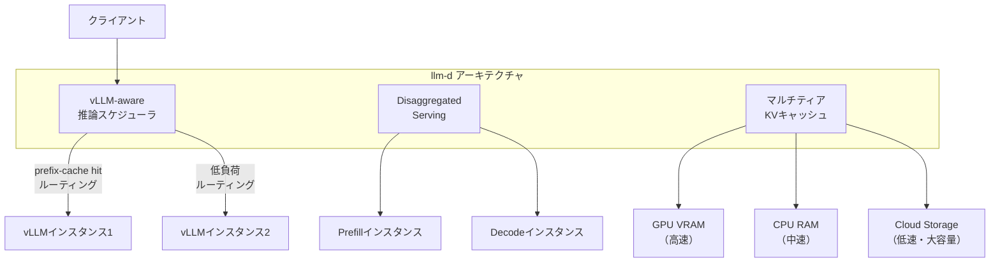

本記事は [Introducing the next generation of AI inference, powered by llm-d](https://cloud.google.com/blog/products/ai-machine-learning/enhancing-vllm-for-distributed-inference-with-llm-d)（Google Cloud Blog, 2025年5月21日）の解説記事です。

## ブログ概要（Summary）

Google CloudのMark Lohmeyer（VP, AI and Computing Infrastructure）とGabe Monroy（VP & GM, Cloud Runtimes）が、vLLMをベースとしたKubernetes-nativeな分散推論プロジェクト「llm-d」を発表した。Red Hat、IBM Research、NVIDIA、CoreWeaveが共同設立パートナーとして参加し、AMD、Cisco、Hugging Face、Intel、Lambda、Mistralも参画している。ブログによれば、llm-dの初期テストでコード補完ユースケースにおいてTTFTを2倍改善したと報告されている。

この記事は [Zenn記事: Vertex AI Model GardenでオープンLLMを本番デプロイする実践ガイド](https://zenn.dev/0h_n0/articles/4a07c4e096da93) の深掘りです。Zenn記事で解説したVertex AI Model GardenのvLLMサービングの次世代アーキテクチャを解説します。

## 情報源

- **種別**: 企業テックブログ
- **URL**: [https://cloud.google.com/blog/products/ai-machine-learning/enhancing-vllm-for-distributed-inference-with-llm-d](https://cloud.google.com/blog/products/ai-machine-learning/enhancing-vllm-for-distributed-inference-with-llm-d)
- **組織**: Google Cloud
- **発表日**: 2025年5月21日

## 技術的背景（Technical Background）

2025年時点で、AI推論のスケーラビリティが主要なボトルネックとなっている。ブログは2つの変化を指摘している：

1. **2年前の課題**: AIモデルの巨大化に対し、クラウドインフラは計算量とデータ量の桁違いの増大に対応してきた
2. **現在の課題**: エージェントAIワークフローと推論モデルが、高度に変動する需要と指数的な処理増大を生み出し、推論プロセスを圧迫してユーザー体験を劣化させている

vLLMはオープンソース推論エンジンとして広く採用されているが、単一インスタンスでの推論に最適化されており、分散推論・動的ルーティング・マルチティアキャッシュといったクラスタレベルの最適化が不足していた。llm-dはこのギャップを埋めるプロジェクトである。

## 実装アーキテクチャ（Architecture）

### llm-dの3つの技術革新

ブログでは、llm-dの3つの主要な革新が紹介されている：



#### 1. vLLM-awareな推論スケジューラ

従来のラウンドロビン型ロードバランシングに代えて、llm-dはvLLMの内部状態を理解するスケジューラを導入する。

**Prefix-cacheルーティング**: リクエストのプロンプトプレフィックスがキャッシュされているインスタンスに優先的にルーティングする。同一システムプロンプトを使うリクエストが同じインスタンスに集約されるため、KVキャッシュの再計算を回避できる。

**負荷ベースルーティング**: 各vLLMインスタンスのキュー長とGPU利用率を監視し、負荷の低いインスタンスにリクエストを振り分ける。

ブログの主張では、この2つのルーティング戦略の組み合わせにより、**少ないハードウェアリソースでレイテンシSLOを達成**できるとしている。

#### 2. Disaggregated Serving（分離推論）

llm-dはPrefillとDecodeを独立したインスタンスで処理するDisaggregated Servingをサポートする。これはDistServe（前述の論文）と同様のアーキテクチャであり、長いプロンプトの処理をPrefill専用インスタンスで行うことで、Decode中のリクエストへの干渉を排除する。

ブログによれば、この機能により**長いリクエストをより高いスループットと低いレイテンシで処理**できるとしている。

#### 3. マルチティアKVキャッシュ

llm-dは中間値（プレフィックスのKVキャッシュ）をGPU VRAM、CPU RAM、Cloud Storageの3つのストレージ層にまたがって管理する。

| ティア | ストレージ | レイテンシ | 容量 | コスト |
|--------|-----------|-----------|------|--------|
| Tier 1 | GPU VRAM | ~μs | 小 | 高 |
| Tier 2 | CPU RAM | ~ms | 中 | 中 |
| Tier 3 | Cloud Storage | ~100ms | 大 | 低 |

頻繁にアクセスされるプレフィックスのKVキャッシュはGPU VRAMに保持し、使用頻度の低いものはCPU RAMやCloud Storageに退避する。これにより、応答時間を改善しつつストレージコストを削減する。

### Kubernetes-nativeな設計

llm-dはKubernetesネイティブに設計されており、以下のGKE（Google Kubernetes Engine）機能と統合する：

- **Gateway API Inference Extension**: Kubernetes標準のGateway APIにAI推論ルーティング機能を追加するオープンソースプロジェクト
- **GKE Inference Gateway**: 上記をGKEに統合したマネージドサービス
- **AI Hypercomputer**: GPU/TPUのソフトウェア・ハードウェア統合プラットフォーム

ブログではフレームワーク対応として、PyTorch（現在対応）に加えてJAX（2025年後半対応予定）、GPU・TPU両方のアクセラレータをサポートすると述べている。

### パートナーエコシステム

llm-dのオープンソース化とコミュニティ主導の方針について、ブログは以下の意図を述べている：

> 「llm-dをオープンソースかつコミュニティ主導にすることが、広く利用可能にする最善の方法だと確信しています。どこでも実行でき、強力なコミュニティがサポートすることを保証します。」

**共同設立パートナー**: Google Cloud, Red Hat, IBM Research, NVIDIA, CoreWeave
**参加パートナー**: AMD, Cisco, Hugging Face, Intel, Lambda, Mistral AI

## Production Deployment Guide

### AWS実装パターン（コスト最適化重視）

**トラフィック量別の推奨構成**:

| 規模 | 月間リクエスト | 推奨構成 | 月額コスト | 主要サービス |
|------|--------------|---------|-----------|------------|
| **Small** | ~3,000 (100/日) | Serverless | $50-150 | Lambda + Bedrock + DynamoDB |
| **Medium** | ~30,000 (1,000/日) | Hybrid | $400-1,000 | ECS Fargate + ElastiCache（KVキャッシュティア） |
| **Large** | 300,000+ (10,000/日) | Container | $3,000-7,000 | EKS + prefix-awareルーティング |

**Large構成の詳細**:
- **EKS**: コントロールプレーン ($72/月)
- **EC2 Spot**: g5.xlarge × 4-8台 (prefix-cache routing対応)
- **ElastiCache Redis**: キャッシュルーティングテーブル ($30/月)
- **ALB**: Gateway API互換ルーティング ($20/月)
- **S3**: マルチティアKVキャッシュ Tier 3 ($10/月)

**コスト試算の注意事項**: 上記は2026年5月時点のAWS ap-northeast-1リージョン料金に基づく概算値です。最新料金は [AWS料金計算ツール](https://calculator.aws/) で確認してください。

### Terraformインフラコード

```hcl
module "eks" {
  source  = "terraform-aws-modules/eks/aws"
  version = "~> 20.0"

  cluster_name    = "llm-d-cluster"
  cluster_version = "1.31"

  vpc_id     = module.vpc.vpc_id
  subnet_ids = module.vpc.private_subnets

  cluster_endpoint_public_access = true
  enable_cluster_creator_admin_permissions = true
}

resource "aws_elasticache_replication_group" "kv_routing" {
  replication_group_id = "llm-d-kv-routing"
  description          = "Prefix-cache routing table for llm-d"
  engine               = "redis"
  node_type            = "cache.t4g.medium"
  num_cache_clusters   = 2

  at_rest_encryption_enabled = true
  transit_encryption_enabled = true
}

resource "kubectl_manifest" "vllm_nodepool" {
  yaml_body = <<-YAML
    apiVersion: karpenter.sh/v1
    kind: NodePool
    metadata:
      name: vllm-inference-pool
    spec:
      template:
        spec:
          requirements:
            - key: karpenter.sh/capacity-type
              operator: In
              values: ["spot"]
            - key: node.kubernetes.io/instance-type
              operator: In
              values: ["g5.xlarge", "g5.2xlarge"]
          limits:
            nvidia.com/gpu: "16"
      disruption:
        consolidationPolicy: WhenEmpty
        consolidateAfter: 30s
  YAML
}

resource "aws_budgets_budget" "llm_d_monthly" {
  name         = "llm-d-monthly-budget"
  budget_type  = "COST"
  limit_amount = "7000"
  limit_unit   = "USD"
  time_unit    = "MONTHLY"

  notification {
    comparison_operator        = "GREATER_THAN"
    threshold                  = 80
    threshold_type             = "PERCENTAGE"
    notification_type          = "ACTUAL"
    subscriber_email_addresses = ["ops@example.com"]
  }
}
```

### セキュリティベストプラクティス

- IAMロール: 最小権限の原則
- EKS: `cluster_endpoint_public_access = false`推奨
- ElastiCache: 暗号化有効化（at-rest + in-transit）
- KMS暗号化: S3/EBS全てKMS暗号化
- CloudTrail/Config有効化

### 運用・監視設定

```python
import boto3

cloudwatch = boto3.client('cloudwatch')

cloudwatch.put_metric_alarm(
    AlarmName='prefix-cache-hit-rate-low',
    ComparisonOperator='LessThanThreshold',
    EvaluationPeriods=3,
    MetricName='PrefixCacheHitRate',
    Namespace='Custom/LLM-D',
    Period=300,
    Statistic='Average',
    Threshold=0.5,
    AlarmDescription='Prefix cacheヒット率が50%未満: ルーティング設定の見直しを推奨'
)
```

### コスト最適化チェックリスト

- [ ] Prefix-cacheルーティングでKVキャッシュ再計算を回避
- [ ] マルチティアKVキャッシュ: GPU→CPU→S3の階層管理
- [ ] Spot Instances優先（最大90%削減）
- [ ] Reserved Instances: 1年コミットで最大72%削減
- [ ] Lambda: 低トラフィック時のServerless活用
- [ ] ElastiCache: ルーティングテーブルの最小構成
- [ ] アイドル時スケールダウン設定
- [ ] AWS Budgets: 月額予算設定
- [ ] CloudWatch: prefix-cacheヒット率・TTFT監視
- [ ] Cost Anomaly Detection有効化
- [ ] 日次コストレポート: SNS/Slack送信
- [ ] 未使用リソース削除
- [ ] タグ戦略: 環境別コスト可視化
- [ ] S3ライフサイクル: 古いKVキャッシュ自動削除
- [ ] 開発環境: 夜間/週末にGPUノード停止
- [ ] KMS暗号化: S3/ElastiCache/EBS
- [ ] TLS 1.2以上使用
- [ ] CloudTrail有効化
- [ ] Gateway API設定の定期見直し
- [ ] prefix-cacheのウォームアップ戦略定義

## パフォーマンス最適化（Performance）

ブログで報告されている主要な性能指標：

| 指標 | 標準vLLM | llm-d | 改善率 |
|------|---------|-------|--------|
| TTFT（コード補完ユースケース） | 1x | **2x改善** | 2倍 |
| ハードウェア効率 | ベースライン | 改善 | 少ないGPUでSLO達成 |

ブログは「初期テストによる結果」と記述しており、大規模な本番ベンチマークは今後公開される見込みである。

## 運用での学び（Production Lessons）

ブログから読み取れる運用上の知見：

- **ラウンドロビンの限界**: 従来のロードバランシングはvLLMの内部キャッシュ状態を考慮しないため、prefix-cacheの恩恵を受けられない。キャッシュアウェアなルーティングが必須
- **Kubernetes統合の重要性**: LLM推論のスケーリングにはオーケストレーション層との密な統合が必要。GKE Inference GatewayやGateway API Inference Extensionのような標準化された仕組みが有効
- **オープンソース戦略**: Google CloudはKubernetes、JAX、Istioと同様に、llm-dをオープンソース・コミュニティ主導で開発する方針。ベンダーロックインの回避とエコシステム構築を同時に追求

## 学術研究との関連（Academic Connection）

- **PagedAttention/vLLM**（Kwon et al., SOSP 2023）: llm-dの基盤エンジン。llm-dはvLLMの単一インスタンス最適化をクラスタレベルに拡張する位置づけ
- **DistServe**（Zhong et al., 2024）: llm-dのDisaggregated Serving機能はDistServeと同様のPrefill/Decode分離アーキテクチャに基づく
- **SGLang/RadixAttention**（Zheng et al., 2024）: llm-dのprefix-cacheルーティングはSGLangのRadixAttentionと同様のプレフィックスキャッシュ最適化を、分散環境に拡張したもの

## まとめと実践への示唆

llm-dは、vLLMの高効率推論エンジンにGoogleの大規模AI提供技術を組み合わせた次世代の分散推論スタックである。Vertex AI Model Gardenユーザーにとっては、OpenModel SDKの裏側で動作するサービングインフラの将来像を理解する上で重要なプロジェクトである。

実践的な示唆として、同一システムプロンプトを多用するアプリケーションでは、prefix-cacheルーティングによる大幅なTTFT改善が期待できる。また、Kubernetes上でのLLM推論を検討する場合、Gateway API Inference Extensionが標準的なルーティングインターフェースとなる可能性が高い。

## 参考文献

- **Blog URL**: [https://cloud.google.com/blog/products/ai-machine-learning/enhancing-vllm-for-distributed-inference-with-llm-d](https://cloud.google.com/blog/products/ai-machine-learning/enhancing-vllm-for-distributed-inference-with-llm-d)
- **llm-d Project**: [https://llm-d.ai/](https://llm-d.ai/)
- **GKE Inference Gateway**: [https://cloud.google.com/kubernetes-engine/docs/concepts/inference-gateway](https://cloud.google.com/kubernetes-engine/docs/concepts/inference-gateway)
- **Related Zenn article**: [https://zenn.dev/0h_n0/articles/4a07c4e096da93](https://zenn.dev/0h_n0/articles/4a07c4e096da93)
