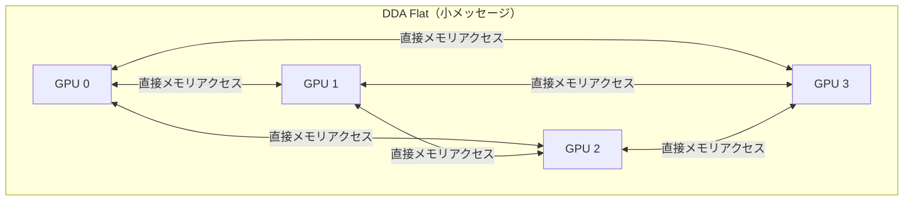

本記事は [Scaling LLM Inference: Innovations in Tensor Parallelism, Context Parallelism, and Expert Parallelism](https://engineering.fb.com/2025/10/17/ai-research/scaling-llm-inference-innovations-tensor-parallelism-context-parallelism-expert-parallelism/)（Meta Engineering Blog, 2025年10月17日）の解説記事です。

## ブログ概要（Summary）

MetaのAI Researchチーム（Cen Zhao, Xiaodong Wang, Jianyu Huang）が、Meta AI Appを支えるLLM推論システムのスケーリング技術を公開した。Tensor Parallelism（TP）、Context Parallelism（CP）、Expert Parallelism（EP）の3つの並列化手法と、独自開発のDirect Data Access（DDA）通信アルゴリズムにより、TTFT < 350ms、TTIT < 25msの目標を達成している。

この記事は [Zenn記事: Vertex AI Model GardenでオープンLLMを本番デプロイする実践ガイド](https://zenn.dev/0h_n0/articles/4a07c4e096da93) の深掘りです。Zenn記事で解説した`--tensor-parallel-size`パラメータや複数GPU構成の背景にある並列化技術を詳しく解説します。

## 情報源

- **種別**: 企業テックブログ
- **URL**: [https://engineering.fb.com/2025/10/17/ai-research/scaling-llm-inference-innovations-tensor-parallelism-context-parallelism-expert-parallelism/](https://engineering.fb.com/2025/10/17/ai-research/scaling-llm-inference-innovations-tensor-parallelism-context-parallelism-expert-parallelism/)
- **組織**: Meta AI Research
- **発表日**: 2025年10月17日

## 技術的背景（Technical Background）

LLM推論には2つの計算段階がある：

1. **Prefill段階（計算律速）**: 入力プロンプト全体を処理し、各Transformerレイヤーのkey-value（KV）キャッシュを生成する。Attention計算量はシーケンス長に対して二乗で増大する
2. **Decode段階（メモリ帯域律速）**: KVキャッシュを利用して1トークンずつ逐次生成する。モデル重みとKVキャッシュの読み出しI/Oが支配的

Metaが最適化対象とする性能指標は以下の3つである：

- **リソース効率**: GPU利用率の最大化
- **スループット**: 秒間処理リクエスト数（queries/s）
- **レイテンシ**: TTFT（Time-to-First-Token、prefill時間）< 350ms、TTIT（Time-to-Incremental-Token、デコード間隔）< 25ms

## 実装アーキテクチャ（Architecture）

### 1. Tensor Parallelism（TP）とDDAアルゴリズム

Tensor Parallelismはモデルの各レイヤー（Attentionブロック、MLPレイヤー）を複数GPUに分割し、単一デバイスでは実行不可能な大規模モデルの推論を実現する手法である。

TPの主要なボトルネックは**allreduce通信**で、ブログによればエンドツーエンドレイテンシの最大30%を占める。Metaはこの問題に対し、Direct Data Access（DDA）アルゴリズムを開発した。

**DDA Flatアルゴリズム**: 各ランク（GPU）が他ランクのメモリに直接アクセスしてローカルでreduce操作を行う。従来のring allreduceではレイテンシが$O(N)$（$N$はランク数）だったのに対し、DDA Flatは$O(1)$に削減する。ただし、データ交換量は$O(n)$から$O(n^2)$に増加するため、小メッセージサイズに適している。

$$
\text{Latency}_{\text{ring}} = O(N) \cdot t_{\text{comm}} \quad \rightarrow \quad \text{Latency}_{\text{DDA}} = O(1) \cdot t_{\text{comm}}
$$

ここで$N$はGPUランク数、$t_{\text{comm}}$は1回の通信にかかる時間を表す。

**DDA Treeアルゴリズム**: allreduceをreduce-scatterとall-gatherの2フェーズに分解し、各ステップでDDAを適用する。ring allreduceと同じデータ転送量を維持しつつ、レイテンシを定数因子に削減する。やや大きいメッセージサイズに適している。



ブログの報告によれば、AMD MI300XでH100と同等の性能を達成し、DDAはRCCLベースラインに対してdecodeで10-50%、prefillで10-30%の高速化を実現している。結果として**TTITを約10%削減**できたとのことである。

### 2. Context Parallelism（CP）

Context Parallelismは、Llama 4の1M/10Mトークンのような長大なコンテキストを複数GPU/ノードに分散して処理する手法である。

長コンテキスト推論の課題：
- **計算**: Dense Attentionの計算量がコンテキスト長の二乗で増大し、Attentionが計算時間を支配する
- **メモリ**: KVキャッシュがコンテキスト長に比例して増大する
- **通信**: 複数ホスト間の並列化で通信レイテンシが増加する

Metaは2種類のContext Parallelismを実装している：

**Pass-KV方式**: 入力トークンをCPランク間で分割し、各ランクがローカルなQ, K, Vを計算した後、K, VテンソルをランクR間で交換する。全コンテキストのAttention相互作用を実現する。

**Pass-Q方式**: Pass-KVとは逆に、Queryテンソルをランク間で交換する。KVキャッシュのサイズが大きい場合（長いコンテキスト）はQの方が小さいため効率的になるケースがある。

ブログの報告によれば、CPと高速Attentionカーネルの組み合わせにより以下の性能を達成している：

| 構成 | 性能 |
|------|------|
| 1Mトークン / 単一H100ホスト | **1分未満** |
| 10Mトークン / 32台H100ホスト | **1分未満** |
| 128Kトークン prefill / Llama 3 405B / CP over 16ノード | **3.8秒** |
| 1Mトークン prefill / Llama 3 405B | **77秒** |

ブログはCP数に対してほぼ線形のスケーリングが得られたと報告している。

### 3. Expert Parallelism（EP）

Expert Parallelismは、Mixture-of-Experts（MoE）モデルにおいて、多数のエキスパート（ニューラルネットワークモジュール）を複数ホストに分散配置する手法である。単一ホストに全エキスパートが収まらない大規模MoEモデルで必須となる。

EPベースの推論では、2ショットのall-to-all通信パターンを使用し、ルーティング結果に基づいてData Parallelismランクとエキスパートランク間でトークンを交換する。

ブログによれば、all-to-all通信がエンドツーエンドレイテンシの10-30%を占め、特にdecodeメッセージ（100KB〜2MB）で顕著である。最適化として以下を探索中と述べている：

- **Dynamic all-to-all**: データをサブチャンクに分割してリモートへ送信
- **Persistent all-to-all**: メモリハンドル交換、ネットワーク負荷分散、CPUオーバーヘッドに起因する速度低下を解消

## Production Deployment Guide

### AWS実装パターン（コスト最適化重視）

**トラフィック量別の推奨構成**:

| 規模 | 月間リクエスト | 推奨構成 | 月額コスト | 主要サービス |
|------|--------------|---------|-----------|------------|
| **Small** | ~3,000 (100/日) | Serverless | $50-150 | Lambda + Bedrock + DynamoDB |
| **Medium** | ~30,000 (1,000/日) | Hybrid | $500-1,200 | ECS Fargate + ElastiCache |
| **Large** | 300,000+ (10,000/日) | Container | $3,000-8,000 | EKS + Karpenter + p5/g6 Instances |

**Large構成の詳細** (月額$3,000-8,000):
- **EKS**: コントロールプレーン ($72/月)
- **EC2 Spot**: p5.48xlarge（H100 x8）or g6.48xlarge（L4 x8）(平均$3,000/月、Spot利用時)
- **Karpenter**: GPU自動スケーリング
- **EFA**: Elastic Fabric Adapter（TP/CP間の高速通信）
- **S3**: モデル重みストレージ ($50/月)

**コスト削減テクニック**:
- Spot Instances使用で最大90%削減（EKS + Karpenter）
- Reserved Instances購入で最大72%削減（1年コミット）
- TP/CPの適切な構成選択によるGPU台数最適化

**コスト試算の注意事項**: 上記は2026年5月時点のAWS ap-northeast-1リージョン料金に基づく概算値です。特にGPUインスタンスの料金はリージョン・可用性により大きく変動します。最新料金は [AWS料金計算ツール](https://calculator.aws/) で確認してください。

### Terraformインフラコード

**Large構成 (Container): EKS + Multi-GPU Tensor Parallelism**

```hcl
module "eks" {
  source  = "terraform-aws-modules/eks/aws"
  version = "~> 20.0"

  cluster_name    = "llm-tp-cluster"
  cluster_version = "1.31"

  vpc_id     = module.vpc.vpc_id
  subnet_ids = module.vpc.private_subnets

  cluster_endpoint_public_access = true
  enable_cluster_creator_admin_permissions = true
}

resource "kubectl_manifest" "gpu_nodepool" {
  yaml_body = <<-YAML
    apiVersion: karpenter.sh/v1
    kind: NodePool
    metadata:
      name: gpu-tp-pool
    spec:
      template:
        spec:
          requirements:
            - key: karpenter.sh/capacity-type
              operator: In
              values: ["spot", "on-demand"]
            - key: node.kubernetes.io/instance-type
              operator: In
              values: ["g5.48xlarge", "p5.48xlarge"]
          limits:
            cpu: "192"
            memory: "1536Gi"
            nvidia.com/gpu: "16"
      disruption:
        consolidationPolicy: WhenEmpty
        consolidateAfter: 60s
  YAML
}

resource "aws_budgets_budget" "gpu_monthly" {
  name         = "llm-gpu-monthly-budget"
  budget_type  = "COST"
  limit_amount = "8000"
  limit_unit   = "USD"
  time_unit    = "MONTHLY"

  notification {
    comparison_operator        = "GREATER_THAN"
    threshold                  = 80
    threshold_type             = "PERCENTAGE"
    notification_type          = "ACTUAL"
    subscriber_email_addresses = ["ops@example.com"]
  }
}
```

### セキュリティベストプラクティス

- IAMロール: 最小権限の原則（GPU/EFAリソースのみ許可）
- EKS: `cluster_endpoint_public_access = false`推奨（VPN/Direct Connect経由）
- Secrets Manager: モデルアクセストークン管理
- KMS暗号化: S3モデル重み、EBS全てKMS暗号化

### 運用・監視設定

```python
import boto3

cloudwatch = boto3.client('cloudwatch')

cloudwatch.put_metric_alarm(
    AlarmName='gpu-utilization-low',
    ComparisonOperator='LessThanThreshold',
    EvaluationPeriods=3,
    MetricName='GPUUtilization',
    Namespace='Custom/LLMInference',
    Period=300,
    Statistic='Average',
    Threshold=40.0,
    AlarmDescription='GPU利用率が40%未満: TP構成の見直しを検討'
)
```

### コスト最適化チェックリスト

- [ ] TP数はモデルサイズに応じて最小限に設定（8B→TP1, 70B→TP8）
- [ ] Spot Instances優先（最大90%削減、EKS + Karpenter）
- [ ] EFA有効化でTP間通信レイテンシ削減
- [ ] Reserved Instances: 1年コミットで最大72%削減
- [ ] Bedrock Batch API: 50%割引（非リアルタイム処理）
- [ ] Lambda: メモリサイズ最適化
- [ ] アイドル時スケールダウン設定
- [ ] AWS Budgets: 月額予算設定（80%で警告）
- [ ] CloudWatch: GPU利用率・通信レイテンシ監視
- [ ] Cost Anomaly Detection有効化
- [ ] 日次コストレポート: SNS/Slack送信
- [ ] 未使用リソース削除: Trusted Advisor活用
- [ ] タグ戦略: 環境別（dev/prod）コスト可視化
- [ ] S3ライフサイクル: 古いモデルバージョン自動削除
- [ ] 開発環境: 夜間/週末にGPUノード停止
- [ ] CloudTrail/Config: リソース変更追跡
- [ ] KMS暗号化: S3/EBS
- [ ] TLS 1.2以上使用
- [ ] 定期的なTP/CP構成ベンチマーク（6ヶ月ごと推奨）
- [ ] GPU世代更新の検討（コスト効率改善の可能性）

## パフォーマンス最適化（Performance）

ブログで報告されている主要な性能指標：

| 指標 | 目標値 | 達成手段 |
|------|--------|---------|
| TTFT（prefill） | < 350ms | Context Parallelism + 高速Attentionカーネル |
| TTIT（decode） | < 25ms | Tensor Parallelism + DDAアルゴリズム |
| DDA vs RCCL（decode） | 10-50%高速化 | Direct Data Accessによるallreduce最適化 |
| DDA vs RCCL（prefill） | 10-30%高速化 | 同上 |
| AMD MI300X vs H100 | 性能同等 | DDAによるクロスハードウェア最適化 |

## 運用での学び（Production Lessons）

ブログから読み取れる運用上の知見：

- **allreduce通信がボトルネック**: TP利用時にエンドツーエンドレイテンシの最大30%を通信が占める。NCCL/RCCLの標準アルゴリズムでは不十分な場合、DDAのようなカスタム通信アルゴリズムが必要になる
- **Prefill/Decodeの特性差**: Prefillは計算律速、Decodeはメモリ帯域律速という本質的な違いがある。両者を同じハードウェア構成で最適化するのは困難であり、Metaは今後Disaggregated Inference（分離推論）への移行を示唆している
- **異種ハードウェア対応**: DDAアルゴリズムはNVIDIA H100とAMD MI300Xの両方で動作し、ベンダーロックインを回避している

## 学術研究との関連（Academic Connection）

- **Megatron-LM**（Shoeybi et al., 2019）: Tensor ParallelismをLLM学習に導入した先駆的研究。Metaの推論TPはMegatronのcolumn/row parallel linearを推論用に最適化したもの
- **Ring Attention**（Liu et al., 2023）: Context Parallelismの学術的基盤。Metaの実装はPass-KVとPass-Qの2バリアントを提供
- **GShard/Switch Transformer**: Expert Parallelismの基礎。MetaのEP実装はall-to-all通信の最適化に独自の貢献がある

## まとめと実践への示唆

MetaのLLM推論スケーリング技術は、Vertex AI Model Gardenでの`--tensor-parallel-size`パラメータ設定の背後にある技術基盤を明示している。TP/CP/EPの3つの並列化手法を組み合わせることで、8Bから405B超のモデルまで効率的に推論可能な構成を実現できる。

Vertex AI Model Gardenユーザーにとっての実践的示唆：
- 70Bモデルでは`tensor_parallel_size=8`（L4×8）が推奨される理由は、TP通信のオーバーヘッドとGPU計算のバランスにある
- 長コンテキスト処理にはCP対応のvLLM構成が必要となる場合がある
- MoEモデル（Mixtral等）をデプロイする際はEP対応の構成選択が重要

## 参考文献

- **Blog URL**: [https://engineering.fb.com/2025/10/17/ai-research/scaling-llm-inference-innovations-tensor-parallelism-context-parallelism-expert-parallelism/](https://engineering.fb.com/2025/10/17/ai-research/scaling-llm-inference-innovations-tensor-parallelism-context-parallelism-expert-parallelism/)
- **Related Zenn article**: [https://zenn.dev/0h_n0/articles/4a07c4e096da93](https://zenn.dev/0h_n0/articles/4a07c4e096da93)
