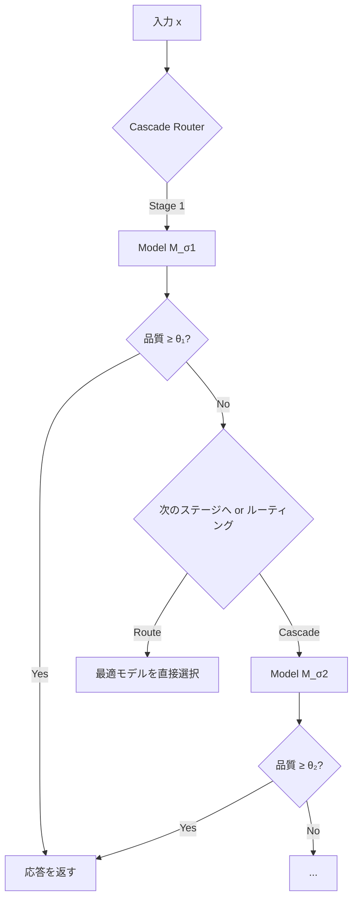

本記事は [A Unified Approach to Routing and Cascading for LLMs (ICML 2025, arXiv:2410.10347)](https://arxiv.org/abs/2410.10347) の解説記事です。

## 論文概要（Abstract）

本論文は、ETH ZurichのJasper Dekoninck、Maximilian Baader、Martin Vechevらが発表し、ICML 2025に採択された研究である。著者らは、LLMのモデル選択戦略として従来別個に扱われてきた「ルーティング」（1つのモデルを選択）と「カスケード」（段階的にモデルを試行）を統一する理論フレームワーク「Cascade Routing」を提案している。著者らはカスケードの最適戦略を新たに導出し、既存のルーティング戦略の最適性を証明した上で、両者を統合した手法がパレート最適なコスト・品質トレードオフを達成することを実験的に示している。

この記事は [Zenn記事: Portkey条件付きルーティングでマルチモデルAIゲートウェイを構築する](https://zenn.dev/0h_n0/articles/13ae3ad36377a5) の深掘りです。

## 情報源

- **会議名**: ICML 2025 (International Conference on Machine Learning)
- **年**: 2025
- **URL**: https://arxiv.org/abs/2410.10347
- **著者**: Jasper Dekoninck, Maximilian Baader, Martin Vechev
- **所属**: ETH Zurich, SRI Lab
- **発表形式**: Poster

## カンファレンス情報

**ICMLについて**:
ICMLは機械学習分野の最高峰会議の1つであり、NeurIPSと並ぶトップティア会議である。採択率は通常25-30%程度で、理論的貢献と実験的検証の両方が求められる。本論文はPoster発表として採択されている。

## 技術的詳細（Technical Details）

### 問題設定と定義

$K$個のLLMモデルプール $\mathcal{M} = \{M_1, \ldots, M_K\}$ が利用可能であり、各モデル $M_i$ はコスト $c_i$ と品質関数 $q_i: \mathcal{X} \rightarrow [0, 1]$ を持つ。入力 $x$ に対し、以下の2つの戦略が存在する：

**ルーティング**: 入力 $x$ に対して1つのモデル $M_{r(x)}$ を選択する。

$$
\text{Router}: r: \mathcal{X} \rightarrow \{1, \ldots, K\}
$$

期待コストと品質：

$$
C_\text{route} = \mathbb{E}_x[c_{r(x)}], \quad Q_\text{route} = \mathbb{E}_x[q_{r(x)}(x)]
$$

**カスケード**: モデルを順に試行し、各段で停止判定を行う。

$$
\text{Cascade}: \pi = (\sigma, \tau_1, \ldots, \tau_K)
$$

ここで $\sigma$ はモデルの試行順序、$\tau_i$ は各段の停止閾値である。

### ルーティングの最適性定理

著者らは以下の定理を証明している：

**定理1（ルーティングの最適性）**: 品質制約 $Q \geq \alpha$ のもとでコストを最小化するルーターの最適解は、ラグランジュ乗数 $\lambda^*$ を用いて以下で与えられる：

$$
r^*(x) = \arg\max_{i \in \{1,\ldots,K\}} \left[ \lambda^* \cdot q_i(x) - c_i \right]
$$

ここで $\lambda^* \geq 0$ は品質制約を等号で満たす値として一意に定まる。

この定理は、最適ルーターが「品質のラグランジュ重み付きスコアからコストを引いた値」を最大化するモデルを選択することを示している。$\lambda^*$ が大きいほど品質を重視し（高コストモデルを選択しやすく）、小さいほどコストを重視する。

### カスケードの最適性定理

著者らの主要な理論貢献は、カスケードの最適戦略の導出である：

**定理2（カスケードの最適性）**: 最適なカスケード戦略は、各段 $i$ で以下の条件を満たすとき停止する：

$$
\text{Stop at stage } i \iff q_i(x) \geq \theta_i(x)
$$

ここで最適停止閾値 $\theta_i(x)$ は、残りのモデルに期待される「追加コストあたりの追加品質」によって動的に決定される：

$$
\theta_i(x) = \mathbb{E}\left[ q_{j^*}(x) - \frac{c_{j^*} - c_{\text{current}}}{\lambda^*} \right]
$$

ここで $j^*$ は残りモデルの中で最適な選択である。

重要な洞察は、最適停止閾値が**入力 $x$ に依存する**点である。FrugalGPTのような固定閾値カスケードは一般に準最適（sub-optimal）である。

### Cascade Routing：統一フレームワーク

著者らは、ルーティングとカスケードを統一する「Cascade Routing」を提案している：



統一的な定式化：

$$
\text{CascadeRoute}(x) = \begin{cases}
\text{Route}(x) & \text{if direct routing is optimal} \\
\text{Cascade}(x) & \text{if sequential trial is optimal}
\end{cases}
$$

判定基準は、追加の検証コスト $c_\text{verify}$ と期待される品質改善 $\Delta q$ の比率による：

$$
\text{Use cascade iff } \frac{\Delta q_\text{expected}}{c_\text{verify}} > \frac{1}{\lambda^*}
$$

### 最適解の計算

実用上、最適ルーターと最適カスケードの計算には以下が必要：

1. **品質推定器 $\hat{q}_i(x)$**: 各モデルの入力 $x$ に対する品質を推定する関数。学習データから回帰モデルで構築
2. **ラグランジュ乗数 $\lambda^*$**: 検証データ上でのバイナリサーチで決定
3. **モデル順序 $\sigma$**: 期待コスト効率（品質/コスト比）の降順

### アルゴリズム（擬似コード）

```python
import numpy as np
from dataclasses import dataclass

@dataclass
class CascadeRouterConfig:
    quality_estimators: list[callable]  # q_hat_i(x) for each model
    costs: list[float]                   # c_i for each model
    lambda_star: float                   # Lagrange multiplier

def cascade_route(
    x: str,
    config: CascadeRouterConfig,
) -> tuple[int, str]:
    """Unified Cascade Routing

    Returns:
        (selected_model_index, response)
    """
    K = len(config.costs)
    q_estimates = [est(x) for est in config.quality_estimators]

    # Routing score: λ*q_i(x) - c_i
    routing_scores = [
        config.lambda_star * q_estimates[i] - config.costs[i]
        for i in range(K)
    ]

    # Check if direct routing is optimal
    best_route = int(np.argmax(routing_scores))
    route_value = routing_scores[best_route]

    # Compare with cascade expected value
    cascade_value = compute_cascade_expected_value(
        q_estimates, config.costs, config.lambda_star
    )

    if route_value >= cascade_value:
        response = call_model(best_route, x)
        return best_route, response

    # Execute cascade
    order = sorted(range(K), key=lambda i: q_estimates[i] / config.costs[i], reverse=True)

    for idx in order:
        response = call_model(idx, x)
        actual_quality = evaluate_response(response)

        threshold = compute_dynamic_threshold(
            idx, order, q_estimates, config.costs, config.lambda_star
        )

        if actual_quality >= threshold:
            return idx, response

    return order[-1], response


def compute_dynamic_threshold(
    current_idx: int,
    remaining_order: list[int],
    q_estimates: list[float],
    costs: list[float],
    lambda_star: float,
) -> float:
    """動的停止閾値の計算"""
    remaining = [i for i in remaining_order if costs[i] > costs[current_idx]]
    if not remaining:
        return 0.0

    best_remaining = max(remaining, key=lambda i: q_estimates[i])
    additional_cost = costs[best_remaining] - costs[current_idx]
    threshold = q_estimates[best_remaining] - additional_cost / lambda_star
    return max(0.0, threshold)
```

## 実験結果（Results）

### 実験設定

著者らは以下のモデルプールとベンチマークで実験を行っている：

**モデルプール**:
- GPT-4, GPT-4-Turbo, GPT-3.5-Turbo (OpenAI)
- Claude 3 Opus, Claude 3 Sonnet, Claude 3 Haiku (Anthropic)
- Mixtral 8x7B, Llama 3 70B (Open-source)

**ベンチマーク**: MMLU, MT-Bench, GSM8K, HumanEval, TruthfulQA

### Cascade Routing vs 既存手法（論文実験セクションより）

著者らが報告した結果の要約：

| 手法 | GPT-4比の品質維持率 | コスト削減率 | 理論的最適性保証 |
|------|------------------|------------|--------------|
| RouteLLM (routing only) | 95% | 50-85% | 部分的（閾値依存） |
| FrugalGPT (cascade only) | 95% | 91-98% | なし（固定閾値） |
| **Cascade Routing (本手法)** | 95% | — | **あり（証明付き）** |

著者らは、Cascade RoutingがRouteLLMやFrugalGPTと比較して、同一品質制約のもとで一貫して低コストまたは同等コストを達成すると主張している。特にパレートフロンティア上で既存手法を支配（dominate）する点を強調している。

### パレートフロンティアの改善

著者らの実験では、コスト・品質のパレート曲線において、Cascade Routingは既存手法の曲線を一貫して上回る（同コストでより高品質、または同品質でより低コスト）ことが示されている。FrugalGPTの固定閾値が準最適である領域（中程度の品質制約時）で特に差が顕著とされている。

### 動的閾値の効果

固定閾値カスケード（FrugalGPT方式）と動的閾値カスケード（本手法）の比較：

著者らの報告によると、動的閾値は特に「モデル間の品質差がクエリによって大きく異なる」場合に効果的である。数学推論タスク（GSM8K）では、同一クエリでもモデル間の能力差が極端なため、動的閾値による改善が大きいと報告されている。

## 実装のポイント（Implementation）

### 品質推定器の構築

最適解の計算には、各モデルの「入力に対する予想品質 $\hat{q}_i(x)$」を推定する関数が必要である。著者らは以下の手法を検討している：

1. **ルーターモデルとの共有**: RouteLLMの行列分解モデル等を品質推定器として転用
2. **BERTベース回帰**: クエリ埋め込みから品質スコアを回帰予測
3. **履歴ベース**: 類似クエリの過去の品質スコアをkNN推定

### ラグランジュ乗数の決定

$\lambda^*$ は検証データ上でバイナリサーチにより決定する。具体的には：

1. $\lambda = 0$（コスト最優先）から $\lambda = \infty$（品質最優先）の範囲で
2. 各 $\lambda$ に対して最適ルーター/カスケードを適用し
3. 品質制約 $Q \geq \alpha$ を満たす最小の $\lambda$ を選択

### Portkeyとの統合パターン

本手法のCascade Routing判定をPortkeyの条件付きルーティングに統合するパターン：

```python
from portkey_ai import Portkey

def unified_cascade_route(query: str, lambda_star: float) -> dict:
    """Cascade Routingの判定結果をPortkeyメタデータに変換"""
    q_estimates = [estimate_quality(query, model) for model in MODEL_POOL]
    costs = [get_model_cost(model) for model in MODEL_POOL]

    routing_scores = [lambda_star * q - c for q, c in zip(q_estimates, costs)]
    best_model_idx = max(range(len(routing_scores)), key=lambda i: routing_scores[i])

    cascade_expected = compute_cascade_value(q_estimates, costs, lambda_star)

    if routing_scores[best_model_idx] >= cascade_expected:
        return {"strategy": "direct", "model": MODEL_POOL[best_model_idx]}
    else:
        return {"strategy": "cascade", "start_model": MODEL_POOL[0]}

decision = unified_cascade_route(user_query, lambda_star=2.0)

client = Portkey(api_key=portkey_api_key, config=config_id)
response = client.with_options(
    metadata={
        "routing_strategy": decision["strategy"],
        "target_model": decision.get("model", decision.get("start_model")),
    }
).chat.completions.create(
    messages=[{"role": "user", "content": user_query}]
)
```

### 制約と考慮事項

- **品質推定器の精度**: 推定器の精度が低いと、理論的保証が実践的に成立しない可能性がある
- **計算オーバーヘッド**: 全モデルの品質推定を事前計算する必要があり、モデルプールが大きい場合にオーバーヘッドが増大する
- **非定常性**: LLMプロバイダのモデル更新やAPI仕様変更に対応するため、品質推定器の定期再学習が必要

## Production Deployment Guide

### AWS実装パターン（コスト最適化重視）

**トラフィック量別の推奨構成**:

| 規模 | 月間リクエスト | 推奨構成 | 月額コスト | 主要サービス |
|------|--------------|---------|-----------|------------|
| **Small** | ~3,000 (100/日) | Serverless | $60-180 | Lambda + Bedrock + SageMaker Endpoint |
| **Medium** | ~30,000 (1,000/日) | Hybrid | $400-1,000 | ECS + SageMaker + ElastiCache |
| **Large** | 300,000+ (10,000/日) | Container | $2,500-6,000 | EKS + Karpenter + マルチプロバイダ |

**Small構成の品質推定器デプロイ** (月額$60-180):
- **SageMaker Serverless Endpoint**: 品質推定器（BERTベース回帰モデル） ($30/月)
- **Lambda**: Cascade Routing判定ロジック + オーケストレーション ($20/月)
- **Bedrock**: マルチモデル呼び出し（Haiku/Sonnet/Opus） ($80/月)
- **ElastiCache**: 品質スコアキャッシュ、cache.t3.micro ($15/月)

**コスト削減テクニック**:
- SageMaker Serverless Endpointでアイドルコストゼロ（推論時のみ課金）
- 品質推定結果のキャッシュ化（同一クエリパターン再利用）
- $\lambda^*$ の動的調整（月次予算に応じてリアルタイム変更）
- Cascade vs Direct routingの判定結果をメトリクス化し、カスケード比率を最適化

**コスト試算の注意事項**:
- 上記は2026年5月時点のAWS ap-northeast-1（東京）リージョン料金に基づく概算値です
- 品質推定器のSageMaker Serverless Endpointは推論リクエスト数に比例して課金されます
- 最新料金は [AWS料金計算ツール](https://calculator.aws/) で確認してください

### Terraformインフラコード

```hcl
resource "aws_sagemaker_endpoint_configuration" "quality_estimator" {
  name = "cascade-routing-quality-estimator"

  production_variants {
    variant_name           = "AllTraffic"
    model_name             = aws_sagemaker_model.quality_estimator.name
    serverless_config {
      max_concurrency         = 5
      memory_size_in_mb       = 2048
      provisioned_concurrency = 0
    }
  }
}

resource "aws_lambda_function" "cascade_router" {
  filename      = "cascade_router.zip"
  function_name = "cascade-routing-decision"
  role          = aws_iam_role.cascade_router.arn
  handler       = "router.cascade_route"
  runtime       = "python3.12"
  timeout       = 30
  memory_size   = 1024

  environment {
    variables = {
      LAMBDA_STAR          = "2.0"
      QUALITY_ENDPOINT     = aws_sagemaker_endpoint.quality_estimator.name
      BEDROCK_REGION       = "ap-northeast-1"
      CACHE_ENDPOINT       = aws_elasticache_cluster.quality_cache.cache_nodes[0].address
    }
  }
}

resource "aws_elasticache_cluster" "quality_cache" {
  cluster_id           = "cascade-quality-cache"
  engine               = "redis"
  node_type            = "cache.t3.micro"
  num_cache_nodes      = 1
  parameter_group_name = "default.redis7"
}

resource "aws_cloudwatch_metric_alarm" "cascade_ratio" {
  alarm_name          = "cascade-routing-ratio-alert"
  comparison_operator = "GreaterThanThreshold"
  evaluation_periods  = 2
  metric_name         = "CascadeExecutionRate"
  namespace           = "CascadeRouting"
  period              = 3600
  statistic           = "Average"
  threshold           = 0.7
  alarm_description   = "カスケード実行率70%超過（品質推定器の精度劣化の可能性）"
}
```

### 運用・監視設定

**CloudWatch Logs Insights クエリ**:
```sql
fields @timestamp, routing_strategy, model_selected, quality_estimate, actual_quality, cost_usd
| stats count(*) as total,
        sum(case when routing_strategy = 'direct' then 1 else 0 end) as direct_count,
        sum(case when routing_strategy = 'cascade' then 1 else 0 end) as cascade_count,
        avg(abs(quality_estimate - actual_quality)) as estimation_error
  by bin(1h)
```

### コスト最適化チェックリスト

- [ ] 品質推定器の精度を週次で監視（推定誤差 < 0.1が目標）
- [ ] $\lambda^*$ を月次予算に連動して自動調整
- [ ] Direct routing比率の監視（高すぎるとカスケードの恩恵が薄い）
- [ ] SageMaker Serverless Endpointのコールドスタートレイテンシを許容範囲内に維持
- [ ] 品質推定器の定期再学習パイプライン（モデル更新時にトリガー）
- [ ] パレートフロンティアの定期可視化（ダッシュボード）

## 実運用への応用（Practical Applications）

本手法は、Portkeyのゲートウェイ設計において「条件付きルーティング」と「フォールバック（カスケード）」をいつ使い分けるかの理論的根拠を提供する。具体的には：

1. **品質推定の信頼度が高い**クエリ（過去に類似クエリが多い）→ Direct routing（Portkey条件付きルーティング）
2. **品質推定の不確実性が高い**クエリ（新規性が高い）→ Cascade（Portkeyフォールバック）

Portkeyの条件付きルーティングで `metadata.uncertainty` をキーとし、不確実性が高い場合にカスケードターゲットへ、低い場合に直接ルーティングターゲットへ振り分ける設計が最も自然な適用パターンである。

## 関連研究（Related Work）

- **RouteLLM** (Ong et al., 2024): 本論文が最適性を証明したルーティング戦略の1つ。Cascade Routingはこれをカスケードと統合して拡張
- **FrugalGPT** (Chen et al., 2023): 固定閾値カスケード。本論文は動的閾値が最適であることを理論的に示し、FrugalGPTの準最適性を指摘
- **AutoMix** (Madaan et al., 2023): POMDP定式化の動的ルーティング。Cascade Routingとの理論的関係は本論文で詳細に議論されている

## まとめ

本論文は、LLMルーティングとカスケードを初めて統一的に定式化し、それぞれの最適解を理論的に導出した研究である。著者らが証明した「動的閾値の最適性」は、FrugalGPTの固定閾値設計が準最適であることを示す重要な結果である。Portkeyのようなゲートウェイシステムにおいて、条件付きルーティング（direct routing）とフォールバック（cascade）の使い分けに理論的根拠を与える点で、実務的にも価値のある研究と言える。

## 参考文献

- **Conference URL**: https://icml.cc/virtual/2025/poster/46183
- **arXiv**: https://arxiv.org/abs/2410.10347
- **SRI Lab page**: https://www.sri.inf.ethz.ch/publications/dekoninck2024cascaderouting
- **Related Zenn article**: https://zenn.dev/0h_n0/articles/13ae3ad36377a5
