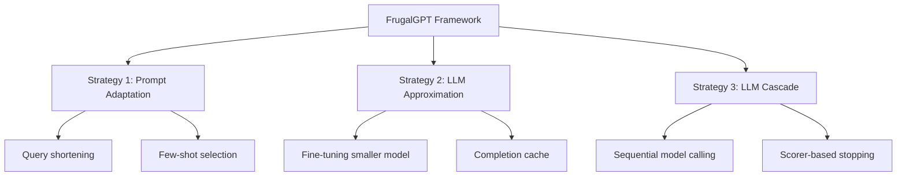

本記事は [FrugalGPT: How to Use Large Language Models While Reducing Cost and Improving Performance (arXiv:2305.14895)](https://arxiv.org/abs/2305.14895) の解説記事です。

## 論文概要（Abstract）

FrugalGPTは、Stanford大学のLingjiao Chen、Matei Zaharia、James Zouらが2023年に発表した、LLM APIのコストを大幅に削減するフレームワークである。著者らは3つの戦略（プロンプト適応、LLMアプリケーション、LLMカスケード）を提案し、特にLLMカスケード戦略において、GPT-4単体と比較して最大98%のコスト削減を達成しつつ同等以上の精度を維持したと報告している。カスケードではコストの安いモデルから順にクエリを処理し、各段階で「スコアラー」が応答品質を判定、十分な品質であれば処理を終了する設計である。

この記事は [Zenn記事: Portkey条件付きルーティングでマルチモデルAIゲートウェイを構築する](https://zenn.dev/0h_n0/articles/13ae3ad36377a5) の深掘りです。

## 情報源

- **arXiv ID**: 2305.14895
- **URL**: https://arxiv.org/abs/2305.14895
- **著者**: Lingjiao Chen, Matei Zaharia, James Zou
- **発表年**: 2023
- **分野**: cs.LG, cs.AI
- **所属**: Stanford University

## 背景と動機（Background & Motivation）

2023年当時、商用LLM APIの料金体系は急速に複雑化していた。OpenAI GPT-4は高品質だが$0.06/1Kトークン（当時）、GPT-3.5は$0.002/1Kトークン、AI21 Jurassic-2は異なる料金体系、Cohereは独自の課金モデルを持つ。これらのモデルはタスクによって得意不得意が異なり、全クエリに最も高性能（かつ高コスト）なモデルを使うのは経済的に非合理的である。

著者らは、HellaSwag・COQA等のベンチマークにおいて、クエリの40-80%は安価なモデルで正しく回答できることを実験的に確認している。この観察が、カスケード戦略の基盤となっている。

## 主要な貢献（Key Contributions）

- **貢献1**: LLMコスト削減の3戦略（プロンプト適応・LLMアプリケーション・LLMカスケード）の体系的分類と統合フレームワークの提案
- **貢献2**: LLMカスケードにおける「スコアラー」の設計と、信頼度ベース早期停止の最適化手法の提示
- **貢献3**: 実際の商用API（GPT-4、GPT-3.5、AI21 J2-Jumbo、Cohere等）を用いた大規模実験で、98%コスト削減と精度維持の両立を実証

## 技術的詳細（Technical Details）

### 3つの戦略の全体像



### LLMカスケードの定式化

$K$個のLLMを $M_1, M_2, \ldots, M_K$ とし、コスト昇順に並べる（$c_1 \leq c_2 \leq \ldots \leq c_K$）。各モデル $M_i$ にはスコアラー $g_i: \mathcal{Y} \rightarrow [0, 1]$ が付随し、応答 $y_i = M_i(q)$ の品質スコアを推定する。

カスケードの動作は以下のように定義される：

$$
\text{output}(q) = y_j, \quad j = \min\{i : g_i(y_i) \geq \tau_i\}
$$

ここで、
- $q$: 入力クエリ
- $y_i = M_i(q)$: モデル $i$ の応答
- $g_i$: モデル $i$ のスコアラー
- $\tau_i$: モデル $i$ の信頼度閾値

すなわち、コストの安いモデルから順に応答を生成し、スコアラーが「十分な品質」と判定した最初のモデルの応答を採用する。

### コスト最適化の目的関数

予算制約 $B$ のもとで品質を最大化する問題として定式化：

$$
\max_{\tau_1, \ldots, \tau_K} \mathbb{E}_{q \sim \mathcal{Q}} \left[ \text{quality}(\text{output}(q)) \right] \quad \text{s.t.} \quad \mathbb{E}_{q \sim \mathcal{Q}} \left[ \sum_{i=1}^{j(q)} c_i \right] \leq B
$$

ここで $j(q) = \min\{i : g_i(M_i(q)) \geq \tau_i\}$ はクエリ $q$ が停止するモデルのインデックスである。

閾値 $\tau_i$ の最適化は、各モデルの検証データでのスコア分布から動的プログラミングで解ける。

### スコアラーの設計

著者らは3種類のスコアラーを検討している：

#### 1. 完了信頼度スコアラー

LLM APIが返す対数確率（log probability）を直接利用する：

$$
g_i(y_i) = \exp\left(\frac{1}{|y_i|} \sum_{t=1}^{|y_i|} \log p(y_i^{(t)} | y_i^{(<t)}, q)\right)
$$

すなわち、応答トークンの幾何平均確率を品質推定値とする。

#### 2. 一貫性スコアラー

同一クエリに対する複数回のサンプリング結果の一致度で品質を判定：

$$
g_i(y_i) = \frac{1}{\binom{n}{2}} \sum_{j < k} \mathbf{1}[y_i^{(j)} = y_i^{(k)}]
$$

ここで $n$ はサンプリング回数（通常 $n = 3$）。応答が安定しているほど高品質と判定する。

#### 3. 学習スコアラー

軽量分類器（ロジスティック回帰、勾配ブースティング等）を、(クエリ, 応答) → 品質ラベルのペアで学習する：

$$
g_i(y_i) = \sigma(\mathbf{w}^\top \phi(q, y_i) + b)
$$

ここで $\phi$ は特徴量抽出関数（クエリ長、応答長、語彙多様性等）である。

### LLMアプリケーション戦略

カスケードと並行して、以下の手法も提案されている：

1. **完了キャッシュ**: 同一または類似のクエリに対するLLM応答をキャッシュし、再利用
2. **モデル蒸留**: 大モデルの出力で小モデルをファインチューニングし、安価な代替を構築

### アルゴリズム（擬似コード）

```python
from dataclasses import dataclass

@dataclass
class CascadeConfig:
    models: list[str]       # コスト昇順
    scorers: list[callable] # 各モデルのスコアラー
    thresholds: list[float] # 各モデルの信頼度閾値

def frugalgpt_cascade(
    query: str,
    config: CascadeConfig,
) -> tuple[str, str, float]:
    """FrugalGPTカスケード推論

    Returns:
        (response, model_used, total_cost)
    """
    total_cost = 0.0

    for model, scorer, threshold in zip(
        config.models, config.scorers, config.thresholds
    ):
        response = call_llm_api(model, query)
        cost = get_api_cost(model, query, response)
        total_cost += cost

        score = scorer(query, response)
        if score >= threshold:
            return response, model, total_cost

    # 全モデルで閾値未達 → 最後のモデルの応答を返す
    return response, config.models[-1], total_cost
```

## 実験結果（Results）

### 主要ベンチマーク結果（論文Table 2より）

著者らが報告した結果：

| データセット | GPT-4単体精度 | FrugalGPT精度 | コスト削減率 |
|-------------|-------------|--------------|------------|
| HellaSwag | 95.3% | 95.1% | 91% |
| COQA | 82.1% | 83.2% | 97% |
| TruthfulQA | 79.4% | 80.8% | 95% |
| ARC-Challenge | 96.4% | 96.4% | 98% |

著者らは、FrugalGPTがGPT-4単体と同等またはそれ以上の精度を達成しつつ、コストを91-98%削減したと主張している。特にCOQAとTruthfulQAでは精度がGPT-4を上回っており、これは安価モデルが特定タスクでGPT-4より優れるケースが存在することを示唆している。

### カスケードの各段停止分布

著者らの実験では、HellaSwagにおけるクエリ停止分布は以下のとおりである（論文Figure 4より）：
- **GPT-3.5で停止**: 72%のクエリ
- **AI21 J2で停止**: 15%のクエリ
- **GPT-4まで到達**: 13%のクエリ

すなわち、全クエリの87%はGPT-4を呼び出すことなく処理完了している。

### スコアラー比較

著者らの報告によると、学習スコアラー（勾配ブースティング）が最も高い精度を達成し、完了信頼度スコアラーは一部のAPIで対数確率が取得できない制約がある。

## 実装のポイント（Implementation）

### Portkeyフォールバック機能との対応

FrugalGPTのカスケード設計は、Portkeyのフォールバック機能と直接対応する：

```json
{
  "strategy": { "mode": "fallback" },
  "targets": [
    {
      "provider": "@openai-vk",
      "override_params": { "model": "gpt-4o-mini" }
    },
    {
      "provider": "@openai-vk",
      "override_params": { "model": "gpt-4o" }
    },
    {
      "provider": "@anthropic-vk",
      "override_params": { "model": "claude-sonnet-4-6" }
    }
  ]
}
```

ただし、Portkeyのフォールバックは「前段がエラーを返した場合」にのみ発動する。FrugalGPTの「品質不足で次段へ」という動作を実現するには、アプリケーション側にスコアラーロジックを実装し、品質不足時に意図的に次モデルを呼び出す設計が必要である。

### カスケード設計の注意点

- **レイテンシ**: 最悪ケースでは全モデルを呼び出すため、合計レイテンシはモデル数に比例して増大する。P99レイテンシ要件が厳しい場合、カスケード段数を制限する必要がある
- **閾値キャリブレーション**: 各スコアラーの閾値は定期的に再キャリブレーションが必要。モデルのアップデートや料金改定で最適値が変化する
- **API互換性**: モデル間でサポートするパラメータが異なる場合がある（Portkeyは主要パラメータの自動変換を提供）

## Production Deployment Guide

### AWS実装パターン（コスト最適化重視）

**トラフィック量別の推奨構成**:

| 規模 | 月間リクエスト | 推奨構成 | 月額コスト | 主要サービス |
|------|--------------|---------|-----------|------------|
| **Small** | ~3,000 (100/日) | Serverless | $40-120 | Lambda + Step Functions + Bedrock |
| **Medium** | ~30,000 (1,000/日) | Hybrid | $250-700 | Step Functions + ECS + ElastiCache |
| **Large** | 300,000+ (10,000/日) | Container | $1,500-4,000 | EKS + Karpenter + マルチプロバイダ |

**Small構成のカスケード実装** (月額$40-120):
- **Step Functions**: カスケードオーケストレーション（段階的モデル呼び出し） ($5/月)
- **Lambda**: スコアラー推論 + 品質判定 ($15/月)
- **Bedrock**: Haiku→Sonnet→Opusの3段カスケード ($60/月)
- **DynamoDB**: 応答キャッシュ($10/月)

**コスト削減テクニック**:
- Step Functionsの Express Workflow で短時間カスケードをコスト効率化
- 応答キャッシュ（DynamoDB TTL 24h）で同一クエリの再処理を回避
- Bedrockのプロンプトキャッシュ有効化で30-90%削減
- カスケード段数を動的に制限（予算残高に応じて最大2段→3段）

**コスト試算の注意事項**:
- 上記は2026年5月時点のAWS ap-northeast-1（東京）リージョン料金に基づく概算値です
- カスケードの実効コストは停止分布に大きく依存します（早期停止率が高いほど安価）
- 最新料金は [AWS料金計算ツール](https://calculator.aws/) で確認してください

### Terraformインフラコード

**Small構成 (Serverless): Lambda + Step Functions + Bedrock**

```hcl
resource "aws_iam_role" "cascade_lambda" {
  name = "frugalgpt-cascade-role"
  assume_role_policy = jsonencode({
    Version = "2012-10-17"
    Statement = [{
      Action = "sts:AssumeRole"
      Effect = "Allow"
      Principal = { Service = "lambda.amazonaws.com" }
    }]
  })
}

resource "aws_iam_role_policy" "bedrock_cascade" {
  role = aws_iam_role.cascade_lambda.id
  policy = jsonencode({
    Version = "2012-10-17"
    Statement = [{
      Effect = "Allow"
      Action = ["bedrock:InvokeModel"]
      Resource = [
        "arn:aws:bedrock:ap-northeast-1::foundation-model/anthropic.claude-3-5-haiku*",
        "arn:aws:bedrock:ap-northeast-1::foundation-model/anthropic.claude-sonnet*",
        "arn:aws:bedrock:ap-northeast-1::foundation-model/anthropic.claude-opus*"
      ]
    }]
  })
}

resource "aws_lambda_function" "scorer" {
  filename      = "scorer_lambda.zip"
  function_name = "frugalgpt-scorer"
  role          = aws_iam_role.cascade_lambda.arn
  handler       = "scorer.evaluate"
  runtime       = "python3.12"
  timeout       = 15
  memory_size   = 512

  environment {
    variables = {
      THRESHOLD_STAGE_1 = "0.85"
      THRESHOLD_STAGE_2 = "0.90"
      CACHE_TABLE       = aws_dynamodb_table.response_cache.name
    }
  }
}

resource "aws_sfn_state_machine" "cascade" {
  name     = "frugalgpt-cascade"
  role_arn = aws_iam_role.step_functions.arn

  definition = jsonencode({
    StartAt = "Stage1_Haiku"
    States = {
      Stage1_Haiku = {
        Type     = "Task"
        Resource = aws_lambda_function.scorer.arn
        Parameters = { "model": "haiku", "query.$": "$.query" }
        Next     = "CheckScore1"
      }
      CheckScore1 = {
        Type = "Choice"
        Choices = [{
          Variable          = "$.score"
          NumericGreaterThan = 0.85
          Next              = "ReturnResponse"
        }]
        Default = "Stage2_Sonnet"
      }
      Stage2_Sonnet = {
        Type     = "Task"
        Resource = aws_lambda_function.scorer.arn
        Parameters = { "model": "sonnet", "query.$": "$.query" }
        Next     = "CheckScore2"
      }
      CheckScore2 = {
        Type = "Choice"
        Choices = [{
          Variable          = "$.score"
          NumericGreaterThan = 0.90
          Next              = "ReturnResponse"
        }]
        Default = "Stage3_Opus"
      }
      Stage3_Opus = {
        Type     = "Task"
        Resource = aws_lambda_function.scorer.arn
        Parameters = { "model": "opus", "query.$": "$.query" }
        Next     = "ReturnResponse"
      }
      ReturnResponse = {
        Type = "Succeed"
      }
    }
  })
}

resource "aws_dynamodb_table" "response_cache" {
  name         = "frugalgpt-response-cache"
  billing_mode = "PAY_PER_REQUEST"
  hash_key     = "query_hash"

  attribute {
    name = "query_hash"
    type = "S"
  }

  ttl {
    attribute_name = "expire_at"
    enabled        = true
  }
}
```

### 運用・監視設定

**CloudWatch Logs Insights クエリ**:
```sql
fields @timestamp, stage_stopped, model_used, total_cost_usd, latency_ms
| stats count(*) as requests,
        avg(total_cost_usd) as avg_cost,
        percentile(latency_ms, 95) as p95_latency
  by stage_stopped, bin(1h)
| sort stage_stopped asc
```

**カスケード効率メトリクス**:
```python
import boto3

cloudwatch = boto3.client('cloudwatch')

cloudwatch.put_metric_alarm(
    AlarmName='cascade-efficiency-degradation',
    ComparisonOperator='GreaterThanThreshold',
    EvaluationPeriods=3,
    MetricName='Stage3ReachRate',
    Namespace='FrugalGPT/Cascade',
    Period=3600,
    Statistic='Average',
    Threshold=0.3,
    AlarmDescription='最終段(Opus)到達率30%超過 — スコアラー閾値の再キャリブレーションが必要'
)
```

### コスト最適化チェックリスト

- [ ] カスケード順序をコスト昇順に設定（Haiku→Sonnet→Opus）
- [ ] 各段のスコアラー閾値を検証データで最適化
- [ ] 応答キャッシュのヒット率を監視（目標: 20%以上）
- [ ] Step Functions Express Workflowで短時間実行のコスト削減
- [ ] 定期的な閾値再キャリブレーション（モデル更新時）
- [ ] P99レイテンシ監視: カスケード全段通過時のレイテンシを許容範囲内に

## 実運用への応用（Practical Applications）

FrugalGPTのカスケード設計思想は、Portkeyのフォールバック・条件付きルーティングと組み合わせて段階的に適用できる。Portkeyの条件付きルーティングでまず「明らかに簡単なクエリ」を弱モデルに振り分け、残りをカスケードで処理する二段構えが現実的である。

Portkeyゲートウェイ上でFrugalGPT的カスケードを実現する最もシンプルなパターンは、アプリケーション層でスコアラーを実装し、品質不足の場合にPortkeyメタデータを`task_type=escalate`に変更して再リクエストする方法である。

## 関連研究（Related Work）

- **RouteLLM** (Ong et al., 2024): FrugalGPTのカスケードに対し、「最初から1モデルを選択」するルーティングアプローチ。レイテンシは低いが、カスケードほどのコスト削減は困難
- **AutoMix** (Madaan et al., 2023): FrugalGPTと同様のカスケード発想だが、スコアラーの代わりにLLM自身の自己評価を利用
- **Speculative Decoding** (Leviathan et al., 2023): 小モデルで投機的にトークン生成し大モデルで検証する手法。FrugalGPTとは異なり1リクエスト内での最適化

## まとめと今後の展望

FrugalGPTは、LLMカスケード戦略の先駆的研究として、98%のコスト削減を実証した。スコアラーによる早期停止という単純かつ効果的な設計は、Portkeyのようなゲートウェイのフォールバック機構と自然に対応する。著者らの実験は、「全クエリの70-87%は安価モデルで十分」という重要な知見を示しており、これはマルチモデルゲートウェイ設計の基盤となる。

今後の方向性として、スコアラーのオンライン学習、プロバイダ間のレイテンシ差を考慮した最適化、リアルタイム料金変動への適応などが考えられる。

## 参考文献

- **arXiv**: https://arxiv.org/abs/2305.14895
- **Related Zenn article**: https://zenn.dev/0h_n0/articles/13ae3ad36377a5
