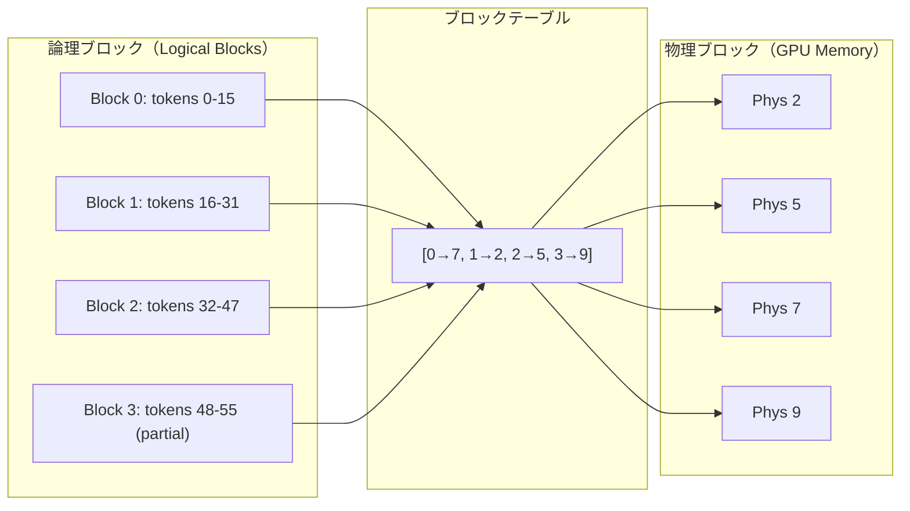

> **本記事は [Efficient Memory Management for Large Language Model Serving with PagedAttention (arXiv:2309.06180)](https://arxiv.org/abs/2309.06180) の解説記事です。**

## 論文概要（Abstract）

PagedAttentionは、LLM推論におけるKVキャッシュのメモリ管理にOSの仮想メモリ（ページング）方式を適用した手法である。従来のLLM推論サーバーでは、KVキャッシュに連続したメモリ領域を事前に確保するため、メモリ断片化により実効GPU利用率が20-80%低下していた。PagedAttentionはKVキャッシュを固定サイズのブロック（ページ）に分割し、非連続な物理メモリにマッピングすることでこの問題を解消した。著者らの報告によれば、HuggingFace Transformers比で最大24倍、ORCA比で2.7倍のスループット向上を達成している。本手法はvLLMの中核技術として広く普及し、現在のAnthropic・OpenAI・Geminiのプロンプトキャッシュ機能の基盤となっている。

この記事は [Zenn記事: Anthropic・OpenAI・Geminiプロンプトキャッシュ実装比較と統一設計](https://zenn.dev/0h_n0/articles/ed38b5d39a1a2e) の深掘りです。

## 情報源

- **arXiv ID**: 2309.06180
- **URL**: [https://arxiv.org/abs/2309.06180](https://arxiv.org/abs/2309.06180)
- **著者**: Woosuk Kwon, Zhuohan Li, Siyuan Zhuang, Ying Sheng, Lianmin Zheng, Cody Hao Yu, Joseph E. Gonzalez, Hao Zhang, Ion Stoica（UC Berkeley）
- **発表年**: 2023
- **分野**: cs.CL, cs.LG

## 背景と動機（Background & Motivation）

LLMの推論（inference）では、自己回帰的なトークン生成のためにself-attentionの中間結果であるkey-valueペア（KVキャッシュ）をメモリ上に保持する必要がある。生成が進むにつれてKVキャッシュは成長し、大規模モデルでは数GBに達する。

従来のLLM推論システムでは、各リクエストのKVキャッシュに対して最大シーケンス長分の連続メモリ領域を事前に確保していた。しかし実際の生成長は事前に予測できないため、以下の3種類のメモリ浪費が発生していた。

1. **予約済み未使用（Reserved waste）**: 最大長まで確保されたが実際には使われない領域
2. **内部断片化（Internal fragmentation）**: ブロック内の未使用部分
3. **外部断片化（External fragmentation）**: 確保・解放の繰り返しにより生じる利用不可能な隙間

著者らの分析では、これらの浪費により実効GPU利用率が20-80%低下していた。PagedAttentionはOSの仮想メモリのページング機構にヒントを得て、この問題を根本的に解決した。

## 主要な貢献（Key Contributions）

- **PagedAttention**: KVキャッシュをOSのページングに倣い、固定サイズブロックに分割して非連続メモリにマッピングする新しいattention計算アルゴリズムを提案
- **ブロックテーブルによる管理**: OSのページテーブルに対応するブロックテーブルでKVキャッシュの論理-物理マッピングを管理
- **Copy-on-Write共有**: beam search等の分岐処理で、KVキャッシュを参照カウント方式で共有しメモリ消費を削減
- **vLLMの実装と公開**: PagedAttentionを実装したオープンソース推論エンジンvLLMを公開（Apache-2.0）
- **メモリ浪費の劇的削減**: メモリ断片化を4%未満に抑制（従来手法では20-80%が浪費）

## 技術的詳細（Technical Details）

### KVキャッシュのメモリ問題

Transformerベースの自己回帰生成では、トークン $t$ の生成時に過去の全トークン $1, \ldots, t-1$ のkey-valueペアが必要となる。レイヤー $l$、ヘッド $h$ におけるKVキャッシュのメモリ消費は以下で計算される。

$$
M_{\text{KV}} = 2 \times L_{\text{layers}} \times H_{\text{heads}} \times d_{\text{head}} \times S_{\text{seq}} \times b_{\text{dtype}}
$$

ここで、
- $L_{\text{layers}}$: Transformerのレイヤー数
- $H_{\text{heads}}$: attentionヘッド数
- $d_{\text{head}}$: 各ヘッドの次元数
- $S_{\text{seq}}$: シーケンス長（トークン数）
- $b_{\text{dtype}}$: データ型のバイト数（FP16なら2）
- 係数2: keyとvalueの2つ

LLaMA-13B（40層、40ヘッド、128次元、FP16）で最大シーケンス長2,048の場合、1リクエストあたりのKVキャッシュは約800MBとなる。A100 80GBのGPUでは、モデルウェイト（約26GB）を除くと最大でも約67リクエストしか同時処理できない計算である。

### PagedAttentionのアーキテクチャ

PagedAttentionの核心的なアイデアは、KVキャッシュの「論理的な連続性」と「物理的な配置」を分離することにある。



1. **論理ブロック**: KVキャッシュをトークン単位で固定サイズ（デフォルト16トークン）のブロックに分割。論理的には連続した番号が付与される
2. **物理ブロック**: GPUメモリ上の実際のメモリ領域。論理ブロックとは独立した番号で管理される
3. **ブロックテーブル**: 論理ブロック番号→物理ブロック番号のマッピングを管理。OSのページテーブルに相当する

### Attention計算の変更

通常のself-attentionでは、KVキャッシュが連続メモリ上にあることを前提として行列積を計算する。PagedAttentionではKVキャッシュが非連続メモリに分散しているため、ブロック単位でattentionスコアを計算し集約する。

位置 $i$ のqueryに対するattention出力は以下のように計算される。

$$
o_i = \sum_{j=0}^{B-1} \text{softmax}\left(\frac{q_i \cdot K_j^T}{\sqrt{d_{\text{head}}}}\right) \cdot V_j
$$

ここで、
- $B$: ブロック数
- $K_j$, $V_j$: $j$番目の物理ブロック内のkey, valueテンソル
- $q_i$: 位置 $i$ のqueryベクトル
- $d_{\text{head}}$: ヘッド次元数

実装上は、各ブロックのattentionスコアを独立に計算し、数値的に安定なlog-sum-exp手法で正規化を行う。これにより非連続メモリ上のKVキャッシュに対しても正確なattention計算が可能となる。

### Copy-on-Write（CoW）によるKVキャッシュ共有

beam searchのように1つのプロンプトから複数の候補を生成する場合、各候補は共通のプレフィックス（プロンプト部分）のKVキャッシュを共有する。PagedAttentionではOSのcopy-on-writeメカニズムに倣い、以下の方式でメモリを節約する。

1. 分岐時、新しいシーケンスは元のブロックテーブルのコピーを受け取る（物理ブロックは共有）
2. 各物理ブロックに参照カウントを付与
3. 参照カウントが2以上のブロックへの書き込み時にのみ、新しい物理ブロックを確保してコピー
4. 分岐しないブロック（共通プレフィックス）は物理メモリを共有したまま

beam search（ビーム幅 $k$）の場合、従来手法ではKVキャッシュが $k$ 倍必要だったが、Copy-on-Writeにより共通プレフィックス分のメモリが $k$ 個のビーム間で共有される。

### メモリ効率の分析

著者らの分析によれば、PagedAttentionによるメモリ浪費の削減効果は以下の通りである。

| 浪費の種類 | 従来手法 | PagedAttention |
|-----------|---------|----------------|
| 予約済み未使用 | 最大60%以上 | ブロック単位の動的確保で解消 |
| 内部断片化 | 該当なし | 最終ブロックのみ（平均50%/ブロック） |
| 外部断片化 | 20-80% | ブロック単位の管理で4%未満 |

（論文Section 4のメモリ分析に基づく）

全体として、メモリ浪費を4%未満に抑制できると報告されている。

## 実装のポイント（Implementation）

**CUDAカーネルの最適化**: PagedAttentionのブロック単位attention計算は専用のCUDAカーネルで実装されている。各ブロックのattentionスコア計算を並列化し、GPU上のメモリアクセスパターンを最適化することで、非連続メモリアクセスのオーバーヘッドを最小化している。

**ブロックサイズの選択**: デフォルトのブロックサイズは16トークン。著者らの分析では、ブロックサイズが小さすぎるとブロックテーブルの管理オーバーヘッドが増加し、大きすぎると内部断片化が悪化する。16トークンはこのトレードオフのバランスが良好な値とされている。

**continuous batchingとの統合**: PagedAttentionはcontinuous batching（動的バッチ処理）と組み合わせて使用される。リクエストの完了・到着に応じてブロックの確保・解放を動的に行い、GPUメモリの利用効率を最大化する。

**実装パターン例**:

```python
from dataclasses import dataclass, field
import torch


@dataclass
class BlockTable:
    """KVキャッシュのブロックテーブル管理。"""
    block_size: int = 16
    logical_to_physical: dict[int, int] = field(default_factory=dict)
    ref_counts: dict[int, int] = field(default_factory=dict)
    free_blocks: list[int] = field(default_factory=list)

    def allocate_block(self) -> int:
        """空きブロックを確保して物理ブロック番号を返す。"""
        if not self.free_blocks:
            raise MemoryError("No free blocks available")
        phys_block = self.free_blocks.pop()
        self.ref_counts[phys_block] = 1
        return phys_block

    def free_block(self, phys_block: int) -> None:
        """参照カウントを減らし、0になったらブロックを解放。"""
        self.ref_counts[phys_block] -= 1
        if self.ref_counts[phys_block] == 0:
            self.free_blocks.append(phys_block)
            del self.ref_counts[phys_block]

    def copy_on_write(self, phys_block: int, kv_cache: torch.Tensor) -> int:
        """CoW: 共有ブロックへの書き込み時にコピーを作成。"""
        if self.ref_counts.get(phys_block, 0) <= 1:
            return phys_block
        new_block = self.allocate_block()
        block_start = phys_block * self.block_size
        new_start = new_block * self.block_size
        kv_cache[new_start:new_start + self.block_size] = (
            kv_cache[block_start:block_start + self.block_size].clone()
        )
        self.ref_counts[phys_block] -= 1
        return new_block
```

## 実験結果（Results）

著者らはA100 80GB GPUで、LLaMA-13BおよびOPT-13Bモデルを用いて評価を行っている。

### スループット比較

| 推論システム | 相対スループット（HF基準） |
|------------|----------------------|
| HuggingFace Transformers | 1.0x（ベースライン） |
| FasterTransformer | 約3x |
| ORCA (continuous batching) | 約9x |
| vLLM (PagedAttention) | 最大24x |

（論文Figure 11、ShareGPTワークロードに基づく。具体的な倍率はリクエストレート等の条件により変動する）

### ORCA比での改善

continuous batchingを実装するORCAとの比較では、PagedAttentionのメモリ効率改善により同時処理可能なリクエスト数が増加し、最大2.7倍のスループット向上が報告されている。この改善はメモリ断片化の解消とCopy-on-Writeによるbeam searchの効率化に起因する。

### メモリ効率の実測

著者らの報告によれば、vLLMのメモリ浪費率は4%未満であり、従来手法（20-80%が浪費）と比較して劇的な改善が確認されている（論文Section 5.3より）。

## 実運用への応用（Practical Applications）

PagedAttentionは現代のLLM推論インフラの基盤技術であり、Anthropic・OpenAI・Geminiのプロンプトキャッシュ機能はこの技術の上に構築されていると考えられる。

**プロンプトキャッシュとの関係**: PagedAttentionのCopy-on-Write機構は、プロンプトキャッシュの技術的な基盤となっている。共通プレフィックスのKVキャッシュを複数リクエスト間で物理メモリを共有したまま利用できるため、追加のメモリコストなしにキャッシュの恩恵を得られる。

**Anthropicのbreakpointとの対応**: Anthropicの`cache_control`でbreakpointを指定する際、その位置でKVキャッシュのブロックが区切られる。PagedAttentionのブロック境界がこの区切りに対応し、ブロック単位でのキャッシュ共有を可能にしている。

**OpenAIの128トークン刻み**: OpenAIのプロンプトキャッシュが128トークン刻みでキャッシュヒットを判定する仕様は、PagedAttentionのブロックサイズ（デフォルト16トークン、128トークンの整数倍）に関連している可能性がある。

## 関連研究（Related Work）

- **FlashAttention (Dao et al., 2022)**: GPUのSRAMとHBM間のメモリ転送を最適化するattention計算手法。PagedAttentionとは直交する最適化であり、組み合わせて使用可能
- **ORCA (Yu et al., 2022)**: continuous batching（動的バッチ処理）の先駆的手法。PagedAttentionはORCAのcontinuous batchingを前提として、メモリ管理レイヤーを追加している
- **SGLang / RadixAttention (Zheng et al., 2024)**: PagedAttentionのメモリ管理を拡張し、radix treeによるリクエスト間KVキャッシュ共有を実現した後続研究

## まとめと今後の展望

PagedAttentionはOSの仮想メモリ方式をLLM推論のKVキャッシュ管理に適用し、メモリ断片化を4%未満に抑制、HuggingFace比で最大24倍のスループット向上を達成した。vLLMとして実装・公開されたこの技術は、LLM推論のデファクトスタンダードとなり、Anthropic・OpenAI・Geminiのプロンプトキャッシュ機能を支える基盤技術となっている。

今後の発展として、マルチノード環境でのブロックテーブル分散管理、長文コンテキスト（100K+トークン）でのブロックテーブル肥大化への対応、そしてKVキャッシュの量子化・圧縮との統合が研究されている。PagedAttentionの登場により、LLM推論は「メモリ管理がスループットのボトルネック」という問題から解放され、キャッシュ共有やスケジューリングといったより高レベルの最適化に焦点を移すことが可能になった。

## 参考文献

- **arXiv**: [https://arxiv.org/abs/2309.06180](https://arxiv.org/abs/2309.06180)
- **Code**: [https://github.com/vllm-project/vllm](https://github.com/vllm-project/vllm)（Apache-2.0ライセンス）
- **Related Zenn article**: [https://zenn.dev/0h_n0/articles/ed38b5d39a1a2e](https://zenn.dev/0h_n0/articles/ed38b5d39a1a2e)

## Production Deployment Guide

### AWS実装パターン（コスト最適化重視）

vLLM（PagedAttention）をAWSで運用する際の推奨構成を示す。

**トラフィック量別の推奨構成**:

| 規模 | 月間リクエスト | 推奨構成 | 月額コスト | 主要サービス |
|------|--------------|---------|-----------|------------|
| **Small** | ~3,000 (100/日) | Single GPU | $400-800 | EC2 g5.xlarge (Spot) + vLLM |
| **Medium** | ~30,000 (1,000/日) | Multi-GPU | $1,500-3,000 | EC2 g5.2xlarge × 2 (Spot) + ALB |
| **Large** | 300,000+ (10,000/日) | GPU Cluster | $5,000-15,000 | EKS + Karpenter + g5.12xlarge Spot |

**Small構成の詳細**（月額$400-800）:
- **EC2 g5.xlarge** (Spot): NVIDIA A10G 24GB（平均$350/月）
- **EBS gp3**: 100GB、モデルウェイト格納（$10/月）
- **vLLM設定**: `--gpu-memory-utilization 0.90` でPagedAttentionのメモリ効率を最大活用
- **CloudWatch**: GPU使用率・メモリ使用率監視（$5/月）

**コスト削減テクニック**:
- Spot Instances使用で最大70%削減
- PagedAttentionの高メモリ効率により、同一GPUでより多くの同時リクエストを処理可能
- `--gpu-memory-utilization`パラメータでKVキャッシュへのメモリ割り当て比率を調整

**コスト試算の注意事項**: 上記は2026年5月時点のAWS ap-northeast-1（東京）リージョン料金に基づく概算値です。最新料金は [AWS料金計算ツール](https://calculator.aws/) で確認してください。

### Terraformインフラコード

**Small構成: EC2 Spot + vLLM**

```hcl
module "vpc" {
  source  = "terraform-aws-modules/vpc/aws"
  version = "~> 5.0"

  name = "vllm-vpc"
  cidr = "10.0.0.0/16"
  azs  = ["ap-northeast-1a", "ap-northeast-1c"]
  public_subnets  = ["10.0.1.0/24"]
  private_subnets = ["10.0.2.0/24"]

  enable_nat_gateway   = true
  single_nat_gateway   = true
  enable_dns_hostnames = true
}

resource "aws_launch_template" "vllm" {
  name_prefix   = "vllm-paged-"
  image_id      = data.aws_ami.deep_learning.id
  instance_type = "g5.xlarge"

  instance_market_options {
    market_type = "spot"
    spot_options {
      max_price          = "0.50"
      spot_instance_type = "persistent"
    }
  }

  block_device_mappings {
    device_name = "/dev/xvda"
    ebs {
      volume_size = 100
      volume_type = "gp3"
      encrypted   = true
    }
  }

  user_data = base64encode(<<-SCRIPT
    #!/bin/bash
    pip install vllm
    python -m vllm.entrypoints.openai.api_server \
      --model meta-llama/Meta-Llama-3.1-8B-Instruct \
      --gpu-memory-utilization 0.90 \
      --max-model-len 8192 \
      --port 8000 \
      --host 0.0.0.0
  SCRIPT
  )
}

data "aws_ami" "deep_learning" {
  most_recent = true
  owners      = ["amazon"]
  filter {
    name   = "name"
    values = ["Deep Learning AMI GPU PyTorch *"]
  }
}

resource "aws_cloudwatch_metric_alarm" "gpu_memory" {
  alarm_name          = "vllm-gpu-memory-high"
  comparison_operator = "GreaterThanThreshold"
  evaluation_periods  = 3
  metric_name         = "gpu_memory_used_percent"
  namespace           = "CWAgent"
  period              = 300
  statistic           = "Average"
  threshold           = 95
  alarm_description   = "GPUメモリ使用率95%超過（OOM警告）"
}
```

### セキュリティベストプラクティス

- **ネットワーク**: vLLMサーバーはプライベートサブネットに配置
- **IAM**: 最小権限（S3読み取り + CloudWatch書き込みのみ）
- **暗号化**: EBSはKMS暗号化必須
- **モデルアクセス**: HuggingFaceトークンはSecrets Manager経由で注入

### 運用・監視設定

**vLLM固有のメトリクス監視**:

```python
import boto3
import requests

cloudwatch = boto3.client("cloudwatch")

def publish_vllm_metrics(server_url: str = "http://localhost:8000") -> None:
    """vLLMサーバーのPagedAttentionメトリクスをCloudWatchに送信。"""
    metrics_response = requests.get(f"{server_url}/metrics", timeout=5)
    lines = metrics_response.text.strip().split("\n")

    metric_map = {}
    for line in lines:
        if line.startswith("#"):
            continue
        parts = line.split()
        if len(parts) >= 2:
            metric_map[parts[0]] = float(parts[1])

    metrics = [
        {
            "MetricName": "GPUCacheUsagePercent",
            "Value": metric_map.get("vllm:gpu_cache_usage_perc", 0) * 100,
            "Unit": "Percent",
        },
        {
            "MetricName": "NumRunningRequests",
            "Value": metric_map.get("vllm:num_requests_running", 0),
            "Unit": "Count",
        },
    ]

    cloudwatch.put_metric_data(
        Namespace="vLLM/PagedAttention", MetricData=metrics
    )
```

### コスト最適化チェックリスト

**アーキテクチャ選択**:
- [ ] ~100 req/日 → EC2 g5.xlarge Spot + vLLM - $400-800/月
- [ ] ~1,000 req/日 → EC2 × 2 Spot + ALB - $1,500-3,000/月
- [ ] 10,000+ req/日 → EKS + Karpenter Spot - $5,000-15,000/月

**vLLM固有の最適化**:
- [ ] `--gpu-memory-utilization`: 0.85-0.95の範囲で調整（高いほど同時処理数増加）
- [ ] `--max-model-len`: ワークロードに応じた最大シーケンス長設定
- [ ] `--block-size`: デフォルト16、ワークロードに応じて調整
- [ ] `--enable-prefix-caching`: プレフィックスキャッシュ有効化

**リソース最適化**:
- [ ] Spot Instances優先（最大70%削減）
- [ ] Reserved Instances: 安定ワークロードは1年コミット
- [ ] アイドル時の自動停止
- [ ] EBSスナップショット: モデルウェイトの高速復旧

**監視・アラート**:
- [ ] GPUメモリ使用率: 95%超過でアラート
- [ ] リクエストキュー長: 滞留検知
- [ ] Spot中断通知 + 自動復旧
- [ ] AWS Budgets: 月額予算設定

---

:::message
この記事はAI（Claude Code）により自動生成されました。内容の正確性については原論文と複数の情報源で検証していますが、実際の利用時は原論文および公式ドキュメントもご確認ください。
:::
