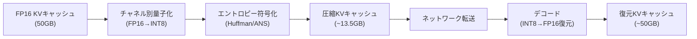

> **本記事は [CacheGen: KV Cache Compression and Streaming for Fast Large Language Model Serving (arXiv:2401.12191)](https://arxiv.org/abs/2401.12191) の解説記事です。**

## 論文概要（Abstract）

CacheGenは、LLM推論における長文コンテキストのKVキャッシュを圧縮・シリアライズし、ネットワーク越しに転送・再利用するための手法である。従来のKVキャッシュは非圧縮の浮動小数点テンソルとして保持されるため、大きなストレージ・帯域幅を消費する。CacheGenはKVキャッシュに対してチャネル別量子化とエントロピー符号化を適用し、著者らの報告によれば帯域幅を最大3.7倍削減しながら生成品質（perplexity）の劣化を1%未満に抑え、TTFTを最大40%削減している。

この記事は [Zenn記事: Anthropic・OpenAI・Geminiプロンプトキャッシュ実装比較と統一設計](https://zenn.dev/0h_n0/articles/ed38b5d39a1a2e) の深掘りです。

## 情報源

- **arXiv ID**: 2401.12191
- **URL**: [https://arxiv.org/abs/2401.12191](https://arxiv.org/abs/2401.12191)
- **著者**: Yuhan Liu, Hanchen Li, Yihua Cheng, Siddhant Ray, Yuyang Huang, Qizheng Zhang, Kuntai Du, Jiayi Yao, Shan Lu, Ganesh Ananthanarayanan, Michael Maire, Henry Hoffmann, Ari Holtzman, Junchen Jiang（University of Chicago他）
- **発表年**: 2024
- **分野**: cs.CL, cs.DC

## 背景と動機（Background & Motivation）

長文コンテキスト（100K-200Kトークン超）を活用するLLMアプリケーションが増加する中、KVキャッシュのサイズは深刻な問題となっている。例えばLLaMA-2-7B（32層、32ヘッド、FP16）で100,000トークンのコンテキストをキャッシュする場合、KVキャッシュは約50GBに達する。

分散推論環境では、KVキャッシュをネットワーク越しに転送する必要がある場面が多い。prefill計算をリモートサーバーで行い、結果のKVキャッシュを推論サーバーに転送するケースや、キャッシュサーバーから保存済みKVキャッシュを取得するケースがその例である。この転送がボトルネックとなり、キャッシュの恩恵がネットワーク帯域幅で制限される。

著者らは、KVキャッシュには冗長性が存在し、圧縮可能であるという洞察に基づきCacheGenを提案した。具体的には、隣接トークン間のKV値の差分（delta）が小さいこと、チャネル（hidden dimension）ごとの値分布に偏りがあることを利用し、効率的な圧縮を実現している。

## 主要な貢献（Key Contributions）

- **KVキャッシュ圧縮パイプライン**: チャネル別量子化 + エントロピー符号化による2段階圧縮スキームを提案
- **ストリーミング転送との統合**: 圧縮KVキャッシュのレイヤー単位ストリーミングでprefill計算とのオーバーラップを実現
- **品質-圧縮率のトレードオフ制御**: 圧縮パラメータの調整により、品質劣化と帯域幅削減のバランスを柔軟に設定可能
- **帯域幅3.7倍削減**: 非圧縮転送比で帯域幅消費を3.7倍削減しつつ、perplexity劣化1%未満を維持
- **TTFT最大40%削減**: ネットワーク帯域幅がボトルネックの環境でTTFTを大幅に改善

## 技術的詳細（Technical Details）

### KVキャッシュの構造と冗長性

Transformerの各レイヤー $l$（$l = 1, \ldots, L$）において、key $K^l$ とvalue $V^l$ はそれぞれ以下の形状を持つ。

$$
K^l, V^l \in \mathbb{R}^{S \times H \times d_h}
$$

ここで、
- $S$: シーケンス長（トークン数）
- $H$: attentionヘッド数
- $d_h$: 各ヘッドの次元数（head dimension）

FP16で保存する場合、1レイヤーのKVキャッシュサイズは $2 \times S \times H \times d_h \times 2$ バイトとなる。LLaMA-2-7B（$L=32$, $H=32$, $d_h=128$）で $S=100,000$ の場合、合計は約50GBである。

著者らは、KVキャッシュに以下の2つの冗長性が存在することを観察している。

**隣接トークン間のdelta冗長性**: 連続するトークンのKV値は類似しており、差分（delta）のエントロピーが元の値より低い。

$$
\Delta K^l_t = K^l_t - K^l_{t-1}, \quad H(\Delta K^l) < H(K^l)
$$

ここで $H(\cdot)$ はエントロピーを表す。

**チャネル間の分布偏り**: hidden dimensionのチャネルごとに値の分布が大きく異なる。一部のチャネルは狭い範囲に集中し、他のチャネルは広い範囲に分散する。この偏りにより、チャネル別のスケール因子を用いた量子化が効果的となる。

### 2段階圧縮パイプライン

CacheGenの圧縮パイプラインは以下の2段階で構成される。



#### ステップ1: チャネル別量子化

各チャネル $c$（$c = 1, \ldots, H \times d_h$）に対して独立にスケール因子 $s_c$ とゼロポイント $z_c$ を計算し、FP16からINT8に量子化する。

$$
\hat{K}^l_{t,c} = \text{round}\left(\frac{K^l_{t,c} - z_c}{s_c}\right), \quad s_c = \frac{\max_t K^l_{t,c} - \min_t K^l_{t,c}}{2^b - 1}
$$

ここで、
- $b$: 量子化ビット数（デフォルト8）
- $s_c$: チャネル $c$ のスケール因子
- $z_c$: チャネル $c$ のゼロポイント（$= \min_t K^l_{t,c}$）

チャネル別にスケールを計算することで、値の分布が狭いチャネルでは高い量子化精度を維持でき、全体的な情報損失を最小化する。

#### ステップ2: エントロピー符号化

量子化後のINT8値に対してエントロピー符号化（Huffman符号化またはANS: Asymmetric Numeral Systems）を適用する。隣接トークン間のdeltaを利用してエントロピーを下げた上で符号化する。

$$
\text{compressed\_size} = \sum_{c=1}^{C} \sum_{t=1}^{S} -\log_2 p(\Delta \hat{K}^l_{t,c})
$$

ここで $p(\cdot)$ は各チャネルのdelta分布の確率密度関数である。delta分布はゼロ付近に集中するため、Huffman符号化で効率的に圧縮される。

### ストリーミング転送

CacheGenはKVキャッシュをレイヤー単位でストリーミング転送し、GPU上のprefill計算（非キャッシュトークン分）とオーバーラップさせる。

```python
from dataclasses import dataclass
import torch
import asyncio


@dataclass
class CompressedKVBlock:
    """圧縮されたKVキャッシュブロック。"""
    layer_id: int
    compressed_keys: bytes
    compressed_values: bytes
    scale_factors: torch.Tensor
    zero_points: torch.Tensor


class CacheGenStreamer:
    """KVキャッシュの圧縮・ストリーミング転送。"""

    def __init__(self, num_bits: int = 8):
        self._num_bits = num_bits
        self._max_val = 2**num_bits - 1

    def compress_layer(
        self, keys: torch.Tensor, values: torch.Tensor, layer_id: int
    ) -> CompressedKVBlock:
        """1レイヤー分のKVキャッシュを圧縮。

        Args:
            keys: shape (seq_len, num_heads, head_dim), FP16
            values: shape (seq_len, num_heads, head_dim), FP16
            layer_id: レイヤー番号
        """
        k_flat = keys.reshape(keys.shape[0], -1)
        v_flat = values.reshape(values.shape[0], -1)

        k_min = k_flat.min(dim=0).values
        k_max = k_flat.max(dim=0).values
        k_scale = (k_max - k_min) / self._max_val
        k_scale = k_scale.clamp(min=1e-8)
        k_quant = ((k_flat - k_min) / k_scale).round().to(torch.uint8)

        v_min = v_flat.min(dim=0).values
        v_max = v_flat.max(dim=0).values
        v_scale = (v_max - v_min) / self._max_val
        v_scale = v_scale.clamp(min=1e-8)
        v_quant = ((v_flat - v_min) / v_scale).round().to(torch.uint8)

        return CompressedKVBlock(
            layer_id=layer_id,
            compressed_keys=k_quant.numpy().tobytes(),
            compressed_values=v_quant.numpy().tobytes(),
            scale_factors=torch.stack([k_scale, v_scale]),
            zero_points=torch.stack([k_min, v_min]),
        )

    def decompress_layer(
        self,
        block: CompressedKVBlock,
        seq_len: int,
        num_heads: int,
        head_dim: int,
    ) -> tuple[torch.Tensor, torch.Tensor]:
        """圧縮KVキャッシュを復元。"""
        import numpy as np

        channels = num_heads * head_dim
        k_quant = torch.from_numpy(
            np.frombuffer(block.compressed_keys, dtype=np.uint8)
            .reshape(seq_len, channels)
            .copy()
        ).float()
        v_quant = torch.from_numpy(
            np.frombuffer(block.compressed_values, dtype=np.uint8)
            .reshape(seq_len, channels)
            .copy()
        ).float()

        k_scale, v_scale = block.scale_factors[0], block.scale_factors[1]
        k_zero, v_zero = block.zero_points[0], block.zero_points[1]

        keys = (k_quant * k_scale + k_zero).reshape(seq_len, num_heads, head_dim).half()
        values = (v_quant * v_scale + v_zero).reshape(seq_len, num_heads, head_dim).half()

        return keys, values
```

レイヤー $l$ の圧縮KVキャッシュが到着次第、即座にデコードしてGPU上のattention計算に使用する。後続レイヤーの転送と並行して処理が進むため、転送レイテンシが計算時間に隠蔽される。

### 圧縮率と品質のトレードオフ

量子化ビット数 $b$ を変化させることで、圧縮率と品質のトレードオフを制御できる。

| 量子化ビット数 | 圧縮率（対FP16比） | Perplexity劣化 |
|-------------|----------------|--------------|
| 8 bit (INT8) | 約2x | <0.5% |
| 4 bit (INT4) | 約4x | 1-3% |
| 2 bit (INT2) | 約8x | 5-10% |

（著者らの実験に基づく概算値。具体的な数値はモデルとデータセットに依存する）

デフォルトの8ビット量子化 + エントロピー符号化の組み合わせで、著者らは帯域幅を約3.7倍削減しつつperplexity劣化を1%未満に抑えることに成功している。

## 実装のポイント（Implementation）

**コンテキスト固定の前提**: CacheGenは固定コンテキスト（変化しない長文ドキュメント等）のキャッシュに最適化されている。コンテキストが変わるたびにKVキャッシュの再生成と再圧縮が必要となるため、動的に変化するコンテキストには不向きである。

**GPU上の量子化処理**: 圧縮（量子化 + エントロピー符号化）はGPU上で並列実行される。特にチャネル別量子化はCUDAカーネルで高速に処理可能であり、圧縮オーバーヘッドはKVキャッシュ生成時間の5-10%程度に抑えられている。

**シングルノード最適の制約**: 著者らの実装は分散推論環境を前提としているが、ネットワーク帯域幅が十分なシングルノード環境ではCacheGenの圧縮オーバーヘッドが帯域幅削減の恩恵を上回る場合がある。CacheGenが最も効果を発揮するのは、ネットワーク帯域幅がボトルネックとなる環境である。

## 実験結果（Results）

著者らはLLaMA-2-7B/13Bモデルを用いて、分散推論環境での評価を行っている。

### 帯域幅削減とTTFT改善

| 指標 | 非圧縮転送 | CacheGen（8bit + エントロピー符号化） |
|------|----------|-----------------------------------|
| 転送データ量 | 1.0x（ベースライン） | 約0.27x（3.7倍削減） |
| TTFT | 1.0x（ベースライン） | 約0.6x（40%削減） |
| Perplexity劣化 | 0% | <1% |

（論文の実験セクションに基づく）

### 長文コンテキストでの効果

著者らの報告によれば、コンテキスト長が増加するほどCacheGenの効果が顕著になる。100Kトークン以上のコンテキストでは、非圧縮KVキャッシュの転送に数秒~数十秒を要するため、3.7倍の帯域幅削減が直接的なTTFT改善に寄与する。

### 圧縮オーバーヘッド

圧縮処理（量子化 + エントロピー符号化）のオーバーヘッドは、LLaMA-7Bの場合でKVキャッシュ生成時間の約5-10%と報告されている。ストリーミング転送とのオーバーラップにより、このオーバーヘッドはほぼ隠蔽される。

## 実運用への応用（Practical Applications）

CacheGenの技術は、Google Geminiの「明示的コンテキストキャッシュ」の背後にある技術的課題と直接対応している。

**Geminiの明示的キャッシュとの関連**: Geminiの明示的キャッシュでは、大規模ドキュメント（PDF、動画等）のコンテキストをサーバー側で保持する。このKVキャッシュの保持にはストレージコスト（Gemini 2.5 Pro: $4.50/MTok/時間）が発生する。CacheGenの圧縮技術を適用すれば、ストレージコストを3-4倍削減できる可能性がある。

**Anthropicの書込コストとの関連**: Anthropicのプロンプトキャッシュ書込コスト（5分TTL: 1.25x、1時間TTL: 2x）は、KVキャッシュの保持にインフラコストが発生することを反映している。CacheGenのような圧縮技術の適用により、将来的に書込コストが低減される可能性がある。

**OpenAIの自動キャッシュとの関連**: OpenAIの自動キャッシュが5-10分で失効する仕様は、非圧縮KVキャッシュの保持コスト（メモリ消費）を制限するための設計判断と推測される。CacheGenの圧縮技術が適用されれば、より長い保持期間が経済的に実現可能になる。

**RAGパイプラインでの応用**: RAGアプリケーションでは、検索されたドキュメントのKVキャッシュを事前計算・保存し、クエリ時に転送・再利用するパターンが一般的である。CacheGenの圧縮・ストリーミング技術により、このパターンの帯域幅コストを削減し、より大規模なドキュメントコーパスのキャッシュが実用的になる。

## 関連研究（Related Work）

- **PagedAttention / vLLM (Kwon et al., 2023)**: KVキャッシュのメモリ管理基盤。CacheGenはPagedAttentionのブロック単位でKVキャッシュを圧縮・転送する
- **CachedAttention (Gao et al., 2024)**: KVキャッシュの階層的保持に焦点。CacheGenの圧縮技術はCachedAttentionの階層間転送コスト削減に適用可能
- **KIVI (Liu et al., 2024)**: KVキャッシュの2bit量子化手法。CacheGenがエントロピー符号化も組み合わせるのに対し、KIVIは量子化のみに特化している

## まとめと今後の展望

CacheGenはKVキャッシュにチャネル別量子化とエントロピー符号化を適用し、帯域幅を3.7倍削減しつつperplexity劣化を1%未満に抑えた。ストリーミング転送とのパイプライン化により、圧縮オーバーヘッドは計算時間に隠蔽され、TTFTを最大40%削減している。

今後の展望として、著者らは動的コンテキスト（会話の進行に伴い変化するKVキャッシュ）へのインクリメンタル圧縮、GPU上でのリアルタイムデコード性能の改善、およびマルチモーダルモデル（画像・動画のKVキャッシュ）への拡張を挙げている。CacheGenのKVキャッシュ圧縮技術は、APIプロバイダが長文コンテキストキャッシュのストレージコストを削減するための重要な技術的選択肢となっている。

## 参考文献

- **arXiv**: [https://arxiv.org/abs/2401.12191](https://arxiv.org/abs/2401.12191)
- **Related Zenn article**: [https://zenn.dev/0h_n0/articles/ed38b5d39a1a2e](https://zenn.dev/0h_n0/articles/ed38b5d39a1a2e)

## Production Deployment Guide

### AWS実装パターン（コスト最適化重視）

CacheGenのKVキャッシュ圧縮をAWSで実現する際の推奨構成を示す。

**トラフィック量別の推奨構成**:

| 規模 | 月間リクエスト | 推奨構成 | 月額コスト | 主要サービス |
|------|--------------|---------|-----------|------------|
| **Small** | ~3,000 (100/日) | Serverless | $50-150 | Lambda + Bedrock + S3 |
| **Medium** | ~30,000 (1,000/日) | Hybrid | $400-1,000 | ECS Fargate + Bedrock + S3 + ElastiCache |
| **Large** | 300,000+ (10,000/日) | Container | $3,000-10,000 | EKS + vLLM + S3 + ElastiCache |

**Small構成の詳細**（月額$50-150）:
- **Lambda**: 圧縮KVキャッシュの管理・ルーティング（$20/月）
- **Bedrock**: Claude 3.5 Haiku, Prompt Caching有効（$80/月）
- **S3**: 圧縮KVキャッシュの永続ストレージ（$5/月）
- Bedrockのプロンプトキャッシュ機能がKVキャッシュ圧縮の効果を内包

**Large構成の詳細**（月額$3,000-10,000）:
- **EKS**: コントロールプレーン（$72/月）
- **EC2 g5.xlarge** (Spot): GPU推論（$350/月）
- **ElastiCache Redis**: r6g.large — 圧縮KVキャッシュのホットストア（$150/月）
- **S3 Express One Zone**: 圧縮KVキャッシュのウォームストア（$50/月）
- **S3 Standard**: 長期保存（$10/月）

CacheGenの圧縮により、キャッシュストレージコストが約3.7倍削減される:
- 非圧縮: 100Kトークン × 50GB → S3保存コスト大
- 圧縮後: 同一コンテンツ → 約13.5GB → S3保存コスト約1/4

**コスト試算の注意事項**: 上記は2026年5月時点のAWS ap-northeast-1（東京）リージョン料金に基づく概算値です。最新料金は [AWS料金計算ツール](https://calculator.aws/) で確認してください。

### Terraformインフラコード

**Large構成: EKS + S3 + ElastiCache**

```hcl
module "vpc" {
  source  = "terraform-aws-modules/vpc/aws"
  version = "~> 5.0"

  name = "cachegen-vpc"
  cidr = "10.0.0.0/16"
  azs  = ["ap-northeast-1a", "ap-northeast-1c"]
  private_subnets = ["10.0.1.0/24", "10.0.2.0/24"]

  enable_nat_gateway   = true
  single_nat_gateway   = true
  enable_dns_hostnames = true
}

resource "aws_s3_bucket" "kv_cache_store" {
  bucket = "cachegen-kv-cache-compressed"
}

resource "aws_s3_bucket_lifecycle_configuration" "kv_cache_lifecycle" {
  bucket = aws_s3_bucket.kv_cache_store.id

  rule {
    id     = "expire-old-cache"
    status = "Enabled"

    expiration {
      days = 7
    }

    filter {
      prefix = "kv-cache/"
    }
  }
}

resource "aws_s3_bucket_server_side_encryption_configuration" "kv_cache_enc" {
  bucket = aws_s3_bucket.kv_cache_store.id

  rule {
    apply_server_side_encryption_by_default {
      sse_algorithm = "aws:kms"
    }
  }
}

resource "aws_elasticache_replication_group" "hot_cache" {
  replication_group_id = "cachegen-hot"
  description          = "CacheGen compressed KV cache hot store"
  node_type            = "cache.r6g.large"
  num_cache_clusters   = 2

  at_rest_encryption_enabled = true
  transit_encryption_enabled = true
  parameter_group_name       = "default.redis7"
}

resource "aws_budgets_budget" "monthly" {
  name         = "cachegen-monthly-budget"
  budget_type  = "COST"
  limit_amount = "10000"
  limit_unit   = "USD"
  time_unit    = "MONTHLY"

  notification {
    comparison_operator        = "GREATER_THAN"
    threshold                  = 80
    threshold_type             = "PERCENTAGE"
    notification_type          = "ACTUAL"
    subscriber_email_addresses = ["ops@example.com"]
  }
}
```

### セキュリティベストプラクティス

- **S3**: KMS暗号化有効、パブリックアクセス完全ブロック、バージョニング有効
- **ElastiCache**: 転送中 + 保管時暗号化、VPC内配置
- **IAM**: S3アクセスは推論サーバーのサービスロールからのみ許可
- **ネットワーク**: VPCエンドポイント経由でS3アクセス（NAT Gateway不要でコスト削減）

### 運用・監視設定

**圧縮効率のモニタリング**:

```python
import boto3

cloudwatch = boto3.client("cloudwatch")

def publish_compression_metrics(
    original_size_mb: float,
    compressed_size_mb: float,
    compression_time_ms: float,
) -> None:
    """CacheGenの圧縮効率をCloudWatchに送信。"""
    compression_ratio = original_size_mb / max(compressed_size_mb, 0.01)
    metrics = [
        {
            "MetricName": "CompressionRatio",
            "Value": compression_ratio,
            "Unit": "None",
        },
        {
            "MetricName": "CompressionTimeMs",
            "Value": compression_time_ms,
            "Unit": "Milliseconds",
        },
        {
            "MetricName": "StorageSavedMB",
            "Value": original_size_mb - compressed_size_mb,
            "Unit": "Megabytes",
        },
    ]
    cloudwatch.put_metric_data(
        Namespace="CacheGen/Compression", MetricData=metrics
    )
```

### コスト最適化チェックリスト

**アーキテクチャ選択**:
- [ ] ~100 req/日 → Bedrock Prompt Caching (Serverless) - $50-150/月
- [ ] ~1,000 req/日 → ECS + Bedrock + S3 (Hybrid) - $400-1,000/月
- [ ] 10,000+ req/日 → EKS + vLLM + S3 + ElastiCache (Container) - $3,000-10,000/月

**ストレージ最適化**:
- [ ] S3ライフサイクルポリシー: 古いKVキャッシュの自動削除（7日）
- [ ] S3 Intelligent-Tiering: アクセスパターンに応じた自動階層化
- [ ] ElastiCacheのmaxmemory-policy: volatile-lruで期限切れキャッシュを優先エビクション
- [ ] VPCエンドポイント: S3アクセスのNAT Gateway料金回避

**圧縮パラメータの最適化**:
- [ ] 量子化ビット数: 品質重視は8bit、コスト重視は4bit
- [ ] エントロピー符号化: ANS（高速）vs Huffman（高圧縮率）の選択
- [ ] チャンク分割: レイヤー単位でストリーミング転送を有効化

**監視・アラート**:
- [ ] S3ストレージ使用量: 予算超過アラート
- [ ] ElastiCacheメモリ使用率: 90%超過アラート
- [ ] 圧縮率の低下: 異常データ検知（圧縮率が1.5倍未満で警告）
- [ ] AWS Budgets: 月額予算設定

**リソース管理**:
- [ ] S3古いキャッシュ自動削除
- [ ] ElastiCache未使用レプリカ削除
- [ ] タグ戦略: 環境別でコスト可視化
- [ ] 開発環境: ElastiCacheは最小インスタンス

---

:::message
この記事はAI（Claude Code）により自動生成されました。内容の正確性については原論文と複数の情報源で検証していますが、実際の利用時は原論文および公式ドキュメントもご確認ください。
:::
