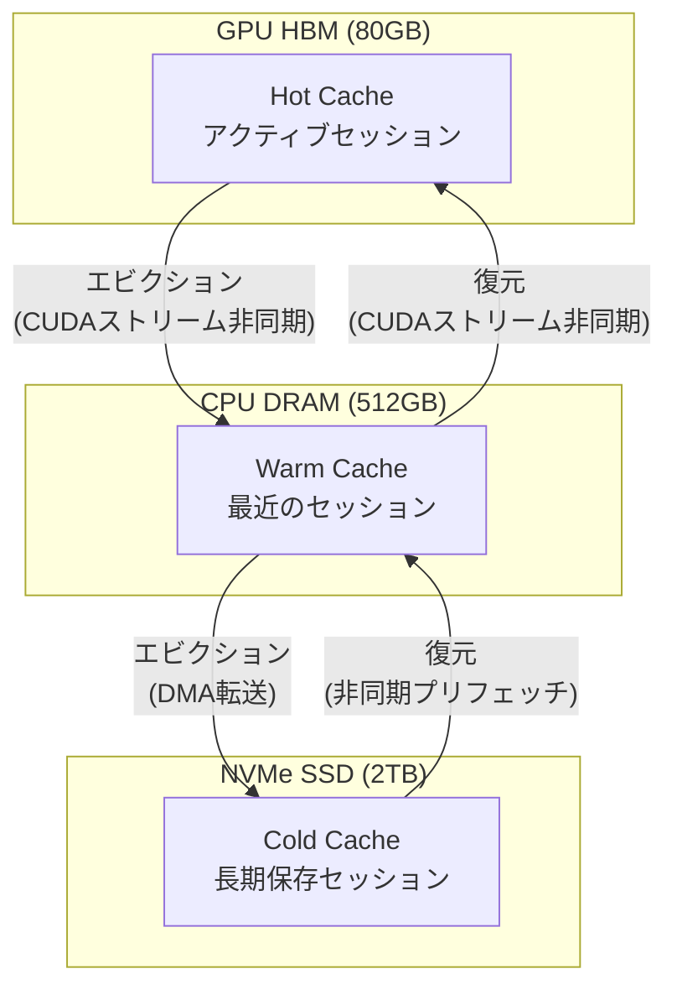

> **本記事は [Cost-Efficient Large Language Model Serving for Multi-turn Conversations with CachedAttention (arXiv:2404.14619)](https://arxiv.org/abs/2404.14619) の解説記事です。**

## 論文概要（Abstract）

CachedAttentionは、マルチターン会話におけるLLM推論コストを削減するため、過去ターンのKVキャッシュをGPU HBM → CPU DRAM → NVMe SSDの3層記憶階層で保持・再利用する手法である。従来のLLM推論サーバーでは、リクエスト完了時にKVキャッシュが破棄されるため、マルチターン会話の各ターンで過去の全トークンのprefill計算が重複して実行されていた。著者らの報告によれば、CachedAttentionはGPU計算コストを最大69%削減し、TTFT（Time to First Token）を最大2.5倍改善している。

この記事は [Zenn記事: Anthropic・OpenAI・Geminiプロンプトキャッシュ実装比較と統一設計](https://zenn.dev/0h_n0/articles/ed38b5d39a1a2e) の深掘りです。

## 情報源

- **arXiv ID**: 2404.14619
- **URL**: [https://arxiv.org/abs/2404.14619](https://arxiv.org/abs/2404.14619)
- **著者**: Bin Gao, Zhuomin He, Puru Sharma, Qingxuan Kang, Djordje Jevdjic, Junbo Deng, Xingkun Yang, Zhou Yu, Pengfei Zuo（Huawei Cloud, Columbia University他）
- **発表年**: 2024
- **分野**: cs.DC, cs.AI, cs.CL

## 背景と動機（Background & Motivation）

マルチターン会話（チャットボット、コーディングアシスタント等）では、各ターンのプロンプトに過去の全会話履歴が含まれる。ターンが進むにつれてプロンプト長は増大し、prefillフェーズの計算コストが急激に増加する。

例えば10ターンの会話で各ターンの平均トークン数が500の場合、10ターン目のprefillには約5,000トークンの処理が必要となる。このうち最初の9ターン分（4,500トークン）は前のターンで既に計算済みのKVキャッシュと同一だが、従来の推論サーバーではリクエスト完了後にKVキャッシュが破棄されるため、毎回ゼロから再計算していた。

著者らの分析によれば、ShareGPTデータセットにおけるマルチターン会話では、平均して各ターンのprefillトークンの約80%が前ターンと共通であり、この冗長な計算がLLM推論コストの主要因となっていた。CachedAttentionはKVキャッシュを記憶階層に保持することで、この問題を根本的に解決する。

## 主要な貢献（Key Contributions）

- **3層KVキャッシュ管理**: GPU HBM → CPU DRAM → NVMe SSDの階層的なKVキャッシュ保持・復元機構を実現
- **非同期転送パイプライン**: CUDAストリームを活用し、KVキャッシュの階層間転送をGPU計算とオーバーラップ
- **TTLベースのエビクション**: 会話セッションのライフサイクルに基づくKVキャッシュの有効期限管理を導入
- **優先度付きキャッシュ管理**: 会話の長さ・アクセス頻度に基づく優先度でエビクション順序を決定
- **GPU計算コスト最大69%削減**: ShareGPTデータセットでの評価で、prefill再計算のスキップによるコスト削減を実証

## 技術的詳細（Technical Details）

### マルチターン会話のprefillコスト問題

マルチターン会話のターン $t$ におけるprefillコストは以下で近似される。

$$
C_{\text{prefill}}(t) = O\left(\left(\sum_{i=1}^{t} n_i\right)^2\right)
$$

ここで、
- $n_i$: ターン $i$ のトークン数
- $\sum_{i=1}^{t} n_i$: ターン $t$ までの累積トークン数

KVキャッシュが保持されている場合、ターン $t$ で新たにprefillが必要なのはターン $t$ の新規トークン $n_t$ のみである。

$$
C_{\text{cached}}(t) = O\left(n_t \cdot \sum_{i=1}^{t} n_i\right)
$$

キャッシュ適用後のコスト削減率は以下のようになる。

$$
\text{Savings}(t) = 1 - \frac{n_t}{\sum_{i=1}^{t} n_i}
$$

10ターン目（各ターン500トークン）の場合、削減率は $1 - 500/5000 = 90\%$ となる。

### 3層記憶階層アーキテクチャ

CachedAttentionの中核は、KVキャッシュを3つの記憶階層で管理するアーキテクチャである。



| 記憶階層 | 容量例 | 帯域幅 | レイテンシ | 用途 |
|---------|-------|--------|----------|------|
| GPU HBM | 80GB | ~2TB/s | ~μs | アクティブ推論中のKVキャッシュ |
| CPU DRAM | 512GB | ~50GB/s | ~100ns | 最近のセッションのKVキャッシュ |
| NVMe SSD | 2TB+ | ~7GB/s | ~10μs | 長期保存セッションのKVキャッシュ |

### 非同期転送パイプライン

KVキャッシュの階層間転送はGPU計算とオーバーラップさせることで、転送レイテンシの影響を最小化している。

```python
import torch
import torch.cuda


class AsyncKVTransfer:
    """KVキャッシュの非同期転送を管理。"""

    def __init__(self):
        self._transfer_stream = torch.cuda.Stream()
        self._compute_stream = torch.cuda.current_stream()

    def gpu_to_cpu_async(
        self, kv_gpu: torch.Tensor, kv_cpu: torch.Tensor
    ) -> torch.cuda.Event:
        """GPUからCPUへの非同期転送。計算とオーバーラップ可能。"""
        with torch.cuda.stream(self._transfer_stream):
            kv_cpu.copy_(kv_gpu, non_blocking=True)
            event = self._transfer_stream.record_event()
        return event

    def cpu_to_gpu_async(
        self, kv_cpu: torch.Tensor, kv_gpu: torch.Tensor
    ) -> torch.cuda.Event:
        """CPUからGPUへの非同期転送。次ターンのprefill前にプリフェッチ。"""
        with torch.cuda.stream(self._transfer_stream):
            kv_gpu.copy_(kv_cpu, non_blocking=True)
            event = self._transfer_stream.record_event()
        return event

    def wait_transfer(self, event: torch.cuda.Event) -> None:
        """転送完了を待機（compute streamで同期）。"""
        self._compute_stream.wait_event(event)
```

著者らの報告によれば、非同期転送によりCPU→GPU間のKVキャッシュ復元レイテンシが計算時間に隠蔽され、実効的なオーバーヘッドはターン間の通常のprefill時間の5-15%程度に抑えられている。

### TTLベースのエビクション戦略

各KVキャッシュエントリにはTTL（Time to Live）が設定され、会話セッションの終了やタイムアウトに応じて自動的にエビクションされる。

$$
\text{priority}(s) = \alpha \cdot \frac{\text{tokens}(s)}{\text{max\_tokens}} + \beta \cdot \frac{\text{turns}(s)}{\text{max\_turns}} + \gamma \cdot \frac{T_{\text{now}} - T_{\text{last\_access}}(s)}{TTL}
$$

ここで、
- $s$: 会話セッション
- $\text{tokens}(s)$: セッション $s$ のKVキャッシュトークン数
- $\text{turns}(s)$: セッション $s$ のターン数
- $T_{\text{last\_access}}(s)$: 最終アクセス時刻
- $\alpha, \beta, \gamma$: 重み係数（$\gamma$ が大きいほどLRU的な振る舞いに近づく）

エビクションはGPU HBM → CPU DRAM → NVMe SSDの順で行われ、最も優先度の低い（直近アクセスが古い＋トークン数が少ない）セッションから順に下位階層に移動する。

### APIプロバイダのTTL設計との対応

CachedAttentionのTTLベースのキャッシュ管理は、現在のAPIプロバイダのTTL設計と直接対応している。

| 特性 | CachedAttention | Anthropic | OpenAI | Gemini |
|------|----------------|-----------|--------|--------|
| TTLデフォルト | セッション依存 | 5分 | 5-10分（自動） | 1時間（明示的） |
| TTL延長 | 階層降格で延長 | 1時間（2x書込コスト） | 24時間（gpt-5.5系） | 任意設定 |
| エビクション | 優先度ベース | LRU的 | 自動管理 | 手動削除可能 |
| 階層管理 | GPU→CPU→SSD | サーバー内 | サーバー内 | ストレージ課金 |

Anthropicの5分/1時間TTLの選択は、CachedAttentionの研究が示す「リクエスト間隔に応じたキャッシュ保持コストと再計算コストのトレードオフ」を商用サービスの料金モデルに反映したものと解釈できる。

## 実装のポイント（Implementation）

**vLLMプラグインとしての実装**: CachedAttentionはvLLMのプラグインとして実装されており、PagedAttentionのブロック管理機構の上に階層的なキャッシュ保持レイヤーを追加している。

**キャッシュ一致性の保証**: モデルのシステムプロンプトが変更された場合、対応するKVキャッシュは無効化される。著者らの実装ではプロンプトのハッシュ値をキャッシュキーとして使用し、内容変更時の自動無効化を実現している。

**メモリプレッシャー対応**: GPU HBMの空き容量が閾値を下回ると、バックグラウンドでCPU DRAMへのエビクションが自動的に開始される。これにより、アクティブな推論処理への影響を最小化している。

## 実験結果（Results）

著者らはLLaMA-2-7B/13B/70Bモデルを用いてA100 80GB GPUで評価を行っている。

### GPU計算コスト削減

| モデルサイズ | データセット | GPU計算コスト削減率 |
|------------|-----------|-----------------|
| LLaMA-2-7B | ShareGPT | 最大69% |
| LLaMA-2-13B | ShareGPT | 最大65% |
| LLaMA-2-70B | ShareGPT | 最大58% |

（論文の実験セクションに基づく。削減率はセッションの平均ターン数とキャッシュヒット率に依存する）

### TTFT改善

著者らの報告によれば、ShareGPTデータセットでのキャッシュヒット率は約80%であり、TTFTは最大2.5倍改善されている。キャッシュヒットした場合、新規ターンのprefillのみが計算されるため、ターン数が多いほど改善効果が大きい。

### 階層間転送のオーバーヘッド

CPU DRAM → GPU HBMのKVキャッシュ復元にはデータ転送のオーバーヘッドが発生する。著者らの分析では以下の値が報告されている。

| 転送経路 | 帯域幅 | 1,000トークンのKVキャッシュ転送時間（LLaMA-7B） |
|---------|------|-----------------------------------------------|
| GPU HBM（キャッシュヒット） | N/A | ~0ms（転送不要） |
| CPU DRAM → GPU HBM | ~25GB/s | ~20ms |
| NVMe SSD → CPU DRAM → GPU HBM | ~5GB/s | ~100ms |

非同期転送パイプラインにより、CPU DRAM → GPU HBMの転送はほぼ完全にGPU計算とオーバーラップ可能であるが、NVMe SSD → GPUの経路ではレイテンシが顕在化する場合がある。

## 実運用への応用（Practical Applications）

CachedAttentionは、APIプロバイダのプロンプトキャッシュ機能が内部的に直面している「リクエスト間のKVキャッシュ保持」問題の学術的解決策である。

**Anthropicのワークスペース分離**: Anthropicが2026年2月に導入したワークスペース単位のキャッシュ分離は、CachedAttentionのセッション管理に相当する。ワークスペースごとにKVキャッシュの名前空間を分離し、マルチテナント環境でのキャッシュ汚染を防止している。

**OpenAIの自動TTL管理**: OpenAIの5-10分の自動TTLは、CachedAttentionの実験結果が示す「大部分のマルチターン会話は5分以内に次のターンが来る」というデータに整合している。

**Geminiのストレージ課金モデル**: Geminiの明示的キャッシュでストレージ時間に課金するモデルは、CachedAttentionの「階層管理にはコストがかかる」という知見を料金設計に反映したものである。CPU DRAM/SSDでのKVキャッシュ保持にはインフラコストが発生し、そのコストをユーザーに転嫁する合理的なモデルとなっている。

## 関連研究（Related Work）

- **PagedAttention / vLLM (Kwon et al., 2023)**: KVキャッシュのメモリ管理基盤。CachedAttentionはPagedAttentionの上に階層的キャッシュ保持レイヤーを追加している
- **SGLang / RadixAttention (Zheng et al., 2024)**: radix treeによるリクエスト間KVキャッシュ共有。CachedAttentionが「同一セッション内の時間的再利用」に焦点を当てるのに対し、RadixAttentionは「異なるセッション間の空間的共有」を重視している
- **Prompt Cache (Gim et al., 2024)**: 位置認識によるKVキャッシュ再利用。CachedAttentionとは異なり、同一セッション外の任意のテキストセグメントも対象とする

## まとめと今後の展望

CachedAttentionは、マルチターン会話のKVキャッシュを3層記憶階層で管理し、GPU計算コストを最大69%削減、TTFTを最大2.5倍改善した。非同期転送パイプラインとTTLベースのエビクションにより、実用的なオーバーヘッドを最小限に抑えている。

著者らが認識している今後の課題として、マルチノード環境へのスケールアウト（現在はシングルノード前提）、KVキャッシュの圧縮によるストレージコスト削減、およびモデル更新時のキャッシュ互換性の確保が挙げられている。CachedAttentionの階層的キャッシュ管理の設計思想は、Anthropic・OpenAI・GeminiのTTLベースのキャッシュ料金モデルの技術的背景を理解する上で重要な参考となる。

## 参考文献

- **arXiv**: [https://arxiv.org/abs/2404.14619](https://arxiv.org/abs/2404.14619)
- **Related Zenn article**: [https://zenn.dev/0h_n0/articles/ed38b5d39a1a2e](https://zenn.dev/0h_n0/articles/ed38b5d39a1a2e)

## Production Deployment Guide

### AWS実装パターン（コスト最適化重視）

CachedAttentionの3層キャッシュ管理をAWSで実現する際の推奨構成を示す。

**トラフィック量別の推奨構成**:

| 規模 | 月間リクエスト | 推奨構成 | 月額コスト | 主要サービス |
|------|--------------|---------|-----------|------------|
| **Small** | ~3,000 (100/日) | Serverless | $50-150 | Lambda + Bedrock + ElastiCache |
| **Medium** | ~30,000 (1,000/日) | Hybrid | $500-1,200 | ECS Fargate + Bedrock + ElastiCache |
| **Large** | 300,000+ (10,000/日) | Container | $3,000-8,000 | EKS + vLLM + NVMe Instance Storage |

**Small構成の詳細**（月額$50-150）:
- **Lambda**: 会話セッション管理（$20/月）
- **Bedrock**: Claude 3.5 Haiku, Prompt Caching有効（$80/月）
- **ElastiCache Redis**: cache.t3.micro, 会話履歴のKVメタデータ管理（$15/月）
- Bedrockのプロンプトキャッシュ機能がCachedAttentionの役割を代替

**Large構成の詳細**（月額$3,000-8,000）:
- **EKS**: コントロールプレーン（$72/月）
- **EC2 i3.xlarge** (Spot): NVMe SSD 950GB内蔵 — KVキャッシュのcold storage（$300/月）
- **EC2 g5.xlarge** (Spot): GPU推論 + HBMキャッシュ（$350/月）
- **ElastiCache Redis**: r6g.large — CPU DRAMキャッシュ層の代替（$150/月）

CachedAttentionの3層構成をAWSサービスで近似する場合:
- GPU HBM → g5インスタンスのA10G VRAM
- CPU DRAM → ElastiCache Redisクラスタ
- NVMe SSD → i3インスタンスのNVMe Instance Storage

**コスト試算の注意事項**: 上記は2026年5月時点のAWS ap-northeast-1（東京）リージョン料金に基づく概算値です。最新料金は [AWS料金計算ツール](https://calculator.aws/) で確認してください。

### Terraformインフラコード

**Large構成: EKS + vLLM + NVMe Storage**

```hcl
module "vpc" {
  source  = "terraform-aws-modules/vpc/aws"
  version = "~> 5.0"

  name = "cached-attn-vpc"
  cidr = "10.0.0.0/16"
  azs  = ["ap-northeast-1a", "ap-northeast-1c"]
  private_subnets = ["10.0.1.0/24", "10.0.2.0/24"]

  enable_nat_gateway   = true
  single_nat_gateway   = true
  enable_dns_hostnames = true
}

module "eks" {
  source  = "terraform-aws-modules/eks/aws"
  version = "~> 20.0"

  cluster_name    = "cached-attention-cluster"
  cluster_version = "1.31"
  vpc_id          = module.vpc.vpc_id
  subnet_ids      = module.vpc.private_subnets

  cluster_endpoint_public_access = true
  enable_cluster_creator_admin_permissions = true
}

resource "aws_elasticache_replication_group" "kv_cache" {
  replication_group_id = "cached-attn-kv"
  description          = "CachedAttention warm cache layer (CPU DRAM equivalent)"
  node_type            = "cache.r6g.large"
  num_cache_clusters   = 2

  at_rest_encryption_enabled = true
  transit_encryption_enabled = true

  parameter_group_name = "default.redis7"
}

resource "aws_budgets_budget" "monthly" {
  name         = "cached-attn-budget"
  budget_type  = "COST"
  limit_amount = "8000"
  limit_unit   = "USD"
  time_unit    = "MONTHLY"

  notification {
    comparison_operator        = "GREATER_THAN"
    threshold                  = 80
    threshold_type             = "PERCENTAGE"
    notification_type          = "ACTUAL"
    subscriber_email_addresses = ["ops@example.com"]
  }
}
```

### セキュリティベストプラクティス

- **ElastiCache**: VPC内配置、転送中暗号化（TLS）+ 保管時暗号化（KMS）有効
- **IAM**: 最小権限の原則。ElastiCacheアクセスはサービスロール経由のみ
- **ネットワーク**: セキュリティグループでElastiCacheへのアクセスをEKSポッドからのみ許可
- **監査**: CloudTrail + Config有効化

### 運用・監視設定

**キャッシュ階層モニタリング**:

```python
import boto3

cloudwatch = boto3.client("cloudwatch")

def publish_cache_tier_metrics(
    gpu_cache_hit_rate: float,
    cpu_cache_hit_rate: float,
    ssd_cache_hit_rate: float,
) -> None:
    """3層キャッシュの各階層ヒット率をCloudWatchに送信。"""
    metrics = [
        {"MetricName": "GPUCacheHitRate", "Value": gpu_cache_hit_rate, "Unit": "Percent"},
        {"MetricName": "CPUCacheHitRate", "Value": cpu_cache_hit_rate, "Unit": "Percent"},
        {"MetricName": "SSDCacheHitRate", "Value": ssd_cache_hit_rate, "Unit": "Percent"},
    ]
    cloudwatch.put_metric_data(
        Namespace="CachedAttention/Tiers", MetricData=metrics
    )
```

### コスト最適化チェックリスト

**アーキテクチャ選択**:
- [ ] ~100 req/日 → Bedrock Prompt Caching (Serverless) - $50-150/月
- [ ] ~1,000 req/日 → ECS + Bedrock + ElastiCache (Hybrid) - $500-1,200/月
- [ ] 10,000+ req/日 → EKS + vLLM + NVMe (Container) - $3,000-8,000/月

**キャッシュ階層の最適化**:
- [ ] GPU HBMキャッシュ: `--gpu-memory-utilization`でKVキャッシュ割り当て比率を調整
- [ ] CPU DRAMキャッシュ: ElastiCacheのmaxmemory-policyをallkeys-lruに設定
- [ ] NVMe SSD: i3インスタンスのInstance Storageを活用（追加コストなし）
- [ ] TTL設定: 会話セッションの平均間隔に基づいてTTLを最適化

**LLMコスト削減**:
- [ ] Bedrock Prompt Caching: 入力トークン最大90%削減
- [ ] マルチターン会話のKVキャッシュ再利用で最大69%のGPU計算コスト削減
- [ ] バッチ処理: Bedrock Batch APIで50%割引
- [ ] モデル選択: 簡易タスクはHaiku、複雑タスクはSonnet

**監視・アラート**:
- [ ] ElastiCacheメモリ使用率: 90%超過でアラート
- [ ] GPU HBMキャッシュ使用率: 95%超過でアラート
- [ ] キャッシュヒット率低下: 各階層のヒット率を監視
- [ ] AWS Budgets: 月額予算設定

**リソース管理**:
- [ ] ElastiCache: 未使用レプリカの削除
- [ ] NVMe: 古いKVキャッシュの定期パージ（TTL超過分）
- [ ] タグ戦略: 環境別でコスト可視化
- [ ] 開発環境: ElastiCacheは最小インスタンスタイプ

---

:::message
この記事はAI（Claude Code）により自動生成されました。内容の正確性については原論文と複数の情報源で検証していますが、実際の利用時は原論文および公式ドキュメントもご確認ください。
:::
