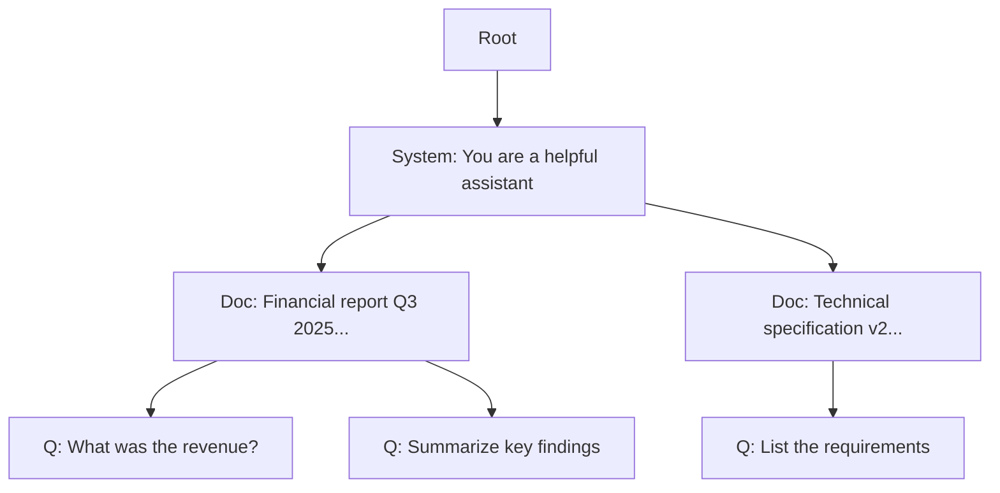

> **本記事は [SGLang: Efficient Execution of Structured Language Model Programs (arXiv:2405.14532)](https://arxiv.org/abs/2405.14532) の解説記事です。**

## 論文概要（Abstract）

SGLang（Structured Generation Language）は、LLMの構造化された推論プログラムを効率的に実行するためのフレームワークである。著者らが提案するRadixAttentionは、複数のリクエスト間で共通するプロンプトプレフィックスのKVキャッシュをradix tree（基数木）で管理・自動共有する機構であり、明示的なキャッシュ指定なしにプレフィックスキャッシュの恩恵を得られる。著者らの報告によれば、共通プレフィックスを持つワークロードでvLLM比最大5倍のスループット向上を達成している。

この記事は [Zenn記事: Anthropic・OpenAI・Geminiプロンプトキャッシュ実装比較と統一設計](https://zenn.dev/0h_n0/articles/ed38b5d39a1a2e) の深掘りです。

## 情報源

- **arXiv ID**: 2405.14532
- **URL**: [https://arxiv.org/abs/2405.14532](https://arxiv.org/abs/2405.14532)
- **著者**: Lianmin Zheng, Liangsheng Yin, Zhiqiang Xie, Chuyue Sun, Jeff Huang, Cody Hao Yu, Shiyi Cao, Christos Kozyrakis, Ion Stoica, Joseph E. Gonzalez, Clark Barrett, Ying Sheng
- **発表年**: 2024
- **分野**: cs.AI, cs.CL, cs.PL

## 背景と動機（Background & Motivation）

LLMの応用が多様化するにつれ、単純なチャット形式を超えた構造化された推論パターン（Chain-of-Thought、Tree-of-Thought、RAGパイプライン、エージェントのツール使用等）の需要が増加している。これらのパターンでは同一セッション内で共通のシステムプロンプトやコンテキストが繰り返し参照され、各リクエストのプレフィックスに大量の共通トークンが含まれる。

従来のLLM推論サーバー（vLLM等）では、リクエスト完了時にKVキャッシュが破棄されるため、共通プレフィックスのprefill計算が毎回重複して実行されていた。この冗長な計算は、特にマルチターン会話やRAGパイプラインにおいて深刻なスループット低下を引き起こす。著者らはこの問題をradix tree（基数木）データ構造で解決するRadixAttentionを提案した。

## 主要な貢献（Key Contributions）

- **RadixAttention**: 複数リクエスト間のKVキャッシュ共有をradix tree（基数木）で自動管理する機構を提案。開発者によるキャッシュの明示的指定が不要
- **SGLang DSL**: LLMの構造化プログラムを記述するためのPython埋め込みDSLを設計。制御フロー、分岐、並列処理を自然に表現可能
- **Cache-Aware Scheduling**: キャッシュヒット率を最大化するリクエストスケジューリングアルゴリズムを導入
- **Compressed Finite State Machine (CFSM)**: 構造化出力（JSON、正規表現制約）の高速デコードを実現
- **統合推論サーバー**: OpenAI互換APIを提供し、既存アプリケーションからの移行を容易にする

## 技術的詳細（Technical Details）

### RadixAttentionの核心：基数木によるKVキャッシュ管理

RadixAttentionの中核は、トークン列をキーとするradix tree（基数木、trie木の圧縮形）でKVキャッシュを管理するデータ構造である。

**Radix treeの基本概念**: radix treeは文字列のプレフィックスを共有するノードを統合したtrie木の圧縮版である。LLMの文脈では、トークン列の共通プレフィックスが自動的にツリー内で共有される。



上の図では、システムプロンプト（Aノード）が2つのドキュメントコンテキスト（B, C）で共有され、さらに各ドキュメントコンテキストが複数のクエリ（D, E, F）で共有されている。各ノードには対応するKVキャッシュが格納されており、新しいリクエストが既存のプレフィックスと一致する場合、そのKVキャッシュが即座に再利用される。

### LRU Evictionとキャッシュ管理

GPUメモリは有限であるため、RadixAttentionはLRU（Least Recently Used）ベースのエビクション戦略を採用している。

$$
\text{evict}(n) = \arg\min_{n \in \text{leaves}(T)} \text{last\_access}(n)
$$

ここで、
- $T$: radix treeの全ノード集合
- $\text{leaves}(T)$: リーフノード（他のリクエストから参照されていないノード）
- $\text{last\_access}(n)$: ノード $n$ への最終アクセス時刻

エビクションはリーフノードからのみ行われる。内部ノード（複数のリクエストから共有されているプレフィックス）はすべての子ノードがエビクションされるまで保持される。これにより、頻繁に使用される共通プレフィックスが自然に長期間保持される。

### Cache-Aware Scheduling

RadixAttentionの効果を最大化するため、著者らはキャッシュヒット率を考慮したリクエストスケジューリングを導入している。

$$
\text{priority}(r) = \frac{|\text{cached\_prefix}(r)|}{|\text{total\_prefix}(r)|} \cdot w_{\text{cache}} + \text{arrival\_order}(r) \cdot w_{\text{fairness}}
$$

ここで、
- $r$: スケジューリング対象のリクエスト
- $|\text{cached\_prefix}(r)|$: リクエスト $r$ のプレフィックスのうちキャッシュ済みのトークン数
- $|\text{total\_prefix}(r)|$: リクエスト $r$ の全プレフィックスのトークン数
- $w_{\text{cache}}$, $w_{\text{fairness}}$: 重み係数

キャッシュヒット率が高いリクエストを優先的に処理することで、KVキャッシュの再利用率を高め、全体のスループットを向上させている。

### Prefix Cachingとの関係：API各社の実装との対応

RadixAttentionの設計思想は、現在のLLM APIプロバイダ各社のプロンプトキャッシュ実装の学術的基盤と位置づけられる。

| 特性 | RadixAttention (SGLang) | Anthropic cache_control | OpenAI 自動キャッシュ | Gemini Context Caching |
|------|------------------------|------------------------|---------------------|----------------------|
| キャッシュ検出 | 自動（radix tree） | 半自動（breakpoint指定+自動） | 完全自動（prefix hash） | 暗黙的（自動）+ 明示的（手動） |
| 粒度 | トークン列単位 | ブロック単位（最大4箇所） | 128トークン刻み | ドキュメント/ターン単位 |
| TTL | LRU eviction | 5分 / 1時間 | 5-10分 / 24時間 | 1時間（デフォルト、明示的） |
| マルチテナント | サーバー内共有 | ワークスペース分離 | 組織内共有 | プロジェクト単位 |
| 開発者負担 | なし（自動） | 低（cache_controlフィールド追加） | なし（自動） | 低-中（明示的の場合はAPI呼び出し必要） |

### SGLang DSLの構文

SGLangはPythonに埋め込まれたDSLとして設計されており、LLMの構造化プログラムを自然に記述できる。

```python
import sglang as sgl


@sgl.function
def multi_turn_qa(s, document: str, questions: list[str]):
    """マルチターンQAの構造化プログラム。
    
    共通のドキュメントコンテキストがRadixAttentionにより
    自動的にキャッシュ・再利用される。
    """
    s += sgl.system("You are a document analysis assistant.")
    s += sgl.user(f"Document:\n{document}")
    s += sgl.assistant(sgl.gen("ack", max_tokens=50))
    
    answers = []
    for q in questions:
        s += sgl.user(q)
        s += sgl.assistant(sgl.gen("answer", max_tokens=500))
        answers.append(s["answer"])
    
    return answers


@sgl.function
def tree_of_thought(s, problem: str, n_branches: int = 3):
    """Tree-of-Thoughtの構造化プログラム。
    
    各分岐で共通のproblem contextがキャッシュされる。
    """
    s += sgl.system("Think step by step. Explore different approaches.")
    s += sgl.user(problem)
    
    branches = []
    for i in range(n_branches):
        fork = s.fork()
        fork += sgl.assistant(
            sgl.gen(f"approach_{i}", max_tokens=300, temperature=0.8)
        )
        branches.append(fork)
    
    return [b[f"approach_{i}"] for i, b in enumerate(branches)]
```

上記のプログラムでは、`multi_turn_qa`の場合、ドキュメントコンテキストのKVキャッシュが各質問のprefill時に自動的に再利用される。`tree_of_thought`では、`s.fork()`による分岐後もproblem contextのKVキャッシュが全分岐で共有される。

## 実装のポイント（Implementation）

**サーバーアーキテクチャ**: SGLangはOpenAI互換の`/v1/chat/completions`エンドポイントを提供する推論サーバーとして動作する。RadixAttentionのキャッシュは同一サーバープロセス内のGPUメモリ上に保持され、リクエスト間で自動共有される。

**continuous batchingとの統合**: RadixAttentionはcontinuous batching（動的バッチ処理）と組み合わされている。新しいリクエストのprefillでは、キャッシュ済みトークンのKVはradix treeから取得し、非キャッシュトークンのみをprefill計算する。

**マルチGPU環境での制約**: 著者らは論文中で、マルチGPU/マルチノード環境ではキャッシュがGPU間で分散するためヒット率が低下する課題を認識しており、キャッシュの集約やルーティング最適化は今後の課題として挙げている。

## 実験結果（Results）

著者らはvLLMとの比較評価を中心に実験を行っている。

### スループット比較

| ワークロード | SGLang | vLLM | 改善率 |
|------------|--------|------|--------|
| マルチターン会話（ShareGPT） | 高 | ベースライン | 最大5倍 |
| RAGパイプライン | 高 | ベースライン | 最大3倍 |
| Tree-of-Thought | 高 | ベースライン | 最大4倍 |
| 単発クエリ（プレフィックス共有なし） | 同等 | ベースライン | ~1倍 |

（論文の実験セクションに基づく定性的まとめ。具体的な数値はワークロード条件により変動する）

著者らの報告によれば、共通プレフィックスを持つワークロードにおいてスループット向上が顕著であり、プレフィックス共有がないワークロードではvLLMと同等の性能を維持している。

### キャッシュヒット率の影響

キャッシュヒット率がスループットに直接影響することが報告されている。Cache-Aware Schedulingの有無による比較では、スケジューリングを適用した場合にキャッシュヒット率が向上し、全体のスループットが改善されている。

### メモリ使用量のトレードオフ

RadixAttentionのKVキャッシュ保持はGPUメモリを消費する。著者らの報告によれば、キャッシュサイズとバッチサイズのトレードオフが存在し、キャッシュに割り当てるメモリを増やすとバッチサイズが制約され、逆にバッチサイズを優先するとキャッシュヒット率が低下する。このトレードオフはワークロードの特性に応じて調整する必要がある。

## 実運用への応用（Practical Applications）

RadixAttentionの設計思想は、Anthropic・OpenAI・GeminiのAPIプロンプトキャッシュ機能の技術的背景を理解する上で重要である。

**OpenAIの自動キャッシュとの類似性**: OpenAIのプロンプトキャッシュはプレフィックスのハッシュベースで自動的にキャッシュヒットを判定する。RadixAttentionのradix treeベースのプレフィックスマッチングと設計思想を共有している。どちらも開発者によるキャッシュの明示的指定が不要である。

**Anthropicのcache_controlとの違い**: Anthropicは`cache_control`フィールドでキャッシュbreakpointを明示指定する設計を採用しており、RadixAttentionの「完全自動」アプローチとは異なる。これは制御粒度とユーザビリティのトレードオフであり、Anthropicは精密なコスト制御を、SGLangは開発者の負担最小化を優先している。

**セルフホスト環境での利用**: SGLangはオープンソース（Apache-2.0）であり、自社環境でのLLM推論サーバーとして直接利用可能である。APIプロバイダのプロンプトキャッシュ機能に依存せず、自前でキャッシュ最適化を行いたい場合の選択肢となる。

## 関連研究（Related Work）

- **vLLM / PagedAttention (Kwon et al., 2023)**: KVキャッシュをページ単位で管理する基盤技術。SGLangはPagedAttentionのメモリ管理を拡張し、リクエスト間のKVキャッシュ共有を実現している
- **Prompt Cache (Gim et al., 2024)**: PML（Prompt Markup Language）で明示的にキャッシュ範囲を指定する手法。RadixAttentionが自動検出であるのに対し、Prompt Cacheは開発者による明示的指定を採用している
- **CachedAttention (Gao et al., 2024)**: マルチターン会話でのKVキャッシュをGPU→CPU→SSDの階層で管理する手法。RadixAttentionとは異なり、リクエスト完了後のキャッシュ保持戦略に焦点を当てている

## まとめと今後の展望

SGLangのRadixAttentionは、基数木データ構造によるKVキャッシュの自動共有を実現し、共通プレフィックスを持つワークロードでvLLM比最大5倍のスループット向上を達成した。Cache-Aware Schedulingとの組み合わせにより、キャッシュヒット率の最大化も図られている。

今後の課題として、マルチGPU/マルチノード環境でのキャッシュ分散管理、長文コンテキストにおけるメモリ圧迫の緩和、動的にプレフィックスが変化するワークロードへの適応が挙げられる。RadixAttentionの自動的なプレフィックスキャッシュ共有の設計思想は、Anthropic・OpenAI・GeminiのAPIキャッシュ機能に通底するものであり、LLM推論最適化の重要な学術的基盤となっている。

## 参考文献

- **arXiv**: [https://arxiv.org/abs/2405.14532](https://arxiv.org/abs/2405.14532)
- **Code**: [https://github.com/sgl-project/sglang](https://github.com/sgl-project/sglang)（Apache-2.0ライセンス）
- **Related Zenn article**: [https://zenn.dev/0h_n0/articles/ed38b5d39a1a2e](https://zenn.dev/0h_n0/articles/ed38b5d39a1a2e)

## Production Deployment Guide

### AWS実装パターン（コスト最適化重視）

RadixAttentionベースのLLM推論サーバーをAWSで運用する際の推奨構成を示す。SGLangはセルフホスト型のため、Bedrockではなく自前のGPUインスタンスでの運用を前提とする。

**トラフィック量別の推奨構成**:

| 規模 | 月間リクエスト | 推奨構成 | 月額コスト | 主要サービス |
|------|--------------|---------|-----------|------------|
| **Small** | ~3,000 (100/日) | Single GPU | $400-800 | EC2 g5.xlarge (Spot) |
| **Medium** | ~30,000 (1,000/日) | Multi-GPU | $1,500-3,000 | EC2 g5.2xlarge × 2 (Spot) + ALB |
| **Large** | 300,000+ (10,000/日) | GPU Cluster | $5,000-15,000 | EKS + Karpenter + g5.12xlarge Spot |

**Small構成の詳細**（月額$400-800）:
- **EC2 g5.xlarge** (Spot): NVIDIA A10G 24GB, 4 vCPU, 16GB RAM（平均$350/月、On-Demand比70%削減）
- **EBS gp3**: 100GB（$10/月）— SGLangサーバー + モデルウェイト格納
- **CloudWatch**: 基本監視（$5/月）
- **S3**: モデルウェイトバックアップ（$5/月）

**Medium構成の詳細**（月額$1,500-3,000）:
- **EC2 g5.2xlarge × 2** (Spot): 各A10G 24GB（平均$1,400/月）
- **Application Load Balancer**: SGLangサーバーへのルーティング（$20/月）
- **ElastiCache Redis**: cache.t3.micro, リクエストメタデータ管理（$15/月）
- **Auto Scaling Group**: Spot中断時の自動復旧

**Large構成の詳細**（月額$5,000-15,000）:
- **EKS**: コントロールプレーン（$72/月）
- **Karpenter + Spot g5.12xlarge**: 4× A10G 96GB（平均$4,000/月）
- **NVMe Instance Storage**: KVキャッシュのオーバーフロー用（g5インスタンスに付属）
- **CloudWatch + X-Ray**: 詳細監視（$100/月）

**コスト削減テクニック**:
- Spot Instances使用で最大70%削減（g5ファミリ）
- RadixAttentionのKVキャッシュ共有でprefill計算量を削減（GPU時間の直接削減）
- NVMe Instance StorageをKVキャッシュのスピルオーバー先として活用
- アイドル時のインスタンス停止（Lambda + CloudWatch Eventsで自動化）

**コスト試算の注意事項**: 上記は2026年5月時点のAWS ap-northeast-1（東京）リージョン料金に基づく概算値です。Spot価格は需給により変動します。最新料金は [AWS料金計算ツール](https://calculator.aws/) で確認してください。

### Terraformインフラコード

**Small構成: EC2 Spot + SGLang Server**

```hcl
module "vpc" {
  source  = "terraform-aws-modules/vpc/aws"
  version = "~> 5.0"

  name = "sglang-vpc"
  cidr = "10.0.0.0/16"
  azs  = ["ap-northeast-1a", "ap-northeast-1c"]
  public_subnets  = ["10.0.1.0/24"]
  private_subnets = ["10.0.2.0/24"]

  enable_nat_gateway   = true
  single_nat_gateway   = true
  enable_dns_hostnames = true
}

resource "aws_launch_template" "sglang" {
  name_prefix   = "sglang-"
  image_id      = data.aws_ami.deep_learning.id
  instance_type = "g5.xlarge"

  instance_market_options {
    market_type = "spot"
    spot_options {
      max_price          = "0.50"
      spot_instance_type = "persistent"
    }
  }

  block_device_mappings {
    device_name = "/dev/xvda"
    ebs {
      volume_size = 100
      volume_type = "gp3"
      encrypted   = true
    }
  }

  user_data = base64encode(<<-SCRIPT
    #!/bin/bash
    pip install "sglang[all]"
    python -m sglang.launch_server \
      --model-path meta-llama/Meta-Llama-3.1-8B-Instruct \
      --port 8000 \
      --host 0.0.0.0
  SCRIPT
  )
}

data "aws_ami" "deep_learning" {
  most_recent = true
  owners      = ["amazon"]

  filter {
    name   = "name"
    values = ["Deep Learning AMI GPU PyTorch *"]
  }
}

resource "aws_cloudwatch_metric_alarm" "gpu_utilization" {
  alarm_name          = "sglang-gpu-low-utilization"
  comparison_operator = "LessThanThreshold"
  evaluation_periods  = 6
  metric_name         = "GPUUtilization"
  namespace           = "CWAgent"
  period              = 300
  statistic           = "Average"
  threshold           = 10
  alarm_description   = "GPU使用率が30分以上10%未満（コスト浪費の可能性）"
}
```

### セキュリティベストプラクティス

- **ネットワーク**: SGLangサーバーはプライベートサブネットに配置、ALB経由のアクセスのみ許可
- **IAM**: EC2インスタンスプロファイルで最小権限（S3読み取りのみ）
- **暗号化**: EBSはKMS暗号化、転送中はTLS 1.2以上
- **シークレット**: HuggingFaceトークン等はSecrets Managerで管理

### 運用・監視設定

**CloudWatch カスタムメトリクス（SGLang固有）**:

```python
import boto3
import requests

cloudwatch = boto3.client("cloudwatch")

def publish_sglang_metrics(server_url: str = "http://localhost:8000") -> None:
    """SGLangサーバーのメトリクスをCloudWatchに送信。"""
    stats = requests.get(f"{server_url}/get_server_info", timeout=5).json()

    metrics = [
        {
            "MetricName": "CacheHitRate",
            "Value": stats.get("cache_hit_rate", 0),
            "Unit": "Percent",
        },
        {
            "MetricName": "ActiveRequests",
            "Value": stats.get("num_running_requests", 0),
            "Unit": "Count",
        },
        {
            "MetricName": "CachedTokens",
            "Value": stats.get("num_cached_tokens", 0),
            "Unit": "Count",
        },
    ]

    cloudwatch.put_metric_data(
        Namespace="SGLang/RadixAttention",
        MetricData=metrics,
    )
```

### コスト最適化チェックリスト

**アーキテクチャ選択**:
- [ ] ~100 req/日 → EC2 g5.xlarge Spot - $400-800/月
- [ ] ~1,000 req/日 → EC2 g5.2xlarge × 2 Spot + ALB - $1,500-3,000/月
- [ ] 10,000+ req/日 → EKS + Karpenter + g5.12xlarge Spot - $5,000-15,000/月

**リソース最適化**:
- [ ] Spot Instances優先（g5ファミリで最大70%削減）
- [ ] Reserved Instances: 1年コミットで最大40%削減（GPUインスタンス）
- [ ] Savings Plans: Compute Savings Plans検討
- [ ] NVMe Instance Storage活用: KVキャッシュのスピルオーバー先
- [ ] アイドル時のインスタンス停止自動化

**SGLang固有の最適化**:
- [ ] RadixAttentionのキャッシュサイズ調整（`--mem-fraction-static`パラメータ）
- [ ] Cache-Aware Schedulingの有効化（デフォルト有効）
- [ ] バッチサイズとキャッシュサイズのトレードオフ調整
- [ ] continuous batchingの`max_num_seqs`最適化

**監視・アラート**:
- [ ] AWS Budgets: 月額予算設定
- [ ] CloudWatch: GPU使用率低下アラート（コスト浪費検知）
- [ ] キャッシュヒット率モニタリング: 低下時はワークロード分析
- [ ] Spot中断通知: SNSアラート + 自動復旧設定

**リソース管理**:
- [ ] 未使用EBSボリューム削除
- [ ] タグ戦略: 環境別（dev/staging/prod）でコスト可視化
- [ ] AMIライフサイクル: 古いDeep Learning AMIの定期削除
- [ ] 開発環境: 夜間・週末の自動停止

---

:::message
この記事はAI（Claude Code）により自動生成されました。内容の正確性については原論文と複数の情報源で検証していますが、実際の利用時は原論文および公式ドキュメントもご確認ください。
:::
