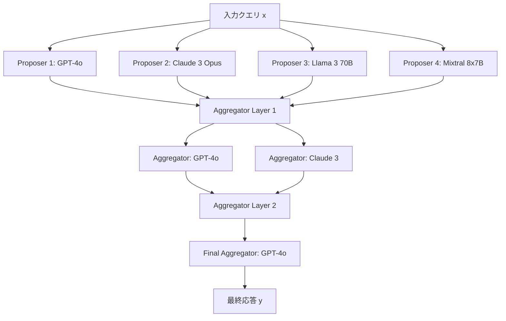

本記事は [Mixture-of-Agents Enhances Large Language Model Capabilities (arXiv:2406.19512)](https://arxiv.org/abs/2406.19512) の解説記事です。

## 論文概要（Abstract）

Mixture-of-Agents（MoA）は、Together AIのJunlin Wang、Jue Wang、Ben Athiwaratkun らが2024年に発表した、複数のLLMを階層的に協調させるフレームワークである。従来のルーティング（1モデル選択）やカスケード（順次試行）とは異なり、MoAは複数のLLMに同時に応答を生成させ、その出力をアグリゲーターLLMが統合して最終回答を生成する。著者らは、このアーキテクチャがAlpacaEval 2.0で65.1%のLC win rate を達成し、当時のGPT-4o（57.5%）を上回ったと報告している。

この記事は [Zenn記事: Portkey条件付きルーティングでマルチモデ��AIゲート���ェイを構築する](https://zenn.dev/0h_n0/articles/13ae3ad36377a5) の深掘りです。

## 情報源

- **arXiv ID**: 2406.19512
- **URL**: https://arxiv.org/abs/2406.19512
- **著者**: Junlin Wang, Jue Wang, Ben Athiwaratkun, et al.
- **発表年**: 2024
- **分野**: cs.CL, cs.AI
- **所属**: Together AI
- **コード**: https://github.com/togethercomputer/MoA

## 背景と動機（Background & Motivation）

単一のLLMには固有の限界がある。例えば、GPT-4は数学推論に優れるがコード生成では特定の問題に弱く、Claude 3は長文理解に強いが特定のベンチマークで劣る、といった特性がある。従来のアプローチ（RouteLLM、FrugalGPT等）は「どの1モデルを選ぶか」という問題を解いていたが、著者らは「複数モデルの出力を組み合わせれば、個々のモデルを超えられるのではないか」という仮説を検証した。

著者らは「Collaborativeness」（協調性）という概念を導入している。LLMが他のLLMの出力を参照したとき、最終回答の品質が向上するかどうかを定量化したものである。実験の結果、ほとんどのLLMは他のLLMの出力を参照すると品質が向上する性質を持つことが確認されたと報告されている。

## 主要な貢献（Key Contributions）

- **貢献1**: 複数LLMの「Collaborativeness」を実験的に発見・定量化し、マルチモデル協調の理論的根拠を提示
- **貢献2**: Proposer（提案者）とAggregator（統合者）の階層構造からなるMoAアーキテクチャの設計と実装
- **貢献3**: AlpacaEval 2.0で当時のGPT-4o（57.5%）を上回る65.1% LC win rateを達成し、OSSモデルの組み合わせが商用モデルを超えうること���実証

## 技術的詳細（Technical Details）

### MoAアーキテクチャ



### 定式化

$L$層のMoAア���キテクチャを以下のように定式化する。

第 $l$ 層（$l = 1, \ldots, L$）に $n_l$ 個のエージェント（LLM）が存在するとする。各エージェントは入力クエリ $x$ と前層の出力を受け取り、応答を生成する：

$$
y_i^{(l)} = M_i^{(l)}\left(x, \{y_j^{(l-1)}\}_{j=1}^{n_{l-1}}\right)
$$

ここで、
- $y_i^{(l)}$: 第 $l$ 層の第 $i$ エージェントの出力
- $M_i^{(l)}$: 第 $l$ 層の第 $i$ モデル
- $\{y_j^{(l-1)}\}$: 前層の全エージェントの出力集合

第1層（Proposer層）は入力クエリのみを受け取る：

$$
y_i^{(1)} = M_i^{(1)}(x)
$$

最終層の出力が最終応答となる：

$$
y_\text{final} = M_\text{agg}^{(L)}\left(x, \{y_j^{(L-1)}\}_{j=1}^{n_{L-1}}\right)
$$

### Collaborativeness（協調性）の定量化

モデル $M_i$ の協調性を以下のように定義する：

$$
\text{Collab}(M_i) = \mathbb{E}_x\left[ q\left(M_i(x, \{y_j\}_{j \neq i})\right) - q\left(M_i(x)\right) \right]
$$

ここで $q(\cdot)$ は品質スコア関数（例: AlpacaEvalのLC win rate）である。$\text{Collab}(M_i) > 0$ であれば、そのモデルは他の出力を参照することで品質が向上する。

著者らの実験では、テストした全モデル（GPT-4o, Claude 3, Llama 3, Mixtral等）でCollaborativenessが正値であったと報告されている。

### Proposer vs Aggregator の役割分離

著者らは、モデルを以下の2役割に分類している：

**Proposer（提案者）**:
- 多様な視点からの初期回答を���成
- 品質よりも多様性が重要
- 安価なモデルでも有効（Llama 3 8B等）

**Aggregator（統合者）**:
- 複数の初期回答を統合し、最適な最終回答を合成
- 統合能力（instruction following）が重要
- 高性能モデ���が必要（GPT-4o, Claude 3 Opus等）

この役割分離により、Proposerに安価モデルを、Aggregatorに高品質モデルを配置するコスト効率的な設計が可能となる。

### アグリゲーションプロンプト

Aggregatorへの入力プロンプトの構造：

```python
AGGREGATION_PROMPT = """You have been provided with a set of responses from
various open-source models to the latest user query. Your task is to synthesize
these responses into a single, high-quality response.

Critically evaluate the information provided in these responses, recognizing
that some of it may be biased or incorrect. Your response should not simply
replicate the given answers but should offer a refined, accurate, and
comprehensive reply to the instruction.

Responses from models:
{responses}

User query: {query}
"""

def aggregate_responses(
    query: str,
    proposer_responses: list[str],
    aggregator_model: str,
) -> str:
    """Proposer出力をAggregatorで統合"""
    formatted_responses = "\n\n".join(
        f"Model {i+1}: {resp}"
        for i, resp in enumerate(proposer_responses)
    )
    prompt = AGGREGATION_PROMPT.format(
        responses=formatted_responses,
        query=query,
    )
    return call_llm(aggregator_model, prompt)
```

### 層数と品質の関係

著者らの実験では、層数 $L$ を増やすほど品質が向上するが、収穫逓減が生じる：

- $L = 1$（Proposerのみ）: ベースライン
- $L = 2$（Proposer + 1 Aggregator層）: 大幅改善
- $L = 3$��Proposer + 2 Aggregator層）: 追加改善は限定的

著者らは $L = 3$ を推奨構成としている。

## 実験結果（Results）

### AlpacaEval 2.0 結果（論文Table 1より）

著者らが報告した主要結果：

| 手法 | LC Win Rate (%) | モデル構成 |
|------|----------------|-----------|
| GPT-4o（単体） | 57.5 | 1モデル |
| Claude 3 Opus（単体） | 40.5 | 1モデル |
| Llama 3 70B（単体） | 34.4 | 1モデル |
| **MoA (Together構成)** | **65.1** | 6モデル × 3層 |
| MoA (OSS only) | 61.2 | OSSモデルのみ |

著者らは、MoAが単一モデルであるGPT-4oを7.6ポイント上回り、OSSモデルのみの構成でも3.7ポイント上回ったと主張している。

### モデル構成別の比較（論文Figure 3より）

| Proposer構成 | Aggregator | LC Win Rate |
|-------------|-----------|-------------|
| GPT-4o × 4 | GPT-4o | 58.2 |
| 多様なモデル × 4 | GPT-4o | 63.4 |
| 多様��モデル × 4 | 多様 × 2層 | 65.1 |

著者らは、Proposerの多様性が品質向上に重要であると報告している。同一モデル4回の応答よりも、異なるモデル4つの応答の方が統合後の品質が高い。

### コスト分析

MoAは品質向上と引き換えにコストが増大する：

| 構成 | 相対コスト | LC Win Rate |
|------|----------|-------------|
| GPT-4o単体 | 1.0× | 57.5% |
| MoA (4 Proposer + 1 Agg) | ~5.0× | 63.4% |
| MoA (3層, 6モデル) | ~10× | 65.1% |

コスト効率の観点では、「品質が最重要」な用途（法律文書、医療診断支援等）に限定して適用するのが現実的である。

## 実装のポイント（Implementation）

### Portkey統合パターン：ロードバランスをProposerとして活用

Portkeyのロードバランス機能をProposer層として、条件付きルーティングをAggregator選択として利用する設計：

```python
from portkey_ai import Portkey
import asyncio

async def moa_with_portkey(
    query: str,
    proposer_configs: list[dict],
    aggregator_model: str,
) -> str:
    """PortkeyのマルチモデルAPIでMoAを実装"""
    # Phase 1: Proposerから並列取得
    proposer_responses = await asyncio.gather(*[
        call_portkey_model(config, query)
        for config in proposer_configs
    ])

    # Phase 2: Aggregatorで統合
    aggregation_prompt = format_aggregation_prompt(query, proposer_responses)
    client = Portkey(api_key=portkey_api_key, config=aggregator_config_id)
    final_response = client.with_options(
        metadata={"task_type": "aggregation", "proposer_count": str(len(proposer_responses))}
    ).chat.completions.create(
        messages=[{"role": "user", "content": aggregation_prompt}]
    )

    return final_response.choices[0].message.content


async def call_portkey_model(config: dict, query: str) -> str:
    """個別Proposerモデルの呼び��し"""
    client = Portkey(api_key=portkey_api_key, config=config["config_id"])
    response = client.chat.completions.create(
        messages=[{"role": "user", "content": query}]
    )
    return response.choices[0].message.content
```

### コスト制御の工夫

MoAの高コストを抑制するためのパターン：

1. **条件付きMoA**: 全リクエストにMoAを適用するのではなく、重要度の高いリクエストのみに適用
2. **Proposerに安価モ��ル**: Llama 3 8B等のOSSモデルをProposerに使い、AggregatorのみGPT-4oを使用
3. **層数の動的制御**: 品質が十分であれば2層で打ち切り

```json
{
  "strategy": {
    "mode": "conditional",
    "conditions": [
      {
        "query": { "metadata.importance": { "$eq": "critical" } },
        "then": "moa-full"
      }
    ],
    "default": "single-model"
  },
  "targets": [
    {
      "name": "moa-full",
      "strategy": { "mode": "loadbalance" },
      "targets": [
        { "provider": "@openai-vk", "weight": 25, "override_params": { "model": "gpt-4o" } },
        { "provider": "@anthropic-vk", "weight": 25, "override_params": { "model": "claude-sonnet-4-6" } },
        { "provider": "@openai-vk", "weight": 25, "override_params": { "model": "gpt-4o-mini" } },
        { "provider": "@anthropic-vk", "weight": 25, "override_params": { "model": "claude-haiku-4-5-20251001" } }
      ]
    },
    {
      "name": "single-model",
      "provider": "@openai-vk",
      "override_params": { "model": "gpt-4o-mini" }
    }
  ]
}
```

### 注意すべき制約

- **レイテンシ**: Proposerの並列呼び出し + Aggregatorの逐次処理で、合計レイテンシは最も遅いProposer + Aggregator処理時間
- **コスト**: 4 Proposer + 1 Aggregatorで最低5回のAPI呼び出し。コスト感度が高い用途には不適
- **品質の天井**: Aggregatorの能力を超える品質は原理的に達成不可能

## Production Deployment Guide

### AWS実装パターン（コスト最適化重視）

**トラフィック量別の推奨構成**:

| 規模 | 月間リクエスト | ���奨構成 | 月額コスト | 主要サービス |
|------|--------------|---------|-----------|------------|
| **Small** | ~1,000 (30/日) | Serverless | $200-500 | Lambda + Bedrock + Step Functions |
| **Medium** | ~10,000 (300/日) | Hybrid | $1,000-3,000 | ECS + Bedrock + SQS |
| **Large** | 100,000+ (3,000/日) | Container | $5,000-15,000 | EKS + マルチプロバイダ |

MoAはコストが高いため、「全リクエスト適用」ではなく「重要リクエストのみ適用」を前提とした設計が必要。

**Small構成 (月額$200-500)**:
- **Step Functions**: Proposer並列呼び出し + Aggregator逐次統合のオーケストレーション ($10/月)
- **Lambda**: 各Proposer呼び出し + Aggregation ($30/月)
- **Bedrock**: 4 Proposer + 1 Aggregator × 30リクエスト/日 ($400/月)

**コスト削減テクニック**:
- 条件付きMoA: 重要度判定（RouteLLMスコア活用）で全体の20%のみMoA適用
- Proposerに安価モデル（Haiku $0.25/MTok）を3/4、高品質モデル（Sonnet $3/MTok）を1/4
- Aggregator結果のキャッシュ（類似クエリパターン再利用）
- 非同期MoA: リアルタイム不要な用途ではBatch APIで50%削減

**コスト試算の注意事項**:
- 上記は2026年5月時点のAWS ap-northeast-1（東京）リージョン料金に基づく概算値です
- MoAのコストはProposer数 × Aggregator層数に比例します
- 最新料金は [AWS料金計算ツール](https://calculator.aws/) で確認してください

### Terraformインフラコード

```hcl
resource "aws_sfn_state_machine" "moa_pipeline" {
  name     = "moa-pipeline"
  role_arn = aws_iam_role.step_functions.arn

  definition = jsonencode({
    StartAt = "ProposerParallel"
    States = {
      ProposerParallel = {
        Type = "Parallel"
        Branches = [
          { StartAt = "Proposer1", States = { Proposer1 = { Type = "Task", Resource = aws_lambda_function.proposer.arn, Parameters = { "model": "haiku", "query.$": "$.query" }, End = true } } },
          { StartAt = "Proposer2", States = { Proposer2 = { Type = "Task", Resource = aws_lambda_function.proposer.arn, Parameters = { "model": "sonnet", "query.$": "$.query" }, End = true } } },
          { StartAt = "Proposer3", States = { Proposer3 = { Type = "Task", Resource = aws_lambda_function.proposer.arn, Parameters = { "model": "gpt-4o-mini", "query.$": "$.query" }, End = true } } },
          { StartAt = "Proposer4", States = { Proposer4 = { Type = "Task", Resource = aws_lambda_function.proposer.arn, Parameters = { "model": "llama3-70b", "query.$": "$.query" }, End = true } } }
        ]
        Next = "Aggregator"
      }
      Aggregator = {
        Type     = "Task"
        Resource = aws_lambda_function.aggregator.arn
        End      = true
      }
    }
  })
}

resource "aws_lambda_function" "proposer" {
  filename      = "proposer.zip"
  function_name = "moa-proposer"
  role          = aws_iam_role.moa_lambda.arn
  handler       = "handler.propose"
  runtime       = "python3.12"
  timeout       = 60
  memory_size   = 512
}

resource "aws_lambda_function" "aggregator" {
  filename      = "aggregator.zip"
  function_name = "moa-aggregator"
  role          = aws_iam_role.moa_lambda.arn
  handler       = "handler.aggregate"
  runtime       = "python3.12"
  timeout       = 120
  memory_size   = 1024
}

resource "aws_cloudwatch_metric_alarm" "moa_cost" {
  alarm_name          = "moa-daily-cost-alert"
  comparison_operator = "GreaterThanThreshold"
  evaluation_periods  = 1
  metric_name         = "MoADailyCost"
  namespace           = "MoA/Cost"
  period              = 86400
  statistic           = "Sum"
  threshold           = 50
  alarm_description   = "MoA日次コスト$50超過"
}
```

### コスト最適化チェックリスト

- [ ] 条件付きMoA: 重要度判定で適用リクエストを20%以下に制限
- [ ] Proposerモデル選定: 安価モデル(Haiku/GPT-4o-mini)を主力に
- [ ] 層数制限: 2層（Proposer + 1 Aggregator）で十分な品質が得られるか検証
- [ ] 非同期処理: リアルタイム不要ならBatch API活用で50%削減
- [ ] キャッシュ: 類似クエリのAggregator結果を再利用
- [ ] Proposer数の動的削減: 品質スコアが十分なら3/4 Proposerで実行

## 実運用への応用（Practical Applications）

MoAは、Portkeyのロードバランス機能（複数モデルへの分散）と条件付きルーティング（重要度による振り分け）を組み合わせることで実現可能である。ただし、純粋なMoAはPortkeyの1リクエスト=1レスポンスの設計とは異なるため、アプリケーション層でのオーケストレーションが必要となる。

最も現実的な適用パターンは「品質が最重要かつレイテンシ制約が緩い」ユースケース（法律文書生成、研究レポート作成等）に限定し、通常のリクエストは単一モデルまたはルーティングで処理する二段構えの設計である。

## 関連研究（Related Work）

- **LLM-Blender** (Jiang et al., 2023): ペアワイズランキング + 生成フュージョンによるマルチモデル統合。MoAと同様の「複数モデル出力の統合」だが、MoAは階層構造で品質を段階的に改善する点が異なる
- **Branch-Solve-Merge** (Saha et al., 2024): 問題を分割し専門モデルに振り分けて統合する手法。MoAの全体アーキテクチャとは異なるが、「分割統治」の設計思想を共有
- **Self-Consistency** (Wang et al., 2023): 単一モデルの複数サンプリング+多数決。MoAは異なるモデルを使う点でより多様性が高い

## まとめと今後の展望

Mixture-of-Agentsは、「複数LLMの出力を統合することで個々のモデルを超える品質を達成できる」ことを実証した研究である。著者らが報告したAlpacaEval 2.0でのGPT-4o超えは、OSSモデルの組み合わせが商用モデル単体を凌駕しうることを示す重要な結果である。

ただし、コストが5-10倍になるトレードオフがあるため、全リクエストへの適用は現実的でない。Portkeyの条件付きルーティングで「重要リクエスト→MoA」「通��リクエスト→単一モデル」と振り分ける設計が実運用では最も合理的である。

## 参考文献

- **arXiv**: https://arxiv.org/abs/2406.19512
- **Code**: https://github.com/togethercomputer/MoA
- **Related Zenn article**: https://zenn.dev/0h_n0/articles/13ae3ad36377a5
