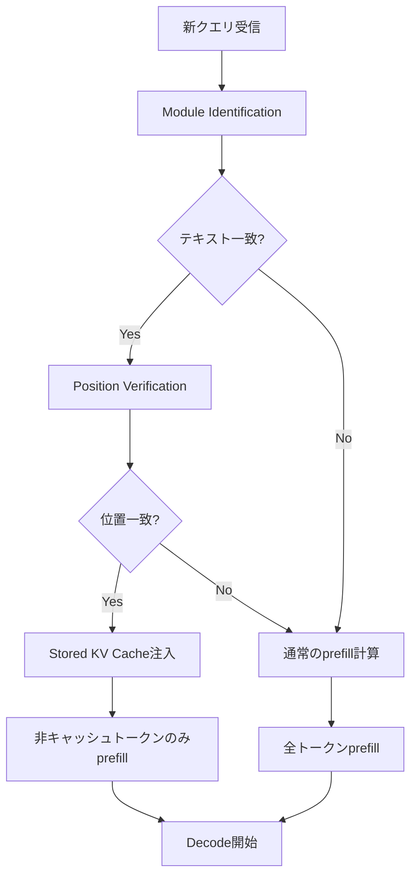

> **本記事は [Prompt Cache: Modular Attention Reuse for Low-Latency Inference (arXiv:2407.00079)](https://arxiv.org/abs/2407.00079) の解説記事です。**

## 論文概要（Abstract）

Prompt Cacheは、LLM推論においてプロンプト間で共有されるテキストセグメント（システムプロンプト、参照ドキュメント等）のattention states（KVキャッシュ）を事前計算・保存し、再利用することでprefillレイテンシを削減する手法である。著者らの核心的な洞察は「attention statesはテキスト内容だけでなくプロンプト内の位置に依存するため、位置が一致する場合にのみ正しく再利用できる」という点にある。Document QAタスクで最大8倍、要約タスクで最大6倍のTTFT（Time to First Token）削減が報告されている。

この記事は [Zenn記事: Anthropic・OpenAI・Geminiプロンプトキャッシュ実装比較と統一設計](https://zenn.dev/0h_n0/articles/ed38b5d39a1a2e) の深掘りです。

## 情報源

- **arXiv ID**: 2407.00079
- **URL**: [https://arxiv.org/abs/2407.00079](https://arxiv.org/abs/2407.00079)
- **著者**: In Gim, Guojun Chen, Seung-seob Lee, Nikhil Sarda, Anurag Khandelwal, Lin Zhong（Yale University）
- **発表年**: 2024
- **分野**: cs.CL, cs.LG

## 背景と動機（Background & Motivation）

LLM推論のレイテンシにおいて、最も大きなボトルネックとなるのがprefillフェーズである。prefillフェーズではプロンプト全体のトークンに対してself-attentionを計算し、KVキャッシュを生成する。この計算量はプロンプト長 $L$ に対して $O(L^2)$ でスケールする。

実際のLLMアプリケーションでは、多くのリクエストが共通のテキストセグメントを含んでいる。チャットボットのシステムプロンプト、RAGにおける参照ドキュメント、コード補完におけるコードベースコンテキストなどがその例である。しかし従来のPrefix Cacheはプロンプト先頭の共通部分しかキャッシュできないという制約があった。著者らはこの制約を解消し、プロンプト内の任意の位置にあるテキストセグメントを再利用可能にするPrompt Cacheを提案した。

## 主要な貢献（Key Contributions）

- **Position-Aware Attention Reuseの定式化**: attention statesの再利用可能条件を「トークン内容AND位置の一致」として厳密に定義し、正しい再利用を保証する設計原則を確立した
- **Prompt Markup Language (PML)の設計**: 開発者が再利用可能セグメントを`<prompt-module>`タグでアノテーションするXMLベースのDSLを導入し、Prompt Cacheの利用を容易にした
- **Prefix Cacheを超える汎用性**: プロンプト先頭だけでなく、途中位置にあるセグメント（例: システムプロンプトの後にあるドキュメント）の再利用を実現した
- **階層的キャッシュ管理**: GPU VRAM → CPU DRAM → NVMe SSDの3層でKVキャッシュを管理し、容量とレイテンシのトレードオフを柔軟に調整可能にした
- **大幅なレイテンシ削減**: Document QAで最大8倍、要約で最大6倍、マルチターン会話で最大3倍のTTFT削減を達成した

## 技術的詳細（Technical Details）

### Prefillレイテンシの問題構造

LLM推論は大きくprefillフェーズ（プロンプト処理）とdecodeフェーズ（トークン逐次生成）に分かれる。prefillフェーズの計算量は、self-attentionの二次複雑性により以下のようにスケールする。

$$
\text{Prefill Cost} = O(L^2 \cdot d)
$$

ここで、
- $L$: プロンプト長（トークン数）
- $d$: モデルの隠れ層次元数

2,000トークンのドキュメントを含むQAプロンプト（合計約2,250トークン）の場合、LLaMA-7B（32層、隠れ層4,096次元）のKVキャッシュは約1.1GBに達すると著者らは報告している。

### Position-Aware Reuseの核心原理

Prompt Cacheの設計を支える核心的な洞察は以下である。

> **あるテキストセグメントのattention statesは、そのセグメントのプロンプト内位置が事前計算時の位置と一致する場合に限り、正しく再利用できる。**

これはLLaMA等のモデルが使用するRotary Positional Embeddings（RoPE）の性質に基づいている。RoPEでは位置情報がattention keysとvaluesに直接埋め込まれるため、同じトークン列であっても異なる位置に配置されると異なるKVキャッシュが生成される。

具体的には、RoPEにおけるquery $q$ とkey $k$ の位置 $m$, $n$ でのattentionスコアは以下で計算される。

$$
a(q_m, k_n) = \text{Re}\left[\sum_{j=0}^{d/2-1} q_j k_j^* e^{i(m-n)\theta_j}\right]
$$

ここで、
- $q_m$: 位置 $m$ のqueryベクトル
- $k_n$: 位置 $n$ のkeyベクトル
- $\theta_j = 10000^{-2j/d}$: 周波数パラメータ
- $d$: ヘッド次元数

この式から、keyの値は位置 $n$ に依存するため、同じトークンでも位置が変われば異なるkey値が生成されることがわかる。Prompt Cacheはこの制約を設計に組み込み、prompt moduleに固定位置を割り当てることで正しい再利用を保証している。

### Prompt Markup Language (PML)

著者らはPrompt Cacheの利用を容易にするため、XMLベースのPrompt Markup Language（PML）を導入している。

```xml
<prompt>
  <prompt-module id="system-prompt" position="0">
    You are a helpful assistant. Answer questions
    based on the provided document.
  </prompt-module>
  <prompt-module id="document" position="200">
    [Document text here - thousands of tokens]
  </prompt-module>
  <query>
    What is the main topic of the document?
  </query>
</prompt>
```

各prompt moduleには固定の位置オフセットが割り当てられ、事前計算時にその位置でKVキャッシュが生成・保存される。新しいクエリでは、以下の手順でキャッシュの再利用が行われる。



### Prefix Cache vs Prompt Cache

従来のPrefix Cacheとの違いを明確にする。

| 特性 | Prefix Cache | Prompt Cache |
|------|-------------|--------------|
| キャッシュ位置 | プロンプト先頭のみ | 任意の位置 |
| 複数セグメント | 不可（連続した先頭部分のみ） | 可（複数のprompt module） |
| 位置管理 | 暗黙的（先頭固定） | 明示的（PMLで指定） |
| ドキュメントQA対応 | △（ドキュメントが先頭にない場合不可） | ○（任意位置のドキュメントをキャッシュ） |
| 開発者の負担 | 低（自動） | 中（PMLアノテーション必要） |

実際のアプリケーションでは、システムプロンプト→ドキュメント→ユーザークエリの順にプロンプトが構成されることが多い。Prefix Cacheではシステムプロンプトしかキャッシュできないが、Prompt Cacheではドキュメント部分もキャッシュ可能である。

### 計算量の削減

Prompt Cache適用後のprefill計算量は以下のように削減される。

$$
\text{Prefill Cost}_{\text{cached}} = O(L_{\text{new}} \cdot L)
$$

ここで、
- $L_{\text{new}}$: 非キャッシュトークン数
- $L$: プロンプト全体の長さ

キャッシュヒット率が高い場合（$L_{\text{new}} \ll L$）、計算量は $O(L^2)$ から大幅に削減される。

### 階層的キャッシュ管理

著者らはKVキャッシュを3層の記憶階層で管理するアーキテクチャを提案している。

| 記憶階層 | レイテンシ | コスト | 容量 |
|---------|----------|------|------|
| GPU HBM (VRAM) | 最低 | 最高 | 限定的（例: 80GB） |
| CPU DRAM | 中 | 中 | 数百GB |
| NVMe SSD | 最高 | 最低 | 数TB |

LLaMA-7B（32層、32ヘッド、ヘッド次元128）の場合、1トークンあたりのKVキャッシュサイズは以下の通りである。

$$
\text{KV Size per token} = 32 \times 2 \times 32 \times 128 \times 2 \text{ bytes} = 524 \text{ KB}
$$

1,000トークンのprompt moduleでは約524MBの保存領域が必要となる。著者らはメモリ帯域幅の最適化として、attention statesをレイヤー単位で遅延ロードし、モデルの計算とメモリ転送をオーバーラップさせる手法を採用している。

## 実装のポイント（Implementation）

Prompt Cacheの実装上の重要なポイントを以下にまとめる。

**位置の固定割り当て**: prompt moduleの位置は事前に決定し、プロンプト構造の変更時には再計算が必要になる。著者らの実装ではLLaMA-2ファミリ（RoPEベース）に対応しており、他のpositional encoding（例: ALiBi）への対応には追加の検証が必要である。

**キャッシュ無効化の管理**: prompt moduleの内容が変更されると、対応するKVキャッシュは無効化される。頻繁に更新されるドキュメントをprompt moduleとして使う場合、キャッシュの恩恵が限定的になるため注意が必要である。

**実装パターン例**:

```python
from dataclasses import dataclass
from typing import Optional
import torch


@dataclass
class PromptModule:
    """再利用可能なプロンプトセグメントの定義。"""
    module_id: str
    text: str
    position_offset: int
    kv_cache: Optional[torch.Tensor] = None

    @property
    def token_count(self) -> int:
        return len(self.text.split())

    def is_cached(self) -> bool:
        return self.kv_cache is not None


class PromptCacheManager:
    """Prompt Cacheのライフサイクル管理。"""

    def __init__(self, max_gpu_cache_mb: int = 4096):
        self._modules: dict[str, PromptModule] = {}
        self._max_gpu_cache_mb = max_gpu_cache_mb
        self._current_gpu_usage_mb = 0.0

    def register_module(
        self, module_id: str, text: str, position_offset: int
    ) -> PromptModule:
        module = PromptModule(
            module_id=module_id,
            text=text,
            position_offset=position_offset,
        )
        self._modules[module_id] = module
        return module

    def precompute(self, module_id: str, model) -> None:
        """指定モジュールのKVキャッシュを事前計算。"""
        module = self._modules[module_id]
        tokens = model.tokenize(module.text)
        kv = model.compute_kv_cache(
            tokens, position_offset=module.position_offset
        )
        module.kv_cache = kv

    def build_prompt(
        self, module_ids: list[str], query: str, model
    ) -> torch.Tensor:
        """キャッシュ済みモジュールを活用してprefillを実行。"""
        cached_kv_list = []
        uncached_tokens = []

        for mid in module_ids:
            module = self._modules[mid]
            if module.is_cached():
                cached_kv_list.append(module.kv_cache)
            else:
                tokens = model.tokenize(module.text)
                uncached_tokens.extend(tokens)

        query_tokens = model.tokenize(query)
        uncached_tokens.extend(query_tokens)

        return model.prefill_with_cache(
            cached_kv=cached_kv_list,
            new_tokens=uncached_tokens,
        )
```

## 実験結果（Results）

著者らはLLaMA-2ファミリを用いてNVIDIA A100 80GBで評価を行っている。主要な結果を以下にまとめる。

### TTFT削減の実測値

| タスク | データセット | TTFT削減倍率 |
|--------|-----------|-------------|
| Document QA | QuALITY | 最大8倍 |
| 要約 | CNN/DailyMail | 最大6倍 |
| マルチターン会話 | MultiWOZ | 最大3倍 |
| コード補完 | 独自コードベース | 最大4倍 |

（論文Section 5, Table/Figureより）

### ドキュメント長とTTFT削減の関係

著者らの実験では、ドキュメント長が増加するほどキャッシュの恩恵が大きくなることが報告されている。

| ドキュメント長 | TTFT削減倍率 |
|-------------|-------------|
| 500 tokens | 約2倍 |
| 1,000 tokens | 約4倍 |
| 2,000 tokens | 約8倍 |

（論文Section 5.3より）

この傾向は直感的に理解できる。ドキュメントが長いほどprefillフェーズの計算量（$O(L^2)$）が大きくなり、キャッシュによる計算スキップの効果が顕著になるためである。

### ストレージコストの分析

100件のドキュメント（各1,000トークン）をLLaMA-7Bでキャッシュするケースのストレージコストは約52GBと報告されている（論文Section 5.8より）。著者らはこれをNVMe SSDで実現可能なレベルとしているが、LLaMA-70Bクラスの大規模モデルではストレージ要件が10倍以上に増加する点に留意が必要である。

## 実運用への応用（Practical Applications）

Prompt Cacheの設計思想は、現在のAnthropicやOpenAI、Google GeminiのAPIプロンプトキャッシュ機能に通じるものがある。

**Anthropicの`cache_control`フィールド**: Prompt CacheのPML（prompt moduleの明示的アノテーション）に相当する設計である。開発者がどの部分をキャッシュするかを明示的に指定できる点が共通している。

**OpenAIの自動キャッシュ**: Prefix Cacheに近い設計で、プロンプト先頭からの共通プレフィックスを自動検出する。Prompt Cacheの「任意位置のキャッシュ」とは異なるアプローチだが、開発者の負担を最小化する設計思想が見られる。

**Geminiの明示的キャッシュ**: キャッシュオブジェクトを手動で作成・管理する方式で、Prompt Cacheの階層的キャッシュ管理と設計思想を共有している。TTLによる有効期限管理もPrompt Cacheのキャッシュ管理と類似する。

本番環境での適用において注意すべき点として、キャッシュの位置制約がある。Prompt Cacheは固定位置を前提とするため、動的にプロンプト構造が変わるアプリケーション（例: ユーザーがシステムプロンプトをカスタマイズする場合）ではキャッシュミスが頻発する。APIプロバイダ各社はこの制約を「プレフィックスの一致」や「自動breakpoint」で緩和している。

## 関連研究（Related Work）

- **PagedAttention / vLLM (Kwon et al., 2023)**: KVキャッシュをページ単位で管理し、メモリ断片化を排除する基盤技術。Prompt CacheはPagedAttentionのメモリ管理の上に構築可能であり、相補的な関係にある。
- **SGLang / RadixAttention (Zheng et al., 2024)**: 共通プレフィックスをradix tree（基数木）で管理し、自動的にKVキャッシュを共有する。Prompt CacheがPMLで明示的にキャッシュ範囲を指定するのに対し、RadixAttentionは自動検出を採用している。
- **CachedAttention (Gao et al., 2024)**: マルチターン会話でのKVキャッシュをGPU→CPU→SSDの3層で管理する手法。Prompt Cacheの階層的キャッシュ管理と設計思想を共有している。

## まとめと今後の展望

Prompt Cacheは「attention statesの位置依存性」という根本的な制約を設計原則に組み込み、プロンプト内の任意位置にあるテキストセグメントのKVキャッシュ再利用を実現した。著者らの報告によれば、Document QAで最大8倍、要約で最大6倍のTTFT削減を達成している。

今後の発展方向として、著者らは以下を挙げている。（1）類似セグメントへの近似的なKVキャッシュ再利用、（2）KVキャッシュの動的圧縮によるストレージ削減、（3）マルチユーザー環境でのクロスリクエストキャッシュ共有。これらは現在のAPIプロバイダ各社が取り組んでいる課題とも重なっており、Prompt Cacheの研究が商用サービスのキャッシュ設計に示唆を与えていると考えられる。

## 参考文献

- **arXiv**: [https://arxiv.org/abs/2407.00079](https://arxiv.org/abs/2407.00079)
- **Related Zenn article**: [https://zenn.dev/0h_n0/articles/ed38b5d39a1a2e](https://zenn.dev/0h_n0/articles/ed38b5d39a1a2e)

## Production Deployment Guide

### AWS実装パターン（コスト最適化重視）

Prompt Cacheの位置認識キャッシュ再利用をAWS上で実現する際の推奨構成を示す。

**トラフィック量別の推奨構成**:

| 規模 | 月間リクエスト | 推奨構成 | 月額コスト | 主要サービス |
|------|--------------|---------|-----------|------------|
| **Small** | ~3,000 (100/日) | Serverless | $50-150 | Lambda + Bedrock + DynamoDB |
| **Medium** | ~30,000 (1,000/日) | Hybrid | $300-800 | Lambda + ECS Fargate + ElastiCache |
| **Large** | 300,000+ (10,000/日) | Container | $2,000-5,000 | EKS + Karpenter + EC2 Spot |

**Small構成の詳細**（月額$50-150）:
- **Lambda**: 1GB RAM, 60秒タイムアウト（$20/月）
- **Bedrock**: Claude 3.5 Haiku, Prompt Caching有効（$80/月）
- **DynamoDB**: On-Demand, KVキャッシュメタデータ管理（$10/月）
- **CloudWatch**: 基本監視（$5/月）
- **API Gateway**: REST API（$5/月）

**Medium構成の詳細**（月額$300-800）:
- **ECS Fargate**: 0.5 vCPU, 1GB RAM × 2タスク（$120/月）
- **Bedrock**: Claude 3.5 Sonnet, Batch API活用（$400/月）
- **ElastiCache Redis**: cache.t3.micro, KVキャッシュのメタデータ保持（$15/月）
- **Application Load Balancer**:（$20/月）

**Large構成の詳細**（月額$2,000-5,000）:
- **EKS**: コントロールプレーン（$72/月）
- **EC2 Spot Instances**: g5.xlarge × 2-4台（平均$800/月）
- **Karpenter**: 自動スケーリング（追加コストなし）
- **Bedrock Batch**: 50%割引活用（$2,000/月）
- **S3**: プロンプトキャッシュストレージ（$20/月）

**コスト削減テクニック**:
- Spot Instances使用で最大90%削減（EKS + Karpenter）
- Bedrock Batch API使用で50%削減
- Prompt Caching有効化で入力トークン30-90%削減
- アイドルタイムのAuto Scaling to Zero（Fargate/Lambda）

**コスト試算の注意事項**: 上記は2026年5月時点のAWS ap-northeast-1（東京）リージョン料金に基づく概算値です。実際のコストはトラフィックパターン、リージョン、バースト使用量により変動します。最新料金は [AWS料金計算ツール](https://calculator.aws/) で確認してください。

### Terraformインフラコード

**Small構成 (Serverless): Lambda + Bedrock + DynamoDB**

```hcl
module "vpc" {
  source  = "terraform-aws-modules/vpc/aws"
  version = "~> 5.0"

  name = "prompt-cache-vpc"
  cidr = "10.0.0.0/16"
  azs  = ["ap-northeast-1a", "ap-northeast-1c"]
  private_subnets = ["10.0.1.0/24", "10.0.2.0/24"]

  enable_nat_gateway   = false
  enable_dns_hostnames = true
}

resource "aws_iam_role" "lambda_bedrock" {
  name = "prompt-cache-lambda-role"

  assume_role_policy = jsonencode({
    Version = "2012-10-17"
    Statement = [{
      Action    = "sts:AssumeRole"
      Effect    = "Allow"
      Principal = { Service = "lambda.amazonaws.com" }
    }]
  })
}

resource "aws_iam_role_policy" "bedrock_invoke" {
  role = aws_iam_role.lambda_bedrock.id
  policy = jsonencode({
    Version = "2012-10-17"
    Statement = [{
      Effect   = "Allow"
      Action   = ["bedrock:InvokeModel", "bedrock:InvokeModelWithResponseStream"]
      Resource = "arn:aws:bedrock:ap-northeast-1::foundation-model/anthropic.claude-3-5-haiku*"
    }]
  })
}

resource "aws_lambda_function" "prompt_cache_handler" {
  filename      = "lambda.zip"
  function_name = "prompt-cache-handler"
  role          = aws_iam_role.lambda_bedrock.arn
  handler       = "index.handler"
  runtime       = "python3.12"
  timeout       = 60
  memory_size   = 1024

  environment {
    variables = {
      BEDROCK_MODEL_ID    = "anthropic.claude-3-5-haiku-20241022-v1:0"
      DYNAMODB_TABLE      = aws_dynamodb_table.cache_meta.name
      ENABLE_PROMPT_CACHE = "true"
    }
  }
}

resource "aws_dynamodb_table" "cache_meta" {
  name         = "prompt-cache-metadata"
  billing_mode = "PAY_PER_REQUEST"
  hash_key     = "module_id"

  attribute {
    name = "module_id"
    type = "S"
  }

  ttl {
    attribute_name = "expire_at"
    enabled        = true
  }
}

resource "aws_cloudwatch_metric_alarm" "lambda_cost" {
  alarm_name          = "prompt-cache-cost-spike"
  comparison_operator = "GreaterThanThreshold"
  evaluation_periods  = 1
  metric_name         = "Duration"
  namespace           = "AWS/Lambda"
  period              = 3600
  statistic           = "Sum"
  threshold           = 100000
  alarm_description   = "Lambda実行時間異常（コスト急増の可能性）"

  dimensions = {
    FunctionName = aws_lambda_function.prompt_cache_handler.function_name
  }
}
```

**Large構成 (Container): EKS + Karpenter + Spot**

```hcl
module "eks" {
  source  = "terraform-aws-modules/eks/aws"
  version = "~> 20.0"

  cluster_name    = "prompt-cache-cluster"
  cluster_version = "1.31"

  vpc_id     = module.vpc.vpc_id
  subnet_ids = module.vpc.private_subnets

  cluster_endpoint_public_access = true
  enable_cluster_creator_admin_permissions = true
}

resource "kubectl_manifest" "karpenter_provisioner" {
  yaml_body = <<-YAML
    apiVersion: karpenter.sh/v1
    kind: NodePool
    metadata:
      name: spot-gpu-pool
    spec:
      template:
        spec:
          requirements:
            - key: karpenter.sh/capacity-type
              operator: In
              values: ["spot"]
            - key: node.kubernetes.io/instance-type
              operator: In
              values: ["g5.xlarge", "g5.2xlarge"]
          limits:
            cpu: "32"
            memory: "128Gi"
      disruption:
        consolidationPolicy: WhenEmptyOrUnderutilized
        consolidateAfter: 30s
  YAML
}

resource "aws_budgets_budget" "monthly" {
  name         = "prompt-cache-monthly-budget"
  budget_type  = "COST"
  limit_amount = "5000"
  limit_unit   = "USD"
  time_unit    = "MONTHLY"

  notification {
    comparison_operator        = "GREATER_THAN"
    threshold                  = 80
    threshold_type             = "PERCENTAGE"
    notification_type          = "ACTUAL"
    subscriber_email_addresses = ["ops@example.com"]
  }
}
```

### セキュリティベストプラクティス

- **IAMロール**: 最小権限の原則（Bedrock InvokeModelのみ許可）
- **ネットワーク**: EKSはVPC内プライベートサブネットに配置。本番環境では`cluster_endpoint_public_access = false`を推奨
- **シークレット管理**: AWS Secrets Manager使用、環境変数へのハードコード禁止
- **暗号化**: S3/DynamoDB/EBSはKMS暗号化、転送中はTLS 1.2以上必須
- **監査**: CloudTrail全リージョン有効化、GuardDuty脅威検知有効化

### 運用・監視設定

**CloudWatch Logs Insights クエリ**:

```sql
fields @timestamp, model_id, input_tokens, output_tokens
| stats sum(input_tokens + output_tokens) as total_tokens by bin(1h)
| filter total_tokens > 100000

fields @timestamp, duration_ms
| stats pct(duration_ms, 95) as p95, pct(duration_ms, 99) as p99 by bin(5m)
```

**CloudWatch アラーム（Python）**:

```python
import boto3

cloudwatch = boto3.client("cloudwatch")

cloudwatch.put_metric_alarm(
    AlarmName="bedrock-token-spike",
    ComparisonOperator="GreaterThanThreshold",
    EvaluationPeriods=1,
    MetricName="TokenUsage",
    Namespace="AWS/Bedrock",
    Period=3600,
    Statistic="Sum",
    Threshold=500000,
    ActionsEnabled=True,
    AlarmActions=["arn:aws:sns:ap-northeast-1:123456789:cost-alerts"],
    AlarmDescription="Bedrockトークン使用量異常",
)
```

### コスト最適化チェックリスト

**アーキテクチャ選択**:
- [ ] ~100 req/日 → Lambda + Bedrock (Serverless) - $50-150/月
- [ ] ~1,000 req/日 → ECS Fargate + Bedrock (Hybrid) - $300-800/月
- [ ] 10,000+ req/日 → EKS + Spot (Container) - $2,000-5,000/月

**リソース最適化**:
- [ ] EC2: Spot Instances優先（最大90%削減、Karpenter自動管理）
- [ ] Reserved Instances: 1年コミットで最大72%削減
- [ ] Savings Plans: Compute Savings Plans検討
- [ ] Lambda: メモリサイズ最適化（CloudWatch Insights分析）
- [ ] ECS/EKS: アイドルタイムのスケールダウン（夜間0台）

**LLMコスト削減**:
- [ ] Bedrock Batch API: 50%割引（非リアルタイム処理）
- [ ] Prompt Caching: 入力トークン30-90%削減
- [ ] モデル選択: 開発はHaiku($0.25/MTok)、本番複雑タスクはSonnet($3/MTok)
- [ ] max_tokens設定: 過剰生成防止

**監視・アラート**:
- [ ] AWS Budgets: 月額予算設定（80%で警告、100%でアラート）
- [ ] CloudWatch: トークン使用量スパイク検知
- [ ] Cost Anomaly Detection: 機械学習ベース自動検知
- [ ] 日次コストレポート: SNS/Slackへ自動送信

**リソース管理**:
- [ ] 未使用リソース削除: Lambda Insights, Trusted Advisor活用
- [ ] タグ戦略: 環境別（dev/staging/prod）、プロジェクト別でコスト可視化
- [ ] ライフサイクルポリシー: S3古いキャッシュ自動削除（30日）
- [ ] 開発環境: 夜間停止（Auto Start/Stop）

---

:::message
この記事はAI（Claude Code）により自動生成されました。内容の正確性については原論文と複数の情報源で検証していますが、実際の利用時は原論文および公式ドキュメントもご確認ください。
:::
