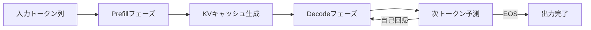
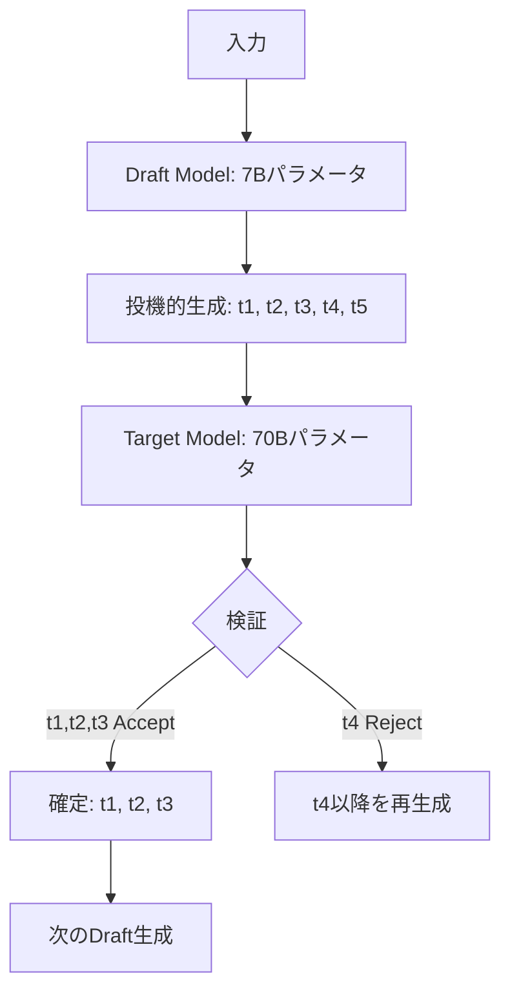

本記事は [Mastering LLM Techniques: Inference Optimization (NVIDIA Developer Blog)](https://developer.nvidia.com/blog/mastering-llm-techniques-inference-optimization/) の解説記事です。

## ブログ概要（Summary）

NVIDIAのShashank VermaとNeal Vaidyaが2023年11月に公開した技術ブログで、LLM推論の高速化・効率化技術を体系的にまとめている。Prefill（入力処理）とDecode（トークン生成）の2フェーズに分解した上で、KVキャッシュ、モデル並列化、Attention最適化（MQA/GQA/FlashAttention）、PagedAttention、量子化、Speculative Inference等の技術を解説している。マルチモデルゲートウェイにおいて「どのモデルをどのように高速化するか」の判断基準として重要な知見を提供する内容である。

この記事は [Zenn記事: Portkey条件付きルーティングでマルチモデルAIゲートウェイを構築する](https://zenn.dev/0h_n0/articles/13ae3ad36377a5) の深掘りです。

## 情報源

- **種別**: 企業テックブログ
- **URL**: https://developer.nvidia.com/blog/mastering-llm-techniques-inference-optimization/
- **組織**: NVIDIA
- **著者**: Shashank Verma, Neal Vaidya
- **発表日**: 2023-11-17（2024-08-15更新）

## 技術的背景（Technical Background）

LLM推論は「メモリバウンド」な処理である。GPT-4クラスのモデルではパラメータ数が数百〜数千億に達し、推論時のメモリ帯域がボトルネックとなる。特にDecode（自己回帰トークン生成）フェーズでは、1トークンあたり全パラメータを参照するため、演算密度（FLOPs/byte）が極めて低い。

マルチモデルゲートウェイ（Portkeyのようなシステム）を設計する際、各モデルの推論特性を理解することは、ルーティング判定の精度向上やSLA設計に直結する。例えば「レイテンシ制約10ms以内」の要件があるとき、どのモデルがその制約を満たせるかは推論最適化の状況に依存する。

## 実装アーキテクチャ（Architecture）

### LLM推論の2フェーズモデル



**Prefillフェーズ（計算バウンド）**:
- 入力トークン全体を並列に処理
- Self-AttentionのQ, K, V行列を一括計算
- GPU演算器（Tensor Core）が飽和する
- レイテンシ: 入力長に比例

**Decodeフェーズ（メモリバウンド）**:
- 1トークンずつ自己回帰的に生成
- 過去のKVキャッシュを毎ステップ参照
- メモリ帯域がボトルネック
- レイテンシ: 生成トークン数に比例

### KVキャッシュのメモリ要件

著者らによるメモリ計算式：

$$
\text{KV\_cache\_size} = 2 \times n_\text{layers} \times n_\text{heads} \times d_\text{head} \times \text{precision\_bytes} \times \text{seq\_len} \times \text{batch\_size}
$$

ここで、
- $2$: Key と Value の2テンソル
- $n_\text{layers}$: Transformer層数
- $n_\text{heads}$: Attention Head数
- $d_\text{head}$: 各ヘッドの次元数
- $\text{precision\_bytes}$: データ型のバイト数（FP16 = 2）

**Llama 2 7Bの場合（ブログの計算例）**:
- 32層 × 32ヘッド × 128次元 × 2(K+V) × 2bytes(FP16) × 4096(seq_len) = 約2GB/バッチ

バッチサイズ32の場合、KVキャッシュだけで64GBが必要となり、A100 80GBの大半をKVキャッシュが占有する計算になる。

### Attention最適化手法の比較

ブログでは3種のAttention手法が解説されている：

**Multi-Head Attention (MHA)**:
$$
\text{Attention}(Q_i, K_i, V_i) = \text{softmax}\left(\frac{Q_i K_i^T}{\sqrt{d_k}}\right) V_i
$$

各ヘッドが独立したK, V行列を持つ。KVキャッシュサイズ: $O(n_\text{heads} \times d_\text{head})$

**Multi-Query Attention (MQA)**:
$$
\text{Attention}(Q_i, K_\text{shared}, V_\text{shared}) = \text{softmax}\left(\frac{Q_i K_\text{shared}^T}{\sqrt{d_k}}\right) V_\text{shared}
$$

全ヘッドでK, Vを共有。KVキャッシュサイズ: $O(d_\text{head})$（$n_\text{heads}$分の1に削減）

**Grouped-Query Attention (GQA)**:
$$
\text{KV\_groups} = \frac{n_\text{heads}}{g}, \quad g \text{: group size}
$$

$g$ヘッドごとにK, Vを共有。MHAとMQAの中間（Llama 2 70Bで採用）。

### PagedAttention

vLLMが導入したOSのページングに着想を得たKVキャッシュ管理手法。従来の連続メモリ割り当てでは、可変長シーケンスで断片化が発生する：

**従来方式**: max_seq_len分のメモリを事前確保 → 実使用量より大幅に多いメモリを消費

**PagedAttention**: KVキャッシュを固定サイズブロック（ページ）に分割し、非連続メモリに配置。ページテーブルで論理→物理アドレスを管理：

```python
# PagedAttentionの概念的実装
class PagedKVCache:
    """ページベースのKVキャッシュ管理"""

    def __init__(self, block_size: int = 16, num_blocks: int = 1024):
        self.block_size = block_size
        self.physical_blocks: list[torch.Tensor] = [
            torch.zeros(block_size, d_model) for _ in range(num_blocks)
        ]
        self.page_table: dict[int, list[int]] = {}  # seq_id -> [physical_block_ids]
        self.free_blocks: list[int] = list(range(num_blocks))

    def allocate(self, seq_id: int, num_tokens: int) -> None:
        """シーケンスにブロックを割り当て"""
        num_blocks_needed = (num_tokens + self.block_size - 1) // self.block_size
        allocated = [self.free_blocks.pop() for _ in range(num_blocks_needed)]
        self.page_table[seq_id] = allocated

    def append_token(self, seq_id: int, kv_data: torch.Tensor) -> None:
        """1トークン追加（必要ならブロック追加割り当て）"""
        blocks = self.page_table[seq_id]
        current_block = blocks[-1]
        # 現在ブロックに空きがなければ新規割り当て
        if self._block_is_full(current_block):
            new_block = self.free_blocks.pop()
            blocks.append(new_block)
            current_block = new_block
        self._write_to_block(current_block, kv_data)
```

ブログによると、PagedAttentionによりKVキャッシュの断片化がほぼ解消され、スループットが大幅に向上するとされている。

### Speculative Inference（投機的デコーディング）

小モデル（Draft Model）で複数トークンを投機的に生成し、大モデルで一括検証する手法：



**アルゴリズム**:
1. Draft Model が $\gamma$ トークンを一括生成（$\gamma$ = 5-8が典型的）
2. Target Model が全 $\gamma$ トークンを並列に検証（Prefill同等の演算）
3. 不一致が見つかった最初の位置で打ち切り、そこまでのトークンを確定
4. 繰り返し

**レイテンシ改善の仕組み**:

Draft Modelの推論コストが Target Model の $\frac{1}{\alpha}$（例: 7B/70B ≈ 1/10）の場合、Accept率を $p$ とすると、期待レイテンシ改善率は：

$$
\text{Speedup} \approx \frac{\gamma \cdot p}{1 + \gamma / \alpha}
$$

Accept率 $p = 0.8$, $\gamma = 5$, $\alpha = 10$ の場合: $\text{Speedup} \approx \frac{5 \times 0.8}{1 + 5/10} = \frac{4}{1.5} \approx 2.7\times$

### 量子化

ブログでは、FP32/FP16からINT8以下への量子化を解説：

- **重み量子化**: モデルパラメータを低精度化。メモリ削減 + 推論高速化
- **活性化量子化**: 推論時の中間表現も低精度化。キャリブレーションデータが必要
- **課題**: 活性化は外れ値（outlier）の分布が広く、単純な均一量子化では精度劣化が大きい

DistilBERTの例として、40%のモデル圧縮で97%の能力を維持し、60%高速な推論を達成したと報告されている。

## パフォーマンス最適化（Performance）

### 推論パイプラインの最適化指標

| 指標 | 定義 | 目標値（目安） |
|------|------|--------------|
| TTFT (Time To First Token) | 最初のトークンが返るまでの時間 | < 100ms |
| TPS (Tokens Per Second) | 1秒あたりの生成トークン数 | > 30 TPS |
| スループット | 同時処理可能なリクエスト数 | GPU利用率80%以上 |
| メモリ効率 | KVキャッシュのメモリ使用率 | < 60% of VRAM |

### マルチモデルゲートウェイにおけるレイテンシ設計

Portkeyのようなゲートウェイがルーティング判定を行う際、各モデルの推論レイテンシ特性を考慮する必要がある：

```python
MODEL_LATENCY_PROFILES = {
    "gpt-4o": {
        "ttft_p50_ms": 200,
        "ttft_p99_ms": 800,
        "tps": 80,
        "max_output_tokens": 4096,
    },
    "gpt-4o-mini": {
        "ttft_p50_ms": 80,
        "ttft_p99_ms": 300,
        "tps": 150,
        "max_output_tokens": 4096,
    },
    "claude-sonnet-4": {
        "ttft_p50_ms": 150,
        "ttft_p99_ms": 600,
        "tps": 100,
        "max_output_tokens": 8192,
    },
}

def estimate_response_time(
    model: str,
    expected_output_tokens: int,
    percentile: str = "p50",
) -> float:
    """モデルの予想応答時間を推定（ミリ秒）"""
    profile = MODEL_LATENCY_PROFILES[model]
    ttft = profile[f"ttft_{percentile}_ms"]
    decode_time = (expected_output_tokens / profile["tps"]) * 1000
    return ttft + decode_time
```

## 運用での学び（Production Lessons）

### ブログから読み取れる設計原則

1. **フェーズ分離**: Prefill（計算バウンド）とDecode（メモリバウンド）で異なるGPU構成が最適。大バッチの Prefill は高TFLOPSのGPU、Decode は高メモリ帯域のGPUが有利

2. **バッチ戦略**: In-flight batching（連続バッチ処理）により、完了した���クエストを即座にバッチから除外し、新規リクエストを挿入。静的バッチングと比較してスループットが数倍向上

3. **メモリ管理**: PagedAttentionによる非連続KVキャッシュ配置は、max_seq_lenが大きいモデルほど効果が顕著。Llama 2 70B（4096 seq_len）で特に有効

4. **量子化の優先度**: 推論コスト削減の最初のステップとして量子化が最もアクセスしやすい。INT8量子化で品質劣化なくメモリ50%削減が一般的

### ゲートウェイ設計への示唆

- **レイテンシSLA設計**: ルーティング判定にモデルのTTFT特性を組み込み、SLA違反リスクの高いモデルへのルーティングを回避
- **バッチングとの相互作用**: 高トラフィック時はin-flight batchingによりスループットが向上するが、個別レイテンシは増加する。ルーティング閾値を動的に調整する設計が有効
- **量子化モデルの活用**: INT8量子化モデルをPortkeyの「弱モデル」として配置し、コスト効率を最大化。品質劣化が許容範囲内なら、量子化モデルで全リクエストの大半を処理可能

## 学術研究との関連（Academic Connection）

### 主要な関連論文

| 技術 | 論文 | 年 | 貢献 |
|------|------|---|------|
| FlashAttention | Dao et al. | 2022 | I/O効率的なExact Attention |
| PagedAttention | Kwon et al. (vLLM) | 2023 | ページベースKVキャッシュ管理 |
| GQA | Ainslie et al. | 2023 | Grouped-Query Attention |
| Speculative Decoding | Leviathan et al. | 2023 | 投機的トークン生成 |
| TensorRT-LLM | NVIDIA | 2023 | 統合推論最適化ライブラリ |

ブログはこれらの個別研究を実装の観点から統合し、TensorRT-LLMとNVIDIA NIMを通じてプロダクション可能な形で提供している点が独自の価値である。

## Production Deployment Guide

### AWS実装パターン（コスト最適化重視）

**トラフィック量別の推奨構成**:

| 規模 | 月間リクエスト | 推奨構成 | 月額コスト | 主要サービス |
|------|--------------|---------|-----------|------------|
| **Small** | ~3,000 (100/日) | Serverless + Managed | $100-300 | Bedrock (最適化済み) + Lambda |
| **Medium** | ~30,000 (1,000/日) | GPU Instance | $500-2,000 | EC2 g5.xlarge + TensorRT-LLM |
| **Large** | 300,000+ (10,000/日) | GPU Cluster | $3,000-10,000 | EKS + g5 Spot + vLLM |

**Small構成 (月額$100-300)**: Bedrockはバックエンドの推論最適化を管理サービスとして提供するため、ユーザー側での最適化は不要。

**Medium構成 (月額$500-2,000)**:
- **EC2 g5.xlarge**: NVIDIA A10G 24GB × 1 ($1.006/h × 720h = $724/月)
- **TensorRT-LLM**: INT8量子化 + In-flight batching で7B/13Bモデルをサービング
- **Application Load Balancer**: ヘルスチェック + オートスケーリング ($20/月)
- **Spot Instance割引**: 最大70%削減 → 実効$200-400/月

**Large構成 (月額$3,000-10,000)**:
- **EKS + Karpenter**: g5.xlarge Spot × 4-8台 (実効$800-1,600/月)
- **vLLM**: PagedAttention + In-flight batching で70Bモデルをサービング
- **Prefill/Decode分離**: Prefillノード (計算重視) + Decodeノード (メモリ重視)
- **NVIDIA Triton**: マルチモデルサービング + リクエストバッチング

**コスト削減テクニック**:
- EC2 Spot Instances: g5.xlarge で最大70%削減
- INT8量子化: FP16比でスループット2倍 → 同トラフィックなら半数のGPUで対応可
- PagedAttention (vLLM): KVキャッシュ効率化でバッチサイズ向上 → GPU1台あたりの処理能力増加
- Speculative Decoding: レイテンシ50-70%削減（ルーティング先モデルのSLA達成が容易に）

**コスト試算の注意事項**:
- 上記は2026年5月時点のAWS ap-northeast-1（東京）リージョン料金に基づく概算値です
- GPU Instance料金はSpot市場の変動により大きく変化します
- 最新料金は [AWS料金計算ツール](https://calculator.aws/) で確認してください

### Terraformインフラコード

**Medium構成: EC2 GPU Instance + TensorRT-LLM**

```hcl
module "vpc" {
  source  = "terraform-aws-modules/vpc/aws"
  version = "~> 5.0"

  name = "llm-inference-vpc"
  cidr = "10.0.0.0/16"
  azs  = ["ap-northeast-1a", "ap-northeast-1c"]
  public_subnets  = ["10.0.1.0/24"]
  private_subnets = ["10.0.10.0/24", "10.0.11.0/24"]
  enable_nat_gateway = true
}

resource "aws_launch_template" "gpu_inference" {
  name_prefix   = "llm-inference-"
  image_id      = "ami-xxxxx"  # NVIDIA Deep Learning AMI
  instance_type = "g5.xlarge"

  block_device_mappings {
    device_name = "/dev/sda1"
    ebs {
      volume_size = 100
      volume_type = "gp3"
      encrypted   = true
    }
  }

  user_data = base64encode(<<-EOF
    #!/bin/bash
    # TensorRT-LLM推論サーバー起動
    docker run -d --gpus all \
      -p 8000:8000 \
      -v /models:/models \
      nvcr.io/nvidia/tritonserver:24.05-trtllm-python-py3 \
      --model-repository /models/llama-7b-int8
  EOF
  )

  tag_specifications {
    resource_type = "instance"
    tags = { Name = "llm-inference-gpu" }
  }
}

resource "aws_autoscaling_group" "gpu_inference" {
  name                = "llm-inference-asg"
  desired_capacity    = 2
  min_size            = 1
  max_size            = 8
  vpc_zone_identifier = module.vpc.private_subnets

  mixed_instances_policy {
    instances_distribution {
      on_demand_base_capacity                  = 1
      on_demand_percentage_above_base_capacity = 0
      spot_allocation_strategy                 = "capacity-optimized"
    }
    launch_template {
      launch_template_specification {
        launch_template_id = aws_launch_template.gpu_inference.id
        version            = "$Latest"
      }
      override {
        instance_type = "g5.xlarge"
      }
      override {
        instance_type = "g5.2xlarge"
      }
    }
  }
}

resource "aws_cloudwatch_metric_alarm" "gpu_utilization" {
  alarm_name          = "gpu-utilization-low"
  comparison_operator = "LessThanThreshold"
  evaluation_periods  = 3
  metric_name         = "GPUUtilization"
  namespace           = "LLMInference"
  period              = 300
  statistic           = "Average"
  threshold           = 30
  alarm_description   = "GPU使用率30%未満 — スケールダウンを検討"
}
```

### 運用・監視設定

**CloudWatch Logs Insights クエリ**:
```sql
fields @timestamp, model_name, batch_size, ttft_ms, tps, gpu_util_pct, kv_cache_util_pct
| stats avg(ttft_ms) as avg_ttft,
        percentile(ttft_ms, 99) as p99_ttft,
        avg(tps) as avg_tps,
        avg(gpu_util_pct) as avg_gpu_util,
        avg(kv_cache_util_pct) as avg_kv_cache
  by model_name, bin(5m)
| filter avg_gpu_util < 50 OR avg_kv_cache > 80
```

**GPU監視メトリクス（カスタム）**:
```python
import boto3
import subprocess
import json

cloudwatch = boto3.client('cloudwatch')

def publish_gpu_metrics():
    """nvidia-smiからGPUメトリクスを取得しCloudWatchに送信"""
    result = subprocess.run(
        ["nvidia-smi", "--query-gpu=utilization.gpu,memory.used,memory.total,temperature.gpu",
         "--format=csv,noheader,nounits"],
        capture_output=True, text=True
    )
    gpu_util, mem_used, mem_total, temp = result.stdout.strip().split(", ")

    metrics = [
        {"MetricName": "GPUUtilization", "Value": float(gpu_util), "Unit": "Percent"},
        {"MetricName": "GPUMemoryUsed", "Value": float(mem_used), "Unit": "Megabytes"},
        {"MetricName": "GPUMemoryUtilization", "Value": float(mem_used)/float(mem_total)*100, "Unit": "Percent"},
        {"MetricName": "GPUTemperature", "Value": float(temp), "Unit": "None"},
    ]

    cloudwatch.put_metric_data(
        Namespace="LLMInference/GPU",
        MetricData=[{**m, "Dimensions": [{"Name": "InstanceId", "Value": get_instance_id()}]} for m in metrics]
    )
```

### コスト最適化チェックリスト

- [ ] INT8量子化の適用（FP16比でメモリ50%削減、スループット2倍）
- [ ] PagedAttention有効化（vLLM使用時自動、KVキャッシュ断片化解消）
- [ ] In-flight batching有効化（静的バッチ比でスループット3-5倍）
- [ ] Spot Instances活用（g5.xlarge: 最大70%削減）
- [ ] GPU使用率監視 + 自動スケーリング（目標: 70-80%使用率）
- [ ] Speculative Decodingの適用検討（Draft Model + Target Model構成）
- [ ] GQAモデル選択（MHAモデルより少ないKVキャッシュで同等品質）
- [ ] Prefill/Decode分離デプロイ（Large構成時のスループット最大化）

## まとめと実践への示唆

NVIDIAのブログは、LLM推論最適化の主要技術を網羅的にカバーしており、マルチモデルゲートウェイ設計者にとって「各モデルの推論特性を理解し、ルーティング判定に活かす」ための基盤知識を提供している。

Portkeyのようなゲートウェイでは、ルーティング判定の精度だけでなく、ルーティング先モデルの推論レイテンシ・スループット特性も考慮に入れる必要がある。KVキャッシュサイズ、量子化の有無、バッチ戦略の違いが、同じモデルでもデプロイ構成によってレイテンシ特性を大きく変える。ゲートウェイのSLA設計においては、最悪ケース（P99レイテンシ）を各デプロイ構成のスペックから算出し、閾値パラメータに反映する設計が推奨される。

## 参考文献

- **Blog URL**: https://developer.nvidia.com/blog/mastering-llm-techniques-inference-optimization/
- **TensorRT-LLM**: https://github.com/NVIDIA/TensorRT-LLM
- **vLLM (PagedAttention)**: https://github.com/vllm-project/vllm
- **FlashAttention**: https://github.com/Dao-AILab/flash-attention
- **Related Zenn article**: https://zenn.dev/0h_n0/articles/13ae3ad36377a5
