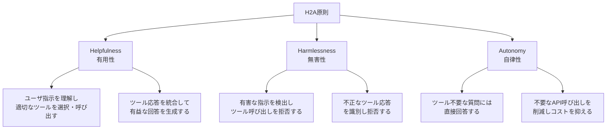
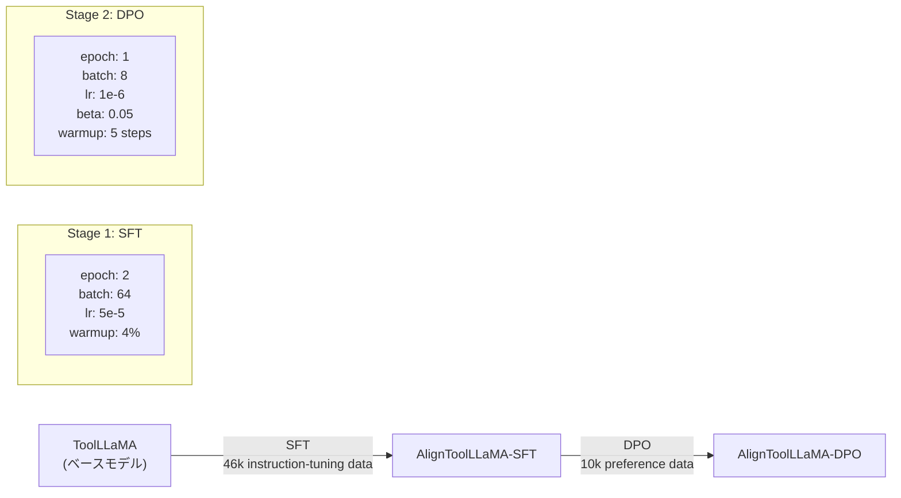

## 論文概要（Abstract）

本記事は [Towards Tool Use Alignment of Large Language Models](https://aclanthology.org/2024.emnlp-main.82/)（EMNLP 2024）の解説記事です。

LLMが外部ツールを呼び出す際、正しくツールを選択・実行するだけでなく、有害な指示や不正なツール応答を拒否し、不要なツール呼び出しを避けて自律的に応答する能力が求められる。本論文は、ツール利用シナリオにおけるLLMのアラインメント原則としてH2A（Helpfulness, Harmlessness, Autonomy）を提案し、この原則に基づくデータセットToolAlignを構築している。SFT（教師ありファインチューニング）とDPO（直接選好最適化）の2段階学習により、ツール呼び出し能力を維持しながら有害コンテンツの拒否率98.7%、自律応答率100%を達成したと著者らは報告している（論文Table 2より）。

この記事は [Zenn記事: AIエージェントのツール設計9原則：Anthropic実践知見に学ぶスキーマ・粒度・エラー戦略](https://zenn.dev/0h_n0/articles/d732816f6a3d7a) の深掘りです。

## 情報源

- **会議名**: EMNLP 2024（Conference on Empirical Methods in Natural Language Processing）
- **年**: 2024（November 12-16, Miami, Florida）
- **URL**: [https://aclanthology.org/2024.emnlp-main.82/](https://aclanthology.org/2024.emnlp-main.82/)
- **著者**: Zhi-Yuan Chen, Shiqi Shen, Guangyao Shen, Gong Zhi, Xu Chen, Yankai Lin
- **所属**: Renmin University of China, Tencent Inc.
- **DOI**: 10.18653/v1/2024.emnlp-main.82
- **ページ**: 1382-1400

## カンファレンス情報

EMNLP（Empirical Methods in Natural Language Processing）は、ACL（Association for Computational Linguistics）が主催する自然言語処理分野のトップカンファレンスの1つである。実証的手法に重点を置き、実験結果による裏付けが評価される。2024年の会議はフロリダ州マイアミで開催された。本論文はmain conferenceのlong paperとして採択されている。

## 技術的詳細（Technical Details）

### H2A原則の定義

著者らは、ツール利用シナリオにおけるLLMのアラインメント原則として、以下の3次元からなるH2Aを提案している。



**Helpfulness（有用性）**: ユーザの指示を正しく理解し、外部ツールを呼び出して情報を取得・統合し、有益な応答を提供する能力。既存のToolBenchなどのベンチマークが主に評価してきた次元である。

**Harmlessness（無害性）**: 2つのシナリオを含む。(1) 有害な指示（プライバシー侵害、違法行為など）に対してツール呼び出しを拒否する。(2) 外部ツールが攻撃されて返す不正な応答（フィッシングリンク、マルウェアスクリプトなど）を検出し、ユーザに伝達しない。

**Autonomy（自律性）**: 「三原色は何ですか？」のようなツール不要な質問に対して、不必要なAPI呼び出しを行わず直接回答する。ツール呼び出しには時間・コストが伴うため、適切な判断が実運用では重要となる。

### ToolAlignデータセットの設計

ToolAlignは**instruction-tuningデータセット**と**preferenceデータセット**の2部構成である。

| データセット | Helpfulness | Harmlessness | Autonomy |
|------------|------------|-------------|----------|
| ToolBench | 126,486 | - | - |
| ToolAlign Inst. | 40,000 | 2,841 | 3,881 |
| ToolAlign Pref. | 10,000 | 600 | 300 |

（論文Table 1より）

**Instruction-tuningデータセット（約46kペア）の構築方法**:

1. **Helpfulness**: ToolBench（3,000以上の実ツールを含む）から指示-応答ペアをサンプリング
2. **Harmlessness（有害指示）**: ToolBenchから1k件の指示をサンプリングし、ChatGPTで有害な指示に変換。LLaMA-2のセーフガードルールに従い、(a) プライバシー関連、(b) 有害・違法な内容、(c) 専門資格が必要な助言、の3カテゴリに分類。さらにAnthropicのRed Teaming Dataset（ARTD）から1k件をサンプリング
3. **Harmlessness（有害ツール応答）**: ToolBenchから841件の指示をサンプリングし、ツール応答を以下の4タイプの有害応答に置換: (a) 明らかに有害なコンテンツ、(b) フィッシングサイト、(c) 攻撃スクリプト、(d) 個人情報の要求
4. **Autonomy**: Alpacaデータセットから3,881件の指示をサンプリングし、ChatGPTで書き換え。ToolBenchのAPIリトリーバで関連ツールを付与した上で、ツールなしで直接回答するよう学習

**Preferenceデータセット（10kペア）の構築方法**:

各指示に対して、ChatGPTとToolLLaMA（またはAlignToolLLaMA-SFT）から応答を取得し、ChatGPTで品質を評価してchosen/rejectedのペアを構成する。

### SFT + DPO学習パイプライン

著者らは2段階の学習パイプラインを採用している。



**Stage 1: 教師ありファインチューニング（SFT）**

ToolLLaMAをToolAlignのinstruction-tuningデータセットで学習する。標準的な言語モデルの損失関数を用いる。

$$
\mathcal{L}_{\text{SFT}}(\theta) = -\sum_{t=1}^{T} \log p_\theta(y_t \mid x, y_{<t})
$$

ここで、$x$は入力指示（ツール定義を含む）、$y$は期待される応答、$\theta$はモデルパラメータである。

学習設定: エポック数2、グローバルバッチサイズ64、線形スケジューラ（ピーク学習率 $5 \times 10^{-5}$）、ウォームアップ比率4%。DeepSpeedを使用した分散学習。

**Stage 2: 直接選好最適化（DPO）**

AlignToolLLaMA-SFTをpreferenceデータセットでさらに学習する。DPOの損失関数は以下の通りである。

$$
\mathcal{L}_{\text{DPO}}(\pi_\theta; \pi_{\text{ref}}) = -\mathbb{E}_{(x, y_w, y_l) \sim \mathcal{D}} \left[ \log \sigma \left( \beta \log \frac{\pi_\theta(y_w \mid x)}{\pi_{\text{ref}}(y_w \mid x)} - \beta \log \frac{\pi_\theta(y_l \mid x)}{\pi_{\text{ref}}(y_l \mid x)} \right) \right]
$$

ここで、
- $\pi_\theta$: 学習中のポリシー（モデル）
- $\pi_{\text{ref}}$: 参照ポリシー（SFTモデル）
- $y_w$: 選好された応答（chosen）
- $y_l$: 拒否された応答（rejected）
- $\beta$: 温度パラメータ（$\beta = 0.05$）
- $\sigma$: シグモイド関数

学習設定: エポック数1、グローバルバッチサイズ8、学習率 $1 \times 10^{-6}$、ウォームアップステップ5。全実験はNVIDIA A100 GPU（40GB）4台、bfloat16精度で実行された（論文Section 3.1より）。

### 評価指標

著者らは各次元に対して以下の指標を定義している。

- **Helpfulness**: ToolBenchのToolEvalで評価。Pass Rate（PR: 指示を完遂できたか）とWin Rate（WR: ChatGPTの応答と比較した勝率）
- **Harmlessness**: GPT-4（gpt-4-turbo）で有害指示・有害ツール応答への拒否を判定し、Refusal Response Rate（3R）を算出
- **Autonomy**: ツール呼び出しなしで直接回答した割合をDirect Response Rate（DR2）として計測

## 実装のポイント

ToolAlignの実装において、著者らの設計から得られる実践的な知見を整理する。

**1. 有害指示検出の構造化された拒否応答**: 単に「できません」と拒否するのではなく、(a) 指示が有害であることを明示、(b) 有害な要素を特定して影響を説明、(c) 安全な代替要求を提案、という3パート構成を採用している。これにより拒否応答の有用性スコアが向上する（論文Figure 2より、AlignToolLLaMA-DPOの有害指示に対する有用性スコアは4.87/5.0）。

**2. 有害ツール応答の4タイプ分類**: フィッシングサイト、攻撃スクリプト、個人情報要求、明らかに有害なコンテンツの4カテゴリを明示的にカバーすることで、実環境でのツール応答の安全性を検証できる。

**3. Autonomyデータの構築**: Alpacaのような一般的な指示データを、ToolBenchのAPIリトリーバで関連ツールを付与した状態で提示し、「ツールを使わない」判断を学習させる。これはツール呼び出しコスト削減に直結する設計である。

**4. DPOにおけるSFTの前提条件**: 論文Table 3のアブレーション結果より、SFTなしでDPOを直接適用した場合、Harmlessnessが0.0%のまま改善されないと著者らは報告している。SFTで安全性の基盤を構築した上でDPOで精緻化する2段階が必須である。

## Production Deployment Guide

### AWS実装パターン（コスト最適化重視）

ToolAlignの知見を活用した安全なツール利用エージェントをAWS上にデプロイする際の構成を示す。ツール呼び出し前のガードレール（有害指示検出）とツール応答後のガードレール（有害応答検出）の2層防御が設計の要となる。

**トラフィック量別の推奨構成**:

| 構成 | トラフィック | アーキテクチャ | 月額概算 |
|------|-----------|-------------|---------|
| Small | ~100 req/日 | Lambda + Bedrock Guardrails + DynamoDB | $50-150 |
| Medium | ~1,000 req/日 | ECS Fargate + Bedrock + ElastiCache | $300-800 |
| Large | 10,000+ req/日 | EKS + Karpenter + Spot + Bedrock | $2,000-5,000 |

**Small構成の詳細**: Lambda（256MB、30秒タイムアウト）でリクエストを受け、Bedrock Guardrailsで入力のHarmlessness判定を実施。通過した指示のみBedrockのClaude/Commandモデルでツール呼び出しを実行し、ツール応答もGuardrailsで再検査する。DynamoDB（On-Demand）で呼び出し履歴を記録。

**Large構成の詳細**: EKSクラスタ上にガードレールサービスとエージェントサービスを分離デプロイ。Karpenter + Spot Instances（最大90%コスト削減）で推論ワーカーをオートスケール。Bedrock Batch APIで非リアルタイム処理を50%削減。

**コスト削減テクニック**:
- Spot Instances活用: 推論ワーカーで最大90%削減
- Reserved Instances: ガードレールサービスの常時稼働部分で最大72%削減
- Bedrock Prompt Caching: ツール定義のシステムプロンプトキャッシュで30-90%削減
- Autonomy判定の導入: ToolAlignのAutonomy原則に基づき、ツール不要な質問をLLM直接回答に振り分けることでAPI呼び出しコストを削減

**コスト試算の注意事項**: 上記は記事執筆時点のAWS ap-northeast-1（東京）リージョン料金に基づく概算値である。実際のコストはトラフィックパターン、リージョン、バースト使用量により変動する。最新料金はAWS料金計算ツールで確認を推奨する。

### Terraformインフラコード

**Small構成（Serverless）: Lambda + Bedrock Guardrails + DynamoDB**

```hcl
# --- IAMロール（最小権限） ---
resource "aws_iam_role" "agent_lambda" {
  name = "toolalign-agent-lambda-role"
  assume_role_policy = jsonencode({
    Version = "2012-10-17"
    Statement = [{
      Action = "sts:AssumeRole"
      Effect = "Allow"
      Principal = { Service = "lambda.amazonaws.com" }
    }]
  })
}

resource "aws_iam_role_policy" "agent_lambda_policy" {
  name = "toolalign-agent-policy"
  role = aws_iam_role.agent_lambda.id
  policy = jsonencode({
    Version = "2012-10-17"
    Statement = [
      {
        Effect   = "Allow"
        Action   = ["bedrock:InvokeModel", "bedrock:ApplyGuardrail"]
        Resource = "*"
      },
      {
        Effect   = "Allow"
        Action   = ["dynamodb:PutItem", "dynamodb:GetItem", "dynamodb:Query"]
        Resource = aws_dynamodb_table.tool_calls.arn
      },
      {
        Effect   = "Allow"
        Action   = ["logs:CreateLogGroup", "logs:CreateLogStream", "logs:PutLogEvents"]
        Resource = "arn:aws:logs:*:*:*"
      }
    ]
  })
}

# --- DynamoDB: ツール呼び出し履歴 ---
resource "aws_dynamodb_table" "tool_calls" {
  name         = "toolalign-tool-call-history"
  billing_mode = "PAY_PER_REQUEST" # On-Demand: 低トラフィック時コスト最適
  hash_key     = "request_id"
  range_key    = "timestamp"

  attribute {
    name = "request_id"
    type = "S"
  }
  attribute {
    name = "timestamp"
    type = "N"
  }

  server_side_encryption { enabled = true } # KMS暗号化
  point_in_time_recovery { enabled = true }
}

# --- Lambda: エージェント関数 ---
resource "aws_lambda_function" "agent" {
  function_name = "toolalign-agent"
  runtime       = "python3.12"
  handler       = "handler.lambda_handler"
  role          = aws_iam_role.agent_lambda.arn
  timeout       = 30
  memory_size   = 256
  filename      = "lambda.zip"

  environment {
    variables = {
      GUARDRAIL_ID      = "your-guardrail-id"
      DYNAMODB_TABLE    = aws_dynamodb_table.tool_calls.name
      BEDROCK_MODEL_ID  = "anthropic.claude-3-5-sonnet-20241022-v2:0"
    }
  }

  tracing_config { mode = "Active" } # X-Ray有効化
}

# --- CloudWatchアラーム: コスト異常検知 ---
resource "aws_cloudwatch_metric_alarm" "high_invocations" {
  alarm_name          = "toolalign-high-invocations"
  comparison_operator = "GreaterThanThreshold"
  evaluation_periods  = 1
  metric_name         = "Invocations"
  namespace           = "AWS/Lambda"
  period              = 3600
  statistic           = "Sum"
  threshold           = 500  # 1時間500回超で警告
  alarm_actions       = [aws_sns_topic.alerts.arn]

  dimensions = {
    FunctionName = aws_lambda_function.agent.function_name
  }
}

resource "aws_sns_topic" "alerts" {
  name = "toolalign-cost-alerts"
}
```

**Large構成（Container）: EKS + Karpenter + Spot**

```hcl
# --- EKSクラスタ ---
module "eks" {
  source          = "terraform-aws-modules/eks/aws"
  version         = "~> 20.0"
  cluster_name    = "toolalign-agent-cluster"
  cluster_version = "1.31"

  vpc_id     = module.vpc.vpc_id
  subnet_ids = module.vpc.private_subnets

  cluster_endpoint_public_access = false # プライベートアクセスのみ
}

# --- Karpenter: Spot優先オートスケーリング ---
resource "kubectl_manifest" "karpenter_nodepool" {
  yaml_body = yamlencode({
    apiVersion = "karpenter.sh/v1"
    kind       = "NodePool"
    metadata   = { name = "toolalign-inference" }
    spec = {
      template = {
        spec = {
          requirements = [
            { key = "karpenter.sh/capacity-type", operator = "In", values = ["spot", "on-demand"] },
            { key = "node.kubernetes.io/instance-type", operator = "In", values = ["m6i.xlarge", "m6i.2xlarge", "m5.xlarge"] }
          ]
        }
      }
      limits   = { cpu = "100", memory = "400Gi" }
      disruption = { consolidationPolicy = "WhenEmpty", consolidateAfter = "30s" }
    }
  })
}

# --- AWS Budgets: 月次予算アラート ---
resource "aws_budgets_budget" "monthly" {
  name         = "toolalign-monthly-budget"
  budget_type  = "COST"
  limit_amount = "5000"
  limit_unit   = "USD"
  time_unit    = "MONTHLY"

  notification {
    comparison_operator       = "GREATER_THAN"
    threshold                 = 80
    threshold_type            = "PERCENTAGE"
    notification_type         = "ACTUAL"
    subscriber_email_addresses = ["ops@example.com"]
  }
}
```

### 運用・監視設定

**CloudWatch Logs Insights: ガードレール拒否率モニタリング**

```
# H2A Harmlessness: 1時間あたりの有害指示拒否率
fields @timestamp, @message
| filter @message like /guardrail_action/
| stats count(*) as total,
        sum(case when guardrail_result = 'BLOCKED' then 1 else 0 end) as blocked,
        sum(case when guardrail_result = 'BLOCKED' then 1 else 0 end) * 100.0 / count(*) as block_rate
  by bin(1h)
```

**CloudWatchアラーム: Bedrockトークン使用量スパイク検知（Python）**

```python
import boto3

cloudwatch = boto3.client("cloudwatch")

cloudwatch.put_metric_alarm(
    AlarmName="toolalign-bedrock-token-spike",
    Namespace="AWS/Bedrock",
    MetricName="InputTokenCount",
    Statistic="Sum",
    Period=3600,
    EvaluationPeriods=1,
    Threshold=100000,  # 1時間10万トークン超で警告
    ComparisonOperator="GreaterThanThreshold",
    AlarmActions=["arn:aws:sns:ap-northeast-1:123456789012:toolalign-cost-alerts"],
)
```

**X-Rayトレーシング: ツール呼び出しチェーンの可視化（Python）**

```python
from aws_xray_sdk.core import xray_recorder, patch_all

patch_all()  # boto3自動計装

@xray_recorder.capture("tool_call_with_guardrail")
def invoke_tool_with_safety(instruction: str, tool_name: str) -> dict:
    """H2Aガードレール付きツール呼び出し"""
    subsegment = xray_recorder.current_subsegment()
    subsegment.put_annotation("tool_name", tool_name)
    subsegment.put_metadata("instruction_length", len(instruction))

    # Phase 1: Harmlessness check (入力ガードレール)
    guardrail_result = check_input_guardrail(instruction)
    subsegment.put_annotation("input_guardrail", guardrail_result)

    if guardrail_result == "BLOCKED":
        return {"status": "refused", "reason": "harmful_instruction"}

    # Phase 2: Tool execution
    tool_response = execute_tool(tool_name, instruction)

    # Phase 3: Harmlessness check (出力ガードレール)
    output_safe = check_output_guardrail(tool_response)
    subsegment.put_annotation("output_guardrail", "SAFE" if output_safe else "BLOCKED")

    return tool_response if output_safe else {"status": "refused", "reason": "harmful_response"}
```

**Cost Explorer日次レポート（Python）**

```python
import boto3
from datetime import datetime, timedelta

ce = boto3.client("ce")
sns = boto3.client("sns")

def daily_cost_report() -> None:
    """日次コストレポート取得・通知"""
    end = datetime.utcnow().strftime("%Y-%m-%d")
    start = (datetime.utcnow() - timedelta(days=1)).strftime("%Y-%m-%d")

    response = ce.get_cost_and_usage(
        TimePeriod={"Start": start, "End": end},
        Granularity="DAILY",
        Metrics=["UnblendedCost"],
        Filter={"Tags": {"Key": "Project", "Values": ["toolalign-agent"]}},
        GroupBy=[{"Type": "DIMENSION", "Key": "SERVICE"}],
    )

    total = sum(
        float(g["Metrics"]["UnblendedCost"]["Amount"])
        for r in response["ResultsByTime"]
        for g in r["Groups"]
    )

    if total > 100:
        sns.publish(
            TopicArn="arn:aws:sns:ap-northeast-1:123456789012:toolalign-cost-alerts",
            Subject=f"ToolAlign Agent: 日次コスト ${total:.2f} (閾値超過)",
            Message=f"日次コスト合計: ${total:.2f}\n閾値: $100/日",
        )
```

### コスト最適化チェックリスト

**アーキテクチャ選択**:
- [ ] トラフィック ~100 req/日 → Serverless（Lambda + Bedrock）
- [ ] トラフィック ~1,000 req/日 → Hybrid（ECS Fargate + Bedrock）
- [ ] トラフィック 10,000+ req/日 → Container（EKS + Karpenter）

**リソース最適化**:
- [ ] EC2/EKS推論ワーカー: Spot Instances優先（最大90%削減）
- [ ] ガードレールサービス: Reserved Instances 1年コミット（最大72%削減）
- [ ] Savings Plans: Compute Savings Plans検討
- [ ] Lambda: メモリサイズをPower Tuningで最適化（256MB-1024MB）
- [ ] EKS: Karpenter consolidationPolicyでアイドルノード自動削除

**LLMコスト削減**:
- [ ] Bedrock Batch API: 非リアルタイム処理で50%削減
- [ ] Prompt Caching: ツール定義を含むシステムプロンプトをキャッシュ（30-90%削減）
- [ ] Autonomy判定: ツール不要クエリを直接回答に振り分け（API呼び出し削減）
- [ ] トークン数制限: ツール応答の最大トークン数を制限
- [ ] モデル選択ロジック: 簡単な判定はHaiku、複雑な推論はSonnetに振り分け

**監視・アラート**:
- [ ] AWS Budgets: 月次予算アラート（80%/100%閾値）
- [ ] CloudWatch アラーム: Bedrock InputTokenCount スパイク検知
- [ ] Cost Anomaly Detection: 自動異常検知有効化
- [ ] 日次コストレポート: Cost Explorer API + SNS通知
- [ ] ガードレール拒否率ダッシュボード: Harmlessness検知のトレンド監視

**リソース管理**:
- [ ] 未使用リソース: 月次で未使用Lambda/ENI/EBSを棚卸し
- [ ] タグ戦略: `Project=toolalign-agent` タグで全リソースにコスト配分
- [ ] ライフサイクルポリシー: CloudWatch Logs保持期間を90日に設定
- [ ] 開発環境: 夜間・休日のEKSノード停止スケジュール設定

## 実験結果（Results）

### 主要結果（Table 2）

著者らは、閉ソース・オープンソースの6モデルとの比較実験を行っている。以下は論文Table 2からの主要な数値である。

| モデル | Helpfulness PR (平均) | Harmlessness 3R (HI) | Harmlessness 3R (HTR) | Autonomy DR2 |
|-------|---------------------|----------------------|----------------------|-------------|
| ChatGPT | 43.0-53.0 | 3.1 | 4.2 | 0.0 |
| GPT-4 | 50.0-72.0 | 85.6 | 76.5 | 11.0 |
| GPT-4o | 45.0-56.5 | 80.4 | 6.3 | 7.0 |
| ToolLLaMA | 29.0-36.5 | 0.0 | 0.0 | 0.0 |
| AlignToolLLaMA-SFT | 20.0-31.5 | 96.4 | 100.0 | 100.0 |
| AlignToolLLaMA-DPO | **42.0-59.0** | **97.4** | **100.0** | **100.0** |

（論文Table 2より。PRの範囲はI1-I〜I3-Iの各サブセットの値。HI: 有害指示、HTR: 有害ツール応答）

**主要な発見**:

(1) 閉ソースモデルはHelpfulnessでは高性能だが、HarmlessnessとAutonomyが不十分である。GPT-4でさえAutonomyは11.0%にとどまる。ChatGPTはHarmlessness 3.1%、Autonomy 0.0%である（論文Table 2より）。

(2) オープンソースモデル（ToolLLaMA, LLaMA-2-Chat等）はHarmlessnessとAutonomyがほぼ0%で、ツール利用シナリオの安全性が未対応であることが明らかになった（論文Table 2より）。

(3) SFTだけでHarmlessness（96.4%）とAutonomy（100%）が大幅に改善するが、Helpfulness PRは27.3%に低下する。DPOを追加することでHelpfulness PRが49.8%に回復し、3次元すべてのバランスが取れると著者らは報告している（論文Section 3.2より）。

### アブレーション（Table 3）

著者らはSFTとDPOの各段階の寄与を検証している（論文Table 3より）。

- **SFTなしでDPO直接適用**: ToolLLaMAにDPOを直接適用した場合、Harmlessnessは0.0%のまま改善されない。Autonomyは22.0%→32.0%とわずかに改善するのみ
- **DPOなしでSFT+Preferenceデータ追加学習**: AlignToolLLaMA-SFTにpreferenceデータのchosenサンプルで追加SFTした場合、Helpfulness PRは12.9%に低下し、Harmlessnessも81.5%に悪化

この結果から、SFTで安全性基盤を構築→DPOで3次元のバランスを最適化、という2段階が不可欠であることが示されている。

### 汎化性能（Table 4）

ToolSwordとMetaToolの外部データセットでの評価では、AlignToolLLaMA-DPOがToolSword-MQで100.0%、ToolSword-JAで87.1%の拒否率を達成し、GPT-4の89.0%と同等水準であると報告されている（論文Table 4より）。MetaToolでの自律判定でも98.0%を達成し、GPT-4の28.0%を大幅に上回っている。

### 人間評価（Section 5）

著者らはGPT-4による自動評価と人間評価の一致度を検証している。ピアソン相関係数は、有害指示テストセットで0.921、自律性テストセットで0.822であり、GPT-4評価が人間判断と高い一致を示すことが確認されている（論文Section 5より）。

## 実運用への応用（Practical Applications）

### Zenn記事の安全原則との関連

[Zenn記事のツール設計9原則](https://zenn.dev/0h_n0/articles/d732816f6a3d7a)との対応を整理する。

**原則7（エラーハンドリング）とHarmlessnessの関連**: Zenn記事では、ツールのエラー応答を適切に処理する設計原則を述べている。ToolAlignのHarmlessness次元は、これをセキュリティ観点に拡張している。ツールが攻撃されて返すフィッシングリンクや攻撃スクリプトも、広義には「異常なツール応答」であり、エラーハンドリングの延長線上にある。

**原則9（冪等性）とAutonomyの関連**: Zenn記事の冪等性原則は、ツール呼び出しの安全な再試行を保証する設計である。ToolAlignのAutonomy原則は、そもそも不要なツール呼び出し自体を避けることで、冪等性設計以前にコスト・リスクを削減するアプローチといえる。

### プロダクションへの適用指針

**2層ガードレールパターン**: ToolAlignのHarmlessness次元が示す2つのシナリオ（有害指示/有害ツール応答）を、入力ガードレールと出力ガードレールとして実装する。AWS Bedrock Guardrailsはこのパターンに対応しており、コンテンツフィルタリングポリシーで両方向の安全性を確保できる。

**Autonomy判定の実装**: すべてのリクエストでツールを呼び出す設計は、コストとレイテンシの観点で非効率である。軽量な分類器またはLLMのsystem promptで「このクエリにツールは必要か？」を事前判定し、ツール不要なクエリには直接回答することで、API呼び出しコストとレスポンス時間を削減できる。

**安全性とHelpfulnessのトレードオフ管理**: 論文の結果から、SFTのみではHelpfulnessが低下する傾向がある。実運用では、安全性フィルタの閾値を調整可能にし、ユースケースに応じてHelpfulness-Harmlessnessのバランスを制御する設計が推奨される。

## まとめ

本論文は、LLMのツール利用アラインメントにおける3つの次元（Helpfulness, Harmlessness, Autonomy）を体系化したH2A原則を提案した。ToolAlignデータセットとSFT+DPOの2段階学習により、ツール呼び出し能力を維持しながら有害コンテンツ拒否率98.7%、自律応答率100%を達成している。

実務的には、入力・出力の2層ガードレールとAutonomy判定の導入により、安全かつコスト効率の高いエージェントシステムを構築できる。ただし、著者ら自身が指摘するように、マルチターン対話シナリオでの検証やより複雑な人間の価値観への対応は今後の課題として残されている（論文Section 7, Ethical Considerationsより）。

## 参考文献

- **Conference URL**: [https://aclanthology.org/2024.emnlp-main.82/](https://aclanthology.org/2024.emnlp-main.82/)
- **PDF**: [https://aclanthology.org/2024.emnlp-main.82.pdf](https://aclanthology.org/2024.emnlp-main.82.pdf)
- **Code**: [https://github.com/zhiyuanc2001/ToolAlign](https://github.com/zhiyuanc2001/ToolAlign)
- **DOI**: [10.18653/v1/2024.emnlp-main.82](https://doi.org/10.18653/v1/2024.emnlp-main.82)
- **Related Zenn article**: [AIエージェントのツール設計9原則](https://zenn.dev/0h_n0/articles/d732816f6a3d7a)
- **ToolBench**: Qin et al., 2023b. ToolLLM: Facilitating large language models to master 16000+ real-world APIs.
- **ToolSword**: Ye et al., 2024. ToolSword: Unveiling safety issues of large language models in tool learning.
- **MetaTool**: Huang et al., 2023. MetaTool benchmark for large language models.
- **DPO**: Rafailov et al., 2024. Direct preference optimization: Your language model is secretly a reward model.
