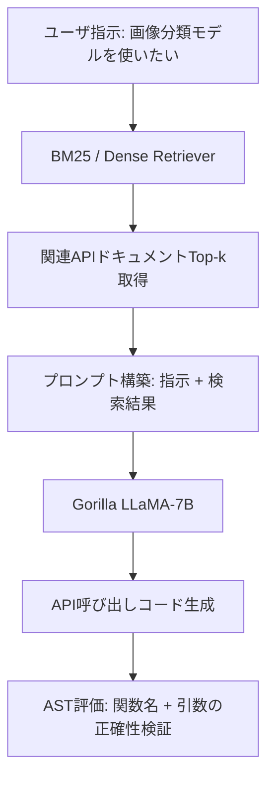

## 論文概要（Abstract）

本記事は [Gorilla: Large Language Model Connected with Massive APIs](https://arxiv.org/abs/2305.16291) の解説記事です。

Gorillaは、UC Berkeleyの研究チームが提案した、LLMに大規模APIの正確な呼び出し能力を付与するためのシステムである。著者らは、APIドキュメントを検索して取得した情報をプロンプトに含めた状態でファインチューニングを行う**Retrieval-Aware Training（RAT）**という手法を提案している。この手法により、APIの変更にも再訓練なしで適応でき、API呼び出し時のhallucination（存在しないAPIやパラメータを生成してしまう問題）を大幅に削減したと報告されている。

この記事は [Zenn記事: AIエージェントのツール設計9原則：Anthropic実践知見に学ぶスキーマ・粒度・エラー戦略](https://zenn.dev/0h_n0/articles/d732816f6a3d7a) の深掘りです。Zenn記事で扱ったAPIスキーマ設計の原則が、なぜモデルの正確なAPI呼び出しに直結するのかを、Gorilla論文の知見から掘り下げます。

## 情報源

- **arXiv ID**: 2305.16291
- **URL**: [arXiv:2305.16291](https://arxiv.org/abs/2305.16291)
- **著者**: Shishir G. Patil, Tianjun Zhang, Xin Wang, Joseph E. Gonzalez（UC Berkeley）
- **発表年**: 2023年5月
- **分野**: cs.CL, cs.AI
- **コード**: [github.com/ShishirPatil/gorilla](https://github.com/ShishirPatil/gorilla)（Apache 2.0ライセンス）

## 背景と動機（Background & Motivation）

LLMをエージェントとして利用する場合、外部APIの正確な呼び出しが不可欠である。しかし、従来のLLM（GPT-4やClaude等）は以下の問題を抱えていた。

1. **API hallucination**: 存在しないAPI関数名やパラメータを生成する。著者らの評価では、GPT-4のhallucination率は13.8%に達すると報告されている（論文Table 1より）。
2. **APIバージョン追従の困難さ**: LLMの学習データはある時点のスナップショットであり、APIの更新・非推奨化に追従できない。
3. **大量のAPI空間**: HuggingFaceだけで数十万のモデルが存在し、全APIをコンテキストに含めることは現実的でない。

従来のアプローチでは、APIドキュメント全体をプロンプトに詰め込むか、モデル自体に大量のAPI知識を暗記させるかの二択だった。前者はコンテキスト長の制限に阻まれ、後者はAPIの更新に脆弱である。Gorillaは、**検索**と**ファインチューニング**を組み合わせることで、この課題に取り組んでいる。

## 主要な貢献（Key Contributions）

- **Retrieval-Aware Training（RAT）**: APIドキュメントの検索結果をプロンプトに含めた状態でファインチューニングする手法。推論時に最新のAPIドキュメントを検索・注入することで、再訓練なしでAPI変更に追従できる。
- **APIBench**: TorchHub（94 API）、TensorHub（696 API）、HuggingFace（925 API）の計1,645 APIに対する10,000以上の（自然言語指示, API呼び出し）ペアからなる評価ベンチマーク。
- **AST評価手法**: API呼び出しの正確性をAbstract Syntax Tree（抽象構文木）レベルで評価する手法。関数名の完全一致と引数構造の整合性を検証する。
- **Hallucination削減**: GPT-4の13.8%に対してGorillaは0.6%まで削減（論文Table 1より、23倍の改善）。

## 技術的詳細（Technical Details）

### Retrieval-Aware Training（RAT）

RATの核心は、訓練時と推論時の両方で検索結果をプロンプトに組み込む点にある。



#### 訓練フェーズ

従来のinstruction tuningでは、（指示, 正解API呼び出し）のペアで訓練する。RATでは、これに検索結果を追加する。

$$
\mathcal{L}_{\text{RAT}} = -\sum_{i=1}^{N} \log p(y_i \mid x_i, d_i; \theta)
$$

ここで、
- $x_i$: ユーザのタスク指示（自然言語）
- $d_i$: 検索により取得したAPIドキュメント
- $y_i$: 正解のAPI呼び出しコード
- $\theta$: モデルパラメータ（LLaMA-7Bベース）
- $N$: 訓練サンプル数

通常のinstruction tuningの損失関数 $\mathcal{L} = -\sum \log p(y_i \mid x_i; \theta)$ との違いは、条件付けに検索結果 $d_i$ が加わっている点である。これにより、モデルは「検索結果を参照しながら正しいAPI呼び出しを生成する」パターンを学習する。

#### 推論フェーズ

推論時にも同様に、ユーザの指示に対して検索エンジンで関連APIドキュメントを取得し、プロンプトに含める。

```python
def gorilla_inference(user_instruction: str, retriever: Retriever, model: GorillaModel) -> str:
    """Gorilla推論: 検索 → プロンプト構築 → API呼び出し生成"""
    retrieved_docs = retriever.search(user_instruction, top_k=3)
    prompt = build_prompt(user_instruction, retrieved_docs)
    return model.generate(prompt)
```

訓練時にすでに「検索結果付きプロンプト」に慣れているため、推論時に最新のAPIドキュメントを差し込んでも、モデルは適切に参照できる。この設計により、APIが更新されてもドキュメントデータベースを更新するだけで対応が可能になる。

#### 検索手法

著者らは2種類の検索手法を比較している。

- **BM25**: 語彙ベースのスパース検索。TF-IDFの発展形で、APIドキュメント中のキーワードマッチに強い。
- **Dense Retrieval（GPT-Index）**: 埋め込みベースの密ベクトル検索。意味的に近いドキュメントを取得できる。

結果として、BM25とDense Retrievalの性能差はタスクによって異なり、一方が常に優れるわけではないと報告されている（論文Section 5より）。

### AST評価手法

従来のコード生成評価では、文字列の完全一致やBLEUスコアが使われていた。しかし、API呼び出しの場合、引数の順序が異なっても意味的に同一であるケースが多い。著者らは、Abstract Syntax Tree（AST）を用いた評価手法を提案している。

```python
import ast

def ast_eval(predicted: str, reference: str) -> bool:
    """AST based API call evaluation: 関数名+引数構造の一致を検証"""
    pred_tree, ref_tree = ast.parse(predicted), ast.parse(reference)
    func_match = extract_function_name(pred_tree) == extract_function_name(ref_tree)
    args_match = set(extract_arguments(pred_tree)) == set(extract_arguments(ref_tree))
    return func_match and args_match
```

AST評価では以下を検証する。

1. **関数名の完全一致**: `torch.hub.load("pytorch/vision", "resnet50")` の `torch.hub.load` が正しいか
2. **引数構造の整合性**: 必須引数が含まれているか、型が正しいか
3. **オプション引数の許容**: デフォルト値を持つ引数の有無は減点しない

### APIドキュメントのJSON Schema

APIBenchでは、各APIを以下のJSON Schemaで標準化している。

```json
{
  "domain": "Computer Vision",
  "framework": "PyTorch",
  "functionality": "Image Classification",
  "api_name": "ResNet-50",
  "api_call": "torch.hub.load('pytorch/vision', 'resnet50', pretrained=True)",
  "api_arguments": {
    "repo_or_dir": "pytorch/vision",
    "model": "resnet50",
    "pretrained": "True"
  },
  "description": "ResNet-50 model pre-trained on ImageNet for image classification",
  "python_environment_requirements": ["torch", "torchvision"]
}
```

このスキーマ設計は、Zenn記事で議論されている「ツール設計の明確さ」と直結する。`api_call`フィールドが実行可能なコード例を含み、`api_arguments`が各引数を個別に定義している点が、モデルの正確なAPI呼び出し生成に寄与している。著者らは、スキーマの品質とドキュメントの構造がAPI呼び出し精度に直接影響すると述べている。

## 実装のポイント

### ベースモデルとファインチューニング

著者らはLLaMA-7Bをベースモデルとして採用している。ファインチューニングのポイントは以下の通り。

- **訓練データ生成**: Self-Instructアプローチで、GPT-4を用いて（指示, API呼び出し）ペアを自動生成。APIドキュメントを入力として与え、そのAPIを使うユースケースと対応するコードを生成させている。
- **検索結果の混入**: 訓練データの各サンプルに対して、BM25で取得した関連ドキュメントをプロンプトに付加。これにより、推論時の検索結果付きプロンプトとの分布の乖離を防ぐ。
- **3つのハブ別モデル**: TorchHub、TensorHub、HuggingFaceそれぞれに特化したモデルを訓練。API空間の特性が異なるため分離している。

### 検索パイプラインの注意点

実装時に注意すべき点として、検索結果の質がモデル出力に直結する。不正確なドキュメントが検索された場合、モデルはそれを参考にして誤ったAPI呼び出しを生成する可能性がある。著者らは、検索精度の向上がGorillaの性能上限を決定する要因の一つであると示唆している。

## Production Deployment Guide

### AWS実装パターン（コスト最適化重視）

GorillaのようなRetrieval-Augmented API呼び出しシステムをAWS上にデプロイする場合のパターンを示す。コスト試算は2026年5月時点のap-northeast-1（東京）リージョンの概算値であり、実際のコストはトラフィックパターンやバースト使用量により変動する。最新料金はAWS料金計算ツールで確認を推奨する。

| 構成 | トラフィック | サービス | 月額概算 |
|------|-------------|---------|---------|
| Small | ~100 req/日 | Lambda + Bedrock + OpenSearch Serverless | $80-200 |
| Medium | ~1,000 req/日 | ECS Fargate + Bedrock + OpenSearch | $400-900 |
| Large | 10,000+ req/日 | EKS + Spot + OpenSearch + Bedrock Batch | $2,500-5,500 |

**Small構成の内訳**:
- Lambda（API Gateway経由）: ~$5/月（100 req/日、平均5秒/req）
- Bedrock Claude Sonnet: ~$30-100/月（入出力トークン量依存）
- OpenSearch Serverless（APIドキュメント検索）: ~$40-80/月（2 OCU最小構成）
- DynamoDB（キャッシュ・ログ）: ~$5/月（On-Demand）

**コスト削減テクニック**:
- Bedrock Batch APIを使用して非リアルタイム処理を50%削減
- Prompt Cachingで同一APIドキュメントの再送を30-90%削減
- OpenSearch ServerlessのOCUを最小構成にし、アクセスパターンに応じて自動スケール
- Spot Instancesの活用（Large構成）で最大90%のコンピュート費用削減
- Reserved Instances（1年コミット）でOpenSearch Managedを最大72%削減

### Terraformインフラコード

**Small構成（Serverless）**: Lambda + Bedrock + OpenSearch Serverless + DynamoDB

```hcl
resource "aws_lambda_function" "api_caller" {
  function_name = "gorilla-api-caller"
  role          = aws_iam_role.api_caller_lambda.arn
  runtime       = "python3.12"
  handler       = "handler.lambda_handler"
  timeout       = 30   # Bedrock呼び出しを考慮
  memory_size   = 512  # 検索+推論に十分なメモリ
  filename      = "lambda.zip"
  environment {
    variables = {
      OPENSEARCH_ENDPOINT = "https://example.aoss.amazonaws.com"
      BEDROCK_MODEL_ID    = "anthropic.claude-sonnet-4-20250514"
      CACHE_TABLE         = aws_dynamodb_table.api_cache.name
    }
  }
  tracing_config { mode = "Active" }  # X-Ray有効化
}

# IAMは最小権限: bedrock:InvokeModel, aoss:APIAccessAll, dynamodb:GetItem/PutItem/Query
# DynamoDB: PAY_PER_REQUEST + KMS暗号化 + PITR有効
```

**Large構成（Container）**: EKS + Karpenter（Spot優先）+ AWS Budgets

```hcl
resource "kubectl_manifest" "karpenter_nodepool" {
  yaml_body = yamlencode({
    apiVersion = "karpenter.sh/v1"
    kind       = "NodePool"
    metadata   = { name = "gorilla-spot" }
    spec = {
      template = { spec = { requirements = [
        { key = "karpenter.sh/capacity-type", operator = "In", values = ["spot", "on-demand"] },
        { key = "node.kubernetes.io/instance-type", operator = "In",
          values = ["m6i.xlarge", "m6a.xlarge", "m5.xlarge"] },
      ] } }
      limits     = { cpu = "100", memory = "400Gi" }
      disruption = { consolidationPolicy = "WhenEmptyOrUnderutilized", consolidateAfter = "60s" }
    }
  })
}
# AWS Budgets: 月額$5,000の80%到達でメール通知
```

### 運用・監視設定

**CloudWatch Logs Insights クエリ（コスト異常検知）**:

```
fields @timestamp, @message
| filter @message like /bedrock/
| stats sum(input_tokens) as total_input, sum(output_tokens) as total_output by bin(1h)
| sort @timestamp desc
```

**CloudWatch アラーム + X-Ray設定（Python）**:

```python
import boto3
from aws_xray_sdk.core import xray_recorder, patch_all


def create_bedrock_token_alarm(sns_topic_arn: str) -> None:
    """Bedrockトークン使用量のスパイク検知アラームを作成"""
    cw = boto3.client("cloudwatch", region_name="ap-northeast-1")
    cw.put_metric_alarm(
        AlarmName="gorilla-bedrock-token-spike",
        MetricName="InputTokenCount",
        Namespace="AWS/Bedrock",
        Statistic="Sum",
        Period=3600,
        EvaluationPeriods=1,
        Threshold=100000,
        ComparisonOperator="GreaterThanThreshold",
        AlarmActions=[sns_topic_arn],
    )


def init_tracing() -> None:
    """X-Rayトレーシングを初期化（boto3自動計装）"""
    xray_recorder.configure(service="gorilla-api-caller")
    patch_all()
```

**Cost Explorer自動レポート（Python）**:

```python
import boto3
from datetime import date, timedelta


def get_daily_cost_report() -> dict[str, float]:
    """日次コストレポートを取得し、$100/日超過でSNS通知"""
    ce = boto3.client("ce", region_name="us-east-1")
    today = date.today()
    response = ce.get_cost_and_usage(
        TimePeriod={"Start": (today - timedelta(days=1)).isoformat(), "End": today.isoformat()},
        Granularity="DAILY",
        Metrics=["UnblendedCost"],
        GroupBy=[{"Type": "DIMENSION", "Key": "SERVICE"}],
    )
    costs = {
        g["Keys"][0]: float(g["Metrics"]["UnblendedCost"]["Amount"])
        for g in response["ResultsByTime"][0]["Groups"]
        if float(g["Metrics"]["UnblendedCost"]["Amount"]) > 0
    }
    if sum(costs.values()) > 100:
        boto3.client("sns", region_name="ap-northeast-1").publish(
            TopicArn="arn:aws:sns:ap-northeast-1:123456789012:cost-alert",
            Subject=f"Daily cost alert: ${sum(costs.values()):.2f}",
            Message=str(costs),
        )
    return costs
```

### コスト最適化チェックリスト

**アーキテクチャ選択**:
- [ ] トラフィック100 req/日以下 → Serverless（Lambda + Bedrock）
- [ ] トラフィック1,000 req/日前後 → Hybrid（ECS Fargate + Bedrock）
- [ ] トラフィック10,000 req/日以上 → Container（EKS + Spot + Bedrock Batch）

**リソース最適化**:
- [ ] EC2/EKSノード: Spot Instances優先（最大90%削減）
- [ ] Reserved Instances: 1年コミットで最大72%削減
- [ ] Savings Plans: コンピュート全体で最大66%削減
- [ ] Lambda: メモリサイズをPower Tuningで最適化
- [ ] ECS/EKS: Karpenterでアイドル時自動スケールダウン
- [ ] OpenSearch: Serverless構成でOCU最小化

**LLMコスト削減**:
- [ ] Bedrock Batch APIで非同期処理を50%削減
- [ ] Prompt Cachingで同一APIドキュメント参照を30-90%削減
- [ ] モデル選択ロジック: 単純なAPI呼び出しにはHaiku、複雑なものにはSonnet
- [ ] トークン数制限: APIドキュメントの要約でプロンプト長を制御
- [ ] レスポンスキャッシュ: DynamoDBで同一クエリの結果を再利用

**監視・アラート**:
- [ ] AWS Budgets: 月額予算の80%到達で通知
- [ ] CloudWatch アラーム: Bedrockトークン使用量・Lambda実行時間
- [ ] Cost Anomaly Detection: 自動異常検知有効化
- [ ] 日次コストレポート: Cost Explorer APIで自動取得

**リソース管理**:
- [ ] 未使用OpenSearchコレクション削除
- [ ] タグ戦略: `project:gorilla`, `env:prod/dev` で全リソースにタグ付与
- [ ] S3ライフサイクルポリシー: ログ30日でGlacier移行
- [ ] 開発環境: 夜間・週末のEKSノード自動停止
- [ ] CloudTrail/Config: 監査ログ有効化

## 実験結果（Results）

### Hallucination率の比較

著者らが報告した主要な実験結果を以下に示す（論文Table 1より）。

| モデル | TorchHub Hallucination | TensorHub Hallucination | HuggingFace Hallucination |
|--------|----------------------|------------------------|--------------------------|
| GPT-4 | 9.9% | 15.6% | 13.8% |
| GPT-3.5 | 24.7% | 10.6% | 14.4% |
| Claude | 15.4% | 5.6% | 10.0% |
| Gorilla (zero-shot) | 2.0% | 4.8% | 2.6% |
| Gorilla (BM25 retrieval) | 0.6% | 1.2% | 0.8% |

Gorilla（BM25 retrieval）はGPT-4と比較して、TorchHubで16.5倍、HuggingFaceで17.3倍のhallucination削減を達成したと著者らは報告している。

### AST精度

AST評価による関数呼び出しの正確性も報告されている（論文Table 2より）。GorillaはTorchHubで最も高い精度を示し、特にretrieval付きの構成ではHuggingFaceの大規模API空間（925 API）においても安定した性能を維持している。

### Zero-shot vs Retrieval

興味深い点として、Gorilla zero-shot（検索なし）でも既にGPT-4を上回る性能を示している。これは、ファインチューニングによりAPIの構造的パターンを学習していることを示唆する。しかし、retrievalを追加することでさらに性能が向上しており、特にAPIの更新への追従性という点でretrievalの価値は大きい。

## 実運用への応用（Practical Applications）

### エージェントシステムへの適用

Gorilla論文の知見は、現在のLLMエージェントシステムに直接応用できる。

1. **ツールスキーマ設計**: GorillaのJSON Schema形式（`api_call`, `api_arguments`, `description`）は、OpenAIのFunction CallingやAnthropicのTool Useのスキーマ設計と共通する思想を持つ。Zenn記事で議論された「ツール設計の明確さ」が精度に直結することを、Gorilla論文は定量的に裏付けている。

2. **ドキュメント品質とAPI精度の相関**: API呼び出しの正確性はドキュメントの質に依存する。スキーマに`description`が明確に記載されているAPIは正答率が高く、曖昧な記述のAPIは誤呼び出しが増えると著者らは分析している。

3. **検索による最新性の担保**: APIバージョンの更新に対して、モデルの再訓練ではなくドキュメントデータベースの更新で対応できる点は、運用コストの観点から有利である。

### 制約事項

著者らも認めている通り、Gorillaの評価はMLフレームワーク（TorchHub, TensorHub, HuggingFace）のAPIに限定されている。一般的なREST API（認証フロー、ページネーション、エラーハンドリングを含む）への転用可能性は未検証である。また、APIの組み合わせ（複数APIの連鎖呼び出し）についても評価されていない。

## 関連研究（Related Work）

- **Toolformer（Schick et al., 2023）**: LLMに自律的にツール使用を学習させるアプローチ。Gorillaとは異なり、特定APIへの特化ではなく汎用的なツール使用能力の獲得を目指している。
- **ToolLLM（Qin et al., 2023）**: 16,000以上のREST APIを対象にしたツール使用ベンチマーク。Gorillaが対象としなかったREST APIを含むが、hallucination削減の観点ではGorillaの方が詳細な分析を行っている。
- **Self-Instruct（Wang et al., 2023）**: GPT-4を用いた訓練データ自動生成の元となった手法。Gorillaの訓練データ生成パイプラインはこの手法を応用している。
- **REALM / RAG（Lewis et al., 2020）**: 検索拡張生成の基盤手法。GorillaのRATはRAGのファインチューニング版と位置付けられる。

## まとめと今後の展望

Gorilla論文は、LLMによるAPI呼び出しの正確性向上において、検索とファインチューニングの組み合わせが有効であることを示した。特にRetrieval-Aware Trainingにより、推論時の検索結果をモデルが適切に活用できるようになる点、そしてAST評価により従来の文字列一致では測れなかったAPI呼び出しの構造的正確性を定量化できる点が主要な貢献である。

今後の研究方向としては、REST APIを含む汎用的なAPI空間への拡張、複数APIの連鎖呼び出し（エージェント的なマルチステップ推論）への対応、そしてAPIスキーマ自体の自動生成・最適化が考えられる。現在のFunction Calling機能を持つ商用LLMの多くは、Gorilla論文が提起した「スキーマ品質がAPI呼び出し精度を決定する」という知見を暗黙的に組み込んでおり、この研究の影響は広範に及んでいる。

## 参考文献

- **arXiv**: [https://arxiv.org/abs/2305.16291](https://arxiv.org/abs/2305.16291)
- **Code**: [https://github.com/ShishirPatil/gorilla](https://github.com/ShishirPatil/gorilla)（Apache 2.0）
- **Related Zenn article**: [AIエージェントのツール設計9原則](https://zenn.dev/0h_n0/articles/d732816f6a3d7a)
- Schick, T. et al. (2023). "Toolformer: Language Models Can Teach Themselves to Use Tools." arXiv:2302.04761
- Qin, Y. et al. (2023). "ToolLLM: Facilitating Large Language Models to Master 16000+ Real-world APIs." arXiv:2307.16789
- Lewis, P. et al. (2020). "Retrieval-Augmented Generation for Knowledge-Intensive NLP Tasks." arXiv:2005.11401
