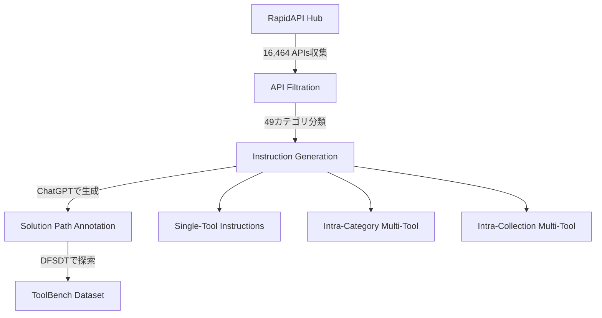
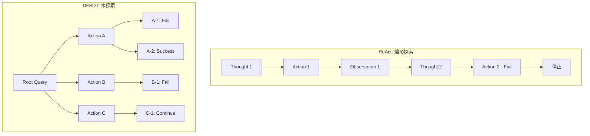

本記事は [ToolLLM: Facilitating Large Language Models to Master 16000+ Real-world APIs (arXiv:2307.16789)](https://arxiv.org/abs/2307.16789) の解説記事です。

## 論文概要（Abstract）

ToolLLMは、Tsinghua大学・Yale大学・RapidAPIの共同研究チームが2023年に発表した、LLMに大規模な実世界APIの利用能力を獲得させるフレームワークである。著者らはRapidAPIハブから16,464本のREST APIを収集し、ChatGPTを用いてマルチツール・マルチステップのInstruction-Tuningデータセット「ToolBench」を構築している。さらに、API呼び出しの探索を木構造で行うDFSDT（Depth-First Search-based Decision Tree）アルゴリズムを提案し、LLaMA-2をファインチューニングした「ToolLLaMA」がChatGPTと同等のPass Rateを達成したと報告している（論文Table 2より）。

この記事は [Zenn記事: AIエージェントのツール設計9原則：Anthropic実践知見に学ぶスキーマ・粒度・エラー戦略](https://zenn.dev/0h_n0/articles/d732816f6a3d7a) の深掘りです。

## 情報源

- **arXiv ID**: 2307.16789
- **URL**: [https://arxiv.org/abs/2307.16789](https://arxiv.org/abs/2307.16789)
- **著者**: Yujia Qin, Shihao Liang, Yining Ye, Kunlun Zhu et al.
- **発表年**: 2023
- **分野**: cs.CL, cs.AI
- **所属**: Tsinghua University, Yale University, RapidAPI
- **コード**: [github.com/OpenBMB/ToolBench](https://github.com/OpenBMB/ToolBench)（Apache 2.0）

## 背景と動機（Background & Motivation）

2023年時点で、ChatGPTのFunction Calling機能やLangChain等のフレームワークにより、LLMが外部ツールを呼び出す仕組みは急速に普及しつつあった。しかし、既存のツール利用研究には3つの制約があった。

第一に、ツールのスケールが限定的であった。従来のAPIBench（Gorilla）やAPI-Bank等のデータセットは数百規模のAPIを対象としており、実世界で利用可能な数万規模のAPIへのスケーラビリティが検証されていなかった。

第二に、既存のInstruction-Tuningデータセットは主にシングルツール呼び出しを扱っており、「ホテル検索 → 天気確認 → レストラン予約」のような複数APIを横断するマルチステップ・マルチツールのシナリオが不足していた。

第三に、API呼び出しの失敗処理が考慮されていなかった。実世界のAPIはレート制限・認証エラー・パラメータ不正等で頻繁に失敗する。従来の線形的なReAct方式（思考→行動→観察の繰り返し）では、一度失敗すると全体が停止するか誤った経路を進み続けるリスクがあった。

これらの課題に対し、著者らは16,000規模の実APIデータセットとバックトラック可能な木探索アルゴリズムを組み合わせたフレームワークを提案している。

## 主要な貢献（Key Contributions）

- **貢献1**: RapidAPIハブから16,464本のREST APIを収集し、49のカテゴリにわたるマルチツール・マルチステップのInstruction-Tuningデータセット「ToolBench」を構築
- **貢献2**: API呼び出し探索を木構造で行い、失敗ノードの記憶とバックトラックを可能にするDFSDTアルゴリズムの提案
- **貢献3**: ChatGPTベースの自動評価器「ToolEval」の設計（人間評価との相関 >0.7）
- **貢献4**: LLaMA-2 7Bをファインチューニングした「ToolLLaMA」がChatGPTと同等のツール利用性能を達成

## 技術的詳細（Technical Details）

### ToolBenchデータセットの構築

ToolBenchの構築パイプラインは以下の3段階で構成される。



**第1段階: API収集とフィルタリング**

RapidAPIハブから収集した各APIについて、JSONスキーマ形式でドキュメントを標準化している。1つのAPIドキュメントには以下のフィールドが含まれる。

```json
{
  "api_name": "Weather API",
  "api_description": "Real-time weather data for any location",
  "tool_name": "WeatherService",
  "category_name": "Weather",
  "required_parameters": [
    {
      "name": "location",
      "type": "STRING",
      "description": "City name or coordinates"
    }
  ],
  "optional_parameters": [
    {
      "name": "units",
      "type": "STRING",
      "description": "Temperature units: metric or imperial",
      "default": "metric"
    }
  ],
  "method": "GET",
  "template_response": {
    "temperature": "float",
    "humidity": "int",
    "description": "str"
  }
}
```

このJSONスキーマの品質がモデル性能に直結する点は特に重要である。著者らは、`api_description`が曖昧なAPI（例: "This API does stuff"）を除外し、パラメータの型情報や`template_response`が不完全なAPIも対象外としている（論文Section 3.1より）。

**第2段階: Instruction生成**

3種類の難易度のInstructionを生成している。

| レベル | 説明 | 例 |
|--------|------|-----|
| I1: Single-tool | 1つのツール内のAPIのみ使用 | 「東京の天気を教えて」 |
| I2: Intra-category | 同カテゴリ内の複数ツール使用 | 「天気と気温の両方を比較」 |
| I3: Intra-collection | 異なるカテゴリの複数ツール使用 | 「旅行先の天気を調べてホテルを予約」 |

各Instructionに対し、ChatGPTがDFSDTアルゴリズムに従って解答パスを生成し、成功したパスのみをデータセットに収録している。

### DFSDT（Depth-First Search-based Decision Tree）

DFSDTは本論文の中核的な技術貢献である。従来のReActフレームワークが単一パスの線形探索であるのに対し、DFSDTは複数の行動候補を木構造で展開し、失敗時にバックトラックする。

**DFSDTの擬似コード:**

```python
def dfsdt(
    query: str,
    api_pool: list[dict],
    max_depth: int = 6,
    max_children: int = 3,
) -> str | None:
    """DFSDT: Depth-First Search-based Decision Tree

    Args:
        query: ユーザの入力指示
        api_pool: 利用可能なAPIのJSONスキーマ一覧
        max_depth: 探索木の最大深さ
        max_children: 各ノードの子ノード数（展開幅）

    Returns:
        成功時は最終応答、全パス失敗時はNone
    """
    root = Node(state=query, depth=0)
    failed_memory: set[str] = set()  # 失敗ノードの記録
    stack: list[Node] = [root]

    while stack:
        node = stack.pop()

        if node.depth >= max_depth:
            continue

        # 子ノードを展開（max_children個の行動候補を生成）
        children = expand_node(
            node=node,
            api_pool=api_pool,
            n_candidates=max_children,
            failed_memory=failed_memory,
        )

        for child in children:
            # API呼び出しを実行
            observation = execute_api_call(child.action)

            if is_terminal_success(observation):
                return generate_final_answer(child)

            if is_failure(observation):
                # 失敗ノードを記録し、同じパスを再探索しない
                failed_memory.add(child.action_signature)
                continue

            child.observation = observation
            stack.append(child)

    return None  # 全パス失敗
```

**DFSDTとReActの構造的な違いを以下に示す:**



DFSDTの設計上の重要なポイントは**失敗ノードメモリ**（`failed_memory`）である。一度失敗したAPI呼び出しのシグネチャ（APIエンドポイント+パラメータの組み合わせ）を記録し、`expand_node`の段階で同一のAPI呼び出しを候補から除外する。これにより、同じ失敗を繰り返すことなく未探索の経路に計算資源を集中できる。

著者らは最大深さ6、展開幅3をデフォルト設定としている（論文Section 4.1より）。

### ToolEval: 自動評価フレームワーク

著者らはChatGPTを評価器として利用するToolEvalを提案している。2つの評価指標を定義している。

**Pass Rate**: タスクを完遂できたかの二値判定。ChatGPTがモデルの応答とタスク要件を比較し、成功/失敗を判定する。

**Win Rate**: 2つのモデルの応答を対で比較し、どちらが優れているかをChatGPTが判定する。

$$
\text{WinRate}(A, B) = \frac{1}{N} \sum_{i=1}^{N} \mathbb{1}[\text{ChatGPT prefers } A_i \text{ over } B_i]
$$

ここで $N$ はテストケース数、$A_i, B_i$ はそれぞれモデルA, Bのクエリ $i$ に対する応答である。

著者らは、ToolEvalの判定が人間評価者の判定と0.7以上の相関を持つことを確認している（論文Section 5.1より）。

## 実装のポイント（Implementation）

ToolLLMを実務で参考にする際の要点を整理する。

**JSONスキーマの品質管理が性能を左右する**: 著者らの実験では、`api_description`の記述品質がモデルのAPI選択精度に直接影響している。曖昧な記述（"A useful API"等）ではモデルが正しいAPIを選択できない。APIスキーマの設計に際しては、関連するZenn記事「[AIエージェントのツール設計9原則](https://zenn.dev/0h_n0/articles/d732816f6a3d7a)」で解説されている命名規則やパラメータ設計の原則が有効である。

**API呼び出しのリトライとタイムアウト設計**: DFSDTの`execute_api_call`において、実世界のREST APIはレート制限（HTTP 429）や一時的障害（HTTP 503）を返すことがある。論文では明示的なリトライ戦略の記述はないが、実運用ではExponential Backoff + Jitterによるリトライ、APIごとのタイムアウト設定（推奨: 10-30秒）が不可欠である。

**探索パラメータのチューニング**: max_depth=6, max_children=3は論文のデフォルト値だが、APIの応答速度やコスト制約に応じた調整が必要である。深さを増やすと成功率は上がるがレイテンシとAPIコストが指数的に増大する。実運用では、APIコストの上限を設定し、上限到達時に探索を打ち切る機構を追加することが望ましい。

**ファインチューニングデータの選別**: ToolBenchの全データでファインチューニングするよりも、対象ドメインに関連するAPIカテゴリのデータに絞った方が効率的な場合がある。著者らのコードベース（ToolBench GitHub）はApache 2.0ライセンスで公開されており、データセットのフィルタリングスクリプトも利用可能である。

## Production Deployment Guide

ToolLLMのようなマルチAPI呼び出しエージェントを本番環境にデプロイする際のAWS構成パターンを示す。DFSDTの木探索は複数のAPI呼び出しを逐次実行するため、レイテンシ管理とコスト制御が設計上の主要課題となる。

### AWS実装パターン（コスト最適化重視）

**トラフィック量別の推奨構成:**

| 構成 | トラフィック | アーキテクチャ | 月額コスト概算 |
|------|-------------|---------------|---------------|
| Small | ~100 req/日 | Lambda + Bedrock + DynamoDB | $80-200 |
| Medium | ~1,000 req/日 | ECS Fargate + Bedrock + ElastiCache | $400-900 |
| Large | 10,000+ req/日 | EKS + Spot Instances + Bedrock Batch | $2,500-6,000 |

**Small構成の設計ポイント**: DFSDTのmax_depth=6では1リクエストあたり最大18回のLLM呼び出しが発生する。Lambda（arm64, 1024MB）のタイムアウトは300秒に設定し、Bedrock推論ではHaiku（簡易タスク）とSonnet（複雑タスク）のカスケードでコストを抑える。DynamoDB（On-Demand）に`failed_memory`を永続化し、セッション間で失敗ノードを共有する。月額内訳: Lambda $5-10 + Bedrock $50-150 + DynamoDB $5-10。

**コスト削減テクニック**: Spot Instances（EKSワーカー）で最大90%削減、Reserved Instances（1年コミット）でFargateの最大72%削減、Bedrock Batch APIで非同期処理の50%削減、Prompt Caching（APIスキーマ共通部分）で30-90%削減。

> **注意**: コスト試算は記事生成時点（2026年5月）のAWS ap-northeast-1（東京）リージョン料金に基づく概算値です。実際のコストはトラフィックパターン、リージョン、バースト使用量により変動します。最新料金はAWS料金計算ツール（[https://calculator.aws/](https://calculator.aws/)）で確認してください。

### Terraformインフラコード

**Small構成（Serverless）-- 主要リソースの抜粋:**

```hcl
# ToolLLM Agent - Small構成 (Lambda + Bedrock + DynamoDB)
# terraform >= 1.8, aws provider ~> 5.50, ap-northeast-1

resource "aws_lambda_function" "dfsdt_agent" {
  function_name = "toolllm-dfsdt-agent"
  runtime       = "python3.12"
  handler       = "handler.lambda_handler"
  role          = aws_iam_role.agent_lambda.arn
  architectures = ["arm64"]   # Graviton: x86比20%安価
  memory_size   = 1024        # DFSDT探索木をメモリ上で管理
  timeout       = 300         # max_depth=6の探索に十分なタイムアウト
  environment {
    variables = {
      DFSDT_MAX_DEPTH    = "6"
      DFSDT_MAX_CHILDREN = "3"
      DYNAMODB_TABLE     = aws_dynamodb_table.failed_memory.name
      BEDROCK_MODEL_ID   = "anthropic.claude-3-5-sonnet-20241022-v2:0"
    }
  }
  tracing_config { mode = "Active" }  # X-Ray有効化
  filename      = "lambda_package.zip"
}

resource "aws_dynamodb_table" "failed_memory" {
  name         = "toolllm-failed-memory"
  billing_mode = "PAY_PER_REQUEST"
  hash_key     = "session_id"
  range_key    = "action_signature"
  attribute { name = "session_id"       type = "S" }
  attribute { name = "action_signature" type = "S" }
  ttl { attribute_name = "expires_at" enabled = true }
  server_side_encryption { enabled = true }
}
```

IAMロールはBedrock `InvokeModel`、DynamoDB `GetItem/PutItem/Query`、CloudWatch Logsの3サービスに最小権限で制限する。

Large構成ではEKS 1.30 + Karpenter NodePool（`capacity-type: ["spot", "on-demand"]`、Graviton m7g系インスタンス）でSpot優先の自動スケーリングを行い、AWS Budgets（月額$6,000上限、80%到達でメール通知）と併用する。

### 運用・監視設定

**CloudWatch Logs Insightsクエリ（トークン使用量の異常検知）:**

```
fields @timestamp, @message
| filter @message like /bedrock/
| stats sum(input_tokens) as total_input, sum(output_tokens) as total_output by bin(1h) as hour
| filter total_input > 500000
| sort hour desc
```

**X-Rayトレーシング設定（DFSDT探索の可視化）:**

```python
from aws_xray_sdk.core import xray_recorder, patch_all

patch_all()  # boto3自動計装

@xray_recorder.capture("dfsdt_exploration")
def dfsdt_step(node_id: str, depth: int, api_name: str) -> dict:
    """DFSDTの各探索ステップをX-Rayでトレース"""
    subsegment = xray_recorder.current_subsegment()
    subsegment.put_annotation("dfsdt_depth", depth)
    subsegment.put_annotation("api_name", api_name)
    subsegment.put_metadata("node_id", node_id, "dfsdt")
    # ... API呼び出し実行
    return result
```

CloudWatchアラームはBedrock `InputTokenCount` の1時間合計が100,000を超えた場合にSNS通知を発火させる。Cost Explorerの日次レポートでは、`Project=toolllm-agent`タグでフィルタリングし、$100/日超過時にSNS通知する構成とする。

### コスト最適化チェックリスト

| カテゴリ | チェック項目 |
|---------|------------|
| アーキテクチャ | トラフィック量で構成判断（Serverless/Hybrid/Container）、DFSDT探索深さに応じたタイムアウト設計 |
| リソース | Spot Instances優先（Karpenter自動フォールバック）、Reserved Instances 1年コミット、Lambda arm64 + Power Tuning |
| LLMコスト | Bedrock Batch API（非同期50%削減）、Prompt Caching（共通スキーマ）、Haiku/Sonnetカスケード、max_tokens制限、スキーマ圧縮 |
| 監視 | AWS Budgets月額上限、Bedrockトークン量アラーム、Cost Anomaly Detection、日次コストSNS通知 |
| リソース管理 | NAT Gateway不要時削除、Project/Env/Ownerタグ、DynamoDB TTL、開発環境夜間停止、ログ保持30日 |

## 実験結果（Results）

著者らはToolBenchテストセットを用いて、ToolLLaMAとベースラインモデルの性能を比較している。

### Pass Rate比較

以下は論文Table 2およびTable 3から抽出した主要な結果である。

| モデル | I1 Single-tool | I2 Intra-category | I3 Intra-collection |
|--------|---------------|-------------------|---------------------|
| ChatGPT + ReAct | 71.4% | 53.0% | 49.5% |
| ChatGPT + DFSDT | 76.8% | 63.0% | 57.5% |
| ToolLLaMA-7B + DFSDT | 71.8% | 55.0% | 50.5% |
| ToolLLaMA-13B + DFSDT | -- | -- | -- |
| GPT-4 + ReAct | 73.5% | 57.0% | 52.0% |

（論文Table 2, Table 3の値に基づく。一部のセルは論文中で未報告）

**注目すべき結果:**

- ToolLLaMA-7B + DFSDTは、Single-toolシナリオ（I1）でChatGPT + ReAct（71.4%）とほぼ同等の71.8%を達成している
- DFSDTアルゴリズムの効果は顕著で、ChatGPTにおいてReAct→DFSDTの切り替えでI1のPass Rateが71.4%→76.8%に向上している（+5.4pt）
- マルチツールシナリオ（I2, I3）ではシングルツールに比べてPass Rateが低下しており、複数APIの協調利用は依然として困難なタスクであることが示されている

### Win Rate比較

著者らはToolEvalのWin Rate指標でもモデル間の比較を行っている。ToolLLaMA + DFSDTはChatGPT + ReActに対してWin Rateで同等以上のスコアを記録したと報告している（論文Section 5.2より）。ただし、GPT-4 + DFSDTとの比較では一部のシナリオでToolLLaMAが劣後している。

### 失敗分析

著者らは失敗ケースの分析も行っており、主要な失敗原因として以下を挙げている（論文Section 5.3より）：
- **API選択の誤り**: 類似した機能を持つAPIの区別ができないケース
- **パラメータ生成の誤り**: 必須パラメータの欠落や型の不一致
- **探索の行き詰まり**: max_depth内で有効なパスが見つからないケース

## 実運用への応用（Practical Applications）

ToolLLMの知見は、現在のLLMエージェントシステムの設計に複数の実践的示唆を与えている。

**ツールスキーマの標準化**: 本論文がJSONスキーマ形式でAPIドキュメントを標準化したアプローチは、OpenAI Function CallingやAnthropic Tool Use等の現行APIにそのまま適用可能である。Zenn記事「[AIエージェントのツール設計9原則](https://zenn.dev/0h_n0/articles/d732816f6a3d7a)」で解説されている粒度設計やエラー戦略は、ToolBenchのJSONスキーマ設計と整合する。

**エラーハンドリングの木探索化**: DFSDTのバックトラック戦略は、LangGraphやCrewAI等のエージェントフレームワークにおけるエラーリカバリ設計に応用できる。単一パスの線形実行でなく、失敗時に代替パスを探索する設計パターンは、API呼び出し失敗が頻発する実運用環境で有効である。

**コスト制御の考慮**: DFSDTの木探索は最悪ケースで$3^6 = 729$回のLLM呼び出しが発生しうる。実運用ではAPI呼び出し回数の上限設定、探索の早期打ち切り条件（コスト上限・時間上限）、呼び出し結果のキャッシュ戦略が必須となる。

**評価パイプラインの自動化**: ToolEvalのChatGPTベース評価は、LLM-as-a-Judge手法のプロダクション適用例として参考になる。ただし、ToolEvalの人間評価との相関は0.7程度であり、安全性やコンプライアンスが求められるユースケースでは人間によるレビューとの併用が望ましい。

## 関連研究（Related Work）

- **Gorilla (Patil et al., 2023)**: APIBenchデータセットを用いてLLMのAPI呼び出し能力を評価した研究。ToolLLMはGorillaの約16倍のAPI規模（1,645 → 16,464）に拡張し、マルチツールシナリオを追加した点で差別化されている
- **API-Bank (Li et al., 2023)**: 53個のAPIを対象としたベンチマーク。ToolLLMと比較してスケールが小さいが、APIの呼び出し順序の制約（依存関係）を明示的にモデル化している点が特徴
- **ReAct (Yao et al., 2023)**: Reasoning + Actingを交互に行うフレームワーク。ToolLLMのDFSDTはReActの線形探索を木探索に拡張したものと位置付けられる
- **Toolformer (Schick et al., 2023)**: LLM自身にツール呼び出しの学習を行わせるアプローチ。教師なし学習でツール使用を獲得する点がToolLLMの教師ありInstruction-Tuningと対照的である

## まとめと今後の展望

ToolLLMは、16,464本の実世界REST APIを対象に、LLMのツール利用能力を大規模にスケールさせた研究である。DFSDTアルゴリズムによる失敗時のバックトラック、失敗ノードメモリによる重複探索の回避、そしてToolEvalによる自動評価の3つの技術的貢献は、現在のLLMエージェント開発の基盤的な設計パターンとなっている。

今後の課題として、著者らは以下を示唆している。第一に、APIのバージョン変更やエンドポイントの廃止への動的な対応。第二に、16,000規模のAPIから適切なサブセットを効率的に検索するAPI Retrieval機構の改善。第三に、プライバシーやセキュリティ上の制約がある企業内APIへの適用である。これらの課題は、2026年現在もエージェントシステムの設計における主要な研究テーマであり続けている。

## 参考文献

- **arXiv**: [https://arxiv.org/abs/2307.16789](https://arxiv.org/abs/2307.16789)
- **Code**: [https://github.com/OpenBMB/ToolBench](https://github.com/OpenBMB/ToolBench)（Apache 2.0）
- **Related Zenn article**: [https://zenn.dev/0h_n0/articles/d732816f6a3d7a](https://zenn.dev/0h_n0/articles/d732816f6a3d7a)
- **Gorilla**: Patil et al., "Gorilla: Large Language Model Connected with Massive APIs", arXiv:2305.15334, 2023
- **ReAct**: Yao et al., "ReAct: Synergizing Reasoning and Acting in Language Models", ICLR 2023
- **Toolformer**: Schick et al., "Toolformer: Language Models Can Teach Themselves to Use Tools", NeurIPS 2023
