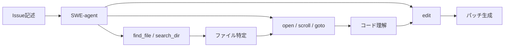

> **本記事は [SWE-agent: Agent-Computer Interfaces Enable Automated Software Engineering (arXiv:2405.15017)](https://arxiv.org/abs/2405.15017) の解説記事です。**

## 論文概要（Abstract）

SWE-agentは、LLMエージェントがソフトウェアエンジニアリングタスクを遂行する際の**Agent-Computer Interface（ACI）**の設計が性能に決定的な影響を与えることを示した研究である。著者らは、LLMに生のbashシェルを与える代わりに、ファイル閲覧・検索・編集を統合した専用インターフェースを設計し、ACI設計の4原則を定義した。著者らの報告によれば、GPT-4 Turboを用いた場合にSWE-benchで18.0%の解決率を達成し、生のbashシェル使用時の7.5%から大幅な改善を実現している。

この記事は [Zenn記事: AIエージェントのツール設計9原則：Anthropic実践知見に学ぶスキーマ・粒度・エラー戦略](https://zenn.dev/0h_n0/articles/d732816f6a3d7a) の深掘りです。

## 情報源

- **arXiv ID**: 2405.15017
- **URL**: [https://arxiv.org/abs/2405.15017](https://arxiv.org/abs/2405.15017)
- **著者**: John Yang, Carlos E. Jimenez, Alexander Wettig, Kilian Lieret, Shunyu Yao, Karthik Narasimhan, Ofir Press（Princeton University）
- **発表年**: 2024
- **分野**: cs.CL, cs.SE, cs.AI
- **コード**: [https://github.com/princeton-nlp/SWE-agent](https://github.com/princeton-nlp/SWE-agent)（MIT License）

## 背景と動機（Background & Motivation）

LLMをソフトウェアエンジニアリングタスクに適用する試みは近年活発化しているが、その多くはLLMに対してプロンプト設計やモデル選択の工夫に注力してきた。一方で、**LLMがコンピュータとやり取りするインターフェースそのもの**が性能のボトルネックとなりうることは十分に検討されていなかった。

人間のソフトウェアエンジニアがIDEやコードエディタなどの洗練されたHCI（Human-Computer Interface）を使うのと同様に、LLMエージェントにも適切なインターフェースが必要であるという発想が本研究の出発点である。生のbashシェルをそのまま与えた場合、LLMは冗長な出力に埋もれ、構文エラーを自己修正できず、ファイル内の正確な位置を見失うといった問題が頻発する。著者らはこの問題を**ACI（Agent-Computer Interface）**という概念で形式化し、HCIの知見をLLMエージェントに適用する設計原則を提案した。

## 主要な貢献（Key Contributions）

- **ACI概念の形式化**: LLMエージェントとコンピュータ間のインターフェース設計をACI（Agent-Computer Interface）として定義し、HCIのアナロジーを用いて体系的に議論する枠組みを提供
- **4つのACI設計原則**: (1) 簡潔なフィードバック、(2) コンテキスト管理、(3) ガードレール、(4) ツールバンドリングの4原則を定義し、各原則の貢献をアブレーション実験で定量的に検証
- **SWE-benchでの成果**: カスタムACIを用いたGPT-4 Turboで18.0%の解決率を達成。生のbashシェル（7.5%）に対して2.4倍の性能向上を報告
- **オープンソース公開**: SWE-agentのコードベースをMITライセンスで公開し、研究コミュニティでの再現・拡張を可能にした

## 技術的詳細（Technical Details）

### ACI 4原則の形式化

著者らが定義した4つのACI設計原則は以下の通りである。

**原則1: 簡潔なフィードバック（Simple, Concise Feedback）**

コマンド実行結果をLLMに返す際、生の出力をそのまま渡すのではなく、構造化された簡潔なフィードバックに変換する。例えば、ファイル編集成功時には編集前後のdiffではなく「File {filename} has been edited. Here's the result of running `cat -n` on a snippet of the edited file:」という定型メッセージと該当箇所の抜粋を返す。エラーメッセージには**次に取るべきアクションの示唆**を含める。

**原則2: コンテキスト管理（Context Management）**

LLMのコンテキストウィンドウは有限であるため、出力を最大100行に制限する。この制限により、大きなファイルの`cat`やディレクトリの`ls`が数千行の出力を生成してコンテキストを汚染することを防ぐ。

$$
\text{output}(cmd) = \text{truncate}(\text{raw\_output}(cmd), L_{\max})
$$

ここで、
- $\text{raw\_output}(cmd)$: コマンド $cmd$ の生の出力
- $L_{\max}$: 出力行数の上限（論文では $L_{\max} = 100$）
- $\text{truncate}(s, n)$: 文字列 $s$ を先頭 $n$ 行で切り詰める関数

**原則3: ガードレール（Guardrails）**

エージェントが不正な操作を行った際に、エラーを検知して回復を支援する仕組みを提供する。例えば、`edit`コマンドで構文エラーを含む編集を行った場合、変更を自動でロールバックし、構文エラーの内容と修正方法を提示する。これにより、エージェントがエラー状態から抜け出せなくなるデッドロックを防止する。

**原則4: ツールバンドリング（Tool Bundling）**

検索・閲覧・編集を個別のコマンドではなく、相互に連携した統合ツールセットとして設計する。`find_file`でファイルを特定し、`open`でファイルを閲覧し、`edit`で修正するという一連のワークフローが自然に実行できるようにツール間の受け渡しを設計する。

### SWE-agentのツールセット



SWE-agentが提供する主要ツールは3カテゴリに分かれる。

**検索ツール**: `find_file`（ファイル名検索）、`search_file`（ファイル内テキスト検索）、`search_dir`（ディレクトリ横断検索）。これらはgrepやfindのラッパーだが、出力を構造化し、結果件数とファイルパスを明示的に返す。

**閲覧ツール**: `open`（ファイルを開く）、`goto`（指定行へ移動）、`scroll_up` / `scroll_down`（スクロール）。ファイルビューアは現在の表示範囲（ウィンドウ）の概念を持ち、一度に100行を表示する。各行には行番号が付与され、LLMが正確な位置を把握できるようにする。

**編集ツール**: `edit <start_line>:<end_line>`形式で行範囲を指定して編集する。編集後は自動的に構文チェックが実行され、構文エラーがある場合はロールバックされる。

### インタラクションループの設計

```python
def swe_agent_loop(issue: str, model: str, max_turns: int = 50) -> str:
    """SWE-agentのメインループ（論文の設計を擬似コードで表現）"""
    history: list[dict] = []
    for turn in range(max_turns):
        action = llm_generate(model=model, history=history, issue=issue)
        if action.type == "submit":
            return generate_patch()
        raw_output = execute_command(action.command)
        feedback = format_feedback(raw_output, max_lines=100)  # 原則2
        if has_syntax_error(action.command, raw_output):        # 原則3
            rollback_edit()
            feedback = format_error_with_suggestion(raw_output)
        history.append({"action": action, "feedback": feedback})
    return generate_patch()
```

各ターンでLLMは思考（thought）とアクション（action）を生成し、環境からの観察（observation）を受け取る。このthought-action-observationのサイクルはReActフレームワークに基づいている。論文ではタスクあたり最大50ターンが許容され、各ターンのコスト（トークン数、API料金）も追跡されている。

### ツール記述の設計

著者らはLLMがツールを正しく使用するために、ツール記述に具体的な使用例を含めることの重要性を強調している。例えば`edit`コマンドの記述には`edit 1:3\nimport os\nend_of_edit`のような具体的な使用例が含まれる。ツール記述に使用例を含めることで、LLMがコマンドの正しい構文を学習し、構文エラーの発生率が低下することが著者らの実験で確認されている。

## 実装のポイント（Implementation）

SWE-agentを実際に構築・運用する際の技術的なポイントは以下の通りである。

**環境の再現性**: 各タスクはDockerコンテナ内で実行される。SWE-benchのタスクごとにリポジトリの正確なバージョンが復元され、依存関係のインストールやテスト実行が独立した環境で行われる。これにより、タスク間の干渉を防止し、結果の再現性を保証している。

**スクラッチパッド機能**: ファイルビューアにはスクラッチパッド（メモ領域）が統合されており、エージェントがタスク遂行中に発見した情報や仮説を記録できる。これはLLMのコンテキストウィンドウの制約を補完する仕組みである。

**エラー回復の設計**: 構文エラー時の自動ロールバックに加え、エラーメッセージには「次に何をすべきか」の提案が含まれる。生のPythonトレースバックではなく、「Your edit introduced a syntax error on line 42. The edit has been reverted. Please fix the error and try again.」のような構造化メッセージを返す。

**コスト管理**: 各ターンのAPI呼び出しコストが記録され、タスクあたりの総コストが追跡される。論文ではGPT-4 Turboを使用した場合のタスクあたり平均コストも報告されている。

## Production Deployment Guide

SWE-agentのACI設計原則を本番環境のコード修正自動化システムとして展開するためのAWS実装パターンを示す。

### AWS実装パターン（コスト最適化重視）

SWE-agentライクなシステムは、GitHub Issueをトリガーにコンテナ内でLLMエージェントがコード修正を行うバッチ処理パターンである。以下は2026年5月時点のAWS ap-northeast-1（東京）リージョンの概算料金に基づく。実際のコストはトラフィックパターンやトークン消費量により変動するため、最新料金はAWS料金計算ツールで確認を推奨する。

| 構成 | トラフィック | 主要サービス | 月額概算 |
|------|-------------|-------------|----------|
| Small | ~50タスク/日 | Lambda + CodeBuild + Bedrock | $100-250 |
| Medium | ~300タスク/日 | ECS Fargate + SQS + Bedrock | $500-1,200 |
| Large | 1000+タスク/日 | EKS + Karpenter + Spot + Bedrock | $2,500-6,000 |

**Small構成**: Webhook → Lambda → CodeBuildでDockerコンテナ起動。CodeBuildは実行時間課金のためアイドル時コストゼロ。**Medium構成**: ECS Fargate + SQSキュー。タスク単位のスケーリングでコンテナ分離を実現。**Large構成**: EKS + KarpenterでSpot Instance自動スケーリング。Pod単位のリソース制限・ネットワーク分離を適用。

**コスト削減テクニック**: Bedrock Batch API（50%削減）、Prompt Caching（30-90%削減）、Spot Instances（最大90%削減）、Fargate Savings Plans（最大52%削減）

### Terraformインフラコード

**Small構成（Serverless: CodeBuild + Lambda + Bedrock）**

```hcl
# SWE-agent Small構成 - CodeBuild + Lambda + Bedrock
# 2026-05-04時点 / Terraform >= 1.8, AWS provider ~> 5.50

# IAMロール（最小権限: CodeBuild起動 + DynamoDB + CloudWatch Logs のみ）
resource "aws_iam_role" "swe_agent_lambda" {
  name               = "swe-agent-lambda-role"
  assume_role_policy = jsonencode({
    Version   = "2012-10-17"
    Statement = [{ Action = "sts:AssumeRole", Effect = "Allow",
                    Principal = { Service = "lambda.amazonaws.com" } }]
  })
}

# DynamoDB（タスク状態管理、On-Demand + KMS暗号化 + PITR有効）
resource "aws_dynamodb_table" "swe_agent_tasks" {
  name         = "swe-agent-tasks"
  billing_mode = "PAY_PER_REQUEST"
  hash_key     = "task_id"
  attribute { name = "task_id"; type = "S" }
  server_side_encryption { enabled = true }
  point_in_time_recovery { enabled = true }
}

# CodeBuild（エージェント実行環境: 7GB RAM, 4 vCPU）
resource "aws_codebuild_project" "swe_agent" {
  name         = "swe-agent-runner"
  service_role = aws_iam_role.swe_agent_codebuild.arn
  artifacts    { type = "NO_ARTIFACTS" }
  environment {
    compute_type    = "BUILD_GENERAL1_MEDIUM"
    image           = "aws/codebuild/standard:7.0"
    type            = "LINUX_CONTAINER"
    privileged_mode = false
    environment_variable {
      name  = "BEDROCK_MODEL_ID"
      value = "anthropic.claude-sonnet-4-20250514"
    }
  }
  source { type = "NO_SOURCE"; buildspec = file("buildspec-swe-agent.yml") }
}
```

**Large構成（Container: EKS + Karpenter + Spot）**

```hcl
# EKS 1.30 + Karpenter（Spot優先で最大90%コスト削減）
module "eks" {
  source  = "terraform-aws-modules/eks/aws"
  version = "~> 20.14"
  cluster_name    = "swe-agent-cluster"
  cluster_version = "1.30"
  vpc_id     = module.vpc.vpc_id
  subnet_ids = module.vpc.private_subnets
  cluster_endpoint_private_access = true
}

# Karpenter NodePool: spot優先、m7i/m7a/m6i/c7i.xlarge
resource "kubectl_manifest" "karpenter_nodepool" {
  yaml_body = yamlencode({
    apiVersion = "karpenter.sh/v1"
    kind       = "NodePool"
    metadata   = { name = "swe-agent-tasks" }
    spec = {
      template.spec.requirements = [
        { key = "karpenter.sh/capacity-type", operator = "In", values = ["spot", "on-demand"] },
        { key = "node.kubernetes.io/instance-type", operator = "In",
          values = ["m7i.xlarge", "m7a.xlarge", "m6i.xlarge", "c7i.xlarge"] },
      ]
      limits     = { cpu = "160", memory = "640Gi" }
      disruption = { consolidationPolicy = "WhenEmptyOrUnderutilized", consolidateAfter = "30s" }
    }
  })
}

# Secrets Manager（KMS暗号化）+ AWS Budgets（月額$6,000の80%でアラート）
resource "aws_secretsmanager_secret" "swe_agent_config" {
  name       = "swe-agent/config"
  kms_key_id = aws_kms_key.swe_agent.arn
}
```

### 運用・監視設定

**CloudWatch Logs Insights クエリ（タスク成功率・コスト異常検知）**

```
fields @timestamp, task_id, status, total_turns, total_tokens
| filter @logGroup = "/aws/codebuild/swe-agent"
| stats count() as total,
        sum(case when status = "resolved" then 1 else 0 end) as resolved,
        avg(total_turns) as avg_turns,
        sum(total_tokens) as total_tokens
  by bin(1h)
| sort @timestamp desc
```

**CloudWatchアラーム + X-Ray + Cost Explorer（Python boto3）**

```python
import boto3
from datetime import date, timedelta
from aws_xray_sdk.core import xray_recorder, patch_all

patch_all()  # boto3自動計装

def create_bedrock_token_alarm(topic_arn: str) -> None:
    """Bedrockトークン使用量スパイク検知（1時間50万トークン超過）"""
    boto3.client("cloudwatch").put_metric_alarm(
        AlarmName="swe-agent-bedrock-token-spike",
        MetricName="InputTokenCount",
        Namespace="AWS/Bedrock",
        Statistic="Sum",
        Period=3600,
        EvaluationPeriods=1,
        Threshold=500000,
        ComparisonOperator="GreaterThanThreshold",
        AlarmActions=[topic_arn],
        Dimensions=[{"Name": "ModelId", "Value": "anthropic.claude-sonnet-4-20250514"}],
    )

@xray_recorder.capture("swe_agent_task")
def run_swe_agent_task(task_id: str, issue_body: str) -> dict:
    """X-Rayトレース付きタスク実行"""
    sub = xray_recorder.current_subsegment()
    sub.put_annotation("task_id", task_id)
    result = execute_agent(task_id, issue_body)
    sub.put_metadata("total_turns", result["turns"])
    return result

def daily_cost_report(topic_arn: str) -> None:
    """日次コストレポート取得、$100/日超過でSNS通知"""
    today = date.today()
    resp = boto3.client("ce").get_cost_and_usage(
        TimePeriod={"Start": (today - timedelta(days=1)).isoformat(), "End": today.isoformat()},
        Granularity="DAILY", Metrics=["UnblendedCost"],
        Filter={"Tags": {"Key": "Project", "Values": ["swe-agent"]}},
        GroupBy=[{"Type": "DIMENSION", "Key": "SERVICE"}],
    )
    total = sum(float(g["Metrics"]["UnblendedCost"]["Amount"])
                for r in resp["ResultsByTime"] for g in r["Groups"])
    if total > 100:
        boto3.client("sns").publish(
            TopicArn=topic_arn, Subject="SWE-agent Cost Alert",
            Message=f"Daily cost: ${total:.2f} (threshold: $100)")
```

### コスト最適化チェックリスト

**アーキテクチャ選択**: タスク量で判断（~50/日: Serverless、~300/日: Fargate、1000+/日: EKS+Spot）

**リソース最適化**:
- [ ] Spot Instances優先（Karpenter設定）
- [ ] Fargate Savings Plans（1年コミット、最大52%削減）
- [ ] CodeBuild Docker layer caching有効化
- [ ] Lambda Power Tuningでメモリ最適化
- [ ] Karpenter consolidationPolicyでアイドルノード削除

**LLMコスト削減**:
- [ ] Bedrock Batch API（非リアルタイムで50%削減）
- [ ] Prompt Caching（システムプロンプト共有で30-90%削減）
- [ ] モデル振り分け（簡易タスク: Haiku、複雑: Sonnet）
- [ ] 最大ターン数50、出力100行制限でトークン抑制

**監視・リソース管理**:
- [ ] AWS Budgets（月額80%でアラート）+ Cost Anomaly Detection
- [ ] CloudWatchアラーム + 日次コストレポート（SNS）
- [ ] ECRライフサイクルポリシー + Logsの保持期間設定
- [ ] タグ戦略（Project=swe-agent）+ 開発環境夜間停止

## 実験結果（Results）

### SWE-benchでの評価

著者らはSWE-bench（実際のGitHubリポジトリから収集された2,294件のソフトウェアエンジニアリングタスク）およびSWE-bench Lite（300件のサブセット）で評価を行った。

| モデル + インターフェース | SWE-bench (%) | SWE-bench Lite (%) |
|-------------------------|---------------|-------------------|
| GPT-4 Turbo + SWE-agent ACI | **12.47** | **18.00** |
| GPT-4 Turbo + Shell-only | 1.74 | 7.50 |
| Claude 3 Opus + SWE-agent ACI | **10.46** | **15.33** |
| Claude 3 Opus + Shell-only | 3.01 | 6.67 |

（数値は論文Table 1およびTable 2より）

SWE-bench Liteにおいて、GPT-4 TurboでSWE-agent ACIを使用した場合の18.0%は、Shell-onlyの7.5%に対して2.4倍の解決率である。著者らはこの差がモデル能力の違いではなく、インターフェース設計の違いに起因すると主張している。

### アブレーション実験

著者らは各ACI原則の貢献を定量化するアブレーション実験を実施している。具体的には、ファイルビューア（閲覧ツール）を除去した場合、編集のガードレールを除去した場合、検索ツールを除去した場合のそれぞれで性能が低下することが確認されている。特にファイルビューアの除去は最も大きな性能低下を引き起こしたと報告されている。

### コスト分析

著者らの報告では、GPT-4 TurboでのSWE-bench Liteタスクあたりの平均コストは約$1.50-$4.00であり、平均ターン数は約20-30ターンである（論文のコスト分析セクションより）。タスクの複雑さにより大きなばらつきがあるが、コンテキスト管理（出力100行制限）がトークン消費の抑制に寄与していると著者らは報告している。

## 実運用への応用（Practical Applications）

SWE-agentのACI設計原則は、Zenn記事「[AIエージェントのツール設計9原則](https://zenn.dev/0h_n0/articles/d732816f6a3d7a)」で解説されているAnthropicのツール設計原則と多くの共通点を持つ。

**ツール記述の設計**: SWE-agentの「使用例をツール記述に含める」原則は、Anthropicの「明確なツールスキーマ設計」と対応する。本番環境でのエージェントツール設計において、入出力の具体例をスキーマに含めることはLLMの正しいツール使用率を向上させる実践知見である。

**エラーハンドリング**: SWE-agentの「ガードレール」（構文エラー時のロールバック+次のアクション提案）は、Anthropicの「エラー戦略」と対応する。エラーメッセージに回復手順を含めることで、エージェントがエラーループに陥るリスクを低減できる。

**コンテキストウィンドウ管理**: 出力の100行制限は、実運用でのLLMエージェントにおけるコンテキスト汚染対策として直接適用可能である。RAGパイプラインやログ解析エージェントにおいても、取得情報量の上限設定はコスト効率と精度の両面で有効となりうる。

**ツールの粒度設計**: 検索・閲覧・編集を統合したツールバンドリングは、エージェントのワークフロー全体を考慮したツール粒度設計の好例であり、個別コマンドの羅列よりも高い成功率を実現している。

## 関連研究（Related Work）

- **Devin (Cognition, 2024)**: 商用のAIソフトウェアエンジニアリングエージェント。SWE-agentと同時期に発表され、SWE-benchでの評価が行われた。SWE-agentはオープンソースであり、ACI設計原則を学術的に形式化した点で差別化される
- **ReAct (Yao et al., 2023)**: LLMエージェントの思考-行動-観察ループを定式化したフレームワーク。SWE-agentのインタラクションループはReActの枠組みを継承している
- **Agentless (Xia et al., 2024)**: エージェントループを使わず、LLMに直接パッチ生成を行わせるアプローチ。SWE-agentのインタラクティブなアプローチと対照的であり、タスクの複雑さに応じた使い分けが示唆される
- **OpenHands / OpenDevin**: オープンソースのソフトウェアエンジニアリングエージェントプラットフォーム。SWE-agentのACI概念を発展させ、より汎用的なインターフェース設計を追求している

## まとめと今後の展望

SWE-agentは、LLMエージェントの性能がモデル能力だけでなく**インターフェース設計**に大きく依存することを定量的に示した研究である。ACI 4原則（簡潔なフィードバック、コンテキスト管理、ガードレール、ツールバンドリング）は、ソフトウェアエンジニアリングに限らず、LLMエージェント全般のツール設計指針として広く参照されている。

今後の方向性として、著者らはACI設計の自動最適化（メタ学習によるツール記述の改善）、マルチエージェントでの協調的ACI設計、より長いコンテキストウィンドウを活用した設計の再検討を挙げている。また、SWE-benchの解決率は2024年時点で18%であり、残りの82%のタスクへの対応が継続的な課題となっている。

## 参考文献

- **arXiv**: [https://arxiv.org/abs/2405.15017](https://arxiv.org/abs/2405.15017)
- **Code**: [https://github.com/princeton-nlp/SWE-agent](https://github.com/princeton-nlp/SWE-agent)（MIT License）
- **SWE-bench**: [https://www.swebench.com/](https://www.swebench.com/)
- **Related Zenn article**: [AIエージェントのツール設計9原則：Anthropic実践知見に学ぶスキーマ・粒度・エラー戦略](https://zenn.dev/0h_n0/articles/d732816f6a3d7a)
