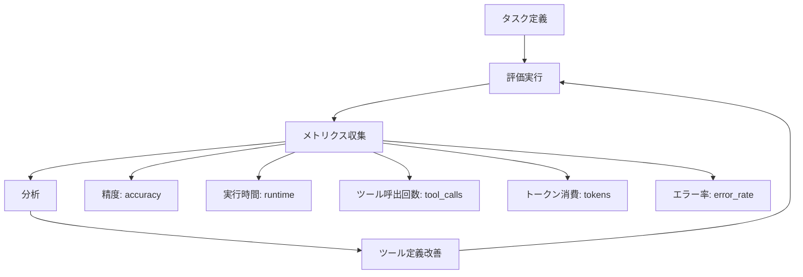
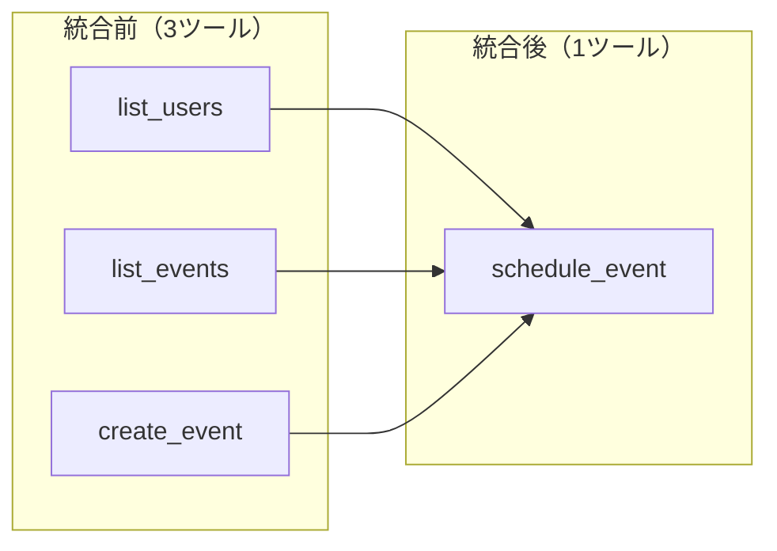

# Anthropicエンジニアリングブログ解説: AIエージェントのための効果的なツール設計

## ブログ概要

本記事は <https://www.anthropic.com/engineering/writing-tools-for-agents> の解説記事です。

Anthropicのエンジニアリングチーム（Ken Aizawa他、Barry Zhang, Zachary Witten, Daniel Jiang等多数の貢献者）は、AIエージェントが外部システムと対話するための「ツール」設計に関する実践的ガイドを2025年9月11日に公開した。ブログの中核的な主張は、ツールを**「決定論的システムと非決定論的エージェントの間の契約（contract）」**として捉えるべきだという点である。Anthropicのチームは、社内でClaude Codeのツール実装を繰り返し最適化した経験から得られた知見を体系化し、ツール選定・粒度設計・命名規則・レスポンス最適化・エラーハンドリング・ツール記述の6つの設計原則として整理している。

この記事は [Zenn記事: AIエージェントのツール設計9原則：Anthropic実践知見に学ぶスキーマ・粒度・エラー戦略](https://zenn.dev/0h_n0/articles/d732816f6a3d7a) の深掘りです。

---

## 情報源

- **種別**: 企業テックブログ
- **URL**: [https://www.anthropic.com/engineering/writing-tools-for-agents](https://www.anthropic.com/engineering/writing-tools-for-agents)
- **組織**: Anthropic Engineering
- **著者**: Ken Aizawa
- **貢献者**: Barry Zhang, Zachary Witten, Daniel Jiang, David Hershey, Prithvi Rajasakeran, Sam Seto, Teddy Ni, Kunal Agarwal, Beyang Liu, Michael Gerstenhaber他
- **公開日**: 2025年9月11日

---

## 技術的背景

### 従来のAPI設計とエージェント向けツール設計の本質的差異

従来のREST API設計は、人間の開発者が事前にドキュメントを読みクライアントコードを書くことを前提としている。一方、AIエージェント向けのツール設計では、エージェントが**推論時にツールの記述文を読んで呼び出し方を判断する**という根本的な違いがある。Anthropicのチームは、ツールを「決定論的システムと非決定論的エージェントの間の契約」と位置づけている。この「契約」は以下の3つの側面を持つ。

1. **ツールスキーマ**: 入力パラメータの型・制約・デフォルト値
2. **ツール記述**: エージェントがツールの用途・使い方を理解するための自然言語説明
3. **レスポンス形式**: エージェントが次の行動を判断するための構造化された出力

従来のAPI設計原則（RESTful, GraphQL等）は引き続き有効だが、エージェント向けツールでは「消費者がLLMである」という制約が加わる。LLMはドキュメントを事前学習するのではなく、コンテキストウィンドウ内のツール定義をリアルタイムに解釈する。したがって、ツール名・パラメータ名・記述文のすべてがモデルの推論精度に直接影響する。

### MCPの役割

ブログではModel Context Protocol（MCP）がツール提供の標準インターフェースとして言及されている。MCPサーバーは外部サービスをツールとしてエージェントに公開するための標準化されたプロトコルであり、`claude mcp add`コマンドでDesktop拡張としてローカル環境に追加できる。MCPの採用により、ツールの実装と提供が分離され、同一のツール定義を複数のエージェント環境で再利用できるようになる。

---

## 実装アーキテクチャ

### 評価駆動開発（Evaluation-Driven Development）

Anthropicのチームは、ツール設計の改善プロセスとして評価駆動開発を採用したと報告している。このアプローチの要点は、ツールの品質をエージェントの**タスク完了率**で定量的に測定し、ツール定義の変更がどの程度パフォーマンスに影響するかを継続的に追跡する点にある。



Anthropicのチームは、評価タスクの設計にあたって以下の条件を設定したと述べている。

- **マルチステップ・マルチツール**: 単一ツール呼び出しで完了するタスクではなく、複数のツールを組み合わせる必要がある複雑なタスク
- **5つの主要メトリクス**: 精度（accuracy）、実行時間（runtime）、ツール呼び出し回数（tool call counts）、トークン消費量（token consumption）、エラー率（error rates）

具体的な改善事例として、Claudeが検索クエリに不要な「2025」を付加する問題が報告されている。これはツール記述の曖昧さに起因しており、記述文を明確化することで解消された。この事例は、ツール設計の改善がモデル自体の変更ではなく、**ツール記述の精緻化**によって実現できることを示す好例である。

### ツール選定の原則

Anthropicのチームは「ツールが多ければ多いほど良いわけではない」と明確に述べている。この主張は、以下の設計判断に具体化されている。

**エージェント最適化されたツール設計**: 従来のCRUD APIでは`list_contacts`のような全件取得エンドポイントが一般的だが、エージェント向けには`search_contacts`のようにエージェントの意図に直接対応するツールが望ましい。全件取得はエージェントに結果のフィルタリングを強いるが、検索ツールはエージェントの意図をパラメータとして受け取り、関連する結果のみを返す。

**ツールの統合（Consolidation）**: 個別のエンドポイント（`list_users`, `list_events`, `create_event`）を`schedule_event`のような統合ツールに集約する設計が推奨されている。統合ツールはエージェントのツール選択の認知負荷を下げ、誤ったツール選択のリスクを減少させる。



### 命名規則と名前空間

ツール名の設計がエージェントの推論精度に影響を与えるという知見は実務的に重要である。Anthropicのチームは以下の命名規則を推奨している。

**プレフィックスによる名前空間**: 複数のサービスにまたがるツールを提供する場合、`asana_search`, `jira_search`のようにサービス名をプレフィックスとして付与する。ブログによると、プレフィックスとサフィックスの配置がツール使用の評価結果に「非自明な影響（non-trivial effects）」を与えたと報告されている。

**セマンティック識別子の使用**: UUIDのような不透明な識別子ではなく、人間にも意味が分かるセマンティック識別子を返すべきだとされている。例えば、ユーザーIDとして`a1b2c3d4-e5f6-7890`を返す代わりに`user:john.doe`のような識別子を返す。Anthropicのチームは、セマンティック識別子の採用によりエージェントの識別子ハルシネーションが減少したと報告している。

---

## Production Deployment Guide

### AWS実装パターン（コスト最適化重視）

ブログで示されたMCPベースのツールシステムをAWS上でプロダクション運用する場合の推奨構成を示す。コスト試算は2026年5月時点のap-northeast-1（東京）リージョン料金に基づく概算値であり、実際のコストはリクエストパターン、ツール呼び出し頻度、レスポンスサイズにより変動する。最新料金はAWS料金計算ツールで確認を推奨する。

| 構成 | トラフィック | AWS構成 | 月額概算 |
|------|-------------|---------|---------|
| **Small** | ~100 req/日 | Lambda + API Gateway + DynamoDB + Bedrock | $50-150 |
| **Medium** | ~1000 req/日 | ECS Fargate + ALB + DynamoDB + Bedrock + ElastiCache | $300-800 |
| **Large** | 10000+ req/日 | EKS + Karpenter(Spot) + DynamoDB + Bedrock + ElastiCache + SQS | $2,000-5,000 |

**Small構成の内訳**:
- Lambda（MCPサーバー実行、ツールディスパッチ）: ~$5/月（256MB, 平均2秒実行 x 100回/日）
- API Gateway（REST/WebSocket）: ~$5/月
- DynamoDB On-Demand（ツール定義・セッション状態）: ~$3/月
- Bedrock API（Claude Sonnet）: ~$30-130/月（入力500K + 出力200Kトークン/日）
- CloudWatch Logs: ~$5/月

**Large構成の内訳**:
- EKS コントロールプレーン: ~$75/月
- EC2 Spot Instances（m6i.xlarge x 3, Karpenter管理）: ~$200-400/月（Spot割引70-90%適用）
- Bedrock API（Claude Sonnet, 高頻度呼び出し）: ~$1,500-3,500/月
- DynamoDB On-Demand（ツール定義・評価結果・セッション状態）: ~$30/月
- ElastiCache（Redis, ツール定義キャッシュ）: ~$100/月
- SQS（非同期ツール呼び出しキュー）: ~$5/月
- ALB: ~$30/月

**コスト削減テクニック**:
- **Spot Instances**: EKSワーカーノードをSpot優先にすることで最大90%削減
- **Reserved Instances**: 1年コミットで最大72%削減（Large構成のベースライン負荷向け）
- **Bedrock Batch API**: 評価実行やバッチ処理に適用で50%削減
- **Prompt Caching**: ツール定義をシステムプロンプトに含めてキャッシュすることで30-90%削減

### Terraformインフラコード

**Small構成（Serverless）**:

```hcl
# --- DynamoDB（ツール定義 + セッション状態） ---
resource "aws_dynamodb_table" "tool_definitions" {
  name         = "mcp-tool-definitions"
  billing_mode = "PAY_PER_REQUEST"
  hash_key     = "tool_name"
  range_key    = "namespace"

  attribute {
    name = "tool_name"
    type = "S"
  }
  attribute {
    name = "namespace"
    type = "S"
  }

  server_side_encryption { enabled = true }
  tags = { Service = "mcp-tool-system" }
}

# --- IAMロール（最小権限） ---
resource "aws_iam_role" "mcp_lambda_role" {
  name = "mcp-tool-lambda-role"
  assume_role_policy = jsonencode({
    Version = "2012-10-17"
    Statement = [{
      Action    = "sts:AssumeRole"
      Effect    = "Allow"
      Principal = { Service = "lambda.amazonaws.com" }
    }]
  })
}

resource "aws_iam_role_policy" "mcp_lambda_policy" {
  name = "mcp-tool-lambda-policy"
  role = aws_iam_role.mcp_lambda_role.id
  policy = jsonencode({
    Version = "2012-10-17"
    Statement = [
      {
        Effect   = "Allow"
        Action   = ["dynamodb:GetItem", "dynamodb:Query", "dynamodb:PutItem"]
        Resource = aws_dynamodb_table.tool_definitions.arn
      },
      {
        Effect   = "Allow"
        Action   = ["bedrock:InvokeModel"]
        Resource = "arn:aws:bedrock:ap-northeast-1::foundation-model/anthropic.claude-*"
      },
      {
        Effect   = "Allow"
        Action   = ["logs:CreateLogGroup", "logs:CreateLogStream", "logs:PutLogEvents"]
        Resource = "arn:aws:logs:*:*:*"
      }
    ]
  })
}

# --- Lambda関数（MCPツールディスパッチ） ---
resource "aws_lambda_function" "mcp_dispatcher" {
  function_name = "mcp-tool-dispatcher"
  runtime       = "python3.12"
  handler       = "handler.lambda_handler"
  role          = aws_iam_role.mcp_lambda_role.arn
  memory_size   = 256
  timeout       = 30
  filename      = "lambda_package.zip"

  environment {
    variables = {
      TOOL_TABLE_NAME = aws_dynamodb_table.tool_definitions.name
      BEDROCK_REGION  = "ap-northeast-1"
    }
  }
  tracing_config { mode = "Active" }
  tags = { Service = "mcp-tool-system" }
}
```

**Large構成（Container + EKS）**:

```hcl
module "eks" {
  source          = "terraform-aws-modules/eks/aws"
  version         = "~> 20.0"
  cluster_name    = "mcp-tool-cluster"
  cluster_version = "1.31"
  vpc_id          = module.vpc.vpc_id
  subnet_ids      = module.vpc.private_subnets

  eks_managed_node_groups = {
    spot_workers = {
      capacity_type  = "SPOT"
      instance_types = ["m6i.xlarge", "m6a.xlarge", "m5.xlarge"]
      min_size = 1; max_size = 10; desired_size = 3
    }
  }
  tags = { Service = "mcp-tool-system" }
}

resource "aws_budgets_budget" "mcp_monthly" {
  name         = "mcp-tool-monthly-budget"
  budget_type  = "COST"
  limit_amount = "5000"
  limit_unit   = "USD"
  time_unit    = "MONTHLY"

  notification {
    comparison_operator        = "GREATER_THAN"
    threshold                  = 80
    threshold_type             = "PERCENTAGE"
    notification_type          = "ACTUAL"
    subscriber_email_addresses = ["ops@example.com"]
  }
}
```

### 運用・監視設定

**CloudWatch Logs Insights クエリ**（トークン使用量の異常検知）:

```
fields @timestamp, @message
| filter @message like /tool_call/
| stats count() as call_count, sum(token_count) as total_tokens by bin(1h)
| sort @timestamp desc
| limit 24
```

**CloudWatchアラーム + X-Rayトレーシング設定**（Python boto3）:

```python
import boto3
from aws_xray_sdk.core import xray_recorder, patch_all

patch_all()
cloudwatch = boto3.client("cloudwatch", region_name="ap-northeast-1")


def create_token_spike_alarm(function_name: str, threshold: float = 100000) -> None:
    """Bedrockトークン使用量スパイク検知アラームを作成する

    Args:
        function_name: 監視対象Lambda関数名
        threshold: 1時間あたりのトークン閾値
    """
    cloudwatch.put_metric_alarm(
        AlarmName=f"mcp-token-spike-{function_name}",
        MetricName="InputTokenCount",
        Namespace="AWS/Bedrock",
        Statistic="Sum",
        Period=3600,
        EvaluationPeriods=1,
        Threshold=threshold,
        ComparisonOperator="GreaterThanThreshold",
        AlarmActions=["arn:aws:sns:ap-northeast-1:ACCOUNT_ID:ops-alerts"],
    )


@xray_recorder.capture("tool_dispatch")
def dispatch_tool(tool_name: str, params: dict) -> dict:
    """MCPツール呼び出しをX-Rayでトレースする

    Args:
        tool_name: 呼び出すツール名
        params: ツールパラメータ

    Returns:
        ツール実行結果
    """
    subsegment = xray_recorder.current_subsegment()
    subsegment.put_annotation("tool_name", tool_name)
    subsegment.put_metadata("params", params, "mcp")
    result = execute_tool(tool_name, params)
    subsegment.put_metadata("result_size", len(str(result)), "mcp")
    return result
```

### コスト最適化チェックリスト

**アーキテクチャ選択**: トラフィック~100 req/日はServerless、~1000 req/日はHybrid（ECS Fargate）、10000+ req/日はContainer（EKS + Karpenter）を選択する。

**リソース最適化**:
- [ ] EC2 Spot Instances優先（最大90%削減）/ Reserved Instances 1年コミット（最大72%削減）
- [ ] Lambda Power Tuningでメモリサイズ最適化
- [ ] ECS/EKS アイドル時0台スケールダウン
- [ ] Savings Plans（Compute）検討
- [ ] NAT Gatewayの代わりにVPCエンドポイント使用

**LLMコスト削減**:
- [ ] Bedrock Batch API適用（50%削減）/ Prompt Caching有効化（30-90%削減）
- [ ] モデル選択ロジック: 簡易タスクはHaiku、複雑タスクはSonnet
- [ ] レスポンスmax_tokens設定 / conciseモードでコンテキスト削減

**監視・アラート**:
- [ ] AWS Budgets月額アラート / Cost Anomaly Detection有効化
- [ ] CloudWatchツール呼び出しエラー率アラーム / 日次コストレポートSNS通知

**リソース管理**:
- [ ] 未使用リソース定期削除 / `Service`, `Environment`, `CostCenter`タグ必須
- [ ] ログ30日でS3 Glacier移行 / 開発環境夜間・週末スケールダウン

---

## パフォーマンス最適化

### トークン効率の設計

ブログで示された最も定量的な知見の一つが、レスポンス形式によるトークン効率の差異である。Anthropicのチームは、同一の情報を返す際に「詳細モード（206トークン）」と「簡潔モード（72トークン）」の2つの形式を用意し、**約65%のトークン削減**を達成したと報告している。

レスポンス形式をパラメータ化し、エージェントが必要な粒度を指定できるようにすることで、トークン消費を制御する。例えば、カレンダーイベントの存在確認のみが必要な場合に参加者リスト・会議室情報まで返す必要はない。

### ページネーションとフィルタリング

大量のデータを返すツールでは、ページネーション・範囲選択・フィルタリング・切り捨て（truncation）の4つの手法を組み合わせることが推奨されている。Anthropicのチームは、Claude Codeにおいて1回のツール呼び出しで返すレスポンスを**25,000トークン**に制限していると述べている。レスポンスが長すぎるとエージェントが重要な情報を見落とすリスクが増し、短すぎると必要な情報が欠落する。

### エラーレスポンスの設計

ブログでは、エラーレスポンスに**行動可能なフィードバック（actionable feedback）**を含めるべきだと強調されている。不透明なエラーコード（例: `Error 403`）ではなく、「書き込み権限がありません。`chmod 644 filename`で変更してください」のように原因と解決策を含めることで、エージェントの自律的な回復を支援する。

---

## 運用での学び

### 評価から得られた知見

Anthropicのチームは、ツール設計の改善が最も大きな効果を発揮した領域として「ツール記述（tool descriptions）」を挙げている。ブログでは、ツール記述を「最も効果的な手法の一つ（one of the most effective methods）」と評している。

ツール記述の設計指針として、Anthropicのチームは「新しいチームメンバーへの説明」と同じレベルの丁寧さで記述すべきだと述べている。単にパラメータの型を列挙するのではなく、ツールの目的・典型的な使用シナリオ・避けるべき使い方・エッジケースの処理方法を含めるべきだとしている。

具体的な改善事例として、前述のClaudeによる検索クエリへの「2025」付加問題がある。この問題はモデルの誤動作ではなく、ツール記述の中に時間制約に関する明確な指示がなかったことに起因していた。ツール記述に「現在の年を付加する必要はありません」と明記することで解消された。この事例は、ツール記述がエージェントの振る舞いを制御する「ソフトな制約」として機能することを示している。

### エージェントとの協調によるツール改善

ブログの特筆すべき知見は、ツール設計の改善プロセス自体にAIエージェント（Claude Code）を活用したという点である。Anthropicのチームは、ツール設計に関する助言の多くが「Claude Codeを使った社内ツール実装の繰り返し最適化」から得られたと述べている。

このアプローチは、メタ的な意味でのドッグフーディングである。エージェントが使用するツールの設計を、エージェント自身との対話を通じて改善するというフィードバックループが形成されている。エージェントがツールの使いにくさを報告し、開発者がツール定義を修正し、再度エージェントに評価させるというサイクルである。

### デバッグの実践

エージェントとツールの相互作用をデバッグする際、以下の観点が有用である。

1. **ツール呼び出しトレースの分析**: エージェントがどのツールをどの順序で呼び出したかを追跡し、期待と異なる呼び出しパターンを検出する
2. **パラメータ値の検証**: エージェントが生成したパラメータ値が意図通りかを確認する（UUIDのハルシネーション、不要なフィルタ条件の付加等）
3. **レスポンスサイズの監視**: 25,000トークン制限に近いレスポンスが頻発する場合、フィルタリングやページネーションの改善が必要

---

## 学術研究との関連

### SWE-benchとの接続

ブログではClaude Sonnet 3.5がSWE-bench Verified上でstate-of-the-artを達成した事例が言及されている。Anthropicのチームは、この達成が「ツール記述の精緻な改善（precise refinements to tool descriptions）」の結果であったと報告している。

SWE-bench（Jimenez et al., 2024）はソフトウェアエンジニアリングタスクのベンチマークであり、実際のGitHubイシューの解決能力を評価する。ツール記述の改善がこのベンチマーク上でのパフォーマンス向上に直結したという報告は、ツール設計がモデルの能力を引き出す上で決定的な要素であることを示唆している。

### ACI（Agent-Computer Interface）研究

エージェントがコンピュータ環境と対話するためのインターフェース設計は、Agent-Computer Interface（ACI）として研究が進んでいる分野である。Yang et al.（2024）の "SWE-agent: Agent-Computer Interfaces Enable Automated Software Engineering" では、エージェントに提供するツールの設計がタスク成功率に与える影響を体系的に分析している。Anthropicのブログで述べられたツール統合・命名規則・レスポンス最適化の知見は、ACI研究の実践的な応用として位置づけられる。

### ツール使用の理論的枠組み

Schick et al.（2024）の "Toolformer: Language Models Can Teach Themselves to Use Tools" は、LLMが自律的にツール使用を学習する枠組みを提案した。Anthropicのブログはこの延長線上にあり、ツールの「教え方」（記述・命名・レスポンス形式）がモデルのツール使用品質を左右するという実証的知見を提供している。

---

## まとめと実践への示唆

Anthropicのブログは、AIエージェント向けツール設計を体系的に整理した実践的ガイドである。ブログから得られる主要な示唆を以下にまとめる。

1. **ツール記述は最優先の改善対象である**: モデルの変更やファインチューニングよりも、ツール記述の精緻化が費用対効果の高い改善手段である
2. **評価駆動で設計を進化させる**: 精度・トークン消費・ツール呼び出し回数の5つのメトリクスを継続追跡し、定量的にツール設計を改善する
3. **ツールは少なく、粒度は粗く**: 複数の細かいツールよりも、エージェントの意図に対応した統合ツールを設計する
4. **レスポンスは必要最小限に**: 65%のトークン削減は、簡潔モードの導入だけで達成可能であった
5. **エラーは行動可能な情報を含める**: エージェントの自律的回復を支援するレスポンス設計が運用品質を左右する

これらの原則は、MCP準拠のツールサーバーを構築する際の具体的な設計指針として直接適用できる。

---

## 参考文献

- **Blog URL**: [https://www.anthropic.com/engineering/writing-tools-for-agents](https://www.anthropic.com/engineering/writing-tools-for-agents)
- **Model Context Protocol**: [https://modelcontextprotocol.io/](https://modelcontextprotocol.io/)
- **SWE-bench**: Jimenez et al. (2024), [arXiv:2310.06770](https://arxiv.org/abs/2310.06770)
- **SWE-agent (ACI)**: Yang et al. (2024), [arXiv:2405.15793](https://arxiv.org/abs/2405.15793)
- **Toolformer**: Schick et al. (2024), [arXiv:2302.04761](https://arxiv.org/abs/2302.04761)
- **Related Zenn article**: [https://zenn.dev/0h_n0/articles/d732816f6a3d7a](https://zenn.dev/0h_n0/articles/d732816f6a3d7a)
