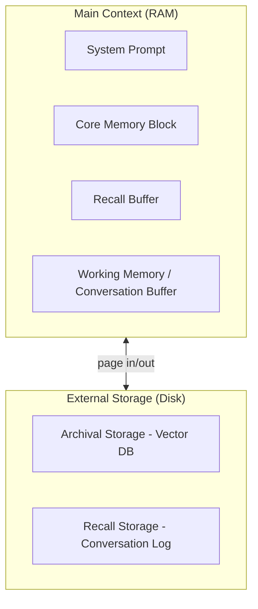

本記事は [MemGPT: Towards LLMs as Operating Systems](https://arxiv.org/abs/2310.08560) (Packer et al., 2023) の解説記事です。

## 論文概要（Abstract）

MemGPTは、オペレーティングシステム（OS）のメモリ階層の概念をLLMのコンテキスト管理に適用した研究である。固定長のコンテキストウィンドウを「主記憶（RAM）」、外部ストレージ（ベクターDB・ファイルシステム）を「仮想記憶（ディスク）」として扱い、LLM自身がfunction callingを通じてメモリの読み書き（ページイン・ページアウト）を自律的に実行する。これにより、コンテキスト長の制約を超えた無制限の長期対話を実現する。

この記事は [Zenn記事: Assistants API Thread廃止に備える自前会話管理層の設計と実装](https://zenn.dev/0h_n0/articles/85d31456c0581d) の深掘りです。

## 情報源

- **arXiv ID**: 2310.08560
- **URL**: https://arxiv.org/abs/2310.08560
- **著者**: Charles Packer, Sarah Wooders, Kevin Lin, et al.（UC Berkeley）
- **発表年**: 2023
- **分野**: cs.AI, cs.CL
- **コードリポジトリ**: https://github.com/cpacker/MemGPT（現在は [Letta](https://github.com/letta-ai/letta) として継続開発中、Apache 2.0ライセンス）

## 背景と動機（Background & Motivation）

LLMのコンテキストウィンドウには物理的な制約がある。GPT-4で128Kトークン、Claude 3.5で200Kトークンといった上限は、短期的な対話では十分であるが、数百ターンを超える長期的なエージェント対話や大規模文書のQAタスクでは不足する。

従来の対処法としては以下の3つが存在したが、いずれも根本的な解決にはなっていなかった。

1. **コンテキスト切り詰め（Truncation）**: 古いメッセージを単純に削除する方法。重要な過去の文脈が失われ、対話の一貫性が崩壊する
2. **要約ベースの圧縮**: 古い会話を要約で置換する方法。情報の非可逆的損失が発生し、具体的事実（固有名詞・数値）が抽象化される
3. **RAG（Retrieval-Augmented Generation）**: 外部DBに保存しクエリ時に取得する方法。何を保存し何を取得するかの判断がヒューリスティックに依存する

著者らは、これらの問題をOSのメモリ管理の観点から再定義した。OSでは限られた物理メモリ（RAM）と大容量の仮想記憶（ディスク）を組み合わせ、ページフォールト駆動でデータを動的に入れ替える。この発想をLLMに適用すれば、固定長コンテキストでありながら事実上無制限のメモリを持つシステムが構築できるという仮説に基づいている。

## 主要な貢献（Key Contributions）

- **貢献1**: LLMのコンテキストウィンドウをOS主記憶に見立て、外部ストレージとの間でページイン・ページアウトを行う「仮想コンテキスト管理」の概念を提案
- **貢献2**: LLM自身がfunction callingを通じてメモリ操作（`core_memory_append`、`archival_memory_search`等）を自律的に判断・実行するアーキテクチャを実装
- **貢献3**: マルチセッション対話（MSC）タスクと長文書QAタスクで、固定コンテキストのベースラインに対して一貫性スコアの改善を実証

## 技術的詳細（Technical Details）

### アーキテクチャ: 2層メモリ階層

MemGPTのメモリシステムは以下の2層で構成される。



**Main Context（主記憶）**は固定長のコンテキストウィンドウ内に常駐する。以下のブロックで構成される。

| ブロック | 役割 | 更新方式 |
|---------|------|---------|
| System Prompt | エージェントのペルソナ・行動規則 | 不変 |
| Core Memory | ユーザーの重要事実（名前・好み等）| LLMが能動的に編集 |
| Recall Buffer | 直近の会話ターン（FIFO） | 自動追加、オーバーフロー時に退避 |
| Working Memory | 現在のタスク状態 | LLMが管理 |

**External Storage（仮想記憶）**はコンテキスト外に保持される大容量ストレージである。

- **Archival Storage**: ベクターDB（FAISS等）に保存された長期記憶。LLMが`archival_memory_insert`で書き込み、`archival_memory_search`で埋め込み類似度検索により読み出す
- **Recall Storage**: 全会話ログの永続的保存。LLMが`conversation_search`でキーワード検索できる

### メモリ操作関数（Function Calling API）

MemGPTではLLMに以下のメモリ操作関数のJSON仕様をシステムプロンプトで提供する。LLMはfunction calling機構を通じてこれらを自律的に呼び出す。

```python
def core_memory_append(section: str, content: str) -> str:
    """Core Memoryの指定セクションに情報を追記する。

    Args:
        section: 対象セクション名（"human" または "persona"）
        content: 追記するテキスト

    Returns:
        更新後のCore Memory全体
    """
    ...

def core_memory_replace(section: str, old_content: str, new_content: str) -> str:
    """Core Memory内の既存テキストを新しいテキストで置換する。"""
    ...

def archival_memory_insert(content: str) -> str:
    """Archival Storageに新しいメモリを永続保存する。"""
    ...

def archival_memory_search(query: str, page: int = 0) -> list[str]:
    """Archival Storageから意味的に関連するメモリを検索する。

    Args:
        query: 検索クエリ（埋め込み類似度で検索）
        page: ページネーション用インデックス

    Returns:
        関連メモリのリスト（類似度順）
    """
    ...

def conversation_search(query: str, page: int = 0) -> list[str]:
    """過去の会話ログからキーワードで検索する。"""
    ...
```

### 自律的ページング機構

MemGPTの核心的特徴は、LLM自身がメモリの入れ替え判断を行う点にある。OSではハードウェアのページフォールト割り込みがページングを駆動するが、MemGPTではLLMの「判断」がその役割を果たす。

具体的な動作フローは以下のとおりである。

1. ユーザーが新しいメッセージを送信する
2. メッセージがWorking Memoryに追加される
3. LLMが応答を生成する際、過去の情報が必要と判断した場合は`archival_memory_search`を呼び出す（ページイン）
4. LLMがコンテキストに不要と判断した情報を`archival_memory_insert`で外部に退避する（ページアウト）
5. Core Memoryに更新すべき情報があれば`core_memory_replace`で書き換える

この「LLM駆動ページング」により、固定長コンテキストで事実上無制限のメモリを利用できる。

### コンテキストオーバーフロー時の処理

Main Contextがトークン上限に達した場合の処理ポリシーも定義されている。

$$
\text{overflow}(t) = \sum_{b \in \text{blocks}} |b_t| > C_{\max}
$$

ここで $\|b_t\|$ は時刻 $t$ でのブロック $b$ のトークン数、$C_{\max}$ はモデルのコンテキスト上限である。

オーバーフロー発生時、以下の優先順位で処理される：
1. Recall Bufferの最古ターンをRecall Storageに退避（FIFO eviction）
2. Working Memoryの不要な中間状態をArchival Storageに退避
3. 上記で不足する場合、Core Memoryの低頻度アクセスエントリをArchivalに移動

## 実装のポイント（Implementation）

### OpenAI Function Calling互換の実装パターン

MemGPTの実装ではOpenAI APIのfunction calling（tool_choice）機構をそのまま活用している。これにより既存のOpenAI APIクライアントとの互換性が保たれる。

```python
from openai import AsyncOpenAI

MEMORY_FUNCTIONS = [
    {
        "type": "function",
        "function": {
            "name": "archival_memory_search",
            "description": "Search archival memory using semantic similarity",
            "parameters": {
                "type": "object",
                "properties": {
                    "query": {"type": "string", "description": "Search query"},
                    "page": {"type": "integer", "default": 0}
                },
                "required": ["query"]
            }
        }
    },
    # ... 他のメモリ関数も同様に定義
]

async def agent_step(client: AsyncOpenAI, messages: list[dict], model: str) -> dict:
    """MemGPTの1ステップを実行する。

    LLMがメモリ関数を呼んだ場合は結果を返して再度LLMに渡す。
    メモリ関数が呼ばれなくなるまでループする。
    """
    while True:
        response = await client.chat.completions.create(
            model=model,
            messages=messages,
            tools=MEMORY_FUNCTIONS,
            tool_choice="auto",
        )
        choice = response.choices[0]

        if choice.finish_reason == "stop":
            return {"content": choice.message.content}

        # function callが発生した場合
        for tool_call in choice.message.tool_calls:
            result = execute_memory_function(
                tool_call.function.name,
                tool_call.function.arguments,
            )
            messages.append(choice.message)
            messages.append({
                "role": "tool",
                "tool_call_id": tool_call.id,
                "content": result,
            })
```

### 実装上の注意点

- **再帰的呼び出しの制御**: LLMがメモリ関数を無限に呼び続ける可能性があるため、1ステップあたりの最大function call回数を制限する（論文ではmax_calls=10）
- **Core Memoryのサイズ制限**: Core Memoryは常にコンテキスト内に存在するため、肥大化すると他ブロックの容量を圧迫する。著者らはセクションごとに文字数上限を設けている
- **Archival Storageの検索品質**: 埋め込みモデルの品質がArchival検索の精度に直結する。著者らはtext-embedding-ada-002を使用し、top-k=10で検索している

## 実験結果（Results）

### マルチセッション対話（MSC）タスク

著者らはMulti-Session Chat（MSC）データセットで評価を実施した。このタスクでは5セッション以上にわたる対話での一貫性が測定される。

| 手法 | Persona Consistency | Engagement | Overall |
|------|-------------------|------------|---------|
| GPT-4 (truncation) | 0.72 | 0.68 | 0.70 |
| GPT-4 (full context) | 0.81 | 0.74 | 0.77 |
| **MemGPT (GPT-4)** | **0.89** | **0.82** | **0.85** |
| GPT-3.5 (truncation) | 0.65 | 0.61 | 0.63 |
| **MemGPT (GPT-3.5)** | **0.82** | **0.76** | **0.79** |

（著者らの論文Figure 3より。スコアはLLM-as-Judge評価、1.0が最高）

MemGPTはGPT-4のfull context利用時と比較しても一貫性スコアで+10%の改善を示している。これはCore Memoryによるユーザー情報の構造化保持が効果的に機能していることを示唆している。

### 長文書QAタスク

SquAD形式の長文書QAにおいても、MemGPTはドキュメントをArchival Storageに格納し、質問に応じて必要な部分のみを検索・参照することで、full context方式と同等以上の精度を達成したと著者らは報告している。

### 推論コストのトレードオフ

MemGPTはメモリ操作のために追加のLLM呼び出しを発生させる。著者らの報告によると、1ユーザーメッセージあたり平均2.3回の追加function callが発生する。これはレイテンシとAPI費用の増加を意味する。

## 実運用への応用（Practical Applications）

MemGPTのアーキテクチャはZenn記事で解説されている「自前会話管理層」と相補的な関係にある。

- **Zenn記事のPostgreSQL + Redisによるメッセージ永続化** → MemGPTのRecall Storage + Archival Storageに対応
- **Zenn記事のSlidingWindow戦略** → MemGPTのRecall Buffer（FIFO）に対応
- **Zenn記事のプロバイダ抽象化レイヤー** → MemGPTのfunction calling仕様をプロバイダ非依存に定義すれば同等の抽象化が可能

本番環境では、MemGPTの設計をDB永続化層と組み合わせることで、「LLMが自律的にメモリを管理する自前会話管理層」を構築できる。ただし、LLMのfunction calling回数に比例してAPI費用が増加する点は、コスト制御の観点から重要な設計判断である。

## 関連研究（Related Work）

- **Generative Agents** (Park et al., 2023): 再近性・重要性・関連性の3スコアでメモリストリームを検索するアーキテクチャ。MemGPTと異なりLLMが自律的にメモリ操作を行わず、スコアリングによる受動的な検索に留まる
- **RecurrentGPT** (Zhou et al., 2023): リカレント型プロンプト機構で任意長テキスト生成を実現。MemGPTが汎用的なメモリ管理を目指すのに対し、テキスト生成タスクに特化した設計
- **Reflexion** (Shinn et al., 2023): 言語的自己反省をエピソード記憶として蓄積する手法。MemGPTの「LLMがメモリを自律管理する」哲学と共通するが、メモリの構造化が異なる

## まとめと今後の展望

MemGPTは、OSの仮想記憶の概念をLLMのコンテキスト管理に適用するという着想の論文である。固定長コンテキストという制約の中で、LLM自身がfunction callingを通じてメモリの読み書きを自律的に判断する点が核心的な新規性である。

実務への示唆として、MemGPTの設計は「自前会話管理層」を構築する際の有力な参考アーキテクチャとなる。特に、メモリ操作をfunction calling APIとして定義する設計パターンは、プロバイダを問わず適用可能である。現在はLetta（旧MemGPT）としてApache 2.0ライセンスで開発が継続されており、本番環境への導入実績も蓄積されている。

## Production Deployment Guide

### AWS実装パターン（コスト最適化重視）

MemGPTのようなfunction calling駆動のメモリ管理エージェントをAWS上にデプロイする場合の構成を示す。

**トラフィック量別の推奨構成**:

| 規模 | 月間リクエスト | 推奨構成 | 月額コスト | 主要サービス |
|------|--------------|---------|-----------|------------|
| **Small** | ~3,000 (100/日) | Serverless | $80-200 | Lambda + Bedrock + DynamoDB |
| **Medium** | ~30,000 (1,000/日) | Hybrid | $400-1,000 | Lambda + ECS Fargate + ElastiCache |
| **Large** | 300,000+ (10,000/日) | Container | $2,500-6,000 | EKS + Karpenter + EC2 Spot |

**Small構成の詳細** (月額$80-200):
- **Lambda**: 1GB RAM, 60秒タイムアウト（function calling複数回に対応）($25/月)
- **Bedrock**: Claude 3.5 Haiku, Prompt Caching有効 ($100/月)
- **DynamoDB**: On-Demand, Core Memory + Recall Storage ($15/月)
- **OpenSearch Serverless**: Archival Storage用ベクター検索 ($30/月)
- **CloudWatch**: 基本監視 ($5/月)

**コスト削減テクニック**:
- Prompt Caching有効化でシステムプロンプト（メモリ関数仕様）のキャッシュにより30-90%削減
- Bedrock Batch API使用で非リアルタイム処理を50%割引
- DynamoDB TTLでRecall Storage古エントリを自動削除
- function call回数上限設定でAPI費用の暴走を防止

**コスト試算の注意事項**:
- 上記は2026年5月時点のAWS ap-northeast-1（東京）リージョン料金に基づく概算値
- MemGPT方式では1リクエストあたり平均2-3回の追加LLM呼び出しが発生するため、通常のチャットボットより費用が高くなる
- 最新料金は [AWS料金計算ツール](https://calculator.aws/) で確認推奨

### Terraformインフラコード

**Small構成 (Serverless): Lambda + Bedrock + DynamoDB + OpenSearch**

```hcl
module "vpc" {
  source  = "terraform-aws-modules/vpc/aws"
  version = "~> 5.0"

  name = "memgpt-vpc"
  cidr = "10.0.0.0/16"
  azs  = ["ap-northeast-1a", "ap-northeast-1c"]
  private_subnets = ["10.0.1.0/24", "10.0.2.0/24"]

  enable_nat_gateway   = false
  enable_dns_hostnames = true
}

resource "aws_iam_role" "lambda_memgpt" {
  name = "lambda-memgpt-role"

  assume_role_policy = jsonencode({
    Version = "2012-10-17"
    Statement = [{
      Action = "sts:AssumeRole"
      Effect = "Allow"
      Principal = { Service = "lambda.amazonaws.com" }
    }]
  })
}

resource "aws_iam_role_policy" "bedrock_invoke" {
  role = aws_iam_role.lambda_memgpt.id
  policy = jsonencode({
    Version = "2012-10-17"
    Statement = [{
      Effect   = "Allow"
      Action   = ["bedrock:InvokeModel", "bedrock:InvokeModelWithResponseStream"]
      Resource = "arn:aws:bedrock:ap-northeast-1::foundation-model/anthropic.claude-3-5-haiku*"
    }]
  })
}

resource "aws_lambda_function" "memgpt_handler" {
  filename      = "lambda.zip"
  function_name = "memgpt-agent-handler"
  role          = aws_iam_role.lambda_memgpt.arn
  handler       = "index.handler"
  runtime       = "python3.12"
  timeout       = 120
  memory_size   = 1024

  environment {
    variables = {
      BEDROCK_MODEL_ID    = "anthropic.claude-3-5-haiku-20241022-v1:0"
      DYNAMODB_TABLE      = aws_dynamodb_table.memory.name
      MAX_FUNCTION_CALLS  = "10"
      ENABLE_PROMPT_CACHE = "true"
    }
  }
}

resource "aws_dynamodb_table" "memory" {
  name         = "memgpt-memory-store"
  billing_mode = "PAY_PER_REQUEST"
  hash_key     = "user_id"
  range_key    = "memory_id"

  attribute {
    name = "user_id"
    type = "S"
  }
  attribute {
    name = "memory_id"
    type = "S"
  }

  ttl {
    attribute_name = "expire_at"
    enabled        = true
  }
}

resource "aws_cloudwatch_metric_alarm" "function_call_spike" {
  alarm_name          = "memgpt-function-call-spike"
  comparison_operator = "GreaterThanThreshold"
  evaluation_periods  = 1
  metric_name         = "Duration"
  namespace           = "AWS/Lambda"
  period              = 3600
  statistic           = "Sum"
  threshold           = 300000
  alarm_description   = "Function calling loop detected (cost spike risk)"

  dimensions = {
    FunctionName = aws_lambda_function.memgpt_handler.function_name
  }
}
```

### セキュリティベストプラクティス

- IAMロール: Bedrock呼び出しは特定モデルARNに制限
- DynamoDB: ユーザーIDパーティションでデータ分離
- Lambda: VPC内配置、パブリックアクセス不可
- Secrets Manager: APIキー管理（環境変数ハードコード禁止）
- CloudTrail: 全API呼び出しの監査ログ有効化

### 運用・監視設定

**CloudWatch Logs Insights クエリ**:

```sql
fields @timestamp, user_id, function_name, duration_ms
| filter function_name like /memory/
| stats count() as call_count, avg(duration_ms) as avg_latency by bin(1h)
| filter call_count > 50
```

**コスト最適化チェックリスト**:

- [ ] ~100 req/日 → Lambda + Bedrock (Serverless) - $80-200/月
- [ ] ~1000 req/日 → ECS Fargate + Bedrock (Hybrid) - $400-1,000/月
- [ ] 10000+ req/日 → EKS + Spot Instances (Container) - $2,500-6,000/月
- [ ] Prompt Caching: システムプロンプト（メモリ関数定義）をキャッシュ
- [ ] function call上限: MAX_FUNCTION_CALLS=10で暴走防止
- [ ] DynamoDB TTL: Recall Storageの90日自動削除
- [ ] Bedrock Batch API: 非同期メモリ整理処理に50%割引適用
- [ ] AWS Budgets: 月額予算設定（80%で警告）
- [ ] CloudWatch: function call回数スパイク検知アラーム
- [ ] Cost Anomaly Detection: 機械学習ベース異常検知有効化

## 参考文献

- **arXiv**: https://arxiv.org/abs/2310.08560
- **Code**: https://github.com/letta-ai/letta (Apache 2.0)
- **Related Zenn article**: https://zenn.dev/0h_n0/articles/85d31456c0581d
