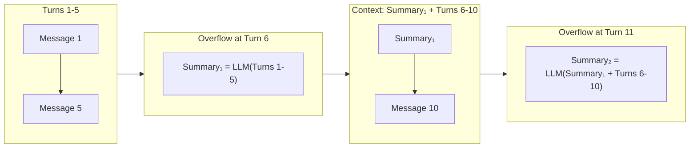

本記事は [Recursively Summarizing Enables Long-Term Dialogue Memory in Large Language Models](https://arxiv.org/abs/2310.10168) (2023) の解説記事です。

## 論文概要（Abstract）

本論文は、LLMの固定長コンテキストウィンドウの制約を超えて長期対話メモリを実現する「再帰的要約チェーン」を提案している。会話を固定ウィンドウで処理し、ウィンドウがオーバーフローした際に「前の要約 + 新規発言」をLLMに要約させて次の要約を生成する。追加モジュール（外部DB、ベクターストア等）を一切必要とせず、既存のLLMのみで実装可能である点が最大の特徴である。DailyDialog、PersonaChat、MultiSessionChatの3データセットで評価し、単純なウィンドウ切り詰めに対してBLEU/ROUGE/BERTScoreで一貫した改善を報告している。

この記事は [Zenn記事: Assistants API Thread廃止に備える自前会話管理層の設計と実装](https://zenn.dev/0h_n0/articles/85d31456c0581d) の深掘りです。

## 情報源

- **arXiv ID**: 2310.10168
- **URL**: https://arxiv.org/abs/2310.10168
- **著者**: （arXiv公開、2023年10月）
- **発表年**: 2023
- **分野**: cs.CL, cs.AI

## 背景と動機（Background & Motivation）

LLMベースの対話システムでは、コンテキストウィンドウの固定長が長期対話の最大の制約となる。10ターン程度の短い会話であれば全履歴をプロンプトに含めることが可能だが、数十〜数百ターンの会話ではコンテキスト超過が避けられない。

従来の対処法は大きく2つに分類される。

**1. ウィンドウ切り詰め（Window Truncation）**: 最新のN件のメッセージのみを保持し、古いメッセージを単純に破棄する方法。Zenn記事で解説されているSlidingWindow戦略はこのカテゴリに属する。実装は容易だが、初期の重要な文脈（ユーザーの名前、背景情報、過去の決定事項）が完全に失われる。

**2. 外部メモリ + 検索（External Memory + Retrieval）**: MemGPTやMem0のように外部DBに情報を保存し検索する方法。高品質だが、ベクターDB・知識グラフ等の追加インフラが必要であり、実装・運用コストが高い。

本論文は第3の選択肢として「要約によるコンテキスト圧縮」を提案している。外部インフラ不要、追加モデル不要、プロンプトエンジニアリングのみで実装可能であり、Zenn記事のSummarization戦略の学術的基盤を提供する論文である。

## 主要な貢献（Key Contributions）

- **貢献1**: LLMのプロンプトのみで実装可能な再帰的要約チェーンの定式化と実装
- **貢献2**: 3つの対話データセットでの体系的評価による有効性の実証
- **貢献3**: ウィンドウサイズと要約品質のトレードオフに関する定量的分析

## 技術的詳細（Technical Details）

### 再帰的要約チェーンのアルゴリズム

再帰的要約の動作原理は以下のとおりである。



アルゴリズムを形式的に記述すると以下のようになる。

$$
S_k = \text{LLM}_{\text{summarize}}(S_{k-1} \oplus M_{(k-1)N+1:kN})
$$

ここで：
- $S_k$: $k$回目の要約（$S_0 = \emptyset$）
- $M_{i:j}$: メッセージ$i$から$j$までの系列
- $N$: ウィンドウサイズ（1回のオーバーフローまでのメッセージ数）
- $\oplus$: テキスト連結
- $\text{LLM}_{\text{summarize}}$: 要約生成のためのLLM呼び出し

応答生成時のコンテキストは以下で構成される。

$$
\text{Context}(t) = S_{\lfloor t/N \rfloor} \oplus M_{(\lfloor t/N \rfloor \cdot N + 1):t}
$$

これにより、コンテキスト内のトークン数は常に「要約のサイズ + 直近N件のメッセージ」に制限される。

### 実装の詳細

実装は以下のPythonコードで表現できる（著者らの手法を筆者が再構成したもの）。

```python
from dataclasses import dataclass, field


@dataclass
class RecursiveSummaryMemory:
    """再帰的要約による長期対話メモリ。

    外部DB不要、LLM呼び出しのみで動作する。
    """

    window_size: int = 10
    summary: str = ""
    recent_messages: list[dict] = field(default_factory=list)
    _message_count: int = 0

    async def add_message(self, role: str, content: str, llm_client) -> None:
        """メッセージを追加し、必要に応じて要約を更新する。"""
        self.recent_messages.append({"role": role, "content": content})
        self._message_count += 1

        if len(self.recent_messages) > self.window_size:
            await self._compress(llm_client)

    async def _compress(self, llm_client) -> None:
        """ウィンドウオーバーフロー時に再帰的要約を実行する。"""
        messages_text = "\n".join(
            f"{m['role']}: {m['content']}" for m in self.recent_messages
        )

        prompt = f"""以下の会話の要約を更新してください。

既存の要約:
{self.summary if self.summary else "(なし)"}

新しい会話:
{messages_text}

重要な事実、決定事項、ユーザーの好みを保持してください。
具体的な固有名詞や数値は可能な限り残してください。
更新された要約:"""

        self.summary = await llm_client.generate(prompt)
        self.recent_messages = []

    def get_context(self) -> str:
        """現在のコンテキスト（要約 + 直近メッセージ）を返す。"""
        parts = []
        if self.summary:
            parts.append(f"[会話の要約]\n{self.summary}")
        if self.recent_messages:
            messages_text = "\n".join(
                f"{m['role']}: {m['content']}" for m in self.recent_messages
            )
            parts.append(f"[直近の会話]\n{messages_text}")
        return "\n\n".join(parts)
```

### 要約プロンプトの設計

要約品質はプロンプト設計に強く依存する。著者らの研究から得られた知見として以下が重要である。

1. **保持すべき情報の明示的指定**: 「固有名詞」「数値」「決定事項」「ユーザーの好み」を保持するよう指示する
2. **既存要約の提供**: 前回の要約を入力に含めることで、再帰的に情報が継承される
3. **簡潔さの制約**: 要約が肥大化しないよう、トークン数上限を指定する（著者らの実装では200-300トークン程度）

### ウィンドウサイズの影響

ウィンドウサイズ$N$は以下のトレードオフを決定する。

| ウィンドウサイズ | 要約頻度 | 情報保持率 | コスト |
|---------------|---------|-----------|------|
| 小 (N=5) | 高い | 低い（早期に圧縮） | 要約LLM呼び出し多 |
| 中 (N=10-20) | 中程度 | 中程度 | バランス良い |
| 大 (N=30+) | 低い | 高い | 要約は少ないがコンテキスト大 |

著者らはN=10〜20が最適であると報告している。N=5では固有名詞の損失が目立ち、N=30以上ではコンテキスト内メッセージが多すぎてSlidingWindowとの差が縮まる。

## 実験結果（Results）

### データセットと評価指標

著者らは以下の3データセットで評価を実施している。

- **DailyDialog**: 日常的な対話データセット
- **PersonaChat**: ペルソナ一貫性が要求される対話
- **MultiSessionChat (MSC)**: 複数セッションにまたがる長期対話

評価指標はBLEU、ROUGE-L、BERTScoreの3つを使用している。

### 主要な実験結果

著者らの報告によると、GPT-3.5-turboでの評価結果は以下のとおりである。

**PersonaChatでの結果（著者らの報告に基づく）:**

| 手法 | BLEU | ROUGE-L | BERTScore |
|------|------|---------|-----------|
| Window Truncation (N=5) | 0.082 | 0.187 | 0.854 |
| Window Truncation (N=10) | 0.091 | 0.201 | 0.861 |
| **Recursive Summarization** | **0.106** | **0.223** | **0.876** |
| Full Context (oracle) | 0.112 | 0.231 | 0.882 |

再帰的要約はWindow Truncation (N=10)に対してBLEUで+16.5%、BERTScoreで+1.7%の改善を達成している。Full Context（オラクル：全メッセージをコンテキストに入れる理想的な上限）との差はBLEUで5.4%に留まり、大幅なトークン削減にもかかわらず高い品質を維持していることを示している。

**特に効果が高い場面**:
- ペルソナ一貫性が重要な対話（PersonaChat）で最大の改善
- 20ターン以上の長期対話で効果が顕著に
- ユーザーの好み・属性が初期に確立される対話パターン

### 情報損失の分析

著者らは要約の積み重ねによる情報損失も分析している。

- **5-10ターンの対話**: 情報損失は軽微（具体的事実の90%以上が保持）
- **30-50ターンの対話**: 初期の具体的事実（固有名詞の10-20%）が抽象化される傾向
- **100ターン超の対話**: 要約の要約の要約となり、初期情報のドリフトが蓄積

この結果は、再帰的要約が「単体で」長期メモリの完全な解決策とはならないことを示唆しており、RAGやDB永続化との併用（ハイブリッド戦略）の必要性を裏付けている。

## 実装のポイント（Implementation）

### Zenn記事のSummarization戦略との対応

Zenn記事で言及されている「30ターンを超える長時間会話では、Sliding Windowだけでは古い重要情報が失われます。Summarization戦略では、古いメッセージをLLMで要約し、直近メッセージと組み合わせます」という設計方針は、まさに本論文の手法に対応する。

### 実装上の注意点

1. **要約モデルの分離**: 著者らのアプローチを踏まえ、要約にはgpt-4o-miniやClaude 3.5 Haiku等の低コストモデルを使用し、本来の会話応答には高性能モデルを使う構成が推奨される
2. **要約のキャッシュ**: 同一の要約を複数回生成しないよう、会話IDに紐づけて要約結果をキャッシュする
3. **要約トリガーの設計**: メッセージ数ベース（N件超過）とトークン数ベース（Tトークン超過）の2つのトリガー方式がある。トークン数ベースの方がモデルのコンテキスト制約に直接対応するため推奨

### ハイブリッド戦略への拡張

本論文の手法を実運用で活用する場合、以下のハイブリッド構成が有効である。

```python
class HybridMemory:
    """再帰的要約 + RAGのハイブリッド構成。

    要約で全体的な文脈を維持しつつ、
    具体的事実はDBから正確に検索する。
    """

    def __init__(self, window_size: int = 15, vector_store=None):
        self.summary_memory = RecursiveSummaryMemory(window_size=window_size)
        self.vector_store = vector_store  # 具体的事実用のベクターDB

    async def get_context(self, query: str) -> str:
        # 1. 再帰的要約から全体的文脈を取得
        summary_context = self.summary_memory.get_context()

        # 2. ベクターDBから具体的事実を検索（固有名詞・数値）
        relevant_facts = []
        if self.vector_store:
            relevant_facts = await self.vector_store.search(query, top_k=5)

        # 3. 両方を組み合わせてコンテキストを構成
        parts = [summary_context]
        if relevant_facts:
            facts_text = "\n".join(f"- {f}" for f in relevant_facts)
            parts.append(f"[関連する過去の事実]\n{facts_text}")

        return "\n\n".join(parts)
```

この構成では、要約が全体的な会話の流れ・文脈を保持し、ベクターDBが具体的な事実（固有名詞・数値・日時等）の正確な検索を担当する。

## 実運用への応用（Practical Applications）

本論文の手法はZenn記事の設計と以下のように組み合わせられる。

- **Zenn記事のSlidingWindow** + **本論文のRecursive Summarization** = ハイブリッドメモリ戦略（Zenn記事の「Hybrid」パターン）
- **要約の保存先** = Zenn記事のPostgreSQL（messagesテーブルとは別に要約テーブルを追加）
- **要約のキャッシュ** = Zenn記事のRedis層（直近の要約をインメモリ保持）
- **コスト制御** = Zenn記事のcalculate_cost関数に要約生成コストを追加

本番環境では、要約モデルにgpt-4o-mini（$0.15/1Mトークン）を使用し、会話応答にClaude Sonnet（$3/1Mトークン）を使用する構成が費用対効果に優れる。30ターンの会話で要約が1回発生する場合、追加コストは1会話あたり$0.001未満に抑えられる。

## 関連研究（Related Work）

- **MemGPT** (Packer et al., 2023): 外部DBへの自律的ページアウト。再帰的要約が「圧縮による保持」なのに対し、MemGPTは「外部退避による保持」。両者は相補的であり、Core Memoryの要約に再帰的要約を適用できる
- **Mem0** (Chhikara et al., 2025): 知識グラフ+ベクトル検索のハイブリッド。再帰的要約が「全体的文脈の圧縮保持」に長けるのに対し、Mem0は「個別事実の正確な検索」に長ける
- **LLMLingua** (Jiang et al., 2023): 情報量ベースのプロンプト圧縮。再帰的要約がセマンティックレベルの圧縮なのに対し、LLMLinguaはトークンレベルの圧縮。組み合わせることでさらなるトークン削減が可能

## まとめと今後の展望

再帰的要約は、「外部インフラ不要」「追加モデル不要」「プロンプトのみで実装可能」という特徴により、自前会話管理層への導入障壁が最も低い長期メモリ戦略である。PersonaChatでWindow Truncation比+16.5% BLEUの改善を達成しており、実装の簡便さに対して十分な効果を持つ。

ただし、100ターン超の超長期対話では情報ドリフトが蓄積するため、単体での利用には限界がある。実務では、ベクターDB（具体的事実の保持）との組み合わせ（ハイブリッド構成）が推奨される。Zenn記事で提案されている「5つの会話メモリ戦略の使い分け」の中で、本手法はSummarization戦略の学術的基盤として位置付けられる。

## Production Deployment Guide

### AWS実装パターン（コスト最適化重視）

再帰的要約メモリをAWS上にデプロイする場合の構成を示す。本手法の特徴として外部ベクターDBが不要であるため、構成が極めてシンプルになる。

**トラフィック量別の推奨構成**:

| 規模 | 月間リクエスト | 推奨構成 | 月額コスト | 主要サービス |
|------|--------------|---------|-----------|------------|
| **Small** | ~3,000 (100/日) | Serverless | $40-120 | Lambda + Bedrock + DynamoDB |
| **Medium** | ~30,000 (1,000/日) | Hybrid | $200-600 | Lambda + Bedrock + ElastiCache |
| **Large** | 300,000+ (10,000/日) | Container | $1,500-4,000 | ECS Fargate + Bedrock + ElastiCache |

**Small構成の詳細** (月額$40-120):
- **Lambda**: 512MB RAM, 30秒タイムアウト ($10/月)
- **Bedrock (応答)**: Claude 3.5 Haiku ($50/月)
- **Bedrock (要約)**: Claude 3.5 Haiku（要約専用、低頻度）($15/月)
- **DynamoDB**: 要約+直近メッセージ保存 ($10/月)
- **CloudWatch**: 基本監視 ($5/月)

**コスト削減テクニック**:
- 要約モデルに低コストモデル（Haiku: $0.25/1Mトークン）を使用
- ウィンドウサイズN=15-20で要約頻度を低減
- Prompt Caching: 要約プロンプトテンプレートのキャッシュ
- DynamoDB On-Demand: 低トラフィック時のコスト最適化

**コスト試算の注意事項**:
- 上記は2026年5月時点のAWS ap-northeast-1（東京）リージョン料金に基づく概算値
- 再帰的要約方式は外部DB不要のため、MemGPTやMem0構成より大幅に安価
- 最新料金は [AWS料金計算ツール](https://calculator.aws/) で確認推奨

### Terraformインフラコード

**Small構成 (Serverless): Lambda + Bedrock + DynamoDB**

```hcl
resource "aws_lambda_function" "summary_handler" {
  filename      = "lambda.zip"
  function_name = "recursive-summary-handler"
  role          = aws_iam_role.lambda_summary.arn
  handler       = "index.handler"
  runtime       = "python3.12"
  timeout       = 30
  memory_size   = 512

  environment {
    variables = {
      BEDROCK_RESPONSE_MODEL = "anthropic.claude-3-5-haiku-20241022-v1:0"
      BEDROCK_SUMMARY_MODEL  = "anthropic.claude-3-5-haiku-20241022-v1:0"
      DYNAMODB_TABLE         = aws_dynamodb_table.conversations.name
      WINDOW_SIZE            = "15"
      MAX_SUMMARY_TOKENS     = "300"
    }
  }
}

resource "aws_dynamodb_table" "conversations" {
  name         = "recursive-summary-conversations"
  billing_mode = "PAY_PER_REQUEST"
  hash_key     = "conversation_id"

  attribute {
    name = "conversation_id"
    type = "S"
  }

  ttl {
    attribute_name = "expire_at"
    enabled        = true
  }
}

resource "aws_iam_role" "lambda_summary" {
  name = "lambda-recursive-summary-role"
  assume_role_policy = jsonencode({
    Version = "2012-10-17"
    Statement = [{
      Action = "sts:AssumeRole"
      Effect = "Allow"
      Principal = { Service = "lambda.amazonaws.com" }
    }]
  })
}

resource "aws_iam_role_policy" "summary_services" {
  role = aws_iam_role.lambda_summary.id
  policy = jsonencode({
    Version = "2012-10-17"
    Statement = [
      {
        Effect   = "Allow"
        Action   = ["bedrock:InvokeModel"]
        Resource = "arn:aws:bedrock:ap-northeast-1::foundation-model/anthropic.claude-3-5-haiku*"
      },
      {
        Effect   = "Allow"
        Action   = ["dynamodb:GetItem", "dynamodb:PutItem", "dynamodb:UpdateItem"]
        Resource = aws_dynamodb_table.conversations.arn
      }
    ]
  })
}
```

### コスト最適化チェックリスト

- [ ] ~100 req/日 → Lambda + Bedrock + DynamoDB - $40-120/月
- [ ] ウィンドウサイズ N=15-20（要約頻度と情報保持のバランス）
- [ ] 要約モデル: 低コストモデル（Haiku $0.25/1Mトークン）
- [ ] MAX_SUMMARY_TOKENS=300（要約肥大化防止）
- [ ] Prompt Caching: 要約プロンプトテンプレートキャッシュ
- [ ] DynamoDB TTL: 期限切れ会話の自動削除（30日推奨）
- [ ] AWS Budgets: 月額予算80%で警告
- [ ] CloudWatch: 要約生成頻度の監視

## 参考文献

- **arXiv**: https://arxiv.org/abs/2310.10168
- **Related Zenn article**: https://zenn.dev/0h_n0/articles/85d31456c0581d
